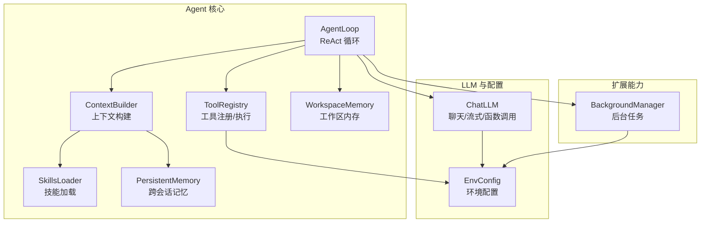
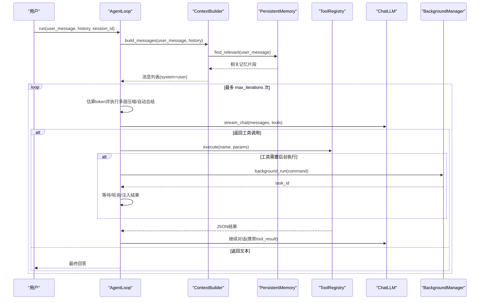
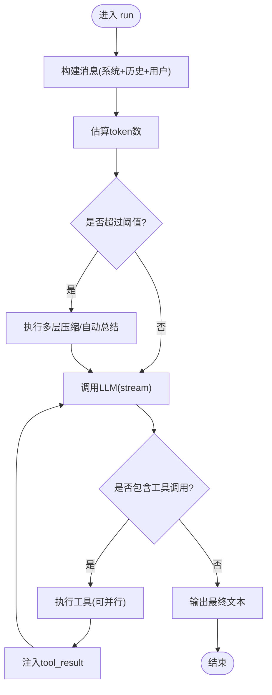
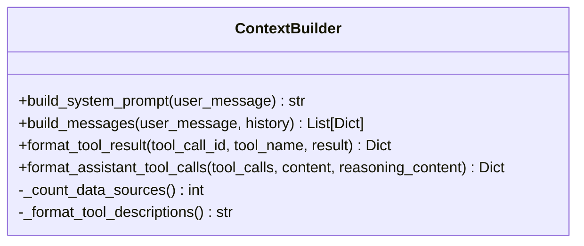
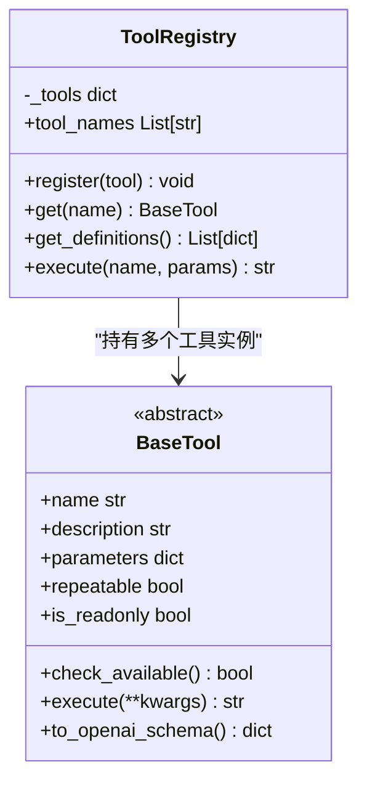
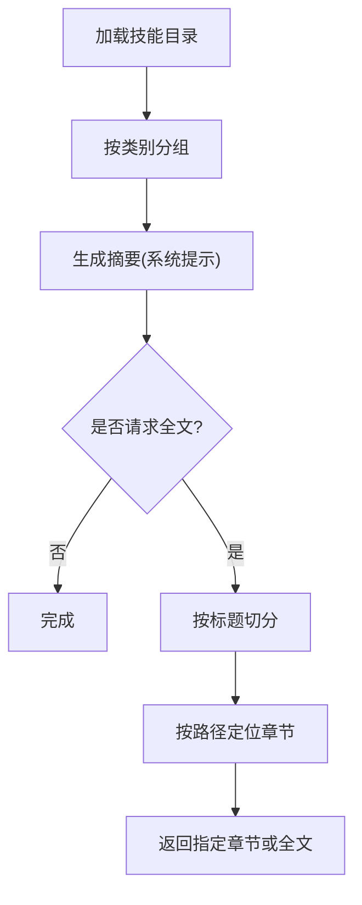
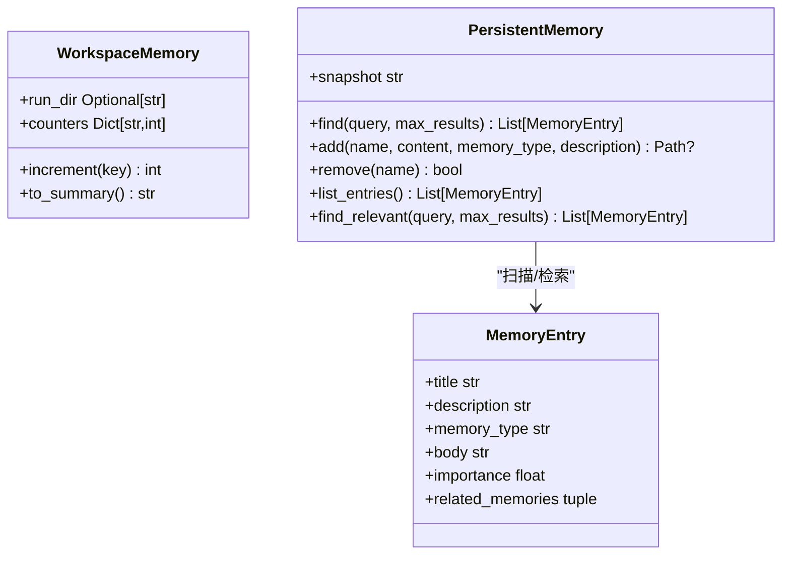
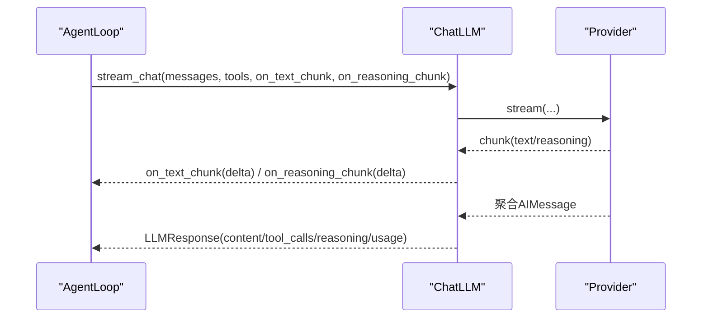
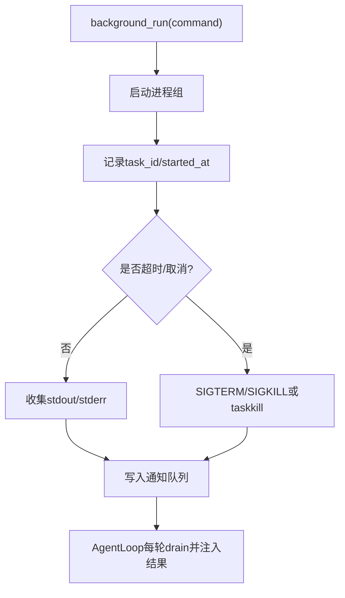
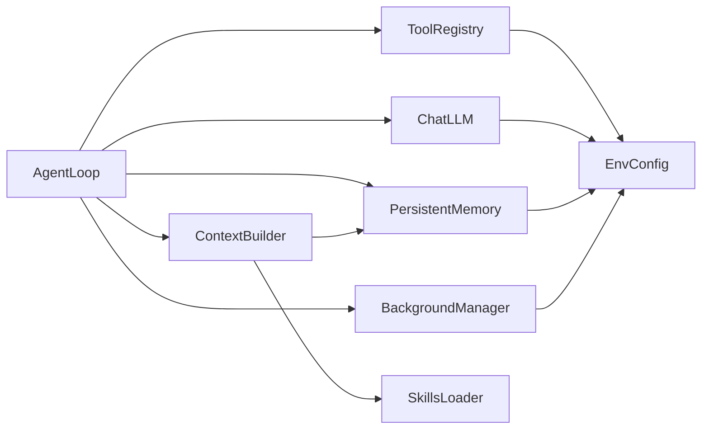

# AI代理系统

<cite>
**本文引用的文件**
- [agent/src/agent/loop.py](file://agent/src/agent/loop.py)
- [agent/src/agent/context.py](file://agent/src/agent/context.py)
- [agent/src/agent/memory.py](file://agent/src/agent/memory.py)
- [agent/src/agent/tools.py](file://agent/src/agent/tools.py)
- [agent/src/agent/skills.py](file://agent/src/agent/skills.py)
- [agent/src/memory/persistent.py](file://agent/src/memory/persistent.py)
- [agent/src/providers/chat.py](file://agent/src/providers/chat.py)
- [agent/src/config/accessor.py](file://agent/src/config/accessor.py)
- [agent/src/config/env_schema.py](file://agent/src/config/env_schema.py)
- [agent/src/tools/background_tools.py](file://agent/src/tools/background_tools.py)
</cite>

## 目录
1. [简介](#简介)
2. [项目结构](#项目结构)
3. [核心组件](#核心组件)
4. [架构总览](#架构总览)
5. [详细组件分析](#详细组件分析)
6. [依赖关系分析](#依赖关系分析)
7. [性能考量](#性能考量)
8. [故障排查指南](#故障排查指南)
9. [结论](#结论)
10. [附录：配置与参数](#附录：配置与参数)

## 简介
本文件面向 Vibe-Trading AI 代理系统的实现细节、调用关系、接口、领域模型和使用模式，重点解释 Agent 循环机制、上下文管理、工具调用流程与记忆系统。文档既适合初学者理解整体工作流，也为有经验的开发者提供代码级深度与优化建议。

## 项目结构
Vibe-Trading 的 Agent 子系统位于 agent/src 下，围绕 ReAct 循环组织：
- 循环控制：AgentLoop（迭代、压缩、追踪、目标延续）
- 上下文构建：ContextBuilder（系统提示、技能摘要、持久化记忆注入）
- 工具基础设施：BaseTool + ToolRegistry（注册、执行、OpenAI schema）
- 技能加载：SkillsLoader（分层披露、章节解析）
- 工作区内存：WorkspaceMemory（单次运行内共享状态）
- 跨会话记忆：PersistentMemory（文件索引、去重、语义链接、FTS）
- LLM 客户端：ChatLLM（同步/流式调用、函数调用、DSML 兼容）
- 配置层：EnvConfig + accessor（单例、线程安全、环境变量映射）
- 后台任务：BackgroundManager + 工具（长耗时命令、通知队列）

图表来源
- [agent/src/agent/loop.py:502-700](file://agent/src/agent/loop.py#L502-L700)
- [agent/src/agent/context.py:210-322](file://agent/src/agent/context.py#L210-L322)
- [agent/src/agent/tools.py:13-95](file://agent/src/agent/tools.py#L13-L95)
- [agent/src/agent/skills.py:100-189](file://agent/src/agent/skills.py#L100-L189)
- [agent/src/memory/persistent.py:196-438](file://agent/src/memory/persistent.py#L196-L438)
- [agent/src/providers/chat.py:272-398](file://agent/src/providers/chat.py#L272-L398)
- [agent/src/config/accessor.py:52-93](file://agent/src/config/accessor.py#L52-L93)
- [agent/src/tools/background_tools.py:102-319](file://agent/src/tools/background_tools.py#L102-L319)

章节来源
- [agent/src/agent/loop.py:502-700](file://agent/src/agent/loop.py#L502-L700)
- [agent/src/agent/context.py:210-322](file://agent/src/agent/context.py#L210-L322)
- [agent/src/agent/tools.py:13-95](file://agent/src/agent/tools.py#L13-L95)
- [agent/src/agent/skills.py:100-189](file://agent/src/agent/skills.py#L100-L189)
- [agent/src/memory/persistent.py:196-438](file://agent/src/memory/persistent.py#L196-L438)
- [agent/src/providers/chat.py:272-398](file://agent/src/providers/chat.py#L272-L398)
- [agent/src/config/accessor.py:52-93](file://agent/src/config/accessor.py#L52-L93)
- [agent/src/tools/background_tools.py:102-319](file://agent/src/tools/background_tools.py#L102-L319)

## 核心组件
- AgentLoop：ReAct 主循环，负责消息压缩、自动总结、工具批处理、目标延续、追踪与使用量统计。
- ContextBuilder：组装系统提示、技能描述、工作区状态、持久化记忆召回，生成 OpenAI 格式消息列表。
- ToolRegistry/BaseTool：统一工具抽象与注册表，支持 OpenAI function calling schema 导出与异常兜底。
- SkillsLoader：渐进式披露技能文档，按标题切分，按需加载全文与支撑文件。
- WorkspaceMemory：单次运行内的轻量共享状态（run_dir、计数器）。
- PersistentMemory：基于文件的跨会话记忆，含索引、去重、重要性衰减、语义链接与 FTS。
- ChatLLM：封装底层 LLM，支持同步/流式调用、函数调用、DSML 工具调用兼容、内容过滤与错误包装。
- BackgroundManager：后台进程组执行、超时终止、取消、通知队列，暴露为工具供 Agent 调用。
- EnvConfig/accessor：集中化的环境变量配置，线程安全的单例访问。

章节来源
- [agent/src/agent/loop.py:502-700](file://agent/src/agent/loop.py#L502-L700)
- [agent/src/agent/context.py:210-322](file://agent/src/agent/context.py#L210-L322)
- [agent/src/agent/tools.py:13-95](file://agent/src/agent/tools.py#L13-L95)
- [agent/src/agent/skills.py:100-189](file://agent/src/agent/skills.py#L100-L189)
- [agent/src/agent/memory.py:13-54](file://agent/src/agent/memory.py#L13-L54)
- [agent/src/memory/persistent.py:196-438](file://agent/src/memory/persistent.py#L196-L438)
- [agent/src/providers/chat.py:272-398](file://agent/src/providers/chat.py#L272-L398)
- [agent/src/tools/background_tools.py:102-319](file://agent/src/tools/background_tools.py#L102-L319)
- [agent/src/config/accessor.py:52-93](file://agent/src/config/accessor.py#L52-L93)

## 架构总览
下图展示一次用户请求从进入 AgentLoop 到返回结果的完整链路，包括上下文构建、工具调用、记忆系统与后台任务集成。

图表来源
- [agent/src/agent/loop.py:624-700](file://agent/src/agent/loop.py#L624-L700)
- [agent/src/agent/context.py:286-322](file://agent/src/agent/context.py#L286-L322)
- [agent/src/memory/persistent.py:358-438](file://agent/src/memory/persistent.py#L358-L438)
- [agent/src/agent/tools.py:72-84](file://agent/src/agent/tools.py#L72-L84)
- [agent/src/providers/chat.py:315-398](file://agent/src/providers/chat.py#L315-L398)
- [agent/src/tools/background_tools.py:110-139](file://agent/src/tools/background_tools.py#L110-L139)

## 详细组件分析

### AgentLoop：ReAct 循环与上下文压缩
- 五层上下文管理：
  - Layer 1 微压缩：在内存压力下清理旧 tool result，保留最近 N 条。
  - Layer 2 上下文折叠：对长文本进行零成本折叠（保留头尾）。
  - Layer 3 自动总结：超过 token 阈值时触发 LLM 结构化总结，带尾部预算保护。
  - Layer 4 显式 compact 工具：由模型主动调用以触发总结。
  - Layer 5 迭代更新：第 N 次压缩会增量更新前序摘要而非从头开始。
- 工具执行：
  - 连续只读工具并行执行（线程池），提升吞吐。
  - 工具结果限制与脱敏，避免泄露敏感信息。
- 目标延续：
  - 结合 goal context，当目标未完成时注入 continuation prompt，推动多轮推进。
- 追踪与用量：
  - 记录每次迭代的 trace、prompt、tool_call、text_delta。
  - 累积 provider 上报的 usage（input/output/total tokens），写入运行目录。

图表来源
- [agent/src/agent/loop.py:227-320](file://agent/src/agent/loop.py#L227-L320)
- [agent/src/agent/loop.py:727-749](file://agent/src/agent/loop.py#L727-L749)
- [agent/src/agent/loop.py:769-800](file://agent/src/agent/loop.py#L769-L800)

章节来源
- [agent/src/agent/loop.py:227-320](file://agent/src/agent/loop.py#L227-L320)
- [agent/src/agent/loop.py:502-700](file://agent/src/agent/loop.py#L502-L700)
- [agent/src/agent/loop.py:727-749](file://agent/src/agent/loop.py#L727-L749)
- [agent/src/agent/loop.py:769-800](file://agent/src/agent/loop.py#L769-L800)

### ContextBuilder：上下文构建与技能注入
- 系统提示：
  - 注入技能数量、工具数量、数据源数量、工具描述、技能摘要、当前时间、工作区状态等。
  - 内置“输出原则”和“任务路由”，指导模型如何正确选择工作流（回测、研究、文档阅读等）。
- 持久化记忆召回：
  - 在用户消息前插入“召回的记忆”片段，增强上下文相关性。
- 工具结果格式化：
  - 将工具执行结果转换为 OpenAI 格式的 tool 消息。
- 助手消息格式化：
  - 保留 reasoning_content 与 extra_content（如 Gemini thought signature）。

图表来源
- [agent/src/agent/context.py:210-322](file://agent/src/agent/context.py#L210-L322)
- [agent/src/agent/context.py:324-396](file://agent/src/agent/context.py#L324-L396)

章节来源
- [agent/src/agent/context.py:210-322](file://agent/src/agent/context.py#L210-L322)
- [agent/src/agent/context.py:324-396](file://agent/src/agent/context.py#L324-L396)

### 工具基础设施：BaseTool 与 ToolRegistry
- BaseTool：
  - 定义 name、description、parameters、repeatable、is_readonly。
  - check_available 用于依赖检查；execute 必须返回 JSON 字符串。
  - to_openai_schema 导出 OpenAI function calling 定义。
- ToolRegistry：
  - 维护工具字典，支持 get、get_definitions、execute。
  - 执行失败时捕获异常并返回结构化错误 JSON。

图表来源
- [agent/src/agent/tools.py:13-95](file://agent/src/agent/tools.py#L13-L95)

章节来源
- [agent/src/agent/tools.py:13-95](file://agent/src/agent/tools.py#L13-L95)

### 技能系统：SkillsLoader
- 渐进式披露：
  - 系统提示仅注入技能摘要（get_descriptions），全文通过 load_skill 按需加载。
- 文档切分：
  - 按 ATX 标题解析文档结构，支持层级导航与路径定位。
- 用户技能覆盖：
  - 用户目录优先于内置目录，便于自定义与补丁。

图表来源
- [agent/src/agent/skills.py:100-189](file://agent/src/agent/skills.py#L100-L189)
- [agent/src/agent/skills.py:229-387](file://agent/src/agent/skills.py#L229-L387)

章节来源
- [agent/src/agent/skills.py:100-189](file://agent/src/agent/skills.py#L100-L189)
- [agent/src/agent/skills.py:229-387](file://agent/src/agent/skills.py#L229-L387)

### 记忆系统：WorkspaceMemory 与 PersistentMemory
- WorkspaceMemory：
  - 单次运行内共享状态，包含 run_dir 与工具调用计数。
  - to_summary 生成简短状态，帮助模型记住上下文。
- PersistentMemory：
  - 文件索引 MEMORY.md，扫描 .md 条目并解析 frontmatter。
  - 关键词搜索、重要性衰减、语义链接、FTS 索引。
  - 去重窗口防止重复写入，安全截断与清洗内容。
  - 支持层次化目录与链接重建。

图表来源
- [agent/src/agent/memory.py:13-54](file://agent/src/agent/memory.py#L13-L54)
- [agent/src/memory/persistent.py:122-143](file://agent/src/memory/persistent.py#L122-L143)
- [agent/src/memory/persistent.py:196-438](file://agent/src/memory/persistent.py#L196-L438)

章节来源
- [agent/src/agent/memory.py:13-54](file://agent/src/agent/memory.py#L13-L54)
- [agent/src/memory/persistent.py:196-438](file://agent/src/memory/persistent.py#L196-L438)

### LLM 客户端：ChatLLM
- 同步与流式：
  - chat 直接调用；stream_chat 逐块回调文本与推理内容，支持取消。
- 函数调用：
  - 绑定工具定义，解析 native tool_calls 与 DSML 文本工具调用。
- 错误处理：
  - ProviderStreamError 包装底层异常，区分可重试与不可重试错误。
- 使用量与模型元数据：
  - 聚合 usage_metadata，记录 response_model 与 finish_reason。

图表来源
- [agent/src/providers/chat.py:315-398](file://agent/src/providers/chat.py#L315-L398)
- [agent/src/providers/chat.py:426-514](file://agent/src/providers/chat.py#L426-L514)

章节来源
- [agent/src/providers/chat.py:272-398](file://agent/src/providers/chat.py#L272-L398)
- [agent/src/providers/chat.py:426-514](file://agent/src/providers/chat.py#L426-L514)

### 后台任务：BackgroundManager 与工具
- 背景执行：
  - 启动子进程组，支持 Windows/POSIX 差异终止策略。
  - 超时自动终止，输出截断，状态跟踪。
- 取消与查询：
  - cancel_background 精确取消指定任务；check_background 查询状态与剩余时间。
- 通知队列：
  - 任务完成后推送到通知队列，AgentLoop 每轮注入 <background-results>。

图表来源
- [agent/src/tools/background_tools.py:24-99](file://agent/src/tools/background_tools.py#L24-L99)
- [agent/src/tools/background_tools.py:102-319](file://agent/src/tools/background_tools.py#L102-L319)

章节来源
- [agent/src/tools/background_tools.py:102-319](file://agent/src/tools/background_tools.py#L102-L319)

## 依赖关系分析
- AgentLoop 依赖：
  - ContextBuilder（构建消息）、ToolRegistry（执行工具）、ChatLLM（调用模型）、PersistentMemory（可选，跨会话记忆）、BackgroundManager（长耗时任务）。
- ContextBuilder 依赖：
  - SkillsLoader（技能摘要/全文）、PersistentMemory（召回记忆）、WorkspaceMemory（状态摘要）。
- ToolRegistry 依赖：
  - BaseTool 子类（具体工具实现），EnvConfig（工具超时等）。
- ChatLLM 依赖：
  - 底层 LLM 构建器（build_llm），EnvConfig（provider/model/timeout）。
- PersistentMemory 依赖：
  - EnvConfig（FTS/链接/层次化开关）、search_index、semantic_links（可选）。

图表来源
- [agent/src/agent/loop.py:502-700](file://agent/src/agent/loop.py#L502-L700)
- [agent/src/agent/context.py:210-322](file://agent/src/agent/context.py#L210-L322)
- [agent/src/agent/tools.py:13-95](file://agent/src/agent/tools.py#L13-L95)
- [agent/src/providers/chat.py:272-398](file://agent/src/providers/chat.py#L272-L398)
- [agent/src/memory/persistent.py:196-438](file://agent/src/memory/persistent.py#L196-L438)
- [agent/src/tools/background_tools.py:102-319](file://agent/src/tools/background_tools.py#L102-L319)
- [agent/src/config/accessor.py:52-93](file://agent/src/config/accessor.py#L52-L93)

章节来源
- [agent/src/agent/loop.py:502-700](file://agent/src/agent/loop.py#L502-L700)
- [agent/src/agent/context.py:210-322](file://agent/src/agent/context.py#L210-L322)
- [agent/src/agent/tools.py:13-95](file://agent/src/agent/tools.py#L13-L95)
- [agent/src/providers/chat.py:272-398](file://agent/src/providers/chat.py#L272-L398)
- [agent/src/memory/persistent.py:196-438](file://agent/src/memory/persistent.py#L196-L438)
- [agent/src/tools/background_tools.py:102-319](file://agent/src/tools/background_tools.py#L102-L319)
- [agent/src/config/accessor.py:52-93](file://agent/src/config/accessor.py#L52-L93)

## 性能考量
- 上下文压缩：
  - 多层压缩降低 token 消耗，避免频繁 LLM 调用；Layer 2 零成本折叠显著节省成本。
- 工具并行：
  - 只读工具批量并行执行，提高吞吐；写操作串行保证一致性。
- 流式响应：
  - 流式回调减少首字延迟；推理内容节流避免 UI 缓冲压力。
- 记忆检索：
  - FTS 索引加速检索；重要性衰减与访问奖励提升召回质量。
- 后台任务：
  - 超时与优雅终止避免资源泄漏；通知队列解耦主循环。

[本节为通用性能讨论，不直接分析具体文件]

## 故障排查指南
- 工具执行失败：
  - ToolRegistry.execute 捕获异常并返回结构化错误 JSON；检查工具参数与依赖可用性（check_available）。
- LLM 流式失败：
  - ProviderStreamError 包装底层异常，区分可重试（超时、限流、5xx）与不可重试（4xx 非408/429）。
  - 若端点不支持 SSE，自动降级为非流式调用。
- 内容过滤触发：
  - finish_reason 为 content_filter 时标记 content_filter_triggered；可在上层做熔断或重试策略。
- 记忆写入冲突：
  - 文件锁与去重窗口防止并发写入导致的数据竞争；FTS/链接更新失败不影响主流程。
- 后台任务卡死：
  - 超时后强制终止进程组；Windows 使用 taskkill /T；POSIX 使用 SIGTERM 再 SIGKILL。

章节来源
- [agent/src/agent/tools.py:72-84](file://agent/src/agent/tools.py#L72-L84)
- [agent/src/providers/chat.py:117-163](file://agent/src/providers/chat.py#L117-L163)
- [agent/src/providers/chat.py:315-398](file://agent/src/providers/chat.py#L315-L398)
- [agent/src/memory/persistent.py:41-73](file://agent/src/memory/persistent.py#L41-L73)
- [agent/src/memory/persistent.py:440-461](file://agent/src/memory/persistent.py#L440-L461)
- [agent/src/tools/background_tools.py:63-99](file://agent/src/tools/background_tools.py#L63-L99)

## 结论
Vibe-Trading 的 AI 代理系统以 ReAct 循环为核心，结合多层上下文压缩、工具并行执行、渐进式技能披露与跨会话记忆，实现了高可用、可扩展且可观测的金融研究自动化流程。通过统一的配置层与健壮的错误处理，系统在多种 LLM 提供商与数据源上保持稳定表现。对于初学者，可从 AgentLoop 的工作流入手；对于高级开发者，可深入工具注册、记忆检索与后台任务调度进行定制与优化。

[本节为总结性内容，不直接分析具体文件]

## 附录：配置与参数
- 配置入口：
  - 通过 EnvConfig 读取环境变量，accessor.get_env_config 提供线程安全单例。
- 关键配置项（示例）：
  - LLM：LANGCHAIN_PROVIDER、LANGCHAIN_MODEL_NAME、TIMEOUT_SECONDS、MAX_RETRIES、LANGCHAIN_REASONING_EFFORT。
  - 数据源：TUSHARE_TOKEN、CCXT_EXCHANGE、FINNHUB_API_KEY、FMP_API_KEY、QVERIS_API_KEY 等。
  - Agent 调优：agent_tuning.token_threshold、vt_heartbeat_interval_s、vt_reasoning_delta_min_interval_s、vibe_trading_tool_timeout_seconds、vibe_trading_goal_max_continuations。
  - 记忆：memory.decay_enabled、memory.quality_enabled、memory.hierarchy_enabled、memory.links_enabled、memory.fts_index_enabled。
- 返回值约定：
  - 工具执行返回 JSON 字符串；错误时包含 status 与 error 字段。
  - LLMResponse 包含 content、tool_calls、reasoning_content、finish_reason、usage_metadata、content_filter_triggered、response_model。
- 使用模式：
  - 短问短答：最小工具调用，快速返回。
  - 复杂研究：多轮工具调用，结合技能与记忆，必要时后台执行长任务。
  - 目标驱动：设置 research goal，AgentLoop 自动注入 continuation 直至达成。

章节来源
- [agent/src/config/accessor.py:52-93](file://agent/src/config/accessor.py#L52-L93)
- [agent/src/config/env_schema.py:122-197](file://agent/src/config/env_schema.py#L122-L197)
- [agent/src/providers/chat.py:81-114](file://agent/src/providers/chat.py#L81-L114)
- [agent/src/agent/loop.py:74-120](file://agent/src/agent/loop.py#L74-L120)
- [agent/src/memory/persistent.py:21-33](file://agent/src/memory/persistent.py#L21-L33)