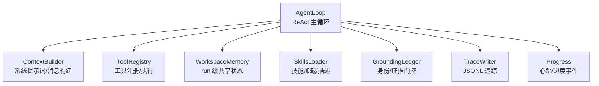
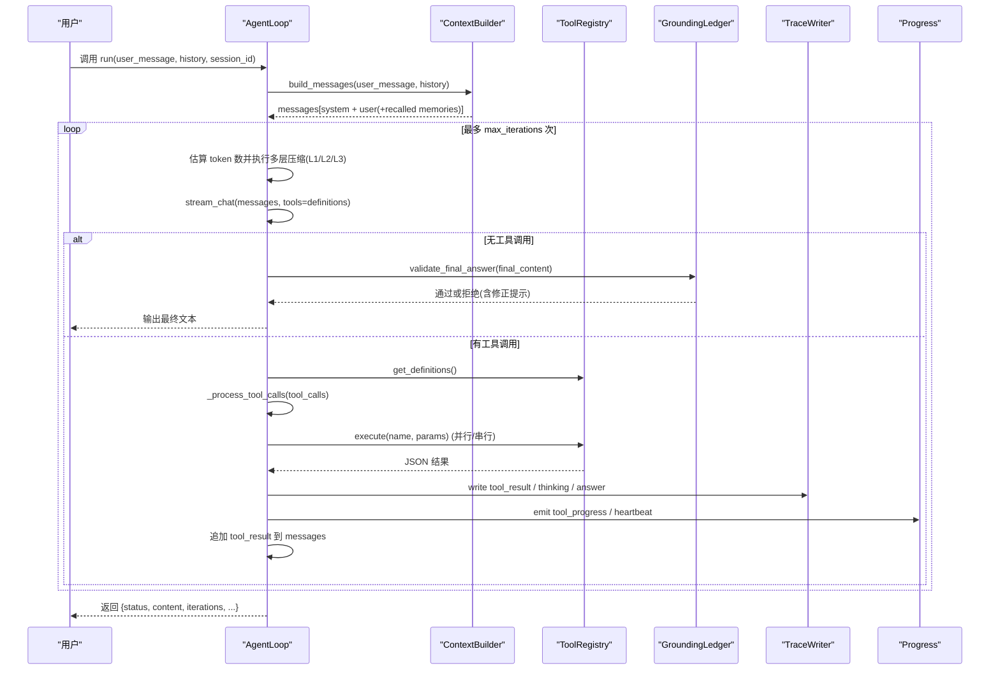
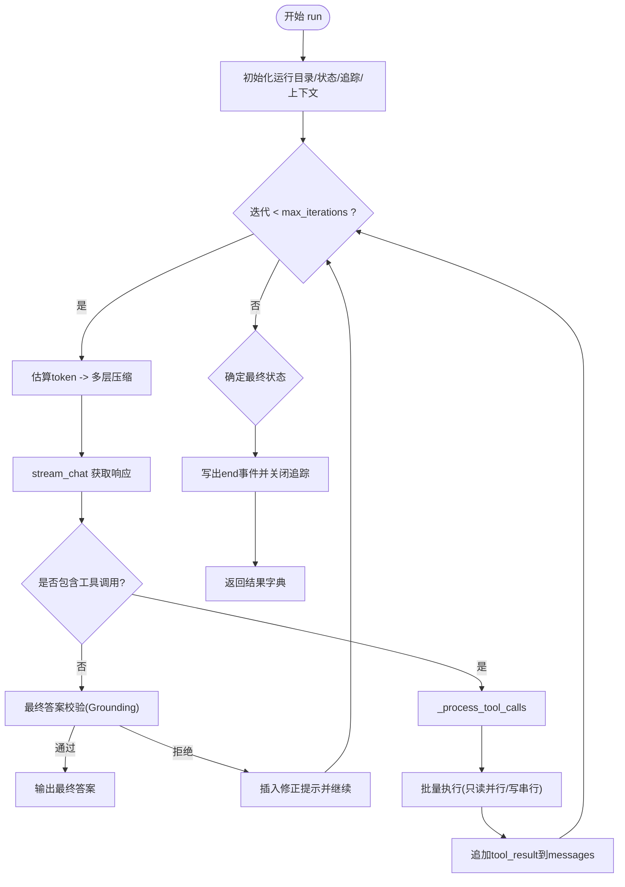
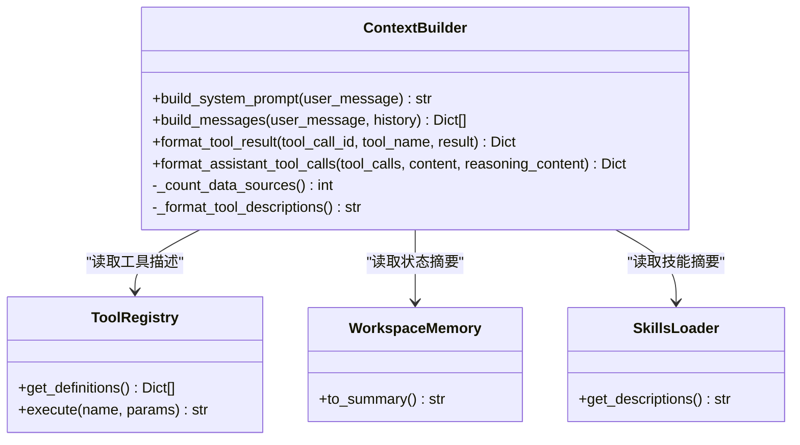
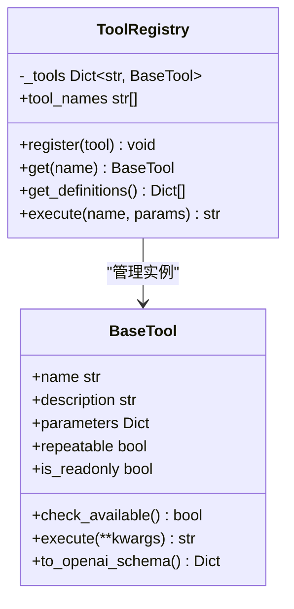
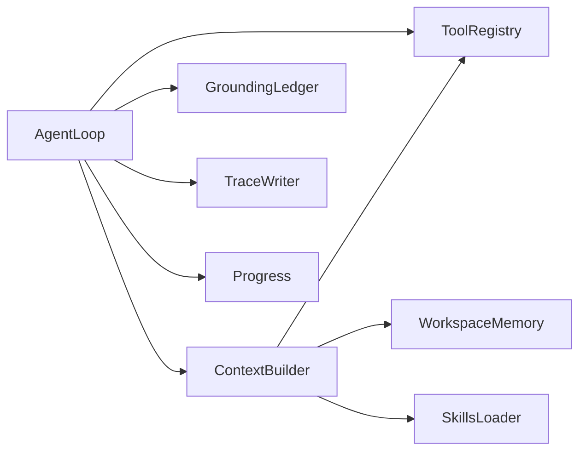

# Agent核心

<cite>
**本文引用的文件**
- [agent/src/agent/__init__.py](file://agent/src/agent/__init__.py)
- [agent/src/agent/context.py](file://agent/src/agent/context.py)
- [agent/src/agent/loop.py](file://agent/src/agent/loop.py)
- [agent/src/agent/memory.py](file://agent/src/agent/memory.py)
- [agent/src/agent/tools.py](file://agent/src/agent/tools.py)
- [agent/src/agent/skills.py](file://agent/src/agent/skills.py)
- [agent/src/agent/grounding.py](file://agent/src/agent/grounding.py)
- [agent/src/agent/progress.py](file://agent/src/agent/progress.py)
- [agent/src/agent/trace.py](file://agent/src/agent/trace.py)
</cite>

## 目录
1. [简介](#简介)
2. [项目结构](#项目结构)
3. [核心组件](#核心组件)
4. [架构总览](#架构总览)
5. [详细组件分析](#详细组件分析)
6. [依赖关系分析](#依赖关系分析)
7. [性能考量](#性能考量)
8. [故障排查指南](#故障排查指南)
9. [结论](#结论)
10. [附录](#附录)

## 简介
本文件聚焦 Vibe-Trading Agent 的核心模块，系统性解释 ReAct Agent 循环机制、上下文构建器（ContextBuilder）的工作原理、系统提示词生成逻辑与消息处理流程。文档说明 Agent 如何解析用户意图、选择工具、执行任务并生成响应；给出启动、运行与终止的示例路径；记录配置选项、参数设置与返回值格式；并阐述与工具注册表、记忆系统与技能加载器的集成方式，提供常见问题解决方案与性能优化建议。

## 项目结构
Agent 核心位于 agent/src/agent 目录下，关键文件职责如下：
- loop.py：ReAct 主循环、上下文压缩、工具批处理与事件流
- context.py：系统提示词构建、消息组装、工具描述格式化
- tools.py：BaseTool 抽象与 ToolRegistry 注册/执行
- skills.py：技能加载与章节化检索
- memory.py：工作区内存（run 级共享状态）
- grounding.py：身份与数值证据门控、最终答案校验
- progress.py：心跳与结构化进度事件
- trace.py：崩溃安全的 JSONL 追踪写入

图表来源
- [agent/src/agent/loop.py:502-1203](file://agent/src/agent/loop.py#L502-L1203)
- [agent/src/agent/context.py:210-396](file://agent/src/agent/context.py#L210-L396)
- [agent/src/agent/tools.py:13-95](file://agent/src/agent/tools.py#L13-L95)
- [agent/src/agent/skills.py:100-189](file://agent/src/agent/skills.py#L100-L189)
- [agent/src/agent/grounding.py:584-753](file://agent/src/agent/grounding.py#L584-L753)
- [agent/src/agent/trace.py:64-180](file://agent/src/agent/trace.py#L64-L180)
- [agent/src/agent/progress.py:30-185](file://agent/src/agent/progress.py#L30-L185)

章节来源
- [agent/src/agent/__init__.py:1-9](file://agent/src/agent/__init__.py#L1-L9)

## 核心组件
- AgentLoop：实现 ReAct 循环，负责迭代调用 LLM、处理工具调用、上下文压缩、事件输出、状态持久化与终止判定。
- ContextBuilder：构建系统提示词与消息列表，注入工具/技能描述、工作区状态与跨会话记忆快照，支持自动召回相关记忆。
- ToolRegistry/BaseTool：统一工具接口与注册表，提供 OpenAI function-calling 描述与执行封装，保证返回 JSON 字符串。
- SkillsLoader：从内置与用户目录加载技能，按类别分组展示摘要，按需加载完整文档，支持章节定位。
- WorkspaceMemory：run 级共享状态，维护 run_dir 与工具调用计数，供系统提示词与压缩后上下文恢复。
- GroundingLedger：基于身份锁定与数值证据的门控，拦截未授权工具调用，校验最终答案的数据一致性。
- TraceWriter：崩溃安全的 JSONL 追踪，大字段旁路存储，保障可追溯性。
- Progress：心跳定时器与结构化进度事件，确保长耗时工具 UI 不卡顿。

章节来源
- [agent/src/agent/loop.py:502-1203](file://agent/src/agent/loop.py#L502-L1203)
- [agent/src/agent/context.py:210-396](file://agent/src/agent/context.py#L210-L396)
- [agent/src/agent/tools.py:13-95](file://agent/src/agent/tools.py#L13-L95)
- [agent/src/agent/skills.py:100-189](file://agent/src/agent/skills.py#L100-L189)
- [agent/src/agent/memory.py:13-54](file://agent/src/agent/memory.py#L13-L54)
- [agent/src/agent/grounding.py:584-753](file://agent/src/agent/grounding.py#L584-L753)
- [agent/src/agent/trace.py:64-180](file://agent/src/agent/trace.py#L64-L180)
- [agent/src/agent/progress.py:30-185](file://agent/src/agent/progress.py#L30-L185)

## 架构总览
下图展示了 AgentLoop 在一次请求中的端到端流程：构建上下文、多轮 ReAct 循环、工具批处理、上下文压缩、最终答案校验与结果输出。

图表来源
- [agent/src/agent/loop.py:624-1203](file://agent/src/agent/loop.py#L624-L1203)
- [agent/src/agent/context.py:286-322](file://agent/src/agent/context.py#L286-L322)
- [agent/src/agent/tools.py:54-95](file://agent/src/agent/tools.py#L54-L95)
- [agent/src/agent/grounding.py:584-753](file://agent/src/agent/grounding.py#L584-L753)
- [agent/src/agent/trace.py:92-180](file://agent/src/agent/trace.py#L92-L180)
- [agent/src/agent/progress.py:89-185](file://agent/src/agent/progress.py#L89-L185)

## 详细组件分析

### ReAct Agent 循环（AgentLoop）
- 启动与初始化
  - 创建运行目录与状态存储，初始化 GroundingLedger、TraceWriter、上下文构建器与目标上下文（可选）。
  - 读取环境配置决定心跳间隔、推理增量最小间隔、流重试延迟、工具超时等。
- 主循环
  - 估算消息 token 数，依次触发微压缩、上下文折叠、自动压缩（LLM 摘要），保持最近尾部预算。
  - 在接近最大迭代时注入“收尾”提示，强制模型收敛为纯文本回答。
  - 流式接收 LLM 输出：文本片段、推理片段、工具调用；记录使用量与目标进度。
  - 内容过滤跳过与熔断保护，避免连续被拒导致死循环。
  - 若无工具调用：进行最终答案校验（Grounding），必要时插入修正提示继续一轮；否则输出最终答案。
  - 若有工具调用：预处理（去重、compact 标记）、身份授权检查、分批执行（只读并行、写操作串行）、结果回写与追踪。
- 终止与结果
  - 根据取消、内容过滤熔断、成功标志、空响应或达到最大迭代次数确定最终状态。
  - 写出结束事件，关闭追踪，返回包含状态、内容、迭代次数、模型信息与警告的结构化结果。

图表来源
- [agent/src/agent/loop.py:624-1203](file://agent/src/agent/loop.py#L624-L1203)
- [agent/src/agent/loop.py:1207-1703](file://agent/src/agent/loop.py#L1207-L1703)
- [agent/src/agent/loop.py:1796-1917](file://agent/src/agent/loop.py#L1796-L1917)

章节来源
- [agent/src/agent/loop.py:624-1203](file://agent/src/agent/loop.py#L624-L1203)
- [agent/src/agent/loop.py:1207-1703](file://agent/src/agent/loop.py#L1207-L1703)
- [agent/src/agent/loop.py:1796-1917](file://agent/src/agent/loop.py#L1796-L1917)

### 上下文构建器（ContextBuilder）
- 系统提示词生成
  - 注入工具数量、技能数量、数据源数量、工具描述、技能摘要、工作区状态摘要、当前时间。
  - 若存在跨会话持久记忆，附加记忆快照到系统提示词中。
- 消息构建
  - 组装 system + history + user 消息；若启用持久记忆，自动召回相关记忆并嵌入用户消息前。
  - 提供工具结果与助手工具调用的格式化方法，兼容不同提供商的 reasoning_content 与 extra_content。
- 工具描述格式化
  - 遍历注册表，提取每个工具的参数定义与必填项，生成可读的工具清单。

图表来源
- [agent/src/agent/context.py:210-396](file://agent/src/agent/context.py#L210-L396)
- [agent/src/agent/tools.py:54-95](file://agent/src/agent/tools.py#L54-L95)
- [agent/src/agent/memory.py:13-54](file://agent/src/agent/memory.py#L13-L54)
- [agent/src/agent/skills.py:100-189](file://agent/src/agent/skills.py#L100-L189)

章节来源
- [agent/src/agent/context.py:210-396](file://agent/src/agent/context.py#L210-L396)

### 工具注册表与执行（ToolRegistry/BaseTool）
- BaseTool
  - 定义 name、description、parameters、repeatable、is_readonly 等元信息。
  - to_openai_schema 将工具转换为 OpenAI function-calling 描述。
- ToolRegistry
  - register/get/get_definitions/execute 统一管理工具生命周期。
  - execute 保证返回 JSON 字符串，异常时包装为错误对象。
- 执行策略
  - AgentLoop 对只读工具进行并行批处理，写工具串行执行，保证顺序与一致性。
  - 支持心跳与结构化进度事件，便于 UI 反馈。

图表来源
- [agent/src/agent/tools.py:13-95](file://agent/src/agent/tools.py#L13-L95)
- [agent/src/agent/loop.py:1393-1703](file://agent/src/agent/loop.py#L1393-L1703)

章节来源
- [agent/src/agent/tools.py:13-95](file://agent/src/agent/tools.py#L13-L95)
- [agent/src/agent/loop.py:1393-1703](file://agent/src/agent/loop.py#L1393-L1703)

### 技能加载器（SkillsLoader）
- 加载策略
  - 从用户目录与内置目录加载 SKILL.md，解析 frontmatter 元数据，按类别分组输出摘要。
  - 支持章节化分割与路径定位，便于 load_skill 工具按需返回特定段落。
- 使用场景
  - 系统提示词仅注入技能摘要，减少上下文占用；具体任务时再按需加载完整文档。

章节来源
- [agent/src/agent/skills.py:100-189](file://agent/src/agent/skills.py#L100-L189)
- [agent/src/agent/skills.py:229-387](file://agent/src/agent/skills.py#L229-L387)

### 工作区记忆（WorkspaceMemory）
- 作用
  - 在单次 AgentLoop.run() 内共享状态，包括当前 run_dir 与工具调用计数器。
  - to_summary 生成简洁状态文本，用于系统提示词与压缩后的上下文恢复。

章节来源
- [agent/src/agent/memory.py:13-54](file://agent/src/agent/memory.py#L13-L54)

### 身份与证据门控（GroundingLedger）
- 身份锁定
  - 对涉及市场数据的请求，要求先通过 search_symbol 锁定标的与交易所后缀，禁止静默改写。
  - 批次冻结授权标的集合，防止同批次内互相影响。
- 工具授权
  - 对含标的参数的工具调用进行白名单匹配，未锁定或冲突则返回结构化错误。
- 最终答案校验
  - 校验价格声明与观测工具结果的一致性，拒绝无依据的数字或矛盾值。
  - 提供安全降级回复与修正提示，引导模型修正。

章节来源
- [agent/src/agent/grounding.py:584-753](file://agent/src/agent/grounding.py#L584-L753)
- [agent/src/agent/grounding.py:789-800](file://agent/src/agent/grounding.py#L789-L800)

### 追踪与进度（TraceWriter/Progress）
- TraceWriter
  - 每条记录 flush+fsync，大字段旁路存储，保证崩溃安全与可追溯性。
  - 支持读取与侧边文件解析，便于调试与审计。
- Progress
  - HeartbeatTimer 定时发送心跳，emit_progress 提供结构化进度事件。
  - 线程本地发射器，确保并发工具调用正确路由到对应 AgentLoop。

章节来源
- [agent/src/agent/trace.py:64-180](file://agent/src/agent/trace.py#L64-L180)
- [agent/src/agent/progress.py:30-185](file://agent/src/agent/progress.py#L30-L185)

## 依赖关系分析
- AgentLoop 依赖 ContextBuilder 构建消息，依赖 ToolRegistry 执行工具，依赖 GroundingLedger 做身份与答案校验，依赖 TraceWriter 记录追踪，依赖 Progress 发送心跳与进度。
- ContextBuilder 依赖 ToolRegistry、WorkspaceMemory、SkillsLoader 与可选 PersistentMemory。
- Tools 层解耦工具实现，通过 BaseTool 抽象与 Registry 管理，便于扩展与测试。
- SkillsLoader 独立于运行时，按需提供技能文档，降低系统提示词体积。

图表来源
- [agent/src/agent/loop.py:502-1203](file://agent/src/agent/loop.py#L502-L1203)
- [agent/src/agent/context.py:210-396](file://agent/src/agent/context.py#L210-L396)
- [agent/src/agent/tools.py:54-95](file://agent/src/agent/tools.py#L54-L95)
- [agent/src/agent/skills.py:100-189](file://agent/src/agent/skills.py#L100-L189)
- [agent/src/agent/grounding.py:584-753](file://agent/src/agent/grounding.py#L584-L753)
- [agent/src/agent/trace.py:64-180](file://agent/src/agent/trace.py#L64-L180)
- [agent/src/agent/progress.py:30-185](file://agent/src/agent/progress.py#L30-L185)

## 性能考量
- 上下文压缩五层策略
  - 微压缩：清理旧工具结果，保留最近 N 条。
  - 上下文折叠：长文本首尾保留，中间折叠，零 API 成本。
  - 自动压缩：LLM 结构化摘要，保留尾部 token 预算，迭代更新而非从头。
  - 手动压缩：模型显式调用 compact 触发。
  - 工具对修复：压缩后修复孤立 tool_call/tool_result 对。
- 工具批处理
  - 只读工具并行执行（线程池），写工具串行执行，兼顾吞吐与一致性。
- 心跳与进度节流
  - 推理增量最小间隔节流，避免 UI 回放缓冲压力过大。
  - 心跳定时器保证长耗时工具 UI 不卡顿。
- 追踪与大字段旁路
  - 大结果与文本旁路存储，减少主追踪文件大小，提升 I/O 效率。
- 配置可调
  - 通过环境变量覆盖阈值与间隔，如心跳间隔、推理增量间隔、流重试延迟、工具超时等。

章节来源
- [agent/src/agent/loop.py:227-320](file://agent/src/agent/loop.py#L227-L320)
- [agent/src/agent/loop.py:1796-1917](file://agent/src/agent/loop.py#L1796-L1917)
- [agent/src/agent/loop.py:1393-1703](file://agent/src/agent/loop.py#L1393-L1703)
- [agent/src/agent/trace.py:44-53](file://agent/src/agent/trace.py#L44-L53)

## 故障排查指南
- 内容过滤熔断
  - 连续多次被内容过滤器跳过会触发熔断，停止后续处理。检查输入与系统提示词，调整策略。
- 空模型响应
  - 若 LLM 返回空内容且无工具调用，视为失败。检查 provider 配置与模型能力。
- 身份冲突或未锁定
  - 工具调用因身份未锁定或冲突被阻断。先调用 search_symbol 锁定标的与交易所后缀，再消费数据。
- 工具超时
  - 只读工具超时会返回结构化错误；写工具不会中断但会发出超时警告。检查外部依赖与网络状况。
- 追踪缺失或损坏
  - 检查 trace.jsonl 与 sidecar 文件是否存在；确认 fsync 支持情况与磁盘空间。

章节来源
- [agent/src/agent/loop.py:920-941](file://agent/src/agent/loop.py#L920-L941)
- [agent/src/agent/loop.py:1147-1162](file://agent/src/agent/loop.py#L1147-L1162)
- [agent/src/agent/grounding.py:666-753](file://agent/src/agent/grounding.py#L666-L753)
- [agent/src/agent/loop.py:1659-1703](file://agent/src/agent/loop.py#L1659-L1703)
- [agent/src/agent/trace.py:92-180](file://agent/src/agent/trace.py#L92-L180)

## 结论
Vibe-Trading Agent 核心通过 ReAct 循环、分层上下文压缩、工具批处理与身份/证据门控，实现了高可靠、可追溯、可扩展的智能体执行框架。ContextBuilder 将工具、技能与工作区状态有效注入系统提示词，GroundingLedger 保障数据一致性与合规性，TraceWriter 与 Progress 提供完整的可观测性。结合可调配置与性能优化策略，该核心模块能够支撑复杂的金融研究、回测与分析任务。

## 附录

### Agent 循环的启动、运行与终止示例路径
- 启动
  - 构造 AgentLoop(registry, llm, memory, event_callback, max_iterations, persistent_memory)。
  - 调用 run(user_message, history, session_id)。
- 运行
  - 内部循环：构建消息 -> 压缩 -> 流式调用 LLM -> 处理工具调用 -> 追加结果 -> 重复。
  - 事件回调：text_delta、reasoning_delta、tool_call、tool_result、thinking_done、goal.updated 等。
- 终止
  - 正常完成：输出最终答案并写出 end 事件。
  - 取消：设置 cancel 事件，下一检查点退出。
  - 失败：内容过滤熔断、空响应、达到最大迭代等，写出失败原因。

章节来源
- [agent/src/agent/loop.py:624-1203](file://agent/src/agent/loop.py#L624-L1203)
- [agent/src/agent/loop.py:1128-1203](file://agent/src/agent/loop.py#L1128-L1203)

### 配置选项与参数设置
- 心跳间隔：vt_heartbeat_interval_s
- 推理增量最小间隔：vt_reasoning_delta_min_interval_s
- 流重试延迟：vt_stream_retry_delay_s
- 工具超时：vibe_trading_tool_timeout_seconds
- 目标最大续接：vibe_trading_goal_max_continuations
- 追踪阈值：VIBE_TRADING_TRACE_TOOL_RESULT_INLINE_LIMIT、VIBE_TRADING_TRACE_TEXT_OFFLOAD_THRESHOLD、VIBE_TRADING_TRACE_PREVIEW_CHARS

章节来源
- [agent/src/agent/loop.py:74-120](file://agent/src/agent/loop.py#L74-L120)
- [agent/src/agent/trace.py:44-53](file://agent/src/agent/trace.py#L44-L53)

### 返回值格式
- run 返回字典包含：
  - status：success/cancelled/failed
  - content：最终文本
  - iterations/max_iterations：实际与最大迭代次数
  - provider/configured_model/model/reasoning_effort：模型信息
  - reason：失败原因（可选）
  - react_trace：简要轨迹
  - content_filter_warnings：内容过滤警告（可选）

章节来源
- [agent/src/agent/loop.py:1175-1203](file://agent/src/agent/loop.py#L1175-L1203)

### 与其他组件的集成
- 工具注册表：通过 ToolRegistry.register 注册 BaseTool 子类，AgentLoop 在执行时动态获取定义并执行。
- 记忆系统：WorkspaceMemory 提供 run 级状态；PersistentMemory 提供跨会话记忆快照与自动召回。
- 技能加载器：SkillsLoader 提供技能摘要与按需加载，系统提示词仅注入摘要，减少上下文占用。

章节来源
- [agent/src/agent/tools.py:54-95](file://agent/src/agent/tools.py#L54-L95)
- [agent/src/agent/context.py:210-322](file://agent/src/agent/context.py#L210-L322)
- [agent/src/agent/skills.py:100-189](file://agent/src/agent/skills.py#L100-L189)