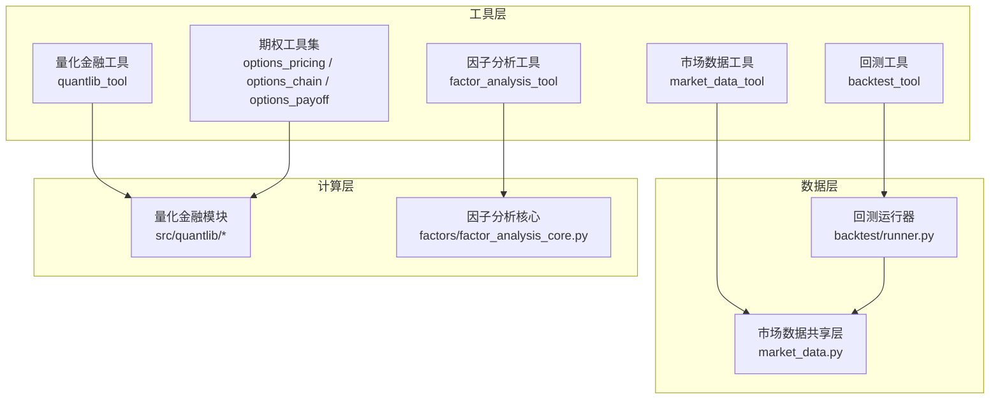
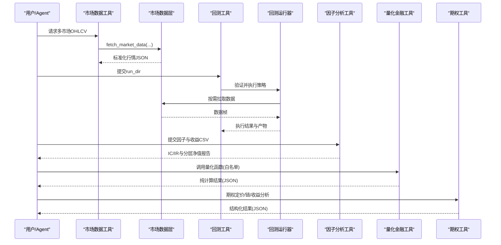
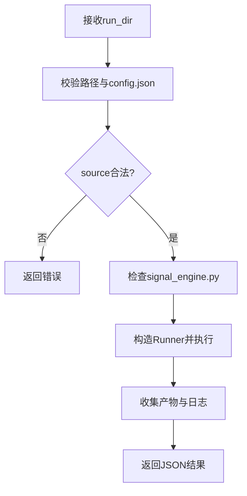
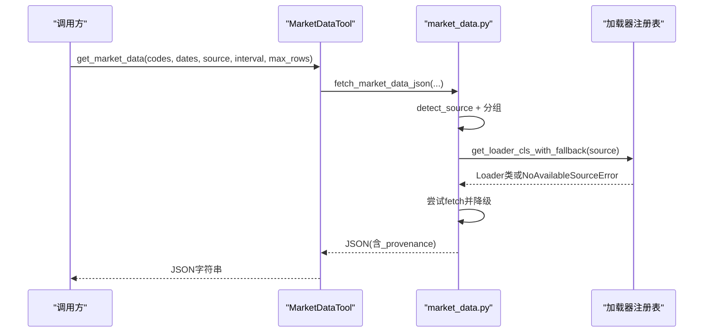
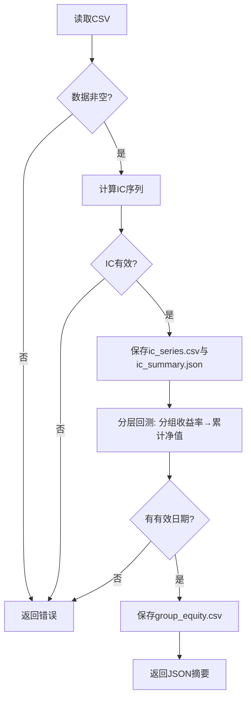
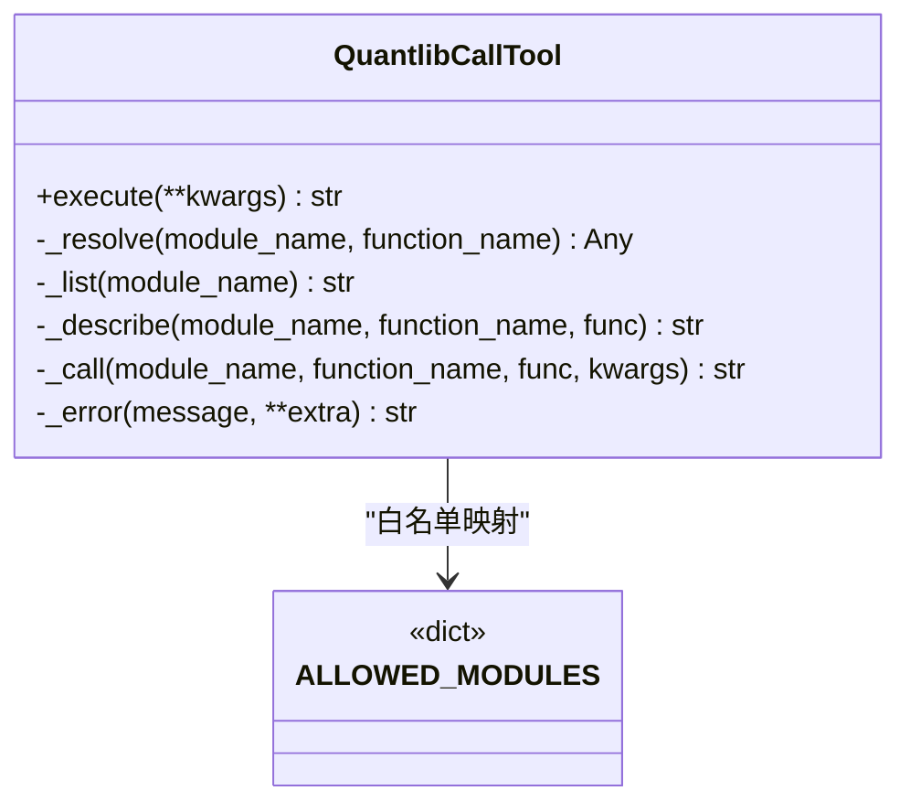
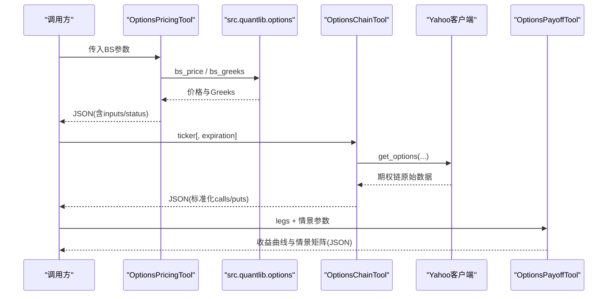
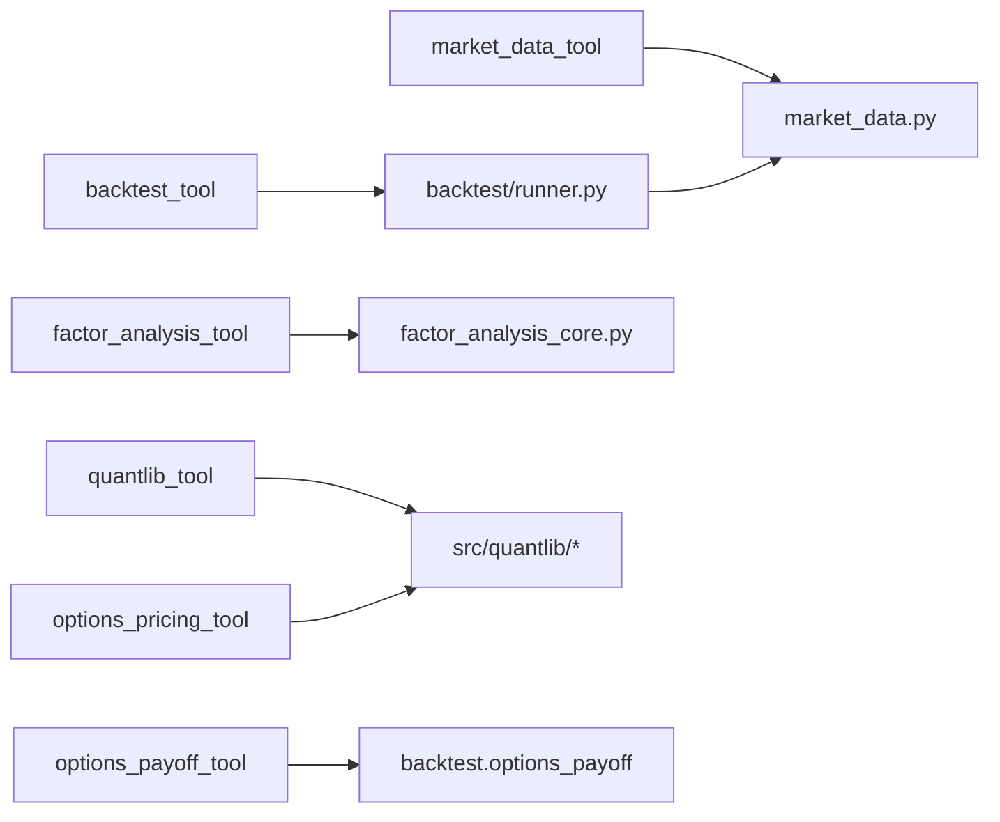

# 内置工具库

<cite>
**本文引用的文件**
- [agent/src/tools/backtest_tool.py](file://agent/src/tools/backtest_tool.py)
- [agent/src/market_data.py](file://agent/src/market_data.py)
- [agent/src/tools/market_data_tool.py](file://agent/src/tools/market_data_tool.py)
- [agent/src/factors/factor_analysis_core.py](file://agent/src/factors/factor_analysis_core.py)
- [agent/src/tools/factor_analysis_tool.py](file://agent/src/tools/factor_analysis_tool.py)
- [agent/src/quantlib/__init__.py](file://agent/src/quantlib/__init__.py)
- [agent/src/tools/quantlib_tool.py](file://agent/src/tools/quantlib_tool.py)
- [agent/src/tools/options_pricing_tool.py](file://agent/src/tools/options_pricing_tool.py)
- [agent/src/tools/options_chain_tool.py](file://agent/src/tools/options_chain_tool.py)
- [agent/src/tools/options_payoff_tool.py](file://agent/src/tools/options_payoff_tool.py)
- [agent/backtest/runner.py](file://agent/backtest/runner.py)
</cite>

## 目录
1. [简介](#简介)
2. [项目结构](#项目结构)
3. [核心组件](#核心组件)
4. [架构总览](#架构总览)
5. [详细组件分析](#详细组件分析)
6. [依赖关系分析](#依赖关系分析)
7. [性能考虑](#性能考虑)
8. [故障排查指南](#故障排查指南)
9. [结论](#结论)
10. [附录：使用示例与参数说明](#附录：使用示例与参数说明)

## 简介
本文件系统化介绍 Vibe-Trading 的内置工具库，覆盖五类关键能力：回测工具（backtest_tool）、市场数据工具（market_data_tool）、因子分析工具（factor_analysis_tool）、量化金融工具（quantlib_tool）以及期权工具（options_pricing_tool、options_chain_tool、options_payoff_tool）。文档从系统架构、组件职责、数据流、调用方式、参数配置、返回值处理、依赖要求与协作关系等维度展开，并提供可视化图示与可操作的示例路径，帮助不同技术背景的读者快速上手。

## 项目结构
围绕“工具层—数据层—计算层”的分层组织：
- 工具层：面向用户/Agent 暴露统一接口（BaseTool 子类），负责参数校验、错误封装、JSON 输出。
- 数据层：统一的市场数据获取与路由（market_data.py），按符号格式自动选择数据源并支持降级链。
- 计算层：经 quantlib_tool 白名单调用的纯计算函数集合（src/quantlib），以及因子分析与期权定价等专用逻辑。

图表来源
- [agent/src/tools/backtest_tool.py:15-95](file://agent/src/tools/backtest_tool.py#L15-L95)
- [agent/src/tools/market_data_tool.py:11-104](file://agent/src/tools/market_data_tool.py#L11-L104)
- [agent/src/market_data.py:97-229](file://agent/src/market_data.py#L97-L229)
- [agent/backtest/runner.py:1-80](file://agent/backtest/runner.py#L1-L80)
- [agent/src/tools/quantlib_tool.py:244-450](file://agent/src/tools/quantlib_tool.py#L244-L450)
- [agent/src/quantlib/__init__.py:1-38](file://agent/src/quantlib/__init__.py#L1-L38)
- [agent/src/tools/options_pricing_tool.py:77-172](file://agent/src/tools/options_pricing_tool.py#L77-L172)
- [agent/src/tools/options_chain_tool.py:37-156](file://agent/src/tools/options_chain_tool.py#L37-L156)
- [agent/src/tools/options_payoff_tool.py:21-225](file://agent/src/tools/options_payoff_tool.py#L21-L225)
- [agent/src/factors/factor_analysis_core.py:8-103](file://agent/src/factors/factor_analysis_core.py#L8-L103)

章节来源
- [agent/src/tools/backtest_tool.py:15-95](file://agent/src/tools/backtest_tool.py#L15-L95)
- [agent/src/tools/market_data_tool.py:11-104](file://agent/src/tools/market_data_tool.py#L11-L104)
- [agent/src/market_data.py:97-229](file://agent/src/market_data.py#L97-L229)
- [agent/backtest/runner.py:1-80](file://agent/backtest/runner.py#L1-L80)
- [agent/src/tools/quantlib_tool.py:244-450](file://agent/src/tools/quantlib_tool.py#L244-L450)
- [agent/src/quantlib/__init__.py:1-38](file://agent/src/quantlib/__init__.py#L1-L38)
- [agent/src/tools/options_pricing_tool.py:77-172](file://agent/src/tools/options_pricing_tool.py#L77-L172)
- [agent/src/tools/options_chain_tool.py:37-156](file://agent/src/tools/options_chain_tool.py#L37-L156)
- [agent/src/tools/options_payoff_tool.py:21-225](file://agent/src/tools/options_payoff_tool.py#L21-L225)
- [agent/src/factors/factor_analysis_core.py:8-103](file://agent/src/factors/factor_analysis_core.py#L8-L103)

## 核心组件
- 回测工具（backtest_tool）
  - 职责：校验 run_dir 下的 config.json 与 signal_engine.py，调用内置回测引擎执行，收集产物。
  - 输入：run_dir（字符串路径）。
  - 输出：包含状态、退出码、日志片段、产物清单、运行目录的 JSON。
  - 关键点：source 必须为允许值；信号代码通过安全扫描限制危险操作。
- 市场数据工具（market_data_tool）
  - 职责：通过仓库加载器层获取标准化 OHLCV 数据，支持多市场、自动源检测与降级。
  - 输入：codes、start_date、end_date、source、interval、max_rows。
  - 输出：JSON 字符串，含各标的行情数据与可选来源溯源信息。
- 因子分析工具（factor_analysis_tool）
  - 职责：读取因子与收益 CSV，计算 IC/IR、分层净值曲线，输出分析报告。
  - 输入：factor_csv、return_csv、output_dir、n_groups。
  - 输出：JSON 摘要与 ic_series.csv、group_equity.csv、ic_summary.json。
- 量化金融工具（quantlib_tool）
  - 职责：以白名单方式调用 src/quantlib 中的公开函数，提供定价、风险、绩效、估值等纯计算能力。
  - 输入：action（list/describe/call）、module、function、kwargs（支持 Series/DataFrame 信封）。
  - 输出：JSON 结果，带截断提示与签名/文档查询。
- 期权工具（options_pricing_tool、options_chain_tool、options_payoff_tool）
  - 职责：BS 价格与希腊字母、美股期权链抓取、多腿策略到期收益与情景矩阵分析。
  - 输入：各自独立参数（见附录）。
  - 输出：JSON 结构化结果，含状态、警告、指标与曲线/矩阵。

章节来源
- [agent/src/tools/backtest_tool.py:15-95](file://agent/src/tools/backtest_tool.py#L15-L95)
- [agent/src/tools/market_data_tool.py:11-104](file://agent/src/tools/market_data_tool.py#L11-L104)
- [agent/src/tools/factor_analysis_tool.py:19-152](file://agent/src/tools/factor_analysis_tool.py#L19-L152)
- [agent/src/tools/quantlib_tool.py:244-450](file://agent/src/tools/quantlib_tool.py#L244-L450)
- [agent/src/tools/options_pricing_tool.py:77-172](file://agent/src/tools/options_pricing_tool.py#L77-L172)
- [agent/src/tools/options_chain_tool.py:37-156](file://agent/src/tools/options_chain_tool.py#L37-L156)
- [agent/src/tools/options_payoff_tool.py:21-225](file://agent/src/tools/options_payoff_tool.py#L21-L225)

## 架构总览
工具间协作与数据流转如下：
- 市场数据工具作为数据入口，统一返回标准化数据，供回测与因子分析消费。
- 回测工具将策略代码与配置交由 runner 执行，内部复用市场数据加载器。
- 因子分析工具直接对 CSV 进行面板统计与分层回测。
- 量化金融工具通过白名单访问 src/quantlib，提供无副作用的数学计算。
- 期权工具组合 BS 定价、链数据与多腿收益模型，服务于期权策略研究。

图表来源
- [agent/src/tools/market_data_tool.py:94-104](file://agent/src/tools/market_data_tool.py#L94-L104)
- [agent/src/market_data.py:97-229](file://agent/src/market_data.py#L97-L229)
- [agent/src/tools/backtest_tool.py:15-95](file://agent/src/tools/backtest_tool.py#L15-L95)
- [agent/backtest/runner.py:1-80](file://agent/backtest/runner.py#L1-L80)
- [agent/src/tools/factor_analysis_tool.py:19-152](file://agent/src/tools/factor_analysis_tool.py#L19-L152)
- [agent/src/tools/quantlib_tool.py:304-450](file://agent/src/tools/quantlib_tool.py#L304-L450)
- [agent/src/tools/options_pricing_tool.py:95-172](file://agent/src/tools/options_pricing_tool.py#L95-L172)
- [agent/src/tools/options_chain_tool.py:70-156](file://agent/src/tools/options_chain_tool.py#L70-L156)
- [agent/src/tools/options_payoff_tool.py:122-225](file://agent/src/tools/options_payoff_tool.py#L122-L225)

## 详细组件分析

### 回测工具（backtest_tool）
- 功能要点
  - 校验 run_dir、config.json、signal_engine.py 存在性与合法性。
  - source 必须在允许列表内；否则返回错误。
  - 通过 Runner 执行 backtest/runner.py，收集 stdout/stderr 与 artifacts。
- 参数与返回
  - 参数：run_dir（必填）。
  - 返回：status、exit_code、stdout、stderr、artifacts、run_dir。
- 安全与健壮性
  - runner 对策略代码进行 AST 级安全检查，禁止网络、进程、写盘等危险操作。
- 典型流程

图表来源
- [agent/src/tools/backtest_tool.py:15-95](file://agent/src/tools/backtest_tool.py#L15-L95)
- [agent/backtest/runner.py:165-768](file://agent/backtest/runner.py#L165-L768)

章节来源
- [agent/src/tools/backtest_tool.py:15-95](file://agent/src/tools/backtest_tool.py#L15-L95)
- [agent/backtest/runner.py:68-163](file://agent/backtest/runner.py#L68-L163)
- [agent/backtest/runner.py:306-467](file://agent/backtest/runner.py#L306-L467)
- [agent/backtest/runner.py:736-787](file://agent/backtest/runner.py#L736-L787)

### 市场数据工具（market_data_tool）
- 功能要点
  - 基于 market_data.fetch_market_data_json 统一获取 OHLCV。
  - 支持 auto 自动识别数据源并按市场降级链重试。
  - 支持 interval、max_rows 控制粒度与大小。
- 参数与返回
  - 参数：codes、start_date、end_date、source（默认auto）、interval（默认1D）、max_rows（默认上限）。
  - 返回：JSON 字符串，含各标的数据与 _provenance（来源溯源）。
- 数据路由
  - detect_source 根据符号格式匹配首选源；get_loader 通过注册表获取加载器。
  - fetch_market_data 分组、构建降级链、捕获异常并记录未解析符号。

图表来源
- [agent/src/tools/market_data_tool.py:94-104](file://agent/src/tools/market_data_tool.py#L94-L104)
- [agent/src/market_data.py:51-63](file://agent/src/market_data.py#L51-L63)
- [agent/src/market_data.py:97-229](file://agent/src/market_data.py#L97-L229)

章节来源
- [agent/src/tools/market_data_tool.py:11-104](file://agent/src/tools/market_data_tool.py#L11-L104)
- [agent/src/market_data.py:14-57](file://agent/src/market_data.py#L14-L57)
- [agent/src/market_data.py:97-229](file://agent/src/market_data.py#L97-L229)

### 因子分析工具（factor_analysis_tool）
- 功能要点
  - 读取 factor_df 与 return_df，计算每日 IC（Spearman），汇总均值、标准差、IR、正IC比例。
  - 按因子值分位数分组，计算等权持有累计净值曲线，输出长短期价差。
- 参数与返回
  - 参数：factor_csv、return_csv、output_dir、n_groups（默认5）。
  - 返回：JSON 摘要与 ic_series.csv、group_equity.csv、ic_summary.json。
- 复杂度与鲁棒性
  - 向量化的 rank().corrwith() 提升效率；每日期限需至少 N 个有效截面。
  - 空数据或无效 n_groups 会返回明确错误。

图表来源
- [agent/src/tools/factor_analysis_tool.py:19-105](file://agent/src/tools/factor_analysis_tool.py#L19-L105)
- [agent/src/factors/factor_analysis_core.py:8-103](file://agent/src/factors/factor_analysis_core.py#L8-L103)

章节来源
- [agent/src/tools/factor_analysis_tool.py:19-152](file://agent/src/tools/factor_analysis_tool.py#L19-L152)
- [agent/src/factors/factor_analysis_core.py:8-103](file://agent/src/factors/factor_analysis_core.py#L8-L103)

### 量化金融工具（quantlib_tool）
- 功能要点
  - 通过 ALLOWED_MODULES 白名单导入模块，仅暴露 __all__ 中的可调用函数。
  - 拒绝写入型函数（export_* 前缀），保证纯计算。
  - 支持 pandas Series/DataFrame 的 JSON 信封传递与序列化。
  - action=list/describe/call 三种模式，便于发现与调试。
- 参数与返回
  - 参数：action（必填）、module、function、kwargs。
  - 返回：JSON，包含 ok、result、truncated 提示、signature/doc（describe）。
- 安全设计
  - 模块名来自字典键，不拼接 import；函数名在导出集中查找；结果叶子数限制防溢出。

图表来源
- [agent/src/tools/quantlib_tool.py:65-85](file://agent/src/tools/quantlib_tool.py#L65-L85)
- [agent/src/tools/quantlib_tool.py:244-450](file://agent/src/tools/quantlib_tool.py#L244-L450)

章节来源
- [agent/src/tools/quantlib_tool.py:65-85](file://agent/src/tools/quantlib_tool.py#L65-L85)
- [agent/src/tools/quantlib_tool.py:97-165](file://agent/src/tools/quantlib_tool.py#L97-L165)
- [agent/src/tools/quantlib_tool.py:168-241](file://agent/src/tools/quantlib_tool.py#L168-L241)
- [agent/src/tools/quantlib_tool.py:304-450](file://agent/src/tools/quantlib_tool.py#L304-L450)
- [agent/src/quantlib/__init__.py:1-38](file://agent/src/quantlib/__init__.py#L1-L38)

### 期权工具（options_pricing_tool、options_chain_tool、options_payoff_tool）
- 期权定价（options_pricing_tool）
  - 基于 src.quantlib.options 的 bs_price 与 bs_greeks，返回价格与 Greeks。
  - 参数：spot、strike、expiry_days、volatility、option_type、risk_free_rate（可选）。
  - 返回：price、delta/gamma/theta/vega/rho、inputs、status/degenerate 提示。
- 期权链（options_chain_tool）
  - 通过 Yahoo Finance 客户端获取美股期权链（calls/puts），字段标准化并限制规模。
  - 参数：ticker、expiration（可选）。
  - 返回：ok、market、source、data（含 expirations、calls、puts）。
- 多腿收益（options_payoff_tool）
  - 计算到期收益曲线与 spot/IV 情景矩阵，给出盈亏区间、最大损益、手续费等。
  - 参数：legs、entry_spot、expiry_days、risk_free_rate、volatility、multiplier、commission_rate、spot_min/max、spot_points、scenario_iv_values。
  - 返回：summary、expiry_curve、scenario_grid、limitations。

图表来源
- [agent/src/tools/options_pricing_tool.py:43-74](file://agent/src/tools/options_pricing_tool.py#L43-L74)
- [agent/src/tools/options_pricing_tool.py:95-172](file://agent/src/tools/options_pricing_tool.py#L95-L172)
- [agent/src/tools/options_chain_tool.py:70-156](file://agent/src/tools/options_chain_tool.py#L70-L156)
- [agent/src/tools/options_payoff_tool.py:122-225](file://agent/src/tools/options_payoff_tool.py#L122-L225)

章节来源
- [agent/src/tools/options_pricing_tool.py:13-172](file://agent/src/tools/options_pricing_tool.py#L13-L172)
- [agent/src/tools/options_chain_tool.py:1-156](file://agent/src/tools/options_chain_tool.py#L1-L156)
- [agent/src/tools/options_payoff_tool.py:1-358](file://agent/src/tools/options_payoff_tool.py#L1-L358)

## 依赖关系分析
- 工具到数据层
  - market_data_tool → market_data.py → loaders.registry（按市场降级链）。
- 工具到计算层
  - quantlib_tool → src/quantlib（白名单模块）。
  - options_pricing_tool → src.quantlib.options。
  - options_payoff_tool → backtest.options_payoff（确定性收益模型）。
- 回测到数据层
  - backtest_tool → runner.py → loaders.registry（同市场数据层）。
- 因子分析到核心算法
  - factor_analysis_tool → factors/factor_analysis_core.py（IC/分层净值）。

图表来源
- [agent/src/tools/market_data_tool.py:94-104](file://agent/src/tools/market_data_tool.py#L94-L104)
- [agent/src/market_data.py:97-229](file://agent/src/market_data.py#L97-L229)
- [agent/src/tools/backtest_tool.py:15-95](file://agent/src/tools/backtest_tool.py#L15-L95)
- [agent/backtest/runner.py:1-80](file://agent/backtest/runner.py#L1-L80)
- [agent/src/tools/factor_analysis_tool.py:19-152](file://agent/src/tools/factor_analysis_tool.py#L19-L152)
- [agent/src/factors/factor_analysis_core.py:8-103](file://agent/src/factors/factor_analysis_core.py#L8-L103)
- [agent/src/tools/quantlib_tool.py:65-85](file://agent/src/tools/quantlib_tool.py#L65-L85)
- [agent/src/tools/options_pricing_tool.py:95-172](file://agent/src/tools/options_pricing_tool.py#L95-L172)
- [agent/src/tools/options_payoff_tool.py:122-225](file://agent/src/tools/options_payoff_tool.py#L122-L225)

章节来源
- [agent/src/tools/market_data_tool.py:11-104](file://agent/src/tools/market_data_tool.py#L11-L104)
- [agent/src/market_data.py:97-229](file://agent/src/market_data.py#L97-L229)
- [agent/src/tools/backtest_tool.py:15-95](file://agent/src/tools/backtest_tool.py#L15-L95)
- [agent/backtest/runner.py:1-80](file://agent/backtest/runner.py#L1-L80)
- [agent/src/tools/factor_analysis_tool.py:19-152](file://agent/src/tools/factor_analysis_tool.py#L19-L152)
- [agent/src/factors/factor_analysis_core.py:8-103](file://agent/src/factors/factor_analysis_core.py#L8-L103)
- [agent/src/tools/quantlib_tool.py:65-85](file://agent/src/tools/quantlib_tool.py#L65-L85)
- [agent/src/tools/options_pricing_tool.py:95-172](file://agent/src/tools/options_pricing_tool.py#L95-L172)
- [agent/src/tools/options_payoff_tool.py:122-225](file://agent/src/tools/options_payoff_tool.py#L122-L225)

## 性能考虑
- 市场数据
  - 通过 per-symbol 行裁剪（cap_rows）控制负载；建议合理设置 max_rows 与 interval。
  - 自动源检测与降级链减少失败重试次数；必要时显式指定 source 以提升稳定性。
- 因子分析
  - 使用向量化操作（rank.corrwith）提高 IC 计算效率；确保截面足够以减少丢弃日期。
- 量化金融
  - 结果序列化限制叶子数量，避免超大响应；优先请求聚合统计而非全量数组。
- 期权
  - 期权链单侧合约数限制，防止过大响应；情景网格点数有上下界，兼顾精度与体积。

[本节为通用指导，不直接分析具体文件]

## 故障排查指南
- 回测工具
  - 常见错误：缺少 config.json/signal_engine.py、source 非法、策略代码触发安全扫描。
  - 排查：检查 run_dir 结构与权限；确认 source 在允许列表；阅读 stderr 与安全报错定位违规调用。
- 市场数据工具
  - 常见错误：符号无法解析、所有源不可用导致 _unresolved。
  - 排查：检查 codes 格式；查看 _provenance 中 requested/detected/source；调整 source 或放宽时间范围。
- 因子分析工具
  - 常见错误：CSV 为空、IC 计算失败（共享日期/资产不足）、分层净值失败（有效截面不足）。
  - 排查：确认 index 为日期、列名为 codes；增加样本或降低 n_groups；检查缺失值。
- 量化金融工具
  - 常见错误：模块/函数不在白名单、参数信封格式错误、结果被截断。
  - 排查：先用 action=list/describe 确认可用函数；修正 kwargs 信封；缩小输入或请求摘要。
- 期权工具
  - 常见错误：参数非有限数、到期日为0导致 Greeks 奇异、链请求失败。
  - 排查：检查数值范围；关注 status=degenerate 与 warning；确认 ticker 与 expiration 格式。

章节来源
- [agent/src/tools/backtest_tool.py:15-95](file://agent/src/tools/backtest_tool.py#L15-L95)
- [agent/backtest/runner.py:306-467](file://agent/backtest/runner.py#L306-L467)
- [agent/src/market_data.py:198-229](file://agent/src/market_data.py#L198-L229)
- [agent/src/tools/factor_analysis_tool.py:36-105](file://agent/src/tools/factor_analysis_tool.py#L36-L105)
- [agent/src/tools/quantlib_tool.py:304-450](file://agent/src/tools/quantlib_tool.py#L304-L450)
- [agent/src/tools/options_pricing_tool.py:13-172](file://agent/src/tools/options_pricing_tool.py#L13-L172)
- [agent/src/tools/options_chain_tool.py:70-156](file://agent/src/tools/options_chain_tool.py#L70-L156)
- [agent/src/tools/options_payoff_tool.py:122-225](file://agent/src/tools/options_payoff_tool.py#L122-L225)

## 结论
本工具库以“工具—数据—计算”三层解耦的方式，提供了覆盖回测、数据、因子、量化与期权的完整研究闭环。通过统一的数据路由、严格的策略安全扫描、白名单量化函数调用与稳健的错误封装，既保证了易用性，又确保了安全性与可维护性。建议在研究中优先使用市场数据工具获取标准化数据，结合因子分析与量化金融工具进行研究与风控，最后通过回测工具验证策略可行性。

[本节为总结性内容，不直接分析具体文件]

## 附录：使用示例与参数说明
以下为各类工具的典型调用方式与参数说明（以路径引用代替具体代码）：
- 回测工具
  - 调用方法：调用 backtest_tool.execute(run_dir=...)
  - 参数：run_dir（必填）
  - 返回：status、exit_code、stdout、stderr、artifacts、run_dir
  - 参考实现路径：[agent/src/tools/backtest_tool.py:15-95](file://agent/src/tools/backtest_tool.py#L15-L95)
- 市场数据工具
  - 调用方法：调用 market_data_tool.execute(codes=[...], start_date="YYYY-MM-DD", end_date="YYYY-MM-DD", source="auto", interval="1D", max_rows=默认)
  - 返回：JSON 字符串（含数据与 _provenance）
  - 参考实现路径：[agent/src/tools/market_data_tool.py:94-104](file://agent/src/tools/market_data_tool.py#L94-L104)
- 因子分析工具
  - 调用方法：调用 factor_analysis_tool.execute(factor_csv=..., return_csv=..., output_dir=..., n_groups=5)
  - 返回：JSON 摘要与 ic_series.csv、group_equity.csv、ic_summary.json
  - 参考实现路径：[agent/src/tools/factor_analysis_tool.py:137-152](file://agent/src/tools/factor_analysis_tool.py#L137-L152)
- 量化金融工具
  - 调用方法：调用 quantlib_tool.execute(action="list|describe|call", module=..., function=..., kwargs={...})
  - 返回：JSON（ok/result/truncated/signature/doc）
  - 参考实现路径：[agent/src/tools/quantlib_tool.py:304-450](file://agent/src/tools/quantlib_tool.py#L304-L450)
- 期权定价工具
  - 调用方法：调用 options_pricing_tool.execute(spot=..., strike=..., expiry_days=..., volatility=..., option_type="call|put", risk_free_rate=可选)
  - 返回：JSON（price、greeks、inputs、status/degenerate）
  - 参考实现路径：[agent/src/tools/options_pricing_tool.py:95-172](file://agent/src/tools/options_pricing_tool.py#L95-L172)
- 期权链工具
  - 调用方法：调用 options_chain_tool.execute(ticker=..., expiration=可选)
  - 返回：JSON（ok/market/source/data: expirations, calls, puts）
  - 参考实现路径：[agent/src/tools/options_chain_tool.py:70-156](file://agent/src/tools/options_chain_tool.py#L70-L156)
- 期权收益工具
  - 调用方法：调用 options_payoff_tool.execute(legs=[...], entry_spot=..., expiry_days=..., risk_free_rate=可选, volatility=可选, multiplier=可选, commission_rate=可选, spot_min/max=可选, spot_points=可选, scenario_iv_values=可选)
  - 返回：JSON（summary、expiry_curve、scenario_grid、limitations）
  - 参考实现路径：[agent/src/tools/options_payoff_tool.py:122-225](file://agent/src/tools/options_payoff_tool.py#L122-L225)

章节来源
- [agent/src/tools/backtest_tool.py:15-95](file://agent/src/tools/backtest_tool.py#L15-L95)
- [agent/src/tools/market_data_tool.py:94-104](file://agent/src/tools/market_data_tool.py#L94-L104)
- [agent/src/tools/factor_analysis_tool.py:137-152](file://agent/src/tools/factor_analysis_tool.py#L137-L152)
- [agent/src/tools/quantlib_tool.py:304-450](file://agent/src/tools/quantlib_tool.py#L304-L450)
- [agent/src/tools/options_pricing_tool.py:95-172](file://agent/src/tools/options_pricing_tool.py#L95-L172)
- [agent/src/tools/options_chain_tool.py:70-156](file://agent/src/tools/options_chain_tool.py#L70-L156)
- [agent/src/tools/options_payoff_tool.py:122-225](file://agent/src/tools/options_payoff_tool.py#L122-L225)