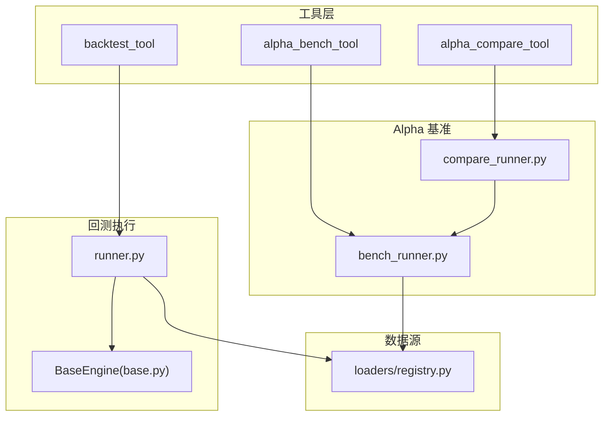
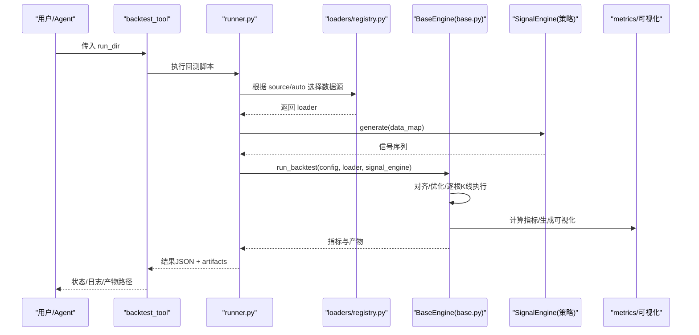
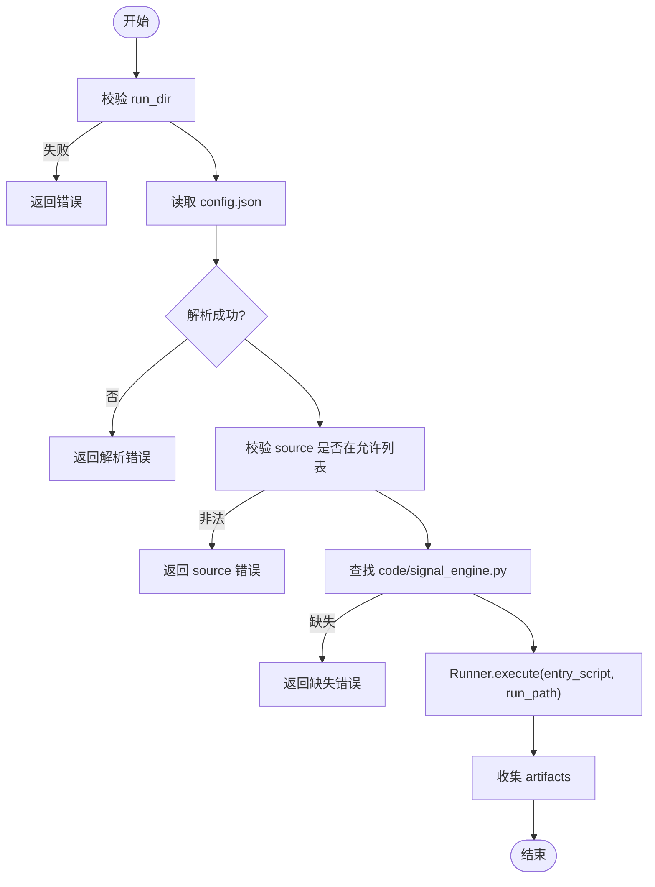
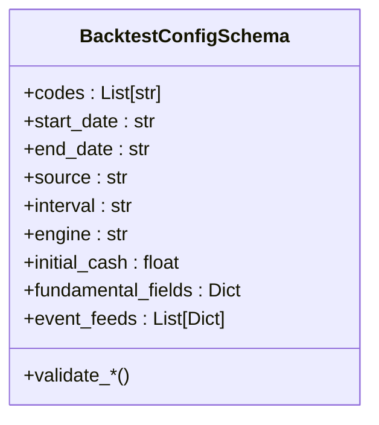
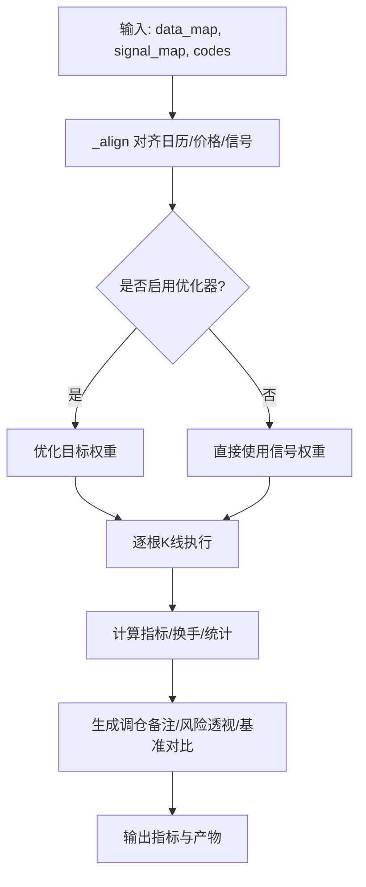
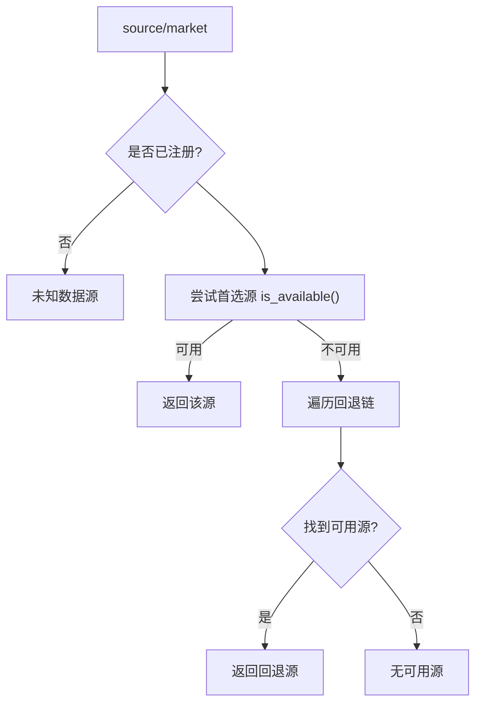
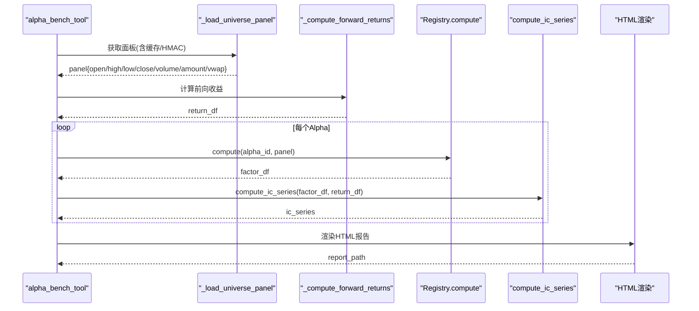
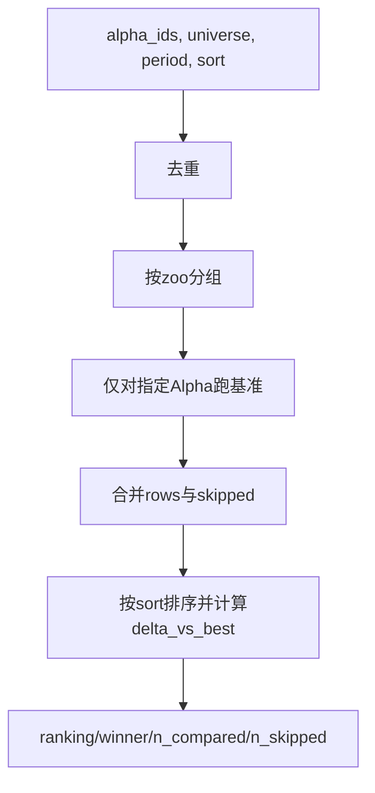
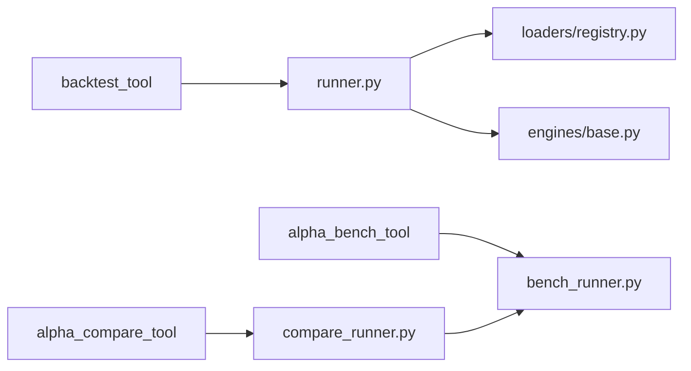

# 回测工具

<cite>
**本文引用的文件**
- [agent/src/tools/backtest_tool.py](file://agent/src/tools/backtest_tool.py)
- [agent/backtest/runner.py](file://agent/backtest/runner.py)
- [agent/backtest/engines/base.py](file://agent/backtest/engines/base.py)
- [agent/backtest/loaders/registry.py](file://agent/backtest/loaders/registry.py)
- [agent/src/tools/alpha_bench_tool.py](file://agent/src/tools/alpha_bench_tool.py)
- [agent/src/factors/bench_runner.py](file://agent/src/factors/bench_runner.py)
- [agent/src/tools/alpha_compare_tool.py](file://agent/src/tools/alpha_compare_tool.py)
- [agent/src/factors/compare_runner.py](file://agent/src/factors/compare_runner.py)
</cite>

## 目录
1. [简介](#简介)
2. [项目结构](#项目结构)
3. [核心组件](#核心组件)
4. [架构总览](#架构总览)
5. [详细组件分析](#详细组件分析)
6. [依赖关系分析](#依赖关系分析)
7. [性能考虑](#性能考虑)
8. [故障排查指南](#故障排查指南)
9. [结论](#结论)
10. [附录：API与使用示例](#附录api与使用示例)

## 简介
本文件系统性介绍 Vibe-Trading 的回测工具集，覆盖三大能力：
- backtest_tool：策略回测、绩效分析与参数优化入口，负责校验配置、加载数据、执行信号引擎并输出指标与可视化产物。
- alpha_bench_tool：Alpha 因子基准测试，计算 IC/IR 等统计量，生成 HTML 报告，支持多市场宽基组合（CSI300、S&P500、BTC-USDT）。
- alpha_compare_tool：多策略/多 Alpha 的横向对比，按指定指标排序并给出领先者差距。

同时说明回测引擎选择机制、数据源集成方式、结果可视化功能，并提供最佳实践、性能优化建议与常见问题解决方案。

## 项目结构
围绕回测工具的核心路径如下：
- 工具层：backtest_tool、alpha_bench_tool、alpha_compare_tool
- 回测执行：runner.py 解析配置与安全校验，调用 BaseEngine 执行逐根 K 线回测
- 数据源：loaders/registry.py 提供统一注册表与市场级回退链
- 引擎层：engines/base.py 实现通用回测流程（对齐、权重优化、交易执行、指标计算）
- Alpha 基准：bench_runner.py 与 compare_runner.py 完成因子 IC 计算与对比排序

图表来源
- [agent/src/tools/backtest_tool.py:15-95](file://agent/src/tools/backtest_tool.py#L15-L95)
- [agent/backtest/runner.py:1-125](file://agent/backtest/runner.py#L1-L125)
- [agent/backtest/engines/base.py:647-769](file://agent/backtest/engines/base.py#L647-L769)
- [agent/backtest/loaders/registry.py:158-249](file://agent/backtest/loaders/registry.py#L158-L249)
- [agent/src/tools/alpha_bench_tool.py:96-159](file://agent/src/tools/alpha_bench_tool.py#L96-L159)
- [agent/src/factors/bench_runner.py:137-209](file://agent/src/factors/bench_runner.py#L137-L209)
- [agent/src/tools/alpha_compare_tool.py:44-114](file://agent/src/tools/alpha_compare_tool.py#L44-L114)
- [agent/src/factors/compare_runner.py:88-210](file://agent/src/factors/compare_runner.py#L88-L210)

章节来源
- [agent/src/tools/backtest_tool.py:15-95](file://agent/src/tools/backtest_tool.py#L15-L95)
- [agent/backtest/runner.py:1-125](file://agent/backtest/runner.py#L1-L125)
- [agent/backtest/loaders/registry.py:158-249](file://agent/backtest/loaders/registry.py#L158-L249)

## 核心组件
- backtest_tool：封装回测运行入口，校验 run_dir、config.json、signal_engine.py，调用 Runner 执行内置回测引擎，收集 artifacts。
- runner.py：读取配置、安全校验 signal_engine.py、选择数据源与引擎、执行回测、产出指标与可视化产物。
- engines/base.py：通用回测引擎，包含数据对齐、目标权重优化、逐根 K 线执行、指标计算、基准收益接入、风险透视与调仓备注。
- loaders/registry.py：数据源注册表与市场级回退链，自动选择可用数据源。
- alpha_bench_tool：Alpha 因子基准测试，构建面板数据、计算前向收益与 IC/IR、生成 HTML 报告。
- bench_runner.py：并行执行因子 IC 统计，分类 alive/reversed/dead，多重检验校正。
- alpha_compare_tool：多 Alpha 对比工具，按 IR/IC 等指标排序并输出排名与差距。
- compare_runner.py：对比核心逻辑，分组 zoo、仅对指定 Alpha 跑基准、合并结果并排名。

章节来源
- [agent/src/tools/backtest_tool.py:15-95](file://agent/src/tools/backtest_tool.py#L15-L95)
- [agent/backtest/runner.py:68-163](file://agent/backtest/runner.py#L68-L163)
- [agent/backtest/engines/base.py:377-769](file://agent/backtest/engines/base.py#L377-L769)
- [agent/backtest/loaders/registry.py:23-155](file://agent/backtest/loaders/registry.py#L23-L155)
- [agent/src/tools/alpha_bench_tool.py:96-159](file://agent/src/tools/alpha_bench_tool.py#L96-L159)
- [agent/src/factors/bench_runner.py:137-209](file://agent/src/factors/bench_runner.py#L137-L209)
- [agent/src/tools/alpha_compare_tool.py:44-114](file://agent/src/tools/alpha_compare_tool.py#L44-L114)
- [agent/src/factors/compare_runner.py:88-210](file://agent/src/factors/compare_runner.py#L88-L210)

## 架构总览
回测工具的整体调用链与数据流如下：

图表来源
- [agent/src/tools/backtest_tool.py:15-95](file://agent/src/tools/backtest_tool.py#L15-L95)
- [agent/backtest/runner.py:68-163](file://agent/backtest/runner.py#L68-L163)
- [agent/backtest/loaders/registry.py:158-249](file://agent/backtest/loaders/registry.py#L158-L249)
- [agent/backtest/engines/base.py:647-769](file://agent/backtest/engines/base.py#L647-L769)

## 详细组件分析

### backtest_tool：策略回测入口
- 职责：校验 run_dir、config.json、source 合法性；定位 signal_engine.py；通过 Runner 执行回测；汇总 artifacts。
- 关键参数：run_dir（必填），内部会读取 config.json 中的 codes、start_date、end_date、source、interval、engine、initial_cash、fundamental_fields、event_feeds 等。
- 输出：status、exit_code、stdout/stderr、artifacts、run_dir。

图表来源
- [agent/src/tools/backtest_tool.py:15-95](file://agent/src/tools/backtest_tool.py#L15-L95)

章节来源
- [agent/src/tools/backtest_tool.py:15-95](file://agent/src/tools/backtest_tool.py#L15-L95)

### runner.py：配置校验与安全沙箱
- 配置校验：BacktestConfigSchema 校验 codes、日期区间、interval、engine、source、initial_cash、fundamental_fields、event_feeds。
- 安全沙箱：AST 扫描禁止危险导入/函数调用/文件系统写入/进程/网络等，确保策略代码在受限环境中执行。
- 市场检测：复用 _market_hooks 进行市场类型判断，辅助对齐与限幅计算。

图表来源
- [agent/backtest/runner.py:68-163](file://agent/backtest/runner.py#L68-L163)

章节来源
- [agent/backtest/runner.py:68-163](file://agent/backtest/runner.py#L68-L163)
- [agent/backtest/runner.py:165-768](file://agent/backtest/runner.py#L165-L768)

### engines/base.py：回测引擎核心
- 数据对齐：_align 将不同标的日历对齐到统一时间轴，构造 close 矩阵、目标仓位矩阵与收益率矩阵，支持可选权重优化器。
- 执行循环：逐根 K 线执行交易，应用滑点、手续费、涨跌停限制、保证金与杠杆等规则。
- 指标与可视化：计算权益曲线、换手率、交易明细、按标的/退出原因统计；生成调仓备注与风险透视；可接入外部基准收益。

图表来源
- [agent/backtest/engines/base.py:149-249](file://agent/backtest/engines/base.py#L149-L249)
- [agent/backtest/engines/base.py:647-769](file://agent/backtest/engines/base.py#L647-L769)

章节来源
- [agent/backtest/engines/base.py:377-769](file://agent/backtest/engines/base.py#L377-L769)

### loaders/registry.py：数据源选择与回退链
- 注册表：LOADER_REGISTRY 维护所有已注册的数据源类。
- 市场回退链：FALLBACK_CHAINS 定义各市场的优先级顺序（如 a_share、us_equity、crypto 等），优先尝试低封禁风险与高质量源。
- 解析与回退：resolve_loader/get_loader_cls_with_fallback 按市场或显式 source 选择可用数据源，必要时回退到同市场其他源；local/qveris 不静默降级。

图表来源
- [agent/backtest/loaders/registry.py:158-249](file://agent/backtest/loaders/registry.py#L158-L249)

章节来源
- [agent/backtest/loaders/registry.py:23-155](file://agent/backtest/loaders/registry.py#L23-L155)
- [agent/backtest/loaders/registry.py:158-249](file://agent/backtest/loaders/registry.py#L158-L249)

### alpha_bench_tool：Alpha 因子基准测试
- 面板构建：_load_universe_panel 支持 csi300/sp500/btc-usdt，带缓存与 HMAC 完整性校验，避免本地篡改。
- 前向收益：_compute_forward_returns 基于 close 计算下一期简单收益率。
- IC/IR 计算：调用 registry.compute 得到因子序列，再计算 IC 系列与 IR，输出 top 列表与 HTML 报告。
- 多重检验：bench_runner 提供 deflated_sharpe_ratio 与 expected_maximum_sharpe，评估“搜索偏差”。

图表来源
- [agent/src/tools/alpha_bench_tool.py:96-159](file://agent/src/tools/alpha_bench_tool.py#L96-L159)
- [agent/src/tools/alpha_bench_tool.py:616-657](file://agent/src/tools/alpha_bench_tool.py#L616-L657)
- [agent/src/factors/bench_runner.py:137-209](file://agent/src/factors/bench_runner.py#L137-L209)

章节来源
- [agent/src/tools/alpha_bench_tool.py:96-159](file://agent/src/tools/alpha_bench_tool.py#L96-L159)
- [agent/src/tools/alpha_bench_tool.py:616-657](file://agent/src/tools/alpha_bench_tool.py#L616-L657)
- [agent/src/factors/bench_runner.py:137-209](file://agent/src/factors/bench_runner.py#L137-L209)

### alpha_compare_tool：多策略/多 Alpha 对比
- 输入：alpha_ids（至少2个）、universe、period、sort（默认 ir）。
- 处理：去重、按 zoo 分组、仅对指定 Alpha 跑基准（避免全 zoo 计算）、合并结果并按指标排序，计算 delta_vs_best。
- 输出：ranking、winner、n_compared、n_skipped、skipped 原因。

图表来源
- [agent/src/tools/alpha_compare_tool.py:44-114](file://agent/src/tools/alpha_compare_tool.py#L44-L114)
- [agent/src/factors/compare_runner.py:88-210](file://agent/src/factors/compare_runner.py#L88-L210)

章节来源
- [agent/src/tools/alpha_compare_tool.py:44-114](file://agent/src/tools/alpha_compare_tool.py#L44-L114)
- [agent/src/factors/compare_runner.py:88-210](file://agent/src/factors/compare_runner.py#L88-L210)

## 依赖关系分析
- backtest_tool 依赖 runner.py 与 Runner，后者依赖 loaders/registry.py 与 engines/base.py。
- alpha_bench_tool 依赖 bench_runner.py 与 compare_runner.py，二者共享 Registry 与 IC 计算模块。
- 数据源通过 registry 统一管理，支持市场级回退链，保证在不同环境下稳定获取数据。

图表来源
- [agent/src/tools/backtest_tool.py:15-95](file://agent/src/tools/backtest_tool.py#L15-L95)
- [agent/backtest/runner.py:68-163](file://agent/backtest/runner.py#L68-L163)
- [agent/backtest/loaders/registry.py:158-249](file://agent/backtest/loaders/registry.py#L158-L249)
- [agent/backtest/engines/base.py:647-769](file://agent/backtest/engines/base.py#L647-L769)
- [agent/src/tools/alpha_bench_tool.py:96-159](file://agent/src/tools/alpha_bench_tool.py#L96-L159)
- [agent/src/factors/bench_runner.py:137-209](file://agent/src/factors/bench_runner.py#L137-L209)
- [agent/src/tools/alpha_compare_tool.py:44-114](file://agent/src/tools/alpha_compare_tool.py#L44-L114)
- [agent/src/factors/compare_runner.py:88-210](file://agent/src/factors/compare_runner.py#L88-L210)

章节来源
- [agent/backtest/loaders/registry.py:158-249](file://agent/backtest/loaders/registry.py#L158-L249)

## 性能考虑
- 并行与缓存
  - Alpha 基准使用 ProcessPoolExecutor 并行计算 IC，并通过环境变量控制 worker 数量；面板数据采用 pickle 缓存与 HMAC 校验，减少重复网络请求。
- 数据对齐与填充
  - 使用 numpy/pandas 向量化对齐与 ffill，跨市场场景提高容错（更大 ffill 限制），避免长停牌导致信号丢失。
- 优化器与约束
  - 动态加载优化器（mean_variance、risk_parity 等），结合约束框架对权重进行后处理，提升稳健性。
- 基准收益
  - 支持外部基准（如指数），通过 resolve_benchmark 拉取并拼接至策略收益曲线，便于相对表现评估。

[本节为通用性能讨论，不直接分析具体文件]

## 故障排查指南
- 数据源不可用
  - 现象：NoAvailableSourceError 或空面板。
  - 排查：检查网络、API Token、本地 Data Bridge 配置；确认 source 是否在 VALID_SOURCES；查看回退链是否全部失败。
- 配置错误
  - 现象：BacktestConfigSchema 校验失败（日期格式、interval/engine/source 非法、initial_cash<=0）。
  - 排查：修正 config.json 字段；确保 start_date <= end_date。
- 策略代码安全拦截
  - 现象：signal_engine.py 被 AST 扫描拒绝（导入 forbidden modules、写文件、exec/eval、getattr 绕过等）。
  - 排查：移除危险操作；仅保留纯计算逻辑；避免网络与系统调用。
- 基准测试失败
  - 现象：未安装 tushare、SP500 维基百科抓取失败、btc-usdt 单资产无法做横截面 IC。
  - 排查：安装依赖、设置 TUSHARE_TOKEN；使用多币种组合替代单资产；关注 meta 中的 survivorship_bias 提示。
- 对比比较异常
  - 现象：少于2个有效 Alpha 或全部 skipped。
  - 排查：确认 alpha_ids 存在且可注册；检查 universe/period 有效性；查看 skipped 原因。

章节来源
- [agent/backtest/loaders/registry.py:158-249](file://agent/backtest/loaders/registry.py#L158-L249)
- [agent/backtest/runner.py:68-163](file://agent/backtest/runner.py#L68-L163)
- [agent/backtest/runner.py:165-768](file://agent/backtest/runner.py#L165-L768)
- [agent/src/tools/alpha_bench_tool.py:96-159](file://agent/src/tools/alpha_bench_tool.py#L96-L159)
- [agent/src/tools/alpha_compare_tool.py:44-114](file://agent/src/tools/alpha_compare_tool.py#L44-L114)

## 结论
Vibe-Trading 的回测工具集以模块化设计实现了从策略回测到 Alpha 基准与对比的全链路能力：
- backtest_tool 提供安全的策略回测入口，配合 runner 的安全沙箱与 BaseEngine 的通用执行流程，确保策略在受控环境中高效运行。
- alpha_bench_tool 与 bench_runner 提供高性能、可缓存、具备多重检验校正的因子基准测试，支持多市场与 HTML 可视化。
- alpha_compare_tool 与 compare_runner 聚焦于多策略/多 Alpha 的横向对比，快速给出排名与差距。
通过统一的数据源注册表与回退链，系统在多种市场与网络环境下保持稳定。建议遵循最佳实践与性能优化建议，以获得更可靠的回测与基准结果。

[本节为总结性内容，不直接分析具体文件]

## 附录：API与使用示例

### backtest_tool API
- 名称：backtest
- 描述：运行回测：校验 config.json + signal_engine.py，调用内置引擎。
- 参数：
  - run_dir（string，必填）：回测运行目录路径。
- 行为：
  - 校验 run_dir 与 config.json；校验 source 是否在允许列表；定位 code/signal_engine.py；通过 Runner 执行回测；收集 artifacts。
- 返回：
  - status、exit_code、stdout/stderr、artifacts、run_dir。

章节来源
- [agent/src/tools/backtest_tool.py:77-95](file://agent/src/tools/backtest_tool.py#L77-L95)

### alpha_bench_tool API
- 名称：alpha_bench
- 描述：Alpha 因子基准测试，计算 IC/IR，生成 HTML 报告。
- 参数（典型）：
  - zoo（string）：Alpha Zoo 标识（如 gtja191、alpha101、qlib158）。
  - universe（string）：csi300 | sp500 | btc-usdt。
  - period（string）：YYYY-YYYY 或 YYYY-MM-DD/YYYY-MM-DD。
  - top（int，可选）：保留 Top N 的结果。
- 行为：
  - 加载面板数据（带缓存与 HMAC 校验）；计算前向收益；并行计算 IC/IR；分类 alive/reversed/dead；生成 HTML 报告。
- 返回：
  - status、report_path、n_alphas_tested、n_skipped、top 列表等。

章节来源
- [agent/src/tools/alpha_bench_tool.py:1-25](file://agent/src/tools/alpha_bench_tool.py#L1-L25)
- [agent/src/tools/alpha_bench_tool.py:96-159](file://agent/src/tools/alpha_bench_tool.py#L96-L159)
- [agent/src/tools/alpha_bench_tool.py:616-657](file://agent/src/tools/alpha_bench_tool.py#L616-L657)

### alpha_compare_tool API
- 名称：alpha_compare
- 描述：对比一组 Alpha（>=2），在指定宇宙与周期内计算 IC/IR 并排序。
- 参数：
  - alpha_ids（array[string]，必填）：要对比的 Alpha ID 列表。
  - universe（string，必填）：csi300 | sp500 | btc-usdt。
  - period（string，必填）：YYYY-YYYY 或 YYYY-MM-DD/YYYY-MM-DD。
  - sort（string，可选）：ir | ic_mean | ic_positive_ratio | ic_count（默认 ir）。
- 行为：
  - 去重、按 zoo 分组、仅对指定 Alpha 跑基准、合并结果、排序并计算 delta_vs_best。
- 返回：
  - status、universe、period、sort、n_compared、n_skipped、winner、ranking、skipped。

章节来源
- [agent/src/tools/alpha_compare_tool.py:44-114](file://agent/src/tools/alpha_compare_tool.py#L44-L114)
- [agent/src/factors/compare_runner.py:88-210](file://agent/src/factors/compare_runner.py#L88-L210)

### 回测引擎选择机制
- 数据源选择：
  - 若 source="auto"，根据符号格式推断市场类型，然后按 FALLBACK_CHAINS 依次尝试可用数据源。
  - 若显式指定 source，则优先使用该源；若不可用且非 local/qveris，则尝试同市场回退链。
- 引擎选择：
  - engine 支持 daily/options；daily 用于股票/期货/外汇等常规回测，options 用于期权组合。
- 基准收益：
  - 可通过 benchmark 字段指定外部基准 ticker；resolve_benchmark 拉取基准收益并与策略收益对齐。

章节来源
- [agent/backtest/loaders/registry.py:158-249](file://agent/backtest/loaders/registry.py#L158-L249)
- [agent/backtest/runner.py:68-163](file://agent/backtest/runner.py#L68-L163)
- [agent/backtest/engines/base.py:728-751](file://agent/backtest/engines/base.py#L728-L751)

### 数据源集成
- 支持的市场与源：
  - A股：tencent、mootdx、eastmoney、baostock、akshare、tushare、local。
  - 美股：yahoo、stooq、sina、eastmoney、yfinance、tiingo、fmp、finnhub、alphavantage、longbridge、akshare、local。
  - 港股：tencent、eastmoney、yahoo、futu、akshare、yfinance、tushare、longbridge、local。
  - 印度/韩国/加拿大/加密货币/期货/基金/宏观/外汇：见 FALLBACK_CHAINS。
- 回退策略：
  - 优先低封禁风险与高质量源；local/qveris 不静默降级，避免误拉网络数据。

章节来源
- [agent/backtest/loaders/registry.py:23-155](file://agent/backtest/loaders/registry.py#L23-L155)
- [agent/backtest/loaders/registry.py:158-249](file://agent/backtest/loaders/registry.py#L158-L249)

### 结果可视化
- 回测产物：
  - 调仓备注：rebalance_notes.json 与 markdown 版本，记录权重漂移与换手。
  - 风险透视：risk_xray 产物，展示平均持仓的风险暴露。
  - 基准对比：策略权益曲线与基准权益曲线对比。
- Alpha 基准报告：
  - HTML 报告：Top by IR、公式 LaTeX、跳过/失败原因；CSP 严格限制外部资源。

章节来源
- [agent/backtest/engines/base.py:770-800](file://agent/backtest/engines/base.py#L770-L800)
- [agent/src/tools/alpha_bench_tool.py:677-800](file://agent/src/tools/alpha_bench_tool.py#L677-L800)

### 回测最佳实践
- 配置规范：
  - 明确 source 与 interval；确保 initial_cash > 0；合理设置 fundamental_fields 与 event_feeds。
- 策略编写：
  - 仅包含纯计算逻辑；避免网络、进程、文件系统写入；遵守安全沙箱限制。
- 数据质量：
  - 使用调整后的价格（如 QFQ）；关注 survivorship_bias 提示；必要时使用多资产组合。
- 性能优化：
  - 合理设置 bench workers；利用面板缓存；避免不必要的网络请求。
- 结果解读：
  - 关注 IR、IC+ ratio、样本量；结合多重检验校正评估显著性；对比基准理解相对表现。

[本节为通用指导，不直接分析具体文件]

### 常见问题解决方案
- “无可用数据源”：检查网络与 Token；确认 source 合法；查看回退链是否全部失败。
- “策略代码被拒绝”：移除危险导入/调用；避免 eval/exec/open 写文件；不使用 getattr 绕过。
- “基准为空或报错”：安装 tushare/yfinance；设置 TUSHARE_TOKEN；使用多资产组合；检查 period 与 universe。
- “对比结果为空”：确保至少2个有效 Alpha；检查 universe/period；查看 skipped 原因。

章节来源
- [agent/backtest/loaders/registry.py:158-249](file://agent/backtest/loaders/registry.py#L158-L249)
- [agent/backtest/runner.py:165-768](file://agent/backtest/runner.py#L165-L768)
- [agent/src/tools/alpha_bench_tool.py:96-159](file://agent/src/tools/alpha_bench_tool.py#L96-L159)
- [agent/src/tools/alpha_compare_tool.py:44-114](file://agent/src/tools/alpha_compare_tool.py#L44-L114)