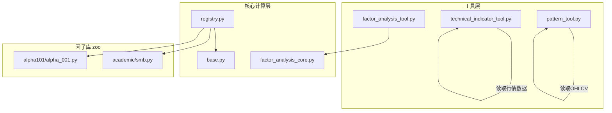
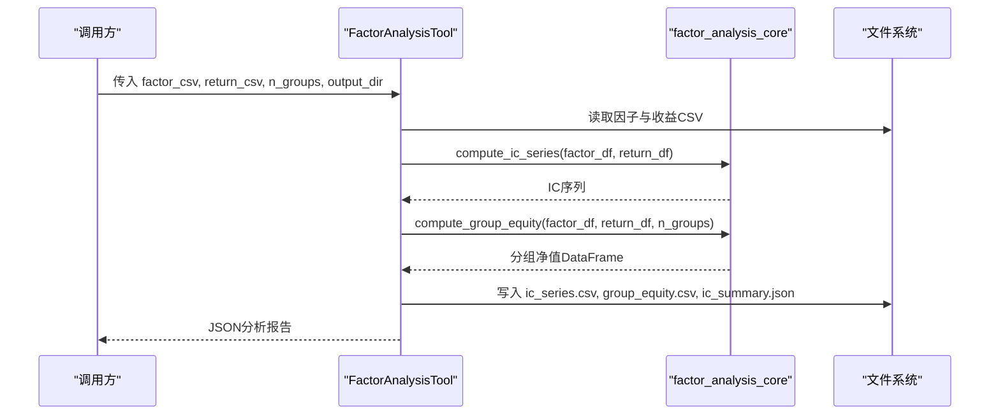
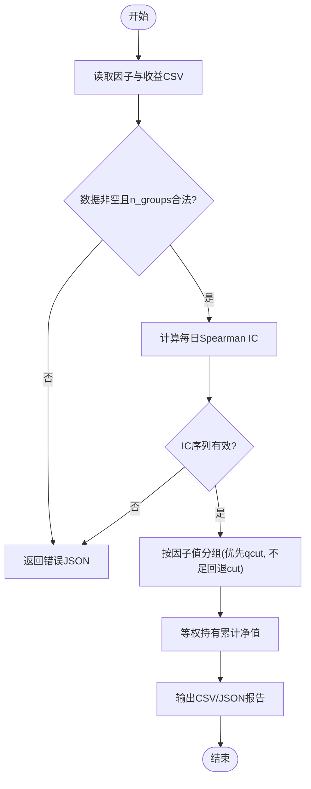
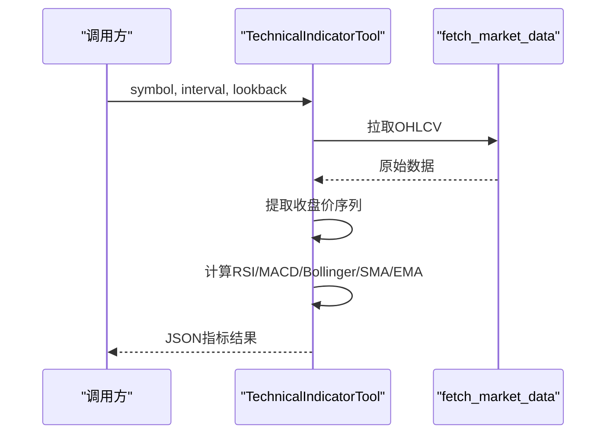
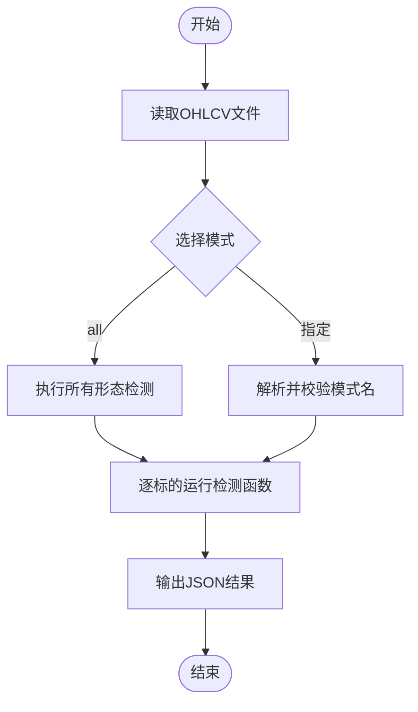
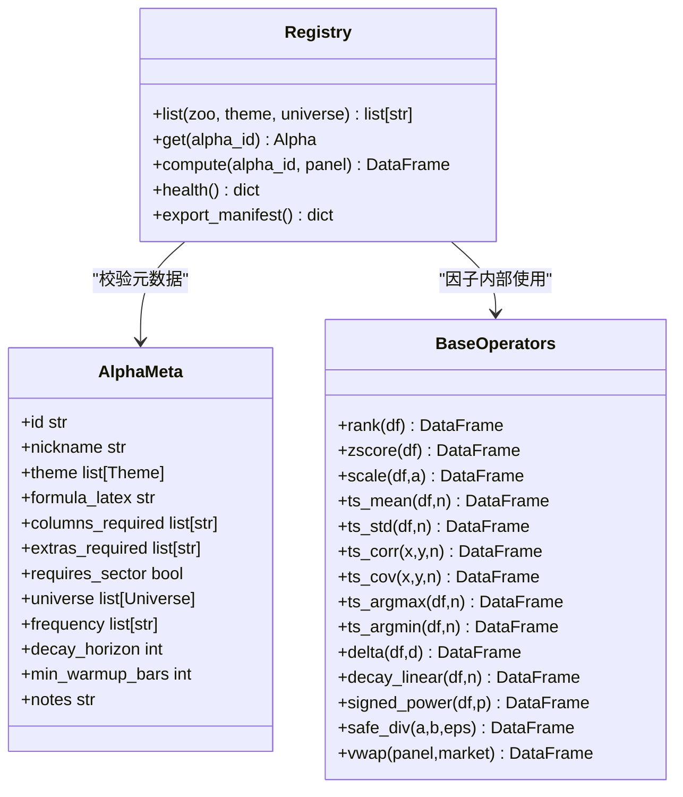
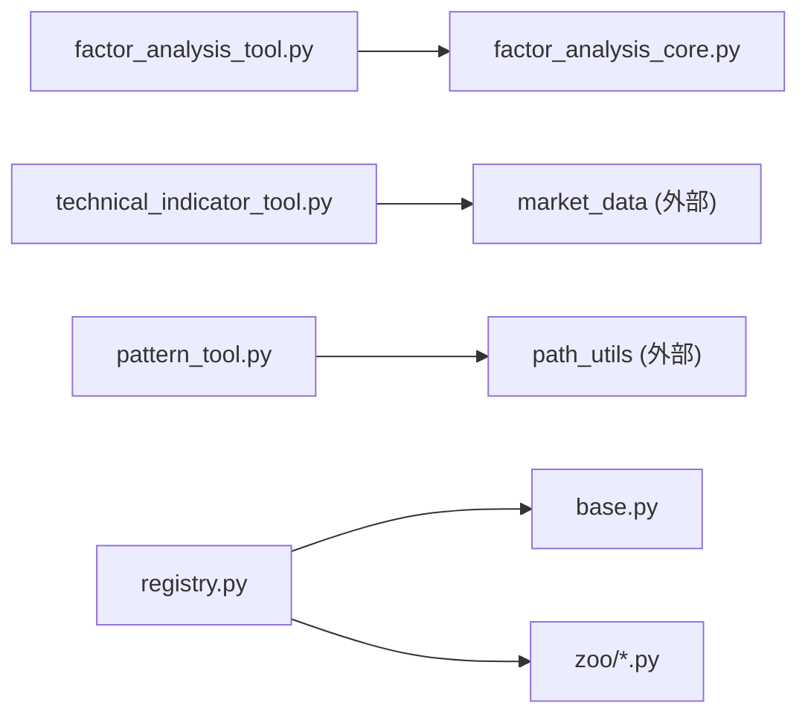

# 因子分析工具

<cite>
**本文引用的文件**
- [factor_analysis_tool.py](file://agent/src/tools/factor_analysis_tool.py)
- [technical_indicator_tool.py](file://agent/src/tools/technical_indicator_tool.py)
- [pattern_tool.py](file://agent/src/tools/pattern_tool.py)
- [factor_analysis_core.py](file://agent/src/factors/factor_analysis_core.py)
- [base.py](file://agent/src/factors/base.py)
- [registry.py](file://agent/src/factors/registry.py)
- [smb.py](file://agent/src/factors/zoo/academic/smb.py)
- [alpha_001.py](file://agent/src/factors/zoo/alpha101/alpha_001.py)
</cite>

## 目录
1. [简介](#简介)
2. [项目结构](#项目结构)
3. [核心组件](#核心组件)
4. [架构总览](#架构总览)
5. [详细组件分析](#详细组件分析)
6. [依赖关系分析](#依赖关系分析)
7. [性能考量](#性能考量)
8. [故障排查指南](#故障排查指南)
9. [结论](#结论)
10. [附录](#附录)

## 简介
本文件系统性介绍 Vibe-Trading 的因子分析工具集，覆盖以下能力：
- factor_analysis_tool：支持量化因子的计算、分层回测与评估（IC/IR、分组净值曲线、多空价差等）。
- technical_indicator_tool：提供常用技术分析指标计算（RSI、MACD、布林带、SMA、EMA），基于统一市场数据管线。
- pattern_tool：识别价格形态与技术信号（头肩顶/底、双顶/底、三角形、喇叭口、K线形态、支撑阻力、趋势斜率等）。

同时说明因子库架构、内置因子类型与自定义因子开发规范；记录因子有效性检验、相关性分析与组合构建方法；包含因子衰减检测、过拟合防范与稳健性检验建议；并提供因子研究工作流程与最佳实践指导。

## 项目结构
围绕因子分析的工具与核心逻辑主要分布在如下位置：
- 工具层（对外暴露）：
  - agent/src/tools/factor_analysis_tool.py：因子分析工具入口，封装 IC/IR 与分层回测流程。
  - agent/src/tools/technical_indicator_tool.py：技术指标计算工具。
  - agent/src/tools/pattern_tool.py：图表形态识别工具。
- 核心计算层（被工具复用）：
  - agent/src/factors/factor_analysis_core.py：IC 序列与分组净值计算的纯数学实现。
  - agent/src/factors/base.py：因子算子库（横截面/时间序列算子、安全函数、VWAP 等）。
  - agent/src/factors/registry.py：因子注册表（AST 扫描、元数据校验、懒加载 compute）。
- 因子库（zoo）：
  - agent/src/factors/zoo/academic/smb.py：学术因子示例（规模代理）。
  - agent/src/factors/zoo/alpha101/alpha_001.py：Alpha101 系列示例。

**图示来源**
- [factor_analysis_tool.py:19-105](file://agent/src/tools/factor_analysis_tool.py#L19-L105)
- [factor_analysis_core.py:8-102](file://agent/src/factors/factor_analysis_core.py#L8-L102)
- [registry.py:201-397](file://agent/src/factors/registry.py#L201-L397)
- [base.py:62-356](file://agent/src/factors/base.py#L62-L356)
- [smb.py:25-62](file://agent/src/factors/zoo/academic/smb.py#L25-L62)
- [alpha_001.py:38-65](file://agent/src/factors/zoo/alpha101/alpha_001.py#L38-L65)

**章节来源**
- [factor_analysis_tool.py:19-105](file://agent/src/tools/factor_analysis_tool.py#L19-L105)
- [technical_indicator_tool.py:157-283](file://agent/src/tools/technical_indicator_tool.py#L157-L283)
- [pattern_tool.py:323-411](file://agent/src/tools/pattern_tool.py#L323-L411)
- [factor_analysis_core.py:8-102](file://agent/src/factors/factor_analysis_core.py#L8-L102)
- [base.py:62-356](file://agent/src/factors/base.py#L62-L356)
- [registry.py:201-397](file://agent/src/factors/registry.py#L201-L397)

## 核心组件
- 因子分析工具（factor_analysis_tool）
  - 输入：因子值 CSV（index=date, columns=codes）、收益率 CSV（同结构）。
  - 输出：IC 序列、IC 统计摘要（均值、标准差、IR、正比率）、分组净值曲线、多空价差。
  - 关键流程：读取数据 → 计算每日 Spearman IC → 过滤有效日期 → 分组排序（qcut/cut）→ 等权持有累计净值 → 汇总报告。
- 技术指标工具（technical_indicator_tool）
  - 通过统一数据管线拉取 OHLCV，计算 RSI、MACD、布林带、SMA、EMA。
  - 对多源数据结构进行归一化提取收盘价序列，保证连续无截断。
- 形态识别工具（pattern_tool）
  - 从运行目录 artifacts 中读取 OHLCV，识别多种形态并输出计数或信号序列。
  - 支持 peaks/valleys、K线形态、支撑阻力、趋势斜率、头肩顶/底、双顶/底、三角形、喇叭口。

**章节来源**
- [factor_analysis_tool.py:19-105](file://agent/src/tools/factor_analysis_tool.py#L19-L105)
- [technical_indicator_tool.py:157-283](file://agent/src/tools/technical_indicator_tool.py#L157-L283)
- [pattern_tool.py:323-411](file://agent/src/tools/pattern_tool.py#L323-L411)

## 架构总览
整体架构分为“工具层—核心计算层—因子库”三层：
- 工具层：面向用户/Agent 的接口，负责参数校验、IO、结果序列化。
- 核心计算层：提供可复用的数学与数据处理能力（IC、分组净值、算子、注册表）。
- 因子库：以模块形式组织因子，每个因子声明 __alpha_meta__ 并通过 registry 懒加载 compute。

**图示来源**
- [factor_analysis_tool.py:19-105](file://agent/src/tools/factor_analysis_tool.py#L19-L105)
- [factor_analysis_core.py:8-102](file://agent/src/factors/factor_analysis_core.py#L8-L102)

## 详细组件分析

### 因子分析工具（factor_analysis_tool）
- 功能要点
  - 计算每日 Spearman IC（通过 rank + corrwith 实现），仅保留当日有效样本数≥5的日期。
  - 生成 IC 统计摘要：均值、标准差、IR、正比率、样本数。
  - 分层回测：按因子值分位数分组（优先 qcut，不足时回退 cut），等权持有，计算累计净值。
  - 输出：ic_series.csv、group_equity.csv、ic_summary.json，以及 JSON 摘要（含多空价差）。
- 错误处理
  - CSV 读取失败、空数据、n_groups 非法、IC 计算失败、分组回测无效等路径均返回结构化错误信息。
- 复杂度与性能
  - IC 计算为向量化操作，时间复杂度近似 O(T×C log C)（每日期列排序/排名）。
  - 分组回测逐日遍历，qcut/cut 与 mean 均为向量化，整体高效。

**图示来源**
- [factor_analysis_tool.py:19-105](file://agent/src/tools/factor_analysis_tool.py#L19-L105)
- [factor_analysis_core.py:8-102](file://agent/src/factors/factor_analysis_core.py#L8-L102)

**章节来源**
- [factor_analysis_tool.py:19-105](file://agent/src/tools/factor_analysis_tool.py#L19-L105)
- [factor_analysis_core.py:8-102](file://agent/src/factors/factor_analysis_core.py#L8-L102)

### 技术指标工具（technical_indicator_tool）
- 功能要点
  - 通过 fetch_market_data 获取 OHLCV，自动适配多种数据结构，提取收盘价序列。
  - 计算 RSI（Wilder平滑）、MACD（快慢EMA与信号线）、布林带（SMA±kσ）、SMA（多周期）、EMA（单周期）。
  - 限制最大回溯长度，避免过长窗口导致性能问题。
- 错误处理
  - 数据缺失、无收盘价列、数据被截断等情况返回明确错误。
- 复杂度与性能
  - 全部为纯 Python/numpy/pandas 计算，无额外依赖；滚动窗口计算向量化，适合批量标的。

**图示来源**
- [technical_indicator_tool.py:157-283](file://agent/src/tools/technical_indicator_tool.py#L157-L283)

**章节来源**
- [technical_indicator_tool.py:157-283](file://agent/src/tools/technical_indicator_tool.py#L157-L283)

### 形态识别工具（pattern_tool）
- 功能要点
  - 从 run_dir/artifacts 读取 OHLCV，支持选择多种形态检测。
  - 提供基础算子：峰值/谷值检测、K线形态（十字星、锤子线、吞没）、支撑阻力聚类、滚动线性拟合斜率。
  - 高级形态：头肩顶/底、双顶/底、三角形、喇叭口。
- 错误处理
  - 未找到 OHLCV、patterns 不合法、window 参数非法等路径返回错误。
- 复杂度与性能
  - 多数算法基于滑动窗口与极值检测，时间复杂度近似 O(T×w)，w 为窗口大小。

**图示来源**
- [pattern_tool.py:323-411](file://agent/src/tools/pattern_tool.py#L323-L411)

**章节来源**
- [pattern_tool.py:323-411](file://agent/src/tools/pattern_tool.py#L323-L411)

### 因子库架构与自定义因子开发
- 架构设计
  - base.py 提供统一的宽表 DataFrame 算子（横截面 rank/zscore/scale，时间序列 rolling/ts_*，安全函数 safe_div/vwap 等）。
  - registry.py 通过 AST 扫描 zoo 目录，解析每个因子的 __alpha_meta__，进行严格校验（字段、主题、适用市场、频率、最小预热期等），并在 compute 时懒加载模块。
  - 每个因子模块需实现 compute(panel) -> pd.DataFrame，面板包含 open/high/low/close/volume/vwap/amount 等键，必要时需要 sector。
- 内置因子类型
  - academic：经典学术因子（如 SMB、HML、RMW 等）。
  - alpha101：公式型 Alpha 集合。
  - fundamental：基本面因子（盈利、ROE、资产增长等）。
  - gtja191/qlib158：工程化因子库。
- 自定义因子开发步骤
  - 在 zoo 下新建子目录与 .py 文件，定义 __alpha_meta__（id、theme、formula_latex、columns_required、universe、frequency、decay_horizon、min_warmup_bars、notes）。
  - 实现 compute(panel) 使用 base.py 算子组合，确保输出形状与 close 一致，禁止 inf/-inf，NaN 比例不超过阈值。
  - 通过 registry.compute(alpha_id, panel) 调用，或通过工具链进行 IC/分层回测评估。

**图示来源**
- [registry.py:87-125](file://agent/src/factors/registry.py#L87-L125)
- [registry.py:201-397](file://agent/src/factors/registry.py#L201-L397)
- [base.py:62-356](file://agent/src/factors/base.py#L62-L356)

**章节来源**
- [registry.py:201-397](file://agent/src/factors/registry.py#L201-L397)
- [base.py:62-356](file://agent/src/factors/base.py#L62-L356)
- [smb.py:25-62](file://agent/src/factors/zoo/academic/smb.py#L25-L62)
- [alpha_001.py:38-65](file://agent/src/factors/zoo/alpha101/alpha_001.py#L38-L65)

## 依赖关系分析
- 工具到核心的依赖
  - factor_analysis_tool 依赖 factor_analysis_core 的 IC 与分组净值计算。
  - technical_indicator_tool 依赖 market_data 管线与 pandas/numpy。
  - pattern_tool 依赖 path_utils 与 pandas/numpy。
- 因子库到算子与注册表的依赖
  - 各因子模块通过 base.py 提供的算子组合实现，由 registry.py 管理生命周期与校验。

**图示来源**
- [factor_analysis_tool.py:19-105](file://agent/src/tools/factor_analysis_tool.py#L19-L105)
- [technical_indicator_tool.py:157-283](file://agent/src/tools/technical_indicator_tool.py#L157-L283)
- [pattern_tool.py:323-411](file://agent/src/tools/pattern_tool.py#L323-L411)
- [registry.py:201-397](file://agent/src/factors/registry.py#L201-L397)
- [base.py:62-356](file://agent/src/factors/base.py#L62-L356)

**章节来源**
- [factor_analysis_tool.py:19-105](file://agent/src/tools/factor_analysis_tool.py#L19-L105)
- [technical_indicator_tool.py:157-283](file://agent/src/tools/technical_indicator_tool.py#L157-L283)
- [pattern_tool.py:323-411](file://agent/src/tools/pattern_tool.py#L323-L411)
- [registry.py:201-397](file://agent/src/factors/registry.py#L201-L397)

## 性能考量
- 因子计算
  - 使用向量化 rank/corrwith 计算 IC，避免逐行循环。
  - 分组回测采用 qcut/cut 与 mean 向量化，减少 Python 层开销。
  - 长窗口运算（如 ts_rank、decay_linear）利用 numpy 滑动窗口视图提升速度。
- 技术指标
  - 限制最大回溯长度，避免不必要的数据拉取与计算。
  - 指标计算均为本地 numpy/pandas，无额外网络请求。
- 形态识别
  - 窗口内极值检测与线性拟合尽量向量化，控制窗口大小以平衡精度与性能。

[本节为通用性能讨论，无需具体文件引用]

## 故障排查指南
- 因子分析工具
  - CSV 读取失败或数据为空：检查文件路径与格式（index=date, columns=codes）。
  - IC 计算失败：确认共享日期与标的数量足够（至少5个/日）。
  - 分组回测失败：检查因子值分布是否足以形成 n_groups 组。
- 技术指标工具
  - 无法获取数据或被截断：确认 symbol、interval、lookback 设置合理，并确保数据连续。
  - 缺少收盘价列：检查数据源列名映射。
- 形态识别工具
  - 未找到 OHLCV：先运行回测生成 artifacts。
  - patterns 不合法或 window 过小：根据提示调整参数。

**章节来源**
- [factor_analysis_tool.py:36-85](file://agent/src/tools/factor_analysis_tool.py#L36-L85)
- [technical_indicator_tool.py:200-252](file://agent/src/tools/technical_indicator_tool.py#L200-L252)
- [pattern_tool.py:334-360](file://agent/src/tools/pattern_tool.py#L334-L360)

## 结论
Vibe-Trading 的因子分析工具集提供了从因子计算、技术指标到形态识别的一体化能力，配合严格的因子注册与算子体系，便于快速验证与扩展。通过 IC/IR、分层回测与形态信号，可构建稳健的研究闭环；结合衰减检测、过拟合防范与稳健性检验，有助于产出可落地的策略。

[本节为总结性内容，无需具体文件引用]

## 附录

### 因子有效性检验、相关性分析与组合构建方法
- 因子有效性检验
  - IC/IR：使用 factor_analysis_core 的 compute_ic_series 计算每日 Spearman IC，并汇总均值、标准差、IR、正比率。
  - 分层回测：compute_group_equity 按因子值分组，等权持有，观察分组净值与多空价差。
- 相关性分析
  - 可使用横截面 rank 后的因子序列与收益率序列做相关矩阵（例如用 pandas.corr），或在因子组合前做相关性筛选以降低共线性。
- 组合构建方法
  - 等权加权：将多个因子标准化后简单平均，再排序构建多头/空头组合。
  - 风险平价/均值方差优化：结合协方差矩阵与约束条件进行权重优化（可结合 backtest optimizers 模块）。
  - 换手率感知优化：考虑交易成本与换手惩罚，降低频繁调仓带来的损耗。

[本节为方法论说明，无需具体文件引用]

### 因子衰减检测、过拟合防范与稳健性检验
- 因子衰减检测
  - 使用 decay_horizon 与 min_warmup_bars 描述因子预期衰减与预热期；在不同前瞻期（如 1d/5d/20d）评估 IC/IR 稳定性。
  - 观察分组净值随时间的变化，若后期显著退化，可能存在衰减或结构性变化。
- 过拟合防范
  - 严格划分训练/测试期，避免在测试集上直接调参。
  - 多重检验校正：对大量因子进行统计显著性检验时使用 FDR/Bonferroni 等方法。
  - 样本外与滚动窗口验证：确保策略在不同时间段稳定。
- 稳健性检验
  - 参数敏感性：对窗口、阈值等关键参数进行扰动，观察结果稳定性。
  - 不同市场/频率：在 equity_us/equity_cn/crypto 等多宇宙与 1d/1wk 等频率上验证。
  - 异常值与极端行情：检查极端波动期的表现与风控机制。

[本节为方法论说明，无需具体文件引用]

### 因子研究工作流程与最佳实践
- 工作流
  - 数据准备：统一 OHLCV 面板，确保列名与频率一致。
  - 因子开发：在 zoo 下新增因子模块，声明 __alpha_meta__，实现 compute。
  - 计算与评估：使用 factor_analysis_tool 计算 IC/IR 与分层净值；使用 technical_indicator_tool 辅助信号；使用 pattern_tool 识别形态。
  - 组合与回测：将因子纳入组合构建与回测引擎，评估绩效与风险。
  - 迭代优化：基于结果调整因子或组合权重，重复验证。
- 最佳实践
  - 保持因子纯净：避免未来函数，遵循 base.py 的 NaN 传播与 lookahead 禁令。
  - 控制复杂度：优先使用向量化算子，避免低效循环。
  - 文档化：完善 __alpha_meta__.notes，记录假设、参考与注意事项。
  - 安全与健壮：注册表对输出形状、inf/Nan 比例进行校验，确保下游可用性。

[本节为方法论说明，无需具体文件引用]