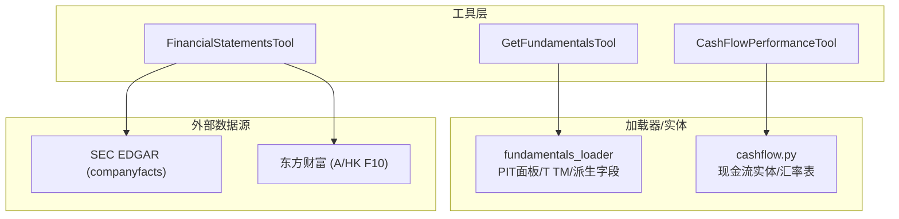
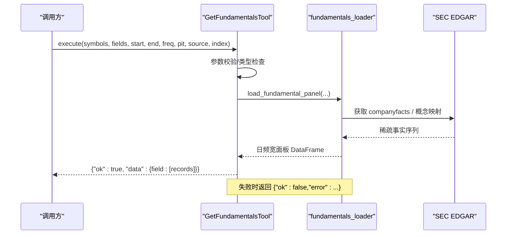
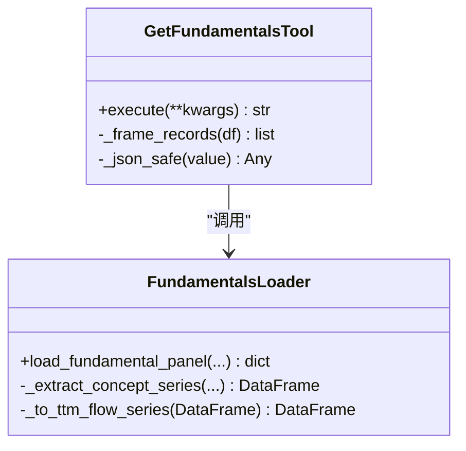
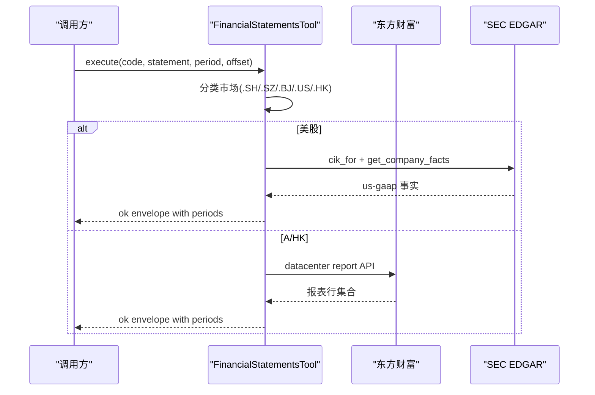
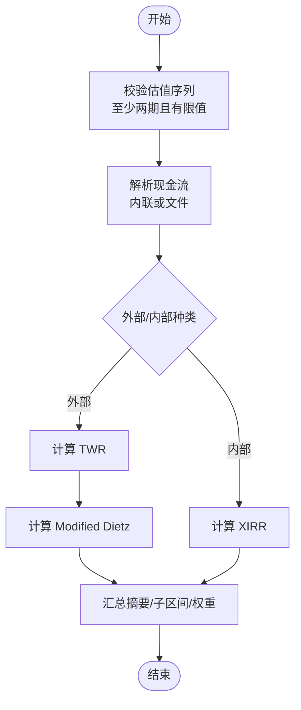
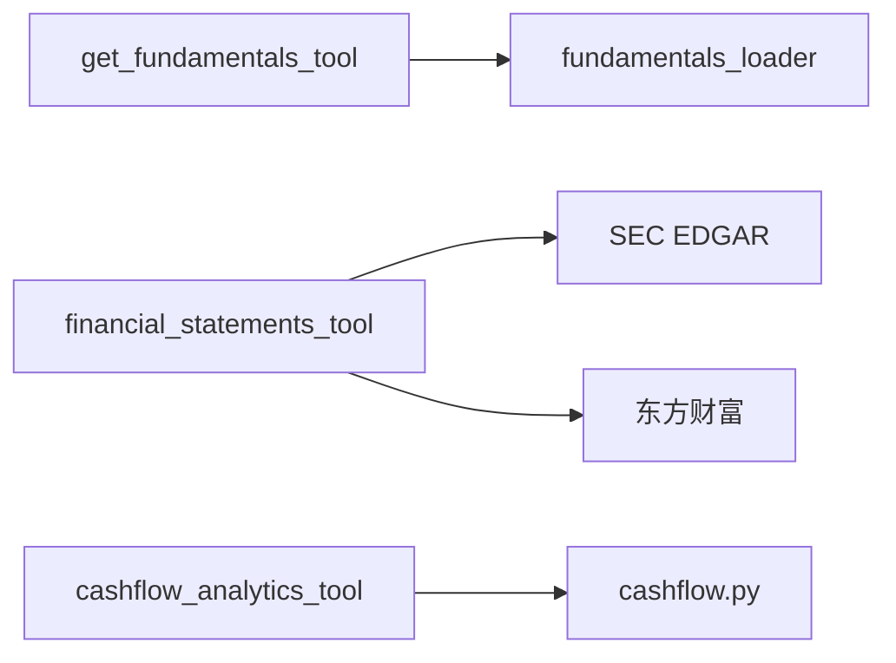

# 基本面分析工具

<cite>
**本文引用的文件**
- [get_fundamentals_tool.py](file://agent/src/tools/get_fundamentals_tool.py)
- [financial_statements_tool.py](file://agent/src/tools/financial_statements_tool.py)
- [cashflow_analytics_tool.py](file://agent/src/tools/cashflow_analytics_tool.py)
- [cashflow.py](file://agent/src/entities/cashflow.py)
- [fundamentals_loader.py](file://agent/backtest/loaders/fundamentals_loader.py)
- [test_get_fundamentals_tool.py](file://agent/tests/test_get_fundamentals_tool.py)
- [test_financial_statements_tool.py](file://agent/tests/test_financial_statements_tool.py)
- [test_cashflow_analytics_tool.py](file://agent/tests/test_cashflow_analytics_tool.py)
</cite>

## 目录
1. [简介](#简介)
2. [项目结构](#项目结构)
3. [核心组件](#核心组件)
4. [架构总览](#架构总览)
5. [详细组件分析](#详细组件分析)
6. [依赖关系分析](#依赖关系分析)
7. [性能与健壮性](#性能与健壮性)
8. [故障排查指南](#故障排查指南)
9. [结论](#结论)
10. [附录：研究流程与示例](#附录研究流程与示例)

## 简介
本文件系统性介绍 Vibe-Trading 的基本面分析工具集，覆盖三大工具：
- get_fundamentals_tool：面向美国市场（SEC XBRL）的标准化、PIT 对齐的面板数据拉取，提供公司财务指标、估值因子与基础因子。
- financial_statements_tool：跨市场（A股/港股/美股）三大报表与关键指标读取，支持年报/季报、分页与字段裁剪。
- cashflow_analytics_tool：基于客户视角现金流序列计算时间加权收益（TWR）、修正 Dietz 收益与货币加权收益（XIRR），用于现金流质量评估与绩效归因。

文档同时说明财务数据的标准化处理、异常值检测、趋势分析方法，并给出财务健康度评分、盈利质量分析与增长预测模型的应用思路；包含同行比较、行业基准与估值模型应用；最后提供基本面研究工作流程与投资决策支持示例。

## 项目结构
围绕基本面分析的代码主要分布在 agent/src/tools 与 agent/backtest/loaders：
- 工具层：三个工具类分别封装输入校验、数据源路由、结果包装与错误信封。
- 加载器层：fundamentals_loader 将 SEC companyfacts 转换为 PIT 安全的日频面板，支持 TTM 滚动、季度合成与派生字段。
- 实体层：cashflow.py 定义现金流实体、汇率表与转换逻辑，为现金流分析提供严格的数据契约。

图表来源
- [get_fundamentals_tool.py:64-211](file://agent/src/tools/get_fundamentals_tool.py#L64-L211)
- [financial_statements_tool.py:589-726](file://agent/src/tools/financial_statements_tool.py#L589-L726)
- [cashflow_analytics_tool.py:40-300](file://agent/src/tools/cashflow_analytics_tool.py#L40-L300)
- [fundamentals_loader.py:196-278](file://agent/backtest/loaders/fundamentals_loader.py#L196-L278)
- [cashflow.py:121-265](file://agent/src/entities/cashflow.py#L121-L265)

章节来源
- [get_fundamentals_tool.py:64-211](file://agent/src/tools/get_fundamentals_tool.py#L64-L211)
- [financial_statements_tool.py:589-726](file://agent/src/tools/financial_statements_tool.py#L589-L726)
- [cashflow_analytics_tool.py:40-300](file://agent/src/tools/cashflow_analytics_tool.py#L40-L300)
- [fundamentals_loader.py:196-278](file://agent/backtest/loaders/fundamentals_loader.py#L196-L278)
- [cashflow.py:121-265](file://agent/src/entities/cashflow.py#L121-L265)

## 核心组件
- GetFundamentalsTool：统一参数校验、调用 fundamentals_loader 获取 PIT 安全的面板数据，输出 JSON 记录数组，支持 freq=annual/quarterly/ttm、pit 开关、source 路由与自定义交易日历对齐。
- FinancialStatementsTool：按市场后缀（.SH/.SZ/.BJ/.US/.HK）路由到东方财富或 SEC EDGAR，返回扁平化期间记录，支持 offset 分页与字段裁剪，保证上下文安全。
- CashFlowPerformanceTool：接收估值序列与现金流（内联或文件），计算 TWR、Modified Dietz、Money-weighted Return，输出完整审计信息（输入、子区间、权重、限制说明）。

章节来源
- [get_fundamentals_tool.py:64-211](file://agent/src/tools/get_fundamentals_tool.py#L64-L211)
- [financial_statements_tool.py:589-726](file://agent/src/tools/financial_statements_tool.py#L589-L726)
- [cashflow_analytics_tool.py:40-300](file://agent/src/tools/cashflow_analytics_tool.py#L40-L300)

## 架构总览
工具通过统一的“错误信封”和“成功信封”对外暴露稳定接口，屏蔽底层数据源差异与异常。

图表来源
- [get_fundamentals_tool.py:126-211](file://agent/src/tools/get_fundamentals_tool.py#L126-L211)
- [fundamentals_loader.py:196-278](file://agent/backtest/loaders/fundamentals_loader.py#L196-L278)

章节来源
- [get_fundamentals_tool.py:126-211](file://agent/src/tools/get_fundamentals_tool.py#L126-L211)
- [fundamentals_loader.py:196-278](file://agent/backtest/loaders/fundamentals_loader.py#L196-L278)

## 详细组件分析

### 组件一：get_fundamentals_tool（基本面面板）
- 功能要点
  - 支持 symbols、fields、start/end、freq(annual/quarterly/ttm)、pit、source(auto/sec)、index 等参数。
  - 内部调用 fundamentals_loader.load_fundamental_panel，将 SEC 事实转为 PIT 安全的日频宽面板。
  - 输出以 field 为键的字典，值为日期 x 标的的记录列表，数值进行 JSON 安全化处理（如无穷大转 None）。
- 数据处理与标准化
  - PIT 对齐：以 filed 日期作为可见锚点，避免前视偏差。
  - TTM 近似：对流量型概念采用四期滚动求和，并以窗口内最新 filed 日期锚定。
  - 季度合成：当 Q4 缺失时，使用 FY-(Q1+Q2+Q3) 推导，保持 PIT 安全。
  - 派生字段：通过 schema 解析依赖图，按需计算派生指标。
- 异常值与健壮性
  - 输入强校验（类型、范围、枚举），非法参数直接返回错误信封。
  - 加载器异常被捕获并包装为错误响应，不会中断上层调用。
- 复杂度与性能
  - 面板构建涉及多标的、多概念的稀疏→稠密转换与前向填充，时间复杂度与（交易日数×标的数×概念数）相关；通过缓存与批量请求降低开销。
- 适用场景
  - 横截面因子计算（如 ROE、资产增长率、盈利收益率等），以及时间序列趋势分析。

图表来源
- [get_fundamentals_tool.py:64-211](file://agent/src/tools/get_fundamentals_tool.py#L64-L211)
- [fundamentals_loader.py:47-132](file://agent/backtest/loaders/fundamentals_loader.py#L47-L132)
- [fundamentals_loader.py:292-301](file://agent/backtest/loaders/fundamentals_loader.py#L292-L301)

章节来源
- [get_fundamentals_tool.py:64-211](file://agent/src/tools/get_fundamentals_tool.py#L64-L211)
- [fundamentals_loader.py:47-132](file://agent/backtest/loaders/fundamentals_loader.py#L47-L132)
- [fundamentals_loader.py:196-278](file://agent/backtest/loaders/fundamentals_loader.py#L196-L278)
- [test_get_fundamentals_tool.py:22-80](file://agent/tests/test_get_fundamentals_tool.py#L22-L80)

### 组件二：financial_statements_tool（三大报表与指标）
- 功能要点
  - 支持 A股（.SH/.SZ/.BJ）、港股（.HK）、美股（.US）三类市场。
  - 美股走 SEC EDGAR companyfacts；A/HK 走东方财富 F10 数据集。
  - 支持 statement(balance/income/cashflow/indicators) 与 period(annual/quarter)，并提供 offset 分页。
- 数据清洗与合并
  - 客户端过滤年报（年末日期）与季度序列；SEC 路径中合并瞬时（资产负债表）与期间（利润表/现金流）事实，确保同一报告期的完整性。
  - 合成 Q4：若 10-K 未单独披露 Q4，则用 FY-(Q1+Q2+Q3) 推导，并标记 DERIVED。
  - 字段裁剪：单期最多保留固定数量字段，控制 LLM 上下文大小。
- 错误处理
  - 所有网络异常、符号不可解析、字段缺失均返回结构化错误信封，不抛出异常。
- 适用场景
  - 财报阅读、比率计算（毛利率、净利率、ROE、EPS 等）、趋势对比、估值建模输入。

图表来源
- [financial_statements_tool.py:589-726](file://agent/src/tools/financial_statements_tool.py#L589-L726)
- [financial_statements_tool.py:249-290](file://agent/src/tools/financial_statements_tool.py#L249-L290)
- [financial_statements_tool.py:492-568](file://agent/src/tools/financial_statements_tool.py#L492-L568)

章节来源
- [financial_statements_tool.py:589-726](file://agent/src/tools/financial_statements_tool.py#L589-L726)
- [financial_statements_tool.py:249-290](file://agent/src/tools/financial_statements_tool.py#L249-L290)
- [financial_statements_tool.py:492-568](file://agent/src/tools/financial_statements_tool.py#L492-L568)
- [test_financial_statements_tool.py:103-200](file://agent/tests/test_financial_statements_tool.py#L103-L200)

### 组件三：cashflow_analytics_tool（现金流分析与质量评估）
- 功能要点
  - 输入：估值序列（至少两期）+ 现金流（内联或 CSV/TSV/文本文件）。
  - 输出：时间加权收益（TWR）、修正 Dietz 收益、货币加权收益（XIRR），以及子区间明细、权重、限制说明。
  - 支持 flow_timing（end/start）、external/internal kinds 自定义、货币列与日期格式配置。
- 数据契约与校验
  - 金额符号约定：从持有者视角，流入为正、流出为负；内置方向约束（如 contribution 必须为负）。
  - 币种一致性：默认拒绝混币；如需混合币种，需显式 pre_translated=True 并声明报告货币。
  - 估值与现金流分离：NAV 等标记默认不计入总现金流，避免高估实际分配。
- 算法与复杂度
  - TWR：分段收益几何连乘，考虑外部现金流发生时机。
  - Modified Dietz：资金加权近似，计算简单但非精确 TWR。
  - XIRR：非线性求解，可能无解（单向现金流）时优雅降级。
- 适用场景
  - 账户级绩效评估、现金流质量诊断（外部流入/内部收益占比）、投资体验度量（MWR）。

图表来源
- [cashflow_analytics_tool.py:172-300](file://agent/src/tools/cashflow_analytics_tool.py#L172-L300)
- [cashflow.py:121-265](file://agent/src/entities/cashflow.py#L121-L265)

章节来源
- [cashflow_analytics_tool.py:40-300](file://agent/src/tools/cashflow_analytics_tool.py#L40-L300)
- [cashflow.py:121-265](file://agent/src/entities/cashflow.py#L121-L265)
- [test_cashflow_analytics_tool.py:53-119](file://agent/tests/test_cashflow_analytics_tool.py#L53-L119)

## 依赖关系分析
- 工具与加载器/实体耦合
  - get_fundamentals_tool 依赖 fundamentals_loader 完成 SEC 事实到面板的转换。
  - financial_statements_tool 依赖 SEC EDGAR 与东方财富两套数据通道。
  - cashflow_analytics_tool 依赖 cashflow.py 的实体与汇率表，以及 quantlib.performance 的收益计算。
- 外部依赖
  - SEC EDGAR：公司事实 XBRL，提供 GAAP 概念序列。
  - 东方财富：A/HK 财报数据集，按报告名区分。
- 潜在循环与风险
  - 工具层仅做路由与封装，业务逻辑下沉至加载器/实体，避免循环依赖。
  - 网络异常与数据缺失在工具层统一收敛为错误信封，提升鲁棒性。

图表来源
- [get_fundamentals_tool.py:177-199](file://agent/src/tools/get_fundamentals_tool.py#L177-L199)
- [financial_statements_tool.py:679-686](file://agent/src/tools/financial_statements_tool.py#L679-L686)
- [cashflow_analytics_tool.py:172-219](file://agent/src/tools/cashflow_analytics_tool.py#L172-L219)

章节来源
- [get_fundamentals_tool.py:177-199](file://agent/src/tools/get_fundamentals_tool.py#L177-L199)
- [financial_statements_tool.py:679-686](file://agent/src/tools/financial_statements_tool.py#L679-L686)
- [cashflow_analytics_tool.py:172-219](file://agent/src/tools/cashflow_analytics_tool.py#L172-L219)

## 性能与健壮性
- 面板构建
  - 稀疏→稠密转换使用前向填充与目标索引对齐，减少重复计算；支持缓存。
  - TTM 滚动窗口与季度合成仅在必要时触发，避免冗余。
- 上下文安全
  - 财务报表工具对每期字段数进行上限裁剪，防止 LLM 上下文溢出。
  - 现金流工具对估值与现金流条目设置上限，避免过大请求。
- 异常处理
  - 所有工具均以 JSON 信封返回，错误可恢复且不抛异常；测试覆盖多种失败路径。
- 建议优化
  - 对高频调用场景启用更多缓存策略（如按 symbol+period+statement 维度）。
  - 对大规模面板计算引入并行化（按标的或概念分片）。

章节来源
- [financial_statements_tool.py:109-156](file://agent/src/tools/financial_statements_tool.py#L109-L156)
- [cashflow_analytics_tool.py:30-38](file://agent/src/tools/cashflow_analytics_tool.py#L30-L38)
- [test_get_fundamentals_tool.py:63-80](file://agent/tests/test_get_fundamentals_tool.py#L63-L80)
- [test_cashflow_analytics_tool.py:107-119](file://agent/tests/test_cashflow_analytics_tool.py#L107-L119)

## 故障排查指南
- 常见错误与定位
  - 参数非法：检查 symbols/fields/start/end 类型与格式；freq/pit/source 是否在允许范围内。
  - 符号不可解析：确认市场后缀正确（.SH/.SZ/.BJ/.US/.HK），美股需带 .US。
  - 数据为空：检查 SEC 概念映射是否配置；东方财富报告名与市场分组是否正确。
  - 现金流错误：确认金额符号符合持有者视角约定；币种一致或显式 pre_translated。
- 调试步骤
  - 查看工具返回的错误信封中的 error 字段。
  - 逐步缩小范围：先验证最小样例（如单一标的、单期、单字段）。
  - 检查日志：工具层会记录底层加载失败的警告信息。

章节来源
- [get_fundamentals_tool.py:126-176](file://agent/src/tools/get_fundamentals_tool.py#L126-L176)
- [financial_statements_tool.py:660-703](file://agent/src/tools/financial_statements_tool.py#L660-L703)
- [cashflow_analytics_tool.py:303-400](file://agent/src/tools/cashflow_analytics_tool.py#L303-L400)

## 结论
Vibe-Trading 的基本面分析工具集提供了从数据获取、标准化到绩效评估的完整链路：
- get_fundamentals_tool 提供 PIT 安全、可组合的面板数据，适合因子研究与趋势分析。
- financial_statements_tool 打通多市场财报读取，支持分页与上下文安全，便于财报审阅与比率计算。
- cashflow_analytics_tool 提供严格的现金流语义与三种收益度量，支撑现金流质量评估与绩效归因。

结合派生字段、同行比较与估值模型，可形成闭环的研究与决策支持体系。

## 附录：研究流程与示例

### 标准化处理、异常值检测与趋势分析
- 标准化
  - 使用 fundamentals_loader 的 TTM 滚动与 PIT 对齐，消除前视偏差与季节性影响。
  - 财务报表工具对字段进行裁剪与合并，保证数据一致性与可读性。
- 异常值检测
  - 面板数据中对无穷大/NaN 进行安全转换；现金流工具对非有限值拒绝。
  - 对极端波动或断点，结合横截面 Z-score 与历史分位数识别。
- 趋势分析
  - 对 ROE、净利率、FCF 等指标进行滚动窗口与同比/环比分析；结合季度合成补齐 Q4。

章节来源
- [fundamentals_loader.py:128-132](file://agent/backtest/loaders/fundamentals_loader.py#L128-L132)
- [get_fundamentals_tool.py:35-61](file://agent/src/tools/get_fundamentals_tool.py#L35-L61)
- [cashflow_analytics_tool.py:303-334](file://agent/src/tools/cashflow_analytics_tool.py#L303-L334)

### 财务健康度评分、盈利质量分析与增长预测模型
- 财务健康度评分
  - 基于三大报表比率（流动比率、资产负债率、利息保障倍数）与现金流覆盖率（OCF/负债）构建综合评分。
  - 利用财务健康度工具（如 financial_rigor_tool）进行交叉验证。
- 盈利质量分析
  - 关注净利润与经营现金流的匹配度、应计项比例、非经常性损益占比。
  - 结合 earnings quality 指标（如 FCF/NI、accrual ratio）识别盈余管理风险。
- 增长预测模型
  - 基于历史收入/利润增速与行业基准，构建线性/指数增长假设；结合估值模型（DCF、PE Band、PB-ROE）进行情景分析。

章节来源
- [financial_statements_tool.py:492-568](file://agent/src/tools/financial_statements_tool.py#L492-L568)
- [cashflow_analytics_tool.py:172-300](file://agent/src/tools/cashflow_analytics_tool.py#L172-L300)

### 同行比较、行业基准与估值模型应用
- 同行比较
  - 选取可比公司（规模、业务驱动相似），计算 EV/Sales、EV/EBITDA、PE 等倍数，评估相对估值。
  - 使用 comps 工作流生成可比公司表格与隐含价值区间。
- 行业基准
  - 参考行业典型估值区间（如消费/科技/能源/公用事业），判断当前估值位置。
- 估值模型
  - DCF：基于自由现金流与 WACC 计算内在价值；敏感性分析（WACC vs 增长率）。
  - 相对估值：PE Band、PB-ROE 矩阵、EV/EBITDA 区间。
  - 多方法交叉验证，取中位值并解释差异原因。

章节来源
- [test_get_fundamentals_tool.py:97-142](file://agent/tests/test_get_fundamentals_tool.py#L97-L142)
- [test_financial_statements_tool.py:103-200](file://agent/tests/test_financial_statements_tool.py#L103-L200)

### 基本面研究工作流程与投资决策支持示例
- 工作流
  1) 使用 financial_statements_tool 拉取目标公司与同行的三大报表与关键指标。
  2) 使用 get_fundamentals_tool 获取 PIT 安全的面板数据，计算因子与趋势。
  3) 使用 cashflow_analytics_tool 评估现金流质量与账户级绩效。
  4) 构建财务健康度评分与盈利质量分析，识别风险与机会。
  5) 进行同行比较与估值建模，得出合理价值区间与投资评级。
- 示例
  - 选择 AAPL.US 与同业（MSFT、NVDA），拉取年报/季报，计算 ROE、FCF/NI、EV/EBITDA。
  - 使用 TTM 面板观察盈利趋势与季节性；合成 Q4 补齐缺口。
  - 基于 DCF 与 PE Band 得到目标价区间，结合行业基准判断当前价格位置。
  - 输出投资建议与风险提示（如周期性峰值、商誉/净资产比、应收/收入趋势）。

章节来源
- [financial_statements_tool.py:589-726](file://agent/src/tools/financial_statements_tool.py#L589-L726)
- [get_fundamentals_tool.py:64-211](file://agent/src/tools/get_fundamentals_tool.py#L64-L211)
- [cashflow_analytics_tool.py:40-300](file://agent/src/tools/cashflow_analytics_tool.py#L40-L300)