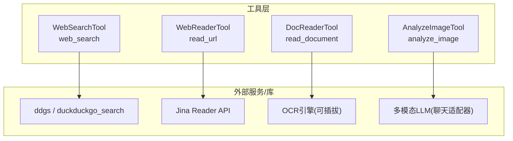
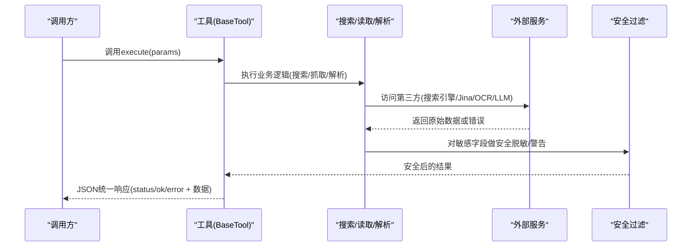
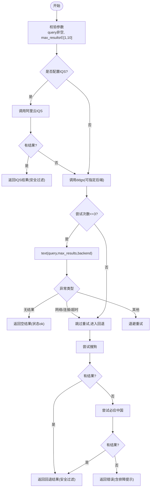
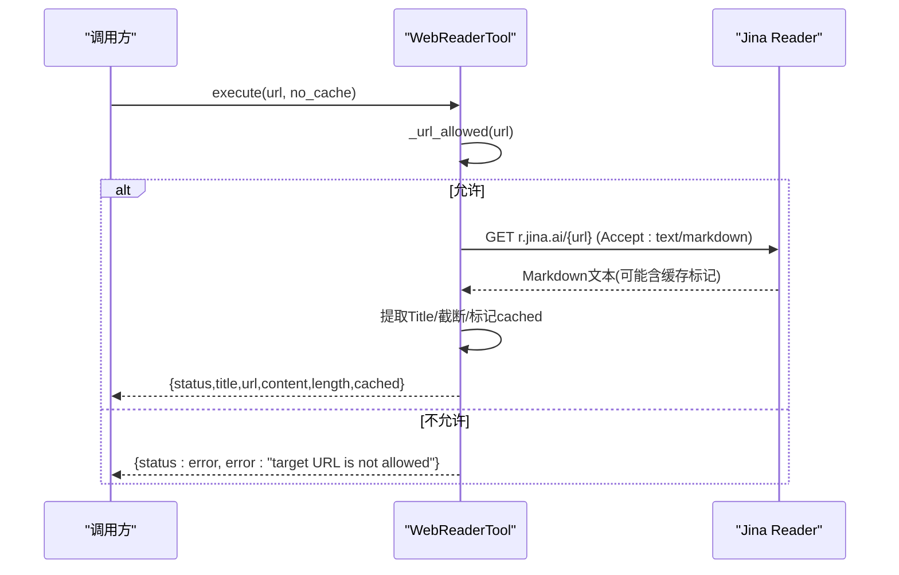
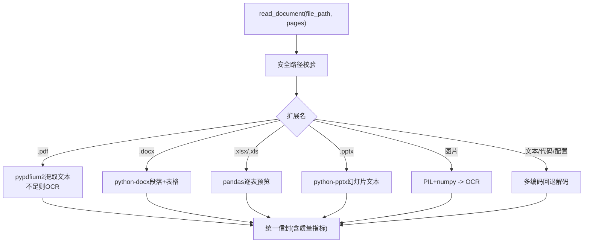
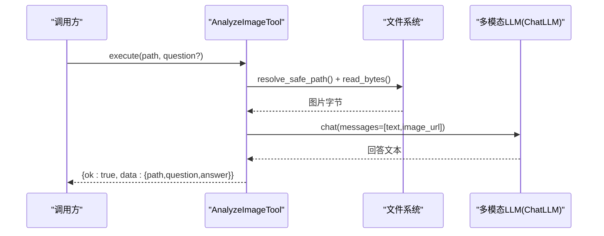
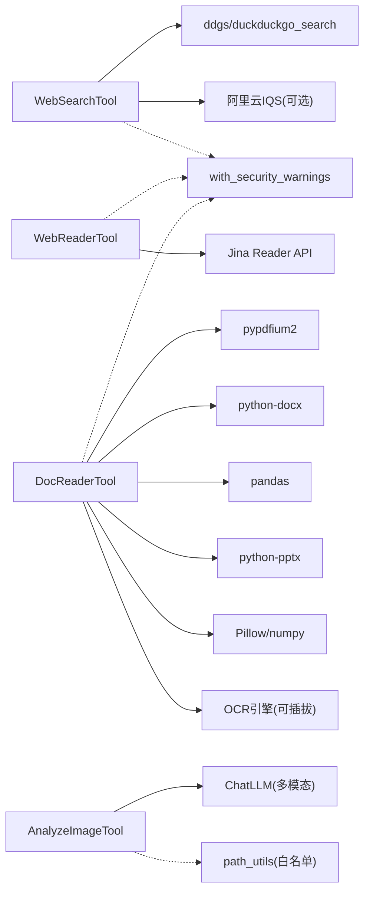

# 实用工具

<cite>
**本文引用的文件**
- [web_search_tool.py](file://agent/src/tools/web_search_tool.py)
- [web_reader_tool.py](file://agent/src/tools/web_reader_tool.py)
- [doc_reader_tool.py](file://agent/src/tools/doc_reader_tool.py)
- [image_vision_tool.py](file://agent/src/tools/image_vision_tool.py)
- [test_web_search_tool.py](file://agent/tests/test_web_search_tool.py)
- [test_doc_reader.py](file://agent/tests/test_doc_reader.py)
- [test_image_vision_tool.py](file://agent/tests/test_image_vision_tool.py)
</cite>

## 目录
1. [简介](#简介)
2. [项目结构](#项目结构)
3. [核心组件](#核心组件)
4. [架构总览](#架构总览)
5. [详细组件分析](#详细组件分析)
6. [依赖关系分析](#依赖关系分析)
7. [性能与优化](#性能与优化)
8. [故障排查指南](#故障排查指南)
9. [结论](#结论)
10. [附录：API与使用示例](#附录api与使用示例)

## 简介
本章节面向Vibe-Trading的“实用工具集”，聚焦四类能力：
- 网络搜索与信息检索（web_search_tool）
- 网页内容解析与结构化提取（web_reader_tool）
- 文档解析与文本提取（doc_reader_tool）
- 图像识别与OCR/视觉问答（image_vision_tool）

这些工具统一以BaseTool为基类，提供一致的参数契约、可重复调用、安全过滤与错误返回格式。它们既可用于CLI交互，也可嵌入自动化工作流，支撑金融研究、信息收集与内容处理等场景。

## 项目结构
四个工具均位于 agent/src/tools 目录下，配套测试位于 agent/tests。工具之间相互独立，通过统一的工具注册机制被上层Agent调度。

图表来源
- [web_search_tool.py:134-349](file://agent/src/tools/web_search_tool.py#L134-L349)
- [web_reader_tool.py:134-152](file://agent/src/tools/web_reader_tool.py#L134-L152)
- [doc_reader_tool.py:422-457](file://agent/src/tools/doc_reader_tool.py#L422-L457)
- [image_vision_tool.py:52-147](file://agent/src/tools/image_vision_tool.py#L52-L147)

章节来源
- [web_search_tool.py:1-349](file://agent/src/tools/web_search_tool.py#L1-L349)
- [web_reader_tool.py:1-152](file://agent/src/tools/web_reader_tool.py#L1-L152)
- [doc_reader_tool.py:1-457](file://agent/src/tools/doc_reader_tool.py#L1-L457)
- [image_vision_tool.py:1-147](file://agent/src/tools/image_vision_tool.py#L1-L147)

## 核心组件
- WebSearchTool：跨免费搜索引擎聚合查询，支持重试、后端切换与中文环境回退；可选阿里云IQS加速。
- WebReaderTool：通过Jina Reader将网页转为Markdown，内置URL白名单与安全校验，支持缓存控制。
- DocReaderTool：通用文档读取器，按扩展名分发到PDF/Word/Excel/PPT/图片/文本解析；PDF含OCR回退与质量指标。
- AnalyzeImageTool：对本地图片进行视觉问答，将图片以data URL形式发送给多模态LLM并返回回答。

章节来源
- [web_search_tool.py:134-349](file://agent/src/tools/web_search_tool.py#L134-L349)
- [web_reader_tool.py:134-152](file://agent/src/tools/web_reader_tool.py#L134-L152)
- [doc_reader_tool.py:422-457](file://agent/src/tools/doc_reader_tool.py#L422-L457)
- [image_vision_tool.py:52-147](file://agent/src/tools/image_vision_tool.py#L52-L147)

## 架构总览
下图展示从用户输入到各工具执行、再到结果封装的安全与容错路径。

图表来源
- [web_search_tool.py:172-349](file://agent/src/tools/web_search_tool.py#L172-L349)
- [web_reader_tool.py:61-152](file://agent/src/tools/web_reader_tool.py#L61-L152)
- [doc_reader_tool.py:87-100](file://agent/src/tools/doc_reader_tool.py#L87-L100)
- [image_vision_tool.py:85-147](file://agent/src/tools/image_vision_tool.py#L85-L147)

## 详细组件分析

### WebSearchTool（网络搜索）
- 功能要点
  - 优先尝试阿里云IQS（若配置），否则走ddgs多引擎聚合；支持自定义后端列表与环境变量覆盖。
  - 失败重试与退避；遇到网络超时/连接失败快速切换到中文回退源（搜狗、必应中国）。
  - “无结果”视为成功空结果，避免误报错误。
  - 输出统一JSON，包含status、query、backends、results（title/url/snippet）。
- 关键流程
  - 参数校验与max_results限幅
  - IQS快速路径
  - ddgs主路径（带backend选择与重试）
  - 中文回退路径（sogou -> bing_cn）
  - 安全过滤（标题/片段）
- 复杂度与性能
  - 重试次数固定（默认3次），指数退避；网络错误快速短路，减少等待。
  - 最大结果数限制（上限10），降低下游负载。
- 错误恢复
  - 明确区分“无结果”和“网络/限流错误”；提供可操作建议（更换后端、禁用回退、直接读URL）。

图表来源
- [web_search_tool.py:172-349](file://agent/src/tools/web_search_tool.py#L172-L349)

章节来源
- [web_search_tool.py:1-349](file://agent/src/tools/web_search_tool.py#L1-L349)
- [test_web_search_tool.py:1-199](file://agent/tests/test_web_search_tool.py#L1-L199)

### WebReaderTool（网页阅读）
- 功能要点
  - 通过Jina Reader获取网页Markdown；支持no_cache强制刷新。
  - 严格的URL安全检查：仅允许http/https、禁止内网/本地/特殊IP段、禁止用户名密码。
  - 长度截断与缓存标记检测，统一JSON返回（status/title/url/content/length/cached）。
- 关键流程
  - URL合法性检查
  - 发起请求（设置Accept: text/markdown）
  - 解析标题、截断内容、标记缓存
  - 安全过滤（content字段）
- 错误处理
  - HTTP非200、超时、异常均返回结构化错误。

图表来源
- [web_reader_tool.py:24-152](file://agent/src/tools/web_reader_tool.py#L24-L152)

章节来源
- [web_reader_tool.py:1-152](file://agent/src/tools/web_reader_tool.py#L1-L152)

### DocReaderTool（文档读取）
- 功能要点
  - 按扩展名分发：PDF/DOCX/XLSX/XLS/PPTX/图片/文本。
  - PDF：pypdfium2提取文本；低于阈值页面触发OCR；输出质量指标（ocr_pages/text_density/quality_flag）。
  - Excel：逐Sheet预览前100行，附带行列统计。
  - 文本：多编码回退（UTF-16 BOM优先，再尝试GBK/GB2312/BIG5/LATIN-1）。
  - 统一信封：status/file/format/char_count/truncated/text及格式元数据。
- 关键流程
  - 路径安全校验（safe_document_path）
  - 扩展名路由
  - 对应解析器执行
  - 安全过滤（text字段）
- 批处理与分页
  - PDF支持pages参数（如“1-10”“1,3,5-8”），自动去重排序与边界裁剪。
  - 大文本截断，避免超限。

图表来源
- [doc_reader_tool.py:103-419](file://agent/src/tools/doc_reader_tool.py#L103-L419)

章节来源
- [doc_reader_tool.py:1-457](file://agent/src/tools/doc_reader_tool.py#L1-L457)
- [test_doc_reader.py:1-186](file://agent/tests/test_doc_reader.py#L1-L186)

### AnalyzeImageTool（图像视觉）
- 功能要点
  - 对本地图片进行视觉问答；将图片以data URL方式发送给多模态LLM。
  - 严格路径白名单（allowed_file_roots）、大小限制、MIME类型校验。
  - 统一返回{ok,data:{path,question,answer}}或错误。
- 关键流程
  - 参数校验与路径解析
  - 读取图片并转data URL
  - 构造消息体（文本+图片）
  - 调用ChatLLM并返回回答
- 错误处理
  - 路径越界、文件不存在、不支持类型、过大、模型返回空等均返回错误。

图表来源
- [image_vision_tool.py:85-147](file://agent/src/tools/image_vision_tool.py#L85-L147)

章节来源
- [image_vision_tool.py:1-147](file://agent/src/tools/image_vision_tool.py#L1-L147)
- [test_image_vision_tool.py:1-76](file://agent/tests/test_image_vision_tool.py#L1-L76)

## 依赖关系分析
- 外部依赖
  - 搜索：ddgs/duckduckgo_search（可选阿里云IQS）
  - 网页：requests + Jina Reader API
  - 文档：pypdfium2、python-docx、pandas、python-pptx、Pillow、numpy
  - 视觉：多模态LLM（ChatLLM适配器）
- 内部依赖
  - BaseTool：统一工具接口
  - with_security_warnings：统一安全过滤
  - path_utils：路径安全与根目录白名单
  - progress：进度上报（用于长耗时任务）

图表来源
- [web_search_tool.py:134-349](file://agent/src/tools/web_search_tool.py#L134-L349)
- [web_reader_tool.py:134-152](file://agent/src/tools/web_reader_tool.py#L134-L152)
- [doc_reader_tool.py:422-457](file://agent/src/tools/doc_reader_tool.py#L422-L457)
- [image_vision_tool.py:52-147](file://agent/src/tools/image_vision_tool.py#L52-L147)

章节来源
- [web_search_tool.py:1-349](file://agent/src/tools/web_search_tool.py#L1-L349)
- [web_reader_tool.py:1-152](file://agent/src/tools/web_reader_tool.py#L1-L152)
- [doc_reader_tool.py:1-457](file://agent/src/tools/doc_reader_tool.py#L1-L457)
- [image_vision_tool.py:1-147](file://agent/src/tools/image_vision_tool.py#L1-L147)

## 性能与优化
- 搜索
  - 多后端顺序尝试与重试退避，网络错误快速短路，减少无效等待。
  - 可选IQS直连，显著降低延迟并提高结构化质量。
  - max_results上限限制，控制带宽与下游处理成本。
- 网页
  - 只拉取Markdown，避免渲染开销；长度截断防止超大响应。
  - 支持no_cache，按需绕过缓存。
- 文档
  - PDF按页增量处理，低文本密度页才触发OCR，减少计算。
  - Excel仅预览前100行，兼顾可读性与性能。
  - 文本多编码回退，避免二次转换。
- 视觉
  - 图片大小限制，避免超大图导致内存与传输压力。
  - 多模态LLM调用超时保护，避免长时间阻塞。

[本节为通用性能讨论，不直接分析具体文件]

## 故障排查指南
- 搜索失败
  - 现象：多次尝试后仍报错
  - 排查：检查网络连通性、代理/防火墙；尝试设置VIBE_TRADING_SEARCH_BACKENDS；必要时关闭CN回退（VIBE_TRADING_SEARCH_BING_FALLBACK=0）；或直接使用read_url读取已知URL。
  - 参考：[web_search_tool.py:232-349](file://agent/src/tools/web_search_tool.py#L232-L349)
- 网页读取失败
  - 现象：HTTP非200或超时
  - 排查：确认目标站点可达；检查URL是否被安全策略拒绝（内网/localhost/私有IP）；必要时开启no_cache。
  - 参考：[web_reader_tool.py:24-152](file://agent/src/tools/web_reader_tool.py#L24-L152)
- 文档解析失败
  - 现象：PDF无文本、图片OCR为空、编码乱码
  - 排查：安装对应依赖（pypdfium2/python-docx/pandas/python-pptx/Pillow/numpy）；配置OCR引擎；调整min_text_per_page；确认文件路径在白名单内。
  - 参考：[doc_reader_tool.py:103-419](file://agent/src/tools/doc_reader_tool.py#L103-L419)
- 图像视觉失败
  - 现象：路径越界、不支持类型、模型返回空
  - 排查：确保文件在允许根目录；图片类型受支持且小于限制；确认会话模型支持多模态输入。
  - 参考：[image_vision_tool.py:85-147](file://agent/src/tools/image_vision_tool.py#L85-L147)

章节来源
- [web_search_tool.py:172-349](file://agent/src/tools/web_search_tool.py#L172-L349)
- [web_reader_tool.py:61-152](file://agent/src/tools/web_reader_tool.py#L61-L152)
- [doc_reader_tool.py:87-419](file://agent/src/tools/doc_reader_tool.py#L87-L419)
- [image_vision_tool.py:85-147](file://agent/src/tools/image_vision_tool.py#L85-L147)

## 结论
该工具集围绕“搜索—阅读—解析—视觉”形成完整的信息采集与处理能力链。通过多后端容错、安全白名单、统一信封与安全过滤，既保证了鲁棒性，也便于集成到自动化工作流中。结合批量处理（PDF分页、Excel多Sheet）与缓存控制（网页no_cache），可在保证性能的同时满足高频研究需求。

[本节为总结性内容，不直接分析具体文件]

## 附录：API与使用示例

### web_search（网络搜索）
- 入口：WebSearchTool.execute
- 参数
  - query: 字符串，必填
  - max_results: 整数，1-10，默认5
- 返回
  - status: ok | error
  - query/backends/results[]: title/url/snippet
- 典型用法
  - 搜索某公司最新财报新闻，随后用read_url读取链接详情
  - 在受限网络环境下，自动回退至搜狗/必应中国
- 参考
  - [web_search_tool.py:155-169](file://agent/src/tools/web_search_tool.py#L155-L169)
  - [web_search_tool.py:172-349](file://agent/src/tools/web_search_tool.py#L172-L349)
  - [test_web_search_tool.py:48-199](file://agent/tests/test_web_search_tool.py#L48-L199)

### read_url（网页阅读）
- 入口：WebReaderTool.execute
- 参数
  - url: 字符串，必填（仅http/https，禁止内网/本地）
  - no_cache: 布尔，默认False
- 返回
  - status/title/url/content/length/cached
- 典型用法
  - 将研报/公告/百科页面转为Markdown供LLM消费
- 参考
  - [web_reader_tool.py:139-152](file://agent/src/tools/web_reader_tool.py#L139-L152)
  - [web_reader_tool.py:61-152](file://agent/src/tools/web_reader_tool.py#L61-L152)

### read_document（文档读取）
- 入口：DocReaderTool.execute
- 参数
  - file_path: 绝对路径，必填（需在允许根目录）
  - pages: 字符串，PDF专用，如“1-10”“1,3,5-8”
  - min_text_per_page: 整数，PDF触发OCR的阈值，默认50
- 返回
  - status/file/format/char_count/truncated/text + 格式元数据
- 典型用法
  - 批量解析PDF年报（分页）、Excel多Sheet、PPT演示文稿
  - 图片OCR与代码/配置文本读取
- 参考
  - [doc_reader_tool.py:432-457](file://agent/src/tools/doc_reader_tool.py#L432-L457)
  - [doc_reader_tool.py:384-419](file://agent/src/tools/doc_reader_tool.py#L384-L419)
  - [test_doc_reader.py:24-186](file://agent/tests/test_doc_reader.py#L24-L186)

### analyze_image（图像视觉）
- 入口：AnalyzeImageTool.execute
- 参数
  - path: 字符串，必填（必须在允许根目录）
  - question: 字符串，可选（默认询问图表/截图解读）
- 返回
  - ok/data: {path, question, answer} 或错误
- 典型用法
  - 对K线图/账户截图进行趋势与关键价位解读
- 参考
  - [image_vision_tool.py:68-82](file://agent/src/tools/image_vision_tool.py#L68-L82)
  - [image_vision_tool.py:85-147](file://agent/src/tools/image_vision_tool.py#L85-L147)
  - [test_image_vision_tool.py:51-76](file://agent/tests/test_image_vision_tool.py#L51-L76)

### 自动化信息收集与工作流示例
- 端到端流程
  - 使用web_search查找关键词，得到若干URL
  - 对高价值URL调用read_url获取Markdown
  - 将Markdown与相关PDF/Excel通过read_document统一解析
  - 对图表截图调用analyze_image进行视觉解读
  - 将结果汇总至研究笔记或策略信号
- 批量与缓存
  - PDF分页读取、Excel多Sheet遍历
  - 网页no_cache按需启用，避免陈旧快照
- 安全与容错
  - 所有输出经安全过滤；网络/解析错误均有结构化返回与排障提示

[本节为概念性示例，不直接分析具体文件]