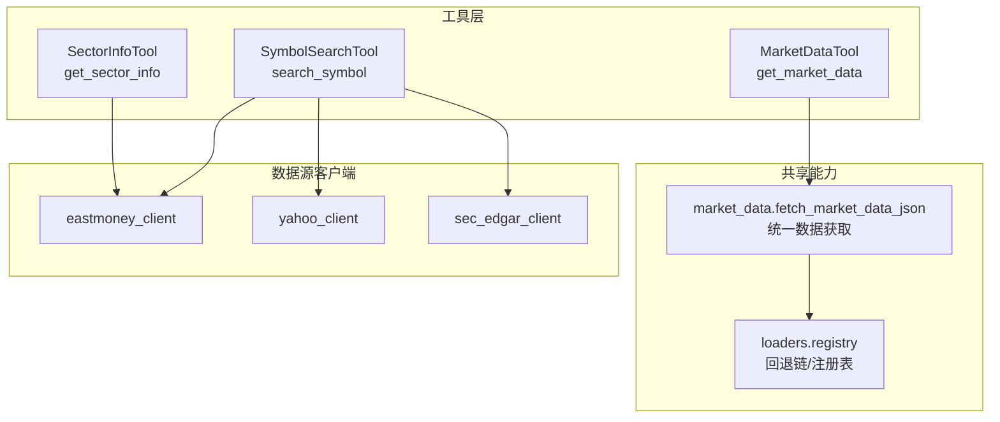
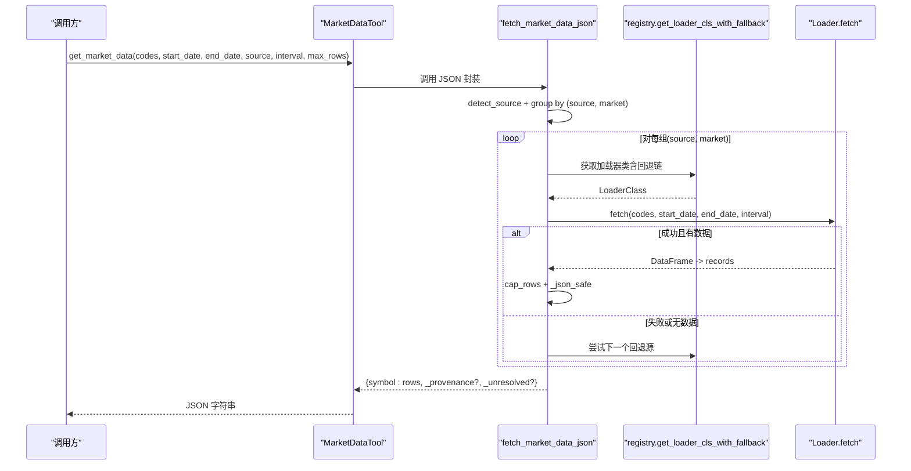
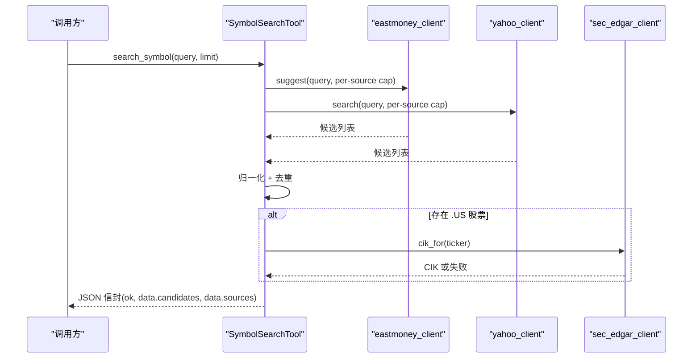
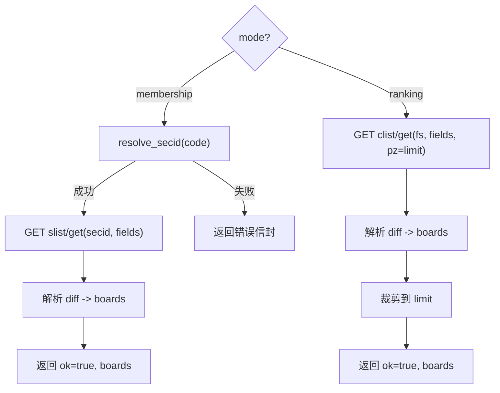
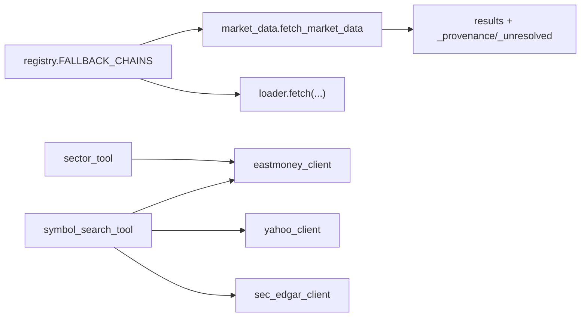

# 市场数据工具

<cite>
**本文引用的文件**
- [agent/src/tools/market_data_tool.py](file://agent/src/tools/market_data_tool.py)
- [agent/src/market_data.py](file://agent/src/market_data.py)
- [agent/backtest/loaders/registry.py](file://agent/backtest/loaders/registry.py)
- [agent/src/tools/symbol_search_tool.py](file://agent/src/tools/symbol_search_tool.py)
- [agent/src/tools/sector_tool.py](file://agent/src/tools/sector_tool.py)
- [agent/tests/test_market_data_tool.py](file://agent/tests/test_market_data_tool.py)
- [agent/tests/test_symbol_search_tool.py](file://agent/tests/test_symbol_search_tool.py)
- [agent/tests/test_sector_tool.py](file://agent/tests/test_sector_tool.py)
- [README_zh.md](file://README_zh.md)
</cite>

## 目录
1. [简介](#简介)
2. [项目结构](#项目结构)
3. [核心组件](#核心组件)
4. [架构总览](#架构总览)
5. [详细组件分析](#详细组件分析)
6. [依赖关系分析](#依赖关系分析)
7. [性能与缓存](#性能与缓存)
8. [故障排查指南](#故障排查指南)
9. [结论](#结论)
10. [附录：调用示例与数据处理模式](#附录调用示例与数据处理模式)

## 简介
本文件系统性介绍 Vibe-Trading 的市场数据工具集，重点覆盖以下三个工具：
- market_data_tool：统一的多市场、多资产实时与历史 OHLCV 数据获取入口，支持自动源选择与按市场回退链。
- symbol_search_tool：股票代码搜索与匹配，聚合东方财富、Yahoo 等公开接口，输出标准化符号并可选附加 SEC CIK。
- sector_tool：A 股行业板块与概念板块查询（成员归属与涨跌幅排名）。

文档同时说明统一接口设计、回退机制、错误处理、数据质量验证、缺失值处理、性能优化策略，以及具体调用示例与数据处理模式。

## 项目结构
围绕市场数据工具的核心代码分布在 agent/src/tools 与 agent/src 的共享模块中，并通过 backtest.loaders.registry 提供加载器注册与回退链。测试用例位于 agent/tests，用于验证行为与边界条件。

图表来源
- [agent/src/tools/market_data_tool.py:11-104](file://agent/src/tools/market_data_tool.py#L11-L104)
- [agent/src/market_data.py:97-229](file://agent/src/market_data.py#L97-L229)
- [agent/backtest/loaders/registry.py:158-249](file://agent/backtest/loaders/registry.py#L158-L249)
- [agent/src/tools/symbol_search_tool.py:69-157](file://agent/src/tools/symbol_search_tool.py#L69-L157)
- [agent/src/tools/sector_tool.py:245-320](file://agent/src/tools/sector_tool.py#L245-L320)

章节来源
- [agent/src/tools/market_data_tool.py:11-104](file://agent/src/tools/market_data_tool.py#L11-L104)
- [agent/src/market_data.py:97-229](file://agent/src/market_data.py#L97-L229)
- [agent/backtest/loaders/registry.py:158-249](file://agent/backtest/loaders/registry.py#L158-L249)
- [agent/src/tools/symbol_search_tool.py:69-157](file://agent/src/tools/symbol_search_tool.py#L69-L157)
- [agent/src/tools/sector_tool.py:245-320](file://agent/src/tools/sector_tool.py#L245-L320)

## 核心组件
- MarketDataTool（get_market_data）
  - 功能：通过仓库加载器层获取标准化的 OHLCV 数据，支持多市场、多资产类别与频率。
  - 参数：codes、start_date、end_date、source（auto 或指定）、interval、max_rows。
  - 输出：JSON 字符串，包含每个 symbol 的行情记录与可选来源溯源信息。
- SymbolSearchTool（search_symbol）
  - 功能：将公司名或代码片段解析为候选交易符号，合并去重，必要时附加美国股票的 SEC CIK。
  - 参数：query、limit。
  - 输出：JSON 信封，包含 candidates、sources 状态与 count。
- SectorInfoTool（get_sector_info）
  - 功能：查询 A 股的行业/概念板块成员归属或板块涨跌幅排名。
  - 参数：mode（membership/ranking）、code（membership 时必填）、limit（ranking 时有效）。
  - 输出：JSON 信封，包含 boards 列表及元信息。

章节来源
- [agent/src/tools/market_data_tool.py:11-104](file://agent/src/tools/market_data_tool.py#L11-L104)
- [agent/src/tools/symbol_search_tool.py:69-157](file://agent/src/tools/symbol_search_tool.py#L69-L157)
- [agent/src/tools/sector_tool.py:245-320](file://agent/src/tools/sector_tool.py#L245-L320)

## 架构总览
统一的数据获取流程由 fetch_market_data_json 驱动，内部根据符号格式推断首选数据源，并按市场维度的回退链尝试各加载器，直至成功或耗尽尝试次数。symbol_search_tool 并行从多个公开接口拉取候选结果，归一化后合并去重；sector_tool 基于东方财富 push2 接口完成板块查询。

图表来源
- [agent/src/tools/market_data_tool.py:94-104](file://agent/src/tools/market_data_tool.py#L94-L104)
- [agent/src/market_data.py:51-63](file://agent/src/market_data.py#L51-L63)
- [agent/src/market_data.py:97-229](file://agent/src/market_data.py#L97-L229)
- [agent/backtest/loaders/registry.py:158-249](file://agent/backtest/loaders/registry.py#L158-L249)

## 详细组件分析

### MarketDataTool（get_market_data）
- 职责
  - 暴露统一的 OHLCV 获取接口，屏蔽底层多数据源差异。
  - 支持 auto 源检测与按市场回退链降级。
  - 限制每 symbol 返回行数，避免响应过大。
- 关键实现要点
  - 源检测：根据符号后缀/格式推断首选源（如 US 股票优先 yahoo，A 股优先 tencent 等）。
  - 分组与回退：按 (source, market) 分组，构建回退链 attempts，逐个尝试 loader.fetch。
  - 数据清洗：将 NaN/Inf 转为 None，日期序列化，行裁剪策略（等步长采样并保留末行）。
  - 溯源：可选 include_provenance，记录实际使用源、请求源、是否回退、币种转换情况。
- 错误处理
  - 单个加载器异常不会中断整体流程，会记录日志并继续尝试下一个回退源。
  - 无法解析的符号汇总到 _unresolved 字段。
- 性能特性
  - 行裁剪 cap_rows 控制响应大小，默认上限可配置。
  - 批量 codes 同组处理，减少重复逻辑。

图表来源
- [agent/src/market_data.py:51-63](file://agent/src/market_data.py#L51-L63)
- [agent/src/market_data.py:97-229](file://agent/src/market_data.py#L97-L229)

章节来源
- [agent/src/tools/market_data_tool.py:11-104](file://agent/src/tools/market_data_tool.py#L11-L104)
- [agent/src/market_data.py:51-63](file://agent/src/market_data.py#L51-L63)
- [agent/src/market_data.py:97-229](file://agent/src/market_data.py#L97-L229)
- [agent/tests/test_market_data_tool.py:14-164](file://agent/tests/test_market_data_tool.py#L14-L164)

### SymbolSearchTool（search_symbol）
- 职责
  - 聚合东方财富、Yahoo 搜索结果，归一化为项目符号约定（如 AAPL.US、00700.HK、600519.SH），并可选附加美国股票的 SEC CIK。
  - 对单源失败保持鲁棒性，仅记录 sources 状态，不影响其他源结果。
- 关键实现要点
  - 并发 fan-out：分别调用 eastmoney_client 与 yahoo_client，合并候选。
  - 归一化：港股零填充至 5 位；美股补 .US；加拿大保留 .TO/.V；加密/指数/FX 保留 Yahoo 原生符号。
  - 去重：按 symbol 去重，保留首次命中，合并 also_from 来源。
  - 增强：若存在 .US 股票，调用 sec_edgar_client 补充 CIK。
  - 限制：limit 钳制在 1.._MAX_LIMIT，per-source 结果也做上限。
- 错误处理
  - 任一源失败不终止整体流程，错误信息写入 sources。
  - 空查询返回 ok=false 信封。

图表来源
- [agent/src/tools/symbol_search_tool.py:69-157](file://agent/src/tools/symbol_search_tool.py#L69-L157)
- [agent/src/tools/symbol_search_tool.py:168-424](file://agent/src/tools/symbol_search_tool.py#L168-L424)
- [agent/tests/test_symbol_search_tool.py:91-228](file://agent/tests/test_symbol_search_tool.py#L91-L228)

章节来源
- [agent/src/tools/symbol_search_tool.py:69-157](file://agent/src/tools/symbol_search_tool.py#L69-L157)
- [agent/src/tools/symbol_search_tool.py:168-424](file://agent/src/tools/symbol_search_tool.py#L168-L424)
- [agent/tests/test_symbol_search_tool.py:91-228](file://agent/tests/test_symbol_search_tool.py#L91-L228)

### SectorInfoTool（get_sector_info）
- 职责
  - 查询 A 股行业/概念板块的成员归属（membership）或板块涨跌幅排名（ranking）。
  - 所有请求经东方财富 push2 接口，受 IP 限频保护。
- 关键实现要点
  - membership：通过 resolve_secid 解析 secid，调用 slist/get 获取所属板块列表。
  - ranking：调用 clist/get 获取行业板块排行，按 f3（涨跌幅）排序，限制返回数量。
  - 数据清洗：将 "-" 或缺失数值转换为 None，防御 payload 结构差异（diff 可为 dict/list）。
- 错误处理
  - 未解析的符号返回 ok=false 信封。
  - HTTP 异常捕获并返回错误信封，便于上层统一处理。

图表来源
- [agent/src/tools/sector_tool.py:155-243](file://agent/src/tools/sector_tool.py#L155-L243)
- [agent/src/tools/sector_tool.py:245-320](file://agent/src/tools/sector_tool.py#L245-L320)
- [agent/tests/test_sector_tool.py:50-195](file://agent/tests/test_sector_tool.py#L50-L195)

章节来源
- [agent/src/tools/sector_tool.py:155-243](file://agent/src/tools/sector_tool.py#L155-L243)
- [agent/src/tools/sector_tool.py:245-320](file://agent/src/tools/sector_tool.py#L245-L320)
- [agent/tests/test_sector_tool.py:50-195](file://agent/tests/test_sector_tool.py#L50-L195)

## 依赖关系分析
- 加载器注册与回退链
  - registry 维护 LOADER_REGISTRY 与 FALLBACK_CHAINS，按市场维度组织回退顺序。
  - get_loader_cls_with_fallback 负责按 source 查找类，并在不可用时按市场回退链尝试。
  - 特殊源 local/qveris 禁止静默回退到网络源，确保显式意图不被掩盖。
- 市场数据获取
  - market_data.detect_source 根据符号规则匹配首选源。
  - fetch_market_data 将 codes 分组，按 (source, market) 构建 attempts，循环尝试 loader.fetch。
  - 结果进行 JSON 安全化处理与行裁剪，并可选择附带 _provenance。
- 符号搜索
  - 依赖 eastmoney_client、yahoo_client、sec_edgar_client 三个只读客户端，均走限频通道。
  - 合并去重与增强逻辑保证结果稳定且可追溯。
- 板块工具
  - 依赖 eastmoney_client 的 push2 接口，严格校验输入并限制返回规模。

图表来源
- [agent/backtest/loaders/registry.py:117-129](file://agent/backtest/loaders/registry.py#L117-L129)
- [agent/backtest/loaders/registry.py:158-249](file://agent/backtest/loaders/registry.py#L158-L249)
- [agent/src/market_data.py:51-63](file://agent/src/market_data.py#L51-L63)
- [agent/src/market_data.py:97-229](file://agent/src/market_data.py#L97-L229)
- [agent/src/tools/symbol_search_tool.py:69-157](file://agent/src/tools/symbol_search_tool.py#L69-L157)
- [agent/src/tools/sector_tool.py:155-243](file://agent/src/tools/sector_tool.py#L155-L243)

章节来源
- [agent/backtest/loaders/registry.py:117-129](file://agent/backtest/loaders/registry.py#L117-L129)
- [agent/backtest/loaders/registry.py:158-249](file://agent/backtest/loaders/registry.py#L158-L249)
- [agent/src/market_data.py:51-63](file://agent/src/market_data.py#L51-L63)
- [agent/src/market_data.py:97-229](file://agent/src/market_data.py#L97-L229)
- [agent/src/tools/symbol_search_tool.py:69-157](file://agent/src/tools/symbol_search_tool.py#L69-L157)
- [agent/src/tools/sector_tool.py:155-243](file://agent/src/tools/sector_tool.py#L155-L243)

## 性能与缓存
- 行裁剪与预算控制
  - cap_rows 对超长序列进行等步长采样并保留末行，避免响应过大影响 LLM 上下文。
  - 可通过 max_rows 调整裁剪阈值，0 表示返回全部（谨慎使用）。
- 源选择与回退
  - 按市场回退链优先选择被封 IP 风险低的公开源，降低被限流概率。
  - 单次调用最多尝试 max_fallback_attempts 次，避免无限重试。
- 数据清洗
  - _json_safe 将非有限浮点数转为 None，日期对象序列化为 ISO 字符串，提升 JSON 稳定性。
- 缓存机制
  - 当前工具层未内置内存级缓存；请求直接转发至加载器。
  - 若需缓存，可在调用侧结合 Redis/Memcached 以 (codes, start_date, end_date, interval, source) 为键缓存结果。
  - 注意缓存失效策略（时间窗口、数据源变更、节假日差异）。

[本节为通用指导，不直接分析具体文件]

## 故障排查指南
- get_market_data
  - 现象：部分 symbol 出现在 _unresolved。
  - 排查：检查符号格式是否符合预期（如 .US/.HK/.SH/.SZ/.BJ/.KS/.KQ 等），确认对应市场回退链可用。
  - 参考：[agent/src/market_data.py:213-221](file://agent/src/market_data.py#L213-L221)
- search_symbol
  - 现象：某源失败但仍有结果。
  - 排查：查看 data.sources 中的错误信息，确认是否为限频或网络问题；必要时降低 limit 或重试。
  - 参考：[agent/src/tools/symbol_search_tool.py:168-189](file://agent/src/tools/symbol_search_tool.py#L168-L189)
- get_sector_info
  - 现象：返回 ok=false。
  - 排查：检查 mode/code/limit 合法性；确认 code 可解析为 secid；关注 HTTP 异常信息。
  - 参考：[agent/src/tools/sector_tool.py:293-320](file://agent/src/tools/sector_tool.py#L293-L320)

章节来源
- [agent/src/market_data.py:213-221](file://agent/src/market_data.py#L213-L221)
- [agent/src/tools/symbol_search_tool.py:168-189](file://agent/src/tools/symbol_search_tool.py#L168-L189)
- [agent/src/tools/sector_tool.py:293-320](file://agent/src/tools/sector_tool.py#L293-L320)

## 结论
Vibe-Trading 的市场数据工具集通过统一接口屏蔽了多市场、多资产的复杂性，借助符号检测与市场级回退链实现高可用数据获取；symbol_search_tool 提供跨源的符号解析与增强；sector_tool 聚焦 A 股板块洞察。三者共同构成研究、分析与交易工作流的基础设施。建议在生产环境中结合缓存与监控，进一步提升稳定性与性能。

[本节为总结性内容，不直接分析具体文件]

## 附录：调用示例与数据处理模式

- 获取多市场历史行情（自动源）
  - 调用：get_market_data(codes=["AAPL.US","00700.HK","600519.SH"], start_date="2024-01-01", end_date="2024-01-31", interval="1D")
  - 说明：source="auto" 会根据符号推断首选源并按市场回退链尝试；返回 JSON 包含各 symbol 的 OHLCV 记录与 _provenance。
  - 参考：[agent/src/tools/market_data_tool.py:20-91](file://agent/src/tools/market_data_tool.py#L20-L91)

- 指定数据源获取行情
  - 调用：get_market_data(codes=["QQQ.US"], start_date="2024-01-01", end_date="2024-01-10", source="longbridge", interval="1D")
  - 说明：显式使用 Longbridge 作为历史 OHLCV 数据源（需安装 SDK 并配置凭证）。
  - 参考：[README_zh.md:371-399](file://README_zh.md#L371-L399)

- 搜索股票代码并解析
  - 调用：search_symbol(query="苹果", limit=5)
  - 说明：聚合东方财富与 Yahoo 结果，归一化为 AAPL.US 等标准符号，可能附加 SEC CIK。
  - 参考：[agent/src/tools/symbol_search_tool.py:83-104](file://agent/src/tools/symbol_search_tool.py#L83-L104)

- 查询 A 股板块成员归属
  - 调用：get_sector_info(code="600519.SH", mode="membership")
  - 说明：返回该股票所属的行业/概念板块列表。
  - 参考：[agent/src/tools/sector_tool.py:259-291](file://agent/src/tools/sector_tool.py#L259-L291)

- 查询 A 股板块涨跌幅排名
  - 调用：get_sector_info(mode="ranking", limit=20)
  - 说明：返回行业板块按当日涨跌幅排名的前 N 个板块。
  - 参考：[agent/src/tools/sector_tool.py:259-291](file://agent/src/tools/sector_tool.py#L259-L291)

- 数据处理模式建议
  - 先 search_symbol 确定规范符号与交易所后缀，再调用 get_market_data 获取行情。
  - 对长序列设置合理的 max_rows，避免响应过大；必要时缩小日期范围或提高 interval。
  - 利用 _provenance 追踪数据来源与是否发生回退，辅助数据质量评估。
  - 对缺失值（NaN/Inf）已自动转为 None，下游计算需兼容空值。

章节来源
- [agent/src/tools/market_data_tool.py:20-91](file://agent/src/tools/market_data_tool.py#L20-L91)
- [agent/src/tools/symbol_search_tool.py:83-104](file://agent/src/tools/symbol_search_tool.py#L83-L104)
- [agent/src/tools/sector_tool.py:259-291](file://agent/src/tools/sector_tool.py#L259-L291)
- [README_zh.md:371-399](file://README_zh.md#L371-L399)