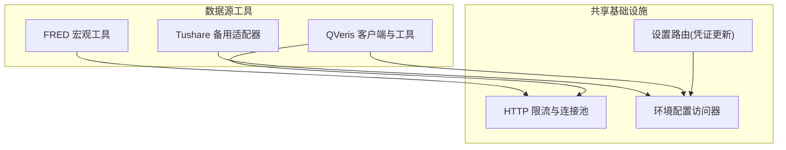
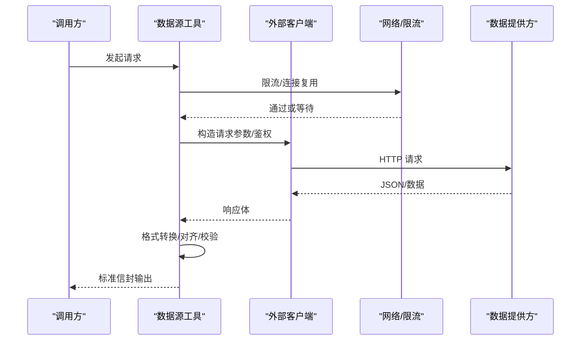
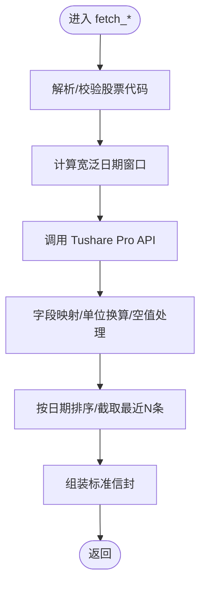
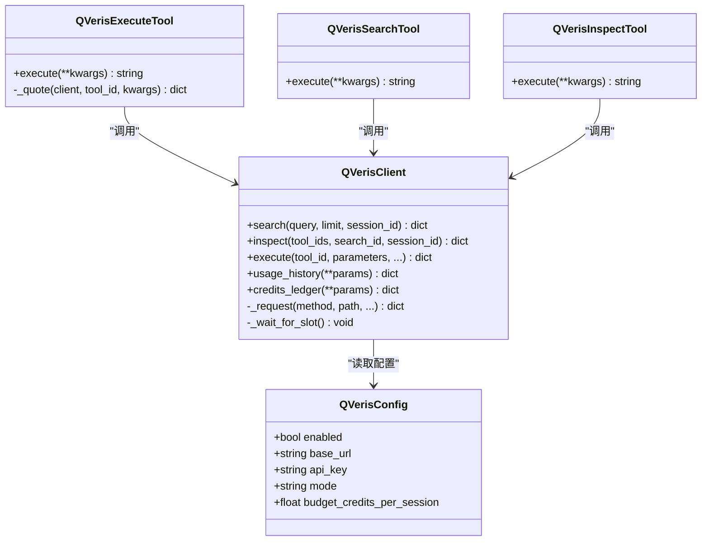
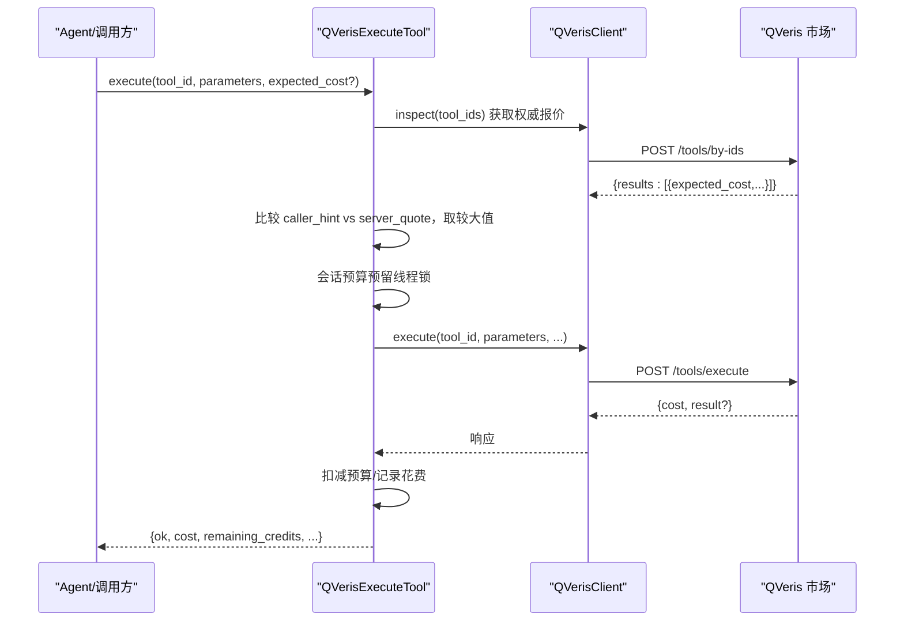
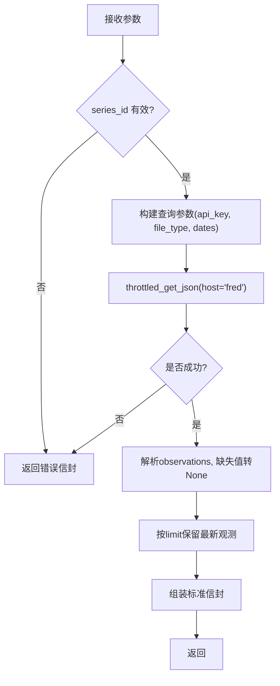
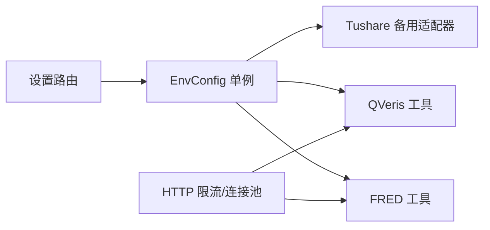

# 数据源工具

<cite>
**本文引用的文件**
- [tushare_fallbacks.py](file://agent/src/tools/tushare_fallbacks.py)
- [qveris_tool.py](file://agent/src/tools/qveris_tool.py)
- [fred_macro_tool.py](file://agent/src/tools/fred_macro_tool.py)
- [_http.py](file://agent/backtest/loaders/_http.py)
- [accessor.py](file://agent/src/config/accessor.py)
- [settings_routes.py](file://agent/src/api/settings_routes.py)
- [test_tushare_fallbacks.py](file://agent/tests/test_tushare_fallbacks.py)
- [test_qveris_tool.py](file://agent/tests/test_qveris_tool.py)
- [test_fred_macro_tool.py](file://agent/tests/test_fred_macro_tool.py)
</cite>

## 目录
1. [简介](#简介)
2. [项目结构](#项目结构)
3. [核心组件](#核心组件)
4. [架构总览](#架构总览)
5. [详细组件分析](#详细组件分析)
6. [依赖关系分析](#依赖关系分析)
7. [性能与限流](#性能与限流)
8. [故障转移与降级策略](#故障转移与降级策略)
9. [数据格式、对齐与质量校验](#数据格式对齐与质量校验)
10. [配置与认证管理](#配置与认证管理)
11. [多数据源协作与一致性](#多数据源协作与一致性)
12. [监控与可观测性](#监控与可观测性)
13. [故障排查指南](#故障排查指南)
14. [结论](#结论)

## 简介
本文件系统性梳理 Vibe-Trading 的数据源工具集，重点覆盖三类能力：
- Tushare 备用方案与降级：当免费/主用数据源不可用时，通过 Tushare 恢复研究流程。
- QVeris 专业金融数据服务：付费市场能力发现、检查与执行，内置会话级预算与请求限流。
- FRED 宏观经济指标：读取美联储经济数据库时间序列，统一封装为标准化输出。

文档同时说明认证配置、连接池、请求限流、数据格式转换、时间序列对齐、质量验证、数据源选择策略、故障转移与性能监控等关键主题。

## 项目结构
围绕三个工具模块及其共享基础设施：
- tushare_fallbacks：面向中国市场的资金流向、龙虎榜、北向资金、融资融券等数据的 Tushare 适配层。
- qveris_tool：QVeris 客户端、配置读写、搜索/检查/执行工具及会话级预算控制。
- fred_macro_tool：FRED 宏观时间序列的只读工具，统一解析缺失值与限制返回规模。
- 共享基础：HTTP 限流与连接池（_http.py）、环境变量配置访问器（accessor.py）、设置路由（settings_routes.py）。

图表来源
- [tushare_fallbacks.py:1-232](file://agent/src/tools/tushare_fallbacks.py#L1-L232)
- [qveris_tool.py:1-665](file://agent/src/tools/qveris_tool.py#L1-L665)
- [fred_macro_tool.py:1-260](file://agent/src/tools/fred_macro_tool.py#L1-L260)
- [_http.py:88-179](file://agent/backtest/loaders/_http.py#L88-L179)
- [accessor.py:52-92](file://agent/src/config/accessor.py#L52-L92)
- [settings_routes.py:635-673](file://agent/src/api/settings_routes.py#L635-L673)

章节来源
- [tushare_fallbacks.py:1-232](file://agent/src/tools/tushare_fallbacks.py#L1-L232)
- [qveris_tool.py:1-665](file://agent/src/tools/qveris_tool.py#L1-L665)
- [fred_macro_tool.py:1-260](file://agent/src/tools/fred_macro_tool.py#L1-L260)
- [_http.py:88-179](file://agent/backtest/loaders/_http.py#L88-L179)
- [accessor.py:52-92](file://agent/src/config/accessor.py#L52-L92)
- [settings_routes.py:635-673](file://agent/src/api/settings_routes.py#L635-L673)

## 核心组件
- Tushare 备用适配器
  - 提供资金流向、龙虎榜、北向资金、融资融券等数据获取函数，将 Tushare 响应转换为与上游工具一致的信封格式。
  - 支持日期规范化、单位换算、空值处理、交易日历缓冲窗口等。
- QVeris 客户端与工具
  - 配置持久化（原子写入、权限控制）、环境变量覆盖、模式归一化。
  - 客户端具备最小请求间隔、429 重试（遵循 Retry-After）、结果截断时自动拉取完整内容。
  - 执行工具包含会话级预算预留与扣减、报价校验（服务端优先）、并发安全。
- FRED 宏观工具
  - 只读工具，按 series_id 获取观测值，统一解析缺失值“.”为 None，限制最大返回条数，走 IP 限流通道。

章节来源
- [tushare_fallbacks.py:22-232](file://agent/src/tools/tushare_fallbacks.py#L22-L232)
- [qveris_tool.py:38-147,202-353,382-665:38-147](file://agent/src/tools/qveris_tool.py#L38-L147)
- [qveris_tool.py:202-353](file://agent/src/tools/qveris_tool.py#L202-L353)
- [qveris_tool.py:382-665](file://agent/src/tools/qveris_tool.py#L382-L665)
- [fred_macro_tool.py:49-177](file://agent/src/tools/fred_macro_tool.py#L49-L177)

## 架构总览

图表来源
- [qveris_tool.py:239-344](file://agent/src/tools/qveris_tool.py#L239-L344)
- [fred_macro_tool.py:143-177](file://agent/src/tools/fred_macro_tool.py#L143-L177)
- [_http.py:120-179](file://agent/backtest/loaders/_http.py#L120-L179)

## 详细组件分析

### Tushare 备用适配器
- 功能要点
  - 资金流向：将 Tushare 金额字段从万元换算为元，并按大小单拆分净买入额。
  - 龙虎榜：聚合上榜股票与席位信息，标准化字段并排序。
  - 北向资金：历史与实时汇总，统一单位为“万元”。
  - 融资融券：按交易日倒序返回最近 N 条。
- 健壮性
  - 日期容错：支持多种日期格式，统一为 YYYY-MM-DD。
  - 交易日历缓冲：根据所需交易日数量计算更宽的起止窗口，避免节假日导致数据不足。
  - 代码映射：A股代码前缀推断交易所后缀，拒绝不支持的代码。
- 错误处理
  - 未配置 token 或未安装 tushare 时抛出专用异常，便于上层捕获并降级。

图表来源
- [tushare_fallbacks.py:113-232](file://agent/src/tools/tushare_fallbacks.py#L113-L232)

章节来源
- [tushare_fallbacks.py:22-232](file://agent/src/tools/tushare_fallbacks.py#L22-L232)
- [test_tushare_fallbacks.py:15-110](file://agent/tests/test_tushare_fallbacks.py#L15-L110)

### QVeris 客户端与工具
- 配置与认证
  - 本地配置文件路径固定，保存时使用临时文件+原子替换，权限设置为 0600。
  - 环境变量覆盖本地配置（API Key、Base URL），支持模式归一化（free/paid）。
- 客户端
  - 最小请求间隔控制；429 状态码下读取 Retry-After 并重试。
  - 结果截断时自动下载完整内容文件。
- 工具
  - 搜索/检查：用于能力发现与参数校验。
  - 执行：会话级预算预留与扣减，报价以服务端为准（若冲突则取较大值），失败释放预留额度。
  - 并发安全：使用线程锁保护会话级预算变量。

图表来源
- [qveris_tool.py:38-147](file://agent/src/tools/qveris_tool.py#L38-L147)
- [qveris_tool.py:202-353](file://agent/src/tools/qveris_tool.py#L202-L353)
- [qveris_tool.py:394-470](file://agent/src/tools/qveris_tool.py#L394-L470)
- [qveris_tool.py:472-665](file://agent/src/tools/qveris_tool.py#L472-L665)

图表来源
- [qveris_tool.py:498-665](file://agent/src/tools/qveris_tool.py#L498-L665)
- [qveris_tool.py:239-344](file://agent/src/tools/qveris_tool.py#L239-L344)

章节来源
- [qveris_tool.py:38-147](file://agent/src/tools/qveris_tool.py#L38-L147)
- [qveris_tool.py:202-353](file://agent/src/tools/qveris_tool.py#L202-L353)
- [qveris_tool.py:394-665](file://agent/src/tools/qveris_tool.py#L394-L665)
- [test_qveris_tool.py:49-414](file://agent/tests/test_qveris_tool.py#L49-L414)

### FRED 宏观工具
- 功能要点
  - 仅读取单一宏观序列，支持起止日期过滤与最大观测数限制。
  - 缺失值“.”转为 None，保证下游时间序列对齐与统计正确性。
  - 所有请求经 IP 限流通道（host_key=fred），避免触发对方限速。
- 健壮性
  - 参数校验：series_id 必填且大写；limit 范围钳制。
  - 空结果与网络异常均返回错误信封，不抛异常给调用方。

图表来源
- [fred_macro_tool.py:108-177](file://agent/src/tools/fred_macro_tool.py#L108-L177)
- [fred_macro_tool.py:180-260](file://agent/src/tools/fred_macro_tool.py#L180-L260)
- [_http.py:155-179](file://agent/backtest/loaders/_http.py#L155-L179)

章节来源
- [fred_macro_tool.py:49-260](file://agent/src/tools/fred_macro_tool.py#L49-L260)
- [test_fred_macro_tool.py:1-182](file://agent/tests/test_fred_macro_tool.py#L1-L182)

## 依赖关系分析
- 配置访问器
  - 提供线程安全的 EnvConfig 单例，支持运行时重置，供各工具读取密钥与开关。
- HTTP 限流与连接池
  - 基于 host bucket 的会话复用与最小请求间隔，保障不同提供商隔离与节流。
- 设置路由
  - 提供 Web UI 更新数据源凭证的能力，并刷新运行期配置缓存。

图表来源
- [accessor.py:52-92](file://agent/src/config/accessor.py#L52-L92)
- [_http.py:88-179](file://agent/backtest/loaders/_http.py#L88-L179)
- [settings_routes.py:635-673](file://agent/src/api/settings_routes.py#L635-L673)

章节来源
- [accessor.py:52-92](file://agent/src/config/accessor.py#L52-L92)
- [_http.py:88-179](file://agent/backtest/loaders/_http.py#L88-L179)
- [settings_routes.py:635-673](file://agent/src/api/settings_routes.py#L635-L673)

## 性能与限流
- 请求限流
  - FRED：通过 host_key="fred" 的最小间隔控制，默认约 0.6 秒，可通过环境变量覆盖。
  - QVeris：客户端内部最小请求间隔与 429 重试（遵循 Retry-After）。
- 连接池
  - 按 host bucket 复用 requests.Session，减少握手开销。
- 数据裁剪
  - FRED：限制最大观测数，默认 2000，上限 5000，仅保留最新片段。
  - Tushare：根据交易日需求计算更宽日期窗口，最终仅返回最近 N 条。

章节来源
- [fred_macro_tool.py:31-47,143-177:31-47](file://agent/src/tools/fred_macro_tool.py#L31-L47)
- [qveris_tool.py:202-273](file://agent/src/tools/qveris_tool.py#L202-L273)
- [_http.py:88-179](file://agent/backtest/loaders/_http.py#L88-L179)

## 故障转移与降级策略
- Tushare 作为降级源
  - 当主用数据源（如东方财富）不可用时，上层工具可切换至 Tushare 备用适配器，保持研究流程连续。
  - 适配器在 token 缺失或导入失败时抛出专用异常，便于上层识别并回退。
- QVeris 显式启用
  - 仅在 paid 模式且已配置 API Key 时暴露工具；否则隐藏或返回明确错误提示。
  - 执行前进行报价校验与预算检查，防止超支；失败释放预留额度。
- FRED 可用性门控
  - 未配置 FRED_API_KEY 时工具不可用，注册阶段即排除，避免无效调用。

章节来源
- [tushare_fallbacks.py:18-30](file://agent/src/tools/tushare_fallbacks.py#L18-L30)
- [qveris_tool.py:137-175,382-470:137-175](file://agent/src/tools/qveris_tool.py#L137-L175)
- [fred_macro_tool.py:98-107](file://agent/src/tools/fred_macro_tool.py#L98-L107)

## 数据格式、对齐与质量校验
- 日期与时间序列
  - Tushare：统一为 YYYY-MM-DD，按交易日历缓冲后排序并截取。
  - FRED：清洗日期字符串，缺失值“.”转为 None，确保下游对齐。
- 数值与单位
  - Tushare：金额字段从万元换算为元；北向资金统一为万元。
  - FRED：非数字或缺失值转为 None，避免污染统计。
- 质量校验
  - 参数校验（必填、类型、范围）；空结果或非法数据返回错误信封。
  - QVeris：对 expected_cost 做严格校验，服务端报价优先，防止被低估绕过预算。

章节来源
- [tushare_fallbacks.py:46-87,113-232:46-87](file://agent/src/tools/tushare_fallbacks.py#L46-L87)
- [fred_macro_tool.py:207-254](file://agent/src/tools/fred_macro_tool.py#L207-L254)
- [qveris_tool.py:355-379,498-561:355-379](file://agent/src/tools/qveris_tool.py#L355-L379)

## 配置与认证管理
- Tushare
  - 通过环境变量读取 token，未配置或占位符时禁用备用能力。
  - Web UI 支持更新并热刷新环境变量与配置缓存。
- QVeris
  - 本地配置文件持久化（原子写入、0600 权限），环境变量覆盖。
  - 模式归一化（free/paid），仅 paid 模式暴露执行工具。
- FRED
  - 通过环境变量注入 API Key，未配置则工具不可用。

章节来源
- [tushare_fallbacks.py:22-30](file://agent/src/tools/tushare_fallbacks.py#L22-L30)
- [settings_routes.py:635-673](file://agent/src/api/settings_routes.py#L635-L673)
- [qveris_tool.py:49-147](file://agent/src/tools/qveris_tool.py#L49-L147)
- [fred_macro_tool.py:98-107](file://agent/src/tools/fred_macro_tool.py#L98-L107)
- [accessor.py:52-92](file://agent/src/config/accessor.py#L52-L92)

## 多数据源协作与一致性
- 选择策略
  - 主用免费源优先，不可用时回退到 Tushare；QVeris 需显式启用，不参与自动链。
  - FRED 作为宏观数据独立入口，与其他市场数据解耦。
- 一致性保证
  - 统一信封输出（ok/source/data），便于上层聚合。
  - 时间戳标准化与空值语义一致（None 表示缺失），利于跨源对齐。
  - 预算与配额：QVeris 会话级预算控制，防止超额消费。

章节来源
- [tushare_fallbacks.py:113-232](file://agent/src/tools/tushare_fallbacks.py#L113-L232)
- [qveris_tool.py:382-665](file://agent/src/tools/qveris_tool.py#L382-L665)
- [fred_macro_tool.py:108-177](file://agent/src/tools/fred_macro_tool.py#L108-L177)

## 监控与可观测性
- 限流与重试
  - QVeris：记录 429 重试行为（测试中验证），遵循 Retry-After。
  - FRED：通过 host bucket 限流，避免触发对方速率限制。
- 预算与花费
  - QVeris：返回剩余信用与累计花费，便于审计与告警。
- 错误信封
  - 所有工具统一返回 ok/error 结构，便于日志采集与可视化。

章节来源
- [qveris_tool.py:239-273,645-665:239-273](file://agent/src/tools/qveris_tool.py#L239-L273)
- [test_qveris_tool.py:260-279](file://agent/tests/test_qveris_tool.py#L260-L279)
- [fred_macro_tool.py:143-177](file://agent/src/tools/fred_macro_tool.py#L143-L177)

## 故障排查指南
- Tushare 备用不可用
  - 现象：抛出专用异常或返回空结果。
  - 排查：确认 TUSHARE_TOKEN 已配置且非占位符；确认 tushare 包已安装。
- QVeris 执行被拒
  - 现象：返回 budget_exceeded 或 unconfigured 错误。
  - 排查：确认 paid 模式开启、API Key 存在；检查 expected_cost 与服务端报价；查看会话预算。
- FRED 无数据或请求失败
  - 现象：返回 no observations found 或请求失败错误。
  - 排查：确认 FRED_API_KEY；检查 series_id 与日期范围；观察限流与超时。

章节来源
- [tushare_fallbacks.py:18-30](file://agent/src/tools/tushare_fallbacks.py#L18-L30)
- [qveris_tool.py:154-175,563-624:154-175](file://agent/src/tools/qveris_tool.py#L154-L175)
- [fred_macro_tool.py:122-159](file://agent/src/tools/fred_macro_tool.py#L122-L159)
- [test_fred_macro_tool.py:129-161](file://agent/tests/test_fred_macro_tool.py#L129-L161)

## 结论
该数据源工具集通过统一的接口与健壮的错误处理，实现了：
- 灵活的多源接入与降级：Tushare 作为可靠的备用源，QVeris 提供付费扩展能力，FRED 专注宏观数据。
- 严格的认证与配额管理：环境变量与本地配置结合，QVeris 会话级预算控制。
- 稳定的限流与连接复用：按 host 桶限流与连接池，降低外部依赖风险。
- 一致的数据格式与质量保障：日期、数值、空值语义统一，便于跨源对齐与分析。

这些设计使系统在复杂的外部环境下仍能提供稳定、可控、可观测的数据服务能力。