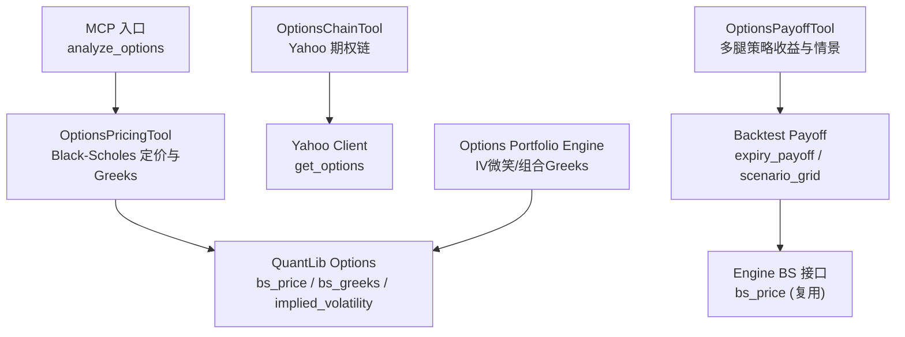
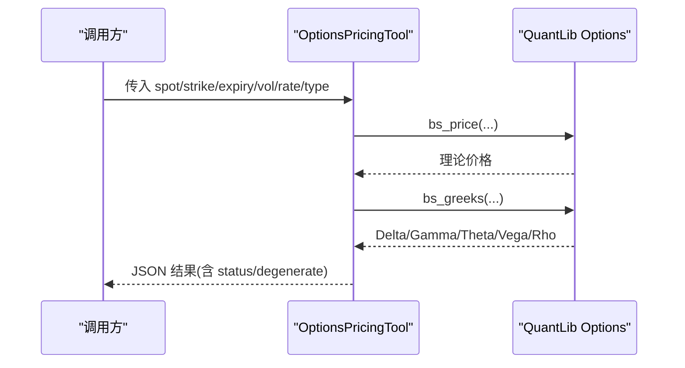
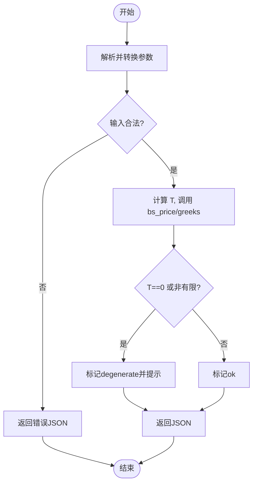
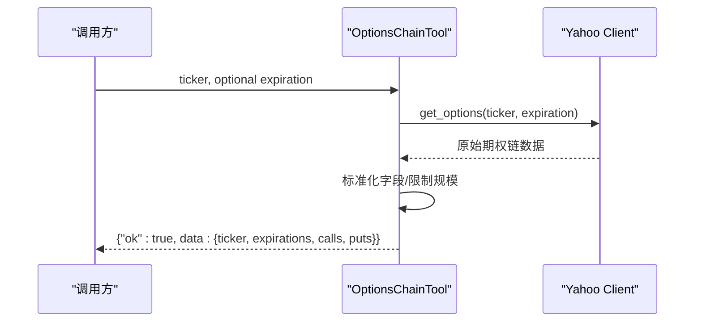
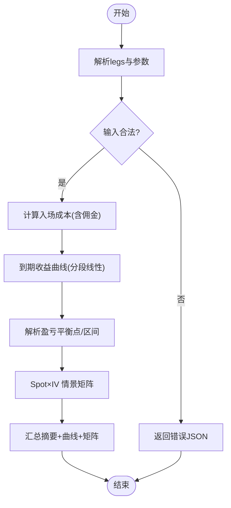
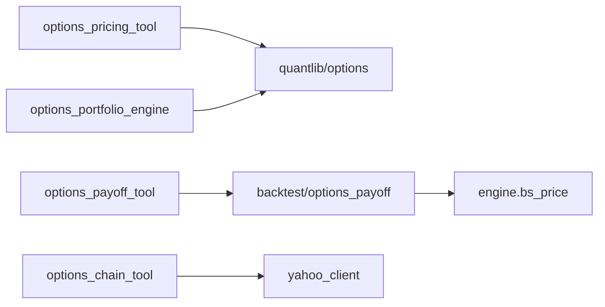

# 期权工具

<cite>
**本文引用的文件**
- [agent/src/tools/options_pricing_tool.py](file://agent/src/tools/options_pricing_tool.py)
- [agent/src/quantlib/options.py](file://agent/src/quantlib/options.py)
- [agent/backtest/engines/options_portfolio.py](file://agent/backtest/engines/options_portfolio.py)
- [agent/backtest/options_payoff.py](file://agent/backtest/options_payoff.py)
- [agent/src/tools/options_chain_tool.py](file://agent/src/tools/options_chain_tool.py)
- [agent/src/tools/options_payoff_tool.py](file://agent/src/tools/options_payoff_tool.py)
- [agent/mcp_server.py](file://agent/mcp_server.py)
</cite>

## 目录
1. [简介](#简介)
2. [项目结构](#项目结构)
3. [核心组件](#核心组件)
4. [架构总览](#架构总览)
5. [详细组件分析](#详细组件分析)
6. [依赖关系分析](#依赖关系分析)
7. [性能与数值稳定性](#性能与数值稳定性)
8. [策略构建、风险管理与对冲](#策略构建风险管理与对冲)
9. [数据分析、流动性评估与市场情绪](#数据分析流动性评估与市场情绪)
10. [故障排查指南](#故障排查指南)
11. [结论](#结论)
12. [附录：API与参数说明](#附录api与参数说明)

## 简介
本文件系统性介绍 Vibe-Trading 的期权工具集，覆盖三大工具：
- options_pricing_tool：基于 Black-Scholes 的理论定价与希腊字母（Delta/Gamma/Theta/Vega/Rho）计算。
- options_chain_tool：获取并标准化美国上市期权的链式数据（Call/Put 合约、行权价、买卖盘、成交量、持仓量、隐含波动率、虚实状态），并提供到期日列表管理。
- options_payoff_tool：对多腿欧式期权策略进行到期收益图与盈亏分析，支持 Spot/IV 情景矩阵、盈亏平衡点、最大盈亏等指标。

同时，文档解释期权定价理论、波动率曲面建模与隐含波动率求解；记录策略构建、风险管理及对冲实践；提供数据分析、流动性评估与市场情绪指标的使用建议与示例思路。

## 项目结构
围绕期权能力的核心代码分布在以下模块：
- 工具层（面向调用方/Agent）：options_pricing_tool、options_chain_tool、options_payoff_tool
- 量化库（底层数学实现）：src/quantlib/options（BS 定价、Greeks、隐含波动率反解）
- 回测引擎与策略分析：backtest/engines/options_portfolio（组合级 Greeks、美式早exercised启发、IV微笑）、backtest/options_payoff（确定性到期收益与情景网格）
- MCP 集成入口：mcp_server.py 暴露 analyze_options 工具

图表来源
- [agent/mcp_server.py:944-953](file://agent/mcp_server.py#L944-L953)
- [agent/src/tools/options_pricing_tool.py:77-172](file://agent/src/tools/options_pricing_tool.py#L77-L172)
- [agent/src/quantlib/options.py:161-263](file://agent/src/quantlib/options.py#L161-L263)
- [agent/src/tools/options_chain_tool.py:37-100](file://agent/src/tools/options_chain_tool.py#L37-L100)
- [agent/src/tools/options_payoff_tool.py:21-225](file://agent/src/tools/options_payoff_tool.py#L21-L225)
- [agent/backtest/options_payoff.py:274-457](file://agent/backtest/options_payoff.py#L274-L457)
- [agent/backtest/engines/options_portfolio.py:53-98](file://agent/backtest/engines/options_portfolio.py#L53-L98)

章节来源
- [agent/src/tools/options_pricing_tool.py:77-172](file://agent/src/tools/options_pricing_tool.py#L77-L172)
- [agent/src/tools/options_chain_tool.py:37-100](file://agent/src/tools/options_chain_tool.py#L37-L100)
- [agent/src/tools/options_payoff_tool.py:21-225](file://agent/src/tools/options_payoff_tool.py#L21-L225)
- [agent/src/quantlib/options.py:161-263](file://agent/src/quantlib/options.py#L161-L263)
- [agent/backtest/options_payoff.py:274-457](file://agent/backtest/options_payoff.py#L274-L457)
- [agent/backtest/engines/options_portfolio.py:53-98](file://agent/backtest/engines/options_portfolio.py#L53-L98)
- [agent/mcp_server.py:944-953](file://agent/mcp_server.py#L944-L953)

## 核心组件
- 期权定价工具（options_pricing_tool）
  - 输入校验：标的价格、行权价、剩余天数、波动率、无风险利率、期权类型
  - 调用 QuantLib 的 bs_price 与 bs_greeks，合并结果并四舍五入展示
  - 处理退化情形（T=0 或极端输入）并给出警告标记
- 期权链工具（options_chain_tool）
  - 通过 Yahoo Finance 客户端拉取单一到期日的 Call/Put 链
  - 标准化字段：合约符号、行权价、last/bid/ask、成交量、持仓量、隐含波动率、虚实状态
  - 限制每侧合约数量，避免响应过大
- 期权收益工具（options_payoff_tool）
  - 解析多腿策略（看涨/看跌、正负数量、可选入场溢价）
  - 计算到期收益曲线、盈亏平衡点、最大盈亏、是否无界
  - 生成 Spot×IV 情景矩阵，用于压力测试与敏感性分析

章节来源
- [agent/src/tools/options_pricing_tool.py:13-74](file://agent/src/tools/options_pricing_tool.py#L13-L74)
- [agent/src/tools/options_chain_tool.py:18-34](file://agent/src/tools/options_chain_tool.py#L18-L34)
- [agent/src/tools/options_payoff_tool.py:21-120](file://agent/src/tools/options_payoff_tool.py#L21-L120)

## 架构总览
期权能力由“工具层 + 量化库 + 回测引擎”三层构成：
- 工具层封装用户输入、错误处理与输出格式，屏蔽底层细节
- 量化库提供统一、可复用的定价与希腊字母实现，包含隐含波动率反解
- 回测引擎在组合层面聚合 Greeks，并引入 IV 微笑模型以贴近真实市场

图表来源
- [agent/src/tools/options_pricing_tool.py:95-172](file://agent/src/tools/options_pricing_tool.py#L95-L172)
- [agent/src/quantlib/options.py:161-263](file://agent/src/quantlib/options.py#L161-L263)

章节来源
- [agent/src/tools/options_pricing_tool.py:95-172](file://agent/src/tools/options_pricing_tool.py#L95-L172)
- [agent/src/quantlib/options.py:161-263](file://agent/src/quantlib/options.py#L161-L263)

## 详细组件分析

### 期权定价工具（options_pricing_tool）
- 职责
  - 严格校验输入边界（如 spot/strike/sigma 必须为正，expiry_days 非负）
  - 将天数转换为年化时间 T，调用 bs_price 与 bs_greeks
  - 合并 price 与 Greeks，返回带 inputs 与 status 的结构化 JSON
  - 对退化情形（T=0 或非有限值）标注 warning 与 degenerate 标志
- 关键流程
  - 参数解析与类型转换
  - 输入合法性检查
  - 定价与 Greeks 计算
  - 结果序列化与异常兜底

图表来源
- [agent/src/tools/options_pricing_tool.py:13-74](file://agent/src/tools/options_pricing_tool.py#L13-L74)
- [agent/src/tools/options_pricing_tool.py:95-172](file://agent/src/tools/options_pricing_tool.py#L95-L172)

章节来源
- [agent/src/tools/options_pricing_tool.py:13-74](file://agent/src/tools/options_pricing_tool.py#L13-L74)
- [agent/src/tools/options_pricing_tool.py:95-172](file://agent/src/tools/options_pricing_tool.py#L95-L172)

### 期权链工具（options_chain_tool）
- 职责
  - 读取 Yahoo Finance 的期权链数据，标准化为统一字段
  - 支持指定到期日或默认最近到期日
  - 限制每侧最多合约数，控制响应体积
- 数据处理
  - 提取 expirationDates、calls、puts
  - 映射 Yahoo 字段到 snake_case 键名
  - 失败时返回统一错误信封

图表来源
- [agent/src/tools/options_chain_tool.py:37-100](file://agent/src/tools/options_chain_tool.py#L37-L100)
- [agent/src/tools/options_chain_tool.py:113-150](file://agent/src/tools/options_chain_tool.py#L113-L150)

章节来源
- [agent/src/tools/options_chain_tool.py:37-100](file://agent/src/tools/options_chain_tool.py#L37-L100)
- [agent/src/tools/options_chain_tool.py:113-150](file://agent/src/tools/options_chain_tool.py#L113-L150)

### 期权收益工具（options_payoff_tool）
- 职责
  - 解析多腿策略（option_type、strike、qty、可选 premium）
  - 计算到期收益曲线、盈亏平衡点、最大盈亏、是否无界
  - 生成 Spot×IV 情景矩阵，用于压力测试
- 关键算法
  - 到期收益：按行权价分段线性函数，解析求根得到盈亏平衡区间
  - 情景矩阵：对不同 Spot 与 IV 组合，使用 BS 定价计算标记价值，减去入场成本
  - 输入校验：确保所有数值有限且符合业务约束

图表来源
- [agent/src/tools/options_payoff_tool.py:122-225](file://agent/src/tools/options_payoff_tool.py#L122-L225)
- [agent/backtest/options_payoff.py:274-457](file://agent/backtest/options_payoff.py#L274-L457)

章节来源
- [agent/src/tools/options_payoff_tool.py:122-225](file://agent/src/tools/options_payoff_tool.py#L122-L225)
- [agent/backtest/options_payoff.py:274-457](file://agent/backtest/options_payoff.py#L274-L457)

### 量化库（QuantLib Options）
- 功能
  - Black-Scholes 定价：支持连续股息收益率 q，处理退化输入（T<=0、sigma<=0、S<=0、K<=0）
  - 希腊字母：Delta/Gamma/Theta/Vega/Rho，注意单位约定（theta 按日历日，vega/rho 按 1% 变动）
  - 隐含波动率反解：牛顿法 + Brentq 二分，结合无套利上下界与 Vega 阈值判断报价是否可识别波动率
- 重要约定
  - T 以年为单位，r/q 为连续复利年化
  - 不对外部做四舍五入，保留精度供隐波求解使用

章节来源
- [agent/src/quantlib/options.py:1-49](file://agent/src/quantlib/options.py#L1-L49)
- [agent/src/quantlib/options.py:161-263](file://agent/src/quantlib/options.py#L161-L263)
- [agent/src/quantlib/options.py:298-406](file://agent/src/quantlib/options.py#L298-L406)

### 回测引擎（Options Portfolio Engine）
- 功能
  - 历史波动率估计：滚动对数收益率标准差年化
  - IV 微笑模型：基于 moneyness 的二次调整（skew + curvature）
  - 组合 Greeks 聚合：逐日标记市值并累计 Delta/Gamma/Theta/Vega/Rho
  - 美式期权早exercised启发：当内在价值显著高于续持价值时执行
- 输出
  - equity.csv、trades.csv、greeks.csv、metrics.csv

章节来源
- [agent/backtest/engines/options_portfolio.py:35-47](file://agent/backtest/engines/options_portfolio.py#L35-L47)
- [agent/backtest/engines/options_portfolio.py:53-98](file://agent/backtest/engines/options_portfolio.py#L53-L98)
- [agent/backtest/engines/options_portfolio.py:173-517](file://agent/backtest/engines/options_portfolio.py#L173-L517)

## 依赖关系分析
- options_pricing_tool 依赖 src/quantlib/options 的 bs_price 与 bs_greeks
- options_payoff_tool 依赖 backtest/options_payoff 的 expiry_payoff 与 scenario_grid，后者再调用引擎的 bs_price
- options_chain_tool 依赖 Yahoo 客户端获取链数据
- 回测引擎聚合 Greeks，并使用同一套 BS 实现保证一致性

图表来源
- [agent/src/tools/options_pricing_tool.py:9-10](file://agent/src/tools/options_pricing_tool.py#L9-L10)
- [agent/src/tools/options_payoff_tool.py:11-12](file://agent/src/tools/options_payoff_tool.py#L11-L12)
- [agent/backtest/options_payoff.py:14-15](file://agent/backtest/options_payoff.py#L14-L15)
- [agent/backtest/engines/options_portfolio.py:29-30](file://agent/backtest/engines/options_portfolio.py#L29-L30)
- [agent/src/tools/options_chain_tool.py:15-16](file://agent/src/tools/options_chain_tool.py#L15-L16)

章节来源
- [agent/src/tools/options_pricing_tool.py:9-10](file://agent/src/tools/options_pricing_tool.py#L9-L10)
- [agent/src/tools/options_payoff_tool.py:11-12](file://agent/src/tools/options_payoff_tool.py#L11-L12)
- [agent/backtest/options_payoff.py:14-15](file://agent/backtest/options_payoff.py#L14-L15)
- [agent/backtest/engines/options_portfolio.py:29-30](file://agent/backtest/engines/options_portfolio.py#L29-L30)
- [agent/src/tools/options_chain_tool.py:15-16](file://agent/src/tools/options_chain_tool.py#L15-L16)

## 性能与数值稳定性
- 定价与 Greeks
  - 使用向量化 NumPy 与 scipy.stats.norm，避免循环开销
  - 退化输入直接返回内在价值与零阶二阶 Greeks，避免数值奇异
- 隐含波动率求解
  - 先尝试牛顿法，若 Vega 过小则切换到 Brentq 二分
  - 使用无套利上下界过滤无效报价，避免收敛到无意义的波动率带
  - 通过 Vega 分辨率阈值判定报价是否能唯一识别波动率
- 收益分析
  - 到期收益采用分段线性解析方法，避免网格插值误差
  - 情景矩阵对 Spot×IV 组合进行批量计算，限制点数范围防止内存爆炸

章节来源
- [agent/src/quantlib/options.py:298-406](file://agent/src/quantlib/options.py#L298-L406)
- [agent/backtest/options_payoff.py:274-457](file://agent/backtest/options_payoff.py#L274-L457)

## 策略构建、风险管理与对冲
- 策略构建
  - 使用 OptionLeg 定义多腿（看涨/看跌、行权价、数量、可选入场溢价）
  - 内置常见策略构造器：牛市看涨价差、长期跨式、铁鹰式（短铁鹰）
- 风险管理
  - 到期收益分析提供盈亏平衡点、最大盈亏、是否无界
  - 情景矩阵用于 Spot/IV 压力测试，观察不同波动率环境下的 P&L
  - 组合 Greeks 聚合便于监控方向性、凸性与波动率敞口
- 对冲实践
  - 利用 Delta 进行方向性对冲（例如用标的或期货对冲 Delta）
  - Gamma 高时需频繁再平衡；Theta 为卖方策略的时间收益来源
  - Vega 暴露用于波动率交易与波动率曲面相对价值策略
  - 美式期权早exercised启发在深度实值看跌或高股息场景下考虑提前行权

章节来源
- [agent/backtest/options_payoff.py:460-497](file://agent/backtest/options_payoff.py#L460-L497)
- [agent/backtest/engines/options_portfolio.py:438-478](file://agent/backtest/engines/options_portfolio.py#L438-L478)
- [agent/src/skills/options-strategy/SKILL.md:120-143](file://agent/src/skills/options-strategy/SKILL.md#L120-L143)

## 数据分析、流动性评估与市场情绪
- 数据来源
  - options_chain_tool 提供 Call/Put 链的 bid/ask、last、volume、open interest、implied volatility
- 流动性评估
  - 使用 bid-ask 价差衡量即时流动性
  - 结合 volume 与 open interest 评估合约活跃度与资金参与度
- 市场情绪指标
  - 隐含波动率水平与期限结构反映预期波动
  - 波动率偏斜（Skew）：通常看跌 IV 高于看涨 IV，反映下行保护需求
  - 虚值/实值合约分布可用于观察市场尾部风险偏好

章节来源
- [agent/src/tools/options_chain_tool.py:18-34](file://agent/src/tools/options_chain_tool.py#L18-L34)
- [agent/src/tools/options_chain_tool.py:113-150](file://agent/src/tools/options_chain_tool.py#L113-L150)

## 故障排查指南
- 输入错误
  - 缺失必填参数或类型不符：工具会返回错误 JSON，检查 spot/strike/expiry_days/volatility/option_type
  - 非法数值（非有限、负值）：会被拒绝并返回错误信息
- 退化情形
  - T=0 或极端输入导致 Greeks 奇异：工具会标记 degenerate 并返回内在价值
- 网络请求失败
  - 期权链工具调用 Yahoo 失败：返回 ok=false 的错误消息，检查 ticker 与网络连通性
- 收益分析异常
  - legs 为空或 qty 为零：抛出 ValueError，检查策略定义
  - 网格或 IV 场景非法：确保 spot_points 与 iv_values 在允许范围内

章节来源
- [agent/src/tools/options_pricing_tool.py:13-40](file://agent/src/tools/options_pricing_tool.py#L13-L40)
- [agent/src/tools/options_pricing_tool.py:108-172](file://agent/src/tools/options_pricing_tool.py#L108-L172)
- [agent/src/tools/options_chain_tool.py:84-99](file://agent/src/tools/options_chain_tool.py#L84-L99)
- [agent/src/tools/options_payoff_tool.py:228-339](file://agent/src/tools/options_payoff_tool.py#L228-L339)

## 结论
Vibe-Trading 的期权工具集提供了从定价、链数据到策略收益分析的完整能力：
- 统一的 Black-Scholes 实现确保定价与 Greeks 的一致性
- 隐含波动率求解具备鲁棒性，能识别不可报价的波动率带
- 收益分析工具支持多腿策略与情景压力测试，便于研究与风控
- 回测引擎引入 IV 微笑与组合 Greeks，更贴近真实市场行为
- 期权链工具提供流动性与情绪指标，支撑策略筛选与执行决策

## 附录：API与参数说明
- options_pricing（定价工具）
  - 必填：spot、strike、expiry_days、volatility、option_type
  - 可选：risk_free_rate（默认 0.05）
  - 输出：price、delta、gamma、theta、vega、rho、inputs、status（ok/degenerate）
- get_options_chain（期权链工具）
  - 必填：ticker（US 标的）
  - 可选：expiration（Unix 秒，缺省时取最近到期）
  - 输出：ok、market、source、data（ticker、expirations、calls、puts）
- options_payoff（收益工具）
  - 必填：legs（数组，每项含 option_type、strike、qty）、entry_spot、expiry_days
  - 可选：risk_free_rate、volatility、multiplier、commission_rate、spot_min/max、spot_points、scenario_iv_values
  - 输出：summary（net_premium、breakevens、max_profit/loss、unbounded flags）、expiry_curve、scenario_grid、limitations

章节来源
- [agent/src/tools/options_pricing_tool.py:82-93](file://agent/src/tools/options_pricing_tool.py#L82-L93)
- [agent/src/tools/options_chain_tool.py:48-68](file://agent/src/tools/options_chain_tool.py#L48-L68)
- [agent/src/tools/options_payoff_tool.py:33-120](file://agent/src/tools/options_payoff_tool.py#L33-L120)