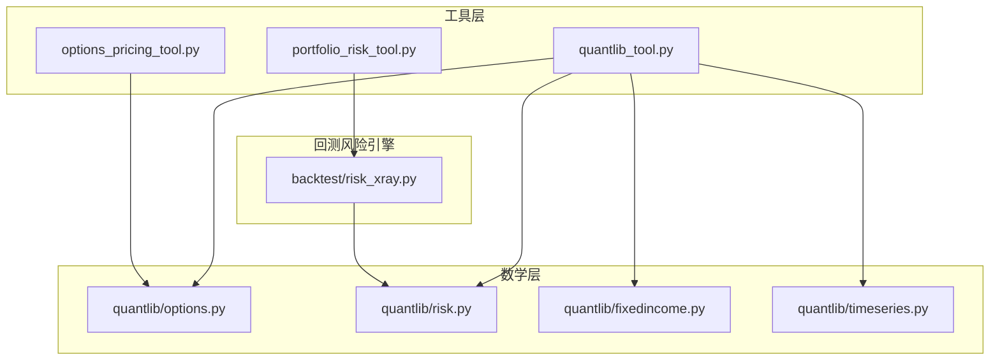
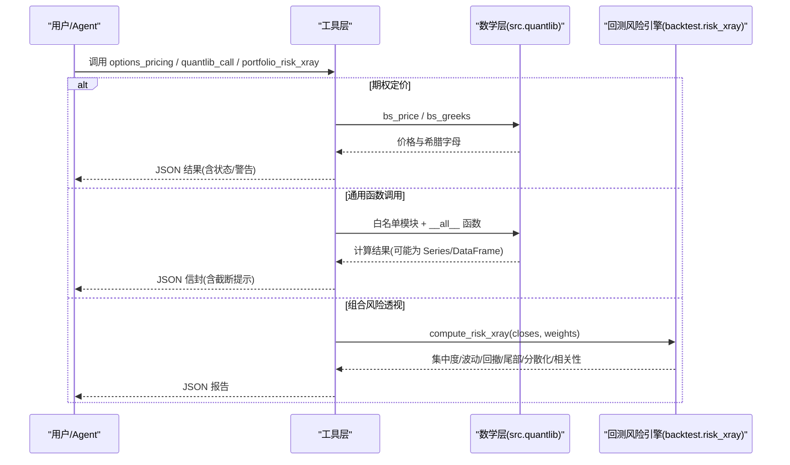
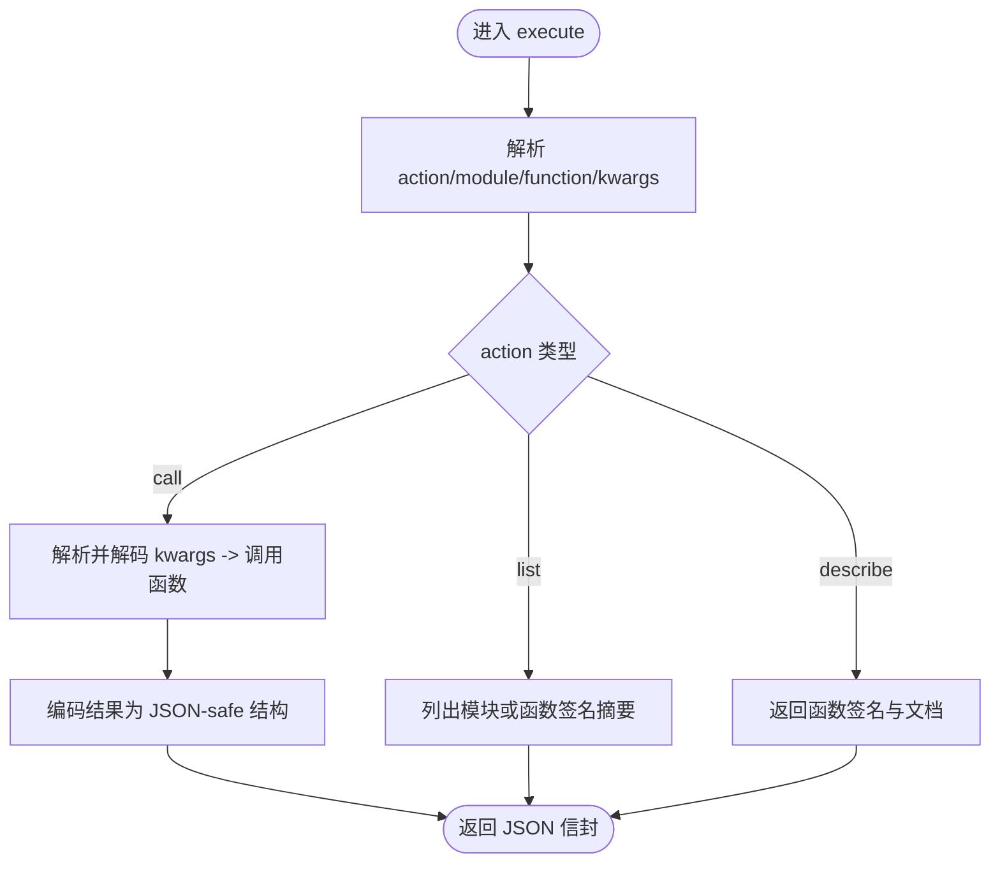
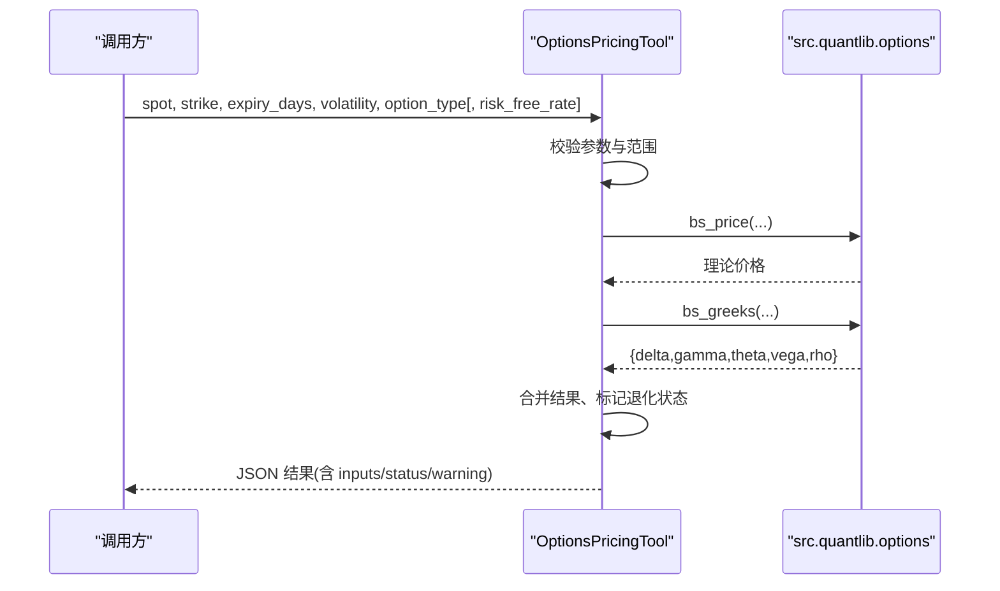
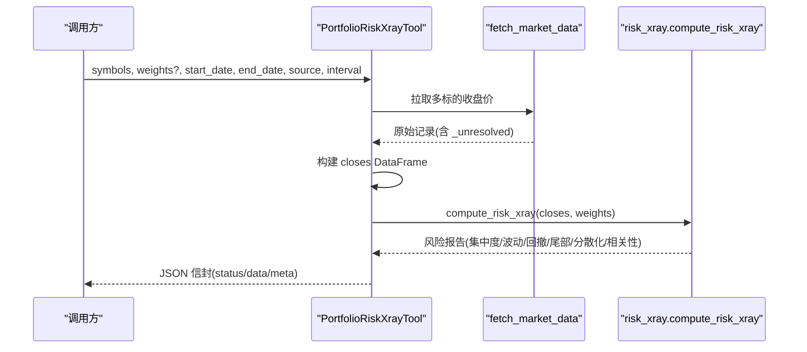
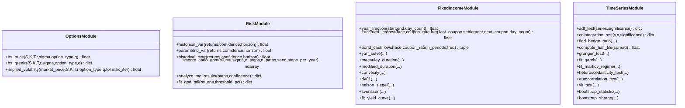
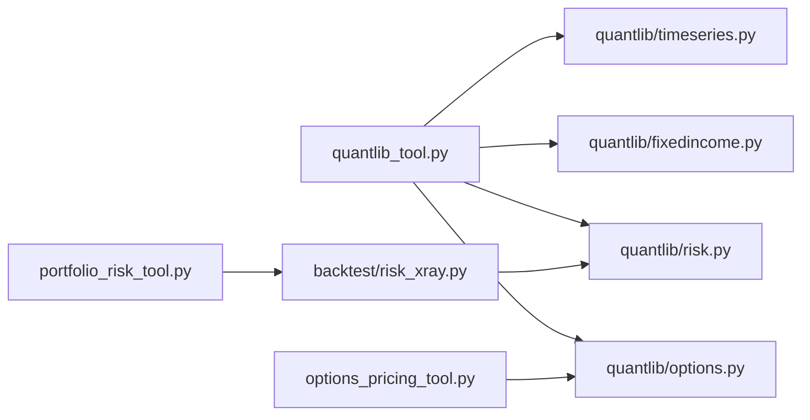

# 量化金融工具

<cite>
**本文引用的文件**
- [agent/src/tools/quantlib_tool.py](file://agent/src/tools/quantlib_tool.py)
- [agent/src/tools/options_pricing_tool.py](file://agent/src/tools/options_pricing_tool.py)
- [agent/src/tools/portfolio_risk_tool.py](file://agent/src/tools/portfolio_risk_tool.py)
- [agent/src/quantlib/__init__.py](file://agent/src/quantlib/__init__.py)
- [agent/src/quantlib/options.py](file://agent/src/quantlib/options.py)
- [agent/src/quantlib/risk.py](file://agent/src/quantlib/risk.py)
- [agent/src/quantlib/fixedincome.py](file://agent/src/quantlib/fixedincome.py)
- [agent/src/quantlib/timeseries.py](file://agent/src/quantlib/timeseries.py)
- [agent/backtest/risk_xray.py](file://agent/backtest/risk_xray.py)
</cite>

## 目录
1. [简介](#简介)
2. [项目结构](#项目结构)
3. [核心组件](#核心组件)
4. [架构总览](#架构总览)
5. [详细组件分析](#详细组件分析)
6. [依赖关系分析](#依赖关系分析)
7. [性能与数值特性](#性能与数值特性)
8. [故障排查指南](#故障排查指南)
9. [结论](#结论)
10. [附录：模型与验证要点](#附录：模型与验证要点)

## 简介
本文件系统性梳理 Vibe-Trading 的量化金融工具集，重点覆盖以下三类能力：
- quantlib_tool：安全、可审计的“函数即服务”入口，统一暴露 src/quantlib 中的定价、固收、风险、时间序列、归因、估值等模块。
- options_pricing_tool：面向期权的 Black-Scholes 理论价与希腊字母计算，提供输入校验、退化情形处理与结果封装。
- portfolio_risk_tool：组合风险透视（x-ray），基于收盘价面板计算集中度、波动率、最大回撤、尾部风险、分散化与相关性，并支持数据源自动回退。

文档同时解释底层金融数学模型的实现约定、参数校准思路、数值计算方法，以及风险管理框架、风险因子分解与情景分析能力；涵盖蒙特卡洛模拟、历史模拟与敏感性分析，并提供工程应用示例与模型验证方法。

## 项目结构
Vibe-Trading 将“纯计算”的金融数学库与“工具层”解耦：
- 工具层（tools）：对外暴露稳定接口，负责参数校验、数据装配、JSON 信封与安全边界控制。
- 数学层（quantlib）：经过测试的金融数学原语，包含期权定价、固收、信用、时间序列、风险度量、VaR 回测、多重检验、交叉验证、事件研究、因子模型、业绩归因、市场冲击、基金数学与业绩指标等。
- 回测风险引擎（backtest.risk_xray）：组合风险 x-ray 的核心计算逻辑，纯函数式，无 I/O。

**图表来源**
- [agent/src/tools/quantlib_tool.py:65-85](file://agent/src/tools/quantlib_tool.py#L65-L85)
- [agent/src/tools/options_pricing_tool.py:10-11](file://agent/src/tools/options_pricing_tool.py#L10-L11)
- [agent/src/tools/portfolio_risk_tool.py:19-21](file://agent/src/tools/portfolio_risk_tool.py#L19-L21)
- [agent/src/quantlib/options.py:1-21](file://agent/src/quantlib/options.py#L1-L21)
- [agent/src/quantlib/risk.py:1-35](file://agent/src/quantlib/risk.py#L1-L35)
- [agent/src/quantlib/fixedincome.py:1-18](file://agent/src/quantlib/fixedincome.py#L1-L18)
- [agent/src/quantlib/timeseries.py:1-30](file://agent/src/quantlib/timeseries.py#L1-L30)
- [agent/backtest/risk_xray.py:1-17](file://agent/backtest/risk_xray.py#L1-L17)

**章节来源**
- [agent/src/quantlib/__init__.py:1-37](file://agent/src/quantlib/__init__.py#L1-L37)
- [agent/src/tools/quantlib_tool.py:1-48](file://agent/src/tools/quantlib_tool.py#L1-L48)

## 核心组件
- quantlib_tool：通过白名单模块与 __all__ 暴露面，调用 src/quantlib 中任意公开函数；内置 JSON 信封、Pandas 对象编解码、结果大小限制与错误包裹，确保只读、纯计算、无文件系统访问。
- options_pricing_tool：对 Black-Scholes 价格与希腊字母进行薄封装，完成输入校验、T 换算、退化状态标记与结果序列化。
- portfolio_risk_tool：拉取多标的收盘价面板，构造权重与对齐日期，调用 backtest.risk_xray.compute_risk_xray 输出集中度、波动率、回撤、尾部风险、分散化与相关性。

**章节来源**
- [agent/src/tools/quantlib_tool.py:244-450](file://agent/src/tools/quantlib_tool.py#L244-L450)
- [agent/src/tools/options_pricing_tool.py:77-172](file://agent/src/tools/options_pricing_tool.py#L77-L172)
- [agent/src/tools/portfolio_risk_tool.py:34-131](file://agent/src/tools/portfolio_risk_tool.py#L34-L131)

## 架构总览
工具层作为统一入口，屏蔽底层差异与安全风险；数学层提供可复现、可测试的金融数学原语；回测风险引擎专注组合维度的风险度量。三者通过明确契约交互，保证端到端可追溯与可审计。

**图表来源**
- [agent/src/tools/options_pricing_tool.py:95-172](file://agent/src/tools/options_pricing_tool.py#L95-L172)
- [agent/src/tools/quantlib_tool.py:304-450](file://agent/src/tools/quantlib_tool.py#L304-L450)
- [agent/src/tools/portfolio_risk_tool.py:84-131](file://agent/src/tools/portfolio_risk_tool.py#L84-L131)
- [agent/backtest/risk_xray.py:86-176](file://agent/backtest/risk_xray.py#L86-L176)

## 详细组件分析

### quantlib_tool：安全的函数即服务
- 白名单模块映射：仅允许调用 ALLOWED_MODULES 中列出的模块路径，避免任意 import。
- 最小权限：仅允许模块 __all__ 中的可调用名，且拒绝以特定前缀命名的导出（如 export_）。
- 数据编解码：支持在 kwargs 中以特殊信封传递 pandas Series/DataFrame，保持索引语义。
- 结果限制：限制叶子节点数量，防止超大结果污染上下文窗口。
- 错误包裹：所有异常被捕获并以统一 JSON 信封返回，便于上层消费。

**图表来源**
- [agent/src/tools/quantlib_tool.py:304-450](file://agent/src/tools/quantlib_tool.py#L304-L450)

**章节来源**
- [agent/src/tools/quantlib_tool.py:65-85](file://agent/src/tools/quantlib_tool.py#L65-L85)
- [agent/src/tools/quantlib_tool.py:114-165](file://agent/src/tools/quantlib_tool.py#L114-L165)
- [agent/src/tools/quantlib_tool.py:168-241](file://agent/src/tools/quantlib_tool.py#L168-L241)

### options_pricing_tool：期权定价与希腊字母
- 输入校验：检查必填字段、有限性、正数约束与非负到期天数；T=0 属于合法到期，交由下游按内在价值处理。
- 计算流程：调用 src.quantlib.options 的 bs_price 与 bs_greeks，合并为单一结果字典并四舍五入展示。
- 退化标记：当 T=0 或出现非有限值时，标记 status="degenerate" 并给出警告说明。

**图表来源**
- [agent/src/tools/options_pricing_tool.py:13-74](file://agent/src/tools/options_pricing_tool.py#L13-L74)
- [agent/src/tools/options_pricing_tool.py:95-172](file://agent/src/tools/options_pricing_tool.py#L95-L172)
- [agent/src/quantlib/options.py:161-263](file://agent/src/quantlib/options.py#L161-L263)

**章节来源**
- [agent/src/tools/options_pricing_tool.py:13-41](file://agent/src/tools/options_pricing_tool.py#L13-L41)
- [agent/src/tools/options_pricing_tool.py:43-74](file://agent/src/tools/options_pricing_tool.py#L43-L74)
- [agent/src/tools/options_pricing_tool.py:95-172](file://agent/src/tools/options_pricing_tool.py#L95-L172)

### portfolio_risk_tool：组合风险透视
- 数据获取：通过 fetch_market_data 自动回退链获取多标的收盘价，支持自定义起止日期、区间与数据源偏好。
- 面板构建：从原始记录中提取 close 与时间戳，构造按日期索引的价格面板。
- 风险计算：调用 backtest.risk_xray.compute_risk_xray，输出集中度（HHI/有效 N）、年化波动率、最大回撤、历史 VaR/ES、分散化比率与相关性矩阵。

**图表来源**
- [agent/src/tools/portfolio_risk_tool.py:84-131](file://agent/src/tools/portfolio_risk_tool.py#L84-L131)
- [agent/backtest/risk_xray.py:86-176](file://agent/backtest/risk_xray.py#L86-L176)

**章节来源**
- [agent/src/tools/portfolio_risk_tool.py:34-131](file://agent/src/tools/portfolio_risk_tool.py#L34-L131)
- [agent/backtest/risk_xray.py:86-176](file://agent/backtest/risk_xray.py#L86-L176)

### 金融数学模型与数值方法（quantlib）
- 期权定价与希腊字母（Black-Scholes-Merton）
  - 约定：T 以年为单位，r/q 为连续复利年化；theta 按日历日，vega/rho 按 1% 单位；退化输入直接返回内在价值与极限希腊字母。
  - 隐含波动率求解：牛顿法优先，vega 塌陷时回退到二分法；对报价不可识别的情形返回 NaN 而非错误数字。
- 固收基础
  - 计天惯例与应计利息：显式 day count 与 compounding 选择；支持 ACT/365F、ACT/360、ACT/ACT、30/360、30E/360。
  - 久期、凸性与 DV01：以年为单位的度量，便于跨品种比较。
- 时间序列与统计
  - 平稳性、协整、GARCH、自相关、异方差、VIF、Bootstrap Sharpe 等；可选依赖按需懒加载，缺失时报错并提示安装方式。
- 风险度量
  - 历史 VaR/CVaR、参数化 VaR、最大回撤分析、蒙特卡洛 GBM 路径生成与分析、极值理论 GPD 尾部拟合。
  - 符号约定：损失为正，收益保留自然符号；CVaR ≥ VaR 由定义保证。

**图表来源**
- [agent/src/quantlib/options.py:161-406](file://agent/src/quantlib/options.py#L161-L406)
- [agent/src/quantlib/risk.py:142-512](file://agent/src/quantlib/risk.py#L142-L512)
- [agent/src/quantlib/fixedincome.py:70-200](file://agent/src/quantlib/fixedincome.py#L70-L200)
- [agent/src/quantlib/timeseries.py:111-200](file://agent/src/quantlib/timeseries.py#L111-L200)

**章节来源**
- [agent/src/quantlib/options.py:1-406](file://agent/src/quantlib/options.py#L1-L406)
- [agent/src/quantlib/risk.py:1-512](file://agent/src/quantlib/risk.py#L1-L512)
- [agent/src/quantlib/fixedincome.py:1-200](file://agent/src/quantlib/fixedincome.py#L1-L200)
- [agent/src/quantlib/timeseries.py:1-200](file://agent/src/quantlib/timeseries.py#L1-L200)

## 依赖关系分析
- 工具层依赖数学层与回测风险引擎，但不直接持有业务状态，保证可测试与可替换。
- quantlib_tool 通过白名单与 __all__ 限制可调用范围，避免任意代码执行。
- options_pricing_tool 仅依赖 src.quantlib.options，职责单一。
- portfolio_risk_tool 依赖 fetch_market_data 与 backtest.risk_xray，前者负责数据接入，后者专注计算。

**图表来源**
- [agent/src/tools/quantlib_tool.py:65-85](file://agent/src/tools/quantlib_tool.py#L65-L85)
- [agent/src/tools/options_pricing_tool.py:10-11](file://agent/src/tools/options_pricing_tool.py#L10-L11)
- [agent/src/tools/portfolio_risk_tool.py:19-21](file://agent/src/tools/portfolio_risk_tool.py#L19-L21)

**章节来源**
- [agent/src/tools/quantlib_tool.py:65-85](file://agent/src/tools/quantlib_tool.py#L65-L85)
- [agent/src/tools/options_pricing_tool.py:10-11](file://agent/src/tools/options_pricing_tool.py#L10-L11)
- [agent/src/tools/portfolio_risk_tool.py:19-21](file://agent/src/tools/portfolio_risk_tool.py#L19-L21)

## 性能与数值特性
- 期权定价与希腊字母
  - 退化输入（T≤0、σ≤0、S≤0 或 K≤0）直接返回内在价值与极限希腊字母，避免数值不稳定。
  - 隐含波动率求解采用牛顿+二分混合策略，vega 接近零时回退，保证鲁棒性；对不可识别报价返回 NaN。
- 风险度量
  - 历史 VaR/CVaR 使用非插值下分位数，保证 CVaR≥VaR 的严格顺序。
  - 蒙特卡洛 GBM 路径生成支持种子固定，便于复现实验；尾部分析结合 GPD 拟合，区分厚尾/有界/指数型。
- 组合风险透视
  - 仅使用历史收益率，避免前视偏差；对不足历史长度的标的剔除并重新归一化权重。
  - 所有浮点输出经有限性过滤，确保 JSON 安全。

[本节为通用指导，不直接分析具体文件]

## 故障排查指南
- 期权定价
  - 若返回非有限值或 T=0，检查输入是否为正数与有限数；查看 status 与 warning 字段。
  - 参考：输入校验与退化标记逻辑。
- 通用函数调用
  - 若报错“未知模块/函数”，确认 module 与 function 是否在白名单与 __all__ 中。
  - 若返回 truncated，说明结果过大，需缩小输入或请求汇总统计。
  - 参考：模块白名单、公共名过滤、结果编码与截断。
- 组合风险透视
  - 若报“无可用的收盘价”或“少于共享交易日”，检查 symbols、起止日期与数据源；确认权重是否指向存在数据的标的。
  - 参考：数据框构建、历史长度过滤与对齐逻辑。

**章节来源**
- [agent/src/tools/options_pricing_tool.py:13-41](file://agent/src/tools/options_pricing_tool.py#L13-L41)
- [agent/src/tools/options_pricing_tool.py:95-172](file://agent/src/tools/options_pricing_tool.py#L95-L172)
- [agent/src/tools/quantlib_tool.py:338-450](file://agent/src/tools/quantlib_tool.py#L338-L450)
- [agent/src/tools/portfolio_risk_tool.py:94-131](file://agent/src/tools/portfolio_risk_tool.py#L94-L131)
- [agent/backtest/risk_xray.py:86-176](file://agent/backtest/risk_xray.py#L86-L176)

## 结论
Vibe-Trading 的量化金融工具集以“工具层—数学层—回测引擎”的分层架构，提供了安全、可审计、可复现的定价、风险与组合分析能力。通过白名单与最小权限设计，quantlib_tool 将复杂的金融数学原语以稳定契约暴露给上层；options_pricing_tool 聚焦期权定价与希腊字母，保障退化情形的稳健处理；portfolio_risk_tool 则提供端到端的组合风险透视，兼顾数据接入与计算纯度。配合严谨的数值约定与测试覆盖，该工具集适用于研究与生产环境的多场景应用。

[本节为总结性内容，不直接分析具体文件]

## 附录：模型与验证要点
- 模型实现要点
  - 期权：BS-M 公式与希腊字母；隐含波动率求解的收敛判定与 Vega 阈值保护。
  - 固收：计天惯例、应计利息、久期/凸性/DV01、曲线拟合（Nelson-Siegel/Svensson）。
  - 时间序列：ADF、协整、GARCH、自相关/异方差/VIF、Bootstrap Sharpe。
  - 风险：历史/参数化 VaR、CVaR、最大回撤、GBM 蒙特卡洛、GPD 尾部拟合。
- 参数校准建议
  - 波动率：优先使用近端滚动估计并结合波动率曲面；对深度实值/虚值或临近到期报价谨慎解读 IV。
  - 利率曲线：使用多段拟合与稳健优化，关注残差与自由度。
  - 尾部模型：阈值选择需平衡样本量与极端性，结合形状参数的标准误判断。
- 数值计算注意事项
  - 避免在退化区域使用数值导数；必要时回退到解析或极限值。
  - 对大样本 Monte Carlo，关注随机种子与收敛诊断（分位数稳定性）。
- 模型验证方法
  - 单元测试：覆盖边界条件（T=0、σ→0、S/K→0）、对称性（put-call parity）、单调性（价格随波动率递增）。
  - 回归测试：锁定关键函数输出精度与误差范围。
  - 压力测试：极端行情下的数值稳定性与内存占用。
  - 回溯检验：VaR/ES 覆盖率与期望短缺一致性检验。

[本节为通用指导，不直接分析具体文件]