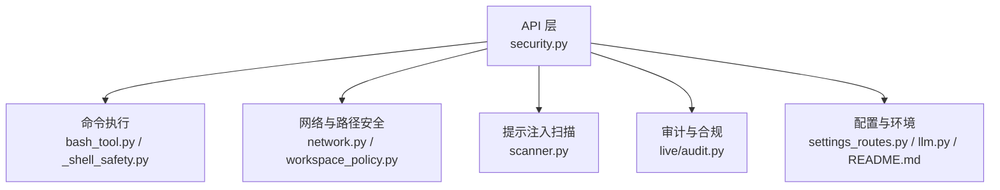
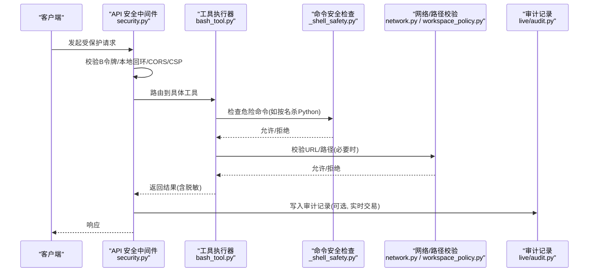
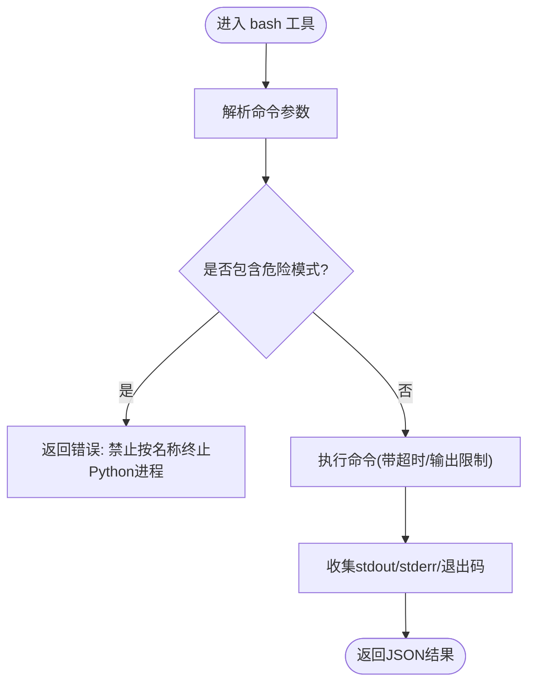
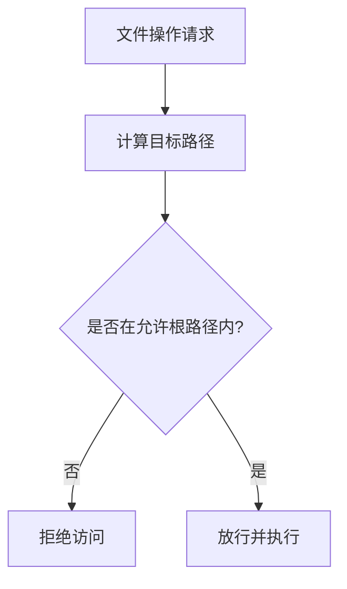
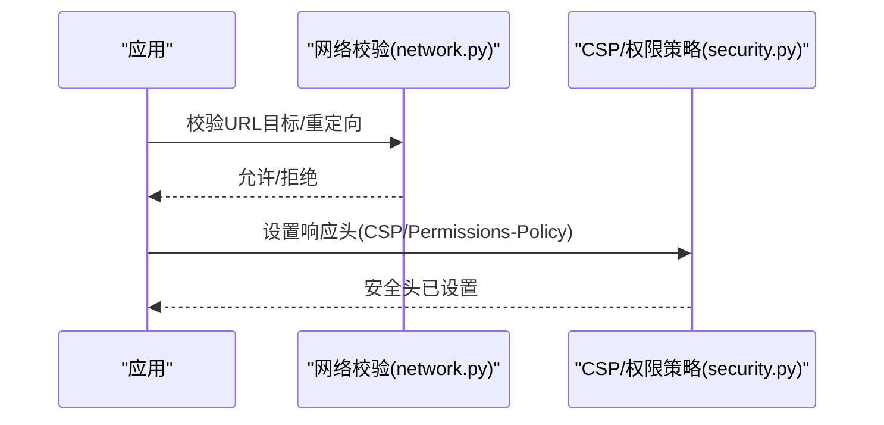
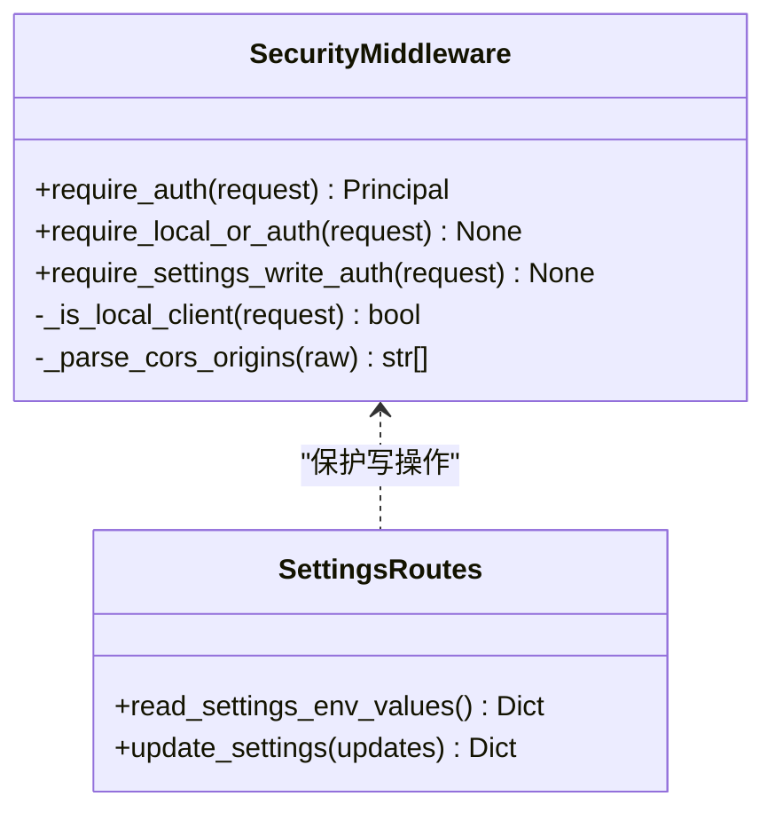
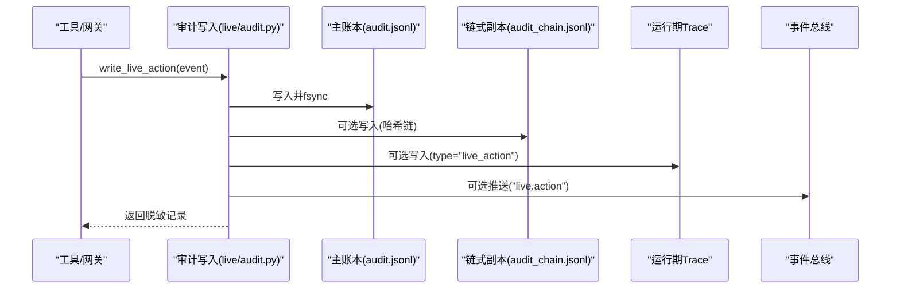
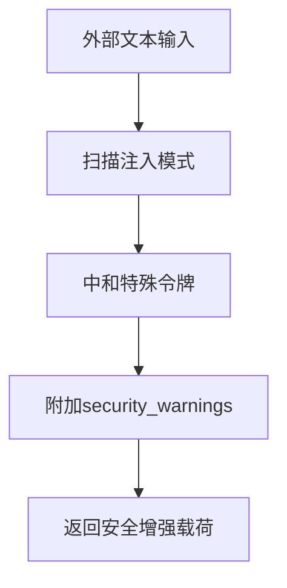
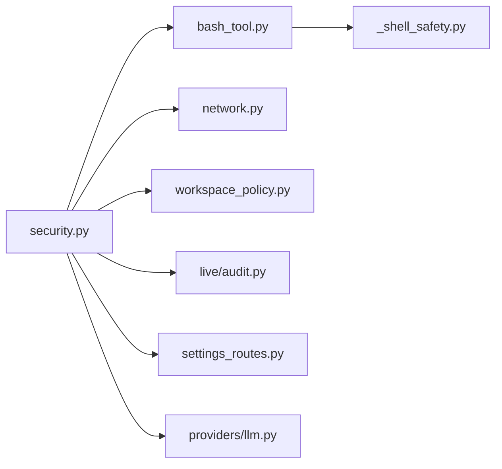

# 工具安全控制

<cite>
**本文引用的文件**
- [agent/src/tools/_shell_safety.py](file://agent/src/tools/_shell_safety.py)
- [agent/src/tools/bash_tool.py](file://agent/src/tools/bash_tool.py)
- [agent/src/api/security.py](file://agent/src/api/security.py)
- [agent/src/live/audit.py](file://agent/src/live/audit.py)
- [agent/src/security/scanner.py](file://agent/src/security/scanner.py)
- [agent/src/security/network.py](file://agent/src/security/network.py)
- [agent/src/security/workspace_policy.py](file://agent/src/security/workspace_policy.py)
- [agent/src/providers/llm.py](file://agent/src/providers/llm.py)
- [agent/src/api/settings_routes.py](file://agent/src/api/settings_routes.py)
- [frontend/src/types/agent.ts](file://frontend/src/types/agent.ts)
- [README.md](file://README.md)
</cite>

## 目录
1. [简介](#简介)
2. [项目结构](#项目结构)
3. [核心组件](#核心组件)
4. [架构总览](#架构总览)
5. [详细组件分析](#详细组件分析)
6. [依赖关系分析](#依赖关系分析)
7. [性能考量](#性能考量)
8. [故障排查指南](#故障排查指南)
9. [结论](#结论)
10. [附录](#附录)

## 简介
本文件系统性说明工具系统的安全控制机制，覆盖沙箱执行环境、命令执行限制、文件系统访问控制、网络请求过滤、权限与角色、审计日志、安全配置与最佳实践，以及常见安全风险与防护措施。目标是帮助开发者与运维人员理解并正确配置该系统的“默认拒绝”式安全边界，确保在远程部署、多租户或自动化场景中实现最小权限、可审计与可恢复的运行保障。

## 项目结构
围绕安全控制的代码主要分布在以下模块：
- 沙箱与命令执行：bash 工具与共享安全检查
- API 鉴权与安全头：CORS、本地回环主机校验、CSP、权限策略
- 网络与路径安全：URL 目标校验、工作区路径白名单
- 提示注入扫描：外部内容扫描与特殊令牌中和
- 实时交易审计：不可变审计账本、脱敏与链式防篡改副本
- 配置与环境变量：API 密钥、代理、额外 CORS、沙箱资源限制等

**图表来源**
- [agent/src/api/security.py:1-200](file://agent/src/api/security.py#L1-L200)
- [agent/src/tools/bash_tool.py:1-52](file://agent/src/tools/bash_tool.py#L1-L52)
- [agent/src/tools/_shell_safety.py:1-60](file://agent/src/tools/_shell_safety.py#L1-L60)
- [agent/src/security/network.py:1-11](file://agent/src/security/network.py#L1-L11)
- [agent/src/security/workspace_policy.py:1-12](file://agent/src/security/workspace_policy.py#L1-L12)
- [agent/src/security/scanner.py:1-264](file://agent/src/security/scanner.py#L1-L264)
- [agent/src/live/audit.py:1-352](file://agent/src/live/audit.py#L1-L352)
- [agent/src/api/settings_routes.py:202-473](file://agent/src/api/settings_routes.py#L202-L473)
- [agent/src/providers/llm.py:757-786](file://agent/src/providers/llm.py#L757-L786)
- [README.md:728-746](file://README.md#L728-L746)

**章节来源**
- [agent/src/api/security.py:1-200](file://agent/src/api/security.py#L1-L200)
- [agent/src/tools/bash_tool.py:1-52](file://agent/src/tools/bash_tool.py#L1-L52)
- [agent/src/tools/_shell_safety.py:1-60](file://agent/src/tools/_shell_safety.py#L1-L60)
- [agent/src/security/network.py:1-11](file://agent/src/security/network.py#L1-L11)
- [agent/src/security/workspace_policy.py:1-12](file://agent/src/security/workspace_policy.py#L1-L12)
- [agent/src/security/scanner.py:1-264](file://agent/src/security/scanner.py#L1-L264)
- [agent/src/live/audit.py:1-352](file://agent/src/live/audit.py#L1-L352)
- [agent/src/api/settings_routes.py:202-473](file://agent/src/api/settings_routes.py#L202-L473)
- [agent/src/providers/llm.py:757-786](file://agent/src/providers/llm.py#L757-L786)
- [README.md:728-746](file://README.md#L728-L746)

## 核心组件
- 沙箱与命令执行限制：通过 bash 工具调用 shell，并在进入前进行危险命令检测（如按名称终止 Python 进程），避免误杀宿主进程；输出长度限制与超时保护降低资源耗尽风险。
- 文件系统访问控制：工作区路径白名单与“路径必须在根下”的约束，防止越权读取/写入。
- 网络请求过滤：对 URL 目标与解析后的地址进行校验，阻断重定向到不受信任主机；结合 CORS 与 CSP 限制浏览器侧攻击面。
- 权限与认证：基于 Bearer Token 的 require_auth 依赖，支持本地回环放宽策略；设置写操作需显式授权；环境变量开关控制是否暴露 shell 工具。
- 审计日志：实时交易动作记录到不可变审计账本，自动脱敏敏感字段，可选链式哈希防篡改；同时写入运行期 Trace 与事件总线。
- 提示注入防护：对外部内容进行模式匹配与特殊令牌中和，附加安全警告元数据，供下游消费。
- 配置与环境：集中管理 API 密钥、代理、CORS、沙箱内存限制等，提供安全默认值与回滚开关。

**章节来源**
- [agent/src/tools/bash_tool.py:1-52](file://agent/src/tools/bash_tool.py#L1-L52)
- [agent/src/tools/_shell_safety.py:1-60](file://agent/src/tools/_shell_safety.py#L1-L60)
- [agent/src/security/network.py:1-11](file://agent/src/security/network.py#L1-L11)
- [agent/src/security/workspace_policy.py:1-12](file://agent/src/security/workspace_policy.py#L1-L12)
- [agent/src/api/security.py:561-669](file://agent/src/api/security.py#L561-L669)
- [agent/src/live/audit.py:1-352](file://agent/src/live/audit.py#L1-L352)
- [agent/src/security/scanner.py:1-264](file://agent/src/security/scanner.py#L1-L264)
- [agent/src/api/settings_routes.py:202-473](file://agent/src/api/settings_routes.py#L202-L473)
- [agent/src/providers/llm.py:757-786](file://agent/src/providers/llm.py#L757-L786)
- [README.md:728-746](file://README.md#L728-L746)

## 架构总览
下图展示从 API 入口到工具执行、安全校验、审计记录的完整链路。

**图表来源**
- [agent/src/api/security.py:166-200](file://agent/src/api/security.py#L166-L200)
- [agent/src/tools/bash_tool.py:36-52](file://agent/src/tools/bash_tool.py#L36-L52)
- [agent/src/tools/_shell_safety.py:38-60](file://agent/src/tools/_shell_safety.py#L38-L60)
- [agent/src/security/network.py:1-11](file://agent/src/security/network.py#L1-L11)
- [agent/src/security/workspace_policy.py:1-12](file://agent/src/security/workspace_policy.py#L1-L12)
- [agent/src/live/audit.py:248-352](file://agent/src/live/audit.py#L248-L352)

## 详细组件分析

### 沙箱执行环境与命令执行限制
- 命令执行入口：bash 工具以受限方式执行 shell 命令，限制输出大小与超时，避免资源耗尽。
- 危险命令拦截：统一安全检查模块识别跨平台按名称终止 Python 进程的模式（taskkill、pkill/killall、PowerShell stop-process 等），直接拒绝并返回明确错误信息，防止误杀宿主进程。
- 执行上下文：支持指定工作目录（run_dir），配合路径白名单限制文件系统访问范围。

**图表来源**
- [agent/src/tools/bash_tool.py:36-52](file://agent/src/tools/bash_tool.py#L36-L52)
- [agent/src/tools/_shell_safety.py:38-60](file://agent/src/tools/_shell_safety.py#L38-L60)

**章节来源**
- [agent/src/tools/bash_tool.py:1-52](file://agent/src/tools/bash_tool.py#L1-L52)
- [agent/src/tools/_shell_safety.py:1-60](file://agent/src/tools/_shell_safety.py#L1-L60)

### 文件系统访问控制
- 工作区路径约束：通过“路径必须在根目录下”的校验函数，确保工具仅能访问允许的根路径集合，防止越权读写。
- 白名单扩展：可通过环境变量追加额外的允许根路径，用于文档导入或生成代码运行目录。

**图表来源**
- [agent/src/security/workspace_policy.py:1-12](file://agent/src/security/workspace_policy.py#L1-L12)
- [README.md:728-746](file://README.md#L728-L746)

**章节来源**
- [agent/src/security/workspace_policy.py:1-12](file://agent/src/security/workspace_policy.py#L1-L12)
- [README.md:728-746](file://README.md#L728-L746)

### 网络请求过滤
- URL 目标校验：对传入的媒体或链接目标进行合法性检查，阻止重定向到不受信任的主机。
- CORS 与 CSP：默认仅允许本地开发源；禁止 credentialed CORS 使用通配符；严格的内容安全策略限制脚本与框架加载，减少 XSS 与点击劫持风险。
- 本地回环 Host 校验：防止 DNS 重绑定绕过本地认证。

**图表来源**
- [agent/src/security/network.py:1-11](file://agent/src/security/network.py#L1-L11)
- [agent/src/api/security.py:166-200](file://agent/src/api/security.py#L166-L200)

**章节来源**
- [agent/src/security/network.py:1-11](file://agent/src/security/network.py#L1-L11)
- [agent/src/api/security.py:166-200](file://agent/src/api/security.py#L166-L200)

### 权限管理与角色控制
- 认证依赖：require_auth 要求携带有效 Bearer Token；对于本地回环客户端，在未配置 API 密钥时可放宽访问。
- 设置写保护：修改敏感设置需要显式授权（API 密钥或本地回环）。
- Shell 工具开关：通过环境变量控制是否在远程 API/MCP-SSE 场景暴露 shell 能力，默认关闭。

**图表来源**
- [agent/src/api/security.py:561-669](file://agent/src/api/security.py#L561-L669)
- [agent/src/api/settings_routes.py:202-473](file://agent/src/api/settings_routes.py#L202-L473)
- [README.md:728-746](file://README.md#L728-L746)

**章节来源**
- [agent/src/api/security.py:561-669](file://agent/src/api/security.py#L561-L669)
- [agent/src/api/settings_routes.py:202-473](file://agent/src/api/settings_routes.py#L202-L473)
- [README.md:728-746](file://README.md#L728-L746)

### 工具调用的审计日志
- 审计记录：每次关键动作（如下单、取消、指令提交、违规、停机开关触发）都会写入不可变的审计账本，字段包含会话ID、意图、网关决策、请求/响应（已脱敏）、时间戳等。
- 三路落盘：主账本（append-only + fsync）、可选链式哈希副本（防篡改）、可选运行期 Trace 与事件总线通知。
- 前端追踪：工具调用状态、进度、耗时等在前端类型中定义，便于可视化与排障。

**图表来源**
- [agent/src/live/audit.py:248-352](file://agent/src/live/audit.py#L248-L352)
- [frontend/src/types/agent.ts:60-81](file://frontend/src/types/agent.ts#L60-L81)

**章节来源**
- [agent/src/live/audit.py:1-352](file://agent/src/live/audit.py#L1-L352)
- [frontend/src/types/agent.ts:60-81](file://frontend/src/types/agent.ts#L60-L81)

### 提示注入与外部内容安全
- 模式扫描：对网页、文档、搜索结果中的文本进行提示注入模式匹配，标注严重级别与匹配片段。
- 特殊令牌中和：将聊天模板控制标记插入零宽空格，破坏 tokenizer 的特殊词表匹配，防止伪造角色边界。
- 安全警告：在工具返回的 JSON 信封中添加 security_warnings 列表，供下游消费与告警。

**图表来源**
- [agent/src/security/scanner.py:1-264](file://agent/src/security/scanner.py#L1-L264)

**章节来源**
- [agent/src/security/scanner.py:1-264](file://agent/src/security/scanner.py#L1-L264)

## 依赖关系分析
- 低耦合高内聚：安全中间件、工具执行器、审计模块职责清晰，通过协议与数据结构交互。
- 外部依赖：FastAPI 安全组件、HTTP 客户端、文件系统与日志库。
- 潜在循环：审计模块不反向依赖工具执行器，避免循环引用；网络与路径校验被多处复用。

**图表来源**
- [agent/src/api/security.py:1-200](file://agent/src/api/security.py#L1-L200)
- [agent/src/tools/bash_tool.py:1-52](file://agent/src/tools/bash_tool.py#L1-L52)
- [agent/src/tools/_shell_safety.py:1-60](file://agent/src/tools/_shell_safety.py#L1-L60)
- [agent/src/security/network.py:1-11](file://agent/src/security/network.py#L1-L11)
- [agent/src/security/workspace_policy.py:1-12](file://agent/src/security/workspace_policy.py#L1-L12)
- [agent/src/live/audit.py:1-352](file://agent/src/live/audit.py#L1-L352)
- [agent/src/api/settings_routes.py:202-473](file://agent/src/api/settings_routes.py#L202-L473)
- [agent/src/providers/llm.py:757-786](file://agent/src/providers/llm.py#L757-L786)

**章节来源**
- [agent/src/api/security.py:1-200](file://agent/src/api/security.py#L1-L200)
- [agent/src/tools/bash_tool.py:1-52](file://agent/src/tools/bash_tool.py#L1-L52)
- [agent/src/tools/_shell_safety.py:1-60](file://agent/src/tools/_shell_safety.py#L1-L60)
- [agent/src/security/network.py:1-11](file://agent/src/security/network.py#L1-L11)
- [agent/src/security/workspace_policy.py:1-12](file://agent/src/security/workspace_policy.py#L1-L12)
- [agent/src/live/audit.py:1-352](file://agent/src/live/audit.py#L1-L352)
- [agent/src/api/settings_routes.py:202-473](file://agent/src/api/settings_routes.py#L202-L473)
- [agent/src/providers/llm.py:757-786](file://agent/src/providers/llm.py#L757-L786)

## 性能考量
- 命令执行：设置合理的超时与输出上限，避免长时任务阻塞与内存膨胀。
- 审计写入：主账本 append-only 且 fsync，保证持久性但可能带来 I/O 开销；链式副本失败不影响主账本，确保业务可用性。
- 网络校验：URL 与重定向校验为轻量级正则与域名比对，影响较小。
- 提示注入扫描：保守的正则匹配与字符串替换，建议在批量处理时注意吞吐与延迟。

[本节为通用指导，无需特定文件来源]

## 故障排查指南
- 无法访问设置接口：确认是否配置了 API_AUTH_KEY 或来自本地回环；检查 require_settings_write_auth 的鉴权逻辑。
- Shell 工具被拒绝：检查命令是否命中“按名称终止 Python”的危险模式；如需后台任务请使用 background_run 的 cancel_background。
- 审计记录缺失：确认 live/audit.py 的写入路径存在且可写；查看 fsync 失败日志降级为 flush-only 的情况。
- 网络请求被拒：检查 URL 目标与重定向是否落在允许主机列表；核对 CORS 与 CSP 策略是否过严。
- 提示注入告警过多：审查 scanner.py 的规则与匹配片段，必要时调整阈值或白名单。

**章节来源**
- [agent/src/api/security.py:625-669](file://agent/src/api/security.py#L625-L669)
- [agent/src/tools/_shell_safety.py:38-60](file://agent/src/tools/_shell_safety.py#L38-L60)
- [agent/src/live/audit.py:80-97](file://agent/src/live/audit.py#L80-L97)
- [agent/src/security/scanner.py:145-174](file://agent/src/security/scanner.py#L145-L174)

## 结论
该系统采用“默认拒绝”的安全模型：严格的命令执行限制、路径与网络白名单、强化的浏览器安全头、显式的认证与写保护、不可变审计与可选防篡改链，以及对外部内容的提示注入防护。通过合理的环境变量与策略配置，可在不同部署环境下平衡安全性与可用性，确保工具调用过程可控、可观测、可追溯。

[本节为总结，无需特定文件来源]

## 附录

### 安全配置指南
- 环境变量建议
  - API 鉴权：在生产环境启用 API_AUTH_KEY，限制非本地访问。
  - Shell 工具：仅在可信环境中开启 VIBE_TRADING_ENABLE_SHELL_TOOLS。
  - 文件根白名单：通过 VIBE_TRADING_ALLOWED_FILE_ROOTS 与 VIBE_TRADING_ALLOWED_RUN_ROOTS 限定访问范围。
  - 额外 CORS：谨慎添加 VIBE_TRADING_EXTRA_CORS_ORIGINS，避免通配符。
  - CSP 回滚：VIBE_TRADING_CSP_REPORT_ONLY=1 可切换为报告模式以便调试。
  - 沙箱内存限制：VIBE_TRADING_SANDBOX_RLIMIT_AS_MB 控制进程虚拟内存上限。
- 访问策略
  - 本地回环放宽：未配置 API 密钥时允许本地回环访问设置接口；写操作仍需显式授权。
  - 主机白名单：通过 api_allowed_hosts 扩展可信 Host，防御 DNS 重绑定。
- 最佳实践
  - 最小权限：仅启用必要的工具与 MCP 服务器能力，禁用通配符 enabledTools。
  - 审计优先：保持审计账本可写且 fsync，定期校验链式副本完整性。
  - 外部内容：始终对 web_reader/doc_reader/web_search 的结果进行安全扫描与中和。

**章节来源**
- [README.md:728-746](file://README.md#L728-L746)
- [agent/src/api/security.py:30-116](file://agent/src/api/security.py#L30-L116)
- [agent/src/api/security.py:180-200](file://agent/src/api/security.py#L180-L200)
- [agent/src/api/settings_routes.py:202-473](file://agent/src/api/settings_routes.py#L202-L473)
- [agent/src/providers/llm.py:757-786](file://agent/src/providers/llm.py#L757-L786)

### 常见安全风险与防护措施
- 注入攻击防护
  - 命令注入：通过 _shell_safety.py 的危险模式匹配拒绝高风险命令。
  - 提示注入：scanner.py 的模式匹配与特殊令牌中和，附加安全警告。
- 资源耗尽防护
  - 命令执行：限制输出大小与超时；沙箱内存限制通过环境变量控制。
  - 网络请求：URL 目标与重定向校验，避免恶意跳转。
- 数据泄露防护
  - 审计脱敏：所有请求/响应在写入审计前进行脱敏，避免 OAuth token、账号等敏感信息外泄。
  - 前端存储：安全封装 localStorage 访问，避免受限环境下的异常。

**章节来源**
- [agent/src/tools/_shell_safety.py:38-60](file://agent/src/tools/_shell_safety.py#L38-L60)
- [agent/src/security/scanner.py:145-220](file://agent/src/security/scanner.py#L145-L220)
- [agent/src/live/audit.py:217-246](file://agent/src/live/audit.py#L217-L246)
- [frontend/src/types/agent.ts:60-81](file://frontend/src/types/agent.ts#L60-L81)