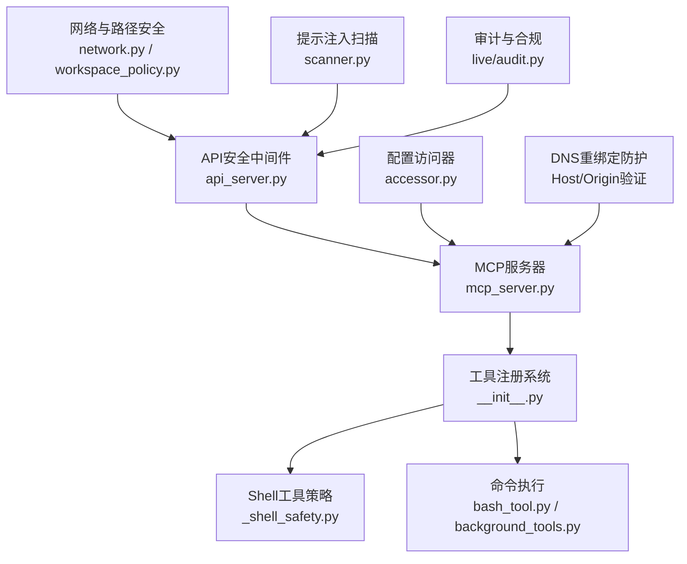
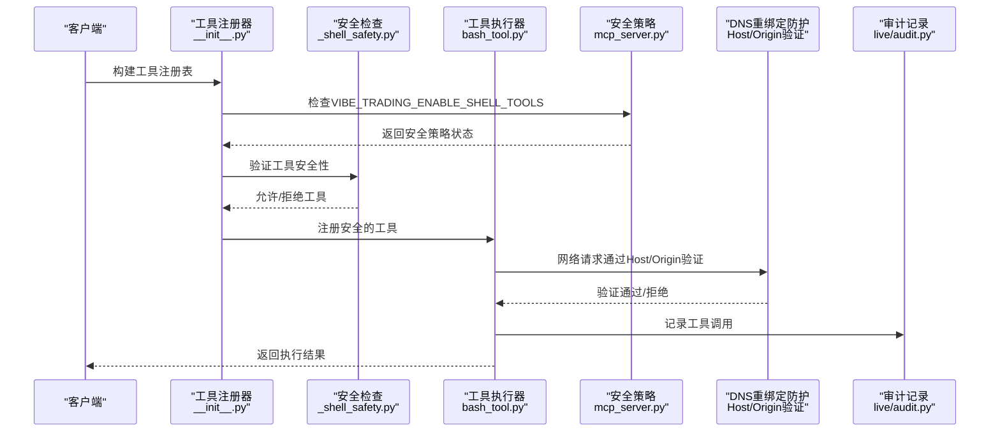
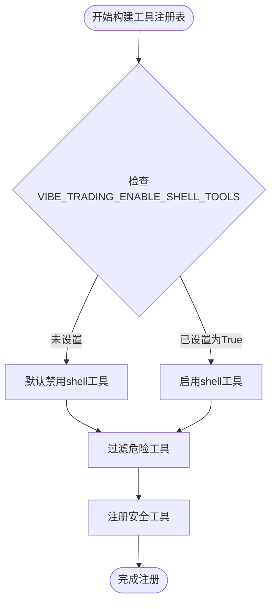
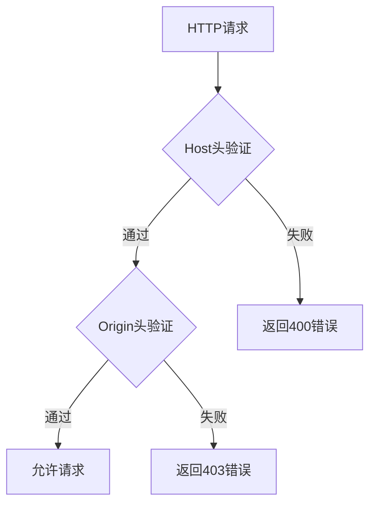
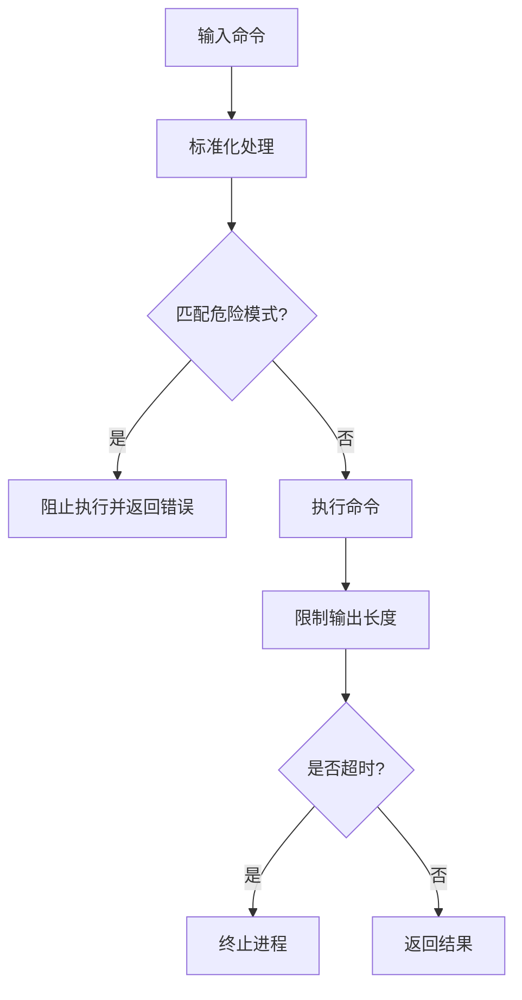
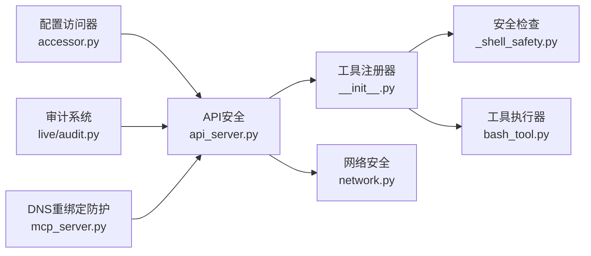

# 工具安全控制

<cite>
**本文引用的文件**
- [agent/src/tools/__init__.py](file://agent/src/tools/__init__.py)
- [agent/src/tools/_shell_safety.py](file://agent/src/tools/_shell_safety.py)
- [agent/src/tools/bash_tool.py](file://agent/src/tools/bash_tool.py)
- [agent/src/tools/background_tools.py](file://agent/src/tools/background_tools.py)
- [agent/mcp_server.py](file://agent/mcp_server.py)
- [agent/api_server.py](file://agent/api_server.py)
- [agent/src/security/network.py](file://agent/src/security/network.py)
- [agent/src/security/workspace_policy.py](file://agent/src/security/workspace_policy.py)
- [agent/src/security/scanner.py](file://agent/src/security/scanner.py)
- [agent/src/live/audit.py](file://agent/src/live/audit.py)
- [agent/src/config/accessor.py](file://agent/src/config/accessor.py)
- [agent/src/config/env_schema.py](file://agent/src/config/env_schema.py)
- [agent/tests/test_tool_registry_security.py](file://agent/tests/test_tool_registry_security.py)
- [agent/tests/test_mcp_host_origin_guard.py](file://agent/tests/test_mcp_host_origin_guard.py)
- [README.md](file://README.md)
</cite>

## 更新摘要
**变更内容**
- 新增了VIBE_TRADING_ENABLE_SHELL_TOOLS环境变量配置，实现shell工具的显式启用机制
- 增强了MCP服务器的DNS重绑定攻击防护，添加了Host和Origin验证中间件
- 完善了网络传输的安全中间件系统，包括HostGuardMiddleware和OriginGuardMiddleware
- 强化了工具注册系统的默认拒绝策略，shell工具默认禁用
- 更新了安全配置指南，包含新的环境变量和访问策略配置

## 目录
1. [简介](#简介)
2. [项目结构](#项目结构)
3. [核心组件](#核心组件)
4. [架构总览](#架构总览)
5. [详细组件分析](#详细组件分析)
6. [依赖关系分析](#依赖关系分析)
7. [性能考量](#性能考量)
8. [故障排查指南](#故障排查指南)
9. [结论](#结论)
10. [附录](#附录)

## 简介
本文件系统性说明工具系统的安全控制机制，覆盖沙箱执行环境、命令执行限制、文件系统访问控制、网络请求过滤、权限与角色、审计日志、安全配置与最佳实践，以及常见安全风险与防护措施。目标是帮助开发者与运维人员理解并正确配置该系统的"默认拒绝"式安全边界，确保在远程部署、多租户或自动化场景中实现最小权限、可审计与可恢复的运行保障。

**更新** 本次更新重点强化了工具注册系统的安全控制，特别是shell工具的默认禁用策略和显式启用机制，同时新增了DNS重绑定攻击防护和Host/Origin验证系统。

## 项目结构
围绕安全控制的代码主要分布在以下模块：
- 工具注册与安全过滤：工具自动发现、shell工具策略控制、内置安全检查
- 沙箱与命令执行：bash工具与共享安全检查
- API鉴权与安全头：CORS、本地回环主机校验、CSP、权限策略
- 网络与路径安全：URL目标校验、工作区路径白名单、DNS重绑定防护
- 提示注入扫描：外部内容扫描与特殊令牌中和
- 实时交易审计：不可变审计账本、脱敏与链式防篡改副本
- 配置与环境变量：API密钥、代理、额外CORS、沙箱资源限制等

**图表来源**
- [agent/src/tools/__init__.py:66-153](file://agent/src/tools/__init__.py#L66-L153)
- [agent/src/tools/_shell_safety.py:1-60](file://agent/src/tools/_shell_safety.py#L1-L60)
- [agent/src/tools/bash_tool.py:1-52](file://agent/src/tools/bash_tool.py#L1-L52)
- [agent/src/tools/background_tools.py:322-376](file://agent/src/tools/background_tools.py#L322-L376)
- [agent/mcp_server.py:93-127](file://agent/mcp_server.py#L93-L127)
- [agent/api_server.py:35-71](file://agent/api_server.py#L35-L71)
- [agent/src/security/network.py:1-11](file://agent/src/security/network.py#L1-L11)
- [agent/src/security/workspace_policy.py:1-12](file://agent/src/security/workspace_policy.py#L1-L12)
- [agent/src/security/scanner.py:1-264](file://agent/src/security/scanner.py#L1-L264)
- [agent/src/live/audit.py:1-352](file://agent/src/live/audit.py#L1-L352)
- [agent/src/config/accessor.py:52-76](file://agent/src/config/accessor.py#L52-L76)

**章节来源**
- [agent/src/tools/__init__.py:66-153](file://agent/src/tools/__init__.py#L66-L153)
- [agent/src/tools/_shell_safety.py:1-60](file://agent/src/tools/_shell_safety.py#L1-L60)
- [agent/src/tools/bash_tool.py:1-52](file://agent/src/tools/bash_tool.py#L1-L52)
- [agent/src/tools/background_tools.py:322-376](file://agent/src/tools/background_tools.py#L322-L376)
- [agent/mcp_server.py:93-127](file://agent/mcp_server.py#L93-L127)
- [agent/api_server.py:35-71](file://agent/api_server.py#L35-L71)
- [agent/src/security/network.py:1-11](file://agent/src/security/network.py#L1-L11)
- [agent/src/security/workspace_policy.py:1-12](file://agent/src/security/workspace_policy.py#L1-L12)
- [agent/src/security/scanner.py:1-264](file://agent/src/security/scanner.py#L1-L264)
- [agent/src/live/audit.py:1-352](file://agent/src/live/audit.py#L1-L352)
- [agent/src/config/accessor.py:52-76](file://agent/src/config/accessor.py#L52-L76)

## 核心组件
- **工具注册系统**：通过自动发现机制注册工具，支持基于策略的工具过滤和安全控制
- **Shell工具安全策略**：默认禁用shell工具，需要显式通过`VIBE_TRADING_ENABLE_SHELL_TOOLS`环境变量或命令行参数启用
- **内置安全过滤器**：包含进程终止防护、命令注入检测、输出长度限制等多层安全防护
- **沙箱执行环境**：受限的shell命令执行环境，支持工作目录隔离和资源限制
- **文件系统访问控制**：工作区路径白名单与"路径必须在根下"的约束
- **网络请求过滤**：URL目标校验、重定向防护、CORS与CSP安全头设置
- **DNS重绑定攻击防护**：Host和Origin验证中间件，防止恶意浏览器页面通过DNS重绑定访问本地MCP端点
- **权限管理与认证**：基于Bearer Token的认证机制，支持本地回环放宽策略
- **审计日志**：实时交易动作记录到不可变审计账本，自动脱敏敏感字段
- **提示注入防护**：对外部内容进行模式匹配与特殊令牌中和

**更新** 新增了DNS重绑定攻击防护和Host/Origin验证系统，强调了shell工具的默认禁用策略和显式启用要求。

**章节来源**
- [agent/src/tools/__init__.py:66-153](file://agent/src/tools/__init__.py#L66-L153)
- [agent/src/tools/_shell_safety.py:31-59](file://agent/src/tools/_shell_safety.py#L31-L59)
- [agent/src/tools/bash_tool.py:16-52](file://agent/src/tools/bash_tool.py#L16-L52)
- [agent/src/tools/background_tools.py:322-376](file://agent/src/tools/background_tools.py#L322-L376)
- [agent/mcp_server.py:130-329](file://agent/mcp_server.py#L130-L329)
- [agent/src/security/network.py:1-11](file://agent/src/security/network.py#L1-L11)
- [agent/src/security/workspace_policy.py:1-12](file://agent/src/security/workspace_policy.py#L1-L12)
- [agent/src/security/scanner.py:1-264](file://agent/src/security/scanner.py#L1-L264)
- [agent/src/live/audit.py:1-352](file://agent/src/live/audit.py#L1-L352)

## 架构总览
下图展示从工具注册到安全执行的完整链路，突出显示默认拒绝的安全策略和DNS重绑定防护。

**图表来源**
- [agent/src/tools/__init__.py:66-153](file://agent/src/tools/__init__.py#L66-L153)
- [agent/src/tools/_shell_safety.py:38-59](file://agent/src/tools/_shell_safety.py#L38-L59)
- [agent/src/tools/bash_tool.py:36-52](file://agent/src/tools/bash_tool.py#L36-L52)
- [agent/mcp_server.py:130-329](file://agent/mcp_server.py#L130-L329)
- [agent/src/live/audit.py:248-352](file://agent/src/live/audit.py#L248-L352)

## 详细组件分析

### 工具注册系统与安全策略
- **默认拒绝策略**：shell工具（bash、background_run、cancel_background）默认不包含在工具注册表中
- **显式启用机制**：需要通过`include_shell_tools=True`参数或`VIBE_TRADING_ENABLE_SHELL_TOOLS`环境变量启用
- **策略检查点**：在工具发现阶段进行安全检查，阻止危险工具注册
- **MCP集成**：MCP服务器同样遵循默认拒绝策略，需要显式启用shell工具

**图表来源**
- [agent/src/tools/__init__.py:136-140](file://agent/src/tools/__init__.py#L136-L140)
- [agent/mcp_server.py:93-127](file://agent/mcp_server.py#L93-L127)

**更新** 新增了VIBE_TRADING_ENABLE_SHELL_TOOLS环境变量的详细说明，强调默认拒绝原则和显式启用要求。

**章节来源**
- [agent/src/tools/__init__.py:66-153](file://agent/src/tools/__init__.py#L66-L153)
- [agent/mcp_server.py:93-127](file://agent/mcp_server.py#L93-L127)
- [agent/tests/test_tool_registry_security.py:10-27](file://agent/tests/test_tool_registry_security.py#L10-L27)

### DNS重绑定攻击防护
- **Host验证中间件**：`_HostGuardMiddleware`验证HTTP请求的Host头，只允许可信主机列表中的主机
- **Origin验证中间件**：`_OriginGuardMiddleware`验证跨域请求的Origin头，防止恶意浏览器页面访问本地MCP端点
- **默认信任列表**：默认仅信任本地回环地址（127.0.0.1、::1、localhost），可通过`VIBE_TRADING_MCP_ALLOWED_HOSTS`环境变量扩展
- **IPv6支持**：正确处理IPv6地址格式，包括带方括号的表示法
- **大小写不敏感**：主机名比较时忽略大小写差异

**图表来源**
- [agent/mcp_server.py:229-286](file://agent/mcp_server.py#L229-L286)

**更新** 新增了完整的DNS重绑定攻击防护机制说明，包括Host和Origin验证中间件的实现细节。

**章节来源**
- [agent/mcp_server.py:130-329](file://agent/mcp_server.py#L130-L329)
- [agent/tests/test_mcp_host_origin_guard.py:1-218](file://agent/tests/test_mcp_host_origin_guard.py#L1-L218)

### 内置安全过滤器
- **进程终止防护**：检测并阻止跨平台的Python进程终止命令（taskkill、pkill、killall、PowerShell stop-process）
- **命令注入检测**：识别潜在的命令注入攻击模式
- **输出长度限制**：限制命令输出大小，防止内存耗尽攻击
- **超时保护**：设置合理的执行超时时间，避免长时间阻塞

**图表来源**
- [agent/src/tools/_shell_safety.py:7-35](file://agent/src/tools/_shell_safety.py#L7-L35)
- [agent/src/tools/bash_tool.py:12-13](file://agent/src/tools/bash_tool.py#L12-L13)

**更新** 增强了内置安全过滤器的详细说明，包括具体的防护机制。

**章节来源**
- [agent/src/tools/_shell_safety.py:1-60](file://agent/src/tools/_shell_safety.py#L1-L60)
- [agent/src/tools/bash_tool.py:12-52](file://agent/src/tools/bash_tool.py#L12-L52)

### 沙箱执行环境与命令执行限制
- **受限执行环境**：bash工具以受限方式执行shell命令，限制输出大小与超时
- **工作目录隔离**：支持指定工作目录（run_dir），配合路径白名单限制文件系统访问范围
- **进程管理**：background_run工具提供受控的后台进程管理，替代直接的系统进程操作
- **安全退出机制**：通过cancel_background工具安全地终止后台任务

**更新** 强调了沙箱环境的隔离性和进程管理的受控性。

**章节来源**
- [agent/src/tools/bash_tool.py:16-52](file://agent/src/tools/bash_tool.py#L16-L52)
- [agent/src/tools/background_tools.py:322-376](file://agent/src/tools/background_tools.py#L322-L376)

### 文件系统访问控制
- **工作区路径约束**：通过"路径必须在根目录下"的校验函数，确保工具仅能访问允许的根路径集合
- **白名单扩展**：可通过环境变量追加额外的允许根路径，用于文档导入或生成代码运行目录
- **路径规范化**：对相对路径进行解析和规范化，防止路径遍历攻击

**章节来源**
- [agent/src/security/workspace_policy.py:1-12](file://agent/src/security/workspace_policy.py#L1-L12)
- [README.md:742-743](file://README.md#L742-L743)

### 网络请求过滤
- **URL目标校验**：对传入的媒体或链接目标进行合法性检查，阻止重定向到不受信任的主机
- **CORS与CSP**：默认仅允许本地开发源；禁止credentialed CORS使用通配符；严格的内容安全策略限制脚本与框架加载
- **本地回环Host校验**：防止DNS重绑定绕过本地认证

**章节来源**
- [agent/src/security/network.py:1-11](file://agent/src/security/network.py#L1-L11)
- [agent/api_server.py:35-71](file://agent/api_server.py#L35-L71)

### 权限管理与角色控制
- **认证依赖**：require_auth要求携带有效Bearer Token；对于本地回环客户端，在未配置API密钥时可放宽访问
- **设置写保护**：修改敏感设置需要显式授权（API密钥或本地回环）
- **Shell工具开关**：通过`VIBE_TRADING_ENABLE_SHELL_TOOLS`环境变量控制是否在远程API/MCP-SSE场景暴露shell能力，默认关闭

**更新** 明确了shell工具的默认禁用状态和显式启用要求。

**章节来源**
- [agent/api_server.py:35-71](file://agent/api_server.py#L35-L71)
- [agent/mcp_server.py:109-127](file://agent/mcp_server.py#L109-L127)
- [README.md:741](file://README.md#L741)

### 工具调用的审计日志
- **审计记录**：每次关键动作都会写入不可变的审计账本，字段包含会话ID、意图、网关决策、请求/响应（已脱敏）、时间戳等
- **三路落盘**：主账本（append-only + fsync）、可选链式哈希副本（防篡改）、可选运行期Trace与事件总线通知
- **前端追踪**：工具调用状态、进度、耗时等在前端类型中定义，便于可视化与排障

**章节来源**
- [agent/src/live/audit.py:248-352](file://agent/src/live/audit.py#L248-L352)

### 提示注入与外部内容安全
- **模式扫描**：对网页、文档、搜索结果中的文本进行提示注入模式匹配，标注严重级别与匹配片段
- **特殊令牌中和**：将聊天模板控制标记插入零宽空格，破坏tokenizer的特殊词表匹配，防止伪造角色边界
- **安全警告**：在工具返回的JSON信封中添加security_warnings列表，供下游消费与告警

**章节来源**
- [agent/src/security/scanner.py:1-264](file://agent/src/security/scanner.py#L1-L264)

## 依赖关系分析
- **低耦合高内聚**：工具注册器、安全检查模块、工具执行器职责清晰，通过协议与数据结构交互
- **安全优先设计**：所有工具注册都经过安全检查，默认拒绝潜在危险的shell工具
- **外部依赖**：FastAPI安全组件、HTTP客户端、文件系统与日志库
- **配置驱动**：通过环境变量和配置文件控制安全策略和行为

**图表来源**
- [agent/src/tools/__init__.py:66-153](file://agent/src/tools/__init__.py#L66-L153)
- [agent/src/tools/_shell_safety.py:1-60](file://agent/src/tools/_shell_safety.py#L1-L60)
- [agent/src/tools/bash_tool.py:1-52](file://agent/src/tools/bash_tool.py#L1-L52)
- [agent/api_server.py:35-71](file://agent/api_server.py#L35-L71)
- [agent/src/security/network.py:1-11](file://agent/src/security/network.py#L1-L11)
- [agent/src/config/accessor.py:52-76](file://agent/src/config/accessor.py#L52-L76)
- [agent/src/live/audit.py:1-352](file://agent/src/live/audit.py#L1-L352)
- [agent/mcp_server.py:130-329](file://agent/mcp_server.py#L130-L329)

**章节来源**
- [agent/src/tools/__init__.py:66-153](file://agent/src/tools/__init__.py#L66-L153)
- [agent/src/tools/_shell_safety.py:1-60](file://agent/src/tools/_shell_safety.py#L1-L60)
- [agent/src/tools/bash_tool.py:1-52](file://agent/src/tools/bash_tool.py#L1-L52)
- [agent/api_server.py:35-71](file://agent/api_server.py#L35-L71)
- [agent/src/security/network.py:1-11](file://agent/src/security/network.py#L1-L11)
- [agent/src/config/accessor.py:52-76](file://agent/src/config/accessor.py#L52-L76)
- [agent/src/live/audit.py:1-352](file://agent/src/live/audit.py#L1-L352)
- [agent/mcp_server.py:130-329](file://agent/mcp_server.py#L130-L329)

## 性能考量
- **工具注册缓存**：工具子类发现结果被缓存，避免重复扫描的性能开销
- **安全检查优化**：正则表达式模式预编译，提高命令安全检查效率
- **异步处理**：MCP服务器支持异步处理，提高并发处理能力
- **资源限制**：合理的超时设置和输出限制，防止资源耗尽
- **DNS重绑定防护**：Host和Origin验证在请求早期阶段进行，减少不必要的处理开销

## 故障排查指南
- **工具无法注册**：检查是否启用了`include_shell_tools`参数或设置了`VIBE_TRADING_ENABLE_SHELL_TOOLS`环境变量
- **Shell工具被拒绝**：确认命令是否命中"按名称终止Python"的危险模式；如需后台任务请使用background_run
- **MCP服务器启动失败**：检查是否正确配置了shell工具启用参数和环境变量
- **审计记录缺失**：确认live/audit.py的写入路径存在且可写；查看fsync失败日志降级为flush-only的情况
- **网络请求被拒**：检查URL目标与重定向是否落在允许主机列表；核对CORS与CSP策略是否过严
- **DNS重绑定防护问题**：检查`VIBE_TRADING_MCP_ALLOWED_HOSTS`环境变量配置，确认Host和Origin头是否符合预期

**更新** 新增了DNS重绑定防护相关的故障排查指导。

**章节来源**
- [agent/src/tools/__init__.py:136-140](file://agent/src/tools/__init__.py#L136-L140)
- [agent/src/tools/_shell_safety.py:38-59](file://agent/src/tools/_shell_safety.py#L38-L59)
- [agent/mcp_server.py:109-127](file://agent/mcp_server.py#L109-L127)
- [agent/src/live/audit.py:80-97](file://agent/src/live/audit.py#L80-L97)
- [agent/tests/test_mcp_host_origin_guard.py:160-171](file://agent/tests/test_mcp_host_origin_guard.py#L160-L171)

## 结论
该系统采用"默认拒绝"的安全模型：工具注册时默认禁用shell工具，严格的命令执行限制、路径与网络白名单、强化的浏览器安全头、显式的认证与写保护、不可变审计与可选防篡改链，以及对外部内容的提示注入防护。**新增的DNS重绑定攻击防护**通过Host和Origin验证中间件，有效防止恶意浏览器页面通过DNS重绑定技术访问本地MCP端点。通过合理的环境变量与策略配置，可在不同部署环境下平衡安全性与可用性，确保工具调用过程可控、可观测、可追溯。

**更新** 强调了DNS重绑定攻击防护的重要性和工具注册系统的安全策略。

## 附录

### 安全配置指南
- **环境变量建议**
  - API鉴权：在生产环境启用API_AUTH_KEY，限制非本地访问
  - Shell工具：仅在可信环境中开启`VIBE_TRADING_ENABLE_SHELL_TOOLS`
  - 文件根白名单：通过`VIBE_TRADING_ALLOWED_FILE_ROOTS`与`VIBE_TRADING_ALLOWED_RUN_ROOTS`限定访问范围
  - 额外CORS：谨慎添加`VIBE_TRADING_EXTRA_CORS_ORIGINS`，避免通配符
  - CSP回滚：`VIBE_TRADING_CSP_REPORT_ONLY=1`可切换为报告模式以便调试
  - 沙箱内存限制：`VIBE_TRADING_SANDBOX_RLIMIT_AS_MB`控制进程虚拟内存上限
  - **MCP主机白名单**：通过`VIBE_TRADING_MCP_ALLOWED_HOSTS`配置可信的Host和Origin列表，默认仅允许本地回环地址
- **访问策略**
  - 本地回环放宽：未配置API密钥时允许本地回环访问设置接口；写操作仍需显式授权
  - 主机白名单：通过api_allowed_hosts扩展可信Host，防御DNS重绑定
  - **DNS重绑定防护**：默认仅信任127.0.0.1、::1、localhost，生产环境应明确配置可信主机列表
- **最佳实践**
  - 最小权限：仅启用必要的工具与MCP服务器能力，禁用通配符enabledTools
  - 审计优先：保持审计账本可写且fsync，定期校验链式副本完整性
  - 外部内容：始终对web_reader/doc_reader/web_search的结果进行安全扫描与中和
  - **网络防护**：在网络传输模式下启用Host和Origin验证，防止DNS重绑定攻击

**更新** 新增了DNS重绑定防护相关的环境变量配置说明。

**章节来源**
- [README.md:741-746](file://README.md#L741-L746)
- [agent/mcp_server.py:109-127](file://agent/mcp_server.py#L109-L127)
- [agent/src/config/accessor.py:52-76](file://agent/src/config/accessor.py#L52-L76)
- [agent/src/config/env_schema.py:262-267](file://agent/src/config/env_schema.py#L262-L267)

### 常见安全风险与防护措施
- **注入攻击防护**
  - 命令注入：通过_shell_safety.py的危险模式匹配拒绝高风险命令
  - 提示注入：scanner.py的模式匹配与特殊令牌中和，附加安全警告
  - 进程注入：阻止跨平台的Python进程终止命令，防止误杀宿主进程
- **资源耗尽防护**
  - 命令执行：限制输出大小与超时；沙箱内存限制通过环境变量控制
  - 网络请求：URL目标与重定向校验，避免恶意跳转
  - 工具注册：默认禁用shell工具，减少攻击面
- **数据泄露防护**
  - 审计脱敏：所有请求/响应在写入审计前进行脱敏，避免OAuth token、账号等敏感信息外泄
  - 前端存储：安全封装localStorage访问，避免受限环境下的异常
- **DNS重绑定攻击防护**
  - **Host验证**：通过_HostGuardMiddleware验证HTTP请求的Host头，只允许可信主机
  - **Origin验证**：通过_OriginGuardMiddleware验证跨域请求的Origin头，防止恶意浏览器页面访问
  - **默认信任列表**：默认仅信任本地回环地址，生产环境应明确配置可信主机列表

**更新** 新增了DNS重绑定攻击防护的风险防护措施。

**章节来源**
- [agent/src/tools/_shell_safety.py:31-59](file://agent/src/tools/_shell_safety.py#L31-L59)
- [agent/src/security/scanner.py:145-220](file://agent/src/security/scanner.py#L145-L220)
- [agent/src/live/audit.py:217-246](file://agent/src/live/audit.py#L217-L246)
- [agent/src/tools/__init__.py:136-140](file://agent/src/tools/__init__.py#L136-L140)
- [agent/mcp_server.py:229-286](file://agent/mcp_server.py#L229-L286)