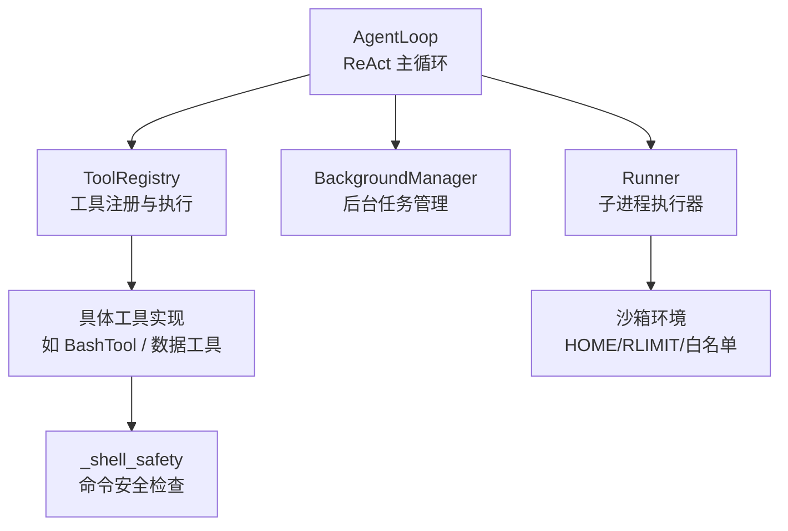
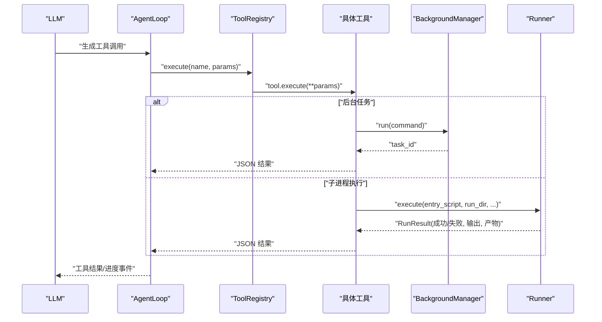
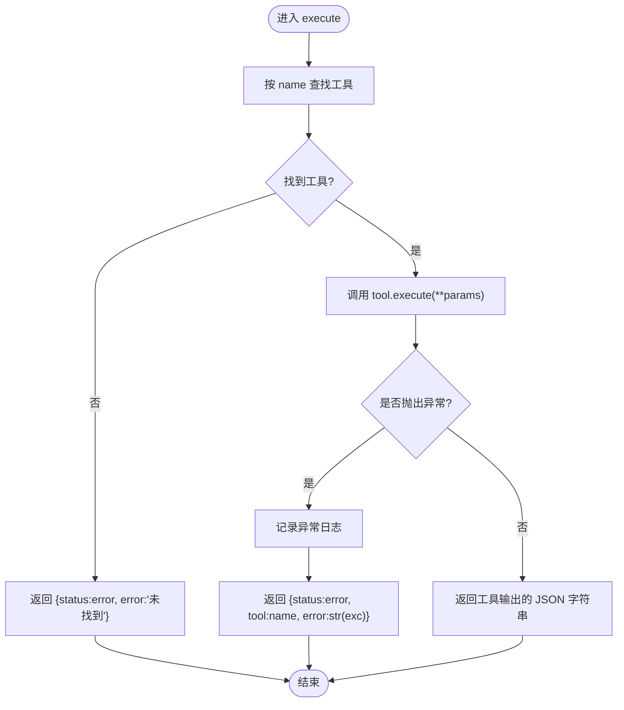
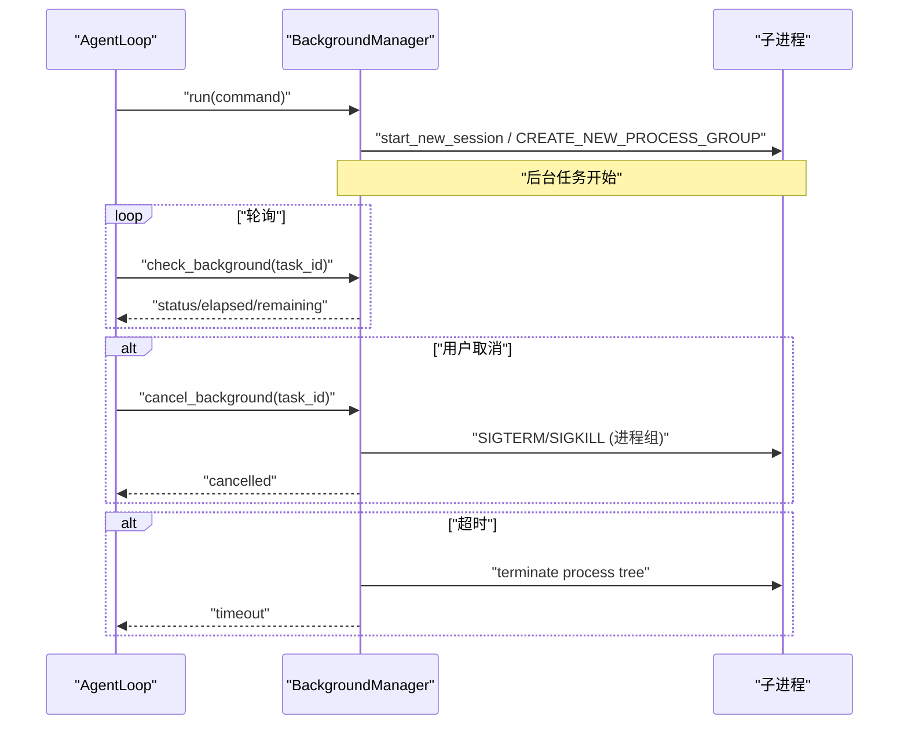
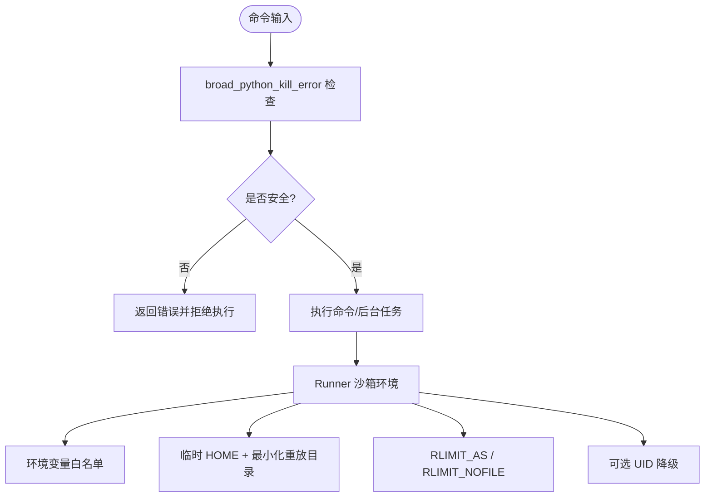
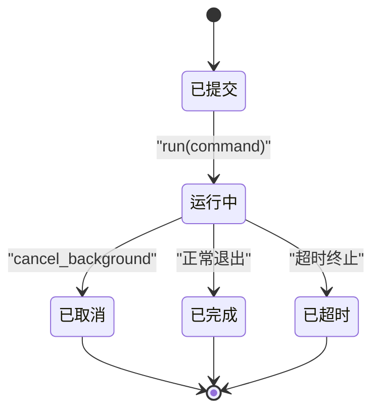
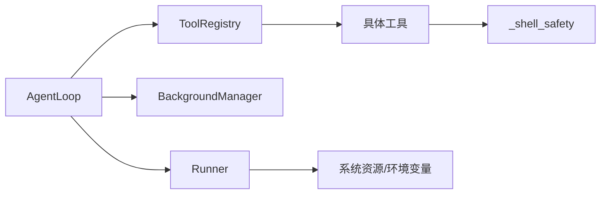

# 工具执行引擎

<cite>
**本文引用的文件**
- [agent/src/agent/tools.py](file://agent/src/agent/tools.py)
- [agent/src/agent/loop.py](file://agent/src/agent/loop.py)
- [agent/src/tools/_shell_safety.py](file://agent/src/tools/_shell_safety.py)
- [agent/src/tools/background_tools.py](file://agent/src/tools/background_tools.py)
- [agent/src/core/runner.py](file://agent/src/core/runner.py)
- [agent/tests/test_tool_timeout.py](file://agent/tests/test_tool_timeout.py)
- [agent/tests/test_runner_env.py](file://agent/tests/test_runner_env.py)
</cite>

## 目录
1. [简介](#简介)
2. [项目结构](#项目结构)
3. [核心组件](#核心组件)
4. [架构总览](#架构总览)
5. [详细组件分析](#详细组件分析)
6. [依赖关系分析](#依赖关系分析)
7. [性能与监控](#性能与监控)
8. [故障排除指南](#故障排除指南)
9. [结论](#结论)
10. [附录](#附录)

## 简介
本文件聚焦于“工具执行引擎”的核心能力，围绕 ToolRegistry.execute 的执行流程展开，覆盖工具查找、参数传递、异常处理与结果序列化；并说明异步执行、超时控制与错误重试机制；记录沙箱安全机制（命令执行限制与资源隔离）；解释性能监控、日志记录与调试支持；最后给出故障排除指南以及工具执行的生命周期管理与资源清理机制。

## 项目结构
工具执行引擎由以下关键模块组成：
- 工具注册与执行：ToolRegistry 提供工具注册、查询与统一执行入口，保证返回 JSON 字符串。
- Agent 循环：AgentLoop 负责 ReAct 主循环、上下文压缩、心跳、进度事件、工具调用编排与超时控制。
- 沙箱安全：_shell_safety.py 对危险命令进行静态检查，防止误杀 Python 进程。
- 后台任务：background_tools.py 提供后台进程组管理、超时终止、取消与状态查询。
- 子进程执行器：core/runner.py 在受限环境中运行生成的策略脚本，包含环境变量白名单、临时 HOME、资源限制等。

图表来源
- [agent/src/agent/loop.py:502-750](file://agent/src/agent/loop.py#L502-L750)
- [agent/src/agent/tools.py:54-84](file://agent/src/agent/tools.py#L54-L84)
- [agent/src/tools/background_tools.py:102-319](file://agent/src/tools/background_tools.py#L102-L319)
- [agent/src/core/runner.py:372-620](file://agent/src/core/runner.py#L372-L620)
- [agent/src/tools/_shell_safety.py:38-59](file://agent/src/tools/_shell_safety.py#L38-L59)

章节来源
- [agent/src/agent/tools.py:54-84](file://agent/src/agent/tools.py#L54-L84)
- [agent/src/agent/loop.py:502-750](file://agent/src/agent/loop.py#L502-L750)
- [agent/src/tools/background_tools.py:102-319](file://agent/src/tools/background_tools.py#L102-L319)
- [agent/src/core/runner.py:372-620](file://agent/src/core/runner.py#L372-L620)
- [agent/src/tools/_shell_safety.py:38-59](file://agent/src/tools/_shell_safety.py#L38-L59)

## 核心组件
- BaseTool 与 ToolRegistry：定义工具抽象与注册表，execute 方法统一捕获异常并返回 JSON 字符串，确保上层稳定消费。
- AgentLoop：驱动 ReAct 循环，维护上下文压缩、心跳、进度事件、工具批处理与超时控制。
- BackgroundManager：后台任务管理器，提供 run/check/cancel/drain_notifications，统一进程组生命周期管理。
- Runner：子进程执行器，负责构建受限环境、设置环境变量白名单、创建临时 HOME、应用 RLIMIT、收集输出与产物。
- _shell_safety：命令安全检查，阻止通过名称批量终止 Python 进程的危险操作。

章节来源
- [agent/src/agent/tools.py:13-84](file://agent/src/agent/tools.py#L13-L84)
- [agent/src/agent/loop.py:502-750](file://agent/src/agent/loop.py#L502-L750)
- [agent/src/tools/background_tools.py:102-319](file://agent/src/tools/background_tools.py#L102-L319)
- [agent/src/core/runner.py:372-620](file://agent/src/core/runner.py#L372-L620)
- [agent/src/tools/_shell_safety.py:38-59](file://agent/src/tools/_shell_safety.py#L38-L59)

## 架构总览
工具执行引擎以 AgentLoop 为中枢，将 LLM 的工具调用请求路由到 ToolRegistry，再由 Registry 定位具体工具执行。对于需要外部进程或长时间运行的任务，Engine 会委派给 BackgroundManager 或 Runner，分别处理后台任务与子进程执行。所有执行路径均具备超时、日志、进度事件与结果序列化保障。

图表来源
- [agent/src/agent/loop.py:502-750](file://agent/src/agent/loop.py#L502-L750)
- [agent/src/agent/tools.py:72-84](file://agent/src/agent/tools.py#L72-L84)
- [agent/src/tools/background_tools.py:110-139](file://agent/src/tools/background_tools.py#L110-L139)
- [agent/src/core/runner.py:503-620](file://agent/src/core/runner.py#L503-L620)

## 详细组件分析

### ToolRegistry.execute 执行流程
- 工具查找：根据 name 从内部字典获取工具实例。
- 参数传递：将 params 作为关键字参数传递给工具的 execute 方法。
- 异常处理：捕获任何异常，记录日志，并返回包含 status=error 的 JSON 字符串。
- 结果序列化：工具必须返回 JSON 字符串，Registry 不二次解析，直接透传。

图表来源
- [agent/src/agent/tools.py:72-84](file://agent/src/agent/tools.py#L72-L84)

章节来源
- [agent/src/agent/tools.py:72-84](file://agent/src/agent/tools.py#L72-L84)

### 异步执行、超时控制与错误重试
- 异步执行：BackgroundManager.run 启动后台进程组，立即返回 task_id；check_background 可轮询状态；cancel_background 安全终止进程组。
- 超时控制：
  - 后台任务：communicate 使用固定超时，超时后先 SIGTERM，再 SIGKILL，并截断输出。
  - AgentLoop 工具超时：通过配置项 TOOL_TIMEOUT_SECONDS 控制，测试验证了挂起工具会被标记为超时并停止心跳。
- 错误重试：
  - 通道层示例展示了指数退避重试（Telegram 发送），但工具执行本身在 Registry 层不自动重试；若需重试，应在上层业务逻辑中实现。

图表来源
- [agent/src/tools/background_tools.py:24-95](file://agent/src/tools/background_tools.py#L24-L95)
- [agent/src/tools/background_tools.py:110-139](file://agent/src/tools/background_tools.py#L110-L139)
- [agent/src/tools/background_tools.py:206-305](file://agent/src/tools/background_tools.py#L206-L305)
- [agent/tests/test_tool_timeout.py:42-99](file://agent/tests/test_tool_timeout.py#L42-L99)

章节来源
- [agent/src/tools/background_tools.py:24-95](file://agent/src/tools/background_tools.py#L24-L95)
- [agent/src/tools/background_tools.py:110-139](file://agent/src/tools/background_tools.py#L110-L139)
- [agent/src/tools/background_tools.py:206-305](file://agent/src/tools/background_tools.py#L206-L305)
- [agent/tests/test_tool_timeout.py:42-99](file://agent/tests/test_tool_timeout.py#L42-L99)

### 沙箱安全机制
- 命令安全检查：_shell_safety.broad_python_kill_error 检测跨平台危险命令（taskkill/pkill/killall/PowerShell stop-process 等），阻止通过名称批量终止 Python 进程，避免误杀 Vibe-Trading 自身。
- 子进程沙箱：Runner 在受限环境中执行生成的策略脚本：
  - 环境变量白名单：仅允许必要的环境变量，避免泄露敏感凭据。
  - 临时 HOME：创建临时 HOME，仅以符号链接方式暴露必要的缓存/配置目录，保护真实用户目录。
  - 资源限制：POSIX 下通过 preexec_fn 设置 RLIMIT_AS 与 RLIMIT_NOFILE，限制虚拟地址空间与文件描述符数量。
  - 可选 UID 降级：在容器内尝试切换到 vibe-sandbox 用户执行，增强隔离。

图表来源
- [agent/src/tools/_shell_safety.py:38-59](file://agent/src/tools/_shell_safety.py#L38-L59)
- [agent/src/core/runner.py:175-278](file://agent/src/core/runner.py#L175-L278)
- [agent/src/core/runner.py:113-172](file://agent/src/core/runner.py#L113-L172)
- [agent/src/core/runner.py:85-110](file://agent/src/core/runner.py#L85-L110)
- [agent/src/core/runner.py:480-501](file://agent/src/core/runner.py#L480-L501)

章节来源
- [agent/src/tools/_shell_safety.py:38-59](file://agent/src/tools/_shell_safety.py#L38-L59)
- [agent/src/core/runner.py:113-172](file://agent/src/core/runner.py#L113-L172)
- [agent/src/core/runner.py:175-278](file://agent/src/core/runner.py#L175-L278)
- [agent/src/core/runner.py:85-110](file://agent/src/core/runner.py#L85-L110)
- [agent/src/core/runner.py:480-501](file://agent/src/core/runner.py#L480-L501)

### 工具执行的生命周期管理与资源清理
- 后台任务生命周期：
  - 启动：BackgroundManager.run 分配 task_id，记录状态，启动线程执行命令。
  - 运行：communicate 等待完成或超时；期间可被 cancel_background 中断。
  - 完成：更新状态、计算耗时、写入通知队列，供 AgentLoop 拉取。
- 子进程生命周期：
  - Runner.execute 构建受限环境，执行 entry_script，捕获 stdout/stderr，收集 artifacts。
  - 完成后清理临时 HOME，释放资源。
- 工具结果与上下文：
  - AgentLoop 在每次迭代中进行上下文压缩（microcompact/context_collapse/auto_compact），保持消息长度可控。
  - 心跳与进度事件持续上报，便于 UI 与追踪。

图表来源
- [agent/src/tools/background_tools.py:110-139](file://agent/src/tools/background_tools.py#L110-L139)
- [agent/src/tools/background_tools.py:141-204](file://agent/src/tools/background_tools.py#L141-L204)
- [agent/src/core/runner.py:503-620](file://agent/src/core/runner.py#L503-L620)

章节来源
- [agent/src/tools/background_tools.py:110-139](file://agent/src/tools/background_tools.py#L110-L139)
- [agent/src/tools/background_tools.py:141-204](file://agent/src/tools/background_tools.py#L141-L204)
- [agent/src/core/runner.py:503-620](file://agent/src/core/runner.py#L503-L620)

## 依赖关系分析
- AgentLoop 依赖 ToolRegistry 执行工具，依赖 BackgroundManager 管理后台任务，依赖 Runner 执行子进程。
- ToolRegistry 依赖具体工具实现（如 BashTool），这些工具可能进一步依赖 _shell_safety 进行命令安全检查。
- Runner 依赖系统资源模块（POSIX）与环境变量白名单，确保子进程在受限环境中运行。

图表来源
- [agent/src/agent/loop.py:502-750](file://agent/src/agent/loop.py#L502-L750)
- [agent/src/agent/tools.py:54-84](file://agent/src/agent/tools.py#L54-L84)
- [agent/src/tools/background_tools.py:102-319](file://agent/src/tools/background_tools.py#L102-L319)
- [agent/src/core/runner.py:372-620](file://agent/src/core/runner.py#L372-L620)
- [agent/src/tools/_shell_safety.py:38-59](file://agent/src/tools/_shell_safety.py#L38-L59)

章节来源
- [agent/src/agent/loop.py:502-750](file://agent/src/agent/loop.py#L502-L750)
- [agent/src/agent/tools.py:54-84](file://agent/src/agent/tools.py#L54-L84)
- [agent/src/tools/background_tools.py:102-319](file://agent/src/tools/background_tools.py#L102-L319)
- [agent/src/core/runner.py:372-620](file://agent/src/core/runner.py#L372-L620)
- [agent/src/tools/_shell_safety.py:38-59](file://agent/src/tools/_shell_safety.py#L38-L59)

## 性能与监控
- 性能优化：
  - 上下文压缩：三层压缩（microcompact/context_collapse/auto_compact）减少消息体积，降低 LLM 调用成本。
  - 后台任务：进程组管理避免僵尸进程，超时与强制终止保障资源回收。
  - 子进程沙箱：环境变量白名单与资源限制降低开销与风险。
- 监控与日志：
  - 心跳与进度事件：AgentLoop 定期发出 tool_progress 事件，UI 与 SSE 流可实时展示。
  - 日志记录：工具异常通过 logger.exception 记录；Runner 打印 stdout/stderr；后台任务输出截断保存。
  - 使用量统计：每轮迭代累积 provider 报告的 token 用量，持久化为 llm_usage.json。

章节来源
- [agent/src/agent/loop.py:227-320](file://agent/src/agent/loop.py#L227-L320)
- [agent/src/agent/loop.py:175-205](file://agent/src/agent/loop.py#L175-L205)
- [agent/src/tools/background_tools.py:141-204](file://agent/src/tools/background_tools.py#L141-L204)
- [agent/src/core/runner.py:592-619](file://agent/src/core/runner.py#L592-L619)

## 故障排除指南
- 常见错误类型与解决方案：
  - 工具未找到：ToolRegistry.execute 返回 status=error 且提示未找到。检查工具名是否正确注册。
  - 工具执行异常：Registry 捕获异常并返回结构化错误信息。查看日志定位具体工具问题。
  - 后台任务超时：check_background 显示 timeout_remaining_seconds；使用 cancel_background 安全终止。
  - 子进程执行失败：Runner 收集 stderr 与 artifacts；检查环境变量白名单、临时 HOME 与权限。
  - 命令安全检查拦截：_shell_safety 阻止危险命令；改用 background_run 提供的 task_id 管理进程。
- 调试建议：
  - 启用 AgentLoop 的心跳与进度事件，观察工具阶段。
  - 检查 Runner 的 logs/runner_stdout.txt 与 runner_stderr.txt。
  - 使用 test_tool_timeout 的思路调整 TOOL_TIMEOUT_SECONDS 与 HEARTBEAT_INTERVAL_S 进行回归测试。

章节来源
- [agent/src/agent/tools.py:72-84](file://agent/src/agent/tools.py#L72-L84)
- [agent/src/tools/background_tools.py:141-204](file://agent/src/tools/background_tools.py#L141-L204)
- [agent/src/core/runner.py:592-619](file://agent/src/core/runner.py#L592-L619)
- [agent/tests/test_tool_timeout.py:42-99](file://agent/tests/test_tool_timeout.py#L42-L99)

## 结论
工具执行引擎通过 ToolRegistry 提供统一的工具执行入口，结合 AgentLoop 的上下文管理与心跳机制，实现了稳定、可观测的工具调用流程。后台任务与子进程执行器提供了异步执行、超时控制与安全隔离能力。沙箱机制通过命令安全检查、环境变量白名单、临时 HOME 与资源限制，有效降低了安全风险。整体架构兼顾性能与可靠性，适合复杂研究场景下的工具执行需求。

## 附录
- 代码示例路径（不直接展示代码内容）：
  - 工具执行入口：[agent/src/agent/tools.py:72-84](file://agent/src/agent/tools.py#L72-L84)
  - 后台任务启动与取消：[agent/src/tools/background_tools.py:110-139](file://agent/src/tools/background_tools.py#L110-L139), [agent/src/tools/background_tools.py:206-305](file://agent/src/tools/background_tools.py#L206-L305)
  - 子进程执行与沙箱：[agent/src/core/runner.py:503-620](file://agent/src/core/runner.py#L503-L620), [agent/src/core/runner.py:113-172](file://agent/src/core/runner.py#L113-L172)
  - 命令安全检查：[agent/src/tools/_shell_safety.py:38-59](file://agent/src/tools/_shell_safety.py#L38-L59)
  - 超时与心跳测试：[agent/tests/test_tool_timeout.py:42-99](file://agent/tests/test_tool_timeout.py#L42-L99)
  - 沙箱资源限制测试：[agent/tests/test_runner_env.py:188-318](file://agent/tests/test_runner_env.py#L188-L318)