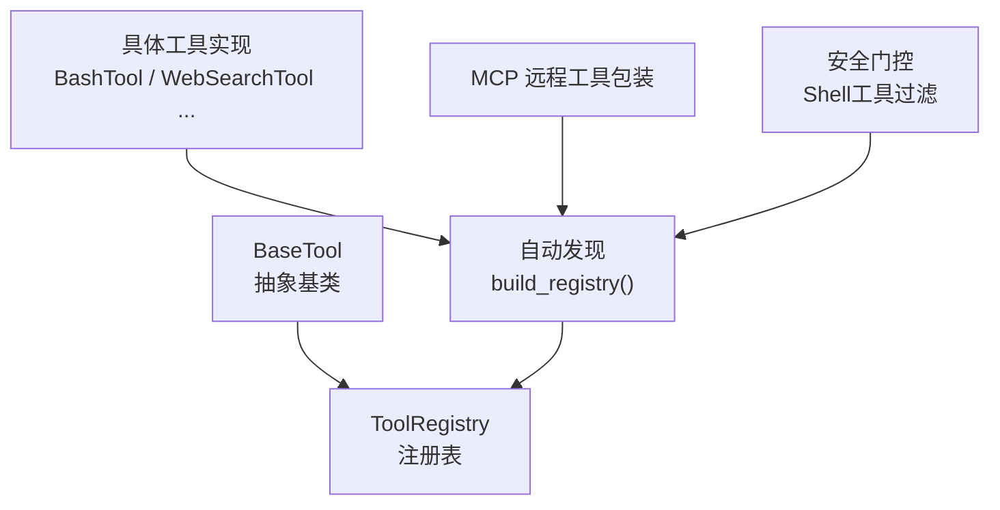
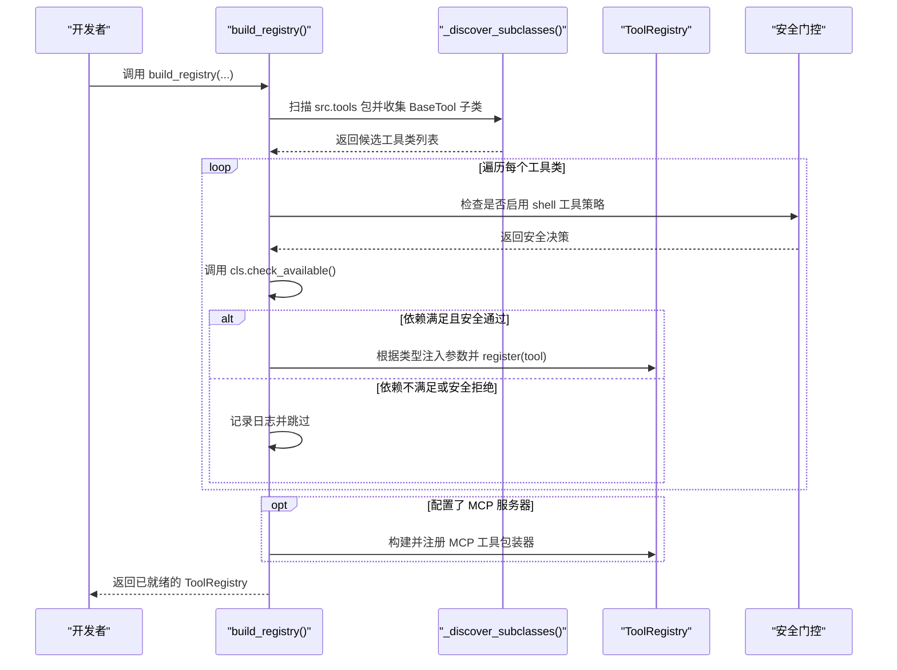
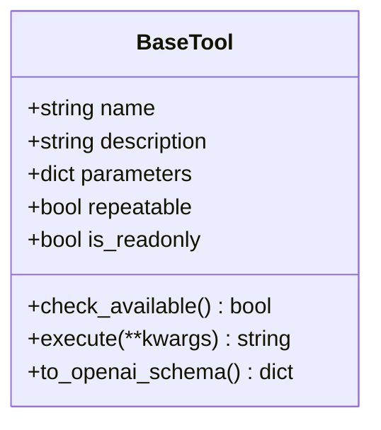
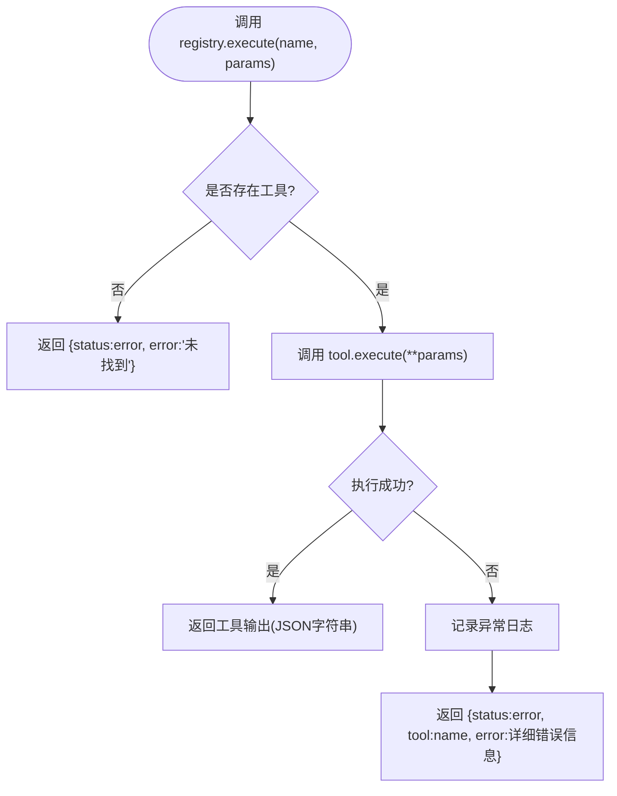
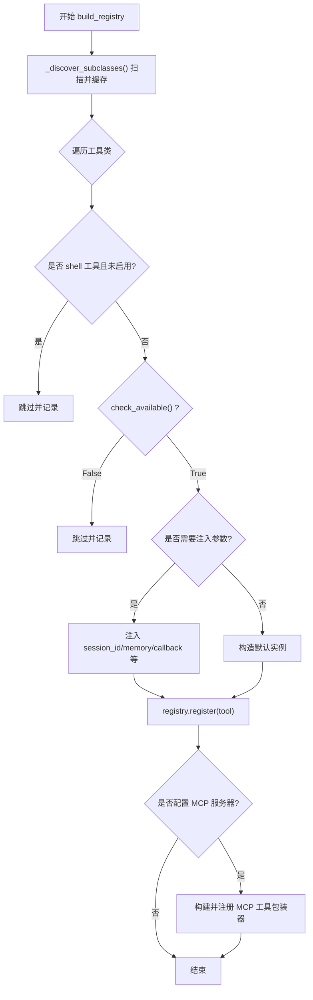
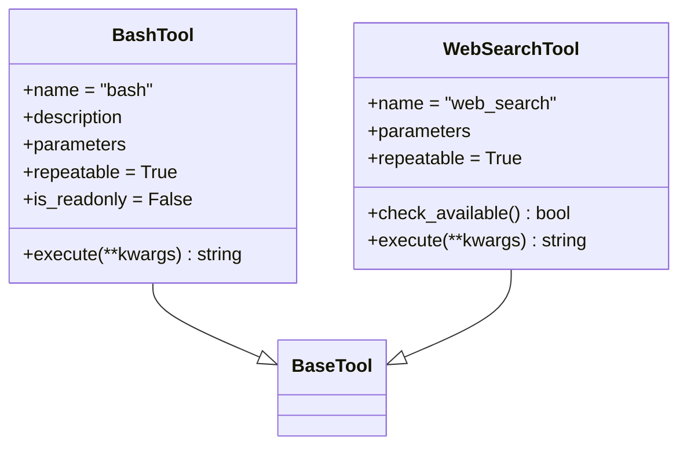
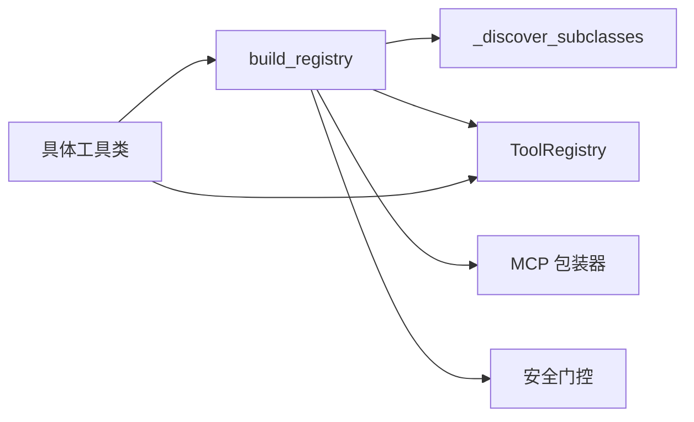

# 工具注册机制

<cite>
**本文引用的文件**
- [agent/src/agent/tools.py](file://agent/src/agent/tools.py)
- [agent/src/tools/__init__.py](file://agent/src/tools/__init__.py)
- [agent/src/tools/bash_tool.py](file://agent/src/tools/bash_tool.py)
- [agent/src/tools/web_search_tool.py](file://agent/src/tools/web_search_tool.py)
- [agent/tests/test_tool_registry_security.py](file://agent/tests/test_tool_registry_security.py)
</cite>

## 更新摘要
**变更内容**
- 增强了工具注册安全机制的文档说明，重点更新了错误处理策略的改进
- 新增字段验证错误的详细处理指南，替代原有的必需字段错误处理
- 完善了工具集成问题的调试指导，包括更清晰的错误信息结构
- 更新了安全门控和参数验证的最佳实践

## 目录
1. [简介](#简介)
2. [项目结构](#项目结构)
3. [核心组件](#核心组件)
4. [架构总览](#架构总览)
5. [详细组件分析](#详细组件分析)
6. [依赖关系分析](#依赖关系分析)
7. [性能考量](#性能考量)
8. [故障排查指南](#故障排查指南)
9. [结论](#结论)
10. [附录](#附录)

## 简介
本文件系统性说明 Vibe-Trading 中"工具注册机制"的实现原理与使用方式，重点覆盖：
- BaseTool 抽象类的设计模式与元数据约定（name、description、parameters、repeatable、is_readonly）
- ToolRegistry 的核心能力（注册、查找、批量导出 OpenAI 函数调用定义、统一执行封装）
- 自动发现与注册流程（包扫描、子类收集、依赖检查、特殊注入）
- 自定义工具开发范式（继承 BaseTool、定义 JSON Schema、实现 execute）
- 版本管理、依赖检查与冲突解决策略
- 热重载与动态更新支持现状
- **增强版安全机制**：改进的错误处理策略，专注于字段验证错误而非必需字段错误，提供更好的调试指导

## 项目结构
工具基础设施位于 agent 子模块：
- 基础抽象与注册表：agent/src/agent/tools.py
- 自动发现与构建器：agent/src/tools/__init__.py
- 具体工具实现：agent/src/tools/*.py（例如 bash_tool、web_search_tool 等）

**图表来源**
- [agent/src/agent/tools.py:13-95](file://agent/src/agent/tools.py#L13-L95)
- [agent/src/tools/__init__.py:33-245](file://agent/src/tools/__init__.py#L33-L245)

**章节来源**
- [agent/src/agent/tools.py:13-95](file://agent/src/agent/tools.py#L13-L95)
- [agent/src/tools/__init__.py:1-245](file://agent/src/tools/__init__.py#L1-L245)

## 核心组件
- BaseTool：定义工具的元数据契约与可序列化到 OpenAI function calling 的格式；提供 check_available 钩子用于依赖检查。
- ToolRegistry：维护 name -> tool 实例映射，提供注册、查询、批量导出 schema、安全执行并返回 JSON 字符串的统一入口。
- build_registry：基于包扫描自动发现所有 BaseTool 子类，按策略过滤（如 shell 工具）、依赖检查、参数注入（会话 ID、持久化记忆等），并可选追加 MCP 远程工具。
- **安全门控机制**：默认禁用 shell 工具，需要显式启用；实盘券商通道的安全授权检查。

**章节来源**
- [agent/src/agent/tools.py:13-95](file://agent/src/agent/tools.py#L13-L95)
- [agent/src/tools/__init__.py:33-245](file://agent/src/tools/__init__.py#L33-L245)

## 架构总览
下图展示了从"工具类定义"到"注册表可用"的完整链路，包括自动发现、依赖检查、参数注入与安全门控。

**图表来源**
- [agent/src/tools/__init__.py:33-245](file://agent/src/tools/__init__.py#L33-L245)
- [agent/src/agent/tools.py:54-95](file://agent/src/agent/tools.py#L54-L95)

## 详细组件分析

### BaseTool 抽象类
- 元数据字段
  - name：唯一标识，作为注册键
  - description：对 LLM 可见的描述
  - parameters：JSON Schema，描述输入参数
  - repeatable：是否允许重复调用
  - is_readonly：是否只读（影响安全策略与并行路径）
- 关键方法
  - check_available：类方法，用于依赖检查（API Key、第三方库等）。返回 False 将被注册表静默排除
  - execute：抽象方法，必须实现，接收 **kwargs，返回 JSON 字符串
  - to_openai_schema：将工具转换为 OpenAI function calling 的函数定义

**图表来源**
- [agent/src/agent/tools.py:13-52](file://agent/src/agent/tools.py#L13-L52)

**章节来源**
- [agent/src/agent/tools.py:13-52](file://agent/src/agent/tools.py#L13-L52)

### ToolRegistry 注册表
- 功能
  - register(name, tool)：注册工具
  - get(name)：按名称获取工具
  - get_definitions()：批量导出所有工具的 OpenAI function calling 定义
  - execute(name, params)：安全执行工具，捕获异常并返回结构化错误 JSON
  - tool_names、__len__、__contains__：便捷访问
- 设计要点
  - 统一错误封装：未找到或执行异常均返回 JSON 字符串，便于上层解析
  - 简单高效：字典映射 O(1) 查找
  - **增强的错误处理**：专注于字段验证错误，提供更详细的错误信息

**图表来源**
- [agent/src/agent/tools.py:72-84](file://agent/src/agent/tools.py#L72-L84)

**章节来源**
- [agent/src/agent/tools.py:54-95](file://agent/src/agent/tools.py#L54-L95)

### 自动发现与注册流程（build_registry）
- 包扫描：遍历 src.tools 下非下划线开头的模块，导入后收集 BaseTool 子类
- 缓存：首次扫描结果缓存，避免重复开销
- 过滤策略
  - 屏蔽 shell 工具（除非显式开启 include_shell_tools）
  - 依赖检查：cls.check_available() 为 False 则跳过
- 参数注入
  - RememberTool：注入共享 PersistentMemory 实例
  - 目标/研究相关工具：注入 default_session_id 与 event_callback
  - SwarmTool：注入 include_shell_tools 与 event_callback
- MCP 集成：当 agent_config.mcp_servers 存在时，构建远程工具包装器并追加到注册表；对实盘券商通道进行额外安全门控

**图表来源**
- [agent/src/tools/__init__.py:33-245](file://agent/src/tools/__init__.py#L33-L245)

**章节来源**
- [agent/src/tools/__init__.py:33-245](file://agent/src/tools/__init__.py#L33-L245)

### 自定义工具开发示例
以下以 BashTool、WebSearchTool 为例，展示如何继承 BaseTool 并遵循规范：
- 定义 name、description、parameters（JSON Schema）、repeatable、is_readonly
- 实现 execute(**kwargs)，返回 JSON 字符串
- 必要时重写 check_available() 声明依赖
- **增强错误处理**：专注于字段验证错误，提供详细的错误信息

**图表来源**
- [agent/src/tools/bash_tool.py:16-84](file://agent/src/tools/bash_tool.py#L16-L84)
- [agent/src/tools/web_search_tool.py:135-349](file://agent/src/tools/web_search_tool.py#L135-L349)

**章节来源**
- [agent/src/tools/bash_tool.py:16-84](file://agent/src/tools/bash_tool.py#L16-L84)
- [agent/src/tools/web_search_tool.py:135-349](file://agent/src/tools/web_search_tool.py#L135-L349)

### 依赖检查与可用性控制（check_available）
- 默认行为：BaseTool.check_available() 返回 True
- 常见实践
  - 环境变量检查：如 FRED API Key 存在才可用
  - 第三方库检测：如 ddgs 或 duckduckgo_search 是否安装
- 效果：在 build_registry 中若返回 False，工具会被静默排除，不影响其他工具注册

**章节来源**
- [agent/src/agent/tools.py:29-36](file://agent/src/agent/tools.py#L29-L36)
- [agent/src/tools/web_search_tool.py:139-150](file://agent/src/tools/web_search_tool.py#L139-L150)

### 版本管理与冲突解决
- 命名稳定性：本地工具通过 name 字段唯一标识；MCP 远程工具采用稳定前缀 mcp_<server>_<tool>
- 冲突处理：当多个 MCP server 经规范化后产生相同前缀时，系统会在 server 段追加确定性哈希后缀以保证唯一性，并输出警告提示运营方调整配置
- 版本演进建议：通过 name 的语义化命名与向后兼容的 parameters 设计，确保升级平滑

**章节来源**
- [README_zh.md:1394-1416](file://README_zh.md#L1394-L1416)

### 热重载与动态更新支持
- 当前限制：v1 不支持热重载，修改配置需重启进程以生效
- 动态更新范围：运行时无法在不重启的情况下重新加载 MCP 配置或新增工具；可通过外部进程管理实现"优雅重启"

**章节来源**
- [README_zh.md:1408-1416](file://README_zh.md#L1408-L1416)

### 增强的安全机制与错误处理
**更新** 系统现在提供了更强大的安全机制和改进的错误处理策略：

- **Shell 工具安全门控**：默认禁用所有 shell 工具（bash、background_run、cancel_background），需要通过 `include_shell_tools=True` 显式启用
- **字段验证错误处理**：工具执行时的错误处理现在专注于字段验证错误，而不是必需的字段错误，提供更精确的错误信息
- **统一的错误响应格式**：所有工具错误都返回标准化的 JSON 格式，包含 status、error、tool 等字段
- **安全警告集成**：搜索结果和其他敏感数据通过 with_security_warnings 进行安全标记

**章节来源**
- [agent/tests/test_tool_registry_security.py:10-28](file://agent/tests/test_tool_registry_security.py#L10-L28)
- [agent/src/tools/web_search_tool.py:184-205](file://agent/src/tools/web_search_tool.py#L184-L205)

## 依赖关系分析
- 组件耦合
  - build_registry 强依赖 _discover_subclasses 与 ToolRegistry
  - 各工具仅依赖 BaseTool 契约，低耦合
- 外部依赖
  - MCP 工具包装器按需引入，失败隔离，不影响本地工具
  - 部分工具依赖环境变量或第三方库，通过 check_available 解耦
- **安全依赖**：shell 工具策略和安全门控机制

**图表来源**
- [agent/src/tools/__init__.py:33-245](file://agent/src/tools/__init__.py#L33-L245)
- [agent/src/agent/tools.py:54-95](file://agent/src/agent/tools.py#L54-L95)

**章节来源**
- [agent/src/tools/__init__.py:33-245](file://agent/src/tools/__init__.py#L33-L245)
- [agent/src/agent/tools.py:54-95](file://agent/src/agent/tools.py#L54-L95)

## 性能考量
- 自动发现缓存：_SUBCLASSES_CACHE 避免重复扫描与导入
- 注册表操作：O(1) 查找与插入
- 工具执行：统一异常捕获与 JSON 封装，减少上层分支复杂度
- 网络与 I/O：部分工具具备重试、超时与回退策略（如 web_search），降低失败概率
- **安全开销**：shell 工具检查和依赖验证的开销相对较小

## 故障排查指南
- 工具未出现在注册表中
  - 检查 check_available() 是否返回 False（缺少依赖或环境变量）
  - 确认模块名未以下划线开头（不会被扫描）
  - 查看日志中的"不可用/跳过"提示
  - **安全检查**：确认 shell 工具是否被正确禁用或启用
- 工具执行报错
  - 检查 execute 返回值是否为合法 JSON 字符串
  - 关注 ToolRegistry.execute 的错误封装结构（包含 status、error 等字段）
  - **字段验证错误**：重点关注具体的字段验证错误信息，而不是必需的字段错误
- MCP 工具未注册
  - 检查 agent_config.mcp_servers 配置是否正确
  - 注意实盘券商通道的授权门控与交互式环境判断
  - 查看冲突告警与命名前缀哈希后缀
- **调试工具集成问题**
  - 使用增强的错误信息定位具体问题
  - 检查字段验证逻辑和参数类型
  - 利用日志输出跟踪工具执行流程

**章节来源**
- [agent/src/tools/__init__.py:136-153](file://agent/src/tools/__init__.py#L136-L153)
- [agent/src/agent/tools.py:72-84](file://agent/src/agent/tools.py#L72-L84)
- [agent/src/tools/web_search_tool.py:184-205](file://agent/src/tools/web_search_tool.py#L184-L205)

## 结论
Vibe-Trading 的工具注册机制以 BaseTool 契约为核心，结合自动发现、依赖检查与参数注入，提供了可扩展、可插拔的工具生态。ToolRegistry 提供统一的注册、查询与执行接口，并保证错误可观测与可恢复。对于远程 MCP 工具，系统在命名冲突、授权门控与失败隔离方面做了完善设计。**最新的安全机制增强**包括默认的 shell 工具禁用、改进的字段验证错误处理和更好的调试支持。当前版本不支持热重载，需通过进程重启完成配置更新。

## 附录
- 快速上手：新建一个 src/tools/xxx_tool.py，定义继承 BaseTool 的类，设置 name/description/parameters/repeatable/is_readonly，实现 execute，并在需要时重写 check_available。无需手动注册，build_registry 会自动发现并纳入注册表。
- 参考实现路径
  - 基础抽象与注册表：[agent/src/agent/tools.py](file://agent/src/agent/tools.py)
  - 自动发现与构建器：[agent/src/tools/__init__.py](file://agent/src/tools/__init__.py)
  - 示例工具：
    - [agent/src/tools/bash_tool.py](file://agent/src/tools/bash_tool.py)
    - [agent/src/tools/web_search_tool.py](file://agent/src/tools/web_search_tool.py)
  - 安全测试：[agent/tests/test_tool_registry_security.py](file://agent/tests/test_tool_registry_security.py)