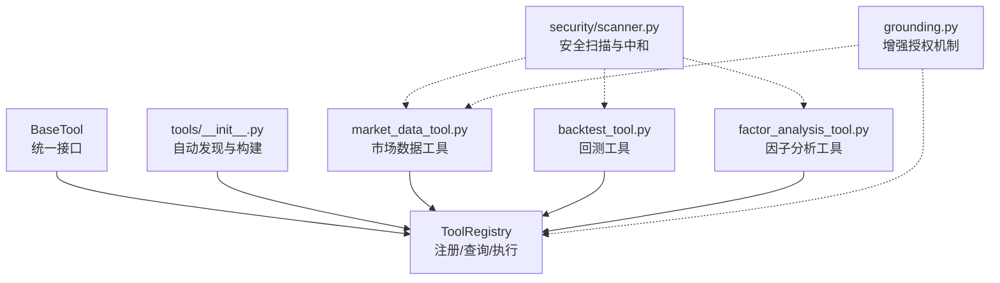
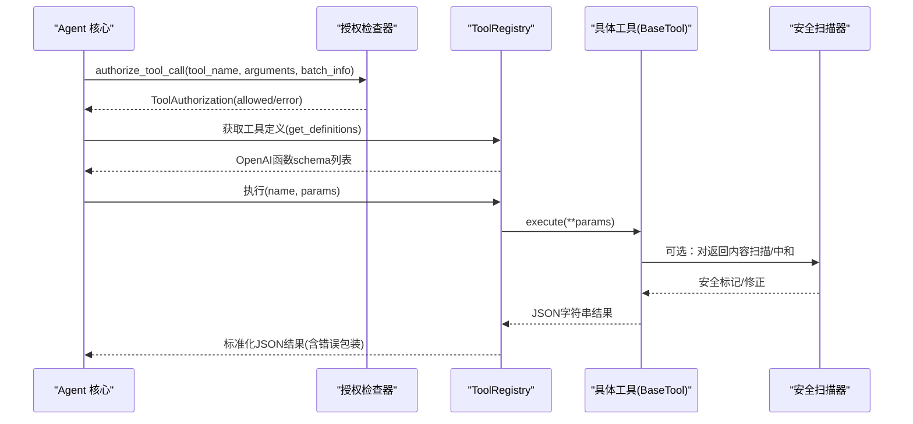
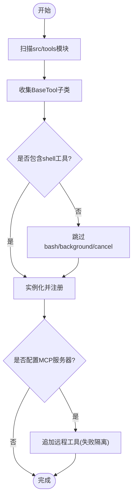
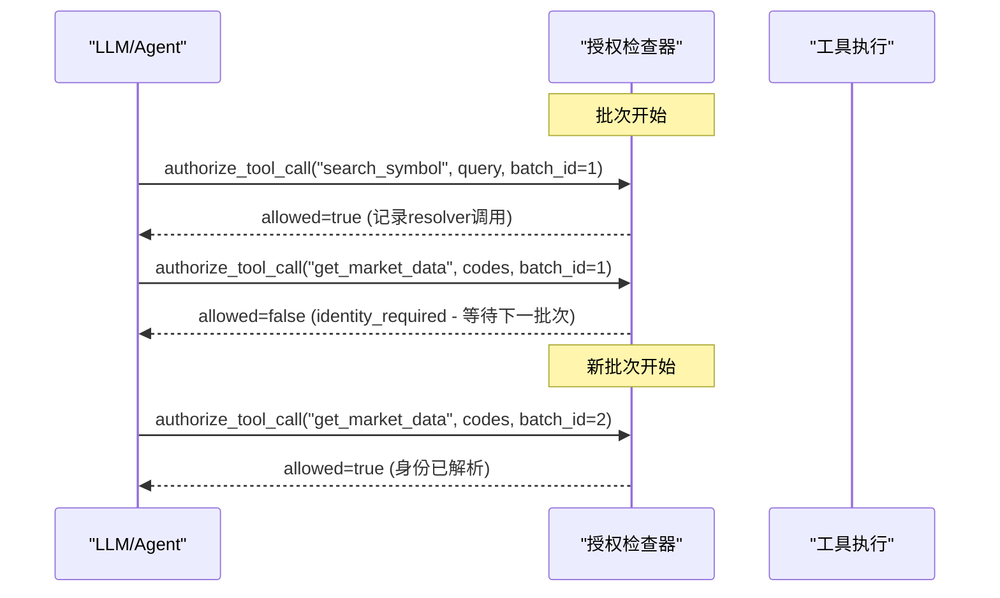
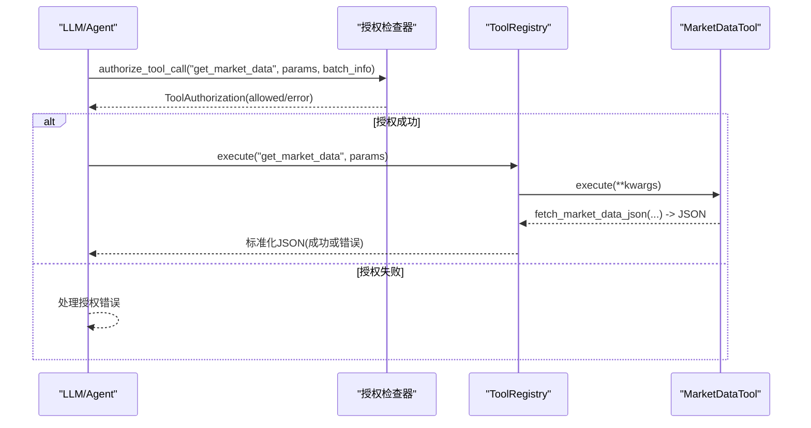
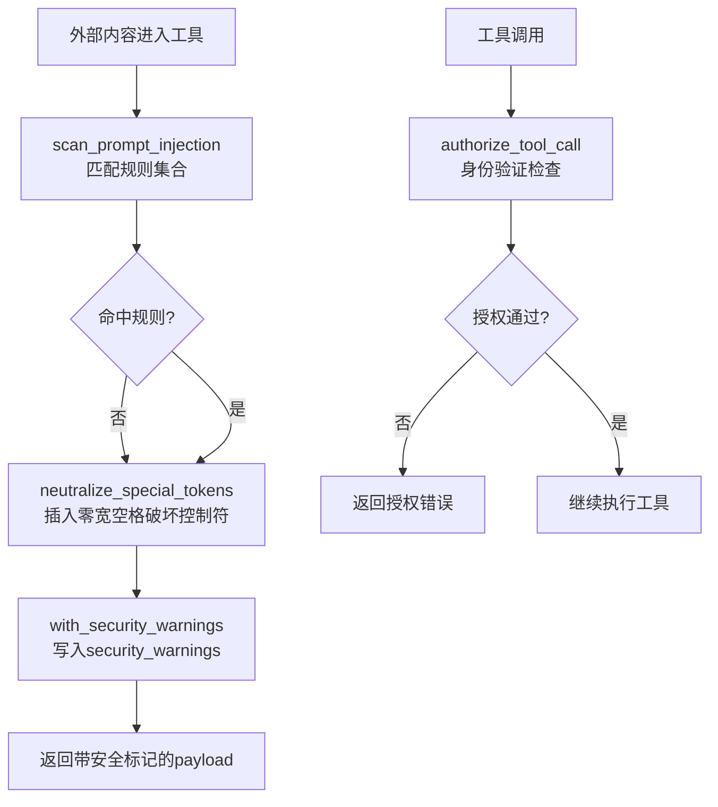
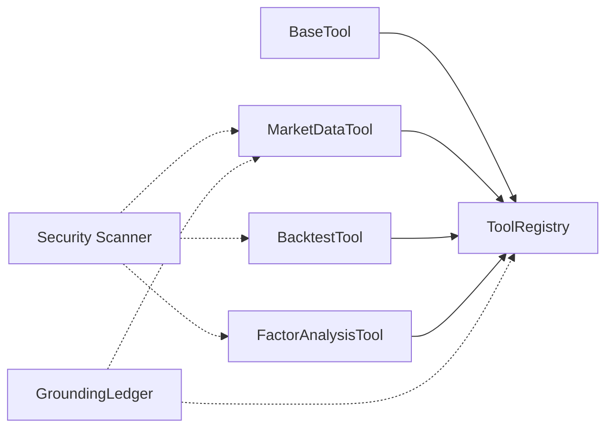

# 工具系统

<cite>
**本文引用的文件**
- [agent/src/tools/__init__.py](file://agent/src/tools/__init__.py)
- [agent/src/agent/tools.py](file://agent/src/agent/tools.py)
- [agent/src/tools/market_data_tool.py](file://agent/src/tools/market_data_tool.py)
- [agent/src/tools/backtest_tool.py](file://agent/src/tools/backtest_tool.py)
- [agent/src/tools/factor_analysis_tool.py](file://agent/src/tools/factor_analysis_tool.py)
- [agent/src/security/scanner.py](file://agent/src/security/scanner.py)
- [agent/src/agent/grounding.py](file://agent/src/agent/grounding.py)
</cite>

## 更新摘要
**所做更改**
- 增强了 grounding 系统的工具授权机制，改进了市场敏感操作的身份验证
- 实现了 search_symbol 和 get_market_data 调用之间的复杂竞态条件防止
- 在同一批次内确保身份解析在数据消费之前的正确排序
- 更新了工具授权流程和安全控制机制

## 目录
1. [简介](#简介)
2. [项目结构](#项目结构)
3. [核心组件](#核心组件)
4. [架构总览](#架构总览)
5. [详细组件分析](#详细组件分析)
6. [依赖关系分析](#依赖关系分析)
7. [性能考量](#性能考量)
8. [故障排查指南](#故障排查指南)
9. [结论](#结论)
10. [附录](#附录)

## 简介
本文件面向 Vibe-Trading 工具系统，系统性阐述工具的注册机制、调用流程、参数校验与执行环境隔离；梳理内置工具的分类与能力（回测、市场数据、因子分析等）；提供自定义工具开发范式（参数 schema 定义与返回值规范）；说明安全控制（提示注入扫描、沙箱执行与权限管理）；解释工具与 Agent 核心的集成方式（工具发现、动态加载、错误处理）；并给出调试方法与性能监控建议。

**最新更新**：系统现在实现了增强的工具授权机制，特别是在 grounding 系统中对市场敏感操作的身份验证进行了改进。系统现在在同一个批次内的 search_symbol 和 get_market_data 调用之间实现了复杂的竞态条件防止，确保身份解析在数据消费之前得到正确处理。

## 项目结构
工具系统围绕"基类 + 注册表 + 自动发现"的架构组织：
- 基类与注册表：定义统一的工具接口与集中式注册、查找与执行能力。
- 自动发现：按包内模块扫描，收集所有 BaseTool 子类并注册到 ToolRegistry。
- 工具实现：每个工具以独立模块形式存在，声明 name/description/parameters/repeatable/is_readonly，并实现 execute。
- 安全层：对外部内容做提示注入扫描与特殊 token 中和，保障下游 Agent 安全消费。
- **新增**：增强的授权机制，包括批次级别的身份验证和竞态条件防止。

**图表来源**
- [agent/src/agent/tools.py:13-95](file://agent/src/agent/tools.py#L13-L95)
- [agent/src/tools/__init__.py:33-63](file://agent/src/tools/__init__.py#L33-L63)
- [agent/src/tools/market_data_tool.py:11-104](file://agent/src/tools/market_data_tool.py#L11-L104)
- [agent/src/tools/backtest_tool.py:77-95](file://agent/src/tools/backtest_tool.py#L77-L95)
- [agent/src/tools/factor_analysis_tool.py:108-152](file://agent/src/tools/factor_analysis_tool.py#L108-L152)
- [agent/src/security/scanner.py:145-220](file://agent/src/security/scanner.py#L145-L220)
- [agent/src/agent/grounding.py:672-812](file://agent/src/agent/grounding.py#L672-L812)

## 核心组件
- BaseTool：定义工具契约（name、description、parameters、repeatable、is_readonly），并提供 to_openai_schema 转换；check_available 用于按需跳过不可用工具。
- ToolRegistry：维护工具映射，支持 get、get_definitions、execute（统一异常包装为 JSON）、tool_names 列表。
- 自动发现与构建：遍历 src/tools 下模块，收集 BaseTool 子类实例化并注册；支持过滤 shell 工具、注入 session_id、MCP 工具合并等。
- **新增**：GroundingLedger：提供增强的工具授权机制，包括批次级别的身份验证和竞态条件防止。

**章节来源**
- [agent/src/agent/tools.py:13-95](file://agent/src/agent/tools.py#L13-L95)
- [agent/src/tools/__init__.py:33-63](file://agent/src/tools/__init__.py#L33-L63)
- [agent/src/agent/grounding.py:672-812](file://agent/src/agent/grounding.py#L672-L812)

## 架构总览
下图展示从 Agent 侧发起工具调用到具体工具执行的端到端流程，包括增强的授权检查、注册、发现、参数校验、执行与安全扫描。

**图表来源**
- [agent/src/agent/tools.py:68-84](file://agent/src/agent/tools.py#L68-L84)
- [agent/src/security/scanner.py:177-220](file://agent/src/security/scanner.py#L177-L220)
- [agent/src/agent/grounding.py:672-812](file://agent/src/agent/grounding.py#L672-L812)

## 详细组件分析

### 工具注册与发现机制
- 自动发现：通过 pkgutil 遍历 src/tools 下模块，导入后收集 BaseTool 子类，缓存结果避免重复扫描。
- 构建注册表：build_registry 负责实例化工具、注入共享依赖（如 PersistentMemory、session_id）、屏蔽 shell 工具（默认）、合并 MCP 工具（可配置）。
- 过滤与白名单：build_filtered_registry/build_swarm_registry 支持按名称过滤，确保最小可用工具集。

**图表来源**
- [agent/src/tools/__init__.py:33-63](file://agent/src/tools/__init__.py#L33-L63)
- [agent/src/tools/__init__.py:66-245](file://agent/src/tools/__init__.py#L66-L245)

**章节来源**
- [agent/src/tools/__init__.py:33-63](file://agent/src/tools/__init__.py#L33-L63)
- [agent/src/tools/__init__.py:66-245](file://agent/src/tools/__init__.py#L66-L245)

### 增强的工具授权机制

**最新更新**：系统现在实现了增强的工具授权机制，特别针对市场敏感操作的身份验证和竞态条件防止。

#### 批次级身份验证
- 批次跟踪：使用 `_batch_resolver_call_ids` 跟踪当前批次中的 resolver 调用
- 批次边界检测：通过单调递增的 `batch_id` 检测批次边界，重置 resolver 跟踪器
- 身份状态冻结：在每个批次开始前捕获身份状态快照，确保一致性

#### 竞态条件防止
- **search_symbol 和 get_market_data 的协调**：当同一批次中调用了 search_symbol，get_market_data 会被阻止直到下一个批次
- **身份解析优先**：确保身份解析结果在数据消费之前完全可用
- **错误处理**：提供明确的错误代码和消息，指示需要等待下一批次

**图表来源**
- [agent/src/agent/grounding.py:618-757](file://agent/src/agent/grounding.py#L618-L757)

**章节来源**
- [agent/src/agent/grounding.py:618-757](file://agent/src/agent/grounding.py#L618-L757)

### 工具调用流程与参数验证
- 参数定义：每个工具在 parameters 中声明 JSON Schema，描述字段类型、枚举、默认值与必填项。
- 执行入口：ToolRegistry.execute 统一捕获异常并返回标准 JSON 错误结构，保证上层稳定消费。
- 只读标记：is_readonly 标识工具是否仅读取，便于策略层限制写操作。
- **新增**：授权检查在执行前进行，确保只有经过身份验证的工具调用才能执行。

**图表来源**
- [agent/src/agent/tools.py:72-84](file://agent/src/agent/tools.py#L72-L84)
- [agent/src/tools/market_data_tool.py:11-104](file://agent/src/tools/market_data_tool.py#L11-L104)
- [agent/src/agent/grounding.py:672-812](file://agent/src/agent/grounding.py#L672-L812)

**章节来源**
- [agent/src/agent/tools.py:72-84](file://agent/src/agent/tools.py#L72-L84)
- [agent/src/tools/market_data_tool.py:11-104](file://agent/src/tools/market_data_tool.py#L11-L104)

### 执行环境隔离与安全控制
- 沙箱执行：回测工具通过 Runner 在受限环境中运行信号脚本，限制超时与路径访问，输出 stdout/stderr/artifacts。
- 安全扫描：对外部内容（网页、文档、搜索结果）进行提示注入检测与特殊 token 中和，并在返回体附加 security_warnings。
- 权限控制：工具可通过 is_readonly 标记只读；shell 工具默认禁用，需显式开启；MCP 工具按服务器隔离，失败不影响本地工具。
- **新增**：增强的授权机制确保市场敏感操作的正确身份验证。

**图表来源**
- [agent/src/security/scanner.py:145-220](file://agent/src/security/scanner.py#L145-L220)
- [agent/src/agent/grounding.py:672-812](file://agent/src/agent/grounding.py#L672-L812)

**章节来源**
- [agent/src/tools/backtest_tool.py:15-74](file://agent/src/tools/backtest_tool.py#L15-L74)
- [agent/src/security/scanner.py:145-220](file://agent/src/security/scanner.py#L145-L220)

### 内置工具分类与功能
- 回测工具
  - 功能：校验 run_dir/config.json/signal_engine.py，调用内置引擎执行回测，收集产物与日志。
  - 关键行为：路径安全校验、source 白名单校验、超时保护、结果归档。
  - 参考路径：[agent/src/tools/backtest_tool.py:15-74](file://agent/src/tools/backtest_tool.py#L15-L74), [agent/src/tools/backtest_tool.py:77-95](file://agent/src/tools/backtest_tool.py#L77-L95)
- 市场数据工具
  - 功能：通过仓库加载层拉取标准化 OHLCV 数据，支持多源（auto/yfinance/okx/ccxt/tushare/baostock/eastmoney/sina/stooq/finnhub/alphavantage/tiingo/fmp/mt5/pykrx 等）。
  - 关键行为：参数校验（codes/start_date/end_date/source/interval/max_rows）、默认行限制、来源探测与降级。
  - **新增**：受增强授权机制保护，确保正确的身份验证。
  - 参考路径：[agent/src/tools/market_data_tool.py:11-104](file://agent/src/tools/market_data_tool.py#L11-L104)
- 因子分析工具
  - 功能：计算 IC/IR、分层回测净值曲线，输出 ic_series.csv、ic_summary.json、group_equity.csv。
  - 关键行为：输入 CSV 校验、IC 统计、分组净值聚合、空数据与不足样本保护。
  - 参考路径：[agent/src/tools/factor_analysis_tool.py:19-105](file://agent/src/tools/factor_analysis_tool.py#L19-L105), [agent/src/tools/factor_analysis_tool.py:108-152](file://agent/src/tools/factor_analysis_tool.py#L108-L152)

**章节来源**
- [agent/src/tools/backtest_tool.py:15-74](file://agent/src/tools/backtest_tool.py#L15-L74)
- [agent/src/tools/market_data_tool.py:11-104](file://agent/src/tools/market_data_tool.py#L11-L104)
- [agent/src/tools/factor_analysis_tool.py:19-105](file://agent/src/tools/factor_analysis_tool.py#L19-L105)

### 自定义工具开发示例
- 步骤概览
  - 新建模块：在 src/tools 下创建新文件，定义继承 BaseTool 的类。
  - 声明元信息：设置 name、description、parameters(JSON Schema)、repeatable、is_readonly。
  - 实现 execute：接收 **kwargs，返回 JSON 字符串；内部可做参数校验与业务逻辑。
  - 自动注册：无需额外注册代码，构建时自动发现并加入 ToolRegistry。
- 参数 schema 设计要点
  - 使用 type/object/properties/required 描述必填与可选字段。
  - 对枚举型参数使用 enum 约束取值范围。
  - 为数值型参数提供合理默认值与上限（如 max_rows）。
- 返回值规范
  - 成功：status="ok" 及业务字段。
  - 失败：status="error" 与 error 消息；由 ToolRegistry.execute 统一包装异常。
- **新增**：对于市场敏感工具，需要考虑授权机制的影响，确保正确的身份验证流程。
- 参考实现
  - 市场数据工具：[agent/src/tools/market_data_tool.py:11-104](file://agent/src/tools/market_data_tool.py#L11-L104)
  - 回测工具：[agent/src/tools/backtest_tool.py:77-95](file://agent/src/tools/backtest_tool.py#L77-L95)
  - 因子分析工具：[agent/src/tools/factor_analysis_tool.py:108-152](file://agent/src/tools/factor_analysis_tool.py#L108-L152)

**章节来源**
- [agent/src/agent/tools.py:13-51](file://agent/src/agent/tools.py#L13-L51)
- [agent/src/tools/market_data_tool.py:11-104](file://agent/src/tools/market_data_tool.py#L11-L104)
- [agent/src/tools/backtest_tool.py:77-95](file://agent/src/tools/backtest_tool.py#L77-L95)
- [agent/src/tools/factor_analysis_tool.py:108-152](file://agent/src/tools/factor_analysis_tool.py#L108-L152)

### 与 Agent 核心的集成
- 工具发现：build_registry 自动扫描并注册本地工具；当 agent_config 配置 MCP 服务器时，动态追加远程工具，且各服务器失败互不影响。
- 动态加载：通过 importlib 按需导入模块，减少启动开销；子类收集采用 BFS 遍历，确保多级继承也能被发现。
- 错误处理：注册阶段捕获异常并记录警告；执行阶段统一包装为 JSON 错误，便于上层重试或降级。
- **新增**：增强的授权机制与 Agent 循环集成，确保批次级别的身份验证和竞态条件防止。

**章节来源**
- [agent/src/tools/__init__.py:33-63](file://agent/src/tools/__init__.py#L33-L63)
- [agent/src/tools/__init__.py:66-245](file://agent/src/tools/__init__.py#L66-L245)
- [agent/src/agent/tools.py:72-84](file://agent/src/agent/tools.py#L72-L84)

## 依赖关系分析
- 组件耦合
  - BaseTool 与 ToolRegistry 强耦合：工具必须遵循接口，注册表负责调度。
  - 工具模块弱耦合：每个工具独立实现，仅依赖必要的业务库（如 market_data、backtest runner）。
  - 安全扫描器与工具解耦：通过 with_security_warnings 在工具返回前注入安全标记。
  - **新增**：GroundingLedger 与工具授权机制紧密集成，提供批次级别的身份验证。
- 外部依赖
  - 市场数据工具依赖仓库加载层（多种数据源）。
  - 回测工具依赖 Runner 与 backtest 引擎。
  - 因子分析工具依赖 pandas 与因子分析核心。

**图表来源**
- [agent/src/agent/tools.py:13-95](file://agent/src/agent/tools.py#L13-L95)
- [agent/src/tools/market_data_tool.py:11-104](file://agent/src/tools/market_data_tool.py#L11-L104)
- [agent/src/tools/backtest_tool.py:77-95](file://agent/src/tools/backtest_tool.py#L77-L95)
- [agent/src/tools/factor_analysis_tool.py:108-152](file://agent/src/tools/factor_analysis_tool.py#L108-L152)
- [agent/src/security/scanner.py:177-220](file://agent/src/security/scanner.py#L177-L220)
- [agent/src/agent/grounding.py:672-812](file://agent/src/agent/grounding.py#L672-L812)

**章节来源**
- [agent/src/agent/tools.py:13-95](file://agent/src/agent/tools.py#L13-L95)
- [agent/src/tools/__init__.py:33-63](file://agent/src/tools/__init__.py#L33-L63)

## 性能考量
- 启动优化：自动发现结果缓存，避免重复扫描与导入。
- 数据拉取：市场数据工具默认限制每标的行数，防止大响应阻塞；支持 source 自动选择与降级。
- 执行隔离：回测工具设置超时与路径安全，避免长时间占用与越权访问。
- 安全扫描：提示注入扫描与 token 中和仅在必要时触发，降低开销。
- **新增**：批次级授权检查减少了不必要的身份验证开销，提高了批量处理的效率。

## 故障排查指南
- 工具未注册
  - 检查 check_available 是否返回 False；确认模块未被 _ 前缀忽略；查看构建日志中的跳过原因。
  - 参考路径：[agent/src/tools/__init__.py:33-63](file://agent/src/tools/__init__.py#L33-L63)
- 执行报错
  - ToolRegistry.execute 会捕获异常并返回 JSON 错误；根据 error 字段定位问题。
  - **新增**：检查授权错误，特别是 identity_required 和 identity_conflict 错误代码。
  - 参考路径：[agent/src/agent/tools.py:72-84](file://agent/src/agent/tools.py#L72-L84)
- 回测失败
  - 检查 config.json 是否存在且 source 合法；signal_engine.py 是否存在；关注 stdout/stderr 与 artifacts。
  - 参考路径：[agent/src/tools/backtest_tool.py:15-74](file://agent/src/tools/backtest_tool.py#L15-L74)
- 市场数据为空
  - 核对 codes/start_date/end_date 格式；尝试切换 source；检查网络与凭据。
  - **新增**：检查是否在正确的批次中调用，确保身份解析已完成。
  - 参考路径：[agent/src/tools/market_data_tool.py:11-104](file://agent/src/tools/market_data_tool.py#L11-L104)
- 因子分析失败
  - 确认 factor_csv/return_csv 非空且时间对齐；n_groups>=1；观察 ic_count 与 group_equity 生成情况。
  - 参考路径：[agent/src/tools/factor_analysis_tool.py:19-105](file://agent/src/tools/factor_analysis_tool.py#L19-L105)
- 安全告警
  - 若返回体包含 security_warnings，检查外部内容是否命中提示注入规则；必要时清洗输入。
  - 参考路径：[agent/src/security/scanner.py:145-220](file://agent/src/security/scanner.py#L145-L220)
- **新增**：授权相关故障
  - 检查 identity_status 是否为 "locked"；确认 resolver 调用已完成；验证批次边界是否正确处理。
  - 参考路径：[agent/src/agent/grounding.py:672-812](file://agent/src/agent/grounding.py#L672-L812)

**章节来源**
- [agent/src/tools/__init__.py:33-63](file://agent/src/tools/__init__.py#L33-L63)
- [agent/src/agent/tools.py:72-84](file://agent/src/agent/tools.py#L72-L84)
- [agent/src/tools/backtest_tool.py:15-74](file://agent/src/tools/backtest_tool.py#L15-L74)
- [agent/src/tools/market_data_tool.py:11-104](file://agent/src/tools/market_data_tool.py#L11-L104)
- [agent/src/tools/factor_analysis_tool.py:19-105](file://agent/src/tools/factor_analysis_tool.py#L19-L105)
- [agent/src/security/scanner.py:145-220](file://agent/src/security/scanner.py#L145-L220)
- [agent/src/agent/grounding.py:672-812](file://agent/src/agent/grounding.py#L672-L812)

## 结论
Vibe-Trading 工具系统通过统一的 BaseTool 接口与 ToolRegistry 注册表，结合自动发现与动态加载，实现了高扩展性与易维护性。内置工具覆盖回测、市场数据与因子分析等核心场景，并通过安全扫描与沙箱执行保障稳定性与安全性。**最新增强**：系统现在提供了增强的工具授权机制，特别针对市场敏感操作的身份验证和竞态条件防止，确保了更严格的安全控制和更可靠的数据访问控制。开发者可按规范快速扩展自定义工具，借助参数 schema 与标准返回格式与 Agent 无缝集成。

## 附录
- 最佳实践
  - 明确参数 schema，提供合理默认值与必填项。
  - 在 execute 中尽早校验输入，失败返回结构化错误。
  - 对涉及外部资源的工具增加超时与重试策略。
  - 对可能产生大量输出的工具限制大小或分页。
  - 对外部内容统一走安全扫描，避免提示注入风险。
  - **新增**：对于市场敏感工具，确保正确的批次处理和身份验证流程。
- 调试建议
  - 启用详细日志，关注构建阶段的跳过与警告。
  - 在执行失败时优先检查 ToolRegistry 的错误包装信息。
  - 对回测与因子分析，先验证输入文件结构与字段对齐。
  - **新增**：检查授权状态和批次信息，特别是 identity_status 和 batch_id。
- 监控建议
  - 统计工具调用次数、成功率与平均耗时。
  - 对数据拉取工具监控不同 source 的成功率与延迟。
  - 对安全扫描结果计数，识别高风险外部内容来源。
  - **新增**：监控授权失败率和竞态条件检测频率。