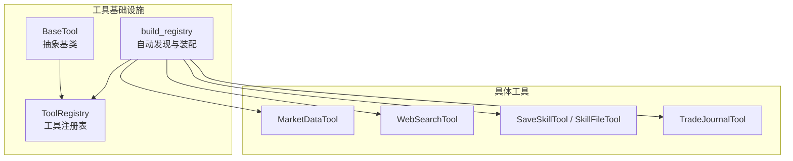
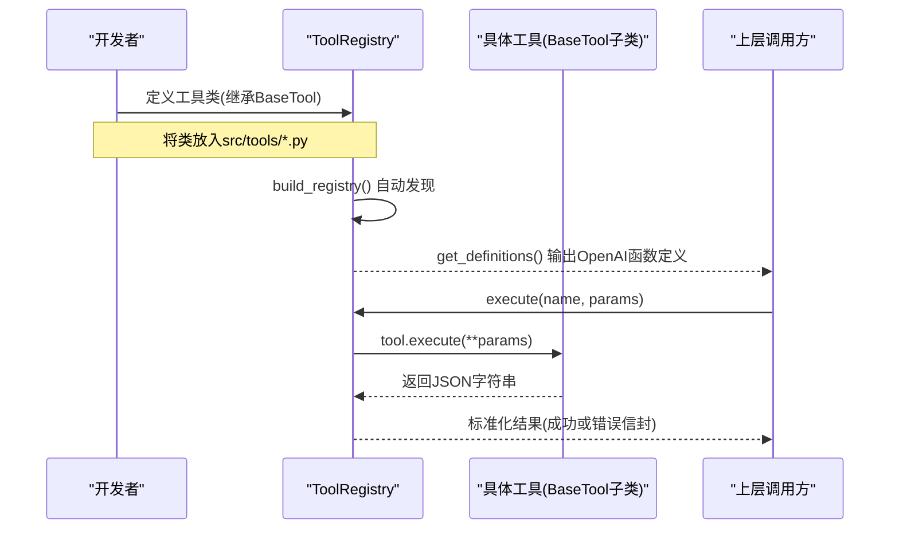
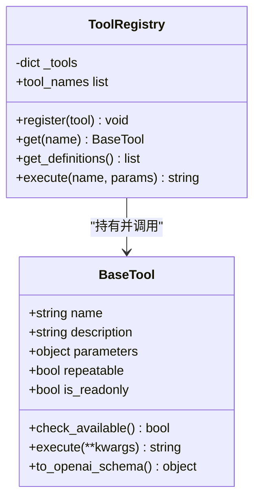
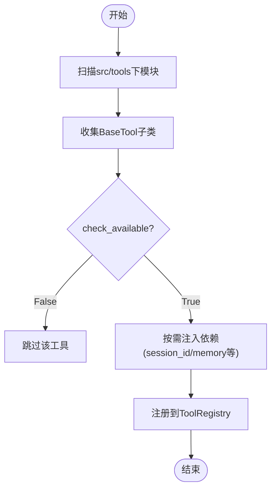
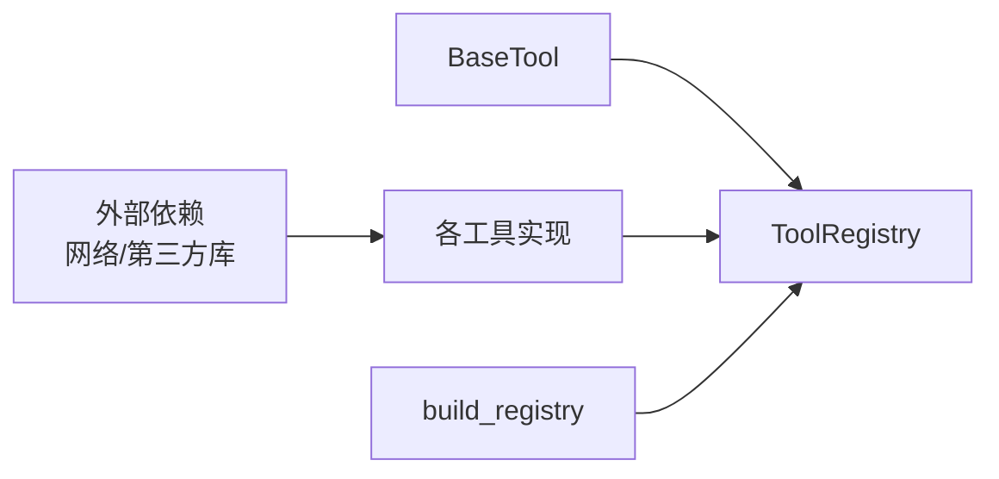

# 自定义工具开发

<cite>
**本文引用的文件**
- [agent/src/agent/tools.py](file://agent/src/agent/tools.py)
- [agent/src/tools/__init__.py](file://agent/src/tools/__init__.py)
- [agent/src/tools/market_data_tool.py](file://agent/src/tools/market_data_tool.py)
- [agent/src/tools/web_search_tool.py](file://agent/src/tools/web_search_tool.py)
- [agent/src/tools/skill_writer_tool.py](file://agent/src/tools/skill_writer_tool.py)
- [agent/src/tools/trade_journal_tool.py](file://agent/src/tools/trade_journal_tool.py)
- [agent/tests/test_web_search_tool.py](file://agent/tests/test_web_search_tool.py)
- [agent/tests/test_institutional_holdings_tool.py](file://agent/tests/test_institutional_holdings_tool.py)
</cite>

## 目录
1. [简介](#简介)
2. [项目结构](#项目结构)
3. [核心组件](#核心组件)
4. [架构总览](#架构总览)
5. [详细组件分析](#详细组件分析)
6. [依赖关系分析](#依赖关系分析)
7. [性能考虑](#性能考虑)
8. [故障排查指南](#故障排查指南)
9. [结论](#结论)
10. [附录](#附录)

## 简介
本指南面向希望在本项目中扩展“工具”能力的开发者。你将学习如何继承 BaseTool 创建可被自动发现与注册的工具，如何编写符合 JSON Schema 的参数定义，如何实现 execute 方法以完成输入校验、业务逻辑与结果格式化，以及如何测试、调试和优化你的工具。文末提供从简单数据处理到复杂多步骤工作流的完整示例路径与最佳实践建议。

## 项目结构
工具系统位于 agent 子模块中：
- 基础框架与注册机制：BaseTool、ToolRegistry、自动发现与构建器
- 具体工具实现：市场数据、网络搜索、技能管理、交易记录分析等
- 测试：覆盖参数校验、错误处理、重试与回退策略等

图表来源
- [agent/src/agent/tools.py:13-95](file://agent/src/agent/tools.py#L13-L95)
- [agent/src/tools/__init__.py:33-245](file://agent/src/tools/__init__.py#L33-L245)

章节来源
- [agent/src/agent/tools.py:13-95](file://agent/src/agent/tools.py#L13-L95)
- [agent/src/tools/__init__.py:33-245](file://agent/src/tools/__init__.py#L33-L245)

## 核心组件
- BaseTool：所有工具的抽象基类，定义 name、description、parameters、repeatable、is_readonly 以及 check_available、execute、to_openai_schema 等契约。
- ToolRegistry：维护工具实例的注册、查询、批量获取 OpenAI 函数调用格式定义，以及统一执行入口（异常捕获并返回结构化 JSON）。
- build_registry：扫描 src/tools 包下所有非私有模块，收集 BaseTool 子类，按策略注入依赖（如 session_id、persistent_memory），并可选择性合并远程 MCP 工具。

关键要点
- 新增工具只需在 src/tools 下新建一个包含 BaseTool 子类的模块，即可被自动发现。
- 通过 parameters 声明 JSON Schema，由 to_openai_schema 暴露给上层 LLM 调用。
- execute 必须返回 JSON 字符串；ToolRegistry.execute 会捕获异常并包装为错误信封。

章节来源
- [agent/src/agent/tools.py:13-95](file://agent/src/agent/tools.py#L13-L95)
- [agent/src/tools/__init__.py:33-245](file://agent/src/tools/__init__.py#L33-L245)

## 架构总览
下图展示了工具从定义到执行的端到端流程：

图表来源
- [agent/src/tools/__init__.py:66-245](file://agent/src/tools/__init__.py#L66-L245)
- [agent/src/agent/tools.py:54-95](file://agent/src/agent/tools.py#L54-L95)

## 详细组件分析

### BaseTool 与 ToolRegistry
- BaseTool 属性
  - name：工具唯一标识
  - description：对 LLM 可见的描述
  - parameters：JSON Schema 对象，描述入参类型、必填项、枚举、默认值等
  - repeatable：是否允许重复调用
  - is_readonly：是否为只读工具（影响安全策略）
- BaseTool 方法
  - check_available：用于声明依赖是否满足（如可选库、API Key）
  - execute：实现核心逻辑，返回 JSON 字符串
  - to_openai_schema：转换为 OpenAI function calling 格式
- ToolRegistry
  - register/get/get_definitions：注册、查询、导出全部工具定义
  - execute：统一执行入口，捕获异常并返回标准错误信封

图表来源
- [agent/src/agent/tools.py:13-95](file://agent/src/agent/tools.py#L13-L95)

章节来源
- [agent/src/agent/tools.py:13-95](file://agent/src/agent/tools.py#L13-L95)

### 自动发现与注册机制
- 扫描规则：遍历 src/tools 包内所有非下划线开头的模块，导入后收集 BaseTool 子类
- 过滤策略：
  - 可通过 check_available 返回 False 排除未就绪工具
  - 可屏蔽 shell 相关工具（除非显式开启）
- 特殊注入：
  - 某些工具需要注入 session_id、event_callback、persistent_memory 等上下文
  - 支持附加远程 MCP 工具（当配置存在时）

图表来源
- [agent/src/tools/__init__.py:33-154](file://agent/src/tools/__init__.py#L33-L154)

章节来源
- [agent/src/tools/__init__.py:33-154](file://agent/src/tools/__init__.py#L33-L154)

### JSON Schema 参数编写规范
- 基本类型：string、integer、number、boolean、array、object
- 数组元素：items 指定子项类型
- 枚举：enum 限定取值集合
- 必填项：required 列出必需字段
- 默认值：default 提供缺省值（便于 LLM 生成更稳健的调用）
- 描述：每个字段提供 description，帮助 LLM 理解语义

参考实现
- MarketDataTool：codes（数组）、source（枚举）、interval（字符串默认值）、max_rows（整数默认值）
- WebSearchTool：query（字符串必填）、max_results（整数默认值与上限约束）
- SaveSkillTool/SkillFileTool：action（枚举）、skill_name/path/content 等组合必填

章节来源
- [agent/src/tools/market_data_tool.py:20-91](file://agent/src/tools/market_data_tool.py#L20-L91)
- [agent/src/tools/web_search_tool.py:155-169](file://agent/src/tools/web_search_tool.py#L155-L169)
- [agent/src/tools/skill_writer_tool.py:57-74](file://agent/src/tools/skill_writer_tool.py#L57-L74)
- [agent/src/tools/skill_writer_tool.py:246-268](file://agent/src/tools/skill_writer_tool.py#L246-L268)

### execute 方法实现要求
- 输入参数处理
  - 使用 kwargs.get(...) 读取参数，并对必填项做空值检查
  - 对数值型参数进行范围限制与类型转换（例如 max_results 钳制到[1,10]）
- 业务逻辑实现
  - 优先复用已有服务层（如 fetch_market_data_json）
  - 对外部依赖（网络、第三方库）增加重试与回退策略
- 返回值格式化
  - 始终返回 JSON 字符串
  - 成功：包含 status="ok" 及业务数据
  - 失败：包含 status="error" 与可读的错误信息
  - 避免抛出异常，交由 ToolRegistry 统一捕获并包装

参考实现
- MarketDataTool：直接委托给 fetch_market_data_json，返回 JSON 字符串
- WebSearchTool：严格校验 query，限制 max_results，多后端重试与回退，最终返回统一信封
- TradeJournalTool：封装 analyze_trade_journal，透传参数并返回 JSON

章节来源
- [agent/src/tools/market_data_tool.py:94-103](file://agent/src/tools/market_data_tool.py#L94-L103)
- [agent/src/tools/web_search_tool.py:172-200](file://agent/src/tools/web_search_tool.py#L172-L200)
- [agent/src/tools/trade_journal_tool.py:530-535](file://agent/src/tools/trade_journal_tool.py#L530-L535)

### 工具测试方法
- 单元测试要点
  - 验证 schema 与标志位（name、is_readonly、check_available）
  - 验证参数校验与错误信封（非法参数应返回 ok=false 的错误消息片段）
  - 验证自动发现（工具名存在于 build_registry）
  - 模拟外部依赖（如 ddgs 模块）以断言重试、回退、限流处理
- 推荐模式
  - 使用 pytest 参数化用例覆盖边界条件
  - 使用 monkeypatch 替换环境变量与模块
  - 断言返回 JSON 的结构与关键字段

参考测试
- test_web_search_tool：多后端回退、重试、无结果、持久失败提示、CN 回退、max_results 上限
- test_institutional_holdings_tool：schema 字段完整性、枚举值、自动发现、错误参数返回信封

章节来源
- [agent/tests/test_web_search_tool.py:1-199](file://agent/tests/test_web_search_tool.py#L1-L199)
- [agent/tests/test_institutional_holdings_tool.py:1634-1664](file://agent/tests/test_institutional_holdings_tool.py#L1634-L1664)

### 调试技巧
- 启用日志：关注 build_registry 中的警告与跳过信息（如依赖缺失、shell 工具禁用）
- 打印中间状态：在 execute 内部记录关键变量与耗时
- 最小复现：构造最小参数集，逐步添加复杂度
- 隔离外部依赖：通过 monkeypatch 替换网络调用与第三方库，确保测试稳定

章节来源
- [agent/src/tools/__init__.py:136-154](file://agent/src/tools/__init__.py#L136-L154)

### 性能优化建议
- 控制数据量：使用 max_rows、limit 等参数限制返回规模
- 缓存与去重：对频繁查询的结果进行缓存（注意失效策略）
- 并发与超时：对外部请求设置合理超时与重试次数，避免阻塞
- 选择性加载：通过 check_available 延迟加载重型依赖
- 结果分页：对大结果集采用分页或摘要+详情的模式

章节来源
- [agent/src/tools/market_data_tool.py:84-88](file://agent/src/tools/market_data_tool.py#L84-L88)
- [agent/src/tools/web_search_tool.py:25-31](file://agent/src/tools/web_search_tool.py#L25-L31)

## 依赖关系分析
- 工具与基础设施
  - 所有工具均依赖 BaseTool 与 ToolRegistry
  - 工具通过 build_registry 自动发现并注册
- 工具间耦合
  - 多数工具仅依赖各自的服务层（如 market_data、web search 后端）
  - 避免跨工具直接耦合，保持高内聚低耦合
- 外部依赖
  - 网络访问（ddgs、搜索引擎、数据源）需具备重试与回退
  - 可选依赖通过 check_available 优雅降级

图表来源
- [agent/src/agent/tools.py:13-95](file://agent/src/agent/tools.py#L13-L95)
- [agent/src/tools/__init__.py:66-245](file://agent/src/tools/__init__.py#L66-L245)

章节来源
- [agent/src/agent/tools.py:13-95](file://agent/src/agent/tools.py#L13-L95)
- [agent/src/tools/__init__.py:66-245](file://agent/src/tools/__init__.py#L66-L245)

## 性能考虑
- 参数限制：通过 JSON Schema 的 default、enum、maximum/minimum 等约束减少无效调用
- 资源保护：对 I/O 密集操作设置超时与最大重试次数
- 批量化：尽量合并多次小请求为一次批量请求
- 结果裁剪：默认限制返回条数，必要时提供分页参数
- 监控与度量：在工具中埋点统计耗时与错误率，便于定位瓶颈

## 故障排查指南
- 工具未被注册
  - 检查模块名是否以下划线开头（会被跳过）
  - 检查 check_available 是否返回 False
  - 查看 build_registry 的日志输出
- 参数校验失败
  - 确认 JSON Schema 的 required、type、enum、default 是否正确
  - 在 execute 中对非法输入返回明确错误消息
- 外部依赖失败
  - 检查网络连通性与速率限制
  - 确认回退策略是否生效（如 CN 搜索引擎回退）
- 结果不符合预期
  - 打印中间数据结构
  - 缩小参数范围，逐步定位问题

章节来源
- [agent/src/tools/__init__.py:136-154](file://agent/src/tools/__init__.py#L136-L154)
- [agent/src/tools/web_search_tool.py:172-200](file://agent/src/tools/web_search_tool.py#L172-L200)

## 结论
通过继承 BaseTool 并遵循 JSON Schema 规范与 execute 契约，你可以快速开发出可被自动发现、注册和调用的工具。结合完善的测试、调试与性能优化策略，能够保证工具在生产环境中的稳定性与可维护性。建议在开发过程中充分利用项目的自动发现机制与统一错误处理，使工具生态更加健壮。

## 附录

### 从零到一：创建一个简单的数据处理工具
- 步骤
  - 新建 src/tools/my_data_tool.py
  - 定义类 MyDataTool(BaseTool)，设置 name、description、parameters、repeatable/is_readonly
  - 实现 execute(**kwargs) -> str，返回 JSON 字符串
  - 运行 build_registry 并验证工具已注册
- 参考路径
  - [agent/src/tools/market_data_tool.py:11-103](file://agent/src/tools/market_data_tool.py#L11-L103)

### 复杂多步骤工作流工具
- 思路
  - 将复杂流程拆分为多个子步骤，每步都进行输入校验与错误处理
  - 对外部调用增加重试与回退（如网络请求）
  - 聚合中间结果，最终返回统一的 JSON 信封
- 参考路径
  - [agent/src/tools/web_search_tool.py:134-200](file://agent/src/tools/web_search_tool.py#L134-L200)
  - [agent/src/tools/skill_writer_tool.py:48-90](file://agent/src/tools/skill_writer_tool.py#L48-L90)

### 工具打包、分发与版本管理最佳实践
- 模块化：每个工具独立文件，职责单一
- 依赖声明：通过 check_available 声明可选依赖，避免启动失败
- 版本兼容：在 parameters 中保留向后兼容的字段与默认值
- 文档：在 description 与参数 description 中清晰说明用途与约束
- 测试：为每个工具编写单测，覆盖正常路径与异常路径
- 发布：通过包管理器或内部仓库分发，配合 CI 自动化测试