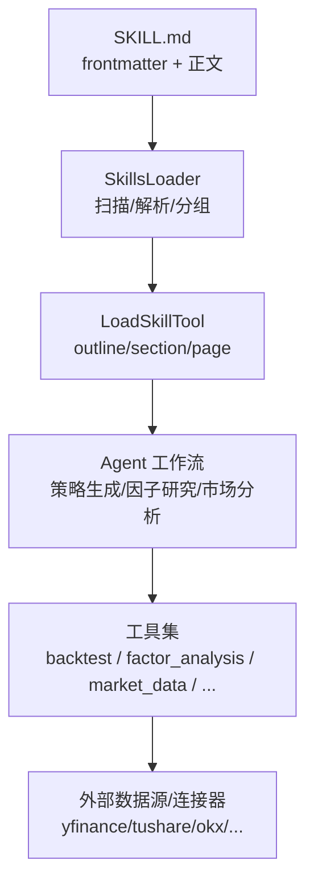
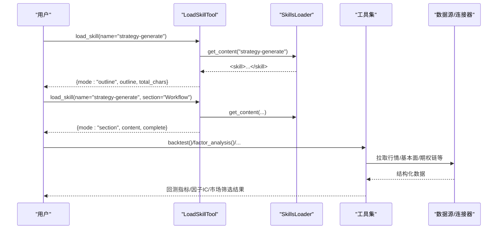
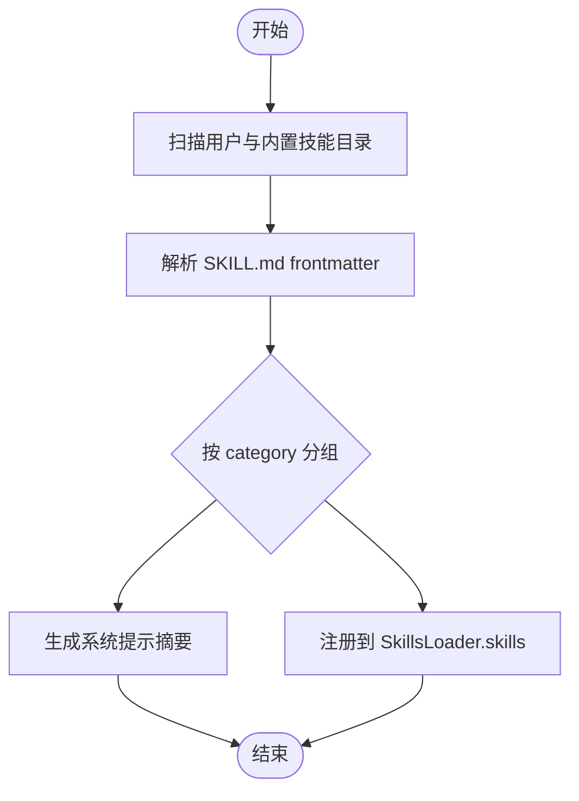
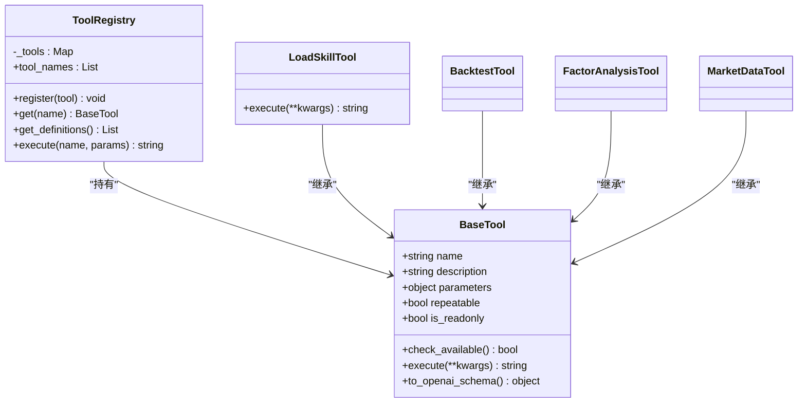
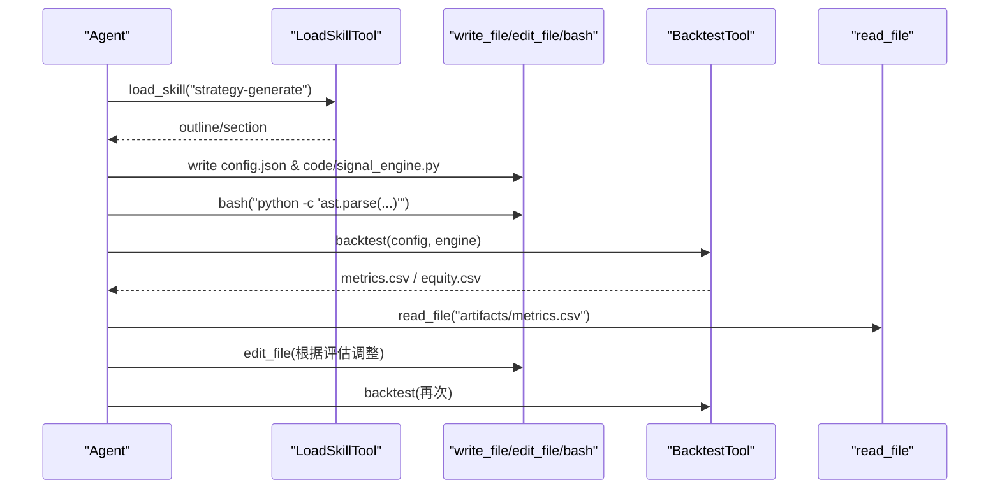
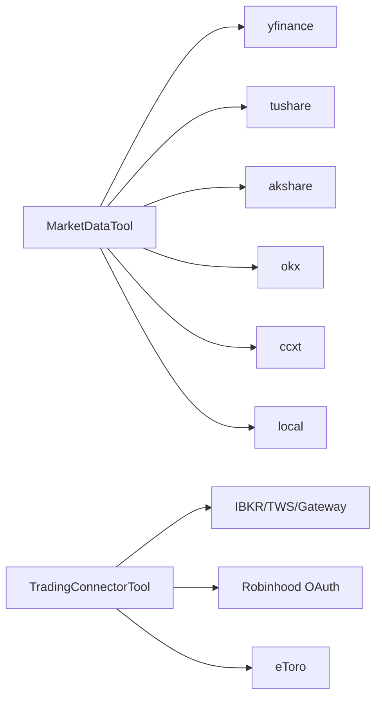

# 技能系统

<cite>
**本文引用的文件**
- [agent/SKILL.md](file://agent/SKILL.md)
- [agent/src/agent/skills.py](file://agent/src/agent/skills.py)
- [agent/src/agent/frontmatter.py](file://agent/src/agent/frontmatter.py)
- [agent/src/tools/load_skill_tool.py](file://agent/src/tools/load_skill_tool.py)
- [agent/src/tools/__init__.py](file://agent/src/tools/__init__.py)
- [agent/src/tools/backtest_tool.py](file://agent/src/tools/backtest_tool.py)
- [agent/src/tools/factor_analysis_tool.py](file://agent/src/tools/factor_analysis_tool.py)
- [agent/src/tools/market_data_tool.py](file://agent/src/tools/market_data_tool.py)
- [agent/src/tools/shadow_account_tool.py](file://agent/src/tools/shadow_account_tool.py)
- [agent/src/tools/swarm_tool.py](file://agent/src/tools/swarm_tool.py)
- [agent/src/tools/alpha_zoo_tool.py](file://agent/src/tools/alpha_zoo_tool.py)
- [agent/src/tools/options_pricing_tool.py](file://agent/src/tools/options_pricing_tool.py)
- [agent/src/tools/options_payoff_tool.py](file://agent/src/tools/options_payoff_tool.py)
- [agent/src/tools/pattern_tool.py](file://agent/src/tools/pattern_tool.py)
- [agent/src/tools/web_search_tool.py](file://agent/src/tools/web_search_tool.py)
- [agent/src/tools/read_file_tool.py](file://agent/src/tools/read_file_tool.py)
- [agent/src/tools/write_file_tool.py](file://agent/src/tools/write_file_tool.py)
- [agent/src/tools/doc_reader_tool.py](file://agent/src/tools/doc_reader_tool.py)
- [agent/src/tools/trading_connector_tool.py](file://agent/src/tools/trading_connector_tool.py)
- [agent/src/tools/qveris_tool.py](file://agent/src/tools/qveris_tool.py)
- [agent/src/tools/iwencai_tool.py](file://agent/src/tools/iwencai_tool.py)
- [agent/src/tools/fred_macro_tool.py](file://agent/src/tools/fred_macro_tool.py)
- [agent/src/tools/sec_filings_tool.py](file://agent/src/tools/sec_filings_tool.py)
- [agent/src/tools/stock_news_tool.py](file://agent/src/tools/stock_news_tool.py)
- [agent/src/tools/research_reports_tool.py](file://agent/src/tools/research_reports_tool.py)
- [agent/src/tools/get_market_data_size.py](file://agent/tests/test_get_market_data_size.py)
- [agent/src/tools/_result_paging.py](file://agent/src/tools/_result_paging.py)
- [agent/src/tools/_shell_safety.py](file://agent/src/tools/_shell_safety.py)
- [agent/src/tools/redaction.py](file://agent/src/tools/redaction.py)
- [agent/tests/test_skills.py](file://agent/tests/test_skills.py)
- [agent/tests/test_load_skill_paging.py](file://agent/tests/test_load_skill_paging.py)
- [agent/tests/test_skill_writer_tools.py](file://agent/tests/test_skill_writer_tools.py)
- [agent/tests/test_skill_reference_links.py](file://agent/tests/test_skill_reference_links.py)
</cite>

## 目录
1. [简介](#简介)
2. [项目结构](#项目结构)
3. [核心组件](#核心组件)
4. [架构总览](#架构总览)
5. [详细组件分析](#详细组件分析)
6. [依赖与集成分析](#依赖与集成分析)
7. [性能与分页特性](#性能与分页特性)
8. [故障排查指南](#故障排查指南)
9. [结论](#结论)
10. [附录：技能开发示例与最佳实践](#附录：技能开发示例与最佳实践)

## 简介
本文件系统性阐述 Vibe-Trading 的“技能系统”：技能的定义格式、加载机制、执行框架、内置技能分类、与工具的集成方式、参数传递、版本与依赖管理、冲突解决，以及测试与调试方法。目标是让开发者快速理解如何编写 SKILL.md、组织技能目录、调用工具完成策略生成、因子研究、市场分析等任务，并安全、可维护地扩展技能生态。

## 项目结构
技能系统由三部分构成：
- 技能文档层：每个技能一个目录，包含 SKILL.md（含 frontmatter 元数据）和可选支持文件（如 examples.md、references/）。
- 加载与解析层：SkillsLoader 负责扫描目录、解析 frontmatter、按类别分组、按需读取完整内容或分节返回。
- 工具与执行层：通过 BaseTool + ToolRegistry 注册工具；load_skill 工具提供大纲/分节/分页读取；其他工具（backtest、factor_analysis、market_data 等）在技能工作流中被调用。

图表来源
- [agent/src/agent/skills.py:100-189](file://agent/src/agent/skills.py#L100-L189)
- [agent/src/tools/load_skill_tool.py:150-307](file://agent/src/tools/load_skill_tool.py#L150-L307)
- [agent/SKILL.md:1-22](file://agent/SKILL.md#L1-L22)

章节来源
- [agent/src/agent/skills.py:100-189](file://agent/src/agent/skills.py#L100-L189)
- [agent/src/tools/load_skill_tool.py:150-307](file://agent/src/tools/load_skill_tool.py#L150-L307)
- [agent/SKILL.md:1-22](file://agent/SKILL.md#L1-L22)

## 核心组件
- Skill 数据类：封装单个技能的名称、描述、分类、正文、目录路径与元数据，并支持按需加载支持文件。
- SkillsLoader：从内置 skills/ 与用户 ~/.vibe-trading/skills/user/ 两个目录加载技能，用户技能同名覆盖内置技能；提供 get_descriptions（系统提示用摘要）、get_content（完整文档）。
- frontmatter 解析：轻量 YAML-like 解析器，支持字符串、列表、布尔值，提取 name/description/category/dependencies/env/mcp 等字段。
- LoadSkillTool：实现三种模式——document（整篇分页）、outline（大纲+首段）、section（指定标题段落），保证结果不超过工具输出限制，并提供 next_offset 以继续翻页。

章节来源
- [agent/src/agent/skills.py:22-60](file://agent/src/agent/skills.py#L22-L60)
- [agent/src/agent/skills.py:100-189](file://agent/src/agent/skills.py#L100-L189)
- [agent/src/agent/frontmatter.py:16-49](file://agent/src/agent/frontmatter.py#L16-L49)
- [agent/src/tools/load_skill_tool.py:150-307](file://agent/src/tools/load_skill_tool.py#L150-L307)

## 架构总览
技能系统采用“文档即实现”的模式：大量领域知识以 SKILL.md 形式存在，Agent 通过 load_skill 获取指导，再调用具体工具完成任务。

图表来源
- [agent/src/tools/load_skill_tool.py:196-307](file://agent/src/tools/load_skill_tool.py#L196-L307)
- [agent/src/agent/skills.py:166-189](file://agent/src/agent/skills.py#L166-L189)
- [agent/src/tools/backtest_tool.py](file://agent/src/tools/backtest_tool.py)
- [agent/src/tools/factor_analysis_tool.py](file://agent/src/tools/factor_analysis_tool.py)
- [agent/src/tools/market_data_tool.py](file://agent/src/tools/market_data_tool.py)

## 详细组件分析

### 技能定义格式与加载机制
- SKILL.md 必须包含 frontmatter 块，至少声明 name；可选 description/category/dependencies/env/mcp 等。
- SkillsLoader 会先加载用户目录技能，再加载内置目录，同名覆盖，便于热更新与补丁。
- 系统提示仅注入分类后的简短描述（get_descriptions），避免一次性塞入过多上下文。
- 完整文档通过 load_skill 按需加载，超长文档自动返回 outline，引导 Agent 选择 section 或继续 offset 翻页。

图表来源
- [agent/src/agent/skills.py:120-164](file://agent/src/agent/skills.py#L120-L164)
- [agent/src/agent/frontmatter.py:16-49](file://agent/src/agent/frontmatter.py#L16-L49)

章节来源
- [agent/src/agent/skills.py:120-189](file://agent/src/agent/skills.py#L120-L189)
- [agent/src/agent/frontmatter.py:16-49](file://agent/src/agent/frontmatter.py#L16-L49)

### 技能执行框架与工具集成
- BaseTool 抽象出 name/description/parameters/repeatable/is_readonly，并提供 to_openai_schema 用于函数调用协议。
- ToolRegistry 集中注册与执行工具，统一错误包装为 JSON，保障 LLM 侧稳定消费。
- 技能文档中通过自然语言指引 Agent 调用工具（例如 strategy-generate 引导写 config.json 与 signal_engine.py，然后调用 backtest）。
- 工具之间通过标准化输入输出协作：例如 market_data 提供 OHLCV，backtest 消费该数据计算收益曲线与指标。

图表来源
- [agent/src/tools/__init__.py](file://agent/src/tools/__init__.py)
- [agent/src/tools/load_skill_tool.py:150-307](file://agent/src/tools/load_skill_tool.py#L150-L307)
- [agent/src/tools/backtest_tool.py](file://agent/src/tools/backtest_tool.py)
- [agent/src/tools/factor_analysis_tool.py](file://agent/src/tools/factor_analysis_tool.py)
- [agent/src/tools/market_data_tool.py](file://agent/src/tools/market_data_tool.py)

章节来源
- [agent/src/tools/load_skill_tool.py:150-307](file://agent/src/tools/load_skill_tool.py#L150-L307)
- [agent/src/tools/__init__.py](file://agent/src/tools/__init__.py)

### 内置技能功能分类
根据 agent/SKILL.md 与 skills/ 目录，内置技能覆盖以下专业领域：
- 策略生成与回测：strategy-generate、backtest-diagnose、cross-market-strategy、multi-factor、pair-trading、event-driven、seasonal、technical-basic、volatility、minute-analysis、ichimoku、harmonic、elliott-wave、chanlun、smc、pine-script、performance-attribution、valuation-model、fundamental-filter、execution-model、hedging-strategy、options-strategy、options-payoff、options-advanced、crypto-derivatives、convertible-bond、commodity-analysis、asset-allocation、global-macro、macro-analysis、sector-rotation、correlation-analysis、correlation-regime、quant-statistics、ml-strategy、behavioral-finance、research-discipline、trade-journal、shadow-account、report-generate、thesis-tracker、bottleneck-hunter、regulatory-knowledge、private-company-research、management-deep-dive、deep-company-series、edgar-sec-filings、sec-edgar、earnings-forecast、earnings-revision、financial-statement、credit-analysis、us-etf-flow、hk-connect-flow、stablecoin-flow、onchain-analysis、defi-yield、token-unlock-treasury、liquidation-heatmap、perp-funding-basis、social-media-intelligence、sentiment-analysis、geopolitical-risk、market-microstructure、data-routing、web-reader、doc-reader、akshare、ccxt、eastmoney、mootdx、tushare、yfinance、okx-market、qveris、alpha-zoo、investor-lenses、adr-hshare、vnpy-export。
- 因子研究与 Alpha Zoo：alpha-zoo、factor-research、multi-factor、quant-statistics、benchmarking via alpha_bench/alpha_compare。
- 市场分析：pattern_recognition、screen_market、get_market_data、fund_flow、dragon_tiger、northbound_flow、margin_trading、block_trades、shareholder_count、lockup_expiry、sector_info、stock_news、research_reports、sec_filings、financial_statements、options_chain、stock_profile、prediction_market、orderbook_depth、taiwan_stock_data、fred_macro、iwencai_search、qveris_*。
- 多智能体与编排：swarm（run_swarm、list_swarm_presets、status、retry、reap_stale_runs）。
- 交易连接与实盘：trading_connections/select/check/account/positions/orders/quote/history。

章节来源
- [agent/SKILL.md:121-199](file://agent/SKILL.md#L121-L199)
- [agent/src/skills/*](file://agent/src/skills/)

### 技能开发示例：编写 SKILL.md 与工具调用流程
以 strategy-generate 为例，典型流程：
- 解析需求：确定标的、时间范围、策略逻辑，写入 config.json。
- 设计策略：明确数据、信号、仓位、回测、验证五要素。
- 编码信号：实现 SignalEngine.generate(data_map)，返回 [-1,1] 权重序列。
- 语法检查：使用 bash 工具校验 Python 语法。
- 运行回测：调用 backtest 工具，读取 artifacts/metrics.csv 与 equity.csv 评估。
- 迭代优化：edit_file 修改后再次回测。

图表来源
- [agent/src/skills/strategy-generate/SKILL.md:7-18](file://agent/src/skills/strategy-generate/SKILL.md#L7-L18)
- [agent/src/tools/backtest_tool.py](file://agent/src/tools/backtest_tool.py)
- [agent/src/tools/write_file_tool.py](file://agent/src/tools/write_file_tool.py)
- [agent/src/tools/read_file_tool.py](file://agent/src/tools/read_file_tool.py)
- [agent/src/tools/bash_tool.py](file://agent/src/tools/bash_tool.py)

章节来源
- [agent/src/skills/strategy-generate/SKILL.md:7-18](file://agent/src/skills/strategy-generate/SKILL.md#L7-L18)
- [agent/src/tools/backtest_tool.py](file://agent/src/tools/backtest_tool.py)

### 参数传递与工具契约
- 工具参数通过 JSON Schema 描述（BaseTool.parameters），LLM 据此构造调用。
- 工具执行返回 JSON 字符串，ToolRegistry.execute 统一捕获异常并返回标准 error 结构。
- 技能文档约定输入输出格式（例如 config.json 字段、SignalEngine.generate 返回值），确保跨工具一致性。

章节来源
- [agent/src/tools/__init__.py:13-51](file://agent/src/tools/__init__.py#L13-L51)
- [agent/src/tools/__init__.py:54-95](file://agent/src/tools/__init__.py#L54-L95)
- [agent/src/skills/strategy-generate/SKILL.md:45-70](file://agent/src/skills/strategy-generate/SKILL.md#L45-L70)

### 版本管理、依赖检查与冲突解决
- 版本管理：SKILL.md frontmatter 中的 version 字段标识技能版本；agent/SKILL.md 顶层也声明了整体包的版本。
- 依赖检查：BaseTool.check_available 允许子类检查 API Key、包安装等；未满足时工具可从注册表排除。
- 冲突解决：用户技能目录优先于内置目录，同名覆盖；ToolsRegistry 以 name 为键，天然去重。

章节来源
- [agent/SKILL.md:1-22](file://agent/SKILL.md#L1-L22)
- [agent/src/agent/skills.py:120-136](file://agent/src/agent/skills.py#L120-L136)
- [agent/src/tools/__init__.py:30-36](file://agent/src/tools/__init__.py#L30-L36)

### 技能与工具的集成方式
- 技能文档作为“操作手册”，引导 Agent 顺序调用工具。
- 工具通过 ToolRegistry 暴露给 Agent；load_skill 是入口之一，其他工具（backtest、factor_analysis、market_data 等）在技能流程中被调用。
- 外部 MCP 服务器工具可通过 agent.json 配置加载，命名空间前缀 mcp_<server>_<tool>，与本地工具共存。

章节来源
- [agent/SKILL.md:209-374](file://agent/SKILL.md#L209-L374)
- [agent/src/tools/load_skill_tool.py:150-307](file://agent/src/tools/load_skill_tool.py#L150-L307)

## 依赖与集成分析
- 数据源与连接器：yfinance、tushare、akshare、baostock、tencent、sina、eastmoney、mootdx、ccxt、okx、longbridge、finnhub、alphavantage、tiingo、fmp、qveris、mt5、futu、pykrx、local 等，通过 market_data_tool 与相关 loader 组合，自动探测与降级。
- 交易连接器：trading_connector_tool 提供账户、持仓、订单、报价、历史等统一接口，屏蔽底层券商差异。
- 外部服务：FRED、SEC EDGAR、QVeris、Iwencai 等通过专用工具接入。
- 安全与沙箱：bash 工具具备沙箱与安全限制；结果脱敏（redaction）；分页与限长防止溢出。

图表来源
- [agent/src/tools/market_data_tool.py](file://agent/src/tools/market_data_tool.py)
- [agent/src/tools/trading_connector_tool.py](file://agent/src/tools/trading_connector_tool.py)
- [agent/SKILL.md:76-89](file://agent/SKILL.md#L76-L89)

章节来源
- [agent/SKILL.md:76-89](file://agent/SKILL.md#L76-L89)
- [agent/src/tools/market_data_tool.py](file://agent/src/tools/market_data_tool.py)
- [agent/src/tools/trading_connector_tool.py](file://agent/src/tools/trading_connector_tool.py)

## 性能与分页特性
- 超大技能文档：load_skill 自动返回 outline，避免一次性传输过长文本；section 模式精准定位；offset 分页逐步读取。
- 结果限长：所有工具输出受 TOOL_RESULT_LIMIT 约束，分页算法动态调整页大小，确保不超限且能收敛。
- 内存与 I/O：SkillsLoader 延迟加载支持文件；frontmatter 解析轻量；split_sections 基于正则与行扫描，复杂度线性。

章节来源
- [agent/src/tools/load_skill_tool.py:106-147](file://agent/src/tools/load_skill_tool.py#L106-L147)
- [agent/src/tools/load_skill_tool.py:196-307](file://agent/src/tools/load_skill_tool.py#L196-L307)
- [agent/src/agent/skills.py:229-278](file://agent/src/agent/skills.py#L229-L278)

## 故障排查指南
- 技能未找到：确认 name 正确；若为用户新增技能，检查 ~/.vibe-trading/skills/user/<name>/SKILL.md 是否存在。
- 分节歧义：当文档内重复标题时，需使用 “父级 > 子级” 的路径精确指定。
- 工具不可用：检查 BaseTool.check_available 是否返回 True（如 API Key、包安装）；查看 ToolRegistry 是否注册成功。
- 数据源失败：market_data_tool 支持多源自动降级；检查网络、代理、密钥；必要时显式指定 source。
- 回测无交易：检查信号逻辑、lookback、阈值、数据对齐；参考 strategy-generate 的质量清单。
- 结果截断：使用 load_skill 的 next_offset 继续读取；或使用 section 模式直接获取目标段落。

章节来源
- [agent/src/tools/load_skill_tool.py:227-247](file://agent/src/tools/load_skill_tool.py#L227-L247)
- [agent/src/tools/__init__.py:72-84](file://agent/src/tools/__init__.py#L72-L84)
- [agent/src/skills/strategy-generate/SKILL.md:162-184](file://agent/src/skills/strategy-generate/SKILL.md#L162-L184)

## 结论
Vibe-Trading 的技能系统以“文档即实现”为核心，结合灵活的加载机制、标准化的工具契约与强大的数据/交易连接器，形成可扩展、可测试、可维护的量化研究平台。通过 SKILL.md 规范、load_skill 的分页与分节能力、以及丰富的内置技能与工具，用户可以高效完成策略生成、因子研究、市场分析、期权定价、多智能体协作等任务。

## 附录：技能开发示例与最佳实践
- 新建技能目录：在 ~/.vibe-trading/skills/user/<your-skill>/ 下创建 SKILL.md，声明 name/description/category。
- 编写工作流：在 SKILL.md 中清晰描述步骤、输入输出、工具调用顺序与参数。
- 复用现有工具：通过 load_skill 学习已有技能的工作流，再组合 backtest、factor_analysis、market_data 等工具。
- 测试与调试：
  - 单元测试：参考 test_skills.py、test_load_skill_paging.py，验证 frontmatter 解析、加载顺序、分页行为。
  - 技能引用链接：参考 test_skill_reference_links.py，确保 references/ 下的资源可达。
  - 技能编写工具：参考 test_skill_writer_tools.py，验证 write_file/edit_file 的安全性与可用性。
- 安全与合规：
  - 敏感信息脱敏：使用 redaction 模块处理日志与输出。
  - Shell 安全：bash 工具具备沙箱限制，避免任意命令执行风险。
  - 结果分页：遵循 TOOL_RESULT_LIMIT，避免大响应导致超时或截断。

章节来源
- [agent/tests/test_skills.py:17-78](file://agent/tests/test_skills.py#L17-L78)
- [agent/tests/test_load_skill_paging.py:51-110](file://agent/tests/test_load_skill_paging.py#L51-L110)
- [agent/tests/test_skill_writer_tools.py](file://agent/tests/test_skill_writer_tools.py)
- [agent/tests/test_skill_reference_links.py](file://agent/tests/test_skill_reference_links.py)
- [agent/src/tools/redaction.py](file://agent/src/tools/redaction.py)
- [agent/src/tools/_shell_safety.py](file://agent/src/tools/_shell_safety.py)