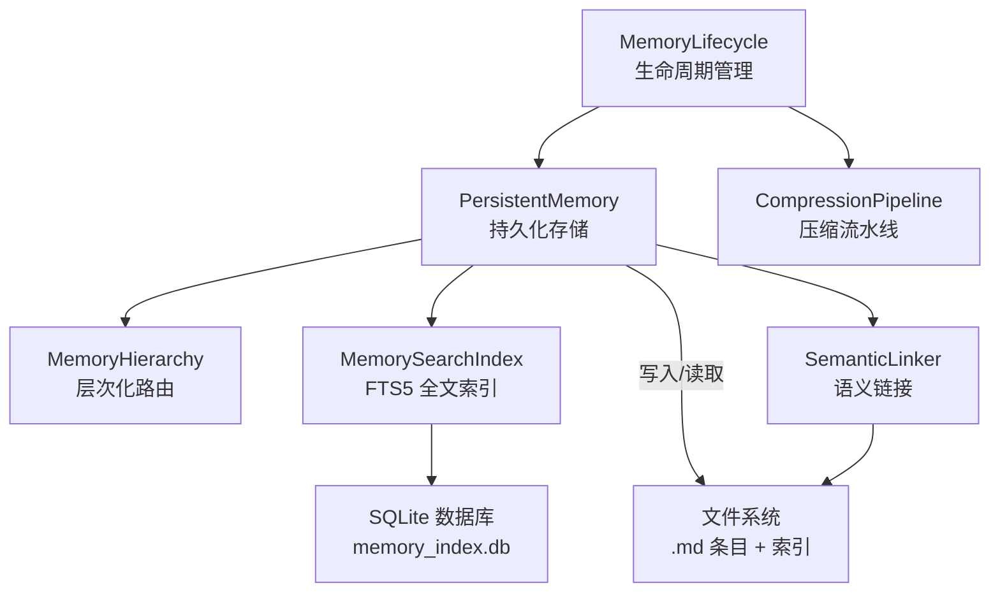
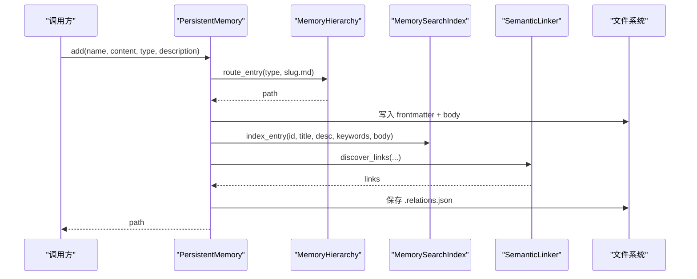
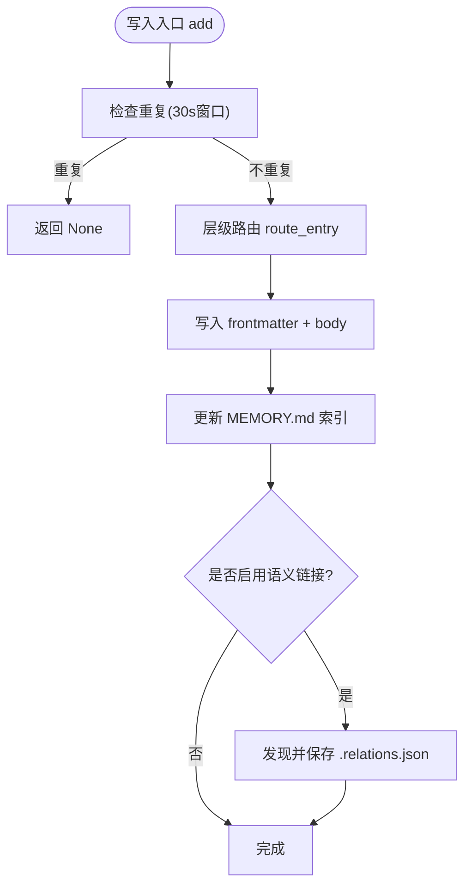
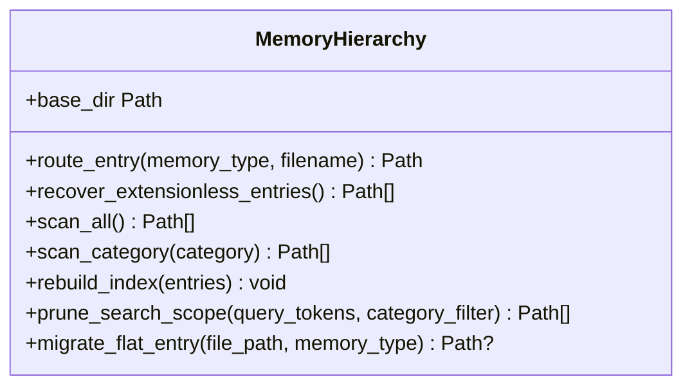
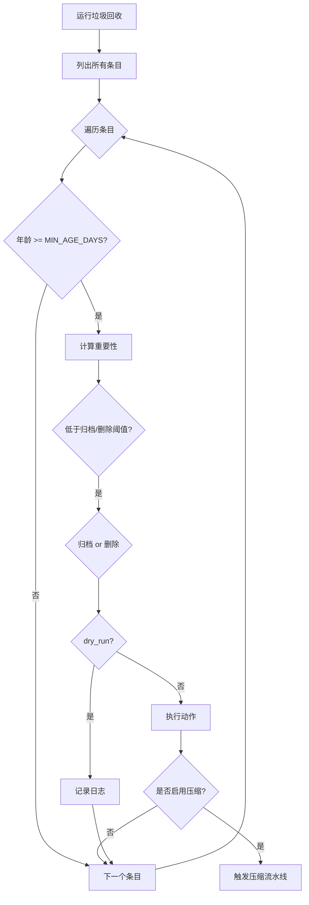
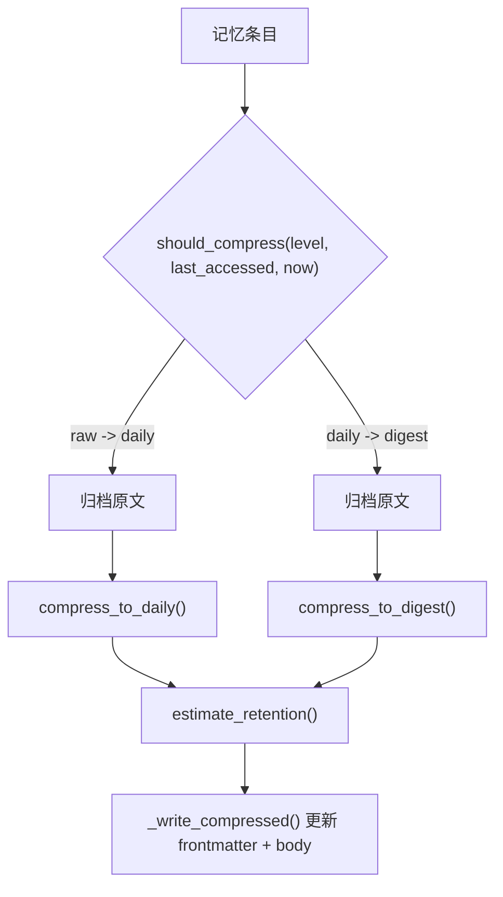
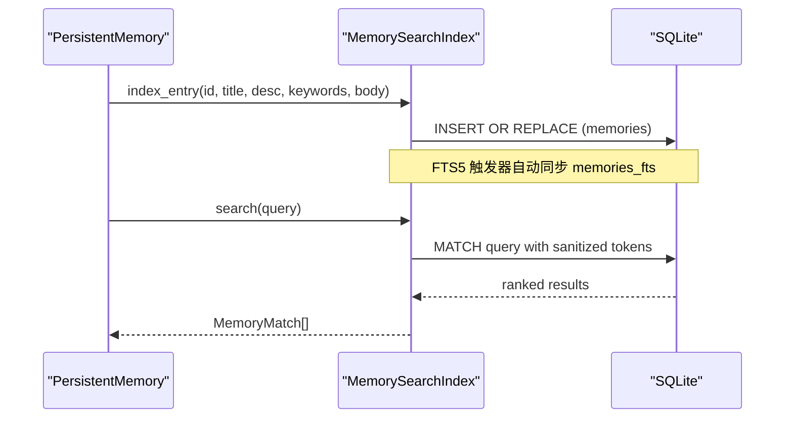
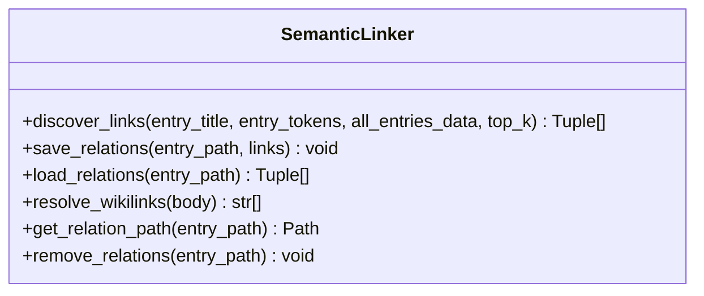
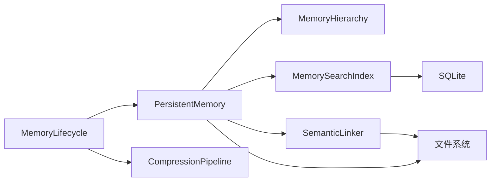

# 分层记忆架构

<cite>
**本文引用的文件**
- [persistent.py](file://agent/src/memory/persistent.py)
- [hierarchy.py](file://agent/src/memory/hierarchy.py)
- [lifecycle.py](file://agent/src/memory/lifecycle.py)
- [compression.py](file://agent/src/memory/compression.py)
- [search_index.py](file://agent/src/memory/search_index.py)
- [semantic_links.py](file://agent/src/memory/semantic_links.py)
- [test_memory_lifecycle.py](file://agent/tests/test_memory_lifecycle.py)
- [test_persistent_memory.py](file://agent/tests/test_persistent_memory.py)
</cite>

## 目录
1. [简介](#简介)
2. [项目结构](#项目结构)
3. [核心组件](#核心组件)
4. [架构总览](#架构总览)
5. [详细组件分析](#详细组件分析)
6. [依赖关系分析](#依赖关系分析)
7. [性能考量](#性能考量)
8. [故障排查指南](#故障排查指南)
9. [结论](#结论)
10. [附录：使用示例与最佳实践](#附录使用示例与最佳实践)

## 简介
本文件系统性阐述 Vibe-Trading 的分层记忆系统设计理念与实现机制。该系统以“持久化存储 + 层次化路由 + 生命周期管理 + 压缩归档 + 全文检索 + 语义关联”为核心，提供跨会话的记忆能力，支持在用户、反馈、项目、参考等类别之间组织记忆，并通过质量评分、访问衰减、垃圾回收与自动压缩，实现容量控制与长期可维护性。同时，通过 SQLite FTS5 全文索引与 BM25 语义链接，提升查询效率与上下文召回质量。

## 项目结构
记忆子系统位于 agent/src/memory，主要模块如下：
- persistent.py：持久化存储、条目模型、基础读写、去重、索引快照、重要性计算
- hierarchy.py：按 memory_type 分类的目录路由与扫描优化
- lifecycle.py：质量强化、访问追踪、重要性衰减、垃圾回收（归档/删除）
- compression.py：三级压缩（raw → daily → digest），基于 TF-IDF 关键句提取与摘要生成
- search_index.py：SQLite FTS5 全文检索索引，CJK 分词与查询增强
- semantic_links.py：BM25 语义链接发现与 .relations.json 侧边文件管理

图表来源
- [persistent.py:196-637](file://agent/src/memory/persistent.py#L196-L637)
- [hierarchy.py:34-436](file://agent/src/memory/hierarchy.py#L34-L436)
- [lifecycle.py:71-421](file://agent/src/memory/lifecycle.py#L71-L421)
- [compression.py:160-353](file://agent/src/memory/compression.py#L160-L353)
- [search_index.py:113-481](file://agent/src/memory/search_index.py#L113-L481)
- [semantic_links.py:158-372](file://agent/src/memory/semantic_links.py#L158-L372)

章节来源
- [persistent.py:196-637](file://agent/src/memory/persistent.py#L196-L637)
- [hierarchy.py:34-436](file://agent/src/memory/hierarchy.py#L34-L436)
- [lifecycle.py:71-421](file://agent/src/memory/lifecycle.py#L71-L421)
- [compression.py:160-353](file://agent/src/memory/compression.py#L160-L353)
- [search_index.py:113-481](file://agent/src/memory/search_index.py#L113-L481)
- [semantic_links.py:158-372](file://agent/src/memory/semantic_links.py#L158-L372)

## 核心组件
- PersistentMemory：负责记忆条目的创建、查找、删除、去重、索引快照、重要性计算；支持层级路由与可选的 FTS5/语义链接集成。
- MemoryHierarchy：将记忆按类型路由到子目录（user/feedback/project/reference），并提供按类别扫描与关键词重叠排序的搜索范围裁剪。
- MemoryLifecycle：封装质量强化、访问计数、重要性衰减、垃圾回收（归档/删除）、以及触发压缩流水线。
- CompressionPipeline：三级压缩策略（raw/daily/digest），基于 TF-IDF 关键句提取与摘要生成，并保留原始内容至 archive。
- MemorySearchIndex：SQLite FTS5 全文索引，支持 CJK 单字/双字扩展、安全查询构造、自动重建与结果映射。
- SemanticLinker：基于 BM25 的语义链接发现，持久化为 .relations.json 侧边文件，支持显式 wikilink 引用解析。

章节来源
- [persistent.py:122-637](file://agent/src/memory/persistent.py#L122-L637)
- [hierarchy.py:34-436](file://agent/src/memory/hierarchy.py#L34-L436)
- [lifecycle.py:71-421](file://agent/src/memory/lifecycle.py#L71-L421)
- [compression.py:160-353](file://agent/src/memory/compression.py#L160-L353)
- [search_index.py:113-481](file://agent/src/memory/search_index.py#L113-L481)
- [semantic_links.py:158-372](file://agent/src/memory/semantic_links.py#L158-L372)

## 架构总览
分层记忆系统围绕“写路径”和“读路径”展开：
- 写路径：add() 生成 frontmatter 与 body，必要时通过 hierarchy.route_entry() 路由到类别目录；更新 MEMORY.md 索引；可选写入 FTS5 索引与语义链接；并发写通过文件锁保护。
- 读路径：list_entries() 扫描所有 .md（支持层级扫描），解析 frontmatter 并计算 importance；find_relevant() 优先走 FTS5 索引，否则回退到 token 加权匹配；可选扩展语义链接结果。
- 生命周期：reinforce() 调整 quality_score；track_access() 更新访问计数；run_gc() 依据阈值归档或删除低重要性条目，并在非 dry_run 时触发压缩流水线。
- 压缩：根据 last_accessed 与当前时间差决定目标级别（daily/digest），先归档原文再重写 frontmatter 与 body。

图表来源
- [persistent.py:462-578](file://agent/src/memory/persistent.py#L462-L578)
- [hierarchy.py:70-90](file://agent/src/memory/hierarchy.py#L70-L90)
- [search_index.py:207-241](file://agent/src/memory/search_index.py#L207-L241)
- [semantic_links.py:179-230](file://agent/src/memory/semantic_links.py#L179-L230)

章节来源
- [persistent.py:462-578](file://agent/src/memory/persistent.py#L462-L578)
- [hierarchy.py:70-90](file://agent/src/memory/hierarchy.py#L70-L90)
- [search_index.py:207-241](file://agent/src/memory/search_index.py#L207-L241)
- [semantic_links.py:179-230](file://agent/src/memory/semantic_links.py#L179-L230)

## 详细组件分析

### 持久化存储（PersistentMemory）
- 数据模型：MemoryEntry 包含标题、描述、类型、正文、时间戳、关键词、质量分数、访问次数、最后访问时间、重要性、相关记忆、类别、压缩级别等字段。
- 存储策略：默认 base_dir 下扁平存储；启用层级后按 memory_type 路由到子目录；frontmatter 中记录元数据，body 为实际内容。
- 访问模式：
  - list_entries()：扫描 .md 文件并解析 frontmatter，计算 importance（考虑 decay）。
  - find()：精确匹配标题或文件名 stem。
  - find_relevant()：优先 FTS5 全文检索，失败回退到 token 加权匹配；可选扩展语义链接结果。
- 生命周期管理：
  - is_duplicate()：30 秒滑动窗口去重，避免重复写入。
  - remove()/remove_entry()：删除条目并重建索引，清理 FTS5 与语义链接。
- 并发与一致性：
  - memory_lock()：基于 fcntl 的文件级独占锁，超时返回 False。
  - 原子写：临时文件 + os.replace 保证写入一致性。
- 索引快照：MEMORY.md 作为快速索引，init 时加载为冻结快照用于系统提示注入。

图表来源
- [persistent.py:440-578](file://agent/src/memory/persistent.py#L440-L578)
- [hierarchy.py:70-90](file://agent/src/memory/hierarchy.py#L70-L90)

章节来源
- [persistent.py:122-637](file://agent/src/memory/persistent.py#L122-L637)

### 层次化路由（MemoryHierarchy）
- 设计目标：将 O(n) 全量扫描转换为 O(category_size) 定向扫描，提高检索效率。
- 类别目录：user、feedback、project、reference；未知类型回退到 base_dir。
- 功能：
  - route_entry()：确定存储路径，按需创建类别目录。
  - scan_all()/scan_category()：扫描 base_dir 与类别目录下的 .md 文件。
  - prune_search_scope()：基于关键词重叠对类别进行优先级排序，仍返回全部文件以保证兼容性。
  - recover_extensionless_entries()：修复历史无后缀条目，确保可见性。
  - rebuild_index()：生成 .hierarchy.yaml 索引，记录每类别统计与关键词。
  - migrate_flat_entry()：将扁平条目迁移到对应类别目录。

图表来源
- [hierarchy.py:34-436](file://agent/src/memory/hierarchy.py#L34-L436)

章节来源
- [hierarchy.py:34-436](file://agent/src/memory/hierarchy.py#L34-L436)

### 生命周期管理（MemoryLifecycle）
- 质量强化：reinforce() 根据事件（任务成功/失败、用户确认/拒绝、被动衰减）调整 quality_score，限制单次会话增量上限。
- 访问追踪：track_access() 增加 access_count 并更新 last_accessed。
- 重要性衰减：compute_importance() 基于 Ebbinghaus 遗忘曲线与访问奖励计算重要性。
- 垃圾回收：run_gc() 依据阈值（ARCHIVE_THRESHOLD、DELETE_THRESHOLD、MIN_AGE_DAYS、MAX_MEMORY_COUNT）执行归档或删除；在 non-dry_run 且启用压缩时，触发压缩流水线。
- 原子更新：_update_frontmatter_field() 与 _write_compressed() 使用临时文件 + os.replace 保证一致性。

图表来源
- [lifecycle.py:183-273](file://agent/src/memory/lifecycle.py#L183-L273)
- [persistent.py:80-91](file://agent/src/memory/persistent.py#L80-L91)

章节来源
- [lifecycle.py:71-421](file://agent/src/memory/lifecycle.py#L71-L421)
- [persistent.py:80-91](file://agent/src/memory/persistent.py#L80-L91)

### 压缩流水线（CompressionPipeline）
- 三级压缩：
  - raw：原始内容。
  - daily：基于 TF-IDF 的关键句提取（保留首尾句与 top-k 中间句），附带关键词头。
  - digest：提取高频重要术语并以要点形式输出，最大 token 数限制。
- 触发条件：根据 last_accessed 与当前时间差判断是否需要压缩到 daily 或 digest。
- 数据安全：压缩前归档原文到 archive/；写入时使用临时文件 + os.replace。
- 信息保留估计：estimate_retention() 用 Jaccard 相似度估算压缩前后 token 集的重叠度。

图表来源
- [compression.py:168-353](file://agent/src/memory/compression.py#L168-L353)
- [lifecycle.py:323-379](file://agent/src/memory/lifecycle.py#L323-L379)

章节来源
- [compression.py:160-353](file://agent/src/memory/compression.py#L160-L353)
- [lifecycle.py:323-379](file://agent/src/memory/lifecycle.py#L323-L379)

### 全文检索（MemorySearchIndex）
- 索引结构：memories 表 + memories_fts 虚拟表（FTS5），通过触发器保持同步。
- CJK 处理：插入时展开为单字+双字以提升匹配；查询时对连续 CJK 字符生成单字/双字 token；显示时去除多余空格与重复片段。
- 查询流程：sanitize_query() 构造安全 MATCH 表达式；若 FTS5 不可用则回退到内存扫描。
- 批量重建：rebuild_all() 清空并重新索引，用于与持久化存储对齐。

图表来源
- [search_index.py:147-196](file://agent/src/memory/search_index.py#L147-L196)
- [search_index.py:207-241](file://agent/src/memory/search_index.py#L207-L241)
- [search_index.py:252-302](file://agent/src/memory/search_index.py#L252-L302)

章节来源
- [search_index.py:113-481](file://agent/src/memory/search_index.py#L113-L481)

### 语义链接（SemanticLinker）
- 链接发现：基于 BM25 计算源条目与候选条目的相似度，过滤阈值并限制出边数量。
- 持久化：.relations.json 侧边文件，版本化并记录更新时间；写入采用临时文件 + os.replace。
- 显式引用：解析正文中的 [[6-char-hex-id]] 形式的 wikilink，便于显式关联。
- 集成：在 find_relevant() 中可扩展搜索结果，加入与命中条目相关的其他记忆。

图表来源
- [semantic_links.py:158-372](file://agent/src/memory/semantic_links.py#L158-L372)

章节来源
- [semantic_links.py:158-372](file://agent/src/memory/semantic_links.py#L158-L372)

## 依赖关系分析
- PersistentMemory 依赖：
  - MemoryHierarchy：当层级启用时，用于路由与扫描。
  - MemorySearchIndex：当 FTS5 启用时，用于全文检索与索引维护。
  - SemanticLinker：当链接启用时，用于发现与持久化语义关系。
- MemoryLifecycle 依赖：
  - PersistentMemory：读取/更新条目元数据。
  - CompressionPipeline：在 GC 阶段触发压缩。
- 外部依赖：
  - SQLite（FTS5）：全文检索后端。
  - 文件系统：.md 条目、MEMORY.md 索引、.hierarchy.yaml、.relations.json、archive/、gc.log。

图表来源
- [persistent.py:196-637](file://agent/src/memory/persistent.py#L196-L637)
- [lifecycle.py:71-421](file://agent/src/memory/lifecycle.py#L71-L421)
- [search_index.py:113-481](file://agent/src/memory/search_index.py#L113-L481)
- [semantic_links.py:158-372](file://agent/src/memory/semantic_links.py#L158-L372)

章节来源
- [persistent.py:196-637](file://agent/src/memory/persistent.py#L196-L637)
- [lifecycle.py:71-421](file://agent/src/memory/lifecycle.py#L71-L421)
- [search_index.py:113-481](file://agent/src/memory/search_index.py#L113-L481)
- [semantic_links.py:158-372](file://agent/src/memory/semantic_links.py#L158-L372)

## 性能考量
- 检索复杂度：
  - 层级路由将 O(n) 扫描降为 O(category_size)，结合关键词重叠排序进一步减少 IO。
  - FTS5 全文检索提供 O(log n) 级别匹配，显著优于逐条 token 匹配。
- 写入开销：
  - 去重窗口（30 秒）降低重试或并行导致的重复写入。
  - 原子写（临时文件 + os.replace）避免部分写入导致的数据损坏。
- 压缩策略：
  - daily 压缩保留首尾句与 top-k 关键句，兼顾可读性与体积缩减。
  - digest 压缩仅保留核心概念与关键词，适合长期归档。
- 容量控制：
  - MAX_MEMORY_COUNT、ARCHIVE_THRESHOLD、DELETE_THRESHOLD、MIN_AGE_DAYS 共同约束存储规模。
- 并发安全：
  - 文件级独占锁防止多进程/多线程竞争。
  - 线程安全的共享索引单例（get_shared_index）减少连接开销。

[本节为通用性能讨论，无需特定文件来源]

## 故障排查指南
- 质量评分未生效：
  - 检查 VT_MEMORY_QUALITY 是否启用；reinforce() 会因标志关闭而直接返回 False。
  - 确认条目存在且名称精确匹配；session delta 上限可能阻止后续更新。
- 垃圾回收未执行：
  - 检查 VT_MEMORY_GC 是否启用；若启用压缩但未启用 GC，会发出警告。
  - 条目需满足最小年龄阈值才会被评估。
- 压缩未触发：
  - 检查 last_accessed 与当前时间差是否超过阈值；确认 compression_level 状态。
  - 归档失败会导致压缩中止，需检查 archive/ 权限与磁盘空间。
- 全文检索为空：
  - 若 FTS5 不可用，将回退到内存扫描；首次空搜索可能触发自动重建。
  - 检查 CJK 查询是否被正确展开为单字/双字 token。
- 语义链接缺失：
  - 检查 VT_MEMORY_LINKS 是否启用；确认 .relations.json 是否存在且格式正确。
  - 显式 wikilink 引用需符合 [[6-char-hex-id]] 格式。

章节来源
- [test_memory_lifecycle.py:228-305](file://agent/tests/test_memory_lifecycle.py#L228-L305)
- [test_persistent_memory.py:285-340](file://agent/tests/test_persistent_memory.py#L285-L340)
- [search_index.py:252-302](file://agent/src/memory/search_index.py#L252-L302)
- [semantic_links.py:321-344](file://agent/src/memory/semantic_links.py#L321-L344)

## 结论
Vibe-Trading 的分层记忆系统通过清晰的职责划分与模块化设计，实现了高可用、可扩展、可维护的记忆能力。层级路由与全文检索显著提升查询效率；生命周期管理与压缩流水线保障长期存储健康；语义链接增强上下文召回质量。整体方案在保证一致性与并发安全的前提下，提供了灵活的配置开关与完善的错误处理，适用于复杂交易研究场景中的知识沉淀与复用。

[本节为总结性内容，无需特定文件来源]

## 附录：使用示例与最佳实践
- 创建记忆
  - 使用 PersistentMemory.add() 创建新条目，指定 name、content、type、description。
  - 启用层级后，条目将被路由到对应类别目录（如 project/xxx.md）。
  - 参考测试用例验证写入与索引更新行为。
- 查询记忆
  - 使用 find_relevant() 进行关键词检索；若启用 FTS5，将获得更优性能与相关性排序。
  - 可通过语义链接扩展结果，获取与命中条目相关的其他记忆。
- 更新记忆
  - 使用 MemoryLifecycle.reinforce() 根据反馈事件调整 quality_score。
  - 使用 track_access() 记录访问行为，影响重要性衰减。
- 生命周期管理
  - 定期运行 run_gc(dry_run=False) 执行归档/删除，并结合压缩流水线降低存储占用。
  - 监控 gc.log 了解决策原因与效果。
- 压缩与降级
  - 根据 last_accessed 自动决定压缩级别；digest 适合长期归档，daily 适合中期保留。
  - 压缩前会归档原文，确保可恢复性。
- 数据一致性
  - 所有写操作均通过文件锁与原子写保证一致性。
  - 索引（MEMORY.md、.hierarchy.yaml、FTS5、.relations.json）在写入后重建或同步。

章节来源
- [test_persistent_memory.py:124-245](file://agent/tests/test_persistent_memory.py#L124-L245)
- [test_memory_lifecycle.py:228-305](file://agent/tests/test_memory_lifecycle.py#L228-L305)
- [persistent.py:462-578](file://agent/src/memory/persistent.py#L462-L578)
- [lifecycle.py:183-273](file://agent/src/memory/lifecycle.py#L183-L273)
- [compression.py:168-353](file://agent/src/memory/compression.py#L168-L353)