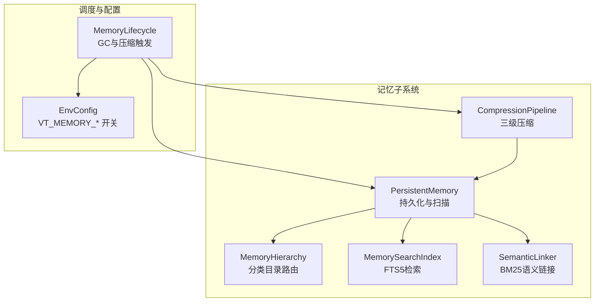
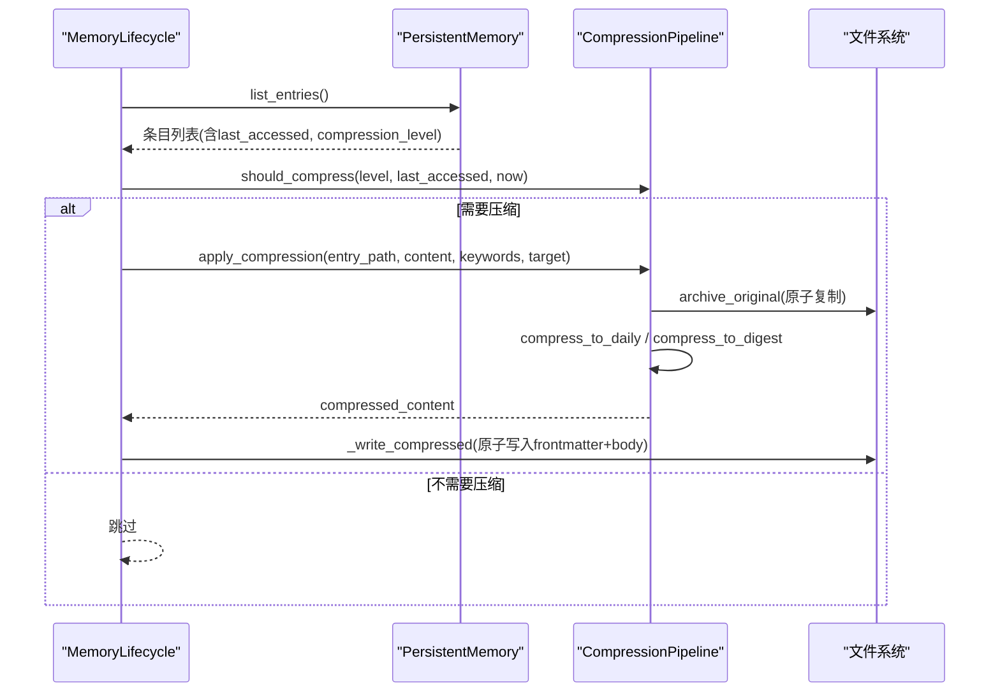
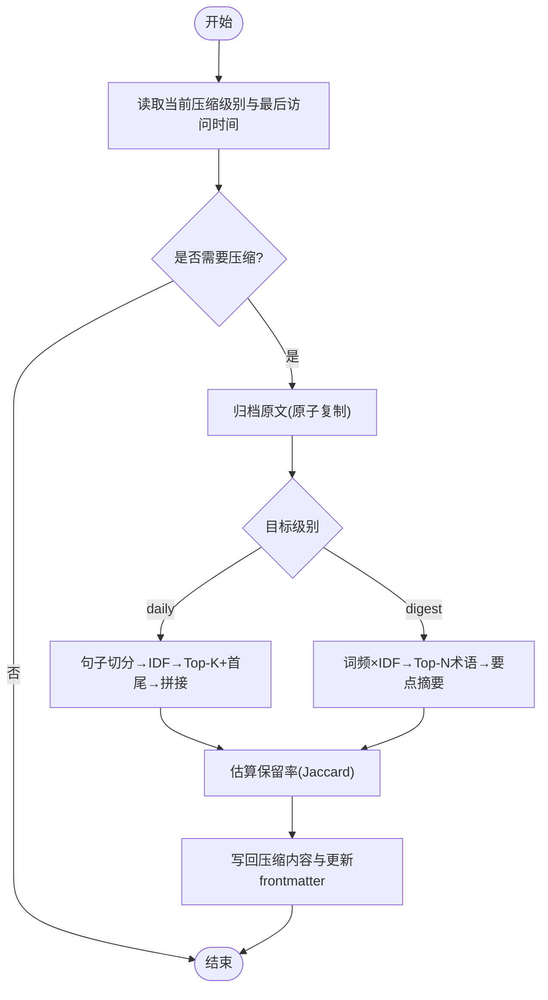
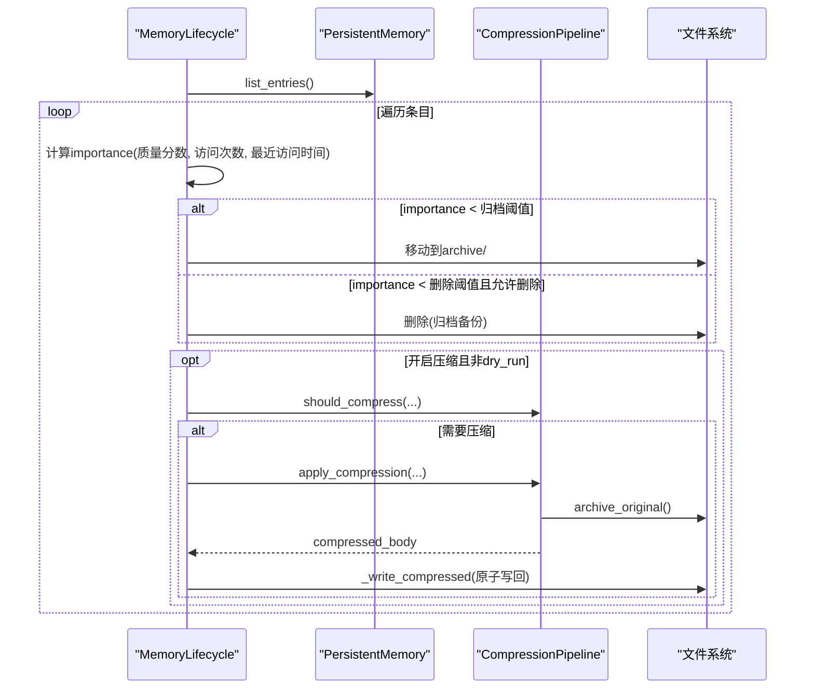
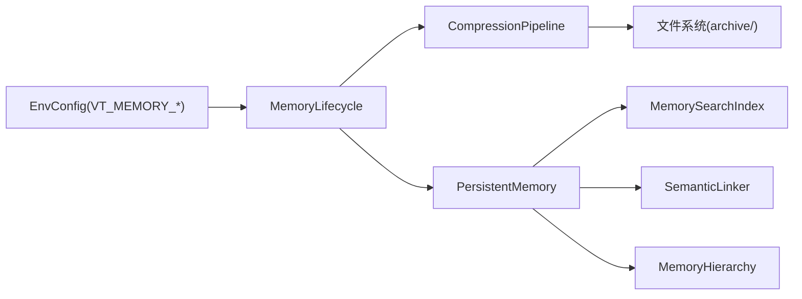

# 记忆压缩

<cite>
**本文引用的文件**
- [compression.py](file://agent/src/memory/compression.py)
- [lifecycle.py](file://agent/src/memory/lifecycle.py)
- [persistent.py](file://agent/src/memory/persistent.py)
- [hierarchy.py](file://agent/src/memory/hierarchy.py)
- [search_index.py](file://agent/src/memory/search_index.py)
- [semantic_links.py](file://agent/src/memory/semantic_links.py)
- [env_schema.py](file://agent/src/config/env_schema.py)
- [test_memory_gc.py](file://agent/tests/test_memory_gc.py)
- [test_tier2_integration.py](file://agent/tests/memory/test_tier2_integration.py)
</cite>

## 目录
1. [简介](#简介)
2. [项目结构](#项目结构)
3. [核心组件](#核心组件)
4. [架构总览](#架构总览)
5. [详细组件分析](#详细组件分析)
6. [依赖关系分析](#依赖关系分析)
7. [性能考量](#性能考量)
8. [故障排查指南](#故障排查指南)
9. [结论](#结论)
10. [附录：参数调优与最佳实践](#附录参数调优与最佳实践)

## 简介
本文件系统性阐述 Vibe-Trading 中“记忆压缩”的工作原理与实现细节。该机制通过三级压缩管线（原始 raw → 每日 daily → 摘要 digest），在长对话或长期记忆场景下，自动提取关键信息、去除冗余内容，并以可恢复的归档方式保存原文，从而在控制上下文体积的同时保持语义完整性。压缩由生命周期调度触发，结合重要性衰减、访问频率等指标进行决策；同时与分层目录、全文检索、语义链接等子系统协同工作，确保压缩后的记忆仍可被高效检索与关联。

## 项目结构
记忆压缩相关代码位于 agent/src/memory 目录下，并与配置、持久化、搜索、层级路由等模块协作：
- 压缩管线：compression.py
- 生命周期调度：lifecycle.py
- 持久化存储与元数据：persistent.py
- 层级目录路由：hierarchy.py
- 全文检索索引：search_index.py
- 语义链接：semantic_links.py
- 环境配置开关：env_schema.py
- 测试用例：test_memory_gc.py、test_tier2_integration.py

图表来源
- [lifecycle.py:200-273](file://agent/src/memory/lifecycle.py#L200-L273)
- [compression.py:160-353](file://agent/src/memory/compression.py#L160-L353)
- [persistent.py:196-307](file://agent/src/memory/persistent.py#L196-L307)
- [search_index.py:113-303](file://agent/src/memory/search_index.py#L113-L303)
- [semantic_links.py:158-231](file://agent/src/memory/semantic_links.py#L158-L231)
- [hierarchy.py:34-176](file://agent/src/memory/hierarchy.py#L34-L176)

章节来源
- [lifecycle.py:200-273](file://agent/src/memory/lifecycle.py#L200-L273)
- [compression.py:160-353](file://agent/src/memory/compression.py#L160-L353)
- [persistent.py:196-307](file://agent/src/memory/persistent.py#L196-L307)

## 核心组件
- 压缩管线 CompressionPipeline：负责将原始内容按策略压缩到 daily/digest 级别，并归档原文以保障可恢复性。
- 生命周期 MemoryLifecycle：周期性扫描记忆条目，依据重要性、访问时间等计算是否触发压缩，并写入压缩结果。
- 持久化 PersistentMemory：提供记忆的增删改查、索引重建、去重、重要性计算等基础能力。
- 层级 MemoryHierarchy：按 memory_type 组织目录，提升搜索范围裁剪效率。
- 检索 MemorySearchIndex：基于 SQLite FTS5 的全量检索，支持中文分词与双字组合匹配。
- 语义链接 SemanticLinker：基于 BM25 发现条目间的语义关联，增强检索召回。

章节来源
- [compression.py:160-353](file://agent/src/memory/compression.py#L160-L353)
- [lifecycle.py:200-273](file://agent/src/memory/lifecycle.py#L200-L273)
- [persistent.py:196-307](file://agent/src/memory/persistent.py#L196-L307)
- [hierarchy.py:34-176](file://agent/src/memory/hierarchy.py#L34-L176)
- [search_index.py:113-303](file://agent/src/memory/search_index.py#L113-L303)
- [semantic_links.py:158-231](file://agent/src/memory/semantic_links.py#L158-L231)

## 架构总览
压缩流程由生命周期驱动，结合环境变量开关决定是否执行。整体时序如下：

图表来源
- [lifecycle.py:200-273](file://agent/src/memory/lifecycle.py#L200-L273)
- [compression.py:168-334](file://agent/src/memory/compression.py#L168-L334)

## 详细组件分析

### 压缩管线 CompressionPipeline
- 三级压缩目标
  - raw → daily：保留首尾句 + 按 TF-IDF 评分选取 Top-K 句子，附带关键词头，约降至原体积的 50%。
  - daily → digest：提取高频且重要的术语，生成要点式摘要，约降至原体积的 10–20%。
- 关键算法
  - 分词：兼容 ASCII 单词与非拉丁脚本字符（CJK、阿拉伯、希伯来、西里尔等）。
  - 句子切分：支持英文句号/问号/叹号与中文句号/感叹号边界。
  - IDF 计算：对句子语料统计文档频率，计算逆文档频率。
  - 句子评分：按句中各词的 IDF 权重求和再归一化，选出重要句子。
  - 摘要生成：对 daily 内容做词频统计并结合句子级 IDF 加权，取 Top-N 术语形成要点。
- 归档与恢复
  - 压缩前原子复制原文至 archive/，失败则中止以避免数据丢失。
  - 压缩后估算保留率（Jaccard 重叠）用于日志记录。
- 触发条件
  - 超过 7 天未访问：raw → daily
  - 超过 30 天未访问：daily → digest

图表来源
- [compression.py:60-154](file://agent/src/memory/compression.py#L60-L154)
- [compression.py:194-256](file://agent/src/memory/compression.py#L194-L256)
- [compression.py:258-334](file://agent/src/memory/compression.py#L258-L334)

章节来源
- [compression.py:60-154](file://agent/src/memory/compression.py#L60-L154)
- [compression.py:168-334](file://agent/src/memory/compression.py#L168-L334)

### 生命周期调度 MemoryLifecycle
- GC 与压缩联动
  - Tier 1：根据重要性阈值决定归档或删除（默认删除关闭，仅归档）。
  - Tier 2：在 dry_run=false 且开启压缩时，遍历条目调用压缩管线，并将压缩结果原子写回。
- 压缩时机
  - 仅当条目满足最小年龄与最后访问时间阈值时才触发。
  - 若启用压缩但未启用 GC，会给出提示避免误用。
- 原子写入
  - 使用临时文件 + os.replace 保证 frontmatter 与 body 的一致性。

图表来源
- [lifecycle.py:200-273](file://agent/src/memory/lifecycle.py#L200-L273)
- [lifecycle.py:323-379](file://agent/src/memory/lifecycle.py#L323-L379)

章节来源
- [lifecycle.py:200-273](file://agent/src/memory/lifecycle.py#L200-L273)
- [lifecycle.py:323-379](file://agent/src/memory/lifecycle.py#L323-L379)

### 持久化与元数据 PersistentMemory
- 重要性计算
  - 基于艾宾浩斯遗忘曲线思想，考虑质量分数、访问次数与最近访问时间，得到重要性得分。
- 去重
  - 滑动窗口内对相同 name/description/content 哈希进行重复检测，防止并发重试导致的重复写入。
- 索引与快照
  - MEMORY.md 维护轻量索引；支持按需重建。
- 与压缩集成
  - 条目 frontmatter 包含 compression_level、keywords、related_memories 等字段，供压缩与检索使用。

章节来源
- [persistent.py:75-99](file://agent/src/memory/persistent.py#L75-L99)
- [persistent.py:440-453](file://agent/src/memory/persistent.py#L440-L453)
- [persistent.py:462-578](file://agent/src/memory/persistent.py#L462-L578)

### 层级目录 MemoryHierarchy
- 按 memory_type 将条目路由到 user/feedback/project/reference 子目录，缩小搜索范围。
- 支持无扩展名条目的恢复与迁移，保证历史兼容性。
- 构建 .hierarchy.yaml 索引，按关键词重叠度排序类别以提升检索效率。

章节来源
- [hierarchy.py:34-176](file://agent/src/memory/hierarchy.py#L34-L176)
- [hierarchy.py:200-379](file://agent/src/memory/hierarchy.py#L200-L379)

### 全文检索 MemorySearchIndex
- 基于 SQLite FTS5，提供 O(log n) 检索。
- 中文处理：对连续 CJK 字符展开为单字与双字组合，提高匹配召回。
- 查询清洗：对用户输入进行安全过滤，避免注入。
- 与压缩的关系：索引体量为正文截断上限（50k 字符），压缩后仍可通过索引快速定位。

章节来源
- [search_index.py:113-303](file://agent/src/memory/search_index.py#L113-L303)
- [search_index.py:357-445](file://agent/src/memory/search_index.py#L357-L445)

### 语义链接 SemanticLinker
- 使用 BM25 计算条目间相似度，自动发现并持久化关联。
- 支持解析显式 wikilink 引用 [[id]]，便于跨条目导航。
- 与压缩的关系：压缩不影响链接文件的读写；链接基于文件名与 token 集合，压缩前后保持一致。

章节来源
- [semantic_links.py:158-231](file://agent/src/memory/semantic_links.py#L158-L231)
- [semantic_links.py:321-372](file://agent/src/memory/semantic_links.py#L321-L372)

## 依赖关系分析
- 压缩管线依赖持久化的条目元数据（keywords、compression_level、last_accessed）。
- 生命周期依赖配置开关 VT_MEMORY_COMPRESSION 与 VT_MEMORY_GC，二者需配合使用。
- 检索与链接独立于压缩过程，但受益于更小的正文体积与更稳定的元数据。

图表来源
- [env_schema.py:426-498](file://agent/src/config/env_schema.py#L426-L498)
- [lifecycle.py:200-273](file://agent/src/memory/lifecycle.py#L200-L273)
- [compression.py:160-353](file://agent/src/memory/compression.py#L160-L353)
- [persistent.py:196-307](file://agent/src/memory/persistent.py#L196-L307)

章节来源
- [env_schema.py:426-498](file://agent/src/config/env_schema.py#L426-L498)
- [lifecycle.py:200-273](file://agent/src/memory/lifecycle.py#L200-L273)

## 性能考量
- 时间复杂度
  - 压缩：句子切分与 IDF 计算为 O(N·L)，N 为句子数，L 为平均句长；Top-K 选择近似线性。
  - 检索：FTS5 查询接近 O(log n)。
  - 链接：BM25 计算为 O(D·V)，D 为候选文档数，V 为词表大小。
- I/O 开销
  - 归档与写回采用原子操作，减少崩溃风险；批量压缩时应注意磁盘 IO 峰值。
- 内存占用
  - 去重哈希表与 FTS5 连接为常驻资源；合理设置 MAX_BODY_LEN 与索引重建频率。
- 建议
  - 在低峰期运行 GC 与压缩；限制单次批处理的条目数量；监控 gc.log 与日志输出。

[本节为通用指导，不直接分析具体文件]

## 故障排查指南
- 压缩未触发
  - 检查 VT_MEMORY_COMPRESSION 与 VT_MEMORY_GC 是否开启；确认条目 last_accessed 是否超过阈值。
  - 参考测试用例验证行为：[test_memory_gc.py:175-200](file://agent/tests/test_memory_gc.py#L175-L200)、[test_tier2_integration.py:234-235](file://agent/tests/memory/test_tier2_integration.py#L234-L235)。
- 压缩失败或数据丢失
  - 查看 archive/ 是否存在；确认应用权限与磁盘空间；关注压缩异常日志。
- 检索不到压缩后的内容
  - 确认 FTS5 可用；必要时触发 rebuild_all；检查中文分词与查询清洗逻辑。
- 链接失效
  - 检查 .relations.json 是否完整；确认条目 ID 与文件名一致。

章节来源
- [test_memory_gc.py:175-200](file://agent/tests/test_memory_gc.py#L175-L200)
- [test_tier2_integration.py:234-235](file://agent/tests/memory/test_tier2_integration.py#L234-L235)
- [search_index.py:147-173](file://agent/src/memory/search_index.py#L147-L173)
- [semantic_links.py:232-319](file://agent/src/memory/semantic_links.py#L232-L319)

## 结论
记忆压缩通过“分级压缩 + 重要性评估 + 原子归档”的组合策略，在长对话与长期记忆中实现了高保留率的体积缩减。其设计兼顾了可恢复性、检索效率与系统稳定性，并通过环境变量灵活开关，适配不同部署场景。配合层级目录、全文检索与语义链接，压缩后的记忆依然具备高可用性与强关联性。

[本节为总结性内容，不直接分析具体文件]

## 附录：参数调优与最佳实践
- 压缩阈值
  - 7 天未访问进入 daily，30 天未访问进入 digest；可根据业务节奏调整。
- 压缩强度
  - daily 的 Top-K 句子数与 digest 的 Top-N 术语数可按领域词汇密度调优。
- 质量评估
  - 质量分数与访问次数影响重要性，进而影响归档/删除策略；建议定期校准。
- 性能优化
  - 在低峰期运行 GC；限制批次大小；监控 FTS5 索引重建成本。
- 安全与一致性
  - 始终启用原子写回；确保 archive/ 目录存在且可写；定期检查 gc.log。

章节来源
- [compression.py:23-39](file://agent/src/memory/compression.py#L23-L39)
- [compression.py:194-256](file://agent/src/memory/compression.py#L194-L256)
- [lifecycle.py:200-273](file://agent/src/memory/lifecycle.py#L200-L273)
- [persistent.py:75-99](file://agent/src/memory/persistent.py#L75-L99)
- [search_index.py:25-27](file://agent/src/memory/search_index.py#L25-L27)
- [env_schema.py:426-498](file://agent/src/config/env_schema.py#L426-L498)