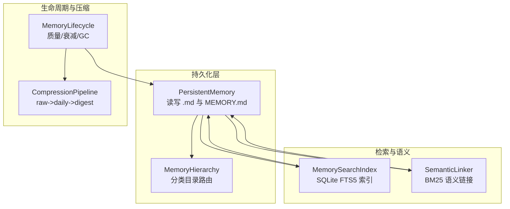
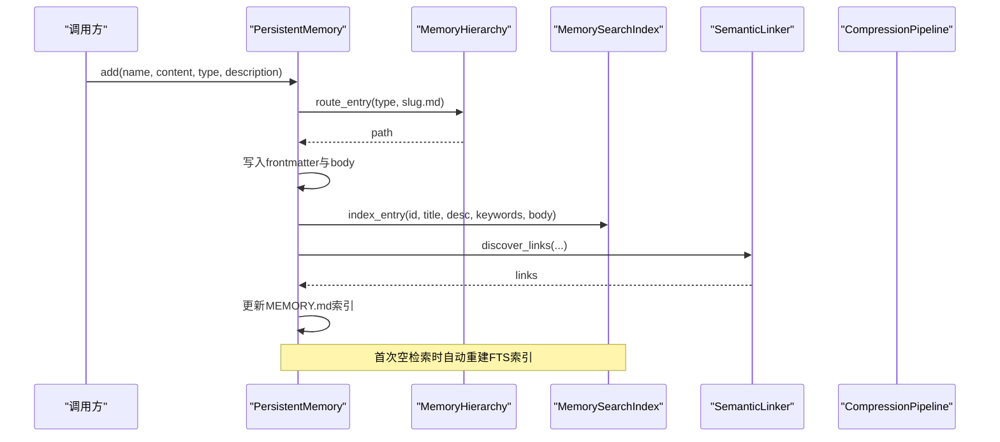
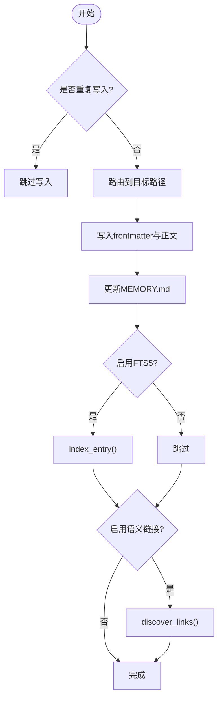
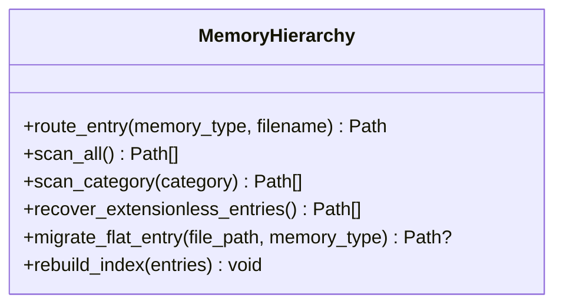
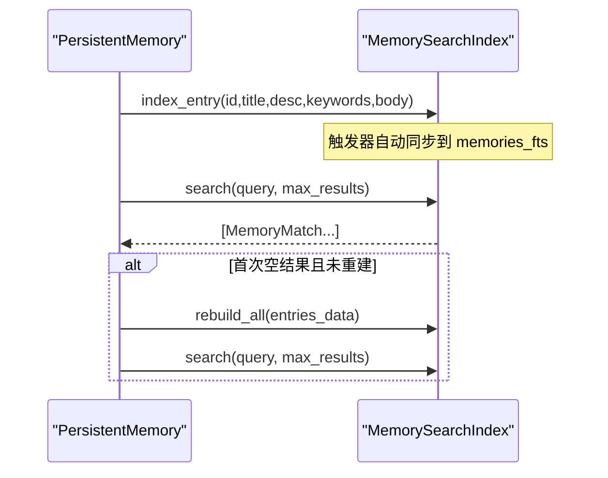
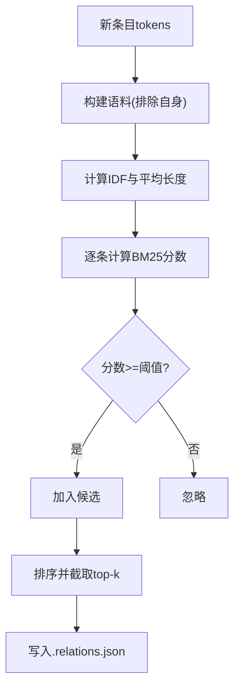
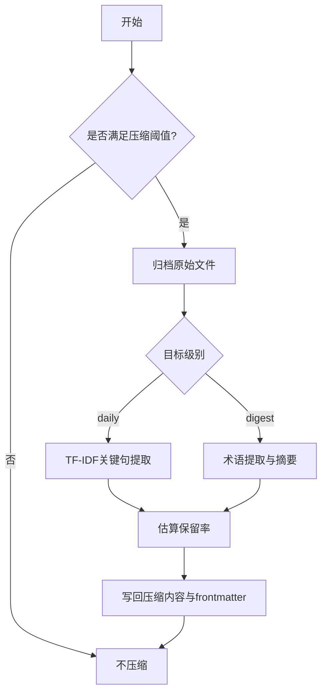
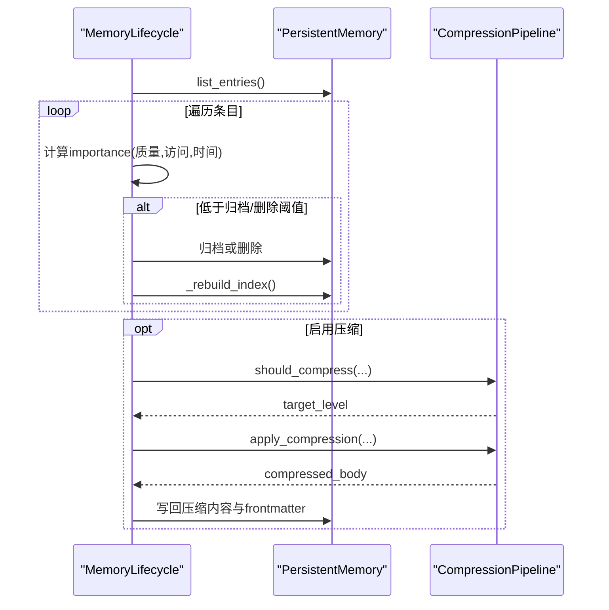
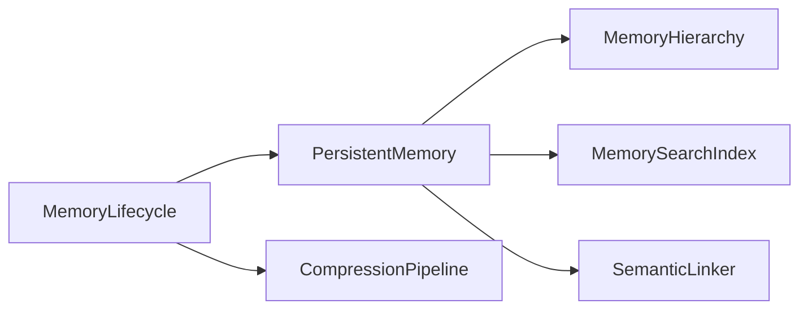

# 记忆管理

<cite>
**本文引用的文件**
- [agent/src/memory/persistent.py](file://agent/src/memory/persistent.py)
- [agent/src/memory/hierarchy.py](file://agent/src/memory/hierarchy.py)
- [agent/src/memory/compression.py](file://agent/src/memory/compression.py)
- [agent/src/memory/search_index.py](file://agent/src/memory/search_index.py)
- [agent/src/memory/lifecycle.py](file://agent/src/memory/lifecycle.py)
- [agent/src/memory/semantic_links.py](file://agent/src/memory/semantic_links.py)
- [agent/tests/test_persistent_memory.py](file://agent/tests/test_persistent_memory.py)
</cite>

## 目录
1. [简介](#简介)
2. [项目结构](#项目结构)
3. [核心组件](#核心组件)
4. [架构总览](#架构总览)
5. [详细组件分析](#详细组件分析)
6. [依赖关系分析](#依赖关系分析)
7. [性能考量](#性能考量)
8. [故障排查指南](#故障排查指南)
9. [结论](#结论)
10. [附录：操作示例与最佳实践](#附录：操作示例与最佳实践)

## 简介
本文件系统性阐述 Vibe-Trading 的记忆管理系统，覆盖工作空间记忆、持久化记忆与分层记忆的实现原理；详细说明存储结构、检索算法与压缩策略；给出保存、查询、删除等具体操作路径；解释语义搜索、相关性评分与自动召回机制；并说明生命周期管理、垃圾回收与数据迁移。最后提供性能优化建议与扩展方法，帮助读者在工程实践中高效使用与演进该子系统。

## 项目结构
记忆系统位于 agent/src/memory 目录下，采用“核心持久化 + 可选增强”的模块化设计：
- 持久化层：基于本地 Markdown 文件（带 frontmatter）实现跨会话记忆，维护索引 MEMORY.md。
- 分层路由：按 memory_type 将条目路由到分类子目录，支持 O(类别规模) 范围扫描。
- 全文检索：SQLite FTS5 倒排索引，提供 O(log n) 级别检索与片段高亮。
- 语义链接：BM25 相似度发现关联条目，以 .relations.json 侧车文件持久化。
- 压缩管线：三级压缩（raw -> daily -> digest），保留原始内容归档。
- 生命周期：质量分更新、重要性衰减、容量型垃圾回收与压缩触发。

图表来源
- [agent/src/memory/persistent.py:196-637](file://agent/src/memory/persistent.py#L196-L637)
- [agent/src/memory/hierarchy.py:34-176](file://agent/src/memory/hierarchy.py#L34-L176)
- [agent/src/memory/search_index.py:113-481](file://agent/src/memory/search_index.py#L113-L481)
- [agent/src/memory/semantic_links.py:158-372](file://agent/src/memory/semantic_links.py#L158-L372)
- [agent/src/memory/lifecycle.py:71-421](file://agent/src/memory/lifecycle.py#L71-L421)
- [agent/src/memory/compression.py:160-353](file://agent/src/memory/compression.py#L160-L353)

章节来源
- [agent/src/memory/persistent.py:196-637](file://agent/src/memory/persistent.py#L196-L637)
- [agent/src/memory/hierarchy.py:34-176](file://agent/src/memory/hierarchy.py#L34-L176)

## 核心组件
- PersistentMemory：文件级持久化记忆，负责条目增删改查、索引重建、去重窗口、关键词检索与 FTS5 集成。
- MemoryHierarchy：层级目录路由，按 memory_type 组织文件，支持迁移与恢复无后缀条目。
- MemorySearchIndex：SQLite FTS5 全文检索索引，支持增量索引、批量重建、CJK 词元处理与查询安全化。
- SemanticLinker：基于 BM25 的语义链接发现与持久化，支持 wikilink 解析。
- CompressionPipeline：三级压缩管线，按访问时效性触发压缩，保留原始归档。
- MemoryLifecycle：质量分强化、重要性衰减、GC（归档/删除）与压缩联动。

章节来源
- [agent/src/memory/persistent.py:122-143](file://agent/src/memory/persistent.py#L122-L143)
- [agent/src/memory/hierarchy.py:34-90](file://agent/src/memory/hierarchy.py#L34-L90)
- [agent/src/memory/search_index.py:96-121](file://agent/src/memory/search_index.py#L96-L121)
- [agent/src/memory/semantic_links.py:158-177](file://agent/src/memory/semantic_links.py#L158-L177)
- [agent/src/memory/compression.py:160-193](file://agent/src/memory/compression.py#L160-L193)
- [agent/src/memory/lifecycle.py:71-98](file://agent/src/memory/lifecycle.py#L71-L98)

## 架构总览
记忆系统以“可插拔增强”的方式围绕持久化层构建：默认仅使用文件系统与 MEMORY.md 索引；按需启用 FTS5、语义链接、层级路由与压缩。所有写操作通过文件锁保护，保证并发安全。

图表来源
- [agent/src/memory/persistent.py:462-578](file://agent/src/memory/persistent.py#L462-L578)
- [agent/src/memory/hierarchy.py:70-90](file://agent/src/memory/hierarchy.py#L70-L90)
- [agent/src/memory/search_index.py:207-250](file://agent/src/memory/search_index.py#L207-L250)
- [agent/src/memory/semantic_links.py:179-230](file://agent/src/memory/semantic_links.py#L179-L230)

## 详细组件分析

### 持久化记忆（PersistentMemory）
- 存储结构
  - 每个记忆条目为 Markdown 文件，包含 YAML-like frontmatter（name、description、type、id、时间戳、keywords、quality_score、access_count、last_accessed、importance、related_memories、category、compression_level）。
  - 根目录存在 MEMORY.md 作为轻量索引，记录条目标题与描述。
- 写入流程
  - 生成 slug 与 id，清理控制字符与截断超长正文，写入 frontmatter 与正文。
  - 若启用层级路由，则写入对应分类目录；否则写入根目录。
  - 更新 MEMORY.md 索引；可选更新 FTS5 索引与语义链接。
- 读取与检索
  - list_entries：扫描 .md 文件并解析 frontmatter，计算 importance。
  - find：按精确标题或文件名匹配。
  - find_relevant：优先走 FTS5 检索；若无结果且未重建过，则自动全量重建索引；回退方案为关键词加权打分（元数据权重更高），并按重要性衰减因子排序。
- 去重与锁定
  - is_duplicate：基于 name/description/content 的哈希，30 秒滑动窗口防重复写入。
  - memory_lock：跨进程文件锁，避免并发写冲突。

图表来源
- [agent/src/memory/persistent.py:440-578](file://agent/src/memory/persistent.py#L440-L578)
- [agent/src/memory/persistent.py:358-438](file://agent/src/memory/persistent.py#L358-L438)

章节来源
- [agent/src/memory/persistent.py:122-143](file://agent/src/memory/persistent.py#L122-L143)
- [agent/src/memory/persistent.py:196-307](file://agent/src/memory/persistent.py#L196-L307)
- [agent/src/memory/persistent.py:309-438](file://agent/src/memory/persistent.py#L309-L438)
- [agent/src/memory/persistent.py:440-578](file://agent/src/memory/persistent.py#L440-L578)

### 分层记忆（MemoryHierarchy）
- 功能要点
  - 将条目按 memory_type 路由至 category 子目录，提升扫描效率。
  - 兼容旧版扁平存储，扫描时同时遍历根目录与各分类目录。
  - 修复历史 bug：恢复无 .md 后缀的孤立条目，确保可见性。
  - 提供迁移工具：将扁平条目移动到对应分类目录。
- 索引与优先级
  - 维护 .hierarchy.yaml 统计摘要（每类数量与关键词），用于按关键词重叠度对类别扫描顺序进行优化。

图表来源
- [agent/src/memory/hierarchy.py:34-176](file://agent/src/memory/hierarchy.py#L34-L176)
- [agent/src/memory/hierarchy.py:178-261](file://agent/src/memory/hierarchy.py#L178-L261)
- [agent/src/memory/hierarchy.py:313-436](file://agent/src/memory/hierarchy.py#L313-L436)

章节来源
- [agent/src/memory/hierarchy.py:70-90](file://agent/src/memory/hierarchy.py#L70-L90)
- [agent/src/memory/hierarchy.py:92-176](file://agent/src/memory/hierarchy.py#L92-L176)
- [agent/src/memory/hierarchy.py:200-261](file://agent/src/memory/hierarchy.py#L200-L261)
- [agent/src/memory/hierarchy.py:313-436](file://agent/src/memory/hierarchy.py#L313-L436)

### 全文检索（MemorySearchIndex）
- 能力
  - SQLite FTS5 虚拟表，支持 MATCH 查询、snippet 高亮、rank 相关性排序。
  - 自动同步触发器：插入/更新/删除时保持 FTS5 一致。
  - CJK 优化：输入文本展开为单字+双字词元，查询时生成安全表达式防止注入。
- 使用方式
  - index_entry：增量索引新条目。
  - rebuild_all：全量重建索引（从持久化层提供的 entries_data）。
  - search：返回 MemoryMatch（entry_id、title、snippet、rank）。
- 降级策略
  - 当 FTS5 不可用时，search 返回空列表，上层回退到关键词扫描。

图表来源
- [agent/src/memory/search_index.py:147-196](file://agent/src/memory/search_index.py#L147-L196)
- [agent/src/memory/search_index.py:207-250](file://agent/src/memory/search_index.py#L207-L250)
- [agent/src/memory/search_index.py:304-355](file://agent/src/memory/search_index.py#L304-L355)
- [agent/src/memory/persistent.py:358-438](file://agent/src/memory/persistent.py#L358-L438)

章节来源
- [agent/src/memory/search_index.py:113-196](file://agent/src/memory/search_index.py#L113-L196)
- [agent/src/memory/search_index.py:207-355](file://agent/src/memory/search_index.py#L207-L355)
- [agent/src/memory/search_index.py:357-446](file://agent/src/memory/search_index.py#L357-L446)

### 语义链接（SemanticLinker）
- 能力
  - 基于 BM25 计算条目间相似度，筛选阈值与上限，输出 top-k 链接。
  - 以 .relations.json 侧车文件持久化链接（含版本、links、更新时间）。
  - 解析正文中的 [[6位十六进制id]] 显式引用。
- 集成点
  - 新增条目后，自动发现并保存链接；删除条目时移除其 relations 文件。
  - 检索结果可按链接扩展，补充相关条目。

图表来源
- [agent/src/memory/semantic_links.py:73-150](file://agent/src/memory/semantic_links.py#L73-L150)
- [agent/src/memory/semantic_links.py:179-230](file://agent/src/memory/semantic_links.py#L179-L230)
- [agent/src/memory/semantic_links.py:232-319](file://agent/src/memory/semantic_links.py#L232-L319)

章节来源
- [agent/src/memory/semantic_links.py:158-372](file://agent/src/memory/semantic_links.py#L158-L372)

### 压缩管线（CompressionPipeline）
- 策略
  - raw -> daily：按 TF-IDF 句子得分提取关键句（保留首尾句），附加关键词头。
  - daily -> digest：提取高频重要术语，生成要点清单。
  - 压缩前自动归档原始文件，失败时中止以避免数据丢失。
- 触发条件
  - 依据 last_accessed 与当前时间的间隔判断是否达到阈值（天）。
- 评估
  - 估计信息保留率（Jaccard 词元重叠）。

图表来源
- [agent/src/memory/compression.py:160-193](file://agent/src/memory/compression.py#L160-L193)
- [agent/src/memory/compression.py:194-256](file://agent/src/memory/compression.py#L194-L256)
- [agent/src/memory/compression.py:258-353](file://agent/src/memory/compression.py#L258-L353)

章节来源
- [agent/src/memory/compression.py:160-353](file://agent/src/memory/compression.py#L160-L353)

### 生命周期管理（MemoryLifecycle）
- 质量强化
  - 根据事件（任务成功/失败、用户确认/拒绝、被动衰减）更新 quality_score，限制单次会话最大变化幅度。
- 访问追踪
  - 记录 access_count 与 last_accessed，影响重要性衰减。
- 垃圾回收
  - 基于 importance 与年龄阈值决定归档或删除（默认仅归档）。
  - 执行后重建索引，并追加 gc.log。
- 压缩联动
  - 在 GC 周期中，对老化条目触发压缩并写回 frontmatter。

图表来源
- [agent/src/memory/lifecycle.py:183-273](file://agent/src/memory/lifecycle.py#L183-L273)
- [agent/src/memory/lifecycle.py:275-379](file://agent/src/memory/lifecycle.py#L275-L379)

章节来源
- [agent/src/memory/lifecycle.py:71-178](file://agent/src/memory/lifecycle.py#L71-L178)
- [agent/src/memory/lifecycle.py:183-379](file://agent/src/memory/lifecycle.py#L183-L379)

## 依赖关系分析
- 模块耦合
  - PersistentMemory 为核心，依赖 Hierarchy（可选）、SearchIndex（可选）、SemanticLinker（可选）。
  - Lifecycle 依赖 PersistentMemory，并在 GC 阶段调用 CompressionPipeline。
  - SearchIndex 与 SemanticLinker 均独立于文件系统布局，但通过 PersistentMemory 的数据流协同。
- 外部依赖
  - SQLite FTS5（可选），若不可用则降级为关键词扫描。
  - 文件系统锁（非 Windows 平台使用 fcntl）。
- 潜在循环
  - 通过延迟导入避免启动期循环依赖（如 lifecycle 中动态 import compression）。

图表来源
- [agent/src/memory/persistent.py:196-637](file://agent/src/memory/persistent.py#L196-L637)
- [agent/src/memory/lifecycle.py:71-421](file://agent/src/memory/lifecycle.py#L71-L421)

章节来源
- [agent/src/memory/persistent.py:196-637](file://agent/src/memory/persistent.py#L196-L637)
- [agent/src/memory/lifecycle.py:71-421](file://agent/src/memory/lifecycle.py#L71-L421)

## 性能考量
- 检索性能
  - 启用 FTS5 可将检索复杂度从 O(n) 降至近似 O(log n)，并返回 snippet 与 rank。
  - 首次空检索时自动重建索引，避免冷启动开销。
- 扫描优化
  - 启用层级路由后，按类别缩小扫描范围；必要时按关键词重叠度排序类别。
- 写入性能
  - 原子写入（临时文件 + rename）与文件锁保障并发安全。
  - 正文截断与 frontmatter 字段精简减少 IO。
- 压缩收益
  - 按时效性压缩降低长期存储体积，同时保留归档以便回溯。
- 内存占用
  - 去重窗口限制近期哈希集合大小，避免无限增长。

[本节为通用性能讨论，无需特定文件来源]

## 故障排查指南
- 无法检索到结果
  - 检查是否启用 FTS5；若不可用，系统将回退到关键词扫描。
  - 确认已触发索引重建（首次空检索会自动重建）。
- 写入失败或重复
  - 检查文件锁是否超时；查看日志中关于 lock timeout 的记录。
  - 确认是否在去重窗口内重复写入。
- 语义链接缺失
  - 检查是否启用语义链接；确认 .relations.json 是否存在且格式正确。
- 压缩异常
  - 归档失败会中止压缩；检查 archive 目录权限与磁盘空间。
- 生命周期动作未生效
  - 确认启用了 GC 与压缩；查看 gc.log 中的决策记录。

章节来源
- [agent/src/memory/persistent.py:358-438](file://agent/src/memory/persistent.py#L358-L438)
- [agent/src/memory/search_index.py:147-196](file://agent/src/memory/search_index.py#L147-L196)
- [agent/src/memory/semantic_links.py:232-319](file://agent/src/memory/semantic_links.py#L232-L319)
- [agent/src/memory/compression.py:258-334](file://agent/src/memory/compression.py#L258-L334)
- [agent/src/memory/lifecycle.py:183-317](file://agent/src/memory/lifecycle.py#L183-L317)

## 结论
Vibe-Trading 的记忆系统以轻量、可扩展、可观测为目标，通过“持久化 + 可选增强”的架构，在保证数据安全与并发一致性的前提下，提供了高效的检索、语义关联与生命周期管理能力。结合层级路由、FTS5 索引、BM25 语义链接与三级压缩，可在不同规模与场景下取得良好的性能与可维护性平衡。

[本节为总结性内容，无需特定文件来源]

## 附录：操作示例与最佳实践
以下示例以“代码片段路径”形式给出，便于定位实现位置，避免直接粘贴代码。

- 保存记忆条目
  - 路径：[agent/src/memory/persistent.py:462-578](file://agent/src/memory/persistent.py#L462-L578)
  - 说明：传入 name、content、memory_type、description；支持层级路由与可选 FTS/链接更新。
- 查询记忆条目（精确/模糊）
  - 精确查找：[agent/src/memory/persistent.py:313-326](file://agent/src/memory/persistent.py#L313-L326)
  - 相关检索：[agent/src/memory/persistent.py:358-438](file://agent/src/memory/persistent.py#L358-L438)
- 删除记忆条目
  - 按名称删除：[agent/src/memory/persistent.py:580-607](file://agent/src/memory/persistent.py#L580-L607)
  - 按对象删除：[agent/src/memory/persistent.py:328-356](file://agent/src/memory/persistent.py#L328-L356)
- 语义搜索与相关性
  - FTS5 搜索接口：[agent/src/memory/search_index.py:252-302](file://agent/src/memory/search_index.py#L252-L302)
  - 查询安全化与 CJK 处理：[agent/src/memory/search_index.py:409-446](file://agent/src/memory/search_index.py#L409-L446)
- 自动召回机制
  - 首次空检索自动重建索引：[agent/src/memory/persistent.py:365-382](file://agent/src/memory/persistent.py#L365-L382)
- 生命周期与垃圾回收
  - 质量强化与访问追踪：[agent/src/memory/lifecycle.py:112-178](file://agent/src/memory/lifecycle.py#L112-L178)
  - 运行 GC（归档/删除）：[agent/src/memory/lifecycle.py:183-273](file://agent/src/memory/lifecycle.py#L183-L273)
- 压缩策略
  - 触发判断与执行：[agent/src/memory/compression.py:160-193](file://agent/src/memory/compression.py#L160-L193)
  - 压缩到 daily/digest：[agent/src/memory/compression.py:194-256](file://agent/src/memory/compression.py#L194-L256)
  - 归档与写回：[agent/src/memory/compression.py:258-334](file://agent/src/memory/compression.py#L258-L334)
- 分层路由与迁移
  - 路由与扫描：[agent/src/memory/hierarchy.py:70-176](file://agent/src/memory/hierarchy.py#L70-L176)
  - 迁移扁平条目：[agent/src/memory/hierarchy.py:381-436](file://agent/src/memory/hierarchy.py#L381-L436)

章节来源
- [agent/src/memory/persistent.py:313-607](file://agent/src/memory/persistent.py#L313-L607)
- [agent/src/memory/search_index.py:252-446](file://agent/src/memory/search_index.py#L252-L446)
- [agent/src/memory/lifecycle.py:112-273](file://agent/src/memory/lifecycle.py#L112-L273)
- [agent/src/memory/compression.py:160-334](file://agent/src/memory/compression.py#L160-L334)
- [agent/src/memory/hierarchy.py:70-436](file://agent/src/memory/hierarchy.py#L70-L436)