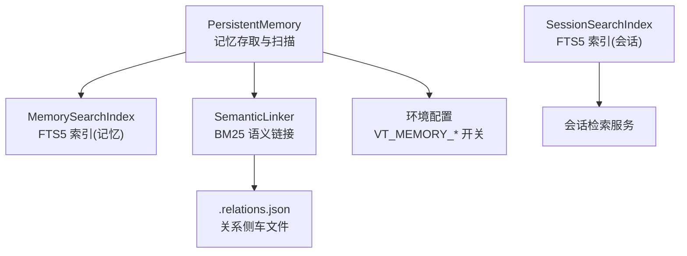
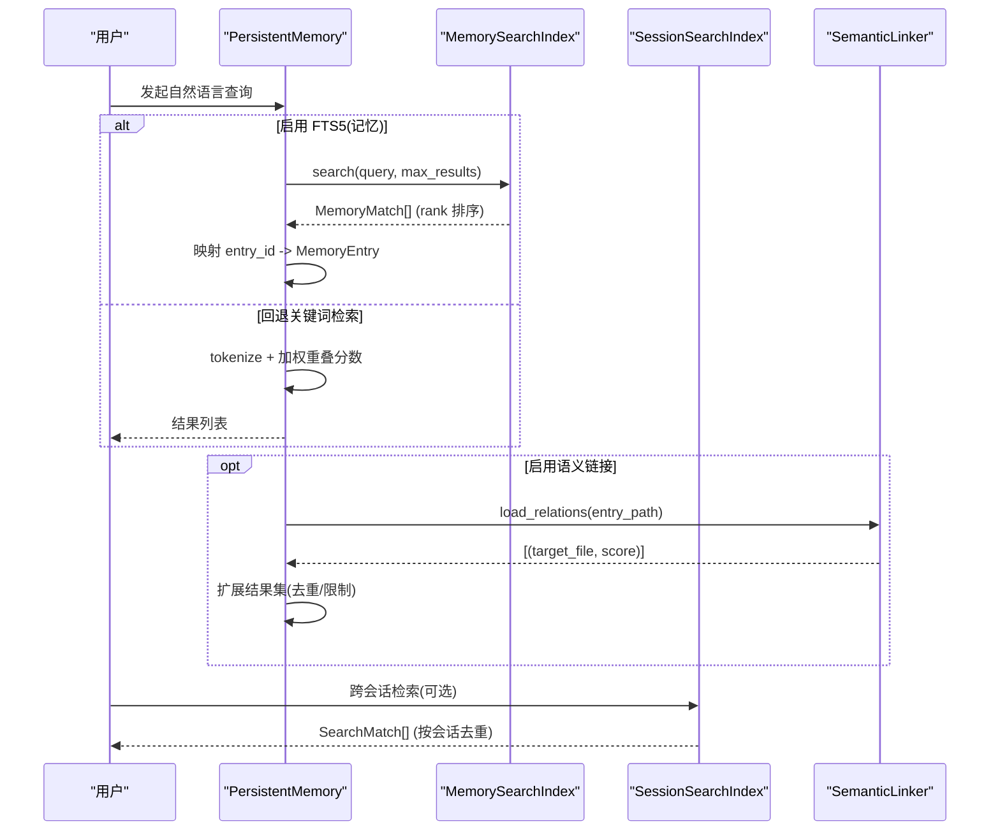
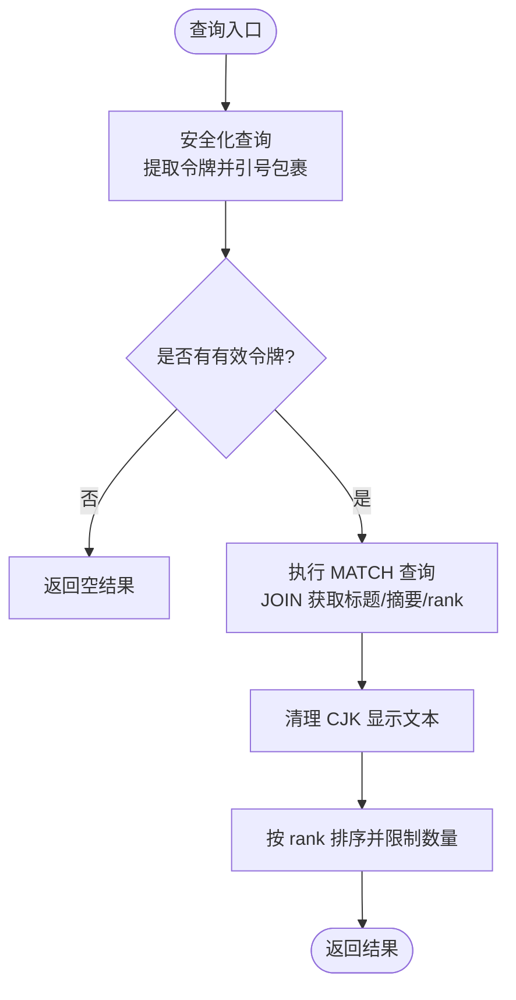
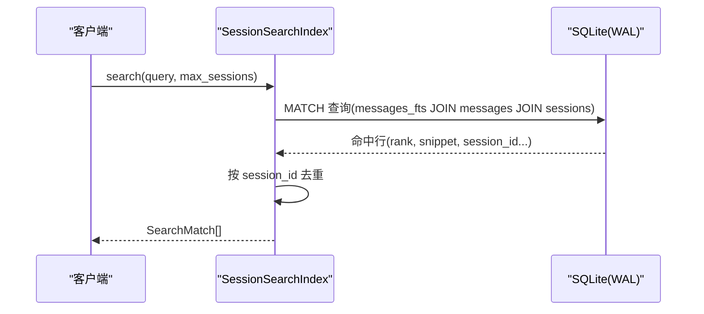
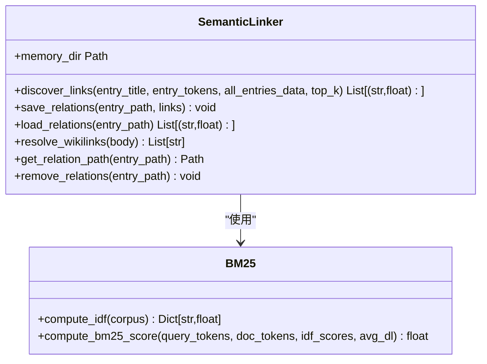
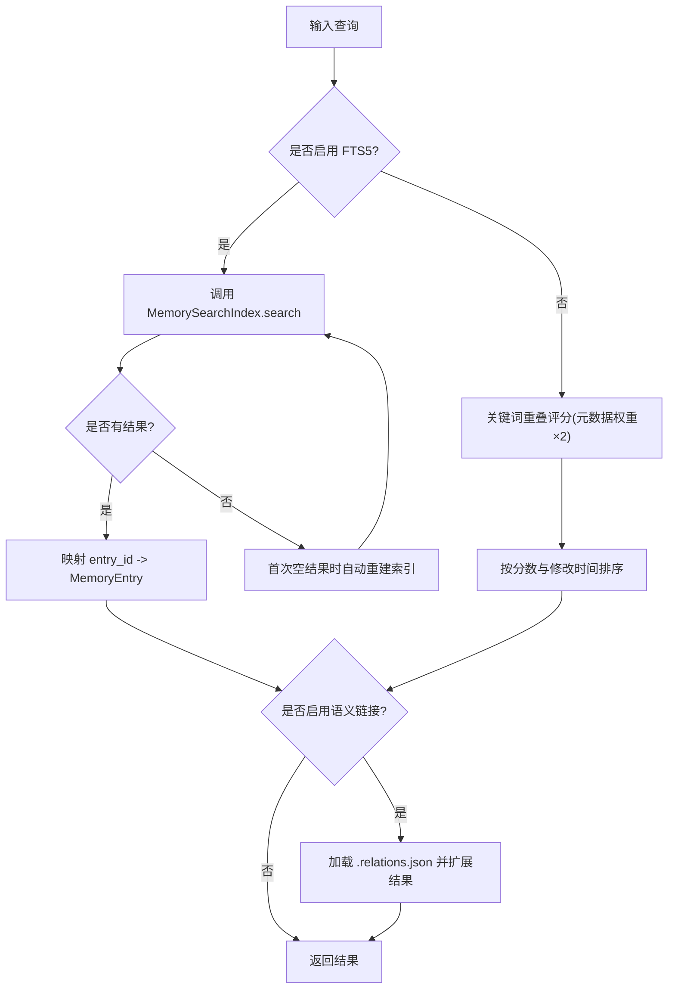
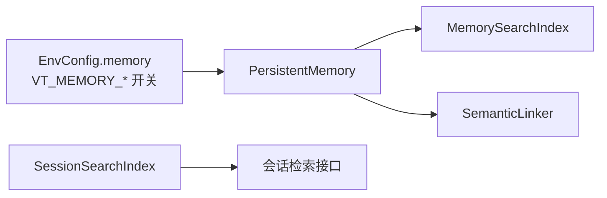

# 语义搜索

<cite>
**本文引用的文件**   
- [agent/src/memory/search_index.py](file://agent/src/memory/search_index.py)
- [agent/src/session/search.py](file://agent/src/session/search.py)
- [agent/src/memory/semantic_links.py](file://agent/src/memory/semantic_links.py)
- [agent/src/memory/persistent.py](file://agent/src/memory/persistent.py)
- [agent/src/config/env_schema.py](file://agent/src/config/env_schema.py)
- [agent/tests/memory/benchmarks/runner.py](file://agent/tests/memory/benchmarks/runner.py)
</cite>

## 目录
1. [简介](#简介)
2. [项目结构](#项目结构)
3. [核心组件](#核心组件)
4. [架构总览](#架构总览)
5. [详细组件分析](#详细组件分析)
6. [依赖关系分析](#依赖关系分析)
7. [性能与优化](#性能与优化)
8. [故障排查指南](#故障排查指南)
9. [结论](#结论)
10. [附录：使用示例与扩展指南](#附录使用示例与扩展指南)

## 简介
本文件系统性说明本项目中“语义搜索”的实现原理与技术细节。需要特别说明的是，当前代码库中的“语义搜索”并非基于向量嵌入的相似度检索，而是以全文检索（SQLite FTS5）与词项相似度（BM25）为核心的混合方案：
- 会话级跨会话全文检索：通过 SQLite FTS5 对消息内容建立倒排索引，提供 O(log n) 级别的高效匹配与相关性排序。
- 记忆级全文检索：为持久化记忆条目构建 FTS5 虚拟表，支持标题、描述、关键词、正文的多字段检索，并针对中日韩字符进行单字+双字的展开以提升召回。
- 语义链接与知识图谱雏形：通过 BM25 计算条目间相似度，自动发现并维护条目间的“语义链接”，并以侧边 JSON 文件持久化；同时支持显式 wikilink 引用解析，形成轻量级的知识图谱关系。
- 检索增强：在结果返回后，可按预建语义链接扩展结果集，提升上下文完整性。

该设计兼顾了高性能、可解释性与可扩展性，适合在金融研究、交易策略与多会话协作场景中快速定位相关历史对话与记忆片段。

## 项目结构
围绕语义搜索的相关模块主要分布在 memory 与 session 两个子系统中：
- agent/src/memory/search_index.py：持久记忆的 FTS5 索引与检索实现。
- agent/src/session/search.py：会话消息的 FTS5 索引与检索实现。
- agent/src/memory/semantic_links.py：基于 BM25 的语义链接发现与持久化。
- agent/src/memory/persistent.py：记忆条目的增删改查、重要性衰减、以及调用 FTS5 与语义链接的集成点。
- agent/src/config/env_schema.py：功能开关与环境配置（如是否启用 FTS5、语义链接等）。
- agent/tests/memory/benchmarks/runner.py：检索质量评估与 BM25 评分基准测试。

图表来源
- [agent/src/memory/persistent.py:196-438](file://agent/src/memory/persistent.py#L196-L438)
- [agent/src/memory/search_index.py:113-302](file://agent/src/memory/search_index.py#L113-L302)
- [agent/src/session/search.py:60-267](file://agent/src/session/search.py#L60-L267)
- [agent/src/memory/semantic_links.py:158-319](file://agent/src/memory/semantic_links.py#L158-L319)
- [agent/src/config/env_schema.py:461-537](file://agent/src/config/env_schema.py#L461-L537)

章节来源
- [agent/src/memory/persistent.py:196-438](file://agent/src/memory/persistent.py#L196-L438)
- [agent/src/memory/search_index.py:113-302](file://agent/src/memory/search_index.py#L113-L302)
- [agent/src/session/search.py:60-267](file://agent/src/session/search.py#L60-L267)
- [agent/src/memory/semantic_links.py:158-319](file://agent/src/memory/semantic_links.py#L158-L319)
- [agent/src/config/env_schema.py:461-537](file://agent/src/config/env_schema.py#L461-L537)

## 核心组件
- 记忆 FTS5 索引（MemorySearchIndex）
  - 职责：为记忆条目建立 FTS5 虚拟表，支持插入、删除、重建与查询；对中日韩文本进行单字+双字展开，提高匹配召回；按 FTS5 rank 排序返回结果。
  - 关键点：WAL 模式、触发器自动同步、CJK 预处理与清洗、安全化的 MATCH 查询构造。
- 会话 FTS5 索引（SessionSearchIndex）
  - 职责：为会话消息建立 FTS5 索引，支持逐条消息索引、会话元信息更新、批量重建与跨会话检索；结果按会话去重并按 rank 排序。
  - 关键点：WAL 模式、触发器自动同步、安全化的 MATCH 查询构造、时间戳格式化。
- 语义链接（SemanticLinker）
  - 职责：基于 BM25 计算条目间相似度，筛选阈值与上限，生成并持久化 .relations.json 侧车文件；解析显式 wikilink 引用。
  - 关键点：IDF 计算、BM25 评分公式、原子写入、版本兼容。
- 持久记忆（PersistentMemory）
  - 职责：扫描记忆文件、解析 frontmatter、计算重要性（含衰减）、执行关键词检索（回退路径），并在开启 FTS5/语义链接时联动索引与链接。
  - 关键点：重要性衰减、FTS5 优先检索与自动重建、语义链接扩展结果。

章节来源
- [agent/src/memory/search_index.py:113-302](file://agent/src/memory/search_index.py#L113-L302)
- [agent/src/session/search.py:60-267](file://agent/src/session/search.py#L60-L267)
- [agent/src/memory/semantic_links.py:158-319](file://agent/src/memory/semantic_links.py#L158-L319)
- [agent/src/memory/persistent.py:196-438](file://agent/src/memory/persistent.py#L196-L438)

## 架构总览
下图展示了从用户查询到检索结果的完整流程，包括 FTS5 索引、BM25 语义链接与持久记忆的协同工作。

图表来源
- [agent/src/memory/persistent.py:358-438](file://agent/src/memory/persistent.py#L358-L438)
- [agent/src/memory/search_index.py:252-302](file://agent/src/memory/search_index.py#L252-L302)
- [agent/src/session/search.py:216-267](file://agent/src/session/search.py#L216-L267)
- [agent/src/memory/semantic_links.py:232-319](file://agent/src/memory/semantic_links.py#L232-L319)

## 详细组件分析

### 记忆 FTS5 索引（MemorySearchIndex）
- 数据模型
  - memories 表：存储 id、title、description、keywords、body。
  - memories_fts 虚拟表：FTS5 索引，content=memories，content_rowid=rowid。
- 索引构建与维护
  - 单条索引：index_entry 上写 memories 表，触发器自动同步至 memories_fts。
  - 批量重建：rebuild_all 清空并重建，确保与主存储一致。
  - 删除：remove_entry 删除 memories 记录，触发器同步删除 FTS5。
- 查询处理
  - 安全化查询：_sanitize_fts_query 提取字母数字与 CJK 字符，生成 OR 连接的 quoted tokens，防止注入。
  - 结果：snippet 高亮、rank 排序，返回 MemoryMatch。
- CJK 处理
  - 插入前 _prepare_cjk：将连续 CJK 展开为 unigram + bigram，提升短语匹配。
  - 显示前 _clean_cjk：去除多余空格与重复 bigram，保证可读性。

图表来源
- [agent/src/memory/search_index.py:252-302](file://agent/src/memory/search_index.py#L252-L302)
- [agent/src/memory/search_index.py:409-445](file://agent/src/memory/search_index.py#L409-L445)
- [agent/src/memory/search_index.py:357-407](file://agent/src/memory/search_index.py#L357-L407)

章节来源
- [agent/src/memory/search_index.py:113-302](file://agent/src/memory/search_index.py#L113-L302)
- [agent/src/memory/search_index.py:304-355](file://agent/src/memory/search_index.py#L304-L355)
- [agent/src/memory/search_index.py:357-445](file://agent/src/memory/search_index.py#L357-L445)

### 会话 FTS5 索引（SessionSearchIndex）
- 数据模型
  - sessions 表：session_id、title、started_at、message_count。
  - messages 表：session_id、role、content、tool_name、timestamp。
  - messages_fts 虚拟表：FTS5 索引 content 字段。
- 索引构建与维护
  - 单条消息索引：index_message 写入 messages 表，触发器同步至 messages_fts，并递增 message_count。
  - 会话元信息：index_session 保留 started_at，避免被 wall-clock 覆盖。
  - 批量重建：reindex_from_store 读取 session.json 与 messages.jsonl，重建索引。
- 查询处理
  - 安全化查询：_sanitize_fts_query 提取令牌并 OR 连接。
  - 结果：按 rank 排序，按 session_id 去重，返回 SearchMatch。

图表来源
- [agent/src/session/search.py:216-267](file://agent/src/session/search.py#L216-L267)
- [agent/src/session/search.py:137-192](file://agent/src/session/search.py#L137-L192)
- [agent/src/session/search.py:269-329](file://agent/src/session/search.py#L269-L329)

章节来源
- [agent/src/session/search.py:60-267](file://agent/src/session/search.py#L60-L267)
- [agent/src/session/search.py:269-329](file://agent/src/session/search.py#L269-L329)

### 语义链接（SemanticLinker）
- 相似度算法
  - IDF 计算：compute_idf 统计文档频率，采用标准 BM25 IDF 公式。
  - BM25 评分：compute_bm25_score 对查询与文档 token 计算得分，考虑长度归一化与饱和。
- 链接发现与持久化
  - discover_links：排除自身，计算所有候选条目得分，过滤阈值与上限，排序返回 top-k。
  - save_relations：原子写入 .relations.json，包含 version、links、updated_at。
  - load_relations：读取并校验版本，解析 links。
  - resolve_wikilinks：解析 [[hex-id]] 显式引用。
- 与 PersistentMemory 集成
  - 新增或更新记忆时，若启用 links_enabled，则计算并保存语义链接。
  - 检索时，若启用 links_enabled，加载已建链接并扩展结果集。

图表来源
- [agent/src/memory/semantic_links.py:63-150](file://agent/src/memory/semantic_links.py#L63-L150)
- [agent/src/memory/semantic_links.py:158-319](file://agent/src/memory/semantic_links.py#L158-L319)

章节来源
- [agent/src/memory/semantic_links.py:63-150](file://agent/src/memory/semantic_links.py#L63-L150)
- [agent/src/memory/semantic_links.py:158-319](file://agent/src/memory/semantic_links.py#L158-L319)

### 持久记忆（PersistentMemory）
- 重要性衰减
  - compute_importance：结合 quality_score、access_count、last_accessed 天数，按指数衰减与访问奖励计算 importance。
- 检索流程
  - 优先尝试 FTS5 检索（若启用），否则回退到关键词重叠评分（元数据权重更高）。
  - 若启用语义链接，加载已建链接并扩展结果集。
- 索引与链接联动
  - 新增/删除记忆时，根据配置更新 FTS5 索引与语义链接。

图表来源
- [agent/src/memory/persistent.py:358-438](file://agent/src/memory/persistent.py#L358-L438)
- [agent/src/memory/persistent.py:80-91](file://agent/src/memory/persistent.py#L80-L91)

章节来源
- [agent/src/memory/persistent.py:80-91](file://agent/src/memory/persistent.py#L80-L91)
- [agent/src/memory/persistent.py:358-438](file://agent/src/memory/persistent.py#L358-L438)

## 依赖关系分析
- 配置驱动
  - VT_MEMORY_FTS_INDEX：控制是否启用记忆 FTS5 索引。
  - VT_MEMORY_LINKS：控制是否启用 BM25 语义链接。
  - VT_MEMORY_DECAY：控制重要性衰减是否生效。
  - VT_MEMORY_QUALITY：控制质量评分与强化逻辑。
- 运行时耦合
  - PersistentMemory 作为统一入口，协调 FTS5 索引与语义链接。
  - SessionSearchIndex 独立于记忆系统，专注会话消息检索。
  - SemanticLinker 通过文件系统（.relations.json）与 PersistentMemory 解耦。

图表来源
- [agent/src/config/env_schema.py:461-537](file://agent/src/config/env_schema.py#L461-L537)
- [agent/src/memory/persistent.py:358-438](file://agent/src/memory/persistent.py#L358-L438)

章节来源
- [agent/src/config/env_schema.py:461-537](file://agent/src/config/env_schema.py#L461-L537)
- [agent/src/memory/persistent.py:358-438](file://agent/src/memory/persistent.py#L358-L438)

## 性能与优化
- 索引构建
  - WAL 模式与 NORMAL 同步策略减少 I/O 开销。
  - 触发器自动同步，避免手动维护索引一致性。
  - 批量重建用于大规模同步场景。
- 查询优化
  - FTS5 MATCH 提供 O(log n) 级别检索，远优于全表扫描。
  - CJK 单字+双字展开提升召回，但需注意索引体积增长。
  - 会话检索按 session_id 去重，降低冗余结果。
- 评分与排序
  - FTS5 rank 提供内置相关性排序。
  - BM25 评分考虑 IDF、长度归一化与饱和，避免长文档主导。
  - 重要性衰减结合访问频率，提升近期与高频访问内容的优先级。
- 缓存与降级
  - 首次空结果自动重建索引，避免冷启动问题。
  - FTS5 不可用时优雅降级为关键词检索。
  - 语义链接文件原子写入，防止损坏。

[本节为通用性能讨论，不直接分析具体文件]

## 故障排查指南
- FTS5 不可用
  - 现象：search 返回空列表。
  - 排查：检查 SQLite 是否编译支持 FTS5；查看日志中 “FTS5 unavailable” 警告。
  - 解决：启用 FTS5 或使用回退关键词检索。
- 索引不一致
  - 现象：新增/删除记忆后检索不到或残留。
  - 排查：确认触发器是否创建成功；必要时调用 rebuild_all 重建。
- 语义链接缺失
  - 现象：检索结果未扩展相关条目。
  - 排查：检查 .relations.json 是否存在且版本正确；确认 links_enabled 配置。
- 中文匹配不佳
  - 现象：CJK 短语无法命中。
  - 排查：确认 _prepare_cjk 与 _sanitize_fts_query 是否正确展开单字+双字；检查查询是否包含有效令牌。

章节来源
- [agent/src/memory/search_index.py:147-196](file://agent/src/memory/search_index.py#L147-L196)
- [agent/src/memory/search_index.py:252-302](file://agent/src/memory/search_index.py#L252-L302)
- [agent/src/memory/semantic_links.py:232-319](file://agent/src/memory/semantic_links.py#L232-L319)

## 结论
本项目的语义搜索以 FTS5 全文检索为核心，辅以 BM25 语义链接与重要性衰减，实现了高效、可解释、可扩展的检索能力。通过配置开关，用户可在不同场景下灵活启用/禁用各功能，平衡性能与召回。未来如需引入向量嵌入检索，可在现有架构基础上增加向量索引层，并与 FTS5/BM25 结果融合排序。

[本节为总结性内容，不直接分析具体文件]

## 附录：使用示例与扩展指南

### 使用示例
- 自然语言查询记忆
  - 调用 PersistentMemory.find_relevant(query, max_results)，系统将优先使用 FTS5 检索，若启用语义链接则扩展结果。
  - 参考路径：[agent/src/memory/persistent.py:358-438](file://agent/src/memory/persistent.py#L358-L438)
- 跨会话检索
  - 调用 SessionSearchIndex.search(query, max_sessions)，返回按会话去重的搜索结果。
  - 参考路径：[agent/src/session/search.py:216-267](file://agent/src/session/search.py#L216-L267)
- 相关性评分与排序
  - FTS5 结果按 rank 排序；BM25 评分由 SemanticLinker 计算并用于链接发现。
  - 参考路径：[agent/src/memory/search_index.py:252-302](file://agent/src/memory/search_index.py#L252-L302)、[agent/src/memory/semantic_links.py:104-150](file://agent/src/memory/semantic_links.py#L104-L150)

### 索引更新与缓存策略
- 增量更新：index_entry/index_message 通过触发器自动同步。
- 批量重建：rebuild_all/reindex_from_store 用于大规模同步。
- 缓存：WAL 模式与内存连接池减少 I/O 开销；首次空结果自动重建。

章节来源
- [agent/src/memory/search_index.py:207-355](file://agent/src/memory/search_index.py#L207-L355)
- [agent/src/session/search.py:137-192](file://agent/src/session/search.py#L137-L192)
- [agent/src/session/search.py:269-329](file://agent/src/session/search.py#L269-L329)

### 自定义搜索算法扩展指南
- 替换 BM25 评分
  - 在 SemanticLinker 中替换 compute_bm25_score 实现，保持接口一致。
  - 参考路径：[agent/src/memory/semantic_links.py:104-150](file://agent/src/memory/semantic_links.py#L104-L150)
- 扩展 FTS5 字段
  - 在 MemorySearchIndex._init_db 中添加新字段，并更新触发器与查询。
  - 参考路径：[agent/src/memory/search_index.py:147-196](file://agent/src/memory/search_index.py#L147-L196)
- 调整检索策略
  - 在 PersistentMemory.find_relevant 中组合 FTS5、BM25 与关键词检索结果，实现多路召回与融合排序。
  - 参考路径：[agent/src/memory/persistent.py:358-438](file://agent/src/memory/persistent.py#L358-L438)

章节来源
- [agent/src/memory/semantic_links.py:104-150](file://agent/src/memory/semantic_links.py#L104-L150)
- [agent/src/memory/search_index.py:147-196](file://agent/src/memory/search_index.py#L147-L196)
- [agent/src/memory/persistent.py:358-438](file://agent/src/memory/persistent.py#L358-L438)