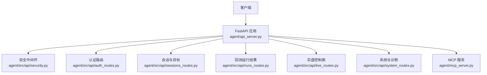
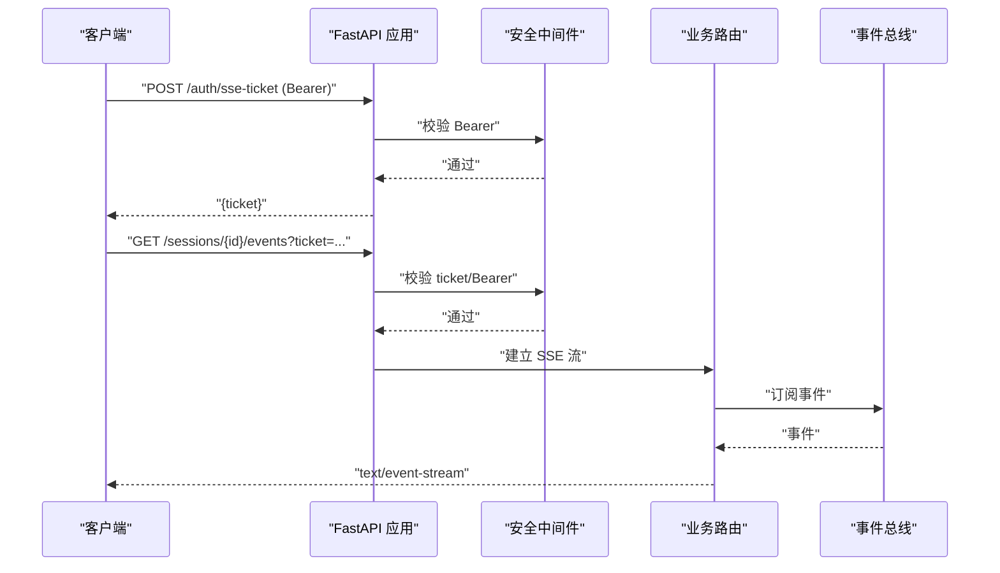
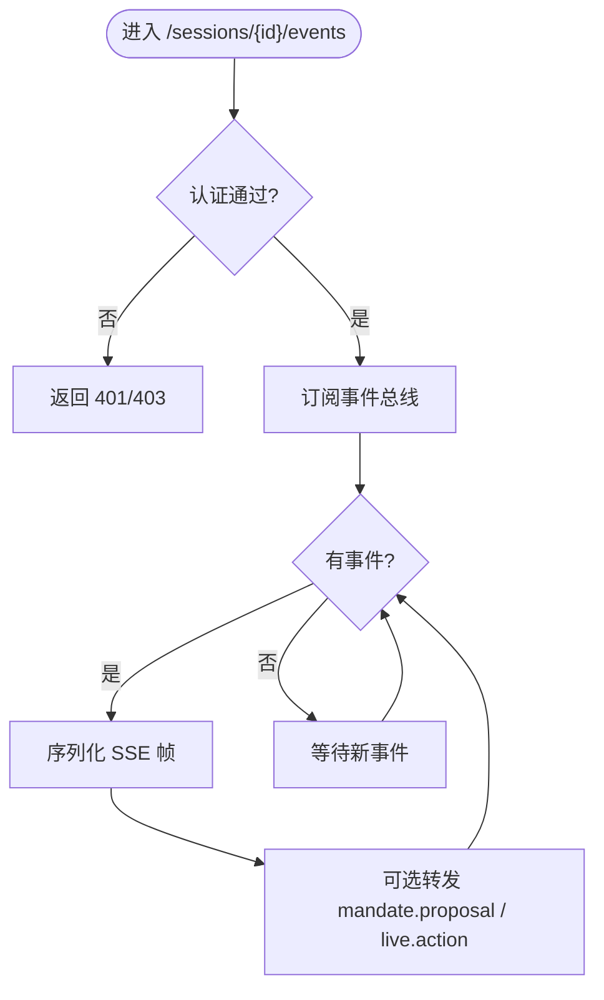
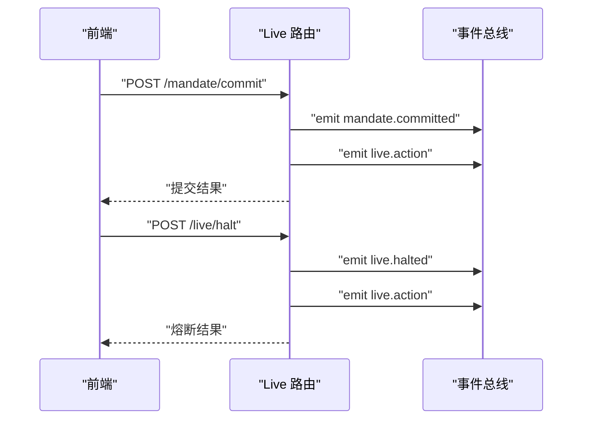
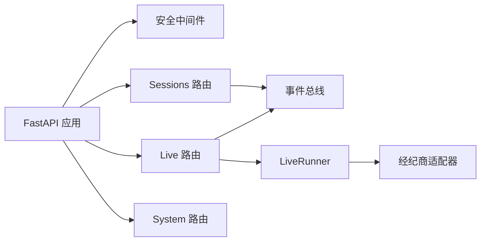

# API参考

<cite>
**本文档引用的文件**   
- [agent/api_server.py](file://agent/api_server.py)
- [agent/mcp_server.py](file://agent/mcp_server.py)
- [agent/src/api/security.py](file://agent/src/api/security.py)
- [agent/src/api/auth_routes.py](file://agent/src/api/auth_routes.py)
- [agent/src/api/sessions_routes.py](file://agent/src/api/sessions_routes.py)
- [agent/src/api/runs_routes.py](file://agent/src/api/runs_routes.py)
- [agent/src/api/live_routes.py](file://agent/src/api/live_routes.py)
- [agent/src/api/system_routes.py](file://agent/src/api/system_routes.py)
- [frontend/src/lib/apiAuth.ts](file://frontend/src/lib/apiAuth.ts)
</cite>

## 目录
1. [简介](#简介)
2. [项目结构](#项目结构)
3. [核心组件](#核心组件)
4. [架构总览](#架构总览)
5. [详细组件分析](#详细组件分析)
6. [依赖关系分析](#依赖关系分析)
7. [性能与速率限制](#性能与速率限制)
8. [故障排查指南](#故障排查指南)
9. [结论](#结论)
10. [附录：协议与版本信息](#附录：协议与版本信息)

## 简介
本参考文档面向 Vibe-Trading 的对外接口，覆盖以下通信方式与能力：
- RESTful API：HTTP 方法、URL 模式、请求/响应模型、认证与安全头。
- WebSocket/SSE：事件流连接、消息格式、重连与会话状态。
- MCP（Model Context Protocol）：stdio、SSE、Streamable HTTP 三种传输；工具清单与调用约定。
- 安全与鉴权：API Key、SSE 票据、CORS、CSP、DNS 反查防护。
- 实时交易控制面：授权、指令提交、熔断开关、运行器状态。
- 运维与系统：健康检查、就绪探针、文档访问、关闭进程。
- 性能优化与调试：限流、缓存、日志脱敏、监控端点。

## 项目结构
Vibe-Trading 将 API 服务以 FastAPI 应用为中心，通过模块化路由注册组织功能域：
- 入口与生命周期：api_server.py 负责创建 FastAPI 实例、挂载中间件、注册各模块路由、启动/停止后台任务。
- 安全与鉴权：security.py 提供 Bearer 校验、SSE 票据、CORS/CSP、本地回环信任策略。
- 业务路由：sessions、runs、live、system、auth、channels、swarm、alpha、qveris 等。
- MCP 服务：mcp_server.py 暴露研究工具集，支持 stdio、SSE、Streamable HTTP 传输。

图表来源
- [agent/api_server.py:163-293](file://agent/api_server.py#L163-L293)
- [agent/src/api/security.py:166-253](file://agent/src/api/security.py#L166-L253)
- [agent/src/api/auth_routes.py:21-56](file://agent/src/api/auth_routes.py#L21-L56)
- [agent/src/api/sessions_routes.py:289-800](file://agent/src/api/sessions_routes.py#L289-L800)
- [agent/src/api/runs_routes.py:226-445](file://agent/src/api/runs_routes.py#L226-L445)
- [agent/src/api/live_routes.py:631-800](file://agent/src/api/live_routes.py#L631-L800)
- [agent/src/api/system_routes.py:166-438](file://agent/src/api/system_routes.py#L166-L438)
- [agent/mcp_server.py:1-80](file://agent/mcp_server.py#L1-L80)

章节来源
- [agent/api_server.py:163-293](file://agent/api_server.py#L163-L293)

## 核心组件
- 认证与鉴权
  - Bearer Token：通过 HTTP Authorization 头传递 API Key。
  - SSE 票据：浏览器 EventSource 无法发送 Authorization 头，需先 POST /auth/sse-ticket 获取一次性票据，再在查询参数中携带 ticket。
  - CORS/CSP：默认允许本地开发站点，生产建议显式配置；CSP 严格限制脚本与资源来源。
  - DNS 反查防护：对网络传输的 MCP 服务增加 Host/Origin 白名单校验。
- 会话与目标
  - 会话 CRUD、消息发送、事件流订阅（SSE）。
  - 研究目标（Goal）的创建、更新、证据追加、状态审计。
- 运行结果
  - 列出历史运行、获取运行详情、代码与指标下载。
- 实盘控制面
  - 授权引导、指令提交、熔断开关、运行器启停与健康状态。
- 系统与诊断
  - 健康检查、就绪探针、相关性计算（带限流）、文档访问、进程关闭。
- MCP 工具服务
  - 暴露研究工具（市场数据、因子、回测、新闻、研报等），支持多种传输。

章节来源
- [agent/src/api/security.py:343-623](file://agent/src/api/security.py#L343-L623)
- [agent/src/api/auth_routes.py:21-56](file://agent/src/api/auth_routes.py#L21-L56)
- [agent/src/api/sessions_routes.py:289-800](file://agent/src/api/sessions_routes.py#L289-L800)
- [agent/src/api/runs_routes.py:226-445](file://agent/src/api/runs_routes.py#L226-L445)
- [agent/src/api/live_routes.py:631-800](file://agent/src/api/live_routes.py#L631-L800)
- [agent/src/api/system_routes.py:166-438](file://agent/src/api/system_routes.py#L166-L438)
- [agent/mcp_server.py:1-80](file://agent/mcp_server.py#L1-L80)

## 架构总览

图表来源
- [agent/src/api/auth_routes.py:21-56](file://agent/src/api/auth_routes.py#L21-L56)
- [agent/src/api/security.py:591-623](file://agent/src/api/security.py#L591-L623)
- [agent/src/api/sessions_routes.py:752-800](file://agent/src/api/sessions_routes.py#L752-L800)

## 详细组件分析

### REST API：会话与目标（Sessions & Goals）
- 认证：所有写操作需要 Bearer Token；事件流可使用 Bearer 或一次性 ticket。
- 关键端点
  - POST /sessions：创建会话，返回会话元信息。
  - GET /sessions：列出会话，支持分页 limit。
  - GET /sessions/{session_id}：获取会话详情。
  - DELETE /sessions/{session_id}：删除会话。
  - PATCH /sessions/{session_id}：更新会话字段（如标题）。
  - POST /sessions/{session_id}/messages：发送用户消息并触发代理循环。
  - POST /sessions/{session_id}/cancel：取消当前运行的代理循环。
  - GET /sessions/{session_id}/messages：拉取会话消息列表。
  - GET /sessions/{session_id}/events：SSE 事件流，支持 Last-Event-ID 重放。
  - 目标管理：
    - POST /sessions/{session_id}/goal：创建或替换当前研究目标。
    - GET /sessions/{session_id}/goal：获取当前目标快照。
    - PATCH /sessions/{session_id}/goal：编辑目标（objective/ui_summary）。
    - POST /sessions/{session_id}/goal/evidence：追加可追溯证据。
    - PATCH /sessions/{session_id}/goal/status：更新目标状态（含审计行）。
- 错误处理
  - 400：参数校验失败（例如风险等级非法）。
  - 404：会话不存在。
  - 409：会话忙或目标冲突（并发更新）。
  - 501：会话运行时未启用。
- 事件类型（SSE）
  - 会话事件：由 SessionService 的事件总线发出。
  - 特殊帧：mandate.proposal、live.action（从工具结果中解析并转发）。

图表来源
- [agent/src/api/sessions_routes.py:752-800](file://agent/src/api/sessions_routes.py#L752-L800)
- [agent/src/api/sessions_routes.py:189-282](file://agent/src/api/sessions_routes.py#L189-L282)

章节来源
- [agent/src/api/sessions_routes.py:289-800](file://agent/src/api/sessions_routes.py#L289-L800)

### REST API：运行结果（Runs）
- 认证：所有端点需要 Bearer Token。
- 关键端点
  - GET /runs：列出最近运行摘要。
  - GET /runs/{run_id}：获取运行详情（支持 chart_payload/chart_symbol 优化）。
  - GET /runs/{run_id}/code：获取策略源码（signal_engine.py）。
  - GET /runs/{run_id}/pine：获取 Pine Script 文件（若存在）。
- 响应模型
  - RunInfo：运行摘要（状态、时间、提示词、收益、夏普、标的、日期范围）。
  - RunResponse：运行详情（状态、指标、图表曲线、交易记录、风险评估、LLM 用量等）。
- 错误处理
  - 404：运行不存在。
  - 400：无效参数（如 chart_payload）。
  - 500：内部读取异常。

章节来源
- [agent/src/api/runs_routes.py:226-445](file://agent/src/api/runs_routes.py#L226-L445)

### REST API：实盘控制面（Live）
- 认证：所有端点需要 Bearer Token。
- 关键端点
  - POST /mandate/commit：提交用户确认的交易指令（唯一写入路径，必须 consent_ack=true）。
  - POST /live/halt：触发熔断（全局或按经纪商）。
  - POST /live/resume：清除熔断。
  - GET /live/status：查询授权状态、活跃指令、运行器心跳、熔断状态。
  - POST /live/authorize：发起 OAuth 引导流程（仅发现型）。
  - POST /live/runner/start：启动持久化运行器（需已提交有效指令）。
  - POST /live/runner/stop：停止运行器。
- 事件广播
  - 通过现有会话事件总线广播 mandate.committed、live.halted、live.resumed、live.action 等事件。
- 错误处理
  - 400：参数校验失败（如 consent_ack 非 true）。
  - 404：未知经纪商。
  - 503：运行器不可用（经纪商未配置/授权）。

图表来源
- [agent/src/api/live_routes.py:649-720](file://agent/src/api/live_routes.py#L649-L720)
- [agent/src/api/live_routes.py:339-354](file://agent/src/api/live_routes.py#L339-L354)

章节来源
- [agent/src/api/live_routes.py:631-800](file://agent/src/api/live_routes.py#L631-L800)

### REST API：系统与诊断（System）
- 健康与就绪
  - GET /live：进程存活探针（无条件返回）。
  - GET /health：兼容别名。
  - GET /ready：就绪探针（检查 LLM 提供商配置与凭据可用性）。
- 分析与限流
  - GET /correlation：跨资产相关性矩阵（每 IP 30 次/分钟滑动窗口）。
  - GET /correlation/regime：相关性 regime 时间线（共享限流预算）。
- 文档与元信息
  - GET /api：服务元信息（包含版本、文档链接）。
  - GET /openapi.json：受认证的 OpenAPI Schema。
  - GET /docs、/redoc：仅在无 API Key 的本地开发模式下可用。
- 进程控制
  - POST /system/shutdown：本地授权后优雅关闭进程。
- 错误处理
  - 400：参数校验失败。
  - 403：非本地关闭请求。
  - 429：超过速率限制。
  - 500/503：计算失败或服务不可用。

章节来源
- [agent/src/api/system_routes.py:166-438](file://agent/src/api/system_routes.py#L166-L438)

### 认证与安全（Security）
- Bearer Token
  - 使用 HTTP Authorization: Bearer <API_KEY>。
  - require_auth 依赖用于敏感端点；require_event_stream_auth 用于事件流。
- SSE 票据
  - 浏览器通过 POST /auth/sse-ticket 获取一次性 ticket（有效期约 60 秒，单次使用）。
  - 事件流 URL 附加 ?ticket=... 完成认证。
- CORS/CSP
  - CORS 默认允许本地开发站点；可通过环境变量扩展额外来源。
  - CSP 严格限制脚本与资源来源；文档页面放宽到 CDN 以加载 UI。
- DNS 反查防护（MCP）
  - 对网络传输的 MCP 服务增加 Host/Origin 白名单校验，防止 DNS Rebinding 攻击。
- 日志脱敏
  - 访问日志中对 api_key、ticket 等敏感查询参数值进行脱敏。

章节来源
- [agent/src/api/security.py:166-253](file://agent/src/api/security.py#L166-L253)
- [agent/src/api/security.py:300-341](file://agent/src/api/security.py#L300-L341)
- [agent/src/api/security.py:343-623](file://agent/src/api/security.py#L343-L623)
- [agent/src/api/auth_routes.py:21-56](file://agent/src/api/auth_routes.py#L21-L56)
- [frontend/src/lib/apiAuth.ts:18-53](file://frontend/src/lib/apiAuth.ts#L18-L53)

### WebSocket/SSE 事件流
- 连接建立
  - 浏览器：先 POST /auth/sse-ticket 获取 ticket，再打开 EventSource 并附带 ?ticket=。
  - 非浏览器：可直接使用 Bearer Token。
- 重连与回放
  - 支持 Last-Event-ID 查询参数或头部，实现断线重连与增量回放。
- 事件内容
  - 会话事件：来自 SessionService 事件总线。
  - 特殊帧：mandate.proposal、live.action（从工具结果中解析并转发）。
- 断开检测
  - 服务端检测客户端断开并及时终止流。

章节来源
- [agent/src/api/sessions_routes.py:752-800](file://agent/src/api/sessions_routes.py#L752-L800)
- [agent/src/api/sessions_routes.py:189-282](file://agent/src/api/sessions_routes.py#L189-L282)
- [frontend/src/lib/apiAuth.ts:18-53](file://frontend/src/lib/apiAuth.ts#L18-L53)

### MCP 协议（Model Context Protocol）
- 传输方式
  - stdio：默认进程内管道传输。
  - sse：遗留 SSE 传输（GET /sse + POST /messages/）。
  - streamable-http：当前规范默认（单端点 /mcp，支持 POST/GET）。
- 安全加固
  - 网络传输时强制 Host/Origin 白名单校验，默认仅允许回环地址。
  - 禁止远程直接调用 shell 工具，除非显式启用。
- 工具与服务
  - 暴露研究工具（市场数据、因子、回测、新闻、研报、选股等）。
  - 所有工具为只读或研究用途，不暴露下单/撤单能力。
- 会话与参数
  - session_id 可选，默认使用服务器进程级会话。
  - 列表/字典参数支持 JSON 字符串自动解码，兼容部分客户端行为。

章节来源
- [agent/mcp_server.py:1-80](file://agent/mcp_server.py#L1-L80)
- [agent/mcp_server.py:130-317](file://agent/mcp_server.py#L130-L317)
- [agent/mcp_server.py:350-457](file://agent/mcp_server.py#L350-L457)

## 依赖关系分析
- 路由注册
  - api_server.py 集中注册各模块路由，并通过 sys.modules 延迟解析依赖，便于测试注入。
- 安全中间件
  - security.py 提供通用鉴权、CORS/CSP、DNS 反查防护、日志脱敏。
- 事件总线
  - sessions_routes 与 live_routes 均复用会话事件总线，保证前端统一消费事件。
- 运行器与经纪商
  - live_routes 通过 MCPServerAdapter 与经纪商交互，构建 LiveRunner 并调度执行。

图表来源
- [agent/api_server.py:163-293](file://agent/api_server.py#L163-L293)
- [agent/src/api/sessions_routes.py:289-800](file://agent/src/api/sessions_routes.py#L289-L800)
- [agent/src/api/live_routes.py:631-800](file://agent/src/api/live_routes.py#L631-L800)

章节来源
- [agent/api_server.py:163-293](file://agent/api_server.py#L163-L293)

## 性能与速率限制
- 相关性计算限流
  - /correlation 与 /correlation/regime 共享滑动窗口限流：每客户端 IP 30 次/分钟。
- 连接器状态缓存
  - live/routes 中的连接器验证结果缓存 15 秒，避免频繁外部调用。
- SSE 流优化
  - 事件流支持 Last-Event-ID 回放，减少重复数据传输。
- 日志脱敏
  - 访问日志自动脱敏敏感查询参数，降低泄露风险。

章节来源
- [agent/src/api/system_routes.py:58-99](file://agent/src/api/system_routes.py#L58-L99)
- [agent/src/api/live_routes.py:172-219](file://agent/src/api/live_routes.py#L172-L219)
- [agent/src/api/security.py:256-297](file://agent/src/api/security.py#L256-L297)

## 故障排查指南
- 认证失败
  - 401：缺少或无效的 Bearer Token；SSE 票据过期或已被使用。
  - 403：非本地关闭请求、跨站请求被拒绝、Host/Origin 不在白名单。
- 会话与目标
  - 404：会话不存在。
  - 409：会话忙或目标冲突（并发更新）。
  - 501：会话运行时未启用。
- 运行结果
  - 404：运行不存在。
  - 400：无效参数（如 chart_payload）。
- 实盘控制面
  - 400：参数校验失败（如 consent_ack 非 true）。
  - 404：未知经纪商。
  - 503：运行器不可用（经纪商未配置/授权）。
- 系统与诊断
  - 429：超过速率限制。
  - 500/503：计算失败或服务不可用。

章节来源
- [agent/src/api/sessions_routes.py:289-800](file://agent/src/api/sessions_routes.py#L289-L800)
- [agent/src/api/runs_routes.py:226-445](file://agent/src/api/runs_routes.py#L226-L445)
- [agent/src/api/live_routes.py:631-800](file://agent/src/api/live_routes.py#L631-L800)
- [agent/src/api/system_routes.py:166-438](file://agent/src/api/system_routes.py#L166-L438)

## 结论
Vibe-Trading 的 API 体系围绕 FastAPI 构建，采用模块化路由与安全中间件，提供稳健的 REST、SSE 与 MCP 接口。认证机制兼顾浏览器与非浏览器场景，安全策略覆盖 CORS/CSP、DNS 反查与日志脱敏。实盘控制面通过明确的生命周期与事件广播，确保前端一致体验。性能方面通过限流与缓存优化关键路径。建议在生产环境启用 API Key、合理配置 CORS/CSP，并结合健康/就绪探针进行监控。

## 附录：协议与版本信息
- 版本
  - API 版本来源于应用版本常量，可通过 /api 获取元信息。
- 文档
  - OpenAPI Schema 受认证保护；Swagger/ReDoc 仅在无 API Key 的本地开发模式可用。
- 迁移与兼容性
  - MCP 的 sse 传输标记为遗留，推荐使用 streamable-http（/mcp）。
  - 事件流兼容 Last-Event-ID 与 last_index 两种参数形式。

章节来源
- [agent/src/api/system_routes.py:368-438](file://agent/src/api/system_routes.py#L368-L438)
- [agent/mcp_server.py:25-35](file://agent/mcp_server.py#L25-L35)