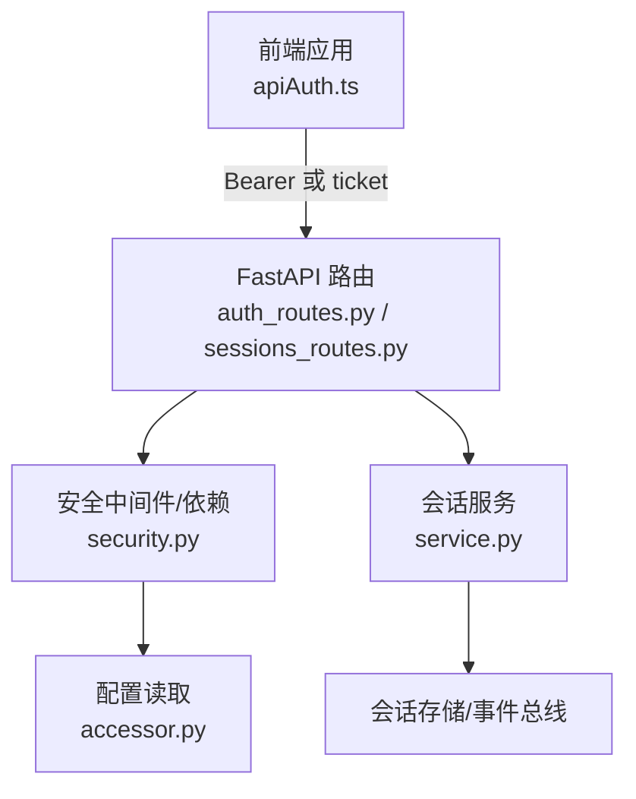
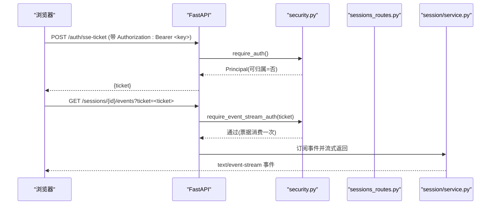
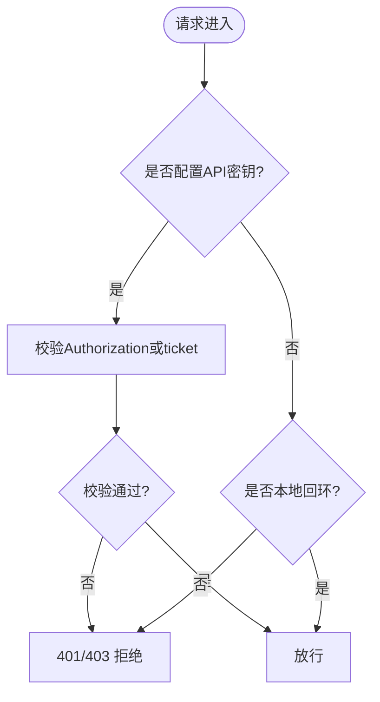
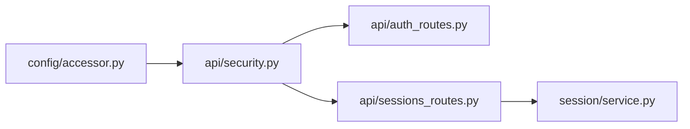

# API认证

<cite>
**本文引用的文件**
- [agent/src/api/security.py](file://agent/src/api/security.py)
- [agent/src/api/auth_routes.py](file://agent/src/api/auth_routes.py)
- [agent/src/api/sessions_routes.py](file://agent/src/api/sessions_routes.py)
- [agent/src/session/service.py](file://agent/src/session/service.py)
- [agent/src/session/models.py](file://agent/src/session/models.py)
- [agent/src/config/accessor.py](file://agent/src/config/accessor.py)
- [frontend/src/lib/apiAuth.ts](file://frontend/src/lib/apiAuth.ts)
- [agent/tests/test_security_auth_api.py](file://agent/tests/test_security_auth_api.py)
</cite>

## 目录
1. [简介](#简介)
2. [项目结构](#项目结构)
3. [核心组件](#核心组件)
4. [架构总览](#架构总览)
5. [详细组件分析](#详细组件分析)
6. [依赖关系分析](#依赖关系分析)
7. [性能与安全考量](#性能与安全考量)
8. [故障排查指南](#故障排查指南)
9. [结论](#结论)
10. [附录：集成示例与最佳实践](#附录集成示例与最佳实践)

## 简介
本安全文档聚焦 Vibe-Trading 的 API 认证系统，覆盖以下主题：
- API 密钥管理、会话认证（含浏览器 SSE 票据机制）、权限控制与访问审计
- 令牌生成、验证与刷新流程（SSE 一次性票据）
- 不同用户角色的权限模型与资源访问控制
- 认证集成代码示例与最佳实践
- 安全威胁防护：DNS 重绑定、跨站请求、CORS 限制、敏感信息日志脱敏等
- 企业级部署中的身份验证与授权策略建议

## 项目结构
认证相关的关键模块位于后端 agent 服务中，前端通过 Bearer Token 和一次性票据完成鉴权。

图表来源
- [agent/src/api/auth_routes.py:21-56](file://agent/src/api/auth_routes.py#L21-L56)
- [agent/src/api/security.py:347-622](file://agent/src/api/security.py#L347-L622)
- [agent/src/api/sessions_routes.py:335-800](file://agent/src/api/sessions_routes.py#L335-L800)
- [agent/src/session/service.py:158-246](file://agent/src/session/service.py#L158-L246)
- [agent/src/config/accessor.py:52-76](file://agent/src/config/accessor.py#L52-L76)
- [frontend/src/lib/apiAuth.ts:1-21](file://frontend/src/lib/apiAuth.ts#L1-L21)

章节来源
- [agent/src/api/security.py:1-670](file://agent/src/api/security.py#L1-L670)
- [agent/src/api/auth_routes.py:1-56](file://agent/src/api/auth_routes.py#L1-L56)
- [agent/src/api/sessions_routes.py:1-800](file://agent/src/api/sessions_routes.py#L1-L800)
- [agent/src/session/service.py:1-605](file://agent/src/session/service.py#L1-L605)
- [agent/src/config/accessor.py:1-149](file://agent/src/config/accessor.py#L1-L149)
- [frontend/src/lib/apiAuth.ts:1-21](file://frontend/src/lib/apiAuth.ts#L1-L21)

## 核心组件
- 安全依赖与中间件：提供 Bearer 校验、SSE 票据校验、CORS/主机信任、安全响应头、日志脱敏等
- 认证路由：为浏览器 EventSource 签发一次性票据
- 会话路由：受认证的会话 CRUD、消息发送、SSE 事件流
- 会话服务：会话生命周期、并发控制、执行编排与审计事件
- 配置层：统一读取环境变量与运行时配置
- 前端认证：本地存储 API Key，自动注入 Authorization 头

章节来源
- [agent/src/api/security.py:166-253](file://agent/src/api/security.py#L166-L253)
- [agent/src/api/security.py:300-341](file://agent/src/api/security.py#L300-L341)
- [agent/src/api/security.py:347-622](file://agent/src/api/security.py#L347-L622)
- [agent/src/api/auth_routes.py:21-56](file://agent/src/api/auth_routes.py#L21-L56)
- [agent/src/api/sessions_routes.py:335-800](file://agent/src/api/sessions_routes.py#L335-L800)
- [agent/src/session/service.py:53-246](file://agent/src/session/service.py#L53-L246)
- [agent/src/config/accessor.py:52-76](file://agent/src/config/accessor.py#L52-L76)
- [frontend/src/lib/apiAuth.ts:1-21](file://frontend/src/lib/apiAuth.ts#L1-L21)

## 架构总览
认证体系采用“密钥优先 + 开发模式回退”的策略：
- 当配置了 API 密钥时，所有请求（包括本地回环）必须携带有效 Bearer Token；否则拒绝
- 未配置密钥时，仅允许本地回环客户端访问（含 Docker 网关白名单开关），远程访问被拒绝
- 浏览器无法在 EventSource 中发送 Authorization 头，因此通过 POST /auth/sse-ticket 换取一次性票据，再用于 SSE 连接

图表来源
- [agent/src/api/auth_routes.py:21-56](file://agent/src/api/auth_routes.py#L21-L56)
- [agent/src/api/security.py:571-622](file://agent/src/api/security.py#L571-L622)
- [agent/src/api/sessions_routes.py:752-800](file://agent/src/api/sessions_routes.py#L752-L800)
- [agent/src/session/service.py:158-246](file://agent/src/session/service.py#L158-L246)

## 详细组件分析

### 安全依赖与中间件（security.py）
- 认证入口
  - require_auth：校验 Bearer Token，返回 Principal
  - require_event_stream_auth：支持 Bearer 或一次性 ticket（SSE）
  - require_local_or_auth / require_settings_write_auth：按场景放宽或收紧
- 密钥解析与比较
  - _configured_api_key：从配置读取 API_AUTH_KEY（兼容旧别名）
  - hmac.compare_digest 防时序攻击
- 浏览器与跨域保护
  - CORS 默认仅允许本地回环；禁止 credentialed 通配符
  - 拒绝不安全 sec-fetch-site/cross-site 与不匹配 origin
- DNS 重绑定防护
  - 对来自回环的请求校验 Host 是否可信，防止绕过
- 安全响应头
  - CSP、X-Content-Type-Options、X-Frame-Options、Permissions-Policy、Referrer-Policy
- 日志脱敏
  - 对查询参数中的 api_key/ticket 值进行脱敏，避免泄露到访问日志
- 票据机制
  - 生成一次性 ticket（~60s TTL），首次使用即失效，防止重放

图表来源
- [agent/src/api/security.py:347-622](file://agent/src/api/security.py#L347-L622)
- [agent/src/api/security.py:166-253](file://agent/src/api/security.py#L166-L253)
- [agent/src/api/security.py:256-297](file://agent/src/api/security.py#L256-L297)
- [agent/src/api/security.py:300-341](file://agent/src/api/security.py#L300-L341)

章节来源
- [agent/src/api/security.py:1-670](file://agent/src/api/security.py#L1-L670)

### 认证辅助路由（auth_routes.py）
- 注册 /auth/sse-ticket 端点，要求先通过 require_auth（Header-only）才能签发一次性票据
- 目的：避免将长寿命 API Key 放入 URL 或 SSE 查询串，降低泄露风险

章节来源
- [agent/src/api/auth_routes.py:1-56](file://agent/src/api/auth_routes.py#L1-L56)

### 会话路由与事件流（sessions_routes.py）
- 受保护的会话 CRUD、消息发送、取消、列表等接口均依赖 require_auth
- SSE 事件流 /sessions/{id}/events 使用 require_event_stream_auth，支持 Bearer 或 ticket
- 路径参数校验：session_id/run_id 严格白名单，防止路径穿越
- 事件转发：将 AgentLoop 的事件（工具调用/结果、live action、mandate proposal）以 SSE 帧推送

章节来源
- [agent/src/api/sessions_routes.py:335-800](file://agent/src/api/sessions_routes.py#L335-L800)

### 会话服务（session/service.py）
- 会话创建、消息发送、尝试执行、取消、状态更新
- 并发控制：每个会话同一时间仅一个运行实例，避免消息交错
- 审计与追踪：记录 attempt 状态、指标、工具轨迹，并通过事件总线广播
- 历史消息压缩：按字符预算裁剪上下文，保留关键元数据

章节来源
- [agent/src/session/service.py:53-246](file://agent/src/session/service.py#L53-L246)
- [agent/src/session/service.py:248-440](file://agent/src/session/service.py#L248-L440)
- [agent/src/session/service.py:442-605](file://agent/src/session/service.py#L442-L605)

### 权限模型与主体（session/models.py）
- AuthMethod：shared_key、loopback_trust、federated_identity
- Principal：subject、auth_method、attributable（当前 shared_key/loopback 不可归属到人）
- 设计要点：任何需要“可归属到人”的控制面必须检查 attributable，避免误用角色标签作为身份

章节来源
- [agent/src/session/models.py:16-118](file://agent/src/session/models.py#L16-L118)

### 配置层（config/accessor.py）
- 单例 EnvConfig，线程安全，支持运行时重置
- get_env_or 提供新旧环境变量兼容（如 API_AUTH_KEY 与 VIBE_TRADING_API_KEY）

章节来源
- [agent/src/config/accessor.py:1-149](file://agent/src/config/accessor.py#L1-L149)

### 前端集成（frontend/src/lib/apiAuth.ts）
- 本地存储 API Key，构造 Authorization: Bearer <key> 头
- 与后端配合：普通 API 使用 Bearer；SSE 通过 /auth/sse-ticket 获取 ticket 后连接

章节来源
- [frontend/src/lib/apiAuth.ts:1-21](file://frontend/src/lib/apiAuth.ts#L1-L21)

## 依赖关系分析
- security.py 依赖 config/accessor.py 读取 API 密钥与 CORS 配置
- auth_routes.py 依赖 security.py 的票据生成
- sessions_routes.py 依赖 security.py 的认证依赖与会话服务
- session/service.py 依赖事件总线与存储，负责执行编排与审计

图表来源
- [agent/src/config/accessor.py:52-76](file://agent/src/config/accessor.py#L52-L76)
- [agent/src/api/security.py:347-622](file://agent/src/api/security.py#L347-L622)
- [agent/src/api/auth_routes.py:21-56](file://agent/src/api/auth_routes.py#L21-L56)
- [agent/src/api/sessions_routes.py:335-800](file://agent/src/api/sessions_routes.py#L335-L800)
- [agent/src/session/service.py:158-246](file://agent/src/session/service.py#L158-L246)

章节来源
- [agent/src/api/security.py:1-670](file://agent/src/api/security.py#L1-L670)
- [agent/src/api/sessions_routes.py:1-800](file://agent/src/api/sessions_routes.py#L1-L800)
- [agent/src/session/service.py:1-605](file://agent/src/session/service.py#L1-L605)
- [agent/src/config/accessor.py:1-149](file://agent/src/config/accessor.py#L1-L149)

## 性能与安全考量
- 性能
  - SSE 票据内存表定期清理过期项，避免无限增长
  - 会话服务限制并发执行，避免资源耗尽
  - 历史消息按字符预算裁剪，减少 LLM 上下文压力
- 安全
  - 密钥优先：一旦配置 API 密钥，本地回环也必须携带有效 Bearer
  - DNS 重绑定防护：本地回环请求需校验 Host 可信，防止绕过认证
  - CORS 严格：默认仅本地回环，禁止 credentialed 通配符
  - 安全响应头：CSP、X-Frame-Options、Permissions-Policy、Referrer-Policy
  - 日志脱敏：查询参数中的 api_key/ticket 值脱敏，避免泄露
  - 路径参数白名单：防止路径穿越与注入
  - 一次性票据：SSE 票据单次使用且短 TTL，防止重放

章节来源
- [agent/src/api/security.py:166-253](file://agent/src/api/security.py#L166-L253)
- [agent/src/api/security.py:256-297](file://agent/src/api/security.py#L256-L297)
- [agent/src/api/security.py:300-341](file://agent/src/api/security.py#L300-L341)
- [agent/src/api/security.py:347-622](file://agent/src/api/security.py#L347-L622)
- [agent/src/api/sessions_routes.py:618-735](file://agent/src/api/sessions_routes.py#L618-L735)
- [agent/src/session/service.py:30-91](file://agent/src/session/service.py#L30-L91)
- [agent/src/session/service.py:515-565](file://agent/src/session/service.py#L515-L565)

## 故障排查指南
- 401/403 错误
  - 未配置 API 密钥且非本地回环：需设置 API_AUTH_KEY 或在本地调试
  - 已配置 API 密钥但缺少 Bearer：需在请求头添加 Authorization: Bearer <key>
  - 浏览器 SSE 连接失败：确保先调用 /auth/sse-ticket 获取 ticket，再用 ?ticket= 连接
- 跨站请求被拒
  - 检查 Origin/sec-fetch-site，确保同源或可信来源
- DNS 重绑定
  - 若 Host 被篡改，将被拒绝；请确保 Host 与实际服务一致
- 路径参数非法
  - session_id/run_id 必须为白名单格式，包含路径穿越字符会被拒绝
- 日志泄露
  - 确认已启用日志脱敏过滤器，避免 api_key/ticket 明文出现在日志中

章节来源
- [agent/tests/test_security_auth_api.py:43-224](file://agent/tests/test_security_auth_api.py#L43-L224)
- [agent/tests/test_security_auth_api.py:414-449](file://agent/tests/test_security_auth_api.py#L414-L449)
- [agent/tests/test_security_auth_api.py:544-563](file://agent/tests/test_security_auth_api.py#L544-L563)
- [agent/tests/test_security_auth_api.py:617-735](file://agent/tests/test_security_auth_api.py#L617-L735)

## 结论
Vibe-Trading 的认证体系以“密钥优先”为核心，结合本地回环开发模式与严格的浏览器安全策略，提供了健壮的 API 访问控制。通过一次性票据解决浏览器 SSE 鉴权难题，辅以 DNS 重绑定防护、CORS 限制、安全响应头与日志脱敏，有效降低了常见 Web 安全风险。在企业环境中，建议：
- 始终配置 API_AUTH_KEY 并强制 Bearer 认证
- 使用反向代理终止 TLS 并设置 HSTS
- 基于身份提供商实现可归属的身份（federated_identity），以满足合规审计需求
- 最小化 CORS 白名单，严格限制来源
- 对敏感操作（如设置写入、系统关闭）实施额外审批与审计

## 附录：集成示例与最佳实践

### 认证流程与令牌刷新
- 普通 API：在请求头携带 Authorization: Bearer <API_AUTH_KEY>
- 浏览器 SSE：
  1) POST /auth/sse-ticket（带 Authorization 头）获取 ticket
  2) GET /sessions/{id}/events?ticket=<ticket> 建立事件流
  3) 票据一次性使用，如需重新连接则再次申请

章节来源
- [agent/src/api/auth_routes.py:21-56](file://agent/src/api/auth_routes.py#L21-L56)
- [agent/src/api/security.py:571-622](file://agent/src/api/security.py#L571-L622)
- [agent/src/api/sessions_routes.py:752-800](file://agent/src/api/sessions_routes.py#L752-L800)

### 权限模型与资源访问控制
- 共享密钥与回环信任均不可归属到人，仅能证明“持有密钥/来自可信来源”
- 需要“可归属到人”的操作应等待 federated_identity 接入后启用
- 资源访问：
  - 会话 CRUD、消息、事件流均需认证
  - 设置写入与系统控制需更严格认证（必要时结合外部审批）

章节来源
- [agent/src/session/models.py:16-118](file://agent/src/session/models.py#L16-L118)
- [agent/src/api/sessions_routes.py:335-800](file://agent/src/api/sessions_routes.py#L335-L800)

### 安全最佳实践
- 生产环境务必配置 API_AUTH_KEY，并禁用无密钥的回环信任
- 使用反向代理配置 HSTS、严格 CSP、限制权限策略
- 最小化 CORS 白名单，避免 credentialed 通配符
- 对敏感操作开启审计日志与告警
- 定期轮换 API 密钥，限制票据 TTL 与最大并发

章节来源
- [agent/src/api/security.py:166-253](file://agent/src/api/security.py#L166-L253)
- [agent/src/api/security.py:256-297](file://agent/src/api/security.py#L256-L297)
- [agent/src/api/security.py:347-622](file://agent/src/api/security.py#L347-L622)

### 前端集成要点
- 将 API Key 存储在安全位置（如浏览器安全存储），并在每次请求注入 Authorization 头
- SSE 连接前通过 /auth/sse-ticket 获取 ticket，避免将长寿命密钥放入 URL
- 处理 401/403 错误提示用户配置或刷新凭证

章节来源
- [frontend/src/lib/apiAuth.ts:1-21](file://frontend/src/lib/apiAuth.ts#L1-L21)