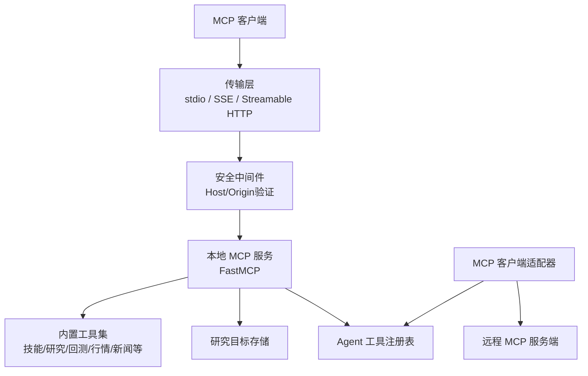
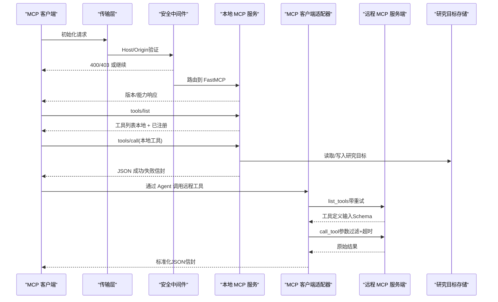
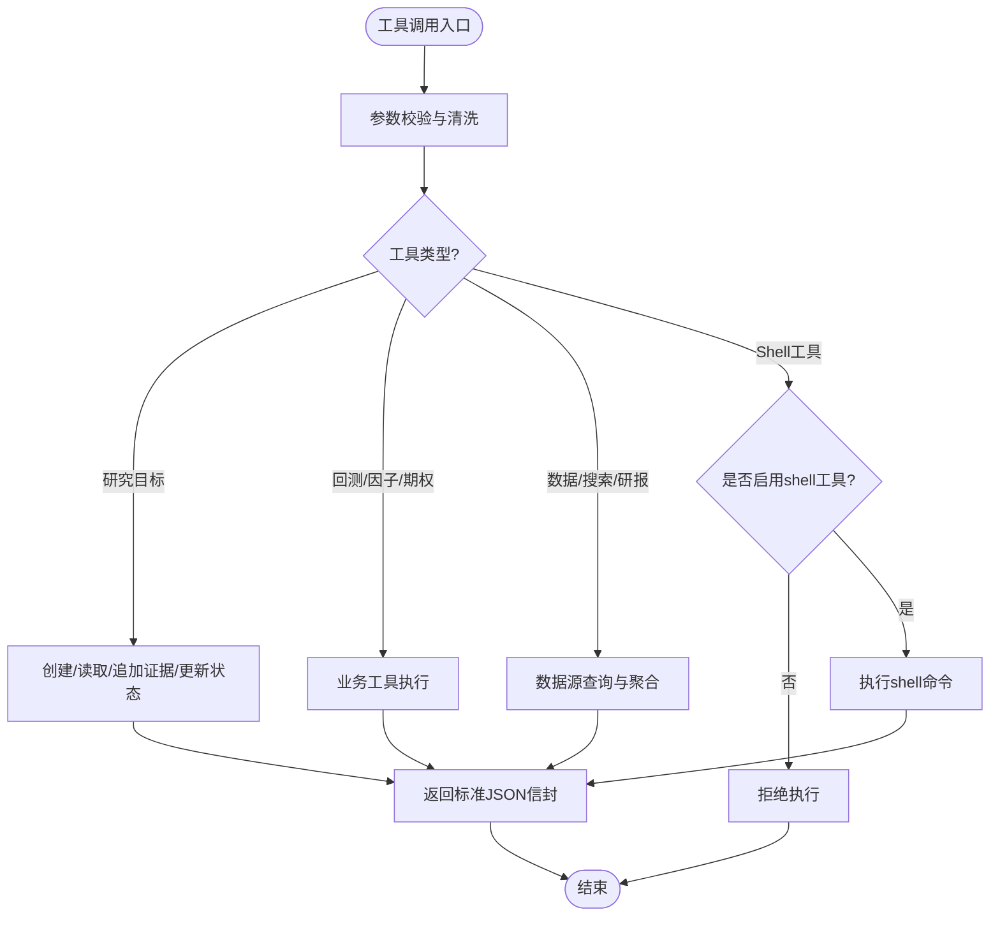
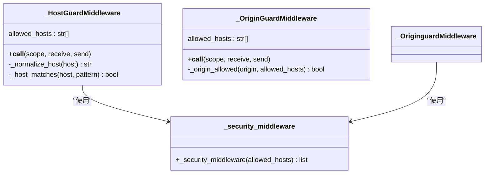
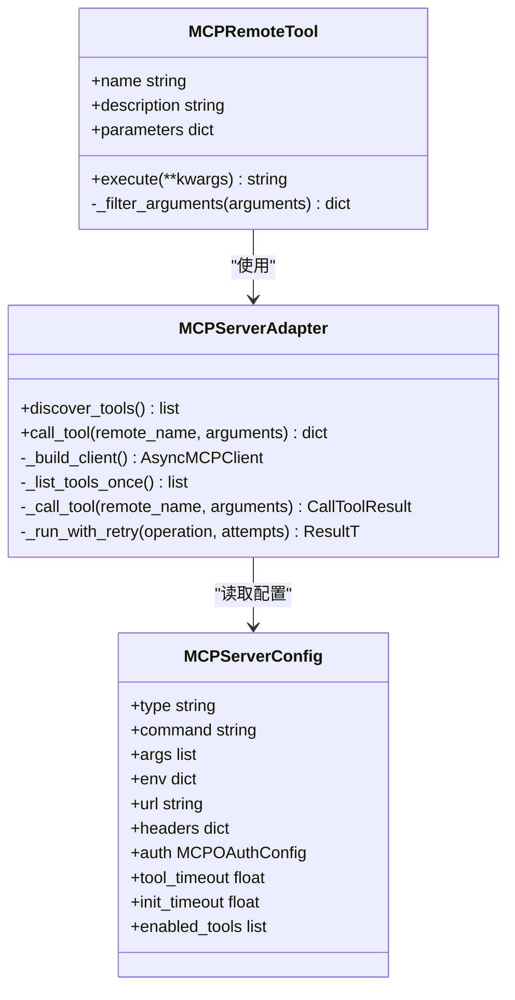
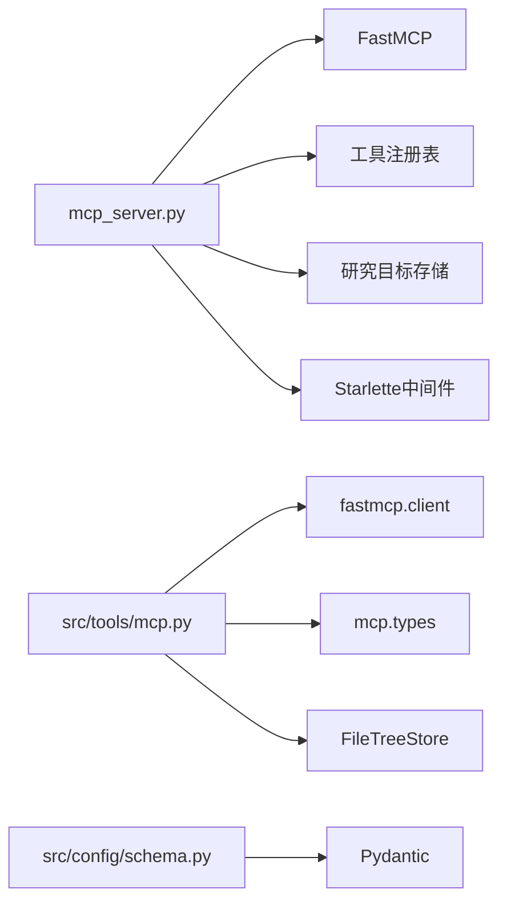

# MCP协议

<cite>
**本文引用的文件**
- [mcp_server.py](file://agent/mcp_server.py)
- [mcp.py](file://agent/src/tools/mcp.py)
- [schema.py](file://agent/src/config/schema.py)
- [env_schema.py](file://agent/src/config/env_schema.py)
- [service.py](file://agent/src/session/service.py)
- [test_mcp_host_origin_guard.py](file://agent/tests/test_mcp_host_origin_guard.py)
- [README_zh.md](file://README_zh.md)
</cite>

## 更新摘要
**所做更改**
- 增强了MCP服务器安全架构，新增默认拒绝的shell工具策略
- 实现了网络传输层DNS重绑定攻击防护机制
- 添加了全面的Host/Origin验证中间件
- 更新了安全架构文档和相关配置说明

## 目录
1. [简介](#简介)
2. [项目结构](#项目结构)
3. [核心组件](#核心组件)
4. [架构总览](#架构总览)
5. [详细组件分析](#详细组件分析)
6. [依赖关系分析](#依赖关系分析)
7. [性能考虑](#性能考虑)
8. [故障排查指南](#故障排查指南)
9. [结论](#结论)
10. [附录](#附录)

## 简介
本技术文档面向 Vibe-Trading 的 Model Context Protocol（MCP）服务器实现，聚焦以下目标：
- 连接建立与传输：支持 stdio、SSE 与 Streamable HTTP 三种传输；提供网络传输的主机/来源白名单防护。
- 消息格式与工具调用：统一 JSON 信封、参数规范化、远程工具包装与执行、错误封装。
- 事件处理与会话集成：研究目标生命周期、证据追加、状态更新与审计。
- 支持的 MCP 工具清单、参数规范与返回值格式。
- 与 Agent 系统的集成方式：工具注册、上下文传递、会话级配置覆盖、状态管理。
- MCP 客户端集成示例：连接配置、工具调用、错误处理。
- 性能优化建议、调试工具与监控方法。
- MCP 在 AI 代理工作流中的作用与扩展机制。

**更新** 新增了默认拒绝的shell工具策略和网络传输安全防护，防止DNS重绑定攻击和进程控制面滥用。

## 项目结构
Vibe-Trading 的 MCP 能力由"本地 MCP 服务"和"外部 MCP 客户端适配器"两部分组成：
- 本地 MCP 服务：暴露 64 个只读/研究类工具，供任意 MCP 客户端通过 stdio/SSE/HTTP 访问。
- 外部 MCP 客户端适配器：将已配置的远程 MCP 服务端工具以本地 BaseTool 形式注册到 Agent 工具注册表，供 Agent 循环调用。

**图表来源**
- [mcp_server.py:69-81](file://agent/mcp_server.py#L69-L81)
- [mcp_server.py:229-303](file://agent/mcp_server.py#L229-L303)
- [mcp.py:143-206](file://agent/src/tools/mcp.py#L143-L206)

**章节来源**
- [mcp_server.py:1-81](file://agent/mcp_server.py#L1-L81)
- [README_zh.md:1113-1117](file://README_zh.md#L1113-L1117)

## 核心组件
- 本地 MCP 服务（FastMCP 应用）
  - 启动入口、传输选择、安全中间件、工具注册、研究目标生命周期。
- MCP 客户端适配器
  - 发现远程工具、构建本地包装、参数过滤、结果归一化、重试策略、OAuth 与持久缓存。
- 配置模型
  - MCPServerConfig、MCPOAuthConfig、AgentConfig 校验与约束（含券商白名单限制）。
- 会话服务
  - 会话创建、消息发送、并发控制、事件总线。

**更新** 新增了默认拒绝的shell工具策略，所有进程控制工具（bash、background_run、cancel_background）默认关闭，需要显式启用。

**章节来源**
- [mcp_server.py:69-81](file://agent/mcp_server.py#L69-L81)
- [mcp_server.py:93-128](file://agent/mcp_server.py#L93-L128)
- [mcp.py:143-206](file://agent/src/tools/mcp.py#L143-L206)
- [schema.py:349-411](file://agent/src/config/schema.py#L349-L411)
- [service.py:53-117](file://agent/src/session/service.py#L53-L117)

## 架构总览
下图展示从 MCP 客户端到本地/远程工具的完整调用链，包括认证、工具发现、参数规范化与结果封装。

**图表来源**
- [mcp_server.py:69-81](file://agent/mcp_server.py#L69-L81)
- [mcp_server.py:229-303](file://agent/mcp_server.py#L229-L303)
- [mcp.py:401-473](file://agent/src/tools/mcp.py#L401-L473)
- [mcp.py:537-589](file://agent/src/tools/mcp.py#L537-L589)

## 详细组件分析

### 本地 MCP 服务（FastMCP）
- 传输与安全
  - 支持 stdio、SSE、Streamable HTTP；网络传输启用 Host/Origin 白名单中间件，默认仅环回地址。
  - **新增** 默认拒绝的shell工具策略：进程控制工具（bash、background_run、cancel_background）在所有传输模式下默认关闭，需要通过环境变量 `VIBE_TRADING_ENABLE_SHELL_TOOLS=1` 或命令行参数 `--enable-shell-tools` 显式启用。
  - **新增** DNS重绑定攻击防护：通过自定义ASGI中间件验证Host和Origin头，防止恶意网页通过DNS重绑定访问本地MCP端点。
- 工具注册
  - 内置工具涵盖技能、研究目标、回测、因子分析、期权、市场数据、资金流、新闻、研报、机构持仓、ETF穿透、预测市场、论文检索、Swarm 编排、交易流水与影子账户分析等。
  - 所有暴露工具均为只读或研究用途，不暴露下单/撤单工具。
- 研究目标生命周期
  - start_research_goal：创建或替换当前研究目标，支持预算、风险等级、协议与检查项。
  - get_research_goal：获取当前目标快照。
  - add_goal_evidence：追加可追溯证据，支持来源、时间范围、假设、置信度与矛盾声明。
  - update_research_goal_status：完成/取消/阻塞/暂停并附带审计行。

**图表来源**
- [mcp_server.py:530-735](file://agent/mcp_server.py#L530-L735)
- [mcp_server.py:743-800](file://agent/mcp_server.py#L743-L800)
- [mcp_server.py:93-128](file://agent/mcp_server.py#L93-L128)

**章节来源**
- [mcp_server.py:86-128](file://agent/mcp_server.py#L86-L128)
- [mcp_server.py:131-317](file://agent/mcp_server.py#L131-L317)
- [mcp_server.py:495-735](file://agent/mcp_server.py#L495-L735)
- [mcp_server.py:743-800](file://agent/mcp_server.py#L743-L800)

### 网络安全中间件
- **新增** Host验证中间件
  - 验证HTTP请求的Host头，防止DNS重绑定攻击。
  - 支持IPv6地址、端口剥离、大小写不敏感匹配。
  - 默认允许环回地址（127.0.0.1、::1、localhost）。
- **新增** Origin验证中间件
  - 验证跨域请求的Origin头，阻止来自不受信域的浏览器请求。
  - 非浏览器客户端（如curl、Python SDK）不发送Origin头时允许通过。
  - 支持通配符模式（*.example.com）和完全匹配。
- **新增** 配置解析
  - 通过环境变量 `VIBE_TRADING_MCP_ALLOWED_HOSTS` 配置允许的Host列表。
  - 支持逗号分隔的多个主机名，自动去除空白字符。

**图表来源**
- [mcp_server.py:229-303](file://agent/mcp_server.py#L229-L303)
- [mcp_server.py:145-227](file://agent/mcp_server.py#L145-L227)

**章节来源**
- [mcp_server.py:131-317](file://agent/mcp_server.py#L131-L317)
- [test_mcp_host_origin_guard.py:1-218](file://agent/tests/test_mcp_host_origin_guard.py#L1-L218)

### MCP 客户端适配器（远程工具包装）
- 工具发现与缓存
  - 基于配置键生成内容哈希缓存 key，线程安全地缓存工具发现结果。
  - 支持 transient 错误重试（list_tools），但工具调用不自动重试以避免副作用重复。
- 名称与冲突处理
  - 生成稳定本地工具名 mcp_<server>_<tool>；对命名冲突进行确定性去重并输出操作者可见警告。
- 参数与 Schema 规范化
  - 将远程 inputSchema 归一化为 OpenAI 兼容对象；清理 anyOf/null 分支；折叠 type 列表中的 null。
  - 针对部分 MCP 客户端将 list/dict 序列化为 JSON 字符串的问题，提供 BeforeValidator 解码。
- OAuth 与持久缓存
  - 为 Streamable HTTP 支持 OAuth，使用 FileTreeStore 持久化刷新令牌，权限 0700。
  - init_timeout 默认不低于 tool_timeout 且至少 30s，适配冷启动与浏览器授权场景。

**图表来源**
- [mcp.py:143-206](file://agent/src/tools/mcp.py#L143-L206)
- [mcp.py:370-473](file://agent/src/tools/mcp.py#L370-L473)
- [mcp.py:629-694](file://agent/src/tools/mcp.py#L629-L694)
- [schema.py:349-411](file://agent/src/config/schema.py#L349-L411)

**章节来源**
- [mcp.py:62-84](file://agent/src/tools/mcp.py#L62-L84)
- [mcp.py:209-287](file://agent/src/tools/mcp.py#L209-L287)
- [mcp.py:289-324](file://agent/src/tools/mcp.py#L289-L324)
- [mcp.py:340-367](file://agent/src/tools/mcp.py#L340-L367)
- [mcp.py:401-473](file://agent/src/tools/mcp.py#L401-L473)
- [mcp.py:537-589](file://agent/src/tools/mcp.py#L537-L589)
- [mcp.py:629-694](file://agent/src/tools/mcp.py#L629-L694)

### 配置与约束（含券商安全）
- 传输与字段校验
  - stdio 必须提供 command；URL 类 transport 必须显式 type（sse/streamableHttp）；OAuth 必须 HTTPS。
  - OAuth 与静态 headers 互斥，防止 Authorization 头冲突。
- 实盘券商白名单与通配符限制
  - 对 live broker（如 Robinhood、IBKR）禁止 enabledTools=["*"]，除非满足特定 read-only 探测条件（例如 IBKR 的 mcp.read 范围）。
  - 提供 Robinhood 只读种子配置与 IBKR 只读种子配置，确保首次探测安全。
- 会话级覆盖
  - 通过 API 创建 session 时可在 session.config.mcpServers 中按会话覆盖全局 MCP 配置。
- **新增** Shell工具安全配置
  - 通过环境变量 `VIBE_TRADING_ENABLE_SHELL_TOOLS` 控制shell工具启用。
  - 通过命令行参数 `--enable-shell-tools` 临时启用shell工具。
  - 默认关闭，防止进程控制面被滥用。

**章节来源**
- [schema.py:11-50](file://agent/src/config/schema.py#L11-L50)
- [schema.py:72-142](file://agent/src/config/schema.py#L72-L142)
- [schema.py:145-237](file://agent/src/config/schema.py#L145-L237)
- [schema.py:349-411](file://agent/src/config/schema.py#L349-L411)
- [schema.py:452-492](file://agent/src/config/schema.py#L452-L492)
- [env_schema.py:279-281](file://agent/src/config/env_schema.py#L279-L281)
- [README_zh.md:1358-1392](file://README_zh.md#L1358-L1392)

### 会话与服务集成
- 会话创建与消息发送
  - 创建会话后记录标题并索引；发送消息前抢占式预留会话，避免并发写冲突。
  - 消息持久化、搜索索引、SSE 事件广播。
- 并发与终止态
  - 每个会话同一时刻仅允许一个运行；终端状态映射为 SSE 事件（completed/cancelled/failed）。

**章节来源**
- [service.py:53-117](file://agent/src/session/service.py#L53-L117)
- [service.py:118-200](file://agent/src/session/service.py#L118-L200)

## 依赖关系分析
- 本地服务依赖
  - FastMCP 作为 ASGI 应用承载工具；内置工具依赖 Agent 工具注册表、研究目标存储、市场数据加载器。
  - **新增** 依赖Starlette中间件框架用于实现Host/Origin验证。
- 适配器依赖
  - fastmcp.client（Client、Transport、OAuth）、mcp.types、key_value.aio.stores.filetree（令牌缓存）。
- 配置依赖
  - Pydantic 模型校验；券商 URL 主机后缀识别；OAuth 字段约束。
- 测试依赖
  - 单元测试覆盖工具发现、名称冲突、Schema 归一化、JSON 字符串参数解码、OAuth 传输构造、未知工具分类拒绝。
  - **新增** 网络安全中间件测试覆盖Host/Origin验证逻辑。

**图表来源**
- [mcp_server.py:69-81](file://agent/mcp_server.py#L69-L81)
- [mcp_server.py:229-303](file://agent/mcp_server.py#L229-L303)
- [mcp.py:17-33](file://agent/src/tools/mcp.py#L17-L33)
- [schema.py:349-411](file://agent/src/config/schema.py#L349-L411)

**章节来源**
- [mcp_server.py:69-81](file://agent/mcp_server.py#L69-L81)
- [mcp.py:17-33](file://agent/src/tools/mcp.py#L17-L33)
- [schema.py:349-411](file://agent/src/config/schema.py#L349-L411)

## 性能考虑
- 工具发现缓存
  - 基于 server_name 与配置内容的哈希缓存，减少重复 list_tools 开销。
- 重试策略
  - list_tools 支持有限次数的瞬态错误重试；工具调用不自动重试，避免副作用重复。
- 超时与初始化
  - tool_timeout 控制单次调用；init_timeout 默认不低于 tool_timeout 且至少 30s，适配冷启动/OAuth。
- 参数解码
  - 对 JSON 字符串形式的 list/dict 参数进行前置解码，降低模型侧序列化导致的验证失败。
- 网络传输安全
  - Host/Origin 白名单中间件减少 DNS 重绑定攻击面，避免不必要的请求处理。
- **新增** 安全中间件性能
  - 轻量级ASGI中间件，仅在HTTP传输时生效，对stdio传输无影响。
  - 高效的Host/Origin验证逻辑，最小化请求延迟。

**章节来源**
- [mcp.py:62-84](file://agent/src/tools/mcp.py#L62-L84)
- [mcp.py:537-589](file://agent/src/tools/mcp.py#L537-L589)
- [mcp.py:411-449](file://agent/src/tools/mcp.py#L411-L449)
- [mcp_server.py:131-317](file://agent/mcp_server.py#L131-L317)

## 故障排查指南
- 常见错误与定位
  - 工具发现失败：检查 enabled_tools 白名单、transport 配置、网络可达性与 OAuth 范围。
  - 参数校验失败：确认 list/dict 参数是否为 JSON 字符串；查看 Schema 归一化后的 required/properties。
  - 券商工具受限：live broker 禁止通配符 enabledTools=["*"]，需使用只读种子或显式白名单。
  - 会话冲突：HTTP 409 表示会话已有运行在进行中，等待或取消后再试。
  - **新增** 网络安全错误：400错误表示Host头不被信任，403错误表示Origin头不被信任。
- 调试与日志
  - 启用日志观察适配器重试、名称冲突告警、零工具启用警告。
  - 使用测试夹具与单元测试快速验证传输构造、OAuth 配置与工具分类。
  - **新增** 检查Host/Origin验证日志，确认安全中间件正常工作。
- 恢复步骤
  - 修正配置后重启进程（不支持热重载）；必要时清除 OAuth 缓存目录并重走授权流程。
  - **新增** 如需启用shell工具，设置 `VIBE_TRADING_ENABLE_SHELL_TOOLS=1` 或使用 `--enable-shell-tools` 参数。

**章节来源**
- [mcp.py:327-337](file://agent/src/tools/mcp.py#L327-L337)
- [mcp.py:731-793](file://agent/src/tools/mcp.py#L731-L793)
- [schema.py:452-492](file://agent/src/config/schema.py#L452-L492)
- [service.py:93-117](file://agent/src/session/service.py#L93-L117)
- [mcp_server.py:229-303](file://agent/mcp_server.py#L229-L303)

## 结论
Vibe-Trading 的 MCP 实现以"本地只读/研究工具 + 远程工具包装"为核心，提供稳定的传输、安全的配置与清晰的错误封装。**最新更新** 增强了安全架构，通过默认拒绝的shell工具策略和网络传输防护，有效防止了DNS重绑定攻击和进程控制面滥用。通过研究目标生命周期与 Agent 工具注册表的深度集成，MCP 成为 AI 代理工作流中可靠的能力扩展点。结合缓存、重试、超时与网络守卫，系统在可用性与安全性之间取得平衡，适合在 CLI、Web UI、REST 与多通道场景中复用。

## 附录

### 支持的 MCP 工具清单
- 本地暴露工具（64 个）：list_skills、load_skill、start_research_goal、get_research_goal、add_goal_evidence、update_research_goal_status、backtest、factor_analysis、alpha_zoo、alpha_bench、analyze_options、analyze_options_payoff、pattern_recognition、read_url、read_document、web_search、write_file、read_file、list_swarm_presets、run_swarm、get_market_data、get_fund_flow、get_dragon_tiger、get_northbound_flow、get_margin_trading、get_block_trades、get_shareholder_count、get_lockup_expiry、get_sector_info、get_research_reports、get_stock_news、get_sec_filings、get_financial_statements、get_options_chain、get_stock_profile、screen_market、search_symbol、get_macro_series、iwencai_search、qveris_search、qveris_inspect、qveris_execute、get_institutional_holdings、etf_holdings、prediction_market、research_papers、get_swarm_status、get_run_result、list_runs、reap_stale_runs、retry_run、analyze_trade_journal、extract_shadow_strategy、run_shadow_backtest、render_shadow_report、scan_shadow_signals、trading_connections、trading_select_connection、trading_check、trading_account、trading_positions、trading_orders、trading_quote、trading_history。
- **新增** Shell工具（默认禁用）：bash、background_run、cancel_background。

**章节来源**
- [README_zh.md:1113-1117](file://README_zh.md#L1113-L1117)
- [mcp_server.py:93-128](file://agent/mcp_server.py#L93-L128)

### 参数规范与返回值格式
- 参数规范
  - 远程工具 inputSchema 会被归一化为 OpenAI 兼容对象；anyOf/null 分支被清理；type 列表中的 null 被折叠。
  - 对于 list/dict 参数，若客户端以 JSON 字符串发送，将被前置解码为实际容器类型。
- 返回值格式
  - 本地工具统一返回 JSON 信封：成功包含 status="ok" 与业务数据；失败包含 status="error"、error_type 与 error 信息。
  - 远程工具调用结果经适配器标准化，附加 server、remote_tool、tool 等元数据。

**章节来源**
- [mcp.py:289-324](file://agent/src/tools/mcp.py#L289-L324)
- [mcp.py:411-449](file://agent/src/tools/mcp.py#L411-L449)
- [mcp_server.py:377-388](file://agent/mcp_server.py#L377-L388)
- [mcp.py:439-473](file://agent/src/tools/mcp.py#L439-L473)

### 与 Agent 系统集成
- 工具注册
  - 本地工具通过 @mcp.tool 注册；远程工具通过 build_mcp_tool_wrappers 包装为 BaseTool 并入注册表。
- 上下文传递
  - 研究目标通过 session_id 关联；MCP 未注入宿主 session 时采用进程级默认 ID。
- 状态管理
  - 研究目标支持创建、追加证据、状态更新与审计；会话服务保证并发安全与事件广播。

**章节来源**
- [mcp_server.py:495-735](file://agent/mcp_server.py#L495-L735)
- [mcp.py:143-206](file://agent/src/tools/mcp.py#L143-L206)
- [service.py:118-200](file://agent/src/session/service.py#L118-L200)

### MCP 客户端集成示例
- 连接配置
  - stdio：指定 command/args/env；SSE/HTTP：指定 url/type/headers；OAuth：scopes/client_name/cache_dir/callback_port。
  - 注意 URL 类 transport 必须显式 type；OAuth 要求 HTTPS。
  - **新增** 网络安全配置：通过 `VIBE_TRADING_MCP_ALLOWED_HOSTS` 环境变量配置允许的Host列表。
- 工具调用
  - 通过 MCP 客户端调用 tools/list 与 tools/call；本地工具直接调用；远程工具经适配器包装后调用。
  - **新增** Shell工具需要显式启用后才能调用。
- 错误处理
  - 捕获适配器返回的错误信封；区分 validation/stale_goal/not_found 等错误类型；关注瞬态错误重试与调用不重试策略。
  - **新增** 网络安全错误：处理400（Host不被信任）和403（Origin不被信任）错误。

**章节来源**
- [schema.py:349-411](file://agent/src/config/schema.py#L349-L411)
- [mcp.py:475-535](file://agent/src/tools/mcp.py#L475-L535)
- [mcp.py:537-589](file://agent/src/tools/mcp.py#L537-L589)
- [mcp_server.py:229-303](file://agent/mcp_server.py#L229-L303)

### 性能优化建议
- 合理设置 tool_timeout 与 init_timeout，避免冷启动与授权过程误超时。
- 利用工具发现缓存减少重复 list_tools 开销。
- 对大参数（list/dict）使用原生容器而非 JSON 字符串，减少解析成本。
- 在网络传输上启用 Host/Origin 白名单，减少恶意请求处理。
- **新增** 安全中间件优化：仅在HTTP传输时启用安全验证，stdio传输不受影响。

**章节来源**
- [mcp.py:62-84](file://agent/src/tools/mcp.py#L62-L84)
- [mcp.py:521-535](file://agent/src/tools/mcp.py#L521-L535)
- [mcp_server.py:131-317](file://agent/mcp_server.py#L131-L317)

### 调试工具与监控方法
- 单元测试
  - 覆盖工具发现、名称冲突、Schema 归一化、JSON 字符串参数解码、OAuth 传输构造、未知工具分类拒绝。
  - **新增** 网络安全中间件测试：覆盖Host/Origin验证、IPv6支持、通配符匹配等功能。
- 日志与告警
  - 观察适配器重试、名称冲突告警、零工具启用警告；会话服务的事件广播用于前端实时反馈。
  - **新增** 安全中间件日志：记录被拒绝的请求和原因。
- 回归测试
  - 通过测试夹具模拟远程 MCP 服务端，验证端到端调用路径与错误传播。

**章节来源**
- [test_mcp_client_adapter.py:173-213](file://agent/tests/test_mcp_client_adapter.py#L173-L213)
- [test_mcp_client_adapter.py:531-599](file://agent/tests/test_mcp_client_adapter.py#L531-L599)
- [test_mcp_json_string_args.py:162-194](file://agent/tests/test_mcp_json_string_args.py#L162-L194)
- [test_default_deny_unknown_robinhood_tool.py:104-128](file://agent/tests/test_default_deny_unknown_robinhood_tool.py#L104-L128)
- [test_mcp_host_origin_guard.py:1-218](file://agent/tests/test_mcp_host_origin_guard.py#L1-L218)