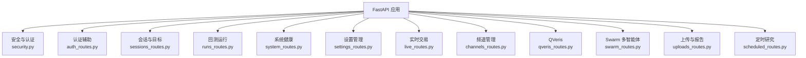
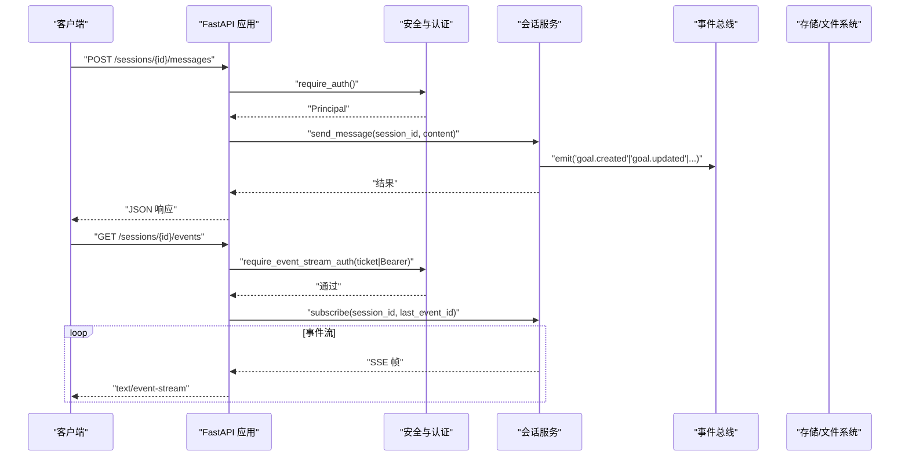
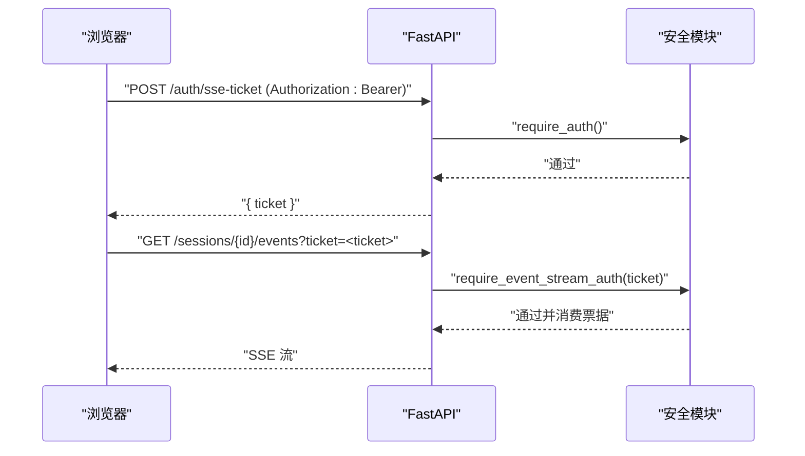
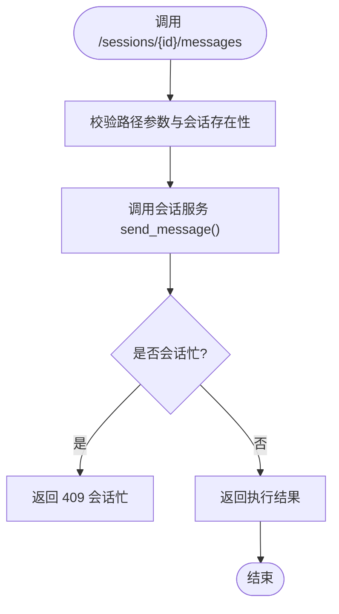
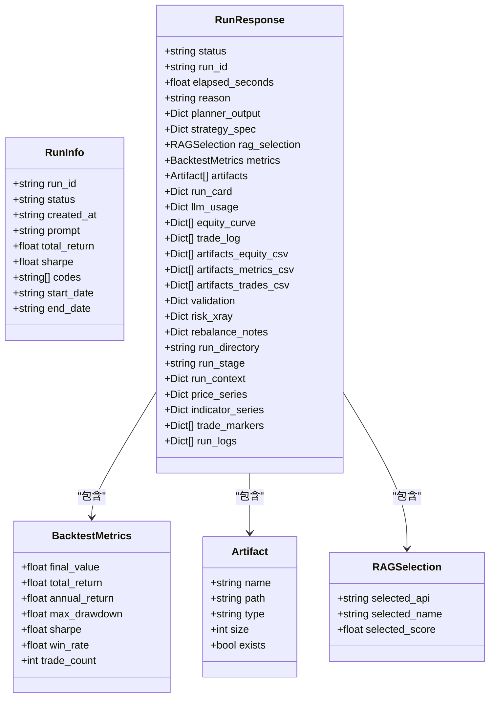
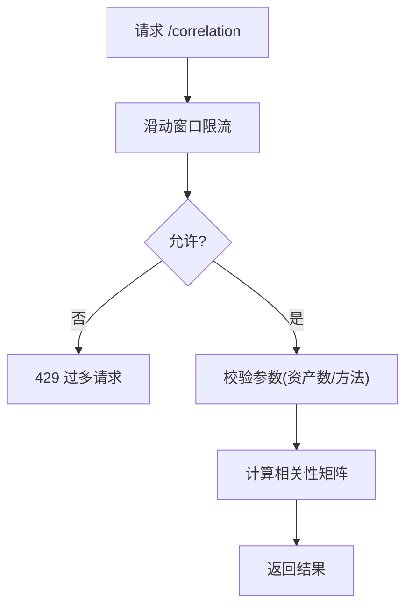
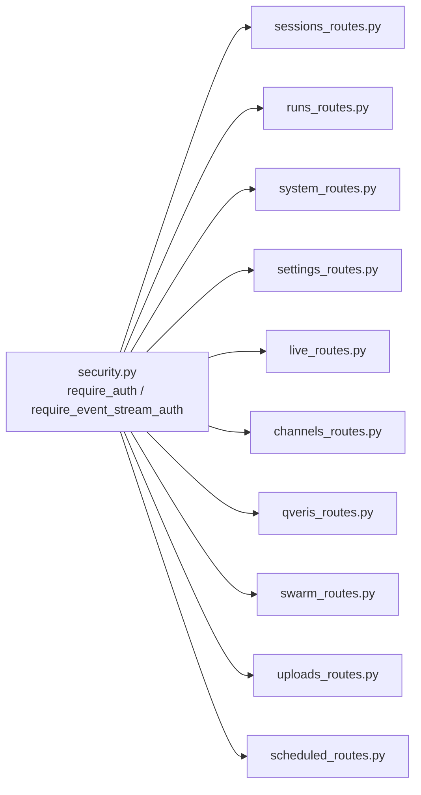

# REST API

<cite>
**本文引用的文件**
- [security.py](file://agent/src/api/security.py)
- [auth_routes.py](file://agent/src/api/auth_routes.py)
- [sessions_routes.py](file://agent/src/api/sessions_routes.py)
- [runs_routes.py](file://agent/src/api/runs_routes.py)
- [models.py](file://agent/src/api/models.py)
- [settings_routes.py](file://agent/src/api/settings_routes.py)
- [system_routes.py](file://agent/src/api/system_routes.py)
- [live_routes.py](file://agent/src/api/live_routes.py)
- [channels_routes.py](file://agent/src/api/channels_routes.py)
- [qveris_routes.py](file://agent/src/api/qveris_routes.py)
- [swarm_routes.py](file://agent/src/api/swarm_routes.py)
- [uploads_routes.py](file://agent/src/api/uploads_routes.py)
- [scheduled_routes.py](file://agent/src/api/scheduled_routes.py)
</cite>

## 目录
1. [简介](#简介)
2. [项目结构](#项目结构)
3. [核心组件](#核心组件)
4. [架构总览](#架构总览)
5. [详细组件分析](#详细组件分析)
6. [依赖关系分析](#依赖关系分析)
7. [性能与速率限制](#性能与速率限制)
8. [故障排查指南](#故障排查指南)
9. [结论](#结论)
10. [附录：客户端集成与最佳实践](#附录客户端集成与最佳实践)

## 简介
本文件为 Vibe-Trading REST API 的完整接口文档，覆盖认证、会话管理、回测运行管理、系统设置、实时交易控制、定时研究任务、上传与报告、聊天频道、Swarm 多智能体运行等核心能力。文档包含所有 HTTP 端点的 URL 模式、请求参数、响应格式、状态码、错误处理策略、数据验证规则、速率限制与安全注意事项，并提供客户端集成指南和常见用例说明。

## 项目结构
API 基于 FastAPI 模块化路由组织，各功能域以独立模块注册到主应用：
- 安全与认证：统一鉴权、CORS、安全头、SSE 票据、本地回环信任
- 会话与目标：会话 CRUD、消息发送、事件流（SSE）、研究目标（Goal）生命周期
- 回测运行：历史运行列表与详情、代码/Pine 脚本下载、图表数据
- 系统与健康：存活/就绪探针、相关性计算、技能清单、OpenAPI/Swagger/ReDoc
- 设置：LLM 提供商配置、数据源凭证、模型发现
- 实时交易：授权、指令提交、熔断开关、运行器启停、状态查询
- 频道：IM 通道运行时启停与配对命令
- QVeris：第三方工具配置与状态
- Swarm：多智能体预设与运行管理
- 上传与报告：文件上传、影子账户报告下载
- 定时研究：计划任务创建、执行、模板编排

**图示来源**
- [security.py:1-670](file://agent/src/api/security.py#L1-L670)
- [auth_routes.py:1-56](file://agent/src/api/auth_routes.py#L1-L56)
- [sessions_routes.py:1-802](file://agent/src/api/sessions_routes.py#L1-L802)
- [runs_routes.py:1-445](file://agent/src/api/runs_routes.py#L1-L445)
- [system_routes.py:1-438](file://agent/src/api/system_routes.py#L1-L438)
- [settings_routes.py:1-674](file://agent/src/api/settings_routes.py#L1-L674)
- [live_routes.py:1-1040](file://agent/src/api/live_routes.py#L1-L1040)
- [channels_routes.py:1-116](file://agent/src/api/channels_routes.py#L1-L116)
- [qveris_routes.py:1-232](file://agent/src/api/qveris_routes.py#L1-L232)
- [swarm_routes.py:1-260](file://agent/src/api/swarm_routes.py#L1-L260)
- [uploads_routes.py:1-179](file://agent/src/api/uploads_routes.py#L1-L179)
- [scheduled_routes.py:1-480](file://agent/src/api/scheduled_routes.py#L1-L480)

**章节来源**
- [security.py:1-670](file://agent/src/api/security.py#L1-L670)
- [sessions_routes.py:1-802](file://agent/src/api/sessions_routes.py#L1-L802)
- [runs_routes.py:1-445](file://agent/src/api/runs_routes.py#L1-L445)
- [system_routes.py:1-438](file://agent/src/api/system_routes.py#L1-L438)
- [settings_routes.py:1-674](file://agent/src/api/settings_routes.py#L1-L674)
- [live_routes.py:1-1040](file://agent/src/api/live_routes.py#L1-L1040)
- [channels_routes.py:1-116](file://agent/src/api/channels_routes.py#L1-L116)
- [qveris_routes.py:1-232](file://agent/src/api/qveris_routes.py#L1-L232)
- [swarm_routes.py:1-260](file://agent/src/api/swarm_routes.py#L1-L260)
- [uploads_routes.py:1-179](file://agent/src/api/uploads_routes.py#L1-L179)
- [scheduled_routes.py:1-480](file://agent/src/api/scheduled_routes.py#L1-L480)

## 核心组件
- 认证与授权
  - 支持 Bearer Token（Authorization 头）或可选查询参数 api_key（受控启用）
  - 本地回环开发模式：未配置密钥时允许本机访问；生产需配置密钥
  - SSE 票据：浏览器 EventSource 通过 POST /auth/sse-ticket 获取一次性票据，避免在 URL 中暴露长密钥
  - 跨站请求防护：拒绝不安全跨站来源，校验 Host/Origin
  - 安全响应头：CSP、X-Content-Type-Options、X-Frame-Options、Permissions-Policy、Referrer-Policy
- 会话与目标
  - 会话 CRUD、消息发送、取消、自动标题生成
  - 研究目标（Goal）创建、更新、证据追加、状态审计
  - SSE 事件流：会话事件、强制提案、实盘动作透传
- 回测运行
  - 运行列表与详情：状态、指标、图表数据、日志、评估结果
  - 源码与 Pine 脚本下载
- 系统与健康
  - /live、/health、/ready 探针
  - 相关性矩阵与 regime 时间线（带速率限制）
  - 技能清单、OpenAPI/Swagger/ReDoc（受控访问）
- 设置
  - LLM 提供商配置、模型发现、数据源凭证
  - 写入操作需要更强授权
- 实时交易
  - 授权引导、指令提交、熔断开关、运行器启停、状态查询
- 频道、QVeris、Swarm、上传与报告、定时研究
  - 各自领域的能力与接口详见下文

**章节来源**
- [security.py:1-670](file://agent/src/api/security.py#L1-L670)
- [auth_routes.py:1-56](file://agent/src/api/auth_routes.py#L1-L56)
- [sessions_routes.py:1-802](file://agent/src/api/sessions_routes.py#L1-L802)
- [runs_routes.py:1-445](file://agent/src/api/runs_routes.py#L1-L445)
- [system_routes.py:1-438](file://agent/src/api/system_routes.py#L1-L438)
- [settings_routes.py:1-674](file://agent/src/api/settings_routes.py#L1-L674)
- [live_routes.py:1-1040](file://agent/src/api/live_routes.py#L1-L1040)

## 架构总览

**图示来源**
- [sessions_routes.py:697-800](file://agent/src/api/sessions_routes.py#L697-L800)
- [security.py:571-622](file://agent/src/api/security.py#L571-L622)

## 详细组件分析

### 认证与令牌
- 机制
  - Bearer Token：Authorization: Bearer <api_key>
  - 可选查询参数：?api_key=...（仅在允许时生效）
  - SSE 票据：先 POST /auth/sse-ticket（需 Bearer），再 GET /sessions/{id}/events?ticket=...
  - 本地回环：未配置密钥时仅本机可访问；配置密钥后所有访问均需密钥
- 关键端点
  - POST /auth/sse-ticket：返回 { ticket }，有效期约 60 秒，单次使用
- 安全要点
  - 禁止跨站不安全请求
  - 日志中对敏感查询参数值进行脱敏
  - 响应头包含 CSP、X-Frame-Options 等

**图示来源**
- [auth_routes.py:21-56](file://agent/src/api/auth_routes.py#L21-L56)
- [security.py:300-341](file://agent/src/api/security.py#L300-L341)
- [security.py:591-622](file://agent/src/api/security.py#L591-L622)

**章节来源**
- [security.py:1-670](file://agent/src/api/security.py#L1-L670)
- [auth_routes.py:1-56](file://agent/src/api/auth_routes.py#L1-L56)

### 会话与目标（会话控制）
- 会话
  - POST /sessions：创建会话，返回 session_id、title、status、created_at、updated_at、last_attempt_id
  - GET /sessions：列出会话，limit 1-200
  - GET /sessions/{session_id}：获取会话详情
  - PATCH /sessions/{session_id}：更新字段（如 title）
  - DELETE /sessions/{session_id}：删除会话
  - POST /sessions/{session_id}/title/auto：自动生成标题
  - POST /sessions/{session_id}/messages：发送用户消息，启动代理循环
  - POST /sessions/{session_id}/cancel：取消当前运行中的代理循环
  - GET /sessions/{session_id}/messages：列出消息
  - GET /sessions/{session_id}/events：SSE 事件流（支持 Last-Event-ID 重放）
- 目标（Goal）
  - POST /sessions/{session_id}/goal：创建或替换当前研究目标
  - GET /sessions/{session_id}/goal：获取当前目标快照
  - PATCH /sessions/{session_id}/goal：编辑目标（objective/ui_summary）
  - POST /sessions/{session_id}/goal/evidence：追加证据
  - PATCH /sessions/{session_id}/goal/status：更新目标状态（含审计行）
- 数据模型
  - CreateSessionRequest、SessionResponse、SendMessageRequest、MessageResponse
  - CreateGoalRequest、UpdateGoalRequest、AddGoalEvidenceRequest、GoalSnapshotResponse、UpdateGoalStatusRequest
- 错误处理
  - 404：会话不存在
  - 409：会话忙（正在运行）或并发冲突（StaleGoalError）
  - 400：参数非法（如 risk_tier、status）
  - 501：会话运行时未启用

**图示来源**
- [sessions_routes.py:335-728](file://agent/src/api/sessions_routes.py#L335-L728)

**章节来源**
- [sessions_routes.py:1-802](file://agent/src/api/sessions_routes.py#L1-L802)

### 回测运行管理
- 端点
  - GET /runs：列出最近运行（摘要：run_id、status、created_at、prompt、total_return、sharpe、codes、start_date、end_date）
  - GET /runs/{run_id}：获取运行详情（状态、指标、图表数据、日志、评估、风险透视等）
  - GET /runs/{run_id}/code：获取策略源码（signal_engine.py）
  - GET /runs/{run_id}/pine：获取 Pine 脚本（存在性与内容）
- 响应模型
  - RunInfo：列表视图精简字段
  - RunResponse：完整运行结果（含 metrics、artifacts、equity_curve、trade_log、validation、risk_xray、rebalance_notes、price_series、indicator_series、trade_markers、run_logs）
  - BacktestMetrics：final_value、total_return、annual_return、max_drawdown、sharpe、win_rate、trade_count
  - Artifact：name、path、type、size、exists
  - RAGSelection：selected_api、selected_name、selected_score
- 行为
  - 默认返回轻量；如需图表优化，可通过 chart_symbol/chart_payload 选择
  - 从 run_dir/state.json、artifacts CSV/JSON 构建响应

**图示来源**
- [models.py:10-97](file://agent/src/api/models.py#L10-L97)
- [runs_routes.py:47-216](file://agent/src/api/runs_routes.py#L47-L216)

**章节来源**
- [runs_routes.py:1-445](file://agent/src/api/runs_routes.py#L1-L445)
- [models.py:1-97](file://agent/src/api/models.py#L1-L97)

### 系统与健康
- 端点
  - GET /live：进程存活
  - GET /health：兼容别名
  - GET /ready：就绪检查（LLM 提供商/模型/凭据可用性）
  - GET /correlation：相关性矩阵（按资产代码、天数、方法）
  - GET /correlation/regime：相关性 regime 时间线
  - GET /skills：已注册技能清单
  - GET /api：服务元信息
  - GET /openapi.json：OpenAPI Schema（需认证）
  - GET /docs、/redoc：交互式文档（仅在无密钥本地开发模式可用）
  - POST /system/shutdown：本地关闭 API 进程（需强授权）
- 速率限制
  - /correlation 与 /correlation/regime：每客户端 IP 每分钟最多 30 次（滑动窗口）
- 错误处理
  - 400：参数非法（资产数量、方法、阈值）
  - 429：超过速率限制
  - 500：计算失败
  - 503：/ready 未就绪（缺少配置或凭据）

**图示来源**
- [system_routes.py:62-99](file://agent/src/api/system_routes.py#L62-L99)
- [system_routes.py:243-329](file://agent/src/api/system_routes.py#L243-L329)

**章节来源**
- [system_routes.py:1-438](file://agent/src/api/system_routes.py#L1-L438)

### 设置管理（LLM 与数据源）
- 端点
  - GET /settings/llm：读取 LLM 设置（提供商、模型、base_url、温度、超时、重试、推理强度、SSE 超时、环境路径、可用提供商列表）
  - PUT /settings/llm：持久化 LLM 设置并同步到运行进程
  - POST /settings/llm/models：发现模型 ID（可临时传入 base_url 与 api_key）
  - GET /settings/data-sources：读取数据源凭证状态（Tushare、BaoStock）
  - PUT /settings/data-sources：持久化数据源凭证并同步
- 验证与错误
  - 400：不支持的提供商、必填字段缺失、温度范围、推理强度非法、base_url 非法
  - 503：无法保存设置（权限问题）
- 安全
  - 读操作：本地或认证
  - 写操作：强认证（require_settings_write_auth）

**章节来源**
- [settings_routes.py:1-674](file://agent/src/api/settings_routes.py#L1-L674)

### 实时交易控制
- 端点
  - POST /mandate/commit：提交用户选择的指令集（唯一写入路径，必须 consent_ack=true）
  - POST /live/halt：触发熔断（全局或指定券商）
  - POST /live/resume：清除熔断
  - GET /live/status：综合状态（认证、活跃指令、运行器心跳、熔断）
  - POST /live/authorize：OAuth 引导（描述如何发起设备流程）
  - POST /live/runner/start：启动持久化运行器（需已存在有效指令）
  - POST /live/runner/stop：停止运行器
- 数据模型
  - CommitMandateRequest、LiveHaltRequest、LiveAuthorizeRequest、LiveRunnerControlRequest
  - BrokerAuthState、ActiveMandateState、RunnerLivenessState、LiveBrokerStatus、LiveStatusResponse
- 事件透传
  - 通过现有会话事件总线广播 mandate.committed、live.halted、live.action 等事件

**章节来源**
- [live_routes.py:1-1040](file://agent/src/api/live_routes.py#L1-L1040)

### 频道管理
- 端点
  - GET /channels/status：频道运行时与适配器状态
  - POST /channels/start：启动配置的 IM 频道适配器
  - POST /channels/stop：停止频道适配器
  - POST /channels/pairing/command：执行配对命令
- 用途
  - 统一管理 IM 通道生命周期与配对流程

**章节来源**
- [channels_routes.py:1-116](file://agent/src/api/channels_routes.py#L1-L116)

### QVeris 集成
- 端点
  - GET /qveris/config：读取配置（掩码 API Key）
  - PUT /qveris/config：更新配置（启用/禁用、base_url、api_key、模式、预算额度）
  - GET /qveris/status：运行状态（可用性、剩余积分、近期使用）
- 验证
  - base_url 必须为 http(s)
  - 写入需强认证

**章节来源**
- [qveris_routes.py:1-232](file://agent/src/api/qveris_routes.py#L1-L232)

### Swarm 多智能体
- 端点
  - GET /swarm/presets：列出预设
  - POST /swarm/runs：启动运行（preset_name、user_vars）
  - GET /swarm/runs：列出运行（最新优先，合并僵尸态）
  - GET /swarm/runs/{run_id}：运行详情（任务状态、最终报告）
  - GET /swarm/runs/{run_id}/events：SSE 事件流（支持 Last-Event-ID）
  - POST /swarm/runs/{run_id}/cancel：取消运行
  - POST /swarm/runs/{run_id}/retry：重试失败/陈旧/取消的运行
- 特性
  - 事件流在运行完成或失败时发送 done 事件
  - 列表与详情会合并“僵尸”运行，确保 UI 不卡住

**章节来源**
- [swarm_routes.py:1-260](file://agent/src/api/swarm_routes.py#L1-L260)

### 上传与报告
- 端点
  - GET /shadow-reports/{shadow_id}?format=html|pdf：下载渲染后的影子账户报告
  - POST /upload：上传文件（最大 50MB，白名单扩展名，黑名单二进制/脚本/归档）
- 安全
  - 严格文件名与扩展名过滤
  - 分块写入与大小限制，防止资源耗尽

**章节来源**
- [uploads_routes.py:1-179](file://agent/src/api/uploads_routes.py#L1-L179)

### 定时研究任务
- 端点
  - POST /scheduled-runs：创建或替换计划任务（支持 interval 或 cron，时区）
  - GET /scheduled-runs：列出任务（可按状态过滤）
  - DELETE /scheduled-runs/{job_id}：删除任务
  - GET /scheduled-runs/playbooks：列出研究剧本模板
  - GET /scheduled-runs/playbooks/{slug}：读取模板详情（含指令体）
  - POST /scheduled-runs/playbooks/{slug}：基于模板创建计划任务
- 行为
  - 创建即持久化，不立即执行
  - 支持时区与首次触发时间计算
  - 模板变量校验与默认值处理

**章节来源**
- [scheduled_routes.py:1-480](file://agent/src/api/scheduled_routes.py#L1-L480)

## 依赖关系分析
- 认证依赖
  - require_auth：用于大多数读写接口
  - require_event_stream_auth：用于 SSE 流（支持 Bearer 或 ticket）
  - require_local_or_auth：设置读取（本地或认证）
  - require_settings_write_auth：设置写入（强认证）
- 模块耦合
  - sessions_routes 依赖 host 的 require_auth、require_event_stream_auth、_get_session_service、_validate_path_param、_shell_tools_enabled_for_request
  - runs_routes 依赖 host 的 require_auth、_validate_path_param、RUNS_DIR、RunResponse/RunInfo
  - system_routes 依赖 host 的 _security、_require_shutdown_authorization、_configured_api_key、require_auth、APP_VERSION
  - settings_routes 依赖 host 的 ENV_PATH、LEGACY_ENV_PATH、_read_env_values、_write_env_values、_is_configured_secret、_coerce_float/_coerce_int、_project_relative_path
  - live_routes 依赖 host 的 require_auth、_get_session_service、_emit_live_event、_fetch_broker_ceilings、_check_connector_status、_runner_factory
  - channels_routes、qveris_routes、swarm_routes、uploads_routes、scheduled_routes 均通过 sys.modules 延迟解析宿主依赖，便于测试 monkeypatch

**图示来源**
- [security.py:571-656](file://agent/src/api/security.py#L571-L656)
- [sessions_routes.py:289-320](file://agent/src/api/sessions_routes.py#L289-L320)
- [runs_routes.py:226-255](file://agent/src/api/runs_routes.py#L226-L255)
- [system_routes.py:166-191](file://agent/src/api/system_routes.py#L166-L191)
- [settings_routes.py:476-493](file://agent/src/api/settings_routes.py#L476-L493)
- [live_routes.py:631-644](file://agent/src/api/live_routes.py#L631-L644)
- [channels_routes.py:57-79](file://agent/src/api/channels_routes.py#L57-L79)
- [qveris_routes.py:73-86](file://agent/src/api/qveris_routes.py#L73-L86)
- [swarm_routes.py:45-67](file://agent/src/api/swarm_routes.py#L45-L67)
- [uploads_routes.py:51-74](file://agent/src/api/uploads_routes.py#L51-L74)
- [scheduled_routes.py:232-250](file://agent/src/api/scheduled_routes.py#L232-L250)

**章节来源**
- [security.py:1-670](file://agent/src/api/security.py#L1-L670)
- 各 routes 模块注册函数（见上）

## 性能与速率限制
- 相关性计算
  - /correlation 与 /correlation/regime：每客户端 IP 每分钟最多 30 次（滑动窗口）
  - 超限返回 429
- 上传
  - 单文件最大 50MB，分块写入，超出返回 413
- SSE
  - 会话事件流与 Swarm 事件流支持断线重连（Last-Event-ID）
- 建议
  - 对高频查询（如 /runs/{id} 图表数据）使用 chart_payload=summary 减少负载
  - 合理设置 SSE 重连退避，避免风暴

**章节来源**
- [system_routes.py:62-99](file://agent/src/api/system_routes.py#L62-L99)
- [uploads_routes.py:22-24](file://agent/src/api/uploads_routes.py#L22-L24)
- [swarm_routes.py:169-211](file://agent/src/api/swarm_routes.py#L169-L211)
- [sessions_routes.py:752-800](file://agent/src/api/sessions_routes.py#L752-L800)

## 故障排查指南
- 认证失败
  - 401：无效或缺失 API 密钥；检查 Authorization 头或允许的查询参数
  - 403：非本地访问且未配置密钥；跨站请求被拒；本地主机头不受信任
- 会话相关
  - 404：会话不存在
  - 409：会话忙或并发冲突（StaleGoalError）
  - 501：会话运行时未启用
- 设置写入
  - 503：无法保存设置（权限不足）
- 上传
  - 400：不允许的文件类型或名称
  - 413：文件过大
  - 500：存储失败
- 系统
  - 503：/ready 未就绪（缺少提供商/模型/凭据）
  - 429：相关性计算超限

**章节来源**
- [security.py:463-504](file://agent/src/api/security.py#L463-L504)
- [sessions_routes.py:321-728](file://agent/src/api/sessions_routes.py#L321-L728)
- [settings_routes.py:506-674](file://agent/src/api/settings_routes.py#L506-L674)
- [uploads_routes.py:96-179](file://agent/src/api/uploads_routes.py#L96-L179)
- [system_routes.py:226-329](file://agent/src/api/system_routes.py#L226-L329)

## 结论
Vibe-Trading REST API 提供完整的交易与研究能力，涵盖认证、会话、回测、设置、实时交易、频道、QVeris、Swarm、上传与报告、定时任务等。其安全设计强调密钥管理、跨站防护、SSE 票据与本地回环信任；性能方面对高负载计算实施速率限制；错误处理清晰、可观测性强。建议在生产环境启用 API 密钥、合理配置 CORS 与安全头、使用 SSE 票据保障浏览器安全连接，并对高频接口实施客户端侧限流与重试策略。

## 附录：客户端集成与最佳实践
- 认证
  - 服务端点：Authorization: Bearer <api_key>
  - 浏览器 SSE：先 POST /auth/sse-ticket 获取 ticket，再用 ?ticket= 打开事件流
  - 本地开发：未配置密钥时仅本机可访问；生产务必配置密钥
- 会话与事件
  - 发送消息后订阅 /sessions/{id}/events，使用 Last-Event-ID 实现可靠重连
  - 关注 goal.created、goal.updated、goal.evidence、live.halted、live.action 等事件
- 回测
  - 使用 /runs 列表快速概览；/runs/{id} 获取详情；按需启用图表优化
  - 下载源码与 Pine 脚本用于二次开发与可视化
- 设置
  - 读取 /settings/llm 与 /settings/data-sources；写入需强认证
  - 模型发现可临时传入 base_url 与 api_key，避免持久化敏感信息
- 实时交易
  - 遵循授权流程；谨慎使用熔断开关；监控 /live/status 状态
- 上传与报告
  - 遵守文件类型与大小限制；报告通过 shadow_id 精确访问
- 定时研究
  - 支持 interval 与 cron；注意时区与首次触发时间；模板变量需声明
- 速率限制
  - 相关性接口限流；客户端应实现指数退避重试
- 安全
  - 始终使用 HTTPS；避免在 URL 中携带密钥；使用 SSE 票据
  - 配置 CSP、X-Frame-Options 等安全头（服务器已内置）