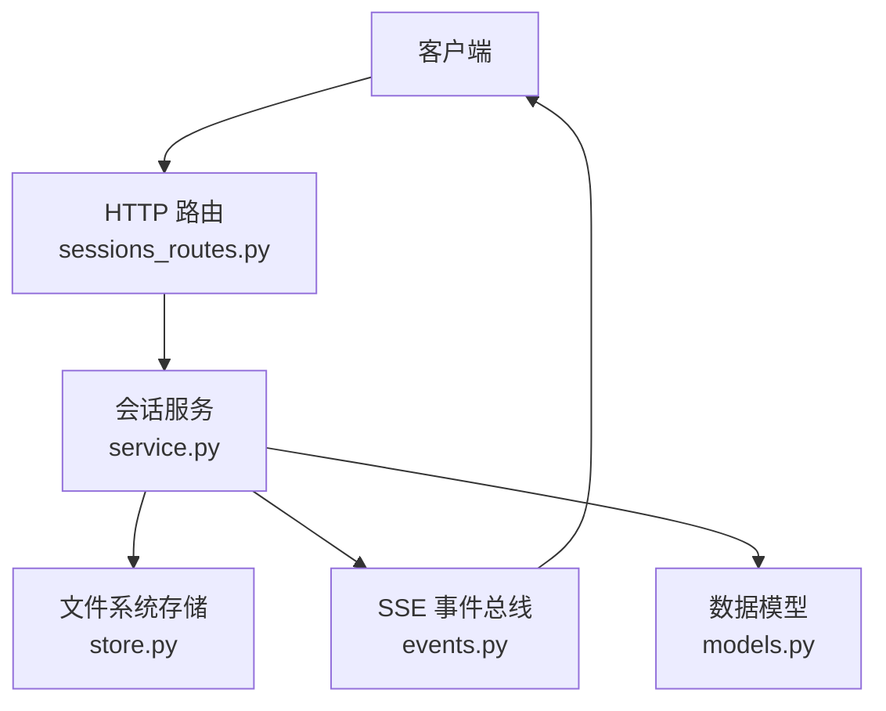
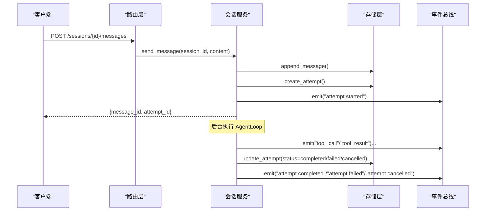
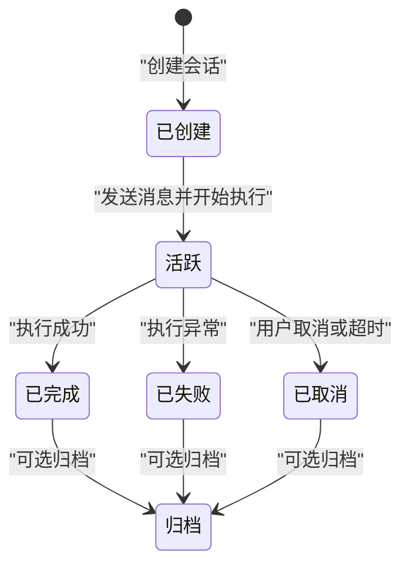
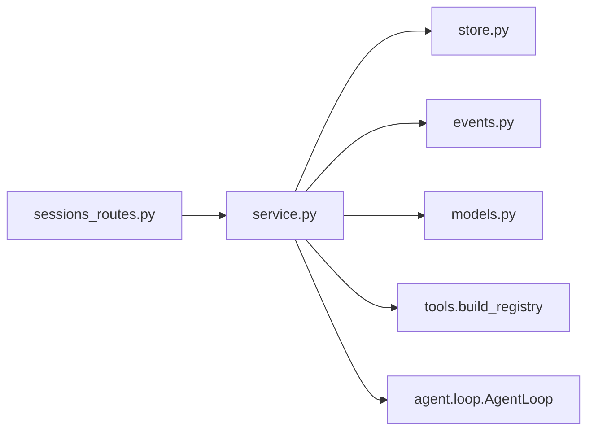

# 会话管理

<cite>
**本文引用的文件**
- [agent/src/api/sessions_routes.py](file://agent/src/api/sessions_routes.py)
- [agent/src/session/models.py](file://agent/src/session/models.py)
- [agent/src/session/service.py](file://agent/src/session/service.py)
- [agent/src/session/store.py](file://agent/src/session/store.py)
- [agent/src/session/events.py](file://agent/src/session/events.py)
</cite>

## 目录
1. [简介](#简介)
2. [项目结构](#项目结构)
3. [核心组件](#核心组件)
4. [架构总览](#架构总览)
5. [详细组件分析](#详细组件分析)
6. [依赖关系分析](#依赖关系分析)
7. [性能与并发](#性能与并发)
8. [故障排查指南](#故障排查指南)
9. [结论](#结论)
10. [附录：API 端点参考](#附录api-端点参考)

## 简介
本文件为 Vibe-Trading 的“会话管理”API 提供完整、可操作的文档。内容覆盖会话创建、更新、删除、查询，消息发送与历史读取，SSE 事件流订阅；并详细说明会话生命周期、上下文保持、状态同步机制、Session/Message/Attempt 模型字段、事件类型、持久化与恢复策略、清理方式、并发控制、内存管理与性能优化建议。

## 项目结构
会话管理由以下模块协作完成：
- API 路由层：暴露 HTTP 端点（FastAPI），负责鉴权、参数校验、调用服务层。
- 服务层：编排会话生命周期、消息处理、执行尝试（Attempt）调度、事件发布。
- 存储层：基于文件系统的持久化（session.json、messages.jsonl、attempt.json）。
- 事件总线：SSE 事件缓冲、重放、心跳、线程安全发布。
- 数据模型：Session、Message、Attempt、Principal 等数据结构定义。

图表来源
- [agent/src/api/sessions_routes.py:289-800](file://agent/src/api/sessions_routes.py#L289-L800)
- [agent/src/session/service.py:53-440](file://agent/src/session/service.py#L53-L440)
- [agent/src/session/store.py:16-259](file://agent/src/session/store.py#L16-L259)
- [agent/src/session/events.py:20-240](file://agent/src/session/events.py#L20-L240)
- [agent/src/session/models.py:121-342](file://agent/src/session/models.py#L121-L342)

章节来源
- [agent/src/api/sessions_routes.py:289-800](file://agent/src/api/sessions_routes.py#L289-L800)
- [agent/src/session/service.py:53-440](file://agent/src/session/service.py#L53-L440)
- [agent/src/session/store.py:16-259](file://agent/src/session/store.py#L16-L259)
- [agent/src/session/events.py:20-240](file://agent/src/session/events.py#L20-L240)
- [agent/src/session/models.py:121-342](file://agent/src/session/models.py#L121-L342)

## 核心组件
- SessionService：会话生命周期编排、消息入队、执行尝试调度、取消、结果格式化、指标加载。
- SessionStore：会话、消息、尝试的持久化（JSON/JSONL），支持列表、追加、删除。
- EventBus：SSE 事件缓冲、重放、心跳、线程安全发布。
- 数据模型：Session、Message、Attempt、Principal、枚举状态。

章节来源
- [agent/src/session/service.py:53-440](file://agent/src/session/service.py#L53-L440)
- [agent/src/session/store.py:16-259](file://agent/src/session/store.py#L16-L259)
- [agent/src/session/events.py:20-240](file://agent/src/session/events.py#L20-L240)
- [agent/src/session/models.py:121-342](file://agent/src/session/models.py#L121-L342)

## 架构总览
会话管理的端到端流程如下：
- 客户端通过 HTTP 创建/更新/删除/查询会话与消息。
- 路由层调用服务层进行业务编排。
- 服务层将消息写入存储，创建 Attempt 并异步执行 AgentLoop。
- 执行过程中通过事件总线发布 SSE 事件（工具调用、结果、尝试开始/结束等）。
- 客户端通过 /sessions/{id}/events 订阅 SSE 流，支持断线重连与重放。

图表来源
- [agent/src/api/sessions_routes.py:697-728](file://agent/src/api/sessions_routes.py#L697-L728)
- [agent/src/session/service.py:158-344](file://agent/src/session/service.py#L158-L344)
- [agent/src/session/store.py:151-239](file://agent/src/session/store.py#L151-L239)
- [agent/src/session/events.py:127-240](file://agent/src/session/events.py#L127-L240)

## 详细组件分析

### 数据模型与字段定义
- Session
  - session_id: 唯一标识
  - title: 会话标题
  - status: 会话状态（active/completed/archived）
  - created_at/updated_at: ISO 时间戳
  - last_attempt_id: 最近一次尝试 ID
  - config: 会话级配置（如是否包含 shell 工具）
  - owner: Principal（所有者主体，含认证方法、是否可归属到人）
- Message
  - message_id: 唯一标识
  - session_id: 所属会话
  - role: user/assistant/system
  - content: 文本内容
  - created_at: 时间戳
  - linked_attempt_id: 关联的尝试 ID
  - metadata: 附加元数据（如运行信息、耗时、模型信息等）
  - tool_trail: 工具调用轨迹（仅成功时记录）
- Attempt
  - attempt_id: 唯一标识
  - session_id: 所属会话
  - parent_attempt_id: 父尝试 ID（用于迭代修改场景）
  - status: pending/running/waiting_user/completed/failed/cancelled
  - prompt: 触发执行的提示词
  - run_dir: 运行输出目录
  - summary: 执行摘要
  - react_trace: ReAct 追踪记录
  - created_at/completed_at: 时间戳
  - error: 错误信息
  - metrics: 回测指标快照

章节来源
- [agent/src/session/models.py:121-342](file://agent/src/session/models.py#L121-L342)

### 会话生命周期与状态机
- 创建：POST /sessions → 生成 Session 并持久化，索引搜索，发布 session.created 事件。
- 运行：POST /sessions/{id}/messages → 写入消息、创建 Attempt、标记 running、后台执行、最终标记 completed/failed/cancelled。
- 查询：GET /sessions、GET /sessions/{id} → 返回会话基本信息。
- 更新：PATCH /sessions/{id} → 更新标题等字段。
- 删除：DELETE /sessions/{id} → 删除会话及所有数据，清理事件缓冲。
- 自动标题：POST /sessions/{id}/title/auto → 基于首条用户/助手消息生成简短标题。

图表来源
- [agent/src/session/models.py:121-138](file://agent/src/session/models.py#L121-L138)
- [agent/src/session/service.py:158-344](file://agent/src/session/service.py#L158-L344)

### 消息格式与事件类型
- 消息格式
  - 请求体：SendMessageRequest.content（自然语言策略描述）
  - 响应体：MessageResponse（message_id、session_id、role、content、created_at、linked_attempt_id、metadata、tool_trail）
- 事件类型（SSE）
  - session.created：会话创建
  - message.received：收到消息
  - attempt.created：尝试创建
  - attempt.started：尝试开始
  - tool_call/tool_result：工具调用与结果（被转发到 SSE）
  - mandate.proposal：策略提案（从工具结果中解析）
  - live.action：实盘动作（从审计日志中解析）
  - attempt.completed/attempt.failed/attempt.cancelled：尝试终态
  - goal.created/goal.updated/goal.evidence：研究目标相关事件（在 Goal 子路由中）
  - heartbeat：心跳帧（无 event_id，用于保活）

章节来源
- [agent/src/api/sessions_routes.py:28-158](file://agent/src/api/sessions_routes.py#L28-L158)
- [agent/src/api/sessions_routes.py:186-282](file://agent/src/api/sessions_routes.py#L186-L282)
- [agent/src/session/events.py:20-55](file://agent/src/session/events.py#L20-L55)
- [agent/src/session/service.py:34-40](file://agent/src/session/service.py#L34-L40)

### 会话持久化、恢复与清理
- 持久化
  - 会话：sessions/{id}/session.json
  - 消息：sessions/{id}/messages.jsonl（追加写，fsync 保证落盘）
  - 尝试：sessions/{id}/attempts/{attempt_id}/attempt.json
- 恢复
  - 列表：按 updated_at 倒序读取，跳过损坏条目
  - 消息：读取 JSONL 行，跳过损坏行
  - SSE 重放：支持 last_event_id 与 replay=all（活动运行）
- 清理
  - 删除会话：递归删除整个会话目录
  - 清理事件缓冲：删除会话时清空对应事件缓冲

章节来源
- [agent/src/session/store.py:16-259](file://agent/src/session/store.py#L16-L259)
- [agent/src/session/events.py:151-240](file://agent/src/session/events.py#L151-L240)

### 并发会话控制、内存管理与性能优化
- 并发控制
  - 每个会话同一时刻仅允许一个执行尝试（in-flight claim），重复发送返回 409（SessionBusyError）
  - 使用线程锁保护 in-flight 集合，避免竞态
  - 取消：优先取消 AgentLoop，否则取消构建阶段的 Task
- 内存管理
  - 事件缓冲：每会话最多缓存 N 个事件（默认 500），超出丢弃最旧
  - 订阅队列：每个订阅者维护固定大小队列（200），满则丢弃
  - 历史裁剪：构造 LLM 历史时按字符预算裁剪，保留最新片段
- 性能优化
  - 工具注册与 Agent 执行在独立线程池（最大 4 工作线程）中运行，避免阻塞事件循环
  - 指标加载：从运行目录 artifacts/metrics.csv 读取，失败时忽略
  - SSE 心跳：30 秒超时发送心跳帧，保持连接活性

章节来源
- [agent/src/session/service.py:30-91](file://agent/src/session/service.py#L30-L91)
- [agent/src/session/service.py:158-344](file://agent/src/session/service.py#L158-L344)
- [agent/src/session/service.py:346-440](file://agent/src/session/service.py#L346-L440)
- [agent/src/session/service.py:515-581](file://agent/src/session/service.py#L515-L581)
- [agent/src/session/events.py:67-126](file://agent/src/session/events.py#L67-L126)
- [agent/src/session/events.py:185-240](file://agent/src/session/events.py#L185-L240)

## 依赖关系分析
- 路由层依赖服务层获取会话服务实例，并通过宿主模块注入鉴权与路径校验。
- 服务层依赖存储层、事件总线、搜索索引、AgentLoop、LLM、持久化记忆、配置加载。
- 存储层直接操作文件系统，提供原子性写入与健壮的错误处理。
- 事件总线为线程安全的事件分发器，支持重放与心跳。

图表来源
- [agent/src/api/sessions_routes.py:289-330](file://agent/src/api/sessions_routes.py#L289-L330)
- [agent/src/session/service.py:346-440](file://agent/src/session/service.py#L346-L440)

章节来源
- [agent/src/api/sessions_routes.py:289-330](file://agent/src/api/sessions_routes.py#L289-L330)
- [agent/src/session/service.py:346-440](file://agent/src/session/service.py#L346-L440)

## 性能与并发
- 限制并发：线程池上限 4，避免过多 Agent 同时运行导致资源耗尽。
- 快速失败：会话忙时立即返回 409，避免排队堆积。
- 事件缓冲：限制单会话事件数量，防止内存泄漏。
- 历史裁剪：按字符预算裁剪历史，减少 LLM 输入体积。
- 指标加载：仅在存在时加载，失败不中断主流程。

[本节为通用指导，无需具体文件引用]

## 故障排查指南
- 404 未找到会话：检查路径参数校验与会话是否存在。
- 409 会话忙：当前会话已有运行中的尝试，等待或先取消。
- 501 会话运行时未启用：确认宿主模块已正确初始化会话服务。
- SSE 断线重连：使用 Last-Event-ID 或 replay=active 恢复活动运行事件。
- 事件丢失：检查事件缓冲大小与订阅队列容量，必要时调大上限。
- 消息损坏：存储层会跳过损坏行并记录警告，检查磁盘与权限。

章节来源
- [agent/src/api/sessions_routes.py:321-330](file://agent/src/api/sessions_routes.py#L321-L330)
- [agent/src/api/sessions_routes.py:605-632](file://agent/src/api/sessions_routes.py#L605-L632)
- [agent/src/api/sessions_routes.py:697-728](file://agent/src/api/sessions_routes.py#L697-L728)
- [agent/src/session/store.py:118-193](file://agent/src/session/store.py#L118-L193)
- [agent/src/session/events.py:151-240](file://agent/src/session/events.py#L151-L240)

## 结论
Vibe-Trading 的会话管理 API 提供了完整的会话生命周期管理能力，结合文件系统持久化与 SSE 事件流，实现了高可用、可恢复、可扩展的会话交互体验。通过严格的并发控制与内存管理策略，系统在高负载下仍能保持稳定。建议在生产环境中合理配置事件缓冲、线程池大小与历史裁剪阈值，以满足不同规模的使用需求。

[本节为总结，无需具体文件引用]

## 附录：API 端点参考
- 会话 CRUD
  - POST /sessions：创建会话（请求体：title、config）
  - GET /sessions：列出会话（limit 1-200）
  - GET /sessions/{session_id}：获取会话详情
  - PATCH /sessions/{session_id}：更新会话（title）
  - DELETE /sessions/{session_id}：删除会话
- 消息与执行
  - POST /sessions/{session_id}/messages：发送消息并启动执行（请求体：content）
  - GET /sessions/{session_id}/messages：获取消息历史（limit 1-1000）
  - POST /sessions/{session_id}/cancel：取消当前执行
- 事件流
  - GET /sessions/{session_id}/events：SSE 事件流（支持 Last-Event-ID、replay=active）
- 目标（Goal）子路由（与研究目标相关）
  - POST /sessions/{session_id}/goal：创建或替换当前研究目标
  - GET /sessions/{session_id}/goal：获取当前目标快照
  - PATCH /sessions/{session_id}/goal：编辑目标（objective/ui_summary）
  - POST /sessions/{session_id}/goal/evidence：追加证据
  - PATCH /sessions/{session_id}/goal/status：更新目标状态

章节来源
- [agent/src/api/sessions_routes.py:335-800](file://agent/src/api/sessions_routes.py#L335-L800)