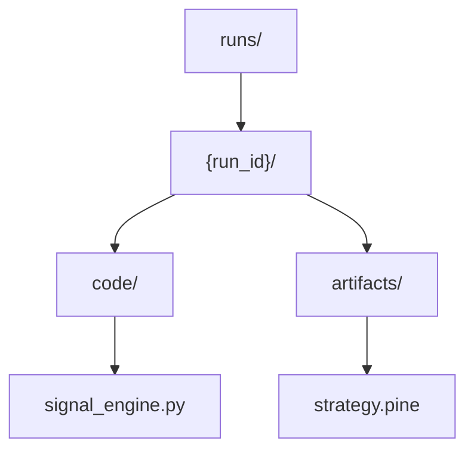
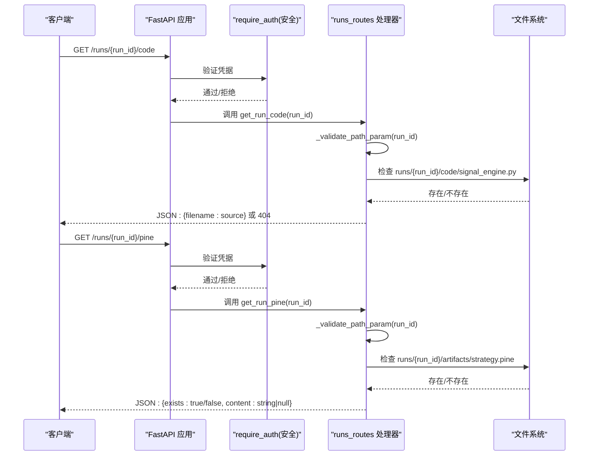
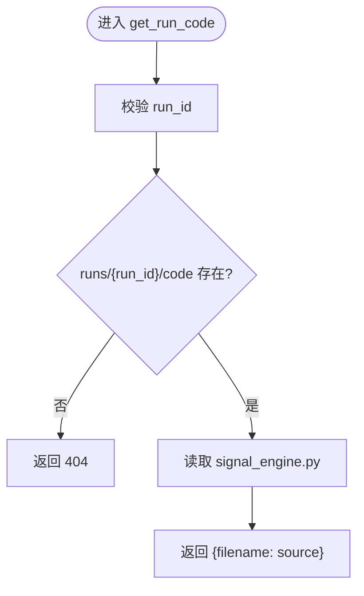
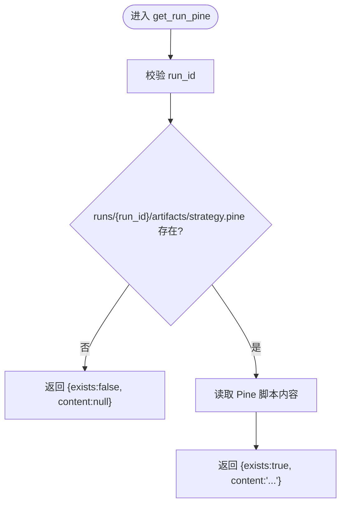
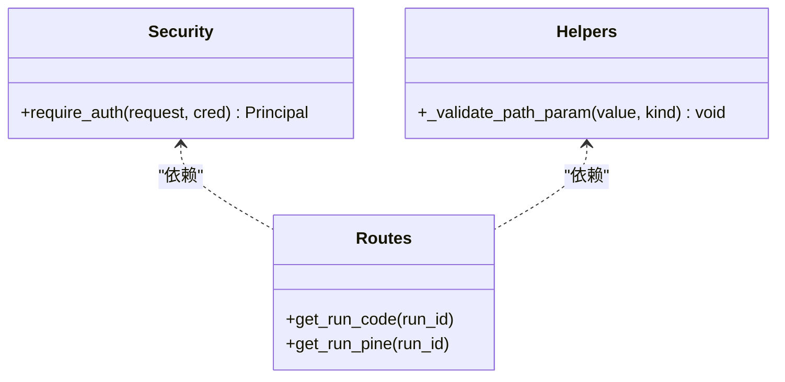
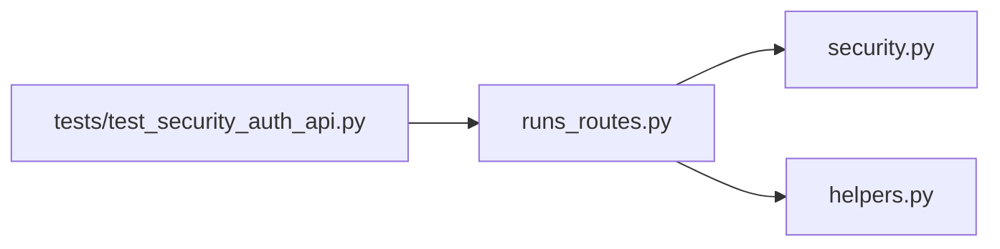

# 代码管理

<cite>
**本文引用的文件**
- [runs_routes.py](file://agent/src/api/runs_routes.py)
- [security.py](file://agent/src/api/security.py)
- [helpers.py](file://agent/src/api/helpers.py)
- [test_security_auth_api.py](file://agent/tests/test_security_auth_api.py)
- [test_spa_deep_link.py](file://agent/tests/test_spa_deep_link.py)
</cite>

## 目录
1. [简介](#简介)
2. [项目结构](#项目结构)
3. [核心组件](#核心组件)
4. [架构总览](#架构总览)
5. [详细组件分析](#详细组件分析)
6. [依赖关系分析](#依赖关系分析)
7. [性能注意事项](#性能注意事项)
8. [故障排查指南](#故障排查指南)
9. [结论](#结论)
10. [附录：API调用示例](#附录api调用示例)

## 简介
本文件为 Vibe-Trading 回测“代码管理”API 的详细文档，聚焦两个代码获取端点：
- GET /runs/{run_id}/code：返回指定运行（run）的策略源代码文件。
- GET /runs/{run_id}/pine：返回与 TradingView 集成的 Pine Script 策略文件（若存在）。

同时说明代码目录结构、Pine Script 支持方式、访问安全机制（路径参数校验、白名单控制）、错误处理规范，并提供完整的 API 调用示例（Python requests 与 JavaScript fetch）。

## 项目结构
- 每个回测运行在 runs 目录下拥有独立子目录，命名即 run_id。
- 每个运行目录包含 code 子目录，内含策略实现文件 signal_engine.py。
- 每个运行目录的 artifacts 子目录可能包含 strategy.pine，用于 TradingView 集成；该文件通过 exists 字段标识是否存在。

**图表来源**
- [runs_routes.py:262-300](file://agent/src/api/runs_routes.py#L262-L300)

**章节来源**
- [runs_routes.py:262-300](file://agent/src/api/runs_routes.py#L262-L300)

## 核心组件
- 路由注册与端点实现：位于 runs_routes.py，提供 /runs/{run_id}/code 与 /runs/{run_id}/pine 两个 GET 端点。
- 认证与安全：通过 security.py 中的 require_auth 依赖进行鉴权；路径参数由 helpers.py 的 _validate_path_param 严格校验，防止目录遍历攻击。
- Pine Script 支持：/runs/{run_id}/pine 读取 artifacts/strategy.pine，并以 {exists, content} 形式返回。

**章节来源**
- [runs_routes.py:262-300](file://agent/src/api/runs_routes.py#L262-L300)
- [security.py:571-588](file://agent/src/api/security.py#L571-L588)
- [helpers.py:260-270](file://agent/src/api/helpers.py#L260-L270)

## 架构总览
请求从客户端进入 FastAPI 应用，经过认证中间件与路径参数校验后，路由处理器读取对应文件或返回不存在状态。

**图表来源**
- [runs_routes.py:262-300](file://agent/src/api/runs_routes.py#L262-L300)
- [security.py:571-588](file://agent/src/api/security.py#L571-L588)
- [helpers.py:260-270](file://agent/src/api/helpers.py#L260-L270)

## 详细组件分析

### 端点：GET /runs/{run_id}/code
- 功能：返回指定运行的策略源代码文件映射（文件名 -> 源码文本）。当前固定读取 code/signal_engine.py。
- 安全：
  - 必须通过 require_auth 认证。
  - run_id 使用 _validate_path_param 校验，仅允许字母数字、下划线、连字符，长度限制，避免目录穿越。
- 响应：
  - 成功：JSON 对象，键为文件名，值为源码字符串。
  - 失败：若 code 目录不存在，返回 404 并附带 detail。

**图表来源**
- [runs_routes.py:262-281](file://agent/src/api/runs_routes.py#L262-L281)
- [helpers.py:260-270](file://agent/src/api/helpers.py#L260-L270)

**章节来源**
- [runs_routes.py:262-281](file://agent/src/api/runs_routes.py#L262-L281)
- [helpers.py:260-270](file://agent/src/api/helpers.py#L260-L270)

### 端点：GET /runs/{run_id}/pine
- 功能：返回与 TradingView 集成的 Pine Script 策略文件内容及其存在性。
- 安全：
  - 必须通过 require_auth 认证。
  - run_id 使用 _validate_path_param 校验。
- 响应：
  - 若 strategy.pine 存在：{exists: true, content: "<pine脚本内容>"}
  - 若不存在：{exists: false, content: null}

**图表来源**
- [runs_routes.py:283-300](file://agent/src/api/runs_routes.py#L283-L300)
- [helpers.py:260-270](file://agent/src/api/helpers.py#L260-L270)

**章节来源**
- [runs_routes.py:283-300](file://agent/src/api/runs_routes.py#L283-L300)
- [helpers.py:260-270](file://agent/src/api/helpers.py#L260-L270)

### 认证与安全机制
- 认证依赖：所有代码相关端点均声明 dependencies=[Depends(require_auth)]，未通过认证将返回 401。
- 路径参数校验：_validate_path_param 使用正则白名单限制 run_id 格式，拒绝包含点号、换行等危险字符，防止目录遍历。
- SPA 深链保护：/runs/{id}/code 与 /runs/{id}/pine 被明确标记为 API-only，不会被前端 SPA HTML 路由劫持。

**图表来源**
- [security.py:571-588](file://agent/src/api/security.py#L571-L588)
- [helpers.py:260-270](file://agent/src/api/helpers.py#L260-L270)
- [runs_routes.py:262-300](file://agent/src/api/runs_routes.py#L262-L300)

**章节来源**
- [security.py:571-588](file://agent/src/api/security.py#L571-L588)
- [helpers.py:260-270](file://agent/src/api/helpers.py#L260-L270)
- [test_spa_deep_link.py:33-50](file://agent/tests/test_spa_deep_link.py#L33-L50)

## 依赖关系分析
- 路由层依赖认证模块与安全工具函数。
- 路径参数校验统一通过 helpers._validate_path_param，确保所有 run_id 输入安全。
- 测试用例覆盖非法 run_id 场景，确保 400 错误与 detail 信息正确返回。

**图表来源**
- [runs_routes.py:262-300](file://agent/src/api/runs_routes.py#L262-L300)
- [security.py:571-588](file://agent/src/api/security.py#L571-L588)
- [helpers.py:260-270](file://agent/src/api/helpers.py#L260-L270)
- [test_security_auth_api.py:662-681](file://agent/tests/test_security_auth_api.py#L662-L681)

**章节来源**
- [test_security_auth_api.py:662-681](file://agent/tests/test_security_auth_api.py#L662-L681)

## 性能注意事项
- 代码获取端点仅读取少量小文件（signal_engine.py、strategy.pine），I/O 开销极低。
- 建议在高并发场景下对 runs 目录进行合理的磁盘挂载与缓存策略，避免频繁 stat/read 带来的延迟。
- 对于 Pine Script 大文件，可考虑按需压缩传输（如 gzip）以减少带宽占用。

[本节为通用性能建议，不直接分析具体文件]

## 故障排查指南
- 401 未授权：缺少或错误的 API Key。请确认 Authorization 头或查询参数中提供了正确的密钥。
- 400 无效 run_id：run_id 包含非法字符（如点号、换行等）。请检查 URL 编码与命名规范。
- 404 资源不存在：
  - /runs/{run_id}/code：code 目录不存在。
  - /runs/{run_id}/pine：strategy.pine 不存在时返回 {exists: false, content: null}。
- 跨站请求被拒：浏览器 Origin 或 sec-fetch-site 不符合安全策略，导致 403。

**章节来源**
- [security.py:463-504](file://agent/src/api/security.py#L463-L504)
- [runs_routes.py:272-300](file://agent/src/api/runs_routes.py#L272-L300)
- [test_security_auth_api.py:662-681](file://agent/tests/test_security_auth_api.py#L662-L681)

## 结论
Vibe-Trading 的代码管理 API 通过严格的认证与路径参数校验，安全地暴露回测运行对应的策略源码与 Pine Script 文件。/runs/{run_id}/code 返回 Python 策略源码，/runs/{run_id}/pine 返回 TradingView 集成所需的 Pine 脚本（以 exists 字段标识存在性）。结合清晰的错误码与响应格式，便于客户端稳定集成与调试。

[本节为总结性内容，不直接分析具体文件]

## 附录：API调用示例

### Python requests 示例
- 获取代码：
  - 方法：GET
  - URL：/runs/{run_id}/code
  - 头部：Authorization: Bearer <API_KEY>
  - 成功响应：JSON 对象，键为文件名，值为源码字符串。
  - 失败响应：404 表示 code 目录不存在；401 表示认证失败。
- 获取 Pine 脚本：
  - 方法：GET
  - URL：/runs/{run_id}/pine
  - 头部：Authorization: Bearer <API_KEY>
  - 成功响应：{exists: true/false, content: string|null}
  - 失败响应：401 表示认证失败；400 表示 run_id 非法。

参考实现位置：
- [runs_routes.py:262-300](file://agent/src/api/runs_routes.py#L262-L300)
- [security.py:571-588](file://agent/src/api/security.py#L571-L588)

### JavaScript fetch 示例
- 获取代码：
  - 方法：GET
  - URL：/runs/{run_id}/code
  - 头部：Authorization: Bearer <API_KEY>
  - 成功响应：JSON 对象，键为文件名，值为源码字符串。
  - 失败响应：404 表示 code 目录不存在；401 表示认证失败。
- 获取 Pine 脚本：
  - 方法：GET
  - URL：/runs/{run_id}/pine
  - 头部：Authorization: Bearer <API_KEY>
  - 成功响应：{exists: true/false, content: string|null}
  - 失败响应：401 表示认证失败；400 表示 run_id 非法。

参考实现位置：
- [runs_routes.py:262-300](file://agent/src/api/runs_routes.py#L262-L300)
- [security.py:571-588](file://agent/src/api/security.py#L571-L588)