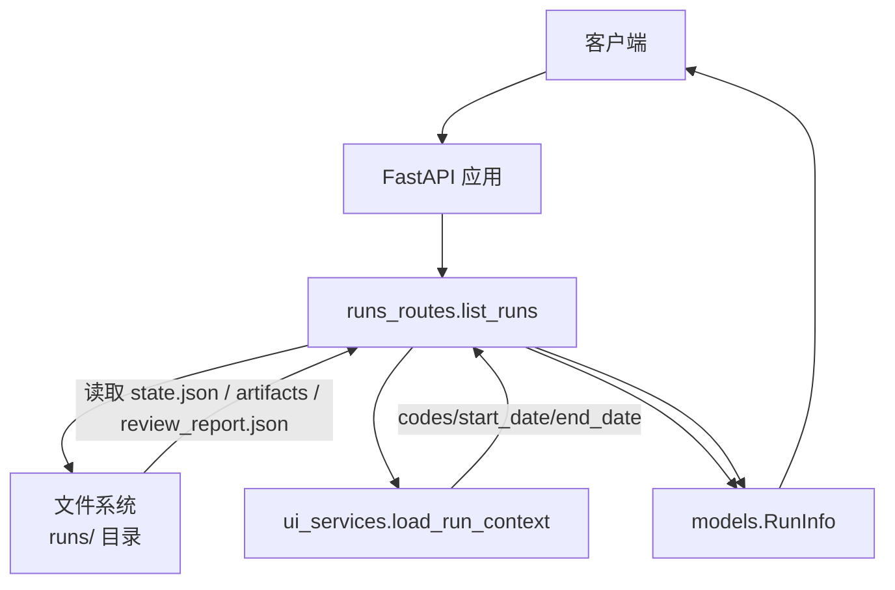
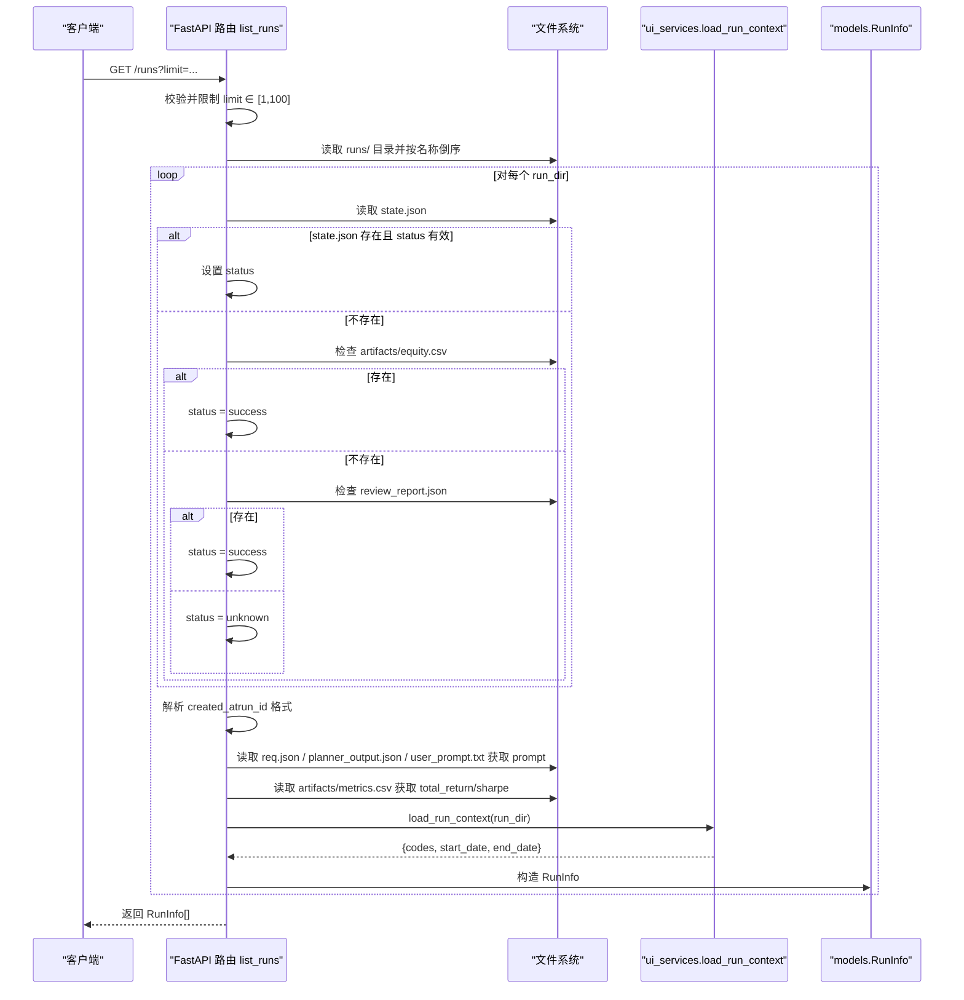
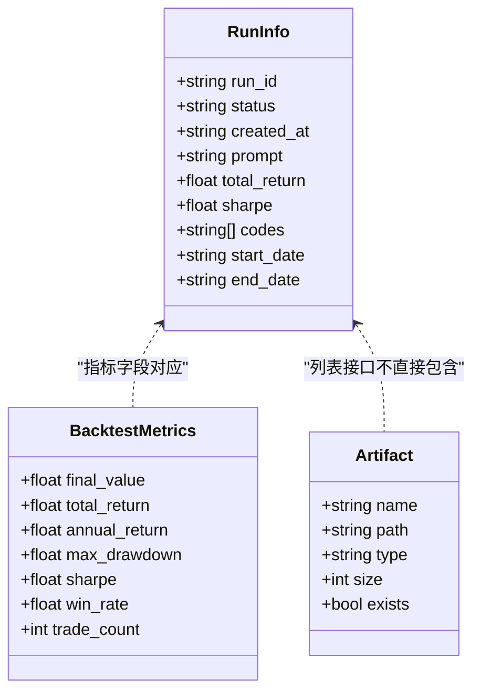

# 回测运行列表

<cite>
**本文引用的文件**
- [runs_routes.py](file://agent/src/api/runs_routes.py)
- [models.py](file://agent/src/api/models.py)
- [ui_services.py](file://agent/src/ui_services.py)
- [README_zh.md](file://README_zh.md)
</cite>

## 目录
1. [简介](#简介)
2. [项目结构](#项目结构)
3. [核心组件](#核心组件)
4. [架构总览](#架构总览)
5. [详细组件分析](#详细组件分析)
6. [依赖关系分析](#依赖关系分析)
7. [性能考虑](#性能考虑)
8. [故障排查指南](#故障排查指南)
9. [结论](#结论)
10. [附录：请求与响应示例](#附录请求与响应示例)

## 简介
本章节面向 Vibe-Trading 的“回测运行列表”API，聚焦 GET /runs 端点。该接口用于列出最近的回测运行记录（RunInfo），支持分页参数 limit，并返回每条运行的关键摘要信息，包括运行标识、状态、创建时间、提示词、收益与风险指标、标的代码及起止日期等。

## 项目结构
GET /runs 的实现位于后端 API 路由模块中，数据模型定义在共享模型文件中，运行上下文解析由 UI 服务模块提供。整体调用链为：HTTP 请求 -> FastAPI 路由 -> 读取 runs 目录与元数据 -> 组装 RunInfo 列表 -> 返回 JSON。

图表来源
- [runs_routes.py:345-444](file://agent/src/api/runs_routes.py#L345-L444)
- [models.py:42-54](file://agent/src/api/models.py#L42-L54)
- [ui_services.py:100-146](file://agent/src/ui_services.py#L100-L146)

章节来源
- [runs_routes.py:345-444](file://agent/src/api/runs_routes.py#L345-L444)
- [models.py:42-54](file://agent/src/api/models.py#L42-L54)
- [ui_services.py:100-146](file://agent/src/ui_services.py#L100-L146)

## 核心组件
- 路由层：list_runs 负责接收请求、校验参数、遍历 runs 目录、读取各运行元数据并构造 RunInfo 列表。
- 数据模型：RunInfo 定义了返回给前端的字段契约。
- 上下文解析：load_run_context 从 req.json 或 planner_output.json 中提取 codes、start_date、end_date 等上下文信息。
- 辅助工具：_load_json_file、_load_csv_to_dict 用于安全地读取 JSON/CSV 文件。

章节来源
- [runs_routes.py:23-49](file://agent/src/api/runs_routes.py#L23-L49)
- [runs_routes.py:345-444](file://agent/src/api/runs_routes.py#L345-L444)
- [models.py:42-54](file://agent/src/api/models.py#L42-L54)
- [ui_services.py:100-146](file://agent/src/ui_services.py#L100-L146)

## 架构总览
下图展示了 GET /runs 的核心处理流程：参数校验与限制、按目录倒序排序、逐条运行解析状态与时间戳、提取 prompt 与指标、加载上下文并构建 RunInfo 列表。

图表来源
- [runs_routes.py:345-444](file://agent/src/api/runs_routes.py#L345-L444)
- [ui_services.py:100-146](file://agent/src/ui_services.py#L100-L146)
- [models.py:42-54](file://agent/src/api/models.py#L42-L54)

## 详细组件分析

### 端点：GET /runs
- 路径与方法：GET /runs
- 鉴权：受 require_auth 保护（由宿主 api_server 注入）
- 查询参数：
  - limit：整数，取值范围 1-100，默认值 20。内部通过 min(max(1, limit), 100) 进行边界限制。
- 返回类型：List[RunInfo]
- 行为说明：
  - 若 runs 目录不存在，直接返回空数组 []。
  - 按 run 目录名倒序排列（最新在前），取前 limit 个。
  - 对每个运行目录，读取状态、创建时间、prompt、指标与上下文，构造 RunInfo。

章节来源
- [runs_routes.py:345-354](file://agent/src/api/runs_routes.py#L345-L354)
- [runs_routes.py:356-360](file://agent/src/api/runs_routes.py#L356-L360)

### 数据模型：RunInfo
- 字段定义与含义：
  - run_id：字符串，运行唯一标识。
  - status：字符串，运行状态，可能值为 success、failed、cancelled、unknown 等。
  - created_at：字符串，创建时间，格式为 “YYYY-MM-DD HH:MM:SS”。
  - prompt：可选字符串，用户提示词；若缺失则回退为 “Manual Analysis”。
  - total_return：可选浮点数，总收益率。
  - sharpe：可选浮点数，夏普比率。
  - codes：字符串数组，策略涉及的标的代码列表。
  - start_date：可选字符串，起始日期，标准化为 “YYYY-MM-DD”。
  - end_date：可选字符串，结束日期，标准化为 “YYYY-MM-DD”。

章节来源
- [models.py:42-54](file://agent/src/api/models.py#L42-L54)

### 运行状态判断逻辑
- 优先级与规则：
  1) 优先从 state.json 的 status 字段读取，并转为小写；若为 success，则 response.status = success；若为 failed 或 cancelled，则沿用该状态并附带 reason（详情见单条运行接口）。
  2) 若 state.json 不存在，则检查 artifacts/equity.csv 是否存在，存在则视为成功。
  3) 若 equity.csv 也不存在，再检查 review_report.json 是否存在，存在则视为成功。
  4) 否则状态为 unknown。
- 注意：上述逻辑同时适用于列表接口中的状态推断。

章节来源
- [runs_routes.py:366-375](file://agent/src/api/runs_routes.py#L366-L375)

### 运行时间戳解析规则
- 解析来源：优先从 run_id 解析；若失败则使用目录修改时间。
- 支持的 run_id 格式：
  - YYYYMMDD_HHMMSS：例如 20240101_120000
  - run_YYYYMMDD_HHMMSS：例如 run_20240101_120000
- 解析结果：转换为 “YYYY-MM-DD HH:MM:SS” 格式的字符串。
- 回退：若无法解析，则使用目录的 st_mtime 生成时间字符串。

章节来源
- [runs_routes.py:376-393](file://agent/src/api/runs_routes.py#L376-L393)

### Prompt 提取顺序
- 尝试顺序：
  1) req.json 中的 prompt 字段
  2) planner_output.json 中的 user_goal 或 goal 字段
  3) user_prompt.txt 文件内容（去除首尾空白）
- 若均不可用，则使用默认值 “Manual Analysis”。

章节来源
- [runs_routes.py:395-416](file://agent/src/api/runs_routes.py#L395-L416)

### 指标与上下文加载
- total_return 与 sharpe：
  - 从 artifacts/metrics.csv 读取第一行，分别取 total_return 与 sharpe 字段，若不存在或解析失败则为 None。
- 上下文 codes、start_date、end_date：
  - 通过 ui_services.load_run_context 从 req.json 或 planner_output.json 中规范化提取。
  - codes 支持列表或逗号分隔字符串；日期统一标准化为 “YYYY-MM-DD”。

章节来源
- [runs_routes.py:417-442](file://agent/src/api/runs_routes.py#L417-L442)
- [ui_services.py:84-97](file://agent/src/ui_services.py#L84-L97)
- [ui_services.py:100-146](file://agent/src/ui_services.py#L100-L146)

### 类图：RunInfo 与其他模型的关系

图表来源
- [models.py:20-54](file://agent/src/api/models.py#L20-L54)

## 依赖关系分析
- 路由依赖：
  - 宿主模块 api_server：提供 require_auth、RUNS_DIR、RunResponse、BacktestMetrics、RunInfo 等符号。
  - ui_services：提供 load_run_context 以解析运行上下文。
- 文件依赖：
  - state.json：运行状态主来源。
  - artifacts/equity.csv：成功态的兜底标志。
  - review_report.json：成功态的兜底标志。
  - req.json / planner_output.json / user_prompt.txt：prompt 来源。
  - artifacts/metrics.csv：total_return 与 sharpe。
- 外部库：
  - FastAPI：路由与参数校验。
  - Pydantic：数据模型序列化。

章节来源
- [runs_routes.py:226-259](file://agent/src/api/runs_routes.py#L226-L259)
- [runs_routes.py:345-444](file://agent/src/api/runs_routes.py#L345-L444)

## 性能考虑
- 列表接口仅读取必要元数据，避免加载完整运行详情。
- metrics.csv 仅读取第一行以获取 total_return 与 sharpe，降低 I/O。
- equity.csv 仅在详情接口中按需加载，列表接口不加载。
- 限制 limit 到 100，防止过多目录遍历导致性能问题。

## 故障排查指南
- 404 错误：
  - 当访问单个运行详情时，若 run_id 对应的目录不存在，会返回 404。
- 状态为 unknown：
  - 若 state.json 不存在且 artifacts/equity.csv 与 review_report.json 均不存在，状态将为 unknown。
- 指标为空：
  - 若 artifacts/metrics.csv 不存在或字段缺失，total_return 与 sharpe 将返回 null。
- 时间戳异常：
  - 若 run_id 不符合预期格式，将回退到目录修改时间。

章节来源
- [runs_routes.py:302-325](file://agent/src/api/runs_routes.py#L302-L325)
- [runs_routes.py:366-393](file://agent/src/api/runs_routes.py#L366-L393)
- [runs_routes.py:417-429](file://agent/src/api/runs_routes.py#L417-L429)

## 结论
GET /runs 提供了轻量而稳定的回测运行列表能力，通过严格的 limit 限制与健壮的状态推断逻辑，确保前端能够高效展示最近运行概览。RunInfo 模型清晰表达了关键字段，结合上下文解析与指标读取，满足常见的使用场景。

## 附录：请求与响应示例

- 请求示例
  - GET /runs
  - GET /runs?limit=10
  - GET /runs?limit=0（将被限制为 1）
  - GET /runs?limit=200（将被限制为 100）

- 成功响应示例（JSON 数组，元素为 RunInfo）
  - 字段说明：
    - run_id：字符串
    - status：字符串（success/failed/cancelled/unknown）
    - created_at：字符串（YYYY-MM-DD HH:MM:SS）
    - prompt：字符串或 null
    - total_return：数字或 null
    - sharpe：数字或 null
    - codes：字符串数组
    - start_date：字符串或 null（YYYY-MM-DD）
    - end_date：字符串或 null（YYYY-MM-DD）

- 错误场景
  - 无运行时：若 runs 目录不存在，返回空数组 []。
  - 鉴权失败：由宿主 require_auth 控制，通常返回 401/403。
  - 其他错误：如访问单条运行详情时 run_id 不存在，返回 404。

章节来源
- [runs_routes.py:345-354](file://agent/src/api/runs_routes.py#L345-L354)
- [runs_routes.py:302-325](file://agent/src/api/runs_routes.py#L302-L325)
- [README_zh.md:956-959](file://README_zh.md#L956-L959)