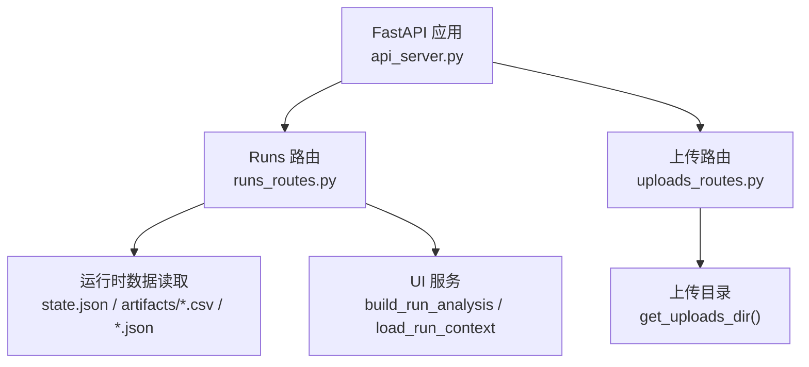
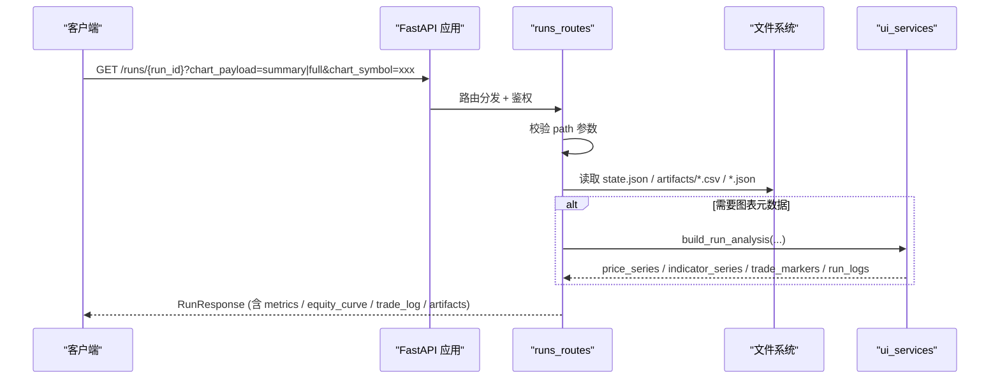
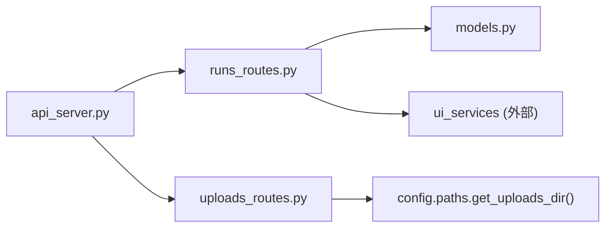

# 回测运行管理

<cite>
**本文引用的文件**
- [runs_routes.py](file://agent/src/api/runs_routes.py)
- [models.py](file://agent/src/api/models.py)
- [uploads_routes.py](file://agent/src/api/uploads_routes.py)
- [api_server.py](file://agent/api_server.py)
</cite>

## 目录
1. [简介](#简介)
2. [项目结构](#项目结构)
3. [核心组件](#核心组件)
4. [架构总览](#架构总览)
5. [详细端点说明](#详细端点说明)
6. [依赖关系分析](#依赖关系分析)
7. [性能与使用建议](#性能与使用建议)
8. [故障排查指南](#故障排查指南)
9. [结论](#结论)

## 简介
本文件为 Vibe-Trading 的“回测运行管理”API 提供完整、可操作的文档。内容覆盖：
- 所有与回测运行相关的 HTTP 端点（列表查询、详情获取、代码下载等）
- 每个端点的 URL 模式、HTTP 方法、请求参数、响应模型与状态码
- RunInfo 与 RunResponse 数据结构的字段说明
- 回测运行状态管理、结果分析与图表数据的 API 使用方式
- 文件上传/下载、批量操作与分页查询的实现说明

## 项目结构
与回测运行管理直接相关的后端实现位于 agent 模块中，关键文件如下：
- runs_routes.py：定义 /runs 相关的所有路由（列表、详情、代码/Pine 脚本下载）
- models.py：定义共享的 Pydantic 模型（RunInfo、RunResponse、BacktestMetrics、Artifact、RAGSelection 等）
- uploads_routes.py：提供通用文件上传能力（用于策略或附件上传）
- api_server.py：FastAPI 应用装配与路由注册入口

**图示来源**
- [api_server.py:187-225](file://agent/api_server.py#L187-L225)
- [runs_routes.py:226-345](file://agent/src/api/runs_routes.py#L226-L345)
- [uploads_routes.py:51-179](file://agent/src/api/uploads_routes.py#L51-L179)

**章节来源**
- [api_server.py:187-225](file://agent/api_server.py#L187-L225)

## 核心组件
- 路由层：负责接收请求、校验参数、调用业务逻辑并返回响应
- 数据层：从磁盘读取 run 目录下的 state.json、artifacts/*、run_card.json、llm_usage.json 等
- 模型层：Pydantic 模型统一序列化/反序列化，保障响应结构稳定
- 安全层：所有 /runs 与 /upload 接口均受 require_auth 保护

**章节来源**
- [runs_routes.py:226-345](file://agent/src/api/runs_routes.py#L226-L345)
- [models.py:10-97](file://agent/src/api/models.py#L10-L97)
- [uploads_routes.py:51-179](file://agent/src/api/uploads_routes.py#L51-L179)
- [api_server.py:187-225](file://agent/api_server.py#L187-L225)

## 架构总览
以下序列图展示一次“获取回测运行详情”的典型调用流程：客户端发起 GET /runs/{run_id}，服务端校验路径参数、定位 run 目录、加载状态与指标、可选构建图表数据，最终返回 RunResponse。

**图示来源**
- [runs_routes.py:302-343](file://agent/src/api/runs_routes.py#L302-L343)
- [runs_routes.py:52-216](file://agent/src/api/runs_routes.py#L52-L216)

## 详细端点说明

### 1) 列出最近回测运行
- URL: GET /runs
- 鉴权: 需要
- 查询参数:
  - limit: int，默认 20，范围限制在 1..100
- 响应: List[RunInfo]
- 行为:
  - 按 run_id 排序取最近 N 个运行
  - 从 state.json 或 artifacts/review_report 推断 status
  - 解析 created_at（支持 run_YYYYMMDD_HHMMSS 或 YYYYMMDD_HHMMSS）
  - 尝试从 metrics.csv 提取 total_return、sharpe
  - 通过 load_run_context 补充 codes、start_date、end_date
- 状态码: 200 成功；若目录不存在则返回空数组

**章节来源**
- [runs_routes.py:345-444](file://agent/src/api/runs_routes.py#L345-L444)

### 2) 获取单个回测运行详情
- URL: GET /runs/{run_id}
- 鉴权: 需要
- 路径参数:
  - run_id: str（会被安全校验）
- 查询参数:
  - chart_payload: 可选，取值 summary 或 full（默认 full）。summary 会省略图表行与交易标记以减小体积
  - chart_symbol: 可选，指定单标的的图表数据
- 响应: RunResponse
- 行为:
  - 校验 chart_payload 合法值
  - 构建响应：status、elapsed_seconds、reason、planner_output、strategy_spec、rag_selection、metrics、artifacts、run_card、llm_usage、equity_curve、trade_log、validation、risk_xray、rebalance_notes、run_directory
  - 当包含图表元数据时，额外返回 chart_symbols 列表
- 状态码:
  - 200 成功
  - 400 非法 chart_payload
  - 404 run_id 不存在

**章节来源**
- [runs_routes.py:302-343](file://agent/src/api/runs_routes.py#L302-L343)

### 3) 下载运行代码（信号引擎）
- URL: GET /runs/{run_id}/code
- 鉴权: 需要
- 路径参数:
  - run_id: str
- 响应: 文件名 -> 源码文本 的映射（当前固定读取 signal_engine.py）
- 状态码:
  - 200 成功
  - 404 code 目录不存在

**章节来源**
- [runs_routes.py:262-281](file://agent/src/api/runs_routes.py#L262-L281)

### 4) 下载 Pine 脚本
- URL: GET /runs/{run_id}/pine
- 鉴权: 需要
- 路径参数:
  - run_id: str
- 响应: { exists: bool, content: string|null }
- 状态码: 200 始终返回（存在与否由 exists 标识）

**章节来源**
- [runs_routes.py:283-300](file://agent/src/api/runs_routes.py#L283-L300)

### 5) 文件上传（用于策略/附件）
- URL: POST /upload
- 鉴权: 需要
- 请求体: multipart/form-data，字段 file
- 限制:
  - 最大 50MB
  - 禁止执行类、可执行相邻源/配置/模板、压缩包等扩展名
  - 禁止特定文件名（如 dockerfile）
- 响应: { status: "ok", file_path: "uploads/<uuid>.ext", filename: "原始文件名" }
- 状态码:
  - 200 上传成功
  - 400 文件名缺失或类型被拒绝
  - 413 超过大小限制
  - 500 存储失败

**章节来源**
- [uploads_routes.py:119-178](file://agent/src/api/uploads_routes.py#L119-L178)

### 6) 获取影子账户报告（辅助）
- URL: GET /shadow-reports/{shadow_id}?format=html|pdf
- 鉴权: 需要
- 路径参数:
  - shadow_id: 格式 shadow_<8位十六进制>
- 查询参数:
  - format: html 或 pdf
- 响应: 文件流（HTML 或 PDF）
- 状态码:
  - 200 成功
  - 400 参数不合法
  - 404 报告不存在

**章节来源**
- [uploads_routes.py:96-117](file://agent/src/api/uploads_routes.py#L96-L117)

## 数据模型说明

### RunInfo（列表项）
- run_id: str，运行唯一标识
- status: str，运行状态（success/failed/cancelled/unknown 等）
- created_at: str，创建时间（字符串化）
- prompt: str?，用户目标/提示词摘要
- total_return: float?，总收益
- sharpe: float?，夏普比率
- codes: List[str]，关联的代码清单
- start_date: str?，回测起始日期
- end_date: str?，回测结束日期

**章节来源**
- [models.py:42-54](file://agent/src/api/models.py#L42-L54)

### RunResponse（运行详情）
- status: str，运行状态
- run_id: str，运行标识
- elapsed_seconds: float，执行耗时
- reason: str?，失败原因（如有）
- planner_output: dict?，规划器输出
- strategy_spec: dict?，策略规范
- rag_selection: RAGSelection?，RAG 选择结果
- metrics: BacktestMetrics?，回测指标汇总
- artifacts: List[Artifact]，产物清单（名称、路径、类型、大小、是否存在）
- run_card: dict?，信任层运行卡片
- llm_usage: dict?，LLM 使用统计
- equity_curve: List[dict]?，权益曲线预览（前若干行）
- trade_log: List[dict>?，交易日志预览（前若干行）
- artifacts_equity_csv: List[dict]?，完整权益 CSV 行
- artifacts_metrics_csv: List[dict]?，完整指标 CSV 行
- artifacts_trades_csv: List[dict]?，完整交易 CSV 行
- validation: dict?，统计验证结果
- risk_xray: dict?，风险透视
- rebalance_notes: dict?，调仓备注
- run_directory: str，运行目录路径
- run_stage: str?，面向 UI 的运行阶段
- run_context: dict?，标准化请求上下文
- price_series: dict?，分组 OHLC 序列
- indicator_series: dict?，分组指标叠加
- trade_markers: List[dict]?，交易标记（用于图表）
- run_logs: List[dict]?，结构化 stdout/stderr 行

**章节来源**
- [models.py:10-97](file://agent/src/api/models.py#L10-L97)

### 其他模型
- Artifact：产物元信息（name/path/type/size/exists）
- BacktestMetrics：回测指标（final_value/total_return/annual_return/max_drawdown/sharpe/win_rate/trade_count），允许额外字段
- RAGSelection：RAG 选择（selected_api/selected_name/selected_score）

**章节来源**
- [models.py:10-40](file://agent/src/api/models.py#L10-L40)

## 依赖关系分析
- 路由注册：api_server.py 将 runs_routes 与 uploads_routes 挂载到 FastAPI 应用
- 鉴权：所有 /runs 与 /upload 路由通过 require_auth 依赖进行认证
- 数据读取：runs_routes 直接从 run 目录读取 JSON/CSV 文件，必要时调用 ui_services 构建图表数据
- 模型复用：models.py 中的 Pydantic 模型被 runs_routes 与 api_server 共同引用

**图示来源**
- [api_server.py:187-225](file://agent/api_server.py#L187-L225)
- [runs_routes.py:226-345](file://agent/src/api/runs_routes.py#L226-L345)
- [uploads_routes.py:51-179](file://agent/src/api/uploads_routes.py#L51-L179)

**章节来源**
- [api_server.py:187-225](file://agent/api_server.py#L187-L225)

## 性能与使用建议
- 列表分页：/runs 通过 limit 控制返回数量，上限 100。建议前端按需分页（例如每次拉取 20 条，滚动加载更多）
- 图表优化：GET /runs/{run_id} 支持 chart_payload=summary 以减少响应体积；仅在需要时传入 chart_symbol 缩小图表数据范围
- 大文件上传：/upload 限制 50MB，分块写入避免内存峰值；注意服务端磁盘空间与 I/O 压力
- 并发访问：同一 run 目录的多次读取是幂等的；高并发场景建议对热点 run_id 做缓存（如短期内存缓存）

[本节为通用性能建议，无需具体文件引用]

## 故障排查指南
- 404 未找到运行：检查 run_id 是否正确、对应 run 目录是否存在
- 400 非法参数：确认 chart_payload 仅接受 summary 或 full；shadow-reports 的 format 仅接受 html/pdf
- 413 文件过大：上传超过 50MB 将被拒绝，请拆分文件或压缩后再上传
- 500 上传失败：检查上传目录权限与磁盘空间，重试上传
- 响应为空或字段缺失：确认 artifacts 目录下存在相应 CSV/JSON；部分字段为可选，缺失属正常

**章节来源**
- [runs_routes.py:302-343](file://agent/src/api/runs_routes.py#L302-L343)
- [uploads_routes.py:96-178](file://agent/src/api/uploads_routes.py#L96-L178)

## 结论
Vibe-Trading 的回测运行管理 API 提供了完整的运行生命周期查看与产物访问能力：
- 列表与详情：/runs 与 /runs/{run_id}
- 代码与脚本：/runs/{run_id}/code 与 /runs/{run_id}/pine
- 文件上传：/upload
- 数据模型：RunInfo 与 RunResponse 清晰表达运行元数据与结果
- 安全与性能：鉴权保护、参数校验、图表载荷优化与上传限流

结合上述端点与模型，可构建高效的回测结果浏览、分析与可视化系统。