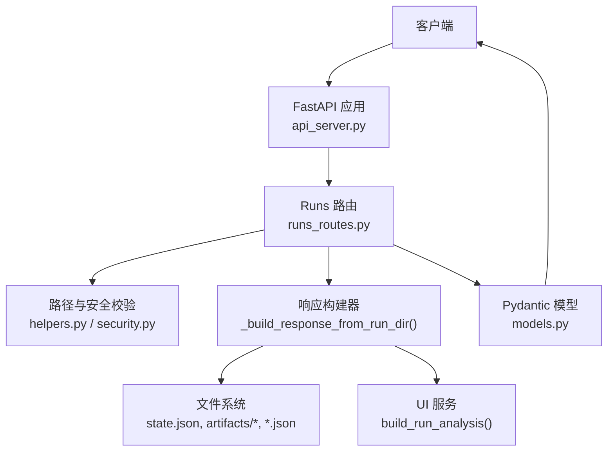
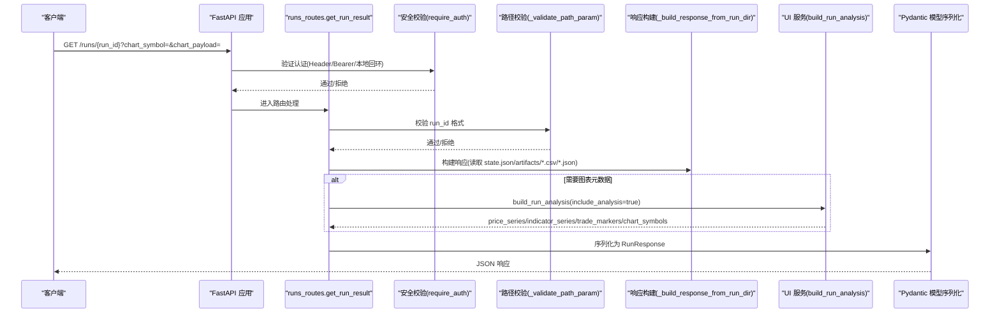
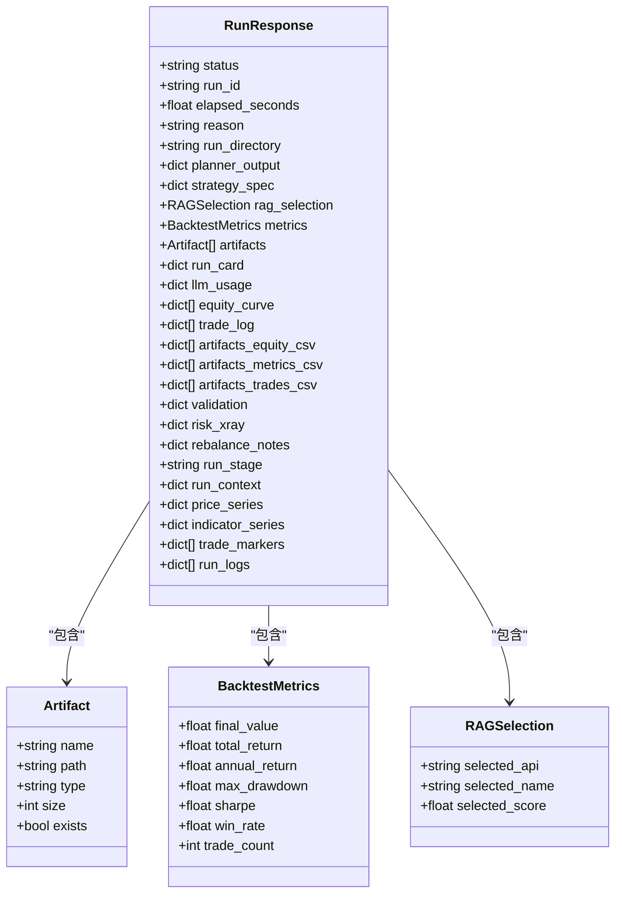
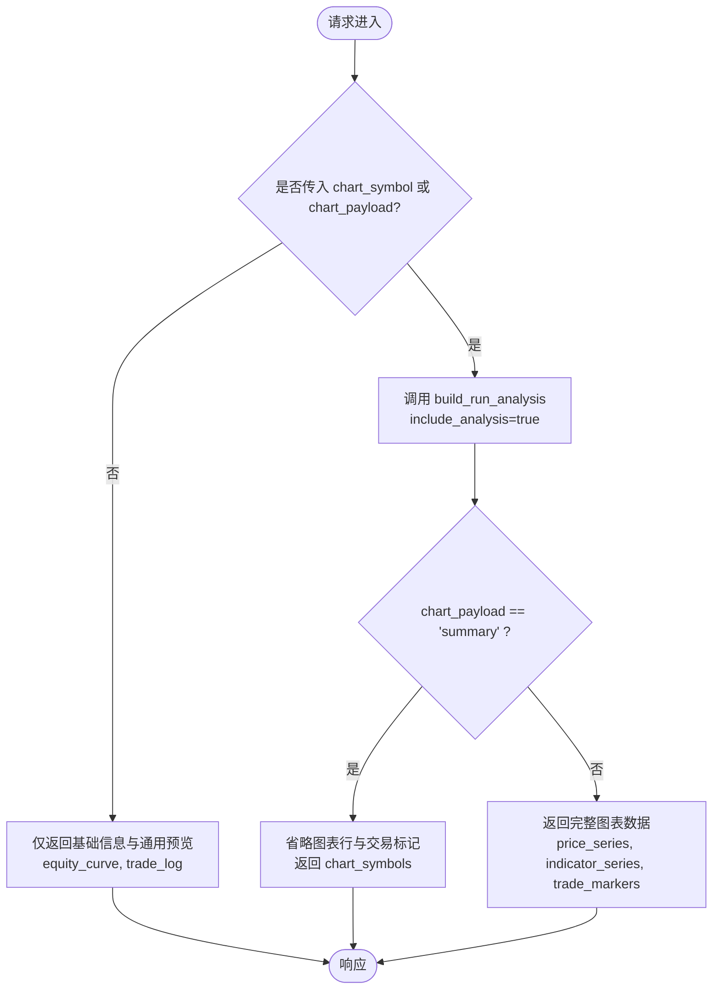
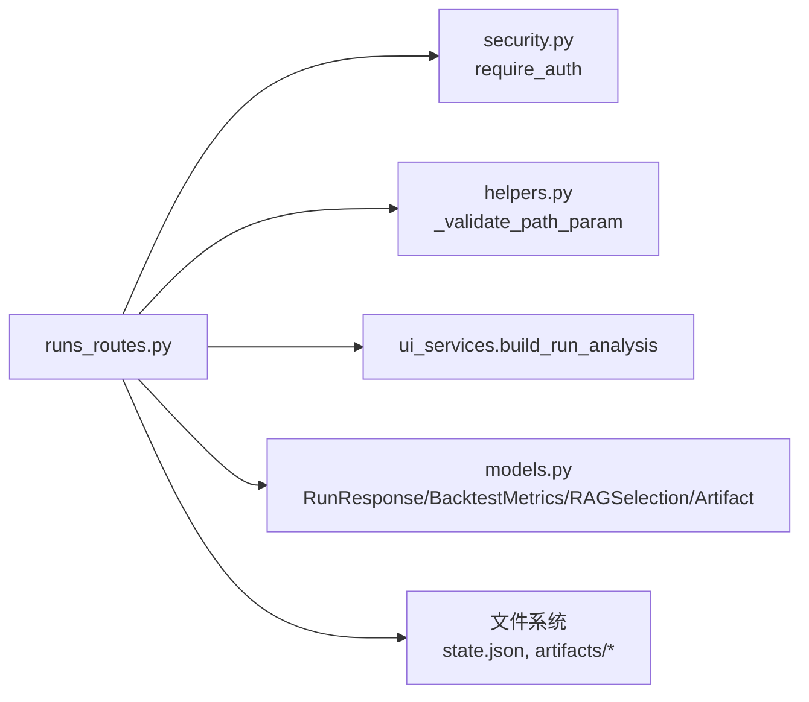

# 回测运行详情

<cite>
**本文引用的文件**
- [agent/src/api/runs_routes.py](file://agent/src/api/runs_routes.py)
- [agent/src/api/models.py](file://agent/src/api/models.py)
- [agent/src/api/helpers.py](file://agent/src/api/helpers.py)
- [agent/src/api/security.py](file://agent/src/api/security.py)
- [agent/api_server.py](file://agent/api_server.py)
- [frontend/src/pages/RunDetail.tsx](file://frontend/src/pages/RunDetail.tsx)
- [frontend/src/lib/api.ts](file://frontend/src/lib/api.ts)
</cite>

## 目录
1. [简介](#简介)
2. [项目结构](#项目结构)
3. [核心组件](#核心组件)
4. [架构总览](#架构总览)
5. [详细组件分析](#详细组件分析)
6. [依赖关系分析](#依赖关系分析)
7. [性能考虑](#性能考虑)
8. [故障排查指南](#故障排查指南)
9. [结论](#结论)
10. [附录](#附录)

## 简介
本文件为 Vibe-Trading 的“回测运行详情”API 提供完整技术文档，聚焦 GET /runs/{run_id} 端点。内容涵盖：
- 路径参数 run_id 的安全校验规则
- 可选查询参数 chart_symbol、chart_payload 的作用与约束
- RunResponse 数据模型的复杂结构与字段含义
- 图表数据的按需加载机制与 CSV 读取限制
- 内存使用控制策略
- 请求与响应示例（含不同 chart_payload 模式差异）

该端点用于根据 run_id 获取一次历史回测运行的详细信息，包括状态、指标、产物清单、图表数据、风险评估等。

## 项目结构
GET /runs/{run_id} 由 API 服务器挂载 runs 路由模块实现，核心流程如下：
- FastAPI 应用启动时注册 runs 路由
- 路由层对 run_id 进行安全校验并定位运行目录
- 构建响应对象，按需加载 JSON/CSV 产物与图表数据
- 通过 Pydantic 模型序列化返回

**图示来源**
- [agent/api_server.py:163-189](file://agent/api_server.py#L163-L189)
- [agent/src/api/runs_routes.py:226-343](file://agent/src/api/runs_routes.py#L226-L343)
- [agent/src/api/helpers.py:263-270](file://agent/src/api/helpers.py#L263-L270)
- [agent/src/api/security.py:571-588](file://agent/src/api/security.py#L571-L588)

**章节来源**
- [agent/api_server.py:163-189](file://agent/api_server.py#L163-L189)
- [agent/src/api/runs_routes.py:226-343](file://agent/src/api/runs_routes.py#L226-L343)

## 核心组件
- 路由与控制器
  - GET /runs/{run_id}：接收 run_id 与可选查询参数，调用响应构建器组装结果
  - 辅助函数：_load_json_file、_load_csv_to_dict、_build_response_from_run_dir
- 数据模型
  - RunResponse、BacktestMetrics、RAGSelection、Artifact 等
- 安全与校验
  - _validate_path_param：限制 run_id 字符集与长度，防止路径穿越
  - require_auth：基于 Bearer Token 或本地回环信任的鉴权
- 前端集成
  - 默认以 chart_payload=summary 拉取轻量信息，再按需按 symbol 增量加载图表数据

**章节来源**
- [agent/src/api/runs_routes.py:23-216](file://agent/src/api/runs_routes.py#L23-L216)
- [agent/src/api/models.py:10-97](file://agent/src/api/models.py#L10-L97)
- [agent/src/api/helpers.py:263-270](file://agent/src/api/helpers.py#L263-L270)
- [agent/src/api/security.py:571-588](file://agent/src/api/security.py#L571-L588)
- [frontend/src/pages/RunDetail.tsx:150-170](file://frontend/src/pages/RunDetail.tsx#L150-L170)

## 架构总览
下图展示从请求到响应的关键交互：

**图示来源**
- [agent/src/api/runs_routes.py:302-343](file://agent/src/api/runs_routes.py#L302-L343)
- [agent/src/api/security.py:571-588](file://agent/src/api/security.py#L571-L588)
- [agent/src/api/helpers.py:263-270](file://agent/src/api/helpers.py#L263-L270)

## 详细组件分析

### 端点定义与参数
- 路径参数
  - run_id：字符串，必须通过 _validate_path_param 校验，仅允许字母数字、下划线、连字符，长度不超过 128，避免路径穿越
- 查询参数
  - chart_symbol：可选，指定单个标的的图表数据；当存在时，会触发对应标的的价格序列、指标序列与交易标记加载
  - chart_payload：可选，取值 summary 或 full（默认 full）。summary 模式省略图表行与交易标记，减少响应体积
- 认证
  - 通过 require_auth 依赖进行鉴权，支持 Bearer Token 或本地回环信任

**章节来源**
- [agent/src/api/runs_routes.py:302-319](file://agent/src/api/runs_routes.py#L302-L319)
- [agent/src/api/helpers.py:263-270](file://agent/src/api/helpers.py#L263-L270)
- [agent/src/api/security.py:571-588](file://agent/src/api/security.py#L571-L588)

### 响应构建逻辑
_build_response_from_run_dir 负责从运行目录拼装响应：
- 基础信息
  - status：来自 state.json 的状态映射（success/failed/cancelled/unknown）
  - run_id：目录名
  - elapsed_seconds：当前固定为 0.0（占位）
  - reason：失败原因（如有）
- 策略与规划
  - strategy_spec：design_spec.json
  - planner_output：planner_output.json
- RAG 选择
  - rag_selection：selected_api、selected_name、selected_score
- 回测指标
  - metrics：解析 artifacts/metrics.csv 首行，构造 BacktestMetrics（允许额外字段）
- 产物清单
  - artifacts：artifacts 目录下所有文件的元信息（name/path/type/size/exists）
- 原始 CSV
  - artifacts_equity_csv、artifacts_metrics_csv、artifacts_trades_csv：分别读取 equity/metrics/trades 全量 CSV
- 其他
  - run_card、risk_xray、rebalance_notes、llm_usage、validation：从对应 JSON 文件加载
- 图表预览
  - equity_curve：equity.csv 前 1000 行的精简列（time/equity/drawdown）
  - trade_log：trades.csv 前 500 行
- 图表数据（按需）
  - include_analysis=true 时调用 build_run_analysis，产出 price_series、indicator_series、trade_markers、run_logs，并在需要时收集 chart_symbols

**章节来源**
- [agent/src/api/runs_routes.py:52-216](file://agent/src/api/runs_routes.py#L52-L216)

### 数据模型 RunResponse
RunResponse 是本次 API 的核心响应模型，包含以下分组字段：
- 基础信息
  - status、run_id、elapsed_seconds、reason、run_directory
- 策略与规划
  - strategy_spec、planner_output
- RAG 选择
  - rag_selection：selected_api、selected_name、selected_score
- 回测指标
  - metrics：final_value、total_return、annual_return、max_drawdown、sharpe、win_rate、trade_count，以及允许的其他数值字段
- 产物清单
  - artifacts：name、path、type、size、exists
- 图表与日志
  - equity_curve、trade_log、price_series、indicator_series、trade_markers、run_logs
- 其他
  - run_card、risk_xray、rebalance_notes、llm_usage、validation、run_stage、run_context

**图示来源**
- [agent/src/api/models.py:10-97](file://agent/src/api/models.py#L10-L97)

**章节来源**
- [agent/src/api/models.py:10-97](file://agent/src/api/models.py#L10-L97)

### 图表数据按需加载与差异
- 默认行为
  - 不传 chart_symbol 时，返回基础信息与通用图表预览（equity_curve、trade_log），不包含 price_series/indicator_series/trade_markers
- 指定 chart_symbol
  - 触发针对单一标的的图表数据加载，返回 price_series、indicator_series、trade_markers，并补充 chart_symbols 列表
- chart_payload 模式
  - summary：省略图表行与交易标记，适合快速概览
  - full：包含图表行与交易标记（默认）

**图示来源**
- [agent/src/api/runs_routes.py:302-343](file://agent/src/api/runs_routes.py#L302-L343)
- [agent/src/api/runs_routes.py:198-216](file://agent/src/api/runs_routes.py#L198-L216)

**章节来源**
- [agent/src/api/runs_routes.py:302-343](file://agent/src/api/runs_routes.py#L302-L343)

### 前端集成与调用策略
- 首次加载
  - 使用 chart_payload=summary 获取轻量响应，初始化界面与基础指标
- 按需加载图表
  - 用户切换标的时，调用 getRun(run_id, { chart_symbol }) 增量加载 price_series、indicator_series、trade_markers
- 缓存与合并
  - 前端维护 chartCache，按 symbol 缓存价格序列与指标，避免重复请求

**章节来源**
- [frontend/src/pages/RunDetail.tsx:150-170](file://frontend/src/pages/RunDetail.tsx#L150-L170)
- [frontend/src/pages/RunDetail.tsx:205-235](file://frontend/src/pages/RunDetail.tsx#L205-L235)
- [frontend/src/lib/api.ts:594-617](file://frontend/src/lib/api.ts#L594-L617)

## 依赖关系分析
- 路由依赖
  - require_auth：认证依赖，确保受保护接口访问安全
  - _validate_path_param：路径参数安全校验，防止目录穿越
- 运行时依赖
  - ui_services.build_run_analysis：生成图表相关数据结构
  - 文件系统：读取 state.json、artifacts/*.csv、*.json
- 模型依赖
  - Pydantic 模型用于响应序列化与类型约束

**图示来源**
- [agent/src/api/runs_routes.py:226-343](file://agent/src/api/runs_routes.py#L226-L343)
- [agent/src/api/security.py:571-588](file://agent/src/api/security.py#L571-L588)
- [agent/src/api/helpers.py:263-270](file://agent/src/api/helpers.py#L263-L270)
- [agent/src/api/models.py:10-97](file://agent/src/api/models.py#L10-L97)

**章节来源**
- [agent/src/api/runs_routes.py:226-343](file://agent/src/api/runs_routes.py#L226-L343)

## 性能考虑
- 图表数据按需加载
  - 仅在 chart_symbol 存在或 chart_payload!=summary 时加载 price_series、indicator_series、trade_markers，避免不必要的数据传输
- CSV 读取限制
  - equity_curve 仅读取前 1000 行，trade_log 仅读取前 500 行，降低大文件 I/O 与内存占用
- 内存使用控制
  - 优先读取必要字段（如 equity.csv 的 time/equity/drawdown），避免整表驻留
  - 使用 limit 参数裁剪 CSV 行数，减少响应体大小
- 前端优化
  - 首次 summary 模式加载，后续按需增量加载，结合本地缓存减少重复请求

**章节来源**
- [agent/src/api/runs_routes.py:142-196](file://agent/src/api/runs_routes.py#L142-L196)
- [agent/src/api/runs_routes.py:198-216](file://agent/src/api/runs_routes.py#L198-L216)
- [frontend/src/pages/RunDetail.tsx:150-170](file://frontend/src/pages/RunDetail.tsx#L150-L170)

## 故障排查指南
- 404 未找到
  - 现象：run_id 对应的运行目录不存在
  - 可能原因：run_id 错误或运行尚未完成
  - 处理：检查 run_id 是否正确，确认运行目录是否存在
- 400 无效参数
  - 现象：chart_payload 非 summary/full，或 run_id 不符合安全正则
  - 可能原因：传入非法值或路径穿越尝试
  - 处理：修正 chart_payload 为 summary 或 full；确保 run_id 仅包含字母数字、下划线、连字符且长度不超过 128
- 401/403 认证失败
  - 现象：缺少或错误的 Bearer Token，或非本地回环访问未配置 API_KEY
  - 可能原因：未携带认证头或未满足本地回环信任条件
  - 处理：添加正确的 Authorization 头；或在本地开发环境确保回环来源可信
- 图表数据为空
  - 现象：price_series/indicator_series/trade_markers 为空
  - 可能原因：未指定 chart_symbol 或 chart_payload=summary
  - 处理：传入 chart_symbol 并将 chart_payload 设为 full

**章节来源**
- [agent/src/api/runs_routes.py:316-325](file://agent/src/api/runs_routes.py#L316-L325)
- [agent/src/api/runs_routes.py:317-319](file://agent/src/api/runs_routes.py#L317-L319)
- [agent/src/api/helpers.py:263-270](file://agent/src/api/helpers.py#L263-L270)
- [agent/src/api/security.py:571-588](file://agent/src/api/security.py#L571-L588)

## 结论
GET /runs/{run_id} 提供了完整的回测运行详情能力，并通过可选参数实现图表数据的按需加载与体积控制。配合严格的路径参数校验与认证机制，既保证了安全性，又兼顾了性能与用户体验。建议在生产环境中：
- 始终启用认证（Bearer Token）
- 合理设置 chart_payload=summary 作为默认，按需切换到 full
- 关注 CSV 文件大小，必要时在数据源侧做采样或分页

## 附录

### 请求示例
- 基础详情（默认 full）
  - GET /runs/{run_id}
- 轻量概览
  - GET /runs/{run_id}?chart_payload=summary
- 指定标的图表
  - GET /runs/{run_id}?chart_symbol=AAPL.US&chart_payload=full

### 响应示例（摘要）
- 基础字段
  - status: "success" | "failed" | "cancelled" | "unknown"
  - run_id: 字符串
  - elapsed_seconds: 浮点数
  - reason: 可选字符串
  - run_directory: 字符串
- 策略与规划
  - strategy_spec: 字典
  - planner_output: 字典
- RAG 选择
  - rag_selection: { selected_api, selected_name, selected_score }
- 回测指标
  - metrics: { final_value, total_return, annual_return, max_drawdown, sharpe, win_rate, trade_count, ... }
- 产物清单
  - artifacts: [{ name, path, type, size, exists }, ...]
- 图表与日志
  - equity_curve: 数组（time/equity/drawdown）
  - trade_log: 数组（交易记录片段）
  - price_series: 字典（按标的分组的价格序列）
  - indicator_series: 字典（按标的分组的指标序列）
  - trade_markers: 数组（交易标记）
  - run_logs: 数组（结构化日志行）
- 其他
  - run_card: 字典
  - risk_xray: 字典
  - rebalance_notes: 字典
  - llm_usage: 字典
  - validation: 字典
  - run_stage: 可选字符串
  - run_context: 可选字典
  - chart_symbols: 可选数组（当请求包含 chart_symbol 或 chart_payload 时返回）

**章节来源**
- [agent/src/api/models.py:56-97](file://agent/src/api/models.py#L56-L97)
- [agent/src/api/runs_routes.py:72-216](file://agent/src/api/runs_routes.py#L72-L216)
- [agent/src/api/runs_routes.py:327-343](file://agent/src/api/runs_routes.py#L327-L343)