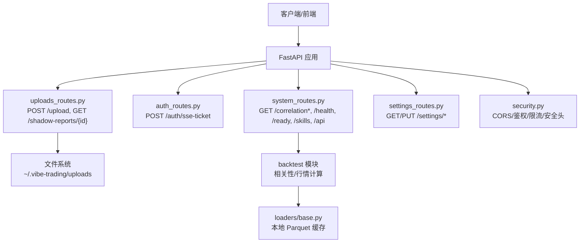
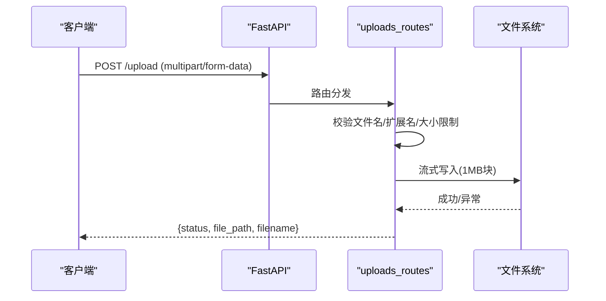
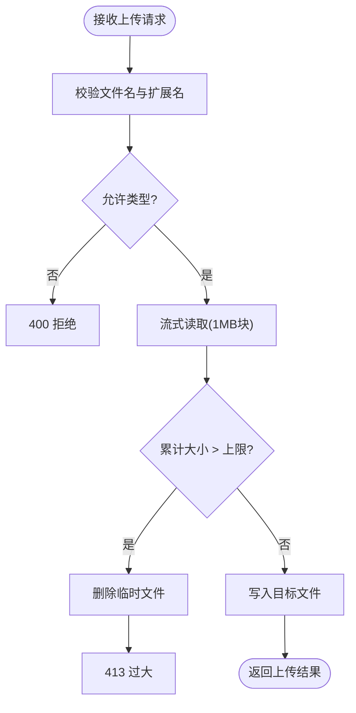
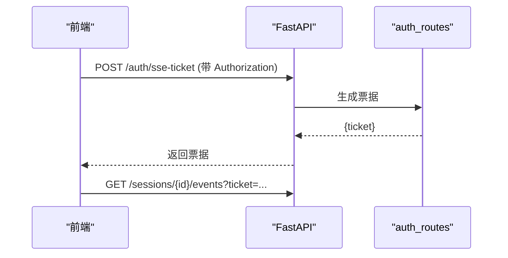
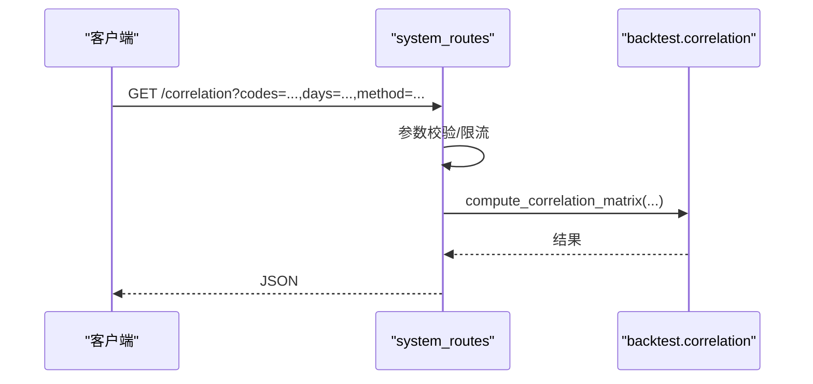
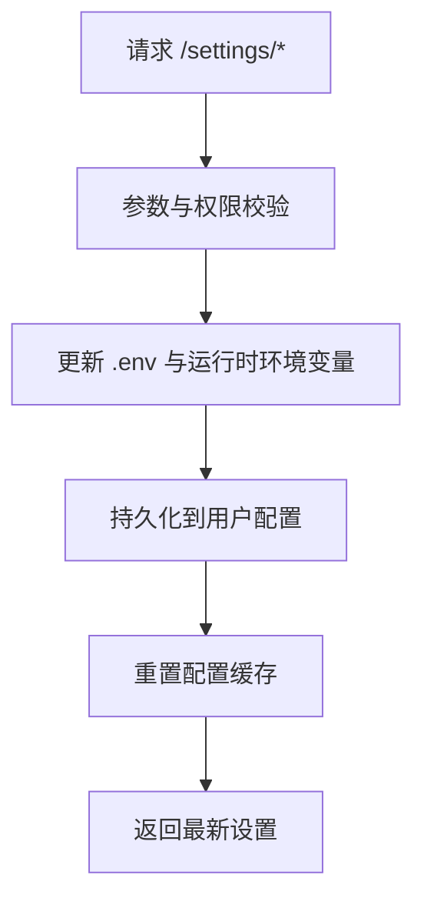
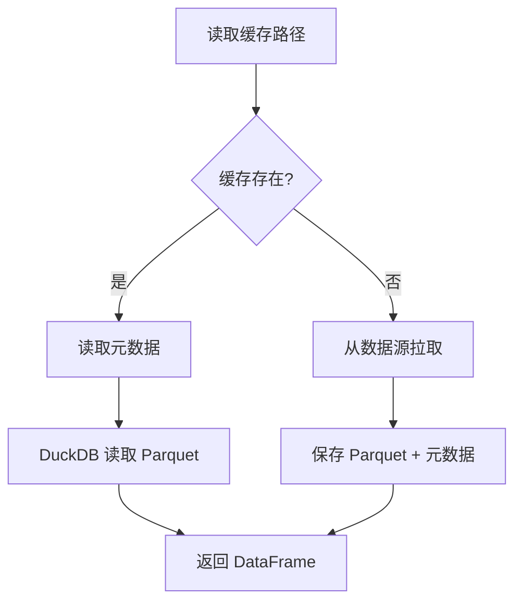
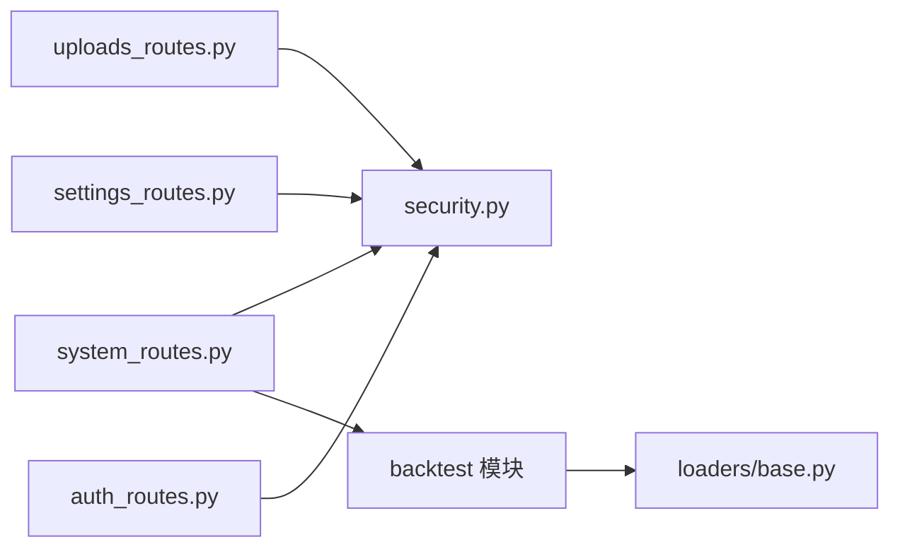

# 数据操作

<cite>
**本文引用的文件**
- [uploads_routes.py](file://agent/src/api/uploads_routes.py)
- [auth_routes.py](file://agent/src/api/auth_routes.py)
- [system_routes.py](file://agent/src/api/system_routes.py)
- [settings_routes.py](file://agent/src/api/settings_routes.py)
- [security.py](file://agent/src/api/security.py)
- [base.py（加载器缓存）](file://agent/backtest/loaders/base.py)
- [test_upload_api.py](file://agent/tests/test_upload_api.py)
- [README_zh.md](file://README_zh.md)
</cite>

## 目录
1. [简介](#简介)
2. [项目结构](#项目结构)
3. [核心组件](#核心组件)
4. [架构总览](#架构总览)
5. [详细组件分析](#详细组件分析)
6. [依赖关系分析](#依赖关系分析)
7. [性能与可扩展性](#性能与可扩展性)
8. [故障排查指南](#故障排查指南)
9. [结论](#结论)
10. [附录：API 使用示例](#附录api-使用示例)

## 简介
本文件为 Vibe-Trading 的数据操作 API 提供完整文档，覆盖数据上传、下载、转换与处理相关 HTTP 端点；说明支持的文件格式、数据验证规则与处理管道；阐述批量数据处理、流式传输与缓存策略；给出数据导入导出、格式转换与质量检查的 API 使用示例；并总结数据安全、隐私保护与合规要求。

## 项目结构
数据操作能力主要分布在以下模块：
- 上传与报告下载：uploads_routes.py
- 认证辅助（SSE 票据）：auth_routes.py
- 系统与健康检查、相关性计算等：system_routes.py
- LLM 与数据源设置（含凭据管理）：settings_routes.py
- 安全中间件与鉴权：security.py
- 数据加载器缓存（Parquet + DuckDB）：backtest/loaders/base.py
- 上传接口回归测试：tests/test_upload_api.py

图表来源
- [uploads_routes.py:1-179](file://agent/src/api/uploads_routes.py#L1-L179)
- [auth_routes.py:1-56](file://agent/src/api/auth_routes.py#L1-L56)
- [system_routes.py:1-438](file://agent/src/api/system_routes.py#L1-L438)
- [settings_routes.py:1-674](file://agent/src/api/settings_routes.py#L1-L674)
- [security.py:1-200](file://agent/src/api/security.py#L1-L200)
- [base.py（加载器缓存）:462-499](file://agent/backtest/loaders/base.py#L462-L499)

章节来源
- [uploads_routes.py:1-179](file://agent/src/api/uploads_routes.py#L1-L179)
- [system_routes.py:1-438](file://agent/src/api/system_routes.py#L1-L438)
- [settings_routes.py:1-674](file://agent/src/api/settings_routes.py#L1-L674)
- [security.py:1-200](file://agent/src/api/security.py#L1-L200)
- [base.py（加载器缓存）:462-499](file://agent/backtest/loaders/base.py#L462-L499)

## 核心组件
- 文件上传与大小限制：POST /upload，流式写入磁盘，按扩展名黑名单过滤，最大 50MB，失败时清理临时文件。
- Shadow 报告下载：GET /shadow-reports/{shadow_id}?format=html|pdf，校验 shadow_id 格式与存在性。
- SSE 票据：POST /auth/sse-ticket，用于浏览器 EventSource 短生命周期票据交换，避免在 URL 中暴露长密钥。
- 系统健康与相关性：/health、/ready、/correlation、/correlation/regime，带速率限制与参数校验。
- 设置管理：/settings/llm、/settings/data-sources，读写项目级 .env 配置，支持模型列表发现与凭据持久化。
- 安全与鉴权：CORS、DNS 重绑定防护、安全响应头、基于 API Key 或回环信任的鉴权。

章节来源
- [uploads_routes.py:1-179](file://agent/src/api/uploads_routes.py#L1-L179)
- [auth_routes.py:1-56](file://agent/src/api/auth_routes.py#L1-L56)
- [system_routes.py:1-438](file://agent/src/api/system_routes.py#L1-L438)
- [settings_routes.py:1-674](file://agent/src/api/settings_routes.py#L1-L674)
- [security.py:1-200](file://agent/src/api/security.py#L1-L200)

## 架构总览
数据操作 API 以 FastAPI 为中心，路由模块化挂载，统一通过 security.py 提供的鉴权与中间件进行访问控制与安全防护。上传路径采用流式写入与严格白名单/黑名单校验；相关性计算等数据服务通过 backtest 模块调用数据加载器，并利用本地 Parquet 缓存加速重复查询。

图表来源
- [uploads_routes.py:119-179](file://agent/src/api/uploads_routes.py#L119-L179)
- [test_upload_api.py:19-37](file://agent/tests/test_upload_api.py#L19-L37)

章节来源
- [uploads_routes.py:119-179](file://agent/src/api/uploads_routes.py#L119-L179)
- [test_upload_api.py:19-37](file://agent/tests/test_upload_api.py#L19-L37)

## 详细组件分析

### 文件上传与下载
- 支持格式：PDF、Word、Excel、PowerPoint、图片、CSV/TSV、纯文本、JSON、TOML。
- 禁止类型：可执行文件、脚本、配置文件、模板、压缩包等。
- 大小限制：默认 50MB，超过返回 413。
- 存储位置：用户主目录下 ~/.vibe-trading/uploads（可通过宿主变量覆盖）。
- 错误处理：缺失文件名、非法类型、IO 异常均返回明确状态码与消息；异常时删除未完成的临时文件。
- 下载：Shadow 报告支持 HTML/PDF 两种格式，路径位于 ~/.vibe-trading/shadow_reports。

图表来源
- [uploads_routes.py:119-179](file://agent/src/api/uploads_routes.py#L119-L179)

章节来源
- [uploads_routes.py:22-43](file://agent/src/api/uploads_routes.py#L22-L43)
- [uploads_routes.py:96-117](file://agent/src/api/uploads_routes.py#L96-L117)
- [uploads_routes.py:119-179](file://agent/src/api/uploads_routes.py#L119-L179)
- [test_upload_api.py:19-37](file://agent/tests/test_upload_api.py#L19-L37)

### 认证与 SSE 票据
- 目的：浏览器 EventSource 无法携带 Authorization 头，因此通过 /auth/sse-ticket 换取一次性票据，再在 SSE URL 中使用 ticket 参数连接。
- 安全性：票据短期有效且单次使用，避免将长期 API Key 暴露在 URL 中。

图表来源
- [auth_routes.py:44-56](file://agent/src/api/auth_routes.py#L44-L56)

章节来源
- [auth_routes.py:1-56](file://agent/src/api/auth_routes.py#L1-L56)

### 系统健康与相关性计算
- 健康检查：/live、/health、/ready，/ready 会轻量检查 LLM 提供者配置可用性。
- 相关性矩阵：/correlation，参数包括资产代码、回溯天数、方法（pearson/spearman），带每客户端滑动窗口限流。
- 相关性态：/correlation/regime，计算边缘密度时间线，带 hysteresis 状态机。

图表来源
- [system_routes.py:243-279](file://agent/src/api/system_routes.py#L243-L279)

章节来源
- [system_routes.py:211-241](file://agent/src/api/system_routes.py#L211-L241)
- [system_routes.py:243-329](file://agent/src/api/system_routes.py#L243-L329)

### 设置与数据源凭据管理
- LLM 设置：/settings/llm（GET/PUT），支持 provider、model、base_url、temperature、timeout、重试次数、推理强度等；可动态刷新运行环境。
- 模型列表：/settings/llm/models（POST），尝试从提供商拉取可用模型，失败回退到默认。
- 数据源设置：/settings/data-sources（GET/PUT），管理 Tushare Token 等凭据，检测 BaoStock 支持情况。
- 安全：写操作需要更强鉴权；敏感字段在桌面模式下可能由安全存储注入。

图表来源
- [settings_routes.py:497-674](file://agent/src/api/settings_routes.py#L497-L674)

章节来源
- [settings_routes.py:31-153](file://agent/src/api/settings_routes.py#L31-L153)
- [settings_routes.py:336-467](file://agent/src/api/settings_routes.py#L336-L467)
- [settings_routes.py:497-674](file://agent/src/api/settings_routes.py#L497-L674)

### 数据加载器缓存（批量与流式优化）
- 缓存格式：Parquet + JSON 元数据，使用 DuckDB 内存引擎快速读取。
- 失效策略：对包含“今天”的结束日期范围不缓存，避免最后一根柱仍在变化。
- 容错：损坏缓存降级为直接拉取，记录警告日志。
- 适用场景：批量历史数据拉取、跨市场回测、重复查询显著减少网络与配额消耗。

图表来源
- [base.py（加载器缓存）:462-499](file://agent/backtest/loaders/base.py#L462-L499)

章节来源
- [base.py（加载器缓存）:462-499](file://agent/backtest/loaders/base.py#L462-L499)

## 依赖关系分析
- uploads_routes 依赖 FastAPI 的 UploadFile/FileResponse，并通过宿主模块解析 UPLOADS_DIR、MAX_UPLOAD_SIZE、_UPLOAD_CHUNK_SIZE，便于测试与部署覆盖。
- system_routes 依赖 backtest 模块进行相关性计算，并在内部实现滑动窗口限流。
- settings_routes 依赖 Pydantic 模型与环境配置读取器，持久化到用户目录下的 .env。
- security.py 提供 CORS、DNS 重绑定防护、安全头、鉴权依赖，被各路由复用。
- loaders/base.py 提供数据缓存层，提升批量数据处理的吞吐与稳定性。

图表来源
- [uploads_routes.py:1-179](file://agent/src/api/uploads_routes.py#L1-L179)
- [system_routes.py:1-438](file://agent/src/api/system_routes.py#L1-L438)
- [settings_routes.py:1-674](file://agent/src/api/settings_routes.py#L1-L674)
- [security.py:1-200](file://agent/src/api/security.py#L1-L200)
- [base.py（加载器缓存）:462-499](file://agent/backtest/loaders/base.py#L462-L499)

章节来源
- [uploads_routes.py:1-179](file://agent/src/api/uploads_routes.py#L1-L179)
- [system_routes.py:1-438](file://agent/src/api/system_routes.py#L1-L438)
- [settings_routes.py:1-674](file://agent/src/api/settings_routes.py#L1-L674)
- [security.py:1-200](file://agent/src/api/security.py#L1-L200)
- [base.py（加载器缓存）:462-499](file://agent/backtest/loaders/base.py#L462-L499)

## 性能与可扩展性
- 流式上传：按 1MB 块写入，避免大文件占用内存；超限立即终止并清理。
- 相关性计算限流：按客户端 IP 滑动窗口限制，防止滥用。
- 数据缓存：Parquet + DuckDB 内存读取，显著降低重复查询成本。
- 可扩展点：
  - 上传：可接入病毒扫描、内容类型二次校验、对象存储后端。
  - 相关性：可引入分布式缓存或数据库聚合。
  - 设置：可对接集中式密钥管理服务（如 Vault/KMS）。

[本节为通用指导，无需特定文件引用]

## 故障排查指南
- 上传失败：
  - 检查文件名与扩展名是否在黑名单；确认文件大小不超过限制。
  - 若 IO 异常，服务端会删除未完成文件并返回 500。
- 票据无效：
  - SSE 票据一次性使用，过期后需重新获取。
- 相关性计算报错：
  - 检查资产代码数量（至少 2，最多 20）、方法参数、回溯天数范围。
- 设置保存失败：
  - 检查用户目录 .env 的写入权限；桌面模式受安全存储影响。

章节来源
- [uploads_routes.py:119-179](file://agent/src/api/uploads_routes.py#L119-L179)
- [auth_routes.py:44-56](file://agent/src/api/auth_routes.py#L44-L56)
- [system_routes.py:243-329](file://agent/src/api/system_routes.py#L243-L329)
- [settings_routes.py:434-467](file://agent/src/api/settings_routes.py#L434-L467)

## 结论
Vibe-Trading 的数据操作 API 提供了安全的文件上传与报告下载、健壮的认证机制、丰富的系统工具与设置管理能力，并结合本地缓存显著提升批量数据处理效率。通过严格的输入校验、速率限制与安全中间件，系统在易用性与安全性之间取得平衡。建议在生产环境中启用 API Key 鉴权、合理配置 CORS 与额外信任主机，并根据业务需求扩展上传与缓存策略。

[本节为总结，无需特定文件引用]

## 附录：API 使用示例
- 上传文件
  - 方法：POST /upload
  - 内容类型：multipart/form-data，字段 file
  - 返回：{status, file_path, filename}
  - 参考：[uploads_routes.py:119-179](file://agent/src/api/uploads_routes.py#L119-L179)

- 下载 Shadow 报告
  - 方法：GET /shadow-reports/{shadow_id}?format=html|pdf
  - 返回：HTML 或 PDF 文件
  - 参考：[uploads_routes.py:96-117](file://agent/src/api/uploads_routes.py#L96-L117)

- 获取 SSE 票据
  - 方法：POST /auth/sse-ticket
  - 头部：Authorization: Bearer <API_KEY>
  - 返回：{ticket}
  - 参考：[auth_routes.py:44-56](file://agent/src/api/auth_routes.py#L44-L56)

- 相关性矩阵
  - 方法：GET /correlation?codes=BTC-USDT,ETH-USDT&days=90&method=pearson
  - 返回：相关性矩阵
  - 参考：[system_routes.py:243-279](file://agent/src/api/system_routes.py#L243-L279)

- 相关性态时间线
  - 方法：GET /correlation/regime?codes=BTC-USDT,ETH-USDT&days=180&corr_window=60&edge_threshold=0.5&smooth_window=5&enter_threshold=0.65&exit_threshold=0.45
  - 返回：时间线数据
  - 参考：[system_routes.py:280-329](file://agent/src/api/system_routes.py#L280-L329)

- 读取/更新 LLM 设置
  - 读取：GET /settings/llm
  - 更新：PUT /settings/llm（provider、model_name、base_url、temperature、timeout_seconds、max_retries、reasoning_effort）
  - 参考：[settings_routes.py:497-587](file://agent/src/api/settings_routes.py#L497-L587)

- 读取/更新数据源设置
  - 读取：GET /settings/data-sources
  - 更新：PUT /settings/data-sources（tushare_token 或 clear_tushare_token）
  - 参考：[settings_routes.py:635-674](file://agent/src/api/settings_routes.py#L635-L674)

- 健康检查
  - 方法：GET /health 或 GET /ready
  - 返回：服务状态与时间戳
  - 参考：[system_routes.py:211-241](file://agent/src/api/system_routes.py#L211-L241)

章节来源
- [uploads_routes.py:96-179](file://agent/src/api/uploads_routes.py#L96-L179)
- [auth_routes.py:44-56](file://agent/src/api/auth_routes.py#L44-L56)
- [system_routes.py:211-329](file://agent/src/api/system_routes.py#L211-L329)
- [settings_routes.py:497-674](file://agent/src/api/settings_routes.py#L497-L674)