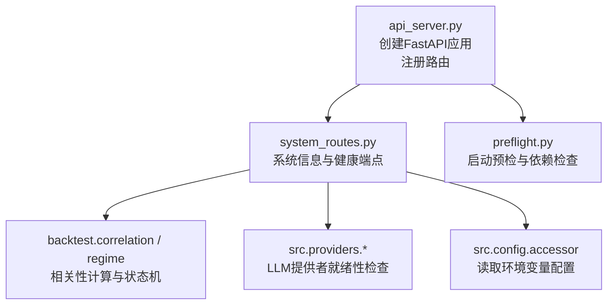
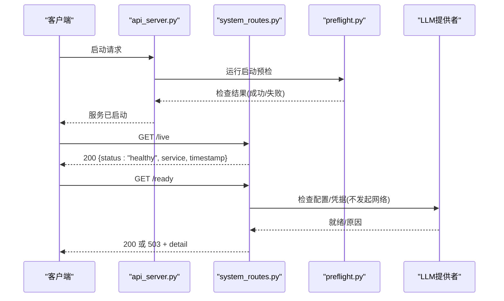
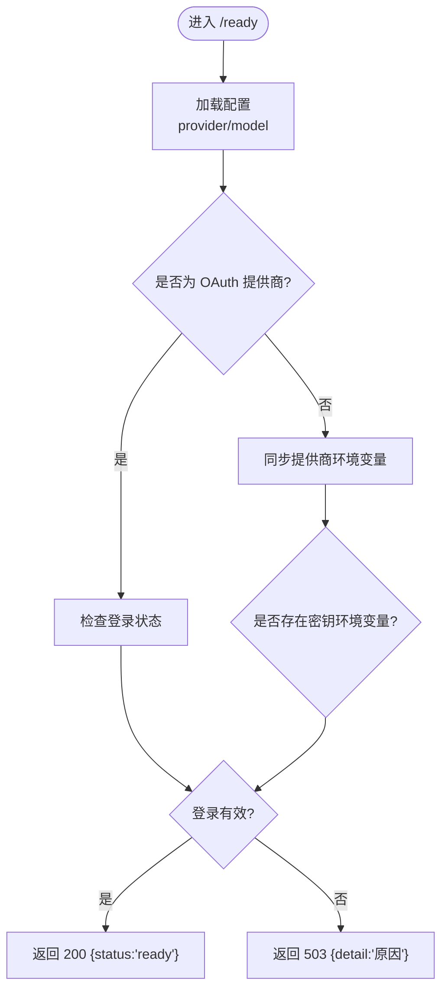
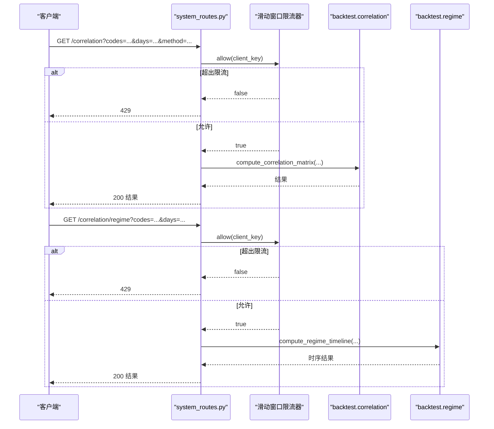
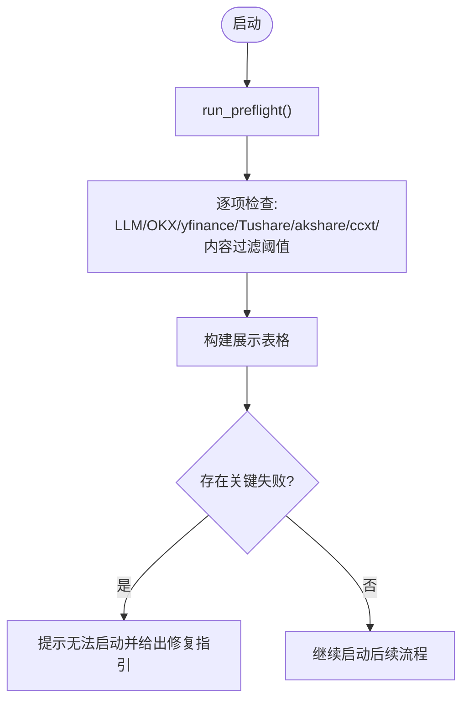
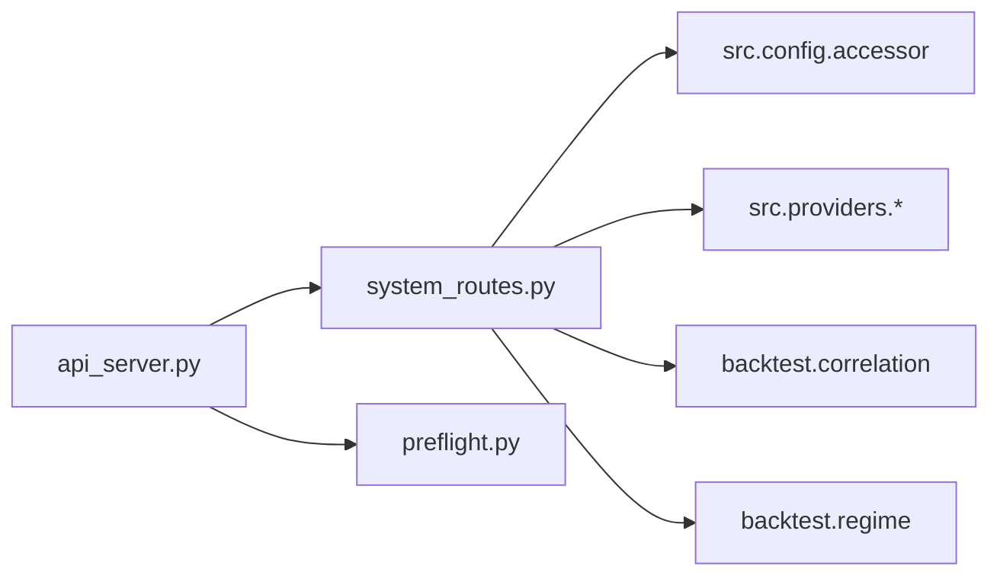

# 系统信息

<cite>
**本文引用的文件**
- [agent/src/api/system_routes.py](file://agent/src/api/system_routes.py)
- [agent/src/preflight.py](file://agent/src/preflight.py)
- [agent/api_server.py](file://agent/api_server.py)
- [agent/tests/test_system_routes.py](file://agent/tests/test_system_routes.py)
</cite>

## 目录
1. [简介](#简介)
2. [项目结构](#项目结构)
3. [核心组件](#核心组件)
4. [架构总览](#架构总览)
5. [详细组件分析](#详细组件分析)
6. [依赖关系分析](#依赖关系分析)
7. [性能与可用性考虑](#性能与可用性考虑)
8. [故障排查指南](#故障排查指南)
9. [结论](#结论)
10. [附录：端点清单与使用示例](#附录端点清单与使用示例)

## 简介
本文件面向 Vibe-Trading 系统的“系统信息”API，覆盖健康检查、版本信息、依赖检查与环境验证等能力，并说明系统状态监控、资源使用统计与服务发现相关实践。文档同时给出预检流程、依赖验证与兼容性检查的接口说明，提供系统诊断、故障排查与性能监控的使用示例，并补充集群部署中的节点发现与负载均衡配置建议。

## 项目结构
系统信息相关的功能主要由以下模块构成：
- 路由层：FastAPI 路由注册与端点实现（/live、/health、/ready、/api、/correlation、/correlation/regime、/system/shutdown、/skills、/openapi.json、/docs、/redoc）
- 启动预检：服务启动时执行环境、依赖与连通性检查
- API 服务器装配：创建 FastAPI 应用、挂载中间件、注册各模块路由，并在生命周期中运行预检

图表来源
- [agent/api_server.py:163-171](file://agent/api_server.py#L163-L171)
- [agent/src/api/system_routes.py:166-191](file://agent/src/api/system_routes.py#L166-L191)
- [agent/src/preflight.py:265-318](file://agent/src/preflight.py#L265-L318)

章节来源
- [agent/api_server.py:163-171](file://agent/api_server.py#L163-L171)
- [agent/src/api/system_routes.py:166-191](file://agent/src/api/system_routes.py#L166-L191)
- [agent/src/preflight.py:265-318](file://agent/src/preflight.py#L265-L318)

## 核心组件
- 健康探针
  - /live：进程级存活检查，无外部依赖，返回服务名与时间戳
  - /health：兼容旧监控的别名，行为同 /live
  - /ready：就绪检查，校验 LLM 提供商配置与凭据是否可用，未就绪返回 503
- 版本与元数据
  - /api：返回服务名、版本、文档入口与健康端点
- 相关性分析与状态机
  - /correlation：计算多资产收益率相关性矩阵（受认证与限流保护）
  - /correlation/regime：基于滚动相关性的市场状态时序（受认证与限流保护）
- 技能列表
  - /skills：列出已注册技能（需认证）
- 安全与运维
  - /system/shutdown：本地授权后优雅关闭进程
  - /openapi.json、/docs、/redoc：OpenAPI Schema 与交互式文档（受认证或开发模式限制）

章节来源
- [agent/src/api/system_routes.py:204-241](file://agent/src/api/system_routes.py#L204-L241)
- [agent/src/api/system_routes.py:243-329](file://agent/src/api/system_routes.py#L243-L329)
- [agent/src/api/system_routes.py:331-376](file://agent/src/api/system_routes.py#L331-L376)
- [agent/src/api/system_routes.py:392-437](file://agent/src/api/system_routes.py#L392-L437)

## 架构总览
系统信息API通过 api_server 组装 FastAPI 应用，并在启动生命周期中调用 preflight 进行环境与依赖检查；system_routes 暴露健康、就绪、版本、相关性分析与技能列表等端点，并通过内置限流器与认证机制保障稳定性与安全。

图表来源
- [agent/api_server.py:127-171](file://agent/api_server.py#L127-L171)
- [agent/src/api/system_routes.py:204-241](file://agent/src/api/system_routes.py#L204-L241)
- [agent/src/preflight.py:265-318](file://agent/src/preflight.py#L265-L318)

## 详细组件分析

### 健康与就绪检查
- /live：返回进程存活状态，适合容器编排的 liveness 探针
- /health：向后兼容别名，语义同 /live
- /ready：轻量级就绪检查，仅验证 LLM 提供商配置与凭据存在，避免网络开销与成本

图表来源
- [agent/src/api/system_routes.py:111-159](file://agent/src/api/system_routes.py#L111-L159)
- [agent/src/api/system_routes.py:226-241](file://agent/src/api/system_routes.py#L226-L241)

章节来源
- [agent/src/api/system_routes.py:204-241](file://agent/src/api/system_routes.py#L204-L241)

### 版本信息与元数据
- /api：返回服务名、版本、文档与健康端点路径，便于服务发现与集成

章节来源
- [agent/src/api/system_routes.py:368-376](file://agent/src/api/system_routes.py#L368-L376)

### 相关性分析与市场状态
- /correlation：输入资产代码列表与回看窗口，计算日收益率相关性矩阵；具备每客户端滑动窗口限流与认证保护
- /correlation/regime：在相同价格数据基础上，生成滚动相关性边缘密度与迟滞状态机的时序，用于风险上下文描述

图表来源
- [agent/src/api/system_routes.py:62-98](file://agent/src/api/system_routes.py#L62-L98)
- [agent/src/api/system_routes.py:243-329](file://agent/src/api/system_routes.py#L243-L329)

章节来源
- [agent/src/api/system_routes.py:243-329](file://agent/src/api/system_routes.py#L243-L329)

### 技能列表
- /skills：列出已注册技能名称与描述，用于能力发现与审计（需认证）

章节来源
- [agent/src/api/system_routes.py:350-366](file://agent/src/api/system_routes.py#L350-L366)

### 安全与运维
- /system/shutdown：仅在本地访问且通过授权后触发优雅关闭，返回关闭状态
- /openapi.json、/docs、/redoc：受认证或开发模式限制，防止敏感信息泄露

章节来源
- [agent/src/api/system_routes.py:331-348](file://agent/src/api/system_routes.py#L331-L348)
- [agent/src/api/system_routes.py:392-437](file://agent/src/api/system_routes.py#L392-L437)

### 启动预检与依赖验证
- 启动时运行预检：检查 LLM 提供商、OKX/yfinance/Tushare/akshare/ccxt 等依赖与连通性，输出可读表格并报告关键失败项
- 预检结果影响服务可用性：关键项失败将阻止代理正常运行

图表来源
- [agent/src/preflight.py:265-318](file://agent/src/preflight.py#L265-L318)

章节来源
- [agent/src/preflight.py:32-253](file://agent/src/preflight.py#L32-L253)
- [agent/src/preflight.py:265-318](file://agent/src/preflight.py#L265-L318)

## 依赖关系分析
- system_routes 依赖：
  - FastAPI 框架与 Pydantic 模型
  - src.config.accessor 获取环境变量配置
  - src.providers.* 进行 LLM 提供商就绪性检查
  - backtest.correlation / backtest.regime 进行相关性与时序计算
- api_server 负责：
  - 创建 FastAPI 实例并设置版本、文档开关
  - 注册 system_routes 及其他路由模块
  - 在 lifespan 中执行预检与调度任务

图表来源
- [agent/api_server.py:163-171](file://agent/api_server.py#L163-L171)
- [agent/src/api/system_routes.py:166-191](file://agent/src/api/system_routes.py#L166-L191)
- [agent/src/preflight.py:265-318](file://agent/src/preflight.py#L265-L318)

章节来源
- [agent/api_server.py:163-171](file://agent/api_server.py#L163-L171)
- [agent/src/api/system_routes.py:166-191](file://agent/src/api/system_routes.py#L166-L191)
- [agent/src/preflight.py:265-318](file://agent/src/preflight.py#L265-L318)

## 性能与可用性考虑
- 健康与就绪分离：/live 仅检查进程存活，/ready 做轻量配置校验，避免频繁网络调用
- 相关性接口限流：按客户端 IP 的滑动窗口限流，默认每分钟 30 次，防止重计算导致过载
- 错误屏蔽：非业务异常统一返回通用错误消息，避免泄露内部细节
- 文档访问控制：生产模式下 /docs 与 /redoc 不可见，Schema 仅对携带鉴权的调用开放

章节来源
- [agent/src/api/system_routes.py:62-98](file://agent/src/api/system_routes.py#L62-L98)
- [agent/src/api/system_routes.py:243-329](file://agent/src/api/system_routes.py#L243-L329)
- [agent/src/api/system_routes.py:392-437](file://agent/src/api/system_routes.py#L392-L437)

## 故障排查指南
- 就绪检查失败（/ready 返回 503）
  - 可能原因：未配置 provider/model、缺少凭据、OAuth 登录无效
  - 处理步骤：检查 .env 中的 LANGCHAIN_PROVIDER、LANGCHAIN_MODEL_NAME 与对应密钥；OAuth 提供商需完成登录
- 相关性接口被限流（429）
  - 现象：短时间内多次请求返回 429
  - 处理步骤：降低请求频率或合并请求；确认客户端 IP 唯一性
- 启动预检失败
  - 现象：启动日志显示关键项失败
  - 处理步骤：根据预检表格提示修复依赖或网络问题；确保 LLM 提供商可达
- 文档不可访问
  - 现象：/docs 与 /redoc 返回 404
  - 处理步骤：确认处于开发模式或未配置 API_KEY；生产模式应通过 /openapi.json 获取 Schema

章节来源
- [agent/src/api/system_routes.py:111-159](file://agent/src/api/system_routes.py#L111-L159)
- [agent/src/api/system_routes.py:243-329](file://agent/src/api/system_routes.py#L243-L329)
- [agent/src/preflight.py:265-318](file://agent/src/preflight.py#L265-L318)
- [agent/tests/test_system_routes.py:60-126](file://agent/tests/test_system_routes.py#L60-L126)

## 结论
Vibe-Trading 的系统信息API提供了完善的健康与就绪检查、版本元数据、相关性分析与技能发现能力，并通过限流与认证保障稳定性与安全性。启动预检帮助快速定位环境与依赖问题。结合容器编排的健康探针与负载均衡策略，可在集群环境中实现高可用的服务治理。

## 附录：端点清单与使用示例

- 健康与就绪
  - GET /live：返回 {status, service, timestamp}
  - GET /health：同 /live（兼容旧监控）
  - GET /ready：返回 200 或 503 + detail（provider/model/凭据校验）
- 版本与元数据
  - GET /api：返回 {service, version, docs, health}
- 相关性分析
  - GET /correlation?codes=AAPL,SPY&days=90&method=pearson：需认证；受限流保护
  - GET /correlation/regime?codes=AAPL,SPY&days=90&corr_window=60&edge_threshold=0.5&smooth_window=5&enter_threshold=0.65&exit_threshold=0.45：需认证；受限流保护
- 技能列表
  - GET /skills：需认证
- 运维
  - POST /system/shutdown：本地授权后优雅关闭
  - GET /openapi.json：需认证
  - GET /docs、GET /redoc：开发模式可访问，生产模式返回 404

使用示例（概念性）
- 健康检查：定期轮询 /live 判断进程存活
- 就绪检查：在流量接入前调用 /ready，若 503 则延迟接入
- 版本发现：调用 /api 获取版本与文档入口
- 相关性分析：构造 codes 与 days 参数，观察返回的相关矩阵
- 故障定位：若 /ready 失败，依据 detail 字段定位配置或凭据问题

章节来源
- [agent/src/api/system_routes.py:204-376](file://agent/src/api/system_routes.py#L204-L376)
- [agent/tests/test_system_routes.py:46-126](file://agent/tests/test_system_routes.py#L46-L126)