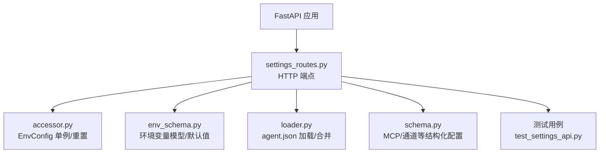
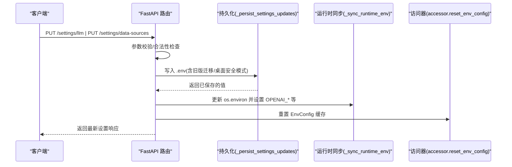
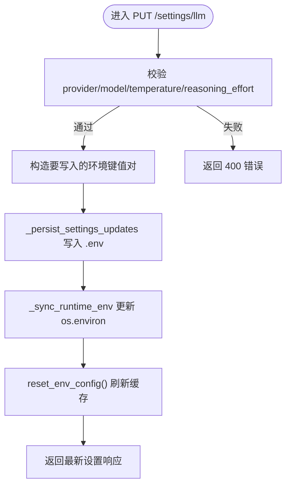
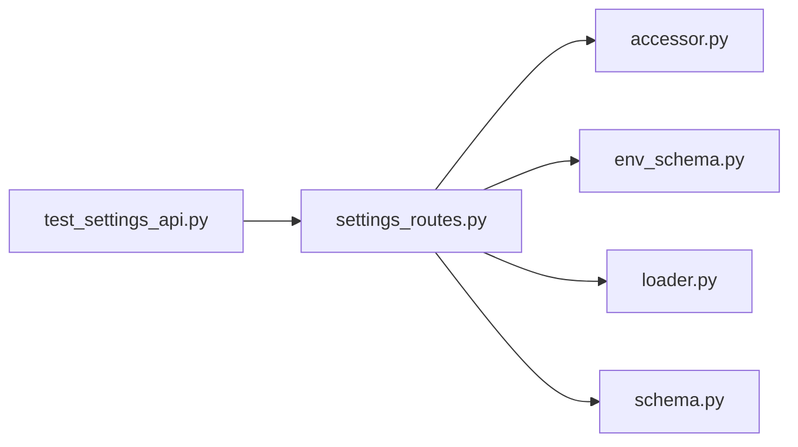

# 系统设置

<cite>
**本文引用的文件**
- [agent/src/api/settings_routes.py](file://agent/src/api/settings_routes.py)
- [agent/src/config/env_schema.py](file://agent/src/config/env_schema.py)
- [agent/src/config/accessor.py](file://agent/src/config/accessor.py)
- [agent/src/config/loader.py](file://agent/src/config/loader.py)
- [agent/src/config/schema.py](file://agent/src/config/schema.py)
- [agent/tests/test_settings_api.py](file://agent/tests/test_settings_api.py)
</cite>

## 目录
1. [简介](#简介)
2. [项目结构](#项目结构)
3. [核心组件](#核心组件)
4. [架构总览](#架构总览)
5. [详细组件分析](#详细组件分析)
6. [依赖关系分析](#依赖关系分析)
7. [性能与可靠性](#性能与可靠性)
8. [故障排查指南](#故障排查指南)
9. [结论](#结论)
10. [附录：API 参考与示例](#附录api-参考与示例)

## 简介
本文件为 Vibe-Trading 系统的“系统设置”API 提供完整文档，覆盖配置读取、更新、验证与重置能力；说明配置项的数据结构、验证规则与默认值；描述环境变量映射、配置文件格式与热重载机制；并提供设置备份、迁移与版本管理的实践建议；同时阐述敏感信息加密、配置审计与权限控制策略。

## 项目结构
设置相关代码主要位于以下模块：
- API 路由层：暴露 HTTP 端点用于读取/更新 LLM 和数据源设置
- 配置模型层：集中定义所有环境变量的类型、默认值与校验
- 配置访问层：提供线程安全的单例缓存与环境变量读取/重置
- 结构化配置加载：支持 JSON/YAML 的 agent.json 配置合并与覆盖
- 安全与迁移：桌面端密钥注入、原子写入、权限控制与旧版 .env 迁移

图表来源
- [agent/src/api/settings_routes.py:476-674](file://agent/src/api/settings_routes.py#L476-L674)
- [agent/src/config/accessor.py:52-92](file://agent/src/config/accessor.py#L52-L92)
- [agent/src/config/env_schema.py:545-577](file://agent/src/config/env_schema.py#L545-L577)
- [agent/src/config/loader.py:28-151](file://agent/src/config/loader.py#L28-L151)
- [agent/src/config/schema.py:301-513](file://agent/src/config/schema.py#L301-L513)

章节来源
- [agent/src/api/settings_routes.py:476-674](file://agent/src/api/settings_routes.py#L476-L674)
- [agent/src/config/env_schema.py:545-577](file://agent/src/config/env_schema.py#L545-L577)

## 核心组件
- 设置路由（settings_routes.py）
  - 提供 /settings/llm、/settings/data-sources、/settings/llm/models 等端点
  - 负责参数校验、持久化到 .env、运行时环境变量同步与响应构建
- 环境变量模型（env_schema.py）
  - 集中定义 LLM、数据源、API、Swarm、路径、OCR、记忆等分组的环境变量及默认值
- 配置访问器（accessor.py）
  - 提供 EnvConfig 单例与 reset_env_config，保证多线程安全与热重载生效
- 结构化配置加载（loader.py）
  - 从 agent.json/agent.yaml 加载并合并运行时覆盖，支持 MCP/通道等复杂配置
- 结构化配置模式（schema.py）
  - 定义 MCP 服务器、OAuth、通道等强类型结构与校验规则

章节来源
- [agent/src/api/settings_routes.py:31-153](file://agent/src/api/settings_routes.py#L31-L153)
- [agent/src/config/env_schema.py:122-577](file://agent/src/config/env_schema.py#L122-L577)
- [agent/src/config/accessor.py:52-92](file://agent/src/config/accessor.py#L52-L92)
- [agent/src/config/loader.py:28-151](file://agent/src/config/loader.py#L28-L151)
- [agent/src/config/schema.py:301-513](file://agent/src/config/schema.py#L301-L513)

## 架构总览
设置 API 的工作流包括：请求鉴权 → 参数校验 → 读取当前配置 → 持久化到 .env → 同步到进程环境变量 → 刷新配置缓存 → 返回最新状态。

图表来源
- [agent/src/api/settings_routes.py:434-466](file://agent/src/api/settings_routes.py#L434-L466)
- [agent/src/api/settings_routes.py:403-432](file://agent/src/api/settings_routes.py#L403-L432)
- [agent/src/config/accessor.py:79-92](file://agent/src/config/accessor.py#L79-L92)

## 详细组件分析

### 组件A：LLM 设置端点
- GET /settings/llm
  - 功能：读取当前 LLM 提供商、模型、基础 URL、温度、超时、重试、推理努力、SSE 超时、可用提供商列表等
  - 鉴权：需要本地或认证（由宿主挂载时决定）
  - 输出：不包含真实密钥，仅包含是否已配置标志与提示
- PUT /settings/llm
  - 功能：更新 LLM 设置并持久化到 .env，同时热更新运行时的环境变量
  - 校验：provider 必须存在；model_name 必填；temperature 范围限制；reasoning_effort 必须在允许集合中
  - 行为：根据 provider 的命名空间写入对应环境变量（如 DEEPSEEK_API_KEY、OPENROUTER_BASE_URL 等），必要时清理 OPENAI_API_KEY 或设置占位
- POST /settings/llm/models
  - 功能：在不持久化的情况下探测提供商模型列表，供前端下拉框使用
  - 行为：对 OAuth 提供商直接返回默认模型并标记警告；若未提供 api_key 且非可信 base_url，则不发送存储的密钥

图表来源
- [agent/src/api/settings_routes.py:506-587](file://agent/src/api/settings_routes.py#L506-L587)
- [agent/src/api/settings_routes.py:434-466](file://agent/src/api/settings_routes.py#L434-L466)
- [agent/src/api/settings_routes.py:403-432](file://agent/src/api/settings_routes.py#L403-L432)

章节来源
- [agent/src/api/settings_routes.py:31-153](file://agent/src/api/settings_routes.py#L31-L153)
- [agent/src/api/settings_routes.py:497-633](file://agent/src/api/settings_routes.py#L497-L633)

### 组件B：数据源设置端点
- GET /settings/data-sources
  - 功能：读取 Tushare Token 配置状态、BaoStock 支持与安装情况、.env 路径
- PUT /settings/data-sources
  - 功能：更新 Tushare Token，并同步到运行时的 TUSHARE_TOKEN 环境变量
  - 行为：支持清空 token；仅在有效时写入并刷新配置缓存

章节来源
- [agent/src/api/settings_routes.py:635-674](file://agent/src/api/settings_routes.py#L635-L674)

### 组件C：环境变量与默认值
- 集中式模型：EnvConfig 及其子模型（LLM、Data、API、Swarm、AgentTuning、Path、OCR、Memory）
- 字段来源：每个字段通过 alias 绑定到 UPPER_SNAKE_CASE 环境变量名，缺失时回退到默认值
- 布尔解析：统一按 “1/true/yes/on” 视为真，其余为假
- 兼容处理：部分字段提供历史别名或迁移逻辑（例如 OCR 模型字段）

章节来源
- [agent/src/config/env_schema.py:122-577](file://agent/src/config/env_schema.py#L122-L577)

### 组件D：配置加载与合并
- 结构化配置：支持 agent.json/agent.yaml，按优先级加载并合并运行时覆盖
- 安全过滤：会话级覆盖会剥离 mcpServers/mcp_servers 等受限键，除非显式开启 ALLOW_SESSION_MCP_SERVERS
- 传输选择：stdio/sse/streamableHttp 三种传输，自动推断并校验冲突字段
- 实时 broker 保护：禁止对 live broker 使用通配 enabled_tools=["*"]，仅允许特定只读探测场景

章节来源
- [agent/src/config/loader.py:28-151](file://agent/src/config/loader.py#L28-L151)
- [agent/src/config/schema.py:349-493](file://agent/src/config/schema.py#L349-L493)

### 组件E：热重载机制
- 写盘后调用 reset_env_config() 清除 EnvConfig 缓存，使后续读取立即反映新值
- 同时更新 os.environ 中的关键键（如 OPENAI_API_KEY、OPENAI_API_BASE、OPENAI_BASE_URL、TUSHARE_TOKEN），确保运行时代码无需重启即可生效

章节来源
- [agent/src/config/accessor.py:79-92](file://agent/src/config/accessor.py#L79-L92)
- [agent/src/api/settings_routes.py:403-432](file://agent/src/api/settings_routes.py#L403-L432)

## 依赖关系分析
- settings_routes.py 依赖：
  - accessor.get_env_value/reset_env_config：读取/重置环境变量缓存
  - env_schema.EnvConfig：集中环境变量模型与默认值
  - loader.load_agent_config/merge_agent_config_overrides：结构化配置加载与合并
  - schema.MCPServerConfig/MCPOAuthConfig：MCP 服务器与 OAuth 配置校验
- 测试驱动：
  - test_settings_api.py 覆盖了读取隐藏占位符、模型发现警告码、写入迁移、权限控制、原子写入等场景

图表来源
- [agent/src/api/settings_routes.py:476-674](file://agent/src/api/settings_routes.py#L476-L674)
- [agent/src/config/accessor.py:52-92](file://agent/src/config/accessor.py#L52-L92)
- [agent/src/config/env_schema.py:545-577](file://agent/src/config/env_schema.py#L545-L577)
- [agent/src/config/loader.py:28-151](file://agent/src/config/loader.py#L28-L151)
- [agent/src/config/schema.py:301-513](file://agent/src/config/schema.py#L301-L513)
- [agent/tests/test_settings_api.py:15-634](file://agent/tests/test_settings_api.py#L15-L634)

章节来源
- [agent/tests/test_settings_api.py:15-634](file://agent/tests/test_settings_api.py#L15-L634)

## 性能与可靠性
- 原子写入：使用临时文件 + replace 的方式避免并发写入导致损坏，并在失败时保持原文件完整
- 权限控制：写入 .env 时使用严格权限（0600），防止其他用户读取
- 桌面安全模式：当启用 VIBE_TRADING_DESKTOP_SECURE_CREDENTIALS=1 时，已知密钥不会持久化到 .env，而是保留在进程环境中
- 远程访问限制：开发模式下拒绝远端客户端读写设置，避免误用
- 配置缓存：EnvConfig 单例减少重复解析开销，并通过 reset_env_config 实现热重载

章节来源
- [agent/tests/test_settings_api.py:571-634](file://agent/tests/test_settings_api.py#L571-L634)
- [agent/src/api/settings_routes.py:452-466](file://agent/src/api/settings_routes.py#L452-L466)
- [agent/src/config/accessor.py:52-92](file://agent/src/config/accessor.py#L52-L92)

## 故障排查指南
- 无法保存设置（503）
  - 原因：目标 .env 不可写或权限不足
  - 解决：检查 ~/.vibe-trading/.env 的所有者与权限，确保可写
- 远端客户端被拒绝（403）
  - 原因：开发模式下仅允许本地回环地址访问设置端点
  - 解决：从本机或通过受信任代理访问
- 未认证访问（401）
  - 原因：当配置了 API_AUTH_KEY 时，即使本地也需要携带 Authorization: Bearer <key>
  - 解决：在请求头中添加正确的 Bearer 令牌
- 模型发现失败
  - 现象：返回 warning_code 指示 oauth_discovery_unsupported、api_key_required、model_list_unavailable
  - 解决：按提示补充 api_key 或调整 base_url；OAuth 提供商不支持在线发现

章节来源
- [agent/src/api/settings_routes.py:517-541](file://agent/src/api/settings_routes.py#L517-L541)
- [agent/src/api/settings_routes.py:594-633](file://agent/src/api/settings_routes.py#L594-L633)
- [agent/tests/test_settings_api.py:353-377](file://agent/tests/test_settings_api.py#L353-L377)
- [agent/tests/test_settings_api.py:447-513](file://agent/tests/test_settings_api.py#L447-L513)

## 结论
Vibe-Trading 的设置 API 提供了安全、可靠且易于使用的配置管理能力。通过集中式环境变量模型、严格的参数校验、原子写入与权限控制、以及热重载机制，既保证了生产环境的稳定性，也提升了运维效率。结合结构化 agent.json 配置与 MCP/通道等高级特性，系统具备强大的可扩展性与安全性。

## 附录：API 参考与示例

### 端点清单
- GET /settings/llm
  - 鉴权：require_local_or_auth
  - 响应：包含 provider、model_name、base_url、api_key_env、api_key_configured、api_key_hint、api_key_required、temperature、timeout_seconds、max_retries、reasoning_effort、sse_timeout_seconds、env_path、providers
- PUT /settings/llm
  - 鉴权：require_settings_write_auth
  - 请求体：provider、model_name、base_url（可选）、api_key（可选）、clear_api_key（可选）、temperature、timeout_seconds、max_retries、reasoning_effort（可选）
  - 行为：校验参数、写入 .env、同步运行时环境变量、刷新缓存、返回最新设置
- POST /settings/llm/models
  - 鉴权：require_settings_write_auth
  - 请求体：provider、base_url（可选）、api_key（可选）
  - 行为：尝试在线发现模型列表，失败时回退到默认模型并返回 warning_code
- GET /settings/data-sources
  - 鉴权：require_local_or_auth
  - 响应：tushare_token_configured、tushare_token_hint、baostock_supported、baostock_installed、baostock_message、env_path
- PUT /settings/data-sources
  - 鉴权：require_settings_write_auth
  - 请求体：tushare_token（可选）、clear_tushare_token（可选）
  - 行为：更新 TUSHARE_TOKEN 并同步到运行时

章节来源
- [agent/src/api/settings_routes.py:497-674](file://agent/src/api/settings_routes.py#L497-L674)

### 环境变量映射（节选）
- LLM
  - LANGCHAIN_PROVIDER、LANGCHAIN_MODEL_NAME、LANGCHAIN_TEMPERATURE、TIMEOUT_SECONDS、MAX_RETRIES、LANGCHAIN_REASONING_EFFORT、OPENAI_CODEX_BASE_URL、VIBE_TRADING_DISABLE_HTTP_PROXY
- 数据源
  - TUSHARE_TOKEN、CCXT_EXCHANGE、FINNHUB_API_KEY、ALPHAVANTAGE_API_KEY、TIINGO_API_KEY、FMP_API_KEY、FRED_API_KEY、QVERIS_API_KEY、QVERIS_BASE_URL、RSSHUB_BASE_URL、DASHSCOPE_API_KEY、LONGBRIDGE_APP_KEY/SECRET/TOKEN、ETORO_API_KEY/USER_KEY
- API 与安全
  - API_AUTH_KEY、VIBE_TRADING_API_KEY、CORS_ORIGINS、VIBE_TRADING_EXTRA_CORS_ORIGINS、API_ALLOWED_HOSTS、VIBE_TRADING_MCP_ALLOWED_HOSTS、ENABLE_SESSION_RUNTIME、VIBE_TRADING_TRUST_DOCKER_LOOPBACK、VIBE_TRADING_CSP_REPORT_ONLY、VIBE_TRADING_ENABLE_SHELL_TOOLS、VIBE_TRADING_ALLOWED_FILE_ROOTS/WRITE_ROOTS/RUN_ROOTS、VIBE_TRADING_API_URL、FUTU_TRADE_PWD_MD5
- Swarm/Agent Tuning/路径/OCR/记忆
  - 详见 env_schema 各子模型字段

章节来源
- [agent/src/config/env_schema.py:122-577](file://agent/src/config/env_schema.py#L122-L577)

### 配置文件格式与位置
- .env（项目级）：存放 LLM 与数据源凭证等键值对；写入采用原子替换与 0600 权限
- agent.json/agent.yaml（结构化配置）：承载 MCP 服务器、通道等复杂配置；支持运行时覆盖合并
- 桌面安全模式：当 VIBE_TRADING_DESKTOP_SECURE_CREDENTIALS=1 时，已知密钥不写入 .env，仅保存在进程环境

章节来源
- [agent/src/api/settings_routes.py:434-466](file://agent/src/api/settings_routes.py#L434-L466)
- [agent/src/config/loader.py:28-151](file://agent/src/config/loader.py#L28-L151)

### 热重载机制
- 写盘后调用 reset_env_config() 清除缓存，随后读取将获取最新值
- 同时更新 os.environ 中的关键键，确保运行时代码即时生效

章节来源
- [agent/src/config/accessor.py:79-92](file://agent/src/config/accessor.py#L79-L92)
- [agent/src/api/settings_routes.py:403-432](file://agent/src/api/settings_routes.py#L403-L432)

### 敏感信息加密、配置审计与权限控制
- 敏感信息
  - 桌面安全模式：不将注入的密钥持久化到 .env
  - 响应脱敏：不返回真实密钥，仅提供是否已配置标志
- 权限控制
  - 读取端点：require_local_or_auth（本地或带 Bearer 令牌）
  - 写入端点：require_settings_write_auth（更严格的写权限）
  - 开发模式：拒绝远端客户端访问设置端点
- 审计建议
  - 记录每次设置变更的请求来源、时间戳、变更字段摘要（不含敏感值）
  - 对写操作进行告警与审批流程集成

章节来源
- [agent/src/api/settings_routes.py:476-674](file://agent/src/api/settings_routes.py#L476-L674)
- [agent/tests/test_settings_api.py:447-513](file://agent/tests/test_settings_api.py#L447-L513)

### 设置备份、迁移与版本管理（实践建议）
- 备份
  - 定期备份 .env 与 agent.json/agent.yaml，建议使用版本控制系统或对象存储
  - 备份前确保无正在进行的写入（可通过服务停机窗口或锁机制）
- 迁移
  - 旧版 .env 迁移：写入时会合并旧版 .env 内容到新的规范路径
  - 结构化配置迁移：逐步将散落的键值迁移至 agent.json，利用 loader 的合并能力平滑过渡
- 版本管理
  - 为 .env 与 agent.json 建立变更日志，记录每次修改的原因与影响
  - 使用灰度发布与回滚策略，先在小范围验证再全量推广

章节来源
- [agent/src/api/settings_routes.py:446-466](file://agent/src/api/settings_routes.py#L446-L466)
- [agent/src/config/loader.py:28-151](file://agent/src/config/loader.py#L28-L151)