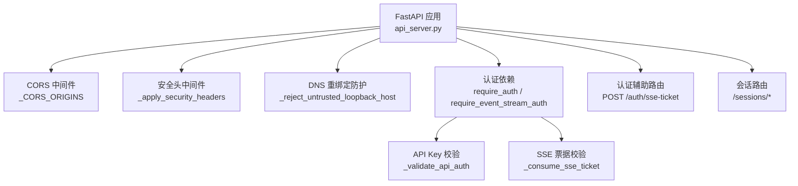
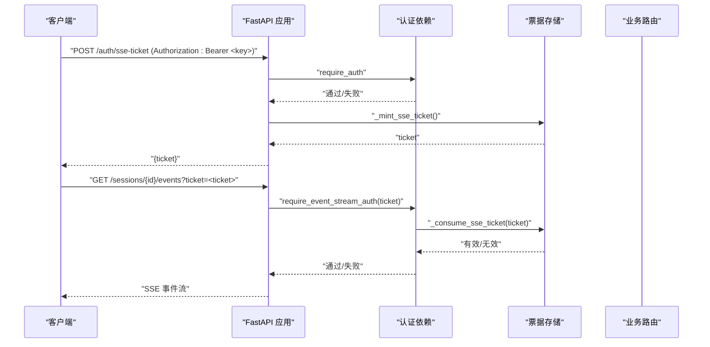
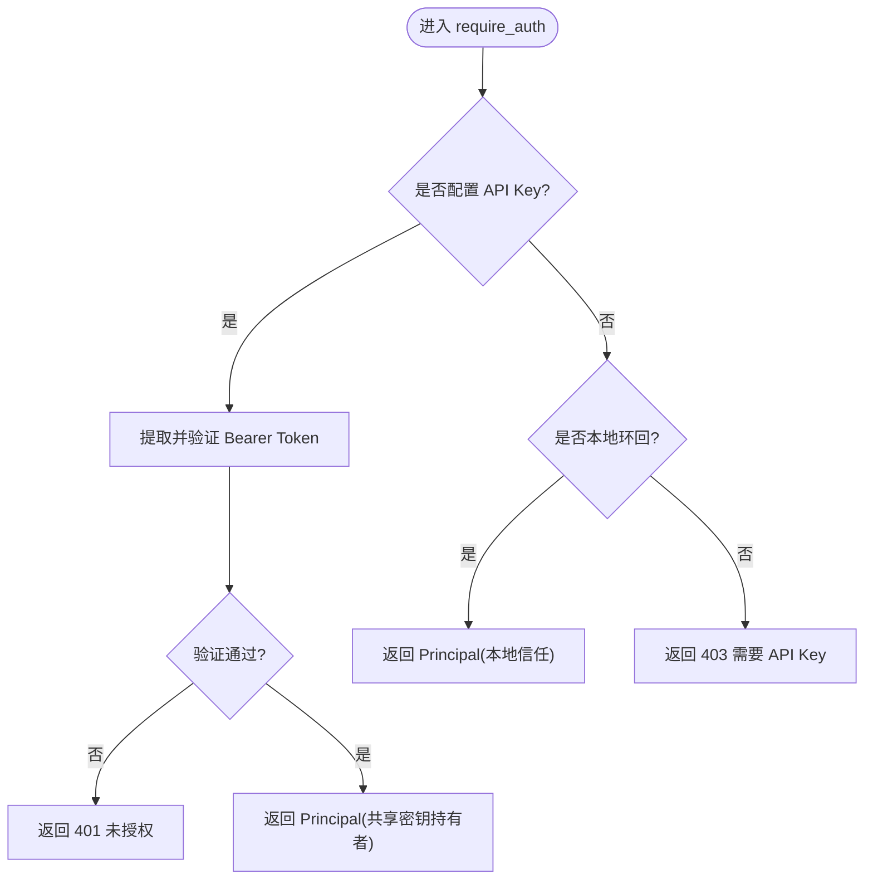
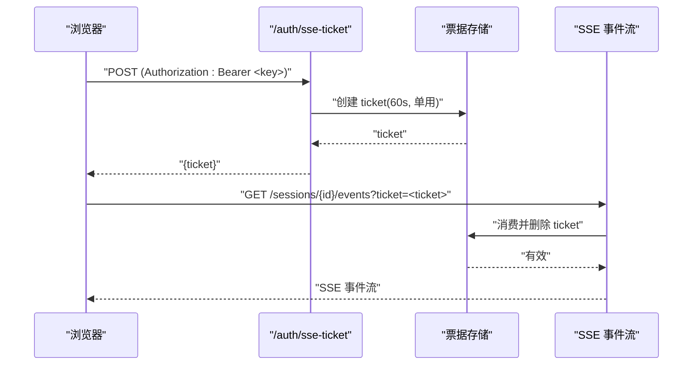
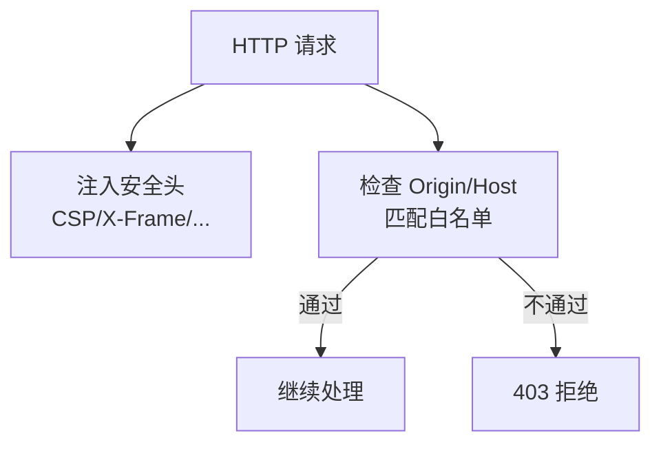
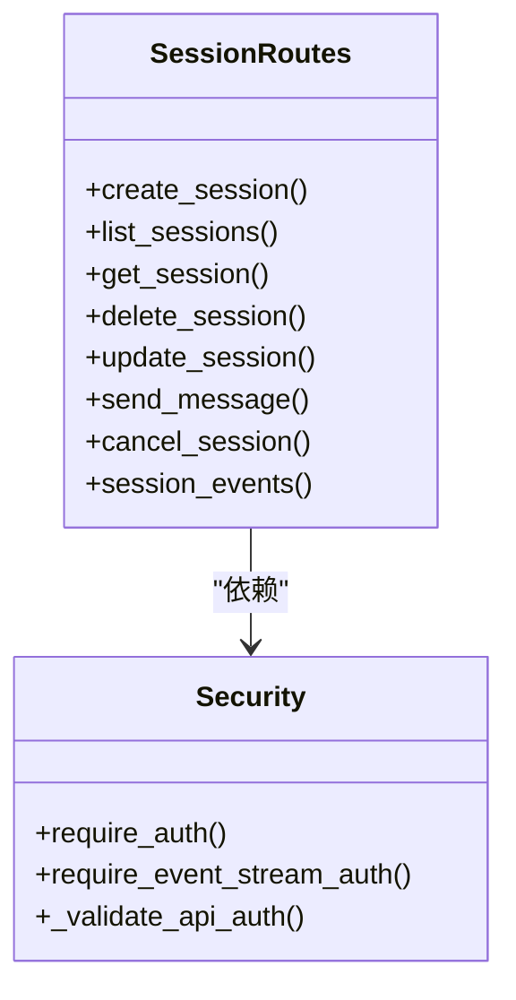
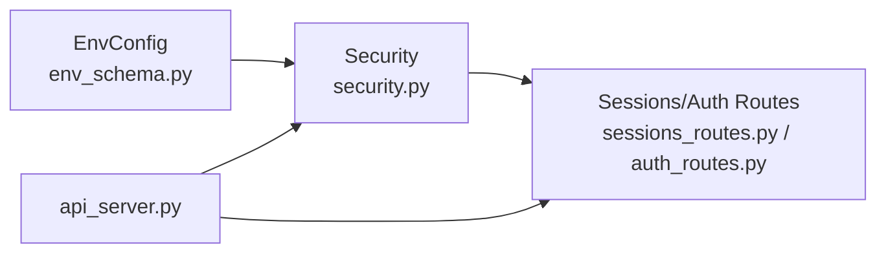

# 认证与授权

<cite>
**本文引用的文件**
- [agent/src/api/security.py](file://agent/src/api/security.py)
- [agent/src/api/auth_routes.py](file://agent/src/api/auth_routes.py)
- [agent/src/api/sessions_routes.py](file://agent/src/api/sessions_routes.py)
- [agent/src/session/models.py](file://agent/src/session/models.py)
- [agent/src/config/env_schema.py](file://agent/src/config/env_schema.py)
- [agent/src/config/accessor.py](file://agent/src/config/accessor.py)
- [agent/api_server.py](file://agent/api_server.py)
- [agent/tests/test_security_auth_api.py](file://agent/tests/test_security_auth_api.py)
</cite>

## 目录
1. [简介](#简介)
2. [项目结构](#项目结构)
3. [核心组件](#核心组件)
4. [架构总览](#架构总览)
5. [详细组件分析](#详细组件分析)
6. [依赖关系分析](#依赖关系分析)
7. [性能与安全考量](#性能与安全考量)
8. [故障排查指南](#故障排查指南)
9. [结论](#结论)
10. [附录：客户端集成示例](#附录客户端集成示例)

## 简介
本文件面向 Vibe-Trading API 的认证与授权体系，系统性说明以下主题：
- API 密钥管理（来源、校验、回退策略）
- 会话认证机制（SSE 票据、浏览器 EventSource 安全流程）
- 权限控制策略（本地开发信任、跨站请求防护、敏感操作保护）
- 访问控制列表（受保护的端点与鉴权要求）
- 认证端点的请求/响应格式与错误处理
- API 密钥生成、轮换与安全存储最佳实践
- 客户端集成示例（Bearer Token、API Key 等）
- 安全头部设置、CORS 配置与速率限制策略建议

## 项目结构
认证相关代码主要分布在以下模块：
- 安全中间件与鉴权依赖：security.py
- 认证辅助路由（SSE 票据）：auth_routes.py
- 会话路由（使用鉴权依赖）：sessions_routes.py
- 会话模型（主体 Principal、认证方法枚举）：session/models.py
- 环境变量与配置解析：config/env_schema.py、config/accessor.py
- 应用装配（CORS、安全头、中间件挂载）：api_server.py
- 安全回归测试：tests/test_security_auth_api.py

图表来源
- [agent/api_server.py:163-182](file://agent/api_server.py#L163-L182)
- [agent/src/api/security.py:166-253](file://agent/src/api/security.py#L166-L253)
- [agent/src/api/security.py:343-622](file://agent/src/api/security.py#L343-L622)
- [agent/src/api/auth_routes.py:21-56](file://agent/src/api/auth_routes.py#L21-L56)
- [agent/src/api/sessions_routes.py:335-800](file://agent/src/api/sessions_routes.py#L335-L800)

章节来源
- [agent/api_server.py:163-182](file://agent/api_server.py#L163-L182)
- [agent/src/api/security.py:166-253](file://agent/src/api/security.py#L166-L253)

## 核心组件
- 认证依赖与策略
  - require_auth：对敏感接口进行 Bearer Token 校验；当未配置 API Key 时允许本地环回调用。
  - require_event_stream_auth：支持 SSE 流式连接，优先接受 Bearer Token，否则接受一次性 ticket。
  - require_local_or_auth、require_settings_write_auth：针对设置写入与读取的额外保护。
- API 密钥来源与校验
  - 通过配置层读取 API_AUTH_KEY 或兼容别名 VIBE_TRADING_API_KEY。
  - 使用恒定时间比较 hmac.compare_digest 防止时序攻击。
- 浏览器事件流安全
  - POST /auth/sse-ticket 在已认证前提下签发一次性 ticket（约 60 秒），用于 EventSource 查询参数传递，避免将长生命周期密钥放入 URL。
- 安全头与 CORS
  - 默认启用严格 CSP、X-Content-Type-Options、X-Frame-Options、Permissions-Policy、Referrer-Policy。
  - CORS 白名单包含本地开发地址，并支持追加额外可信来源。
- DNS 重绑定防护
  - 拒绝来自本地客户端但 Host 不信任的请求，防止 DNS 劫持绕过。

章节来源
- [agent/src/api/security.py:343-622](file://agent/src/api/security.py#L343-L622)
- [agent/src/api/auth_routes.py:21-56](file://agent/src/api/auth_routes.py#L21-L56)
- [agent/src/config/env_schema.py:245-295](file://agent/src/config/env_schema.py#L245-L295)
- [agent/src/config/env_schema.py:565-577](file://agent/src/config/env_schema.py#L565-L577)
- [agent/src/api/security.py:166-253](file://agent/src/api/security.py#L166-L253)

## 架构总览
下图展示从客户端到服务端的关键鉴权路径：浏览器通过 Bearer Token 获取短期 ticket，再使用 ticket 打开 SSE；非浏览器客户端直接使用 Bearer Token。所有敏感接口均受 require_auth 保护。

图表来源
- [agent/src/api/auth_routes.py:21-56](file://agent/src/api/auth_routes.py#L21-L56)
- [agent/src/api/security.py:318-340](file://agent/src/api/security.py#L318-L340)
- [agent/src/api/security.py:591-622](file://agent/src/api/security.py#L591-L622)
- [agent/src/api/sessions_routes.py:752-800](file://agent/src/api/sessions_routes.py#L752-L800)

## 详细组件分析

### 认证依赖与策略
- require_auth
  - 作用：校验 Bearer Token；若未配置 API Key，则允许本地环回调用。
  - 返回：Principal（含 subject、auth_method、attributable）。
- require_event_stream_auth
  - 作用：支持 SSE 流式连接；优先 Bearer Token，其次一次性 ticket。
  - 注意：禁止将长生命周期密钥放入查询参数。
- require_local_or_auth、require_settings_write_auth
  - 作用：保护设置读取/写入；当配置了 API Key 时必须提供凭证。

图表来源
- [agent/src/api/security.py:463-504](file://agent/src/api/security.py#L463-L504)
- [agent/src/api/security.py:571-588](file://agent/src/api/security.py#L571-L588)

章节来源
- [agent/src/api/security.py:463-504](file://agent/src/api/security.py#L463-L504)
- [agent/src/api/security.py:571-588](file://agent/src/api/security.py#L571-L588)
- [agent/src/session/models.py:16-37](file://agent/src/session/models.py#L16-L37)
- [agent/src/session/models.py:40-78](file://agent/src/session/models.py#L40-L78)

### SSE 票据机制
- 签发：POST /auth/sse-ticket，需先通过 require_auth。
- 有效期：约 60 秒，单用即失效。
- 消费：require_event_stream_auth 中 _consume_sse_ticket 会删除票据，防重放。
- 日志脱敏：访问日志中对 api_key= 和 ticket= 的值进行脱敏。

图表来源
- [agent/src/api/auth_routes.py:21-56](file://agent/src/api/auth_routes.py#L21-L56)
- [agent/src/api/security.py:303-340](file://agent/src/api/security.py#L303-L340)
- [agent/src/api/security.py:260-297](file://agent/src/api/security.py#L260-L297)

章节来源
- [agent/src/api/auth_routes.py:21-56](file://agent/src/api/auth_routes.py#L21-L56)
- [agent/src/api/security.py:303-340](file://agent/src/api/security.py#L303-L340)
- [agent/src/api/security.py:260-297](file://agent/src/api/security.py#L260-L297)

### 安全头与 CORS
- 安全头：CSP（严格模式，文档页放宽）、X-Content-Type-Options、X-Frame-Options、Permissions-Policy、Referrer-Policy。
- CORS：默认允许本地开发地址；可通过环境变量追加额外可信来源；禁止 credentialed CORS 使用通配符。
- DNS 重绑定：拒绝本地客户端但 Host 不信任的请求。

图表来源
- [agent/src/api/security.py:180-253](file://agent/src/api/security.py#L180-L253)
- [agent/src/api/security.py:69-103](file://agent/src/api/security.py#L69-L103)
- [agent/src/api/security.py:166-173](file://agent/src/api/security.py#L166-L173)

章节来源
- [agent/src/api/security.py:180-253](file://agent/src/api/security.py#L180-L253)
- [agent/src/api/security.py:69-103](file://agent/src/api/security.py#L69-L103)
- [agent/src/api/security.py:166-173](file://agent/src/api/security.py#L166-L173)

### 受保护端点与访问控制列表
- 会话管理
  - POST /sessions：创建会话，需 require_auth。
  - GET /sessions：列出会话，需 require_auth。
  - GET /sessions/{id}：获取会话，需 require_auth。
  - DELETE /sessions/{id}：删除会话，需 require_auth。
  - PATCH /sessions/{id}：更新会话，需 require_auth。
  - POST /sessions/{id}/messages：发送消息，需 require_auth。
  - POST /sessions/{id}/cancel：取消运行，需 require_auth。
  - GET /sessions/{id}/events：SSE 事件流，需 require_event_stream_auth。
- 目标（Goal）管理
  - POST /sessions/{id}/goal：创建/替换目标，需 require_auth。
  - GET /sessions/{id}/goal：获取当前目标快照，需 require_auth。
  - PATCH /sessions/{id}/goal：编辑目标，需 require_auth。
  - POST /sessions/{id}/goal/evidence：追加证据，需 require_auth。
  - PATCH /sessions/{id}/goal/status：更新状态，需 require_auth。

图表来源
- [agent/src/api/sessions_routes.py:335-800](file://agent/src/api/sessions_routes.py#L335-L800)
- [agent/src/api/security.py:571-622](file://agent/src/api/security.py#L571-L622)

章节来源
- [agent/src/api/sessions_routes.py:335-800](file://agent/src/api/sessions_routes.py#L335-L800)

### 错误处理
- 401 未授权：缺少或无效的 API Key/Bearer Token。
- 403 禁止：跨站请求被拒、未配置 API Key 的非本地访问、DNS 重绑定防护触发。
- 404 未找到：会话不存在。
- 409 冲突：会话忙或目标状态冲突。
- 501 未实现：会话运行时未启用。
- 502/500：内部错误或上游服务失败。

章节来源
- [agent/src/api/sessions_routes.py:335-800](file://agent/src/api/sessions_routes.py#L335-L800)
- [agent/src/api/security.py:423-504](file://agent/src/api/security.py#L423-L504)

## 依赖关系分析
- 配置层
  - EnvConfig 集中定义环境变量及默认值，包括 API_AUTH_KEY、CORS_ORIGINS、VIBE_TRADING_EXTRA_CORS_ORIGINS、API_ALLOWED_HOSTS、VIBE_TRADING_TRUST_DOCKER_LOOPBACK、VIBE_TRADING_ENABLE_SHELL_TOOLS 等。
  - accessor.get_env_config 提供线程安全的单例访问。
- 安全层
  - security.py 依赖配置层读取 API Key、CORS、Host 白名单等。
  - 中间件顺序：CORS -> DNS 重绑定防护 -> SPA 深链回退 -> 安全头。
- 路由层
  - sessions_routes.py 通过 FastAPI Depends 注入 require_auth / require_event_stream_auth。
  - auth_routes.py 注册 /auth/sse-ticket，依赖 require_auth 保护票据签发。

图表来源
- [agent/src/config/env_schema.py:245-295](file://agent/src/config/env_schema.py#L245-L295)
- [agent/src/config/accessor.py:52-76](file://agent/src/config/accessor.py#L52-L76)
- [agent/src/api/security.py:343-622](file://agent/src/api/security.py#L343-L622)
- [agent/api_server.py:163-182](file://agent/api_server.py#L163-L182)

章节来源
- [agent/src/config/env_schema.py:245-295](file://agent/src/config/env_schema.py#L245-L295)
- [agent/src/config/accessor.py:52-76](file://agent/src/config/accessor.py#L52-L76)
- [agent/src/api/security.py:343-622](file://agent/src/api/security.py#L343-L622)
- [agent/api_server.py:163-182](file://agent/api_server.py#L163-L182)

## 性能与安全考量
- 性能
  - 票据存储为内存字典，定期清理过期票据，避免无限增长。
  - 使用恒定时间比较 hmac.compare_digest，避免时序侧信道。
  - 安全头与 CORS 计算轻量，适合高吞吐场景。
- 安全
  - 禁止 credentialed CORS 使用通配符，降低跨站风险。
  - 本地开发信任仅在未配置 API Key 时生效；一旦配置 Key，所有客户端均需认证。
  - 访问日志对 api_key= 与 ticket= 值进行脱敏，防止泄露。
  - 建议在生产环境由反向代理统一终止 TLS 并设置 HSTS。

[本节为通用指导，无需特定文件引用]

## 故障排查指南
- 常见问题
  - 401 未授权：检查 Authorization 头是否正确携带 Bearer Token；确认 API Key 已正确配置。
  - 403 禁止：检查 Origin/Host 是否在白名单；确认未触发 DNS 重绑定防护；确认跨站请求被拒。
  - SSE 连接失败：确认已通过 /auth/sse-ticket 获取 ticket；确保 ticket 未被重复使用或过期。
  - 501 未实现：确认会话运行时已启用（ENABLE_SESSION_RUNTIME）。
- 定位步骤
  - 查看访问日志（已脱敏）确认请求路径与参数。
  - 检查环境变量与配置（API_AUTH_KEY、CORS_ORIGINS、API_ALLOWED_HOSTS 等）。
  - 使用测试用例思路模拟本地/远程客户端行为进行复现。

章节来源
- [agent/tests/test_security_auth_api.py:43-195](file://agent/tests/test_security_auth_api.py#L43-L195)
- [agent/src/api/security.py:260-297](file://agent/src/api/security.py#L260-L297)

## 结论
Vibe-Trading 的认证与授权体系以“密钥优先、本地开发信任为辅”为核心原则，结合严格的浏览器安全策略（CSP、CORS、跨站防护）与 SSE 票据机制，既保障了安全性，又兼顾了前端集成的便利性。生产部署应始终配置 API Key，并通过反向代理管理 TLS 与 HSTS。

[本节为总结性内容，无需特定文件引用]

## 附录：客户端集成示例

### 使用 Bearer Token 访问敏感接口
- 适用场景：后端服务或脚本直接调用 API。
- 步骤：
  - 设置环境变量 API_AUTH_KEY（或兼容别名 VIBE_TRADING_API_KEY）。
  - 在请求头中添加 Authorization: Bearer <key>。
  - 调用任意受保护端点（如 /sessions、/runs）。

参考路径
- [agent/src/api/security.py:571-588](file://agent/src/api/security.py#L571-L588)
- [agent/src/config/env_schema.py:245-295](file://agent/src/config/env_schema.py#L245-L295)
- [agent/src/config/env_schema.py:565-577](file://agent/src/config/env_schema.py#L565-L577)

### 浏览器使用 EventSource 的认证流程
- 适用场景：前端通过 EventSource 订阅 SSE 事件。
- 步骤：
  - 先调用 POST /auth/sse-ticket，携带 Authorization: Bearer <key>，获取 ticket。
  - 使用 ticket 作为查询参数打开 SSE 流：GET /sessions/{id}/events?ticket=<ticket>。
  - 不要将长生命周期密钥放入 URL。

参考路径
- [agent/src/api/auth_routes.py:21-56](file://agent/src/api/auth_routes.py#L21-L56)
- [agent/src/api/security.py:303-340](file://agent/src/api/security.py#L303-L340)
- [agent/src/api/security.py:591-622](file://agent/src/api/security.py#L591-L622)

### 使用 API Key 作为查询参数（谨慎）
- 部分鉴权路径允许从查询参数读取 API Key（例如某些只读场景），但强烈不建议在浏览器中使用，以免泄露至历史记录与日志。
- 推荐优先使用 Authorization 头。

参考路径
- [agent/src/api/security.py:369-380](file://agent/src/api/security.py#L369-L380)

### 安全头部与 CORS 配置
- 安全头：自动注入 CSP、X-Content-Type-Options、X-Frame-Options、Permissions-Policy、Referrer-Policy。
- CORS：默认允许本地开发地址；可通过环境变量追加额外可信来源；禁止 credentialed CORS 使用通配符。
- 建议：在生产环境由反向代理设置 HSTS，并确保仅 HTTPS 暴露。

参考路径
- [agent/src/api/security.py:180-253](file://agent/src/api/security.py#L180-L253)
- [agent/src/api/security.py:69-103](file://agent/src/api/security.py#L69-L103)

### 速率限制策略（建议）
- 当前仓库未内置统一的速率限制中间件。建议在反向代理（Nginx、Traefik、Cloudflare 等）层实施基于 IP/用户的速率限制，并结合 WAF 规则防护暴力破解与滥用。
- 对于 SSE 流，可结合代理层限制并发连接数与超时策略。

[本节为通用建议，无需特定文件引用]