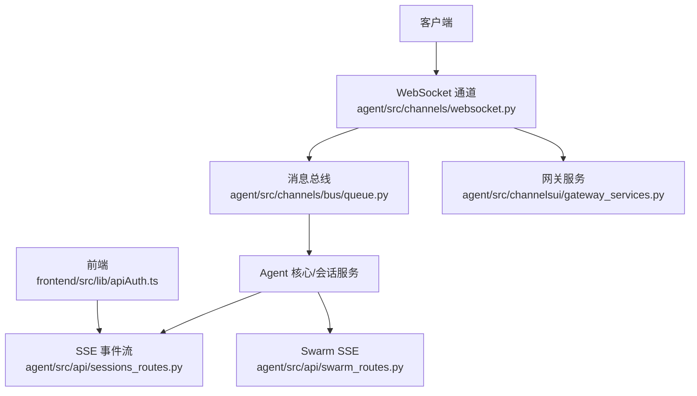
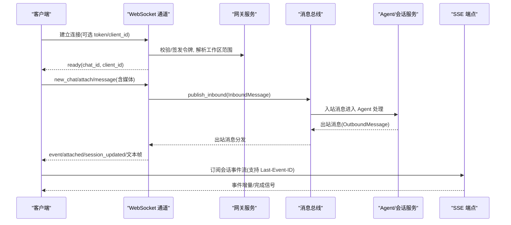
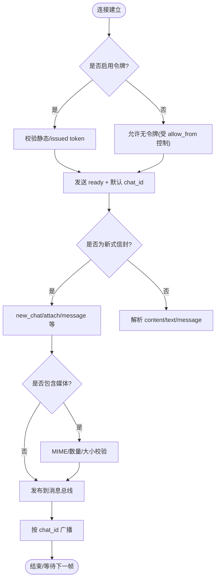
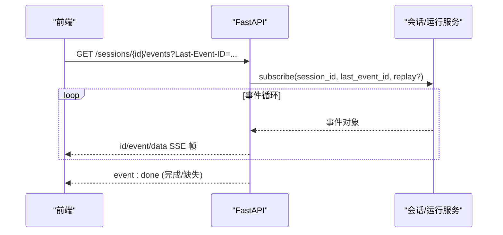
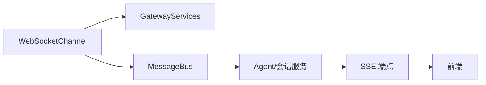

# WebSocket API

<cite>
**本文引用的文件**
- [agent/src/channels/websocket.py](file://agent/src/channels/websocket.py)
- [agent/src/channelsui/gateway_services.py](file://agent/src/channelsui/gateway_services.py)
- [agent/src/channels/bus/events.py](file://agent/src/channels/bus/events.py)
- [agent/src/channels/bus/queue.py](file://agent/src/channels/bus/queue.py)
- [agent/src/api/sessions_routes.py](file://agent/src/api/sessions_routes.py)
- [agent/src/api/swarm_routes.py](file://agent/src/api/swarm_routes.py)
- [frontend/src/lib/apiAuth.ts](file://frontend/src/lib/apiAuth.ts)
</cite>

## 目录
1. [简介](#简介)
2. [项目结构](#项目结构)
3. [核心组件](#核心组件)
4. [架构总览](#架构总览)
5. [详细组件分析](#详细组件分析)
6. [依赖关系分析](#依赖关系分析)
7. [性能考虑](#性能考虑)
8. [故障排查指南](#故障排查指南)
9. [结论](#结论)
10. [附录](#附录)

## 简介
本文件为 Vibe-Trading 的 WebSocket API 实时通信文档，覆盖连接建立、消息格式、事件类型与生命周期管理；说明实时数据流（市场数据推送、回测进度更新、系统状态变更等）的结构；解释订阅机制、过滤规则与批量处理；提供客户端实现要点（连接管理、重连策略、错误处理）；总结性能优化技巧（压缩、连接池、内存优化）；并给出在交易监控、策略执行和用户交互中的典型应用场景。

## 项目结构
Vibe-Trading 将 WebSocket 作为“通道”之一，接入统一的消息总线，并与会话/运行事件体系集成：
- WebSocket 服务端通道：负责监听、鉴权、路由、订阅与广播。
- 网关服务：提供令牌签发、工作区范围控制、媒体与转录桥接等能力。
- 消息总线：解耦通道与 Agent 核心，承载入站/出站消息。
- HTTP/SSE 接口：会话事件流、Swarm 运行事件流，供前端或外部系统消费。
- 前端认证辅助：为浏览器 SSE 获取一次性票据，避免长链接暴露密钥。

图表来源
- [agent/src/channels/websocket.py:264-528](file://agent/src/channels/websocket.py#L264-L528)
- [agent/src/channelsui/gateway_services.py:16-273](file://agent/src/channelsui/gateway_services.py#L16-L273)
- [agent/src/channels/bus/queue.py:8-44](file://agent/src/channels/bus/queue.py#L8-L44)
- [agent/src/api/sessions_routes.py:752-800](file://agent/src/api/sessions_routes.py#L752-L800)
- [agent/src/api/swarm_routes.py:169-211](file://agent/src/api/swarm_routes.py#L169-L211)
- [frontend/src/lib/apiAuth.ts:18-53](file://frontend/src/lib/apiAuth.ts#L18-L53)

章节来源
- [agent/src/channels/websocket.py:264-528](file://agent/src/channels/websocket.py#L264-L528)
- [agent/src/channelsui/gateway_services.py:16-273](file://agent/src/channelsui/gateway_services.py#L16-L273)
- [agent/src/channels/bus/queue.py:8-44](file://agent/src/channels/bus/queue.py#L8-L44)
- [agent/src/api/sessions_routes.py:752-800](file://agent/src/api/sessions_routes.py#L752-L800)
- [agent/src/api/swarm_routes.py:169-211](file://agent/src/api/swarm_routes.py#L169-L211)
- [frontend/src/lib/apiAuth.ts:18-53](file://frontend/src/lib/apiAuth.ts#L18-L53)

## 核心组件
- WebSocketChannel：本地 WebSocket 服务器，支持 TCP/Unix Socket、WSS、路径路由、令牌校验、聊天 ID 绑定、附件上传限制、工作区范围控制、转写事件桥接。
- GatewayServices：令牌签发器、工作区范围服务、HTTP 路由适配、媒体与转录桥接、会话管理器适配。
- MessageBus：异步入站/出站队列，解耦通道与 Agent。
- OutboundMessage/InboundMessage：通道间消息契约，携带 channel/chat_id/content/metadata 等字段。
- SSE 端点：会话事件流与 Swarm 运行事件流，支持断线续传与完成信号。

章节来源
- [agent/src/channels/websocket.py:264-528](file://agent/src/channels/websocket.py#L264-L528)
- [agent/src/channelsui/gateway_services.py:16-273](file://agent/src/channelsui/gateway_services.py#L16-L273)
- [agent/src/channels/bus/events.py:20-55](file://agent/src/channels/bus/events.py#L20-L55)
- [agent/src/channels/bus/queue.py:8-44](file://agent/src/channels/bus/queue.py#L8-L44)
- [agent/src/api/sessions_routes.py:752-800](file://agent/src/api/sessions_routes.py#L752-L800)
- [agent/src/api/swarm_routes.py:169-211](file://agent/src/api/swarm_routes.py#L169-L211)

## 架构总览
WebSocket 通道作为独立通道接入系统，既可作为 Web UI 的实时通道，也可被其他客户端复用。它通过消息总线与 Agent 核心交互，同时通过网关服务完成鉴权、工作区隔离与媒体处理。SSE 用于事件回放与进度推送，适合浏览器环境。

图表来源
- [agent/src/channels/websocket.py:386-443](file://agent/src/channels/websocket.py#L386-L443)
- [agent/src/channels/websocket.py:530-589](file://agent/src/channels/websocket.py#L530-L589)
- [agent/src/channelsui/gateway_services.py:16-150](file://agent/src/channelsui/gateway_services.py#L16-L150)
- [agent/src/channels/bus/queue.py:8-44](file://agent/src/channels/bus/queue.py#L8-L44)
- [agent/src/api/sessions_routes.py:752-800](file://agent/src/api/sessions_routes.py#L752-L800)

## 详细组件分析

### WebSocket 通道与连接生命周期
- 启动与监听：支持 host/port/unix_socket_path，可启用 SSL（wss），配置 ping_interval/ping_timeout 保活。
- 请求路由：同一端口上区分 WebSocket 升级路径与 token_issue_path，其余走 HTTP 路由。
- 握手鉴权：支持静态 token 或短效 issued token；当 host 为 0.0.0.0 时必须配置安全凭据。
- 连接建立：发送 ready 事件并分配默认 chat_id；自动 attach 到默认会话。
- 消息处理：支持新式信封（type 字段）与兼容旧式纯文本；支持 new_chat/fork_chat/attach/set_workspace_scope/transcribe_audio/message。
- 媒体处理：data_url 图片/视频白名单、数量与大小限制，失败时清理已写入文件。
- 订阅与广播：维护 chat_id -> connections 映射，按会话 fan-out；断开时清理。
- 状态回填：订阅后回放活跃目标状态与进行中的 turn 时钟。

图表来源
- [agent/src/channels/websocket.py:386-443](file://agent/src/channels/websocket.py#L386-L443)
- [agent/src/channels/websocket.py:530-589](file://agent/src/channels/websocket.py#L530-L589)
- [agent/src/channels/websocket.py:593-799](file://agent/src/channels/websocket.py#L593-L799)

章节来源
- [agent/src/channels/websocket.py:53-143](file://agent/src/channels/websocket.py#L53-L143)
- [agent/src/channels/websocket.py:386-443](file://agent/src/channels/websocket.py#L386-L443)
- [agent/src/channels/websocket.py:530-589](file://agent/src/channels/websocket.py#L530-L589)
- [agent/src/channels/websocket.py:593-799](file://agent/src/channels/websocket.py#L593-L799)

### 网关服务与令牌签发
- WebSocketTokenIssuer：生成一次性短效 token，支持 TTL 与过期回收。
- WorkspaceService：基于 envelope 解析工作区根路径，强制相对默认 workspace 的安全约束。
- SimpleHttpRouter：非 WS 的 HTTP 请求返回 404 JSON。
- MediaService/TranscriptService：媒体路径签名/本地存在性检查；转录事件桥接。
- GatewaySessionManagerAdapter：适配会话服务以读取 session 元数据，用于状态回填。

章节来源
- [agent/src/channelsui/gateway_services.py:16-150](file://agent/src/channelsui/gateway_services.py#L16-L150)
- [agent/src/channelsui/gateway_services.py:153-273](file://agent/src/channelsui/gateway_services.py#L153-L273)

### 消息总线与消息模型
- InboundMessage：channel/sender_id/chat_id/content/media/metadata/session_key_override。
- OutboundMessage：channel/chat_id/content/reply_to/media/metadata/buttons。
- MessageBus：inbound/outbound 两个 asyncio.Queue，提供 publish/consume 方法。

章节来源
- [agent/src/channels/bus/events.py:20-55](file://agent/src/channels/bus/events.py#L20-L55)
- [agent/src/channels/bus/queue.py:8-44](file://agent/src/channels/bus/queue.py#L8-L44)

### SSE 事件流与会话/运行事件
- 会话事件流：GET /sessions/{id}/events，支持 Last-Event-ID 断线续传，replay=active 模式可回放进行中的尝试。
- Swarm 运行事件流：GET /swarm/runs/{id}/events，按索引推进，结束时输出 done 事件。
- 前端认证：浏览器无法设置 Authorization，需 POST /auth/sse-ticket 换取 ticket 再打开 EventSource。

图表来源
- [agent/src/api/sessions_routes.py:752-800](file://agent/src/api/sessions_routes.py#L752-L800)
- [agent/src/api/swarm_routes.py:169-211](file://agent/src/api/swarm_routes.py#L169-L211)
- [frontend/src/lib/apiAuth.ts:18-53](file://frontend/src/lib/apiAuth.ts#L18-L53)

章节来源
- [agent/src/api/sessions_routes.py:752-800](file://agent/src/api/sessions_routes.py#L752-L800)
- [agent/src/api/swarm_routes.py:169-211](file://agent/src/api/swarm_routes.py#L169-L211)
- [frontend/src/lib/apiAuth.ts:18-53](file://frontend/src/lib/apiAuth.ts#L18-L53)

### 实时数据流结构与事件类型
- 控制事件：ready、attached、session_updated、error、goal_status、goal_state 等。
- 业务事件：通过 OutboundMessage.metadata 携带结构化负载（如 _runtime_model_updated）。
- 媒体事件：transcribe_audio 相关事件（未配置时返回错误提示）。
- 会话/运行事件：通过 SSE 推送，包含工具调用、结果、进度、完成等。

章节来源
- [agent/src/channels/websocket.py:321-349](file://agent/src/channels/websocket.py#L321-L349)
- [agent/src/channels/websocket.py:661-799](file://agent/src/channels/websocket.py#L661-L799)
- [agent/src/channelsui/transcription_ws.py:8-12](file://agent/src/channelsui/transcription_ws.py#L8-L12)
- [agent/src/channels/bus/events.py:20-55](file://agent/src/channels/bus/events.py#L20-L55)

### 订阅机制、过滤与批量处理
- 订阅：连接建立后自动 attach 到默认 chat_id；可通过 new_chat/attach 切换或新增会话。
- 过滤：按 chat_id 精确广播；工作区范围由 WorkspaceService 控制，限制资源访问边界。
- 批量：消息体支持 media 列表（图片/视频），服务端做 MIME/数量/大小校验与原子保存；失败时清理已写入文件。

章节来源
- [agent/src/channels/websocket.py:304-349](file://agent/src/channels/websocket.py#L304-L349)
- [agent/src/channels/websocket.py:593-799](file://agent/src/channels/websocket.py#L593-L799)
- [agent/src/channelsui/gateway_services.py:74-134](file://agent/src/channelsui/gateway_services.py#L74-L134)

### 客户端实现示例（要点）
- 连接管理：
  - 使用 ws/wss 连接到配置的 host/port/path，附带 client_id 与 token（若启用）。
  - 收到 ready 后记录 chat_id，后续消息携带 chat_id 或使用 attach/new_chat。
- 重连策略：
  - 网络抖动时指数退避重连；每次重连重新申请 token（若启用）。
  - 对 SSE 使用 Last-Event-ID 续传，确保不丢事件。
- 错误处理：
  - 捕获 ConnectionClosed、401/403 等，触发重试或提示用户。
  - 媒体上传失败根据 reason 提示（too_many_images、size、mime、decode 等）。

章节来源
- [agent/src/channels/websocket.py:386-443](file://agent/src/channels/websocket.py#L386-L443)
- [agent/src/channels/websocket.py:593-799](file://agent/src/channels/websocket.py#L593-L799)
- [agent/src/api/sessions_routes.py:752-800](file://agent/src/api/sessions_routes.py#L752-L800)
- [frontend/src/lib/apiAuth.ts:18-53](file://frontend/src/lib/apiAuth.ts#L18-L53)

## 依赖关系分析
- WebSocketChannel 依赖：
  - GatewayServices：令牌、工作区、媒体、转录、会话适配器。
  - MessageBus：入站/出站消息队列。
  - HTTP 路由：WS 升级路径与 token_issue_path 分离。
- SSE 端点依赖：
  - 会话服务：事件总线订阅、回放、完成判定。
  - 认证：事件流需要一次性票据或会话级鉴权。

图表来源
- [agent/src/channels/websocket.py:264-528](file://agent/src/channels/websocket.py#L264-L528)
- [agent/src/channelsui/gateway_services.py:16-273](file://agent/src/channelsui/gateway_services.py#L16-L273)
- [agent/src/channels/bus/queue.py:8-44](file://agent/src/channels/bus/queue.py#L8-L44)
- [agent/src/api/sessions_routes.py:752-800](file://agent/src/api/sessions_routes.py#L752-L800)

章节来源
- [agent/src/channels/websocket.py:264-528](file://agent/src/channels/websocket.py#L264-L528)
- [agent/src/channelsui/gateway_services.py:16-273](file://agent/src/channelsui/gateway_services.py#L16-L273)
- [agent/src/channels/bus/queue.py:8-44](file://agent/src/channels/bus/queue.py#L8-L44)
- [agent/src/api/sessions_routes.py:752-800](file://agent/src/api/sessions_routes.py#L752-L800)

## 性能考虑
- 连接与心跳：
  - 合理设置 ping_interval_s/ping_timeout_s，避免空闲连接被中间设备丢弃。
  - 使用 wss 提升安全性，减少代理层干扰。
- 消息体积与限流：
  - max_message_bytes 限制单帧大小，防止 DoS；媒体按 MIME/数量/大小限制。
  - 建议客户端分片大文件或采用 data_url 前压缩。
- 内存与缓冲：
  - 使用 asyncio.Queue 解耦生产/消费，避免阻塞。
  - 媒体写入失败时立即清理临时文件，避免磁盘泄漏。
- 压缩与传输：
  - 当前实现未内置消息压缩；可在客户端侧压缩后再 base64 传输，或在反向代理层启用 gzip/br。
- 连接池与多路复用：
  - 单个 WebSocket 连接即可承载多会话（chat_id 路由）；避免为每个会话新建连接。
  - 对于高并发场景，结合进程/容器水平扩展，配合共享后端存储。

[本节为通用指导，不直接分析具体文件]

## 故障排查指南
- 连接失败：
  - 检查 host/port/path 是否正确；若 host 为 0.0.0.0，必须配置 token 或 token_issue_secret。
  - 确认 token 有效且未过期；浏览器 SSE 需先获取 ticket。
- 鉴权错误：
  - 401 Unauthorized：token 无效或未提供；403 Forbidden：client_id 不在 allow_from。
- 媒体上传失败：
  - too_many_images/too_many_videos：超出上限；size：超过最大字节；mime：不在白名单；decode：base64 解码失败。
- 事件丢失：
  - SSE 断线后使用 Last-Event-ID 续传；replay=active 可回放进行中的尝试。
- 日志定位：
  - 关注 WebSocket 通道日志与网关服务日志；媒体写入异常会记录警告。

章节来源
- [agent/src/channels/websocket.py:386-443](file://agent/src/channels/websocket.py#L386-L443)
- [agent/src/channels/websocket.py:593-799](file://agent/src/channels/websocket.py#L593-L799)
- [agent/src/api/sessions_routes.py:752-800](file://agent/src/api/sessions_routes.py#L752-L800)
- [frontend/src/lib/apiAuth.ts:18-53](file://frontend/src/lib/apiAuth.ts#L18-L53)

## 结论
Vibe-Trading 的 WebSocket API 提供了高内聚、低耦合的实时通信能力：通过统一的通道与消息总线，既能支撑 Web UI 的即时交互，也能服务于外部系统集成。结合 SSE 的事件回放与完成信号，可实现可靠的进度追踪与状态同步。在生产环境中，建议启用 WSS、配置短效令牌与工作区范围，并结合客户端重连与错误处理策略，以获得稳定高效的实时体验。

[本节为总结性内容，不直接分析具体文件]

## 附录
- 常用配置项（WebSocketConfig）：
  - enabled/host/port/unix_socket_path/path/token/token_issue_path/token_issue_secret/token_ttl_s/websocket_requires_token/allow_from/streaming/max_message_bytes/ping_interval_s/ping_timeout_s/ssl_certfile/ssl_keyfile。
- 关键事件：
  - ready/attached/session_updated/error/goal_status/goal_state/_runtime_model_updated。
- 媒体限制：
  - 图片最多 4 张，单张不超过 8MB；视频最多 1 条，不超过 20MB；仅允许指定 MIME。

章节来源
- [agent/src/channels/websocket.py:53-143](file://agent/src/channels/websocket.py#L53-L143)
- [agent/src/channels/websocket.py:593-799](file://agent/src/channels/websocket.py#L593-L799)
- [agent/src/channels/websocket.py:321-349](file://agent/src/channels/websocket.py#L321-L349)