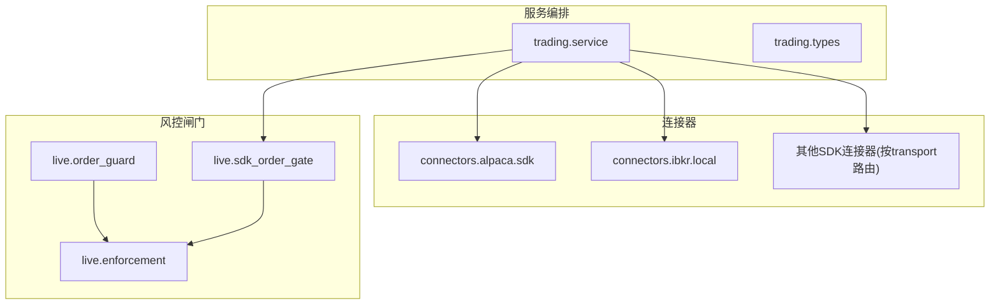
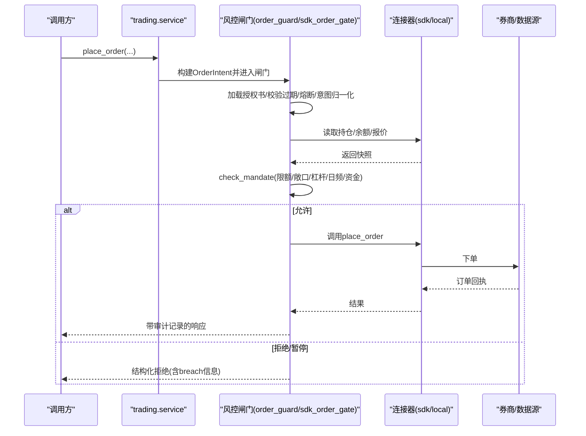
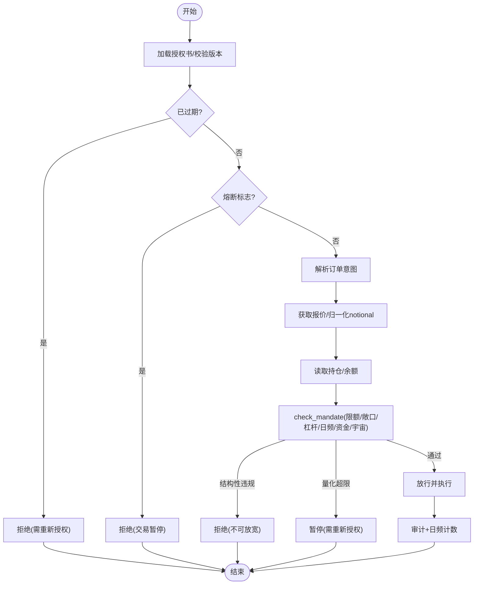
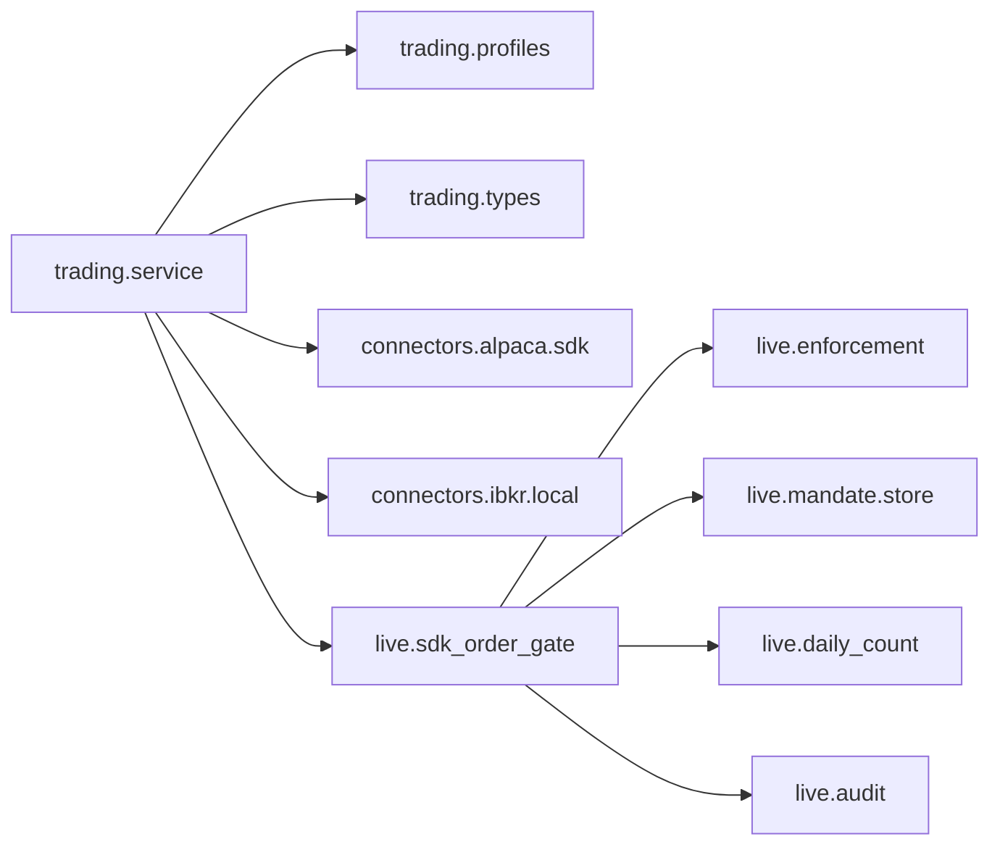

# 交易集成系统

<cite>
**本文引用的文件**
- [service.py](file://agent/src/trading/service.py)
- [types.py](file://agent/src/trading/types.py)
- [alpaca/sdk.py](file://agent/src/trading/connectors/alpaca/sdk.py)
- [ibkr/local.py](file://agent/src/trading/connectors/ibkr/local.py)
- [order_guard.py](file://agent/src/live/order_guard.py)
- [enforcement.py](file://agent/src/live/enforcement.py)
- [sdk_order_gate.py](file://agent/src/live/sdk_order_gate.py)
</cite>

## 目录
1. [简介](#简介)
2. [项目结构](#项目结构)
3. [核心组件](#核心组件)
4. [架构总览](#架构总览)
5. [详细组件分析](#详细组件分析)
6. [依赖关系分析](#依赖关系分析)
7. [性能考量](#性能考量)
8. [故障排查指南](#故障排查指南)
9. [结论](#结论)
10. [附录](#附录)

## 简介
本文件面向 Vibe-Trading 的交易集成子系统，系统性说明连接器抽象层、内置连接器、自定义连接器开发要点与连接池管理；阐述订单生命周期、风险控制机制、订单路由策略与成交确认；给出来自代码库的具体示例路径；记录配置选项、参数与返回值；解释与回测引擎、风险管理系统的关系；并总结常见问题及解决方案。重点覆盖多券商支持、订单管理与风控机制。

## 项目结构
交易集成由“服务编排 + 连接器实现 + 风控闸门”三层构成：
- 服务编排层：统一对外暴露账户、持仓、订单、行情、历史数据等能力，并按 profile 的 transport 选择本地 TWS、远程 MCP 或直接 SDK 路径。
- 连接器实现层：各券商（如 Alpaca、IBKR、Binance、OKX、Futu、Tiger、Longbridge、MT5、eToro 等）提供标准化读接口与可选写接口；部分连接器支持 TAP 凭据隔离与代理审批。
- 风控闸门层：对写入类操作进行强制前置校验（授权书、过期、熔断、意图归一化、限额、敞口、杠杆、日频计数、资金上限），失败即关闭（fail-closed）。

图表来源
- [service.py:17-29](file://agent/src/trading/service.py#L17-L29)
- [types.py:20-52](file://agent/src/trading/types.py#L20-L52)
- [order_guard.py:97-214](file://agent/src/live/order_guard.py#L97-L214)
- [sdk_order_gate.py:59-157](file://agent/src/live/sdk_order_gate.py#L59-L157)
- [enforcement.py:455-617](file://agent/src/live/enforcement.py#L455-L617)

章节来源
- [service.py:17-29](file://agent/src/trading/service.py#L17-L29)
- [types.py:20-52](file://agent/src/trading/types.py#L20-L52)

## 核心组件
- 交易档案与能力声明：TradingProfile 描述 connector、environment、transport、capabilities、readonly 等，用于统一路由与权限控制。
- 服务编排：service 模块根据 profile.transport 分发到 local_tws、broker_sdk 或 remote_mcp 路径；统一封装 get_account/get_positions/get_open_orders/get_quote/get_history/place_order/cancel_order/close_position 等。
- 连接器：alpaca、ibkr 等各自实现标准读接口与可选写接口；alpaca 支持 TAP 凭据隔离与代理审批；ibkr 通过本地连接池复用 socket 连接。
- 风控闸门：order_guard 针对 MCP 远端工具；sdk_order_gate 针对直接 SDK 调用；两者均调用 enforcement.check_mandate 做结构化与量化限制检查，并写入审计事件。

章节来源
- [types.py:20-52](file://agent/src/trading/types.py#L20-L52)
- [service.py:42-147](file://agent/src/trading/service.py#L42-L147)
- [alpaca/sdk.py:261-426](file://agent/src/trading/connectors/alpaca/sdk.py#L261-L426)
- [ibkr/local.py:241-425](file://agent/src/trading/connectors/ibkr/local.py#L241-L425)
- [order_guard.py:97-214](file://agent/src/live/order_guard.py#L97-L214)
- [sdk_order_gate.py:59-157](file://agent/src/live/sdk_order_gate.py#L59-L157)
- [enforcement.py:455-617](file://agent/src/live/enforcement.py#L455-L617)

## 架构总览
下图展示从上层调用到券商执行的全链路：服务编排 → 风控闸门 → 连接器 → 券商/数据源。

图表来源
- [service.py:279-342](file://agent/src/trading/service.py#L279-L342)
- [order_guard.py:130-214](file://agent/src/live/order_guard.py#L130-L214)
- [sdk_order_gate.py:59-157](file://agent/src/live/sdk_order_gate.py#L59-L157)
- [enforcement.py:455-617](file://agent/src/live/enforcement.py#L455-L617)

## 详细组件分析

### 连接器抽象层与服务编排
- 路由策略：
  - local_tws：走 IBKR 本地只读路径（不写单）。
  - broker_sdk：动态导入对应 connector 的 sdk 模块，调用其 build_config/check_status/get_* 等统一接口。
  - remote_mcp：通过远程 MCP 工具调用。
- 读写能力：
  - 读：get_account/get_positions/get_open_orders/get_quote/get_history。
  - 写：place_order/cancel_order/close_position（仅 broker_sdk 且非 readonly）。
- 多市场资产分类：_order_classification 将 symbol 映射为 InstrumentType 与 AssetClass，以支撑风控的资产类别与宇宙规则。

章节来源
- [service.py:17-29](file://agent/src/trading/service.py#L17-L29)
- [service.py:42-147](file://agent/src/trading/service.py#L42-L147)
- [service.py:245-277](file://agent/src/trading/service.py#L245-L277)
- [service.py:279-342](file://agent/src/trading/service.py#L279-L342)

### 内置连接器：Alpaca（含 TAP 凭据隔离）
- 配置：
  - 配置文件位置：~/.vibe-trading/alpaca.json。
  - 关键参数：api_key、secret_key、profile(paper/live-readonly/live)、feed(iex/sip)、timeout、readonly。
  - 环境区分：paper 与 live 使用不同 host；数据 API 共用 data host。
- 读接口：account/positions/orders/latest quote/bars，支持 TAP 代理自动批准 GET 请求。
- 写接口：place_order/cancel_order，TAP 开启时走代理审批；否则直连 alpaca-py。
- 幂等性：TAP 路径下基于订单内容生成 client_order_id，避免重复下单。
- 错误处理：所有输入校验失败返回 {"status":"error",...}，不抛出异常。

章节来源
- [alpaca/sdk.py:65-151](file://agent/src/trading/connectors/alpaca/sdk.py#L65-L151)
- [alpaca/sdk.py:261-426](file://agent/src/trading/connectors/alpaca/sdk.py#L261-L426)
- [alpaca/sdk.py:429-577](file://agent/src/trading/connectors/alpaca/sdk.py#L429-L577)
- [alpaca/sdk.py:580-748](file://agent/src/trading/connectors/alpaca/sdk.py#L580-L748)

### 内置连接器：IBKR 本地只读（连接池）
- 连接池：线程局部 _TwsPool，每个线程独立 ib_async.IB 实例，唯一 client_id，引用计数释放，避免并发冲突。
- 配置：~/.vibe-trading/ibkr-local.json，包含 host/port/client_id/profile/account/timeout/readonly。
- 读接口：account snapshot、positions、open orders、quote、historical bars。
- 安全：仅只读；禁止向 live 账户误配 paper profile。
- 健康检查：端口扫描、SDK 可用性、账户摘要。

章节来源
- [ibkr/local.py:48-153](file://agent/src/trading/connectors/ibkr/local.py#L48-L153)
- [ibkr/local.py:165-218](file://agent/src/trading/connectors/ibkr/local.py#L165-L218)
- [ibkr/local.py:241-425](file://agent/src/trading/connectors/ibkr/local.py#L241-L425)
- [ibkr/local.py:429-503](file://agent/src/trading/connectors/ibkr/local.py#L429-L503)

### 风控闸门与授权书（Mandate Enforcement）
- 闸门入口：
  - order_guard.LiveOrderGuardTool：包裹 MCP 远端写工具，执行顺序：加载授权书→过期→熔断→意图解析→报价归一化→读取持仓/余额→check_mandate→放行/拒绝/暂停。
  - sdk_order_gate.execute_live_order：包裹直接 SDK 写调用，流程一致。
- 意图归一化：quantity 订单通过连接器报价或数据加载器转换为 USD notional，取显式 notional 与 implied 的较大值，防止绕过限额。
- 检查顺序（fail-closed）：排除列表→允许品种→资产类别→单笔名义→总敞口→杠杆→日频计数→资金上限→宇宙地板（市值/流动性）。
- 审计：每次决策写入 live-action 审计事件，成功下单才消耗日频计数；错误不消耗。
- 建议审查：可启用 advisory 层，输出观察性建议但不阻塞。

图表来源
- [order_guard.py:130-214](file://agent/src/live/order_guard.py#L130-L214)
- [sdk_order_gate.py:59-157](file://agent/src/live/sdk_order_gate.py#L59-L157)
- [enforcement.py:455-617](file://agent/src/live/enforcement.py#L455-L617)

章节来源
- [order_guard.py:97-214](file://agent/src/live/order_guard.py#L97-L214)
- [sdk_order_gate.py:59-157](file://agent/src/live/sdk_order_gate.py#L59-L157)
- [enforcement.py:111-177](file://agent/src/live/enforcement.py#L111-L177)
- [enforcement.py:455-617](file://agent/src/live/enforcement.py#L455-L617)

### 订单生命周期与成交确认
- 下单：
  - service.place_order 仅支持 broker_sdk 且非 readonly；paper 环境直接调用连接器；live 环境经 sdk_order_gate 闸门。
  - 连接器内部完成参数校验与提交，返回统一信封。
- 取消：
  - service.cancel_order 对 live 环境写入审计；取消被视为降风险动作，不受熔断阻断。
- 平仓（eToro 特例）：
  - close_position 先校验头寸存在性与 instrument_id，再调用连接器；支持部分平仓。
- 成交确认：
  - 闸门在放行后检查连接器返回是否为 error envelope；非错误才计入日频计数并审计为 accepted。
  - 若返回 error，审计为 rejected/error，且不消耗计数。

章节来源
- [service.py:279-370](file://agent/src/trading/service.py#L279-L370)
- [sdk_order_gate.py:387-438](file://agent/src/live/sdk_order_gate.py#L387-L438)
- [service.py:512-551](file://agent/src/trading/service.py#L512-L551)

### 多券商支持与连接池管理
- 多券商：
  - 通过 _SDK_CONNECTOR_MODULES 映射 key 到具体 sdk 模块，统一 read 接口；write 由 connectors 自行实现。
  - 多市场权益类通过 symbol 后缀推断资产类别（HK/US/CN）。
- 连接池：
  - IBKR 使用 _TwsPool 线程局部连接，避免 client_id 冲突与跨线程共享 socket。
  - Alpaca 在 TAP 模式下通过代理转发，agent 进程不持有密钥。

章节来源
- [service.py:17-29](file://agent/src/trading/service.py#L17-L29)
- [service.py:245-277](file://agent/src/trading/service.py#L245-L277)
- [ibkr/local.py:429-503](file://agent/src/trading/connectors/ibkr/local.py#L429-L503)
- [alpaca/sdk.py:183-227](file://agent/src/trading/connectors/alpaca/sdk.py#L183-L227)

### 与回测引擎和风险管理系统的关系
- 回测引擎：
  - 历史数据读取兼容 IBKR 词汇（duration/bar_size/what_to_show/use_rth）与通用 period/limit；connector 负责映射到各自 SDK。
  - 宇宙地板（市值/流动性）通过现有数据加载器链（backtest.loaders.registry）获取，失败即拒绝。
- 风险管理系统：
  - enforcement 定义 OrderIntent/BreachEvent 契约，order_guard 与 sdk_order_gate 作为执行前门控。
  - 审计事件通过 write_live_action 持久化，供 SSE 实时推送与事后审计。

章节来源
- [service.py:174-225](file://agent/src/trading/service.py#L174-L225)
- [enforcement.py:242-286](file://agent/src/live/enforcement.py#L242-L286)
- [enforcement.py:620-676](file://agent/src/live/enforcement.py#L620-L676)
- [sdk_order_gate.py:639-693](file://agent/src/live/sdk_order_gate.py#L639-L693)

## 依赖关系分析
- 服务编排依赖：profiles、types、各 connector sdk、风控闸门。
- 风控闸门依赖：mandate 模型与存储、halt 标志、daily_count、audit、enforcement。
- 连接器依赖：各自 SDK（alpaca-py、ib_async 等）与可选 TAP 代理。

图表来源
- [service.py:17-29](file://agent/src/trading/service.py#L17-L29)
- [sdk_order_gate.py:24-48](file://agent/src/live/sdk_order_gate.py#L24-L48)
- [order_guard.py:37-73](file://agent/src/live/order_guard.py#L37-L73)

章节来源
- [service.py:17-29](file://agent/src/trading/service.py#L17-L29)
- [sdk_order_gate.py:24-48](file://agent/src/live/sdk_order_gate.py#L24-L48)
- [order_guard.py:37-73](file://agent/src/live/order_guard.py#L37-L73)

## 性能考量
- 连接复用：IBKR 使用线程局部连接池，减少握手与认证开销。
- 报价归一化：优先连接器报价，失败再回退到数据加载器，降低网络往返。
- 批量读取：历史 K 线通过 period/limit 控制拉取规模，避免过大负载。
- 审计与计数：仅在成功下单时增加日频计数，避免无效重试带来的计数漂移。

[本节为通用指导，无需特定文件来源]

## 故障排查指南
- 无法连接 IBKR：
  - 检查本地端口是否开放、TWS/Gateway 是否登录并启用 API。
  - 参考健康检查报告中的 target.open 与 ports 扫描结果。
- Alpaca 未安装 SDK：
  - 健康检查会提示缺少 alpaca-py；按提示安装。
- 授权书缺失或过期：
  - 闸门会拒绝并提示需要重新授权；更新授权书后重试。
- 熔断触发：
  - 熔断标志置位时所有写入被拒绝；解除熔断后再试。
- 数量订单无法定价：
  - 当无法获取报价时，数量订单会被拒绝；请检查符号与市场数据源。
- 额度/敞口/杠杆超限：
  - 闸门返回 breach 详情；调整策略或申请放宽授权。

章节来源
- [ibkr/local.py:165-218](file://agent/src/trading/connectors/ibkr/local.py#L165-L218)
- [alpaca/sdk.py:261-296](file://agent/src/trading/connectors/alpaca/sdk.py#L261-L296)
- [order_guard.py:130-214](file://agent/src/live/order_guard.py#L130-L214)
- [sdk_order_gate.py:59-157](file://agent/src/live/sdk_order_gate.py#L59-L157)
- [enforcement.py:455-617](file://agent/src/live/enforcement.py#L455-L617)

## 结论
Vibe-Trading 的交易集成通过“服务编排 + 连接器 + 风控闸门”的分层设计，实现了多券商接入、统一的读写能力与严格的前置风控。连接器层面提供灵活的配置与凭据隔离，风控闸门确保任何写入都经过授权、限额与敞口检查，并以审计贯穿始终。结合回测引擎的数据加载器，系统在真实交易中具备稳健的可扩展性与安全性。

[本节为总结，无需特定文件来源]

## 附录

### 配置选项速查
- Alpaca（alpaca.json）
  - api_key、secret_key、profile(paper/live-readonly/live)、feed(iex/sip)、timeout、readonly
- IBKR 本地（ibkr-local.json）
  - host、port、client_id、profile(paper/live-readonly)、account、timeout、readonly
- TradingProfile（类型定义）
  - id、connector、label、environment(paper/live)、transport(local_tws/remote_mcp/broker_sdk)、capabilities、readonly、config、notes

章节来源
- [alpaca/sdk.py:65-151](file://agent/src/trading/connectors/alpaca/sdk.py#L65-L151)
- [ibkr/local.py:48-153](file://agent/src/trading/connectors/ibkr/local.py#L48-L153)
- [types.py:20-52](file://agent/src/trading/types.py#L20-L52)

### 常用函数与返回约定
- trading.service
  - check_connection/get_account/get_positions/get_open_orders/get_quote/get_history/place_order/cancel_order/close_position
  - 返回统一信封：{"status":"ok", ...} 或 {"status":"error","error":...}
- 连接器
  - Alpaca：read/write 均返回统一信封；TAP 路径附加 via:"tap"
  - IBKR：只读，返回统一信封
- 风控闸门
  - 拒绝返回 {"status":"blocked","decision":"deny/pause_for_reauth","reason":...,"live_action":...}
  - 允许返回连接器结果并嵌入 live_action 审计记录

章节来源
- [service.py:42-147](file://agent/src/trading/service.py#L42-L147)
- [service.py:279-370](file://agent/src/trading/service.py#L279-L370)
- [alpaca/sdk.py:429-577](file://agent/src/trading/connectors/alpaca/sdk.py#L429-L577)
- [ibkr/local.py:241-425](file://agent/src/trading/connectors/ibkr/local.py#L241-L425)
- [sdk_order_gate.py:490-517](file://agent/src/live/sdk_order_gate.py#L490-L517)