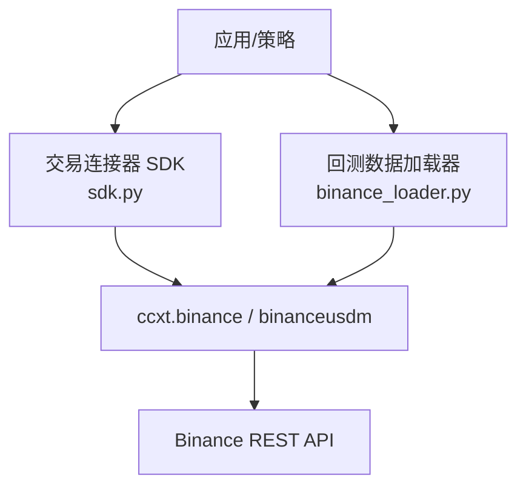
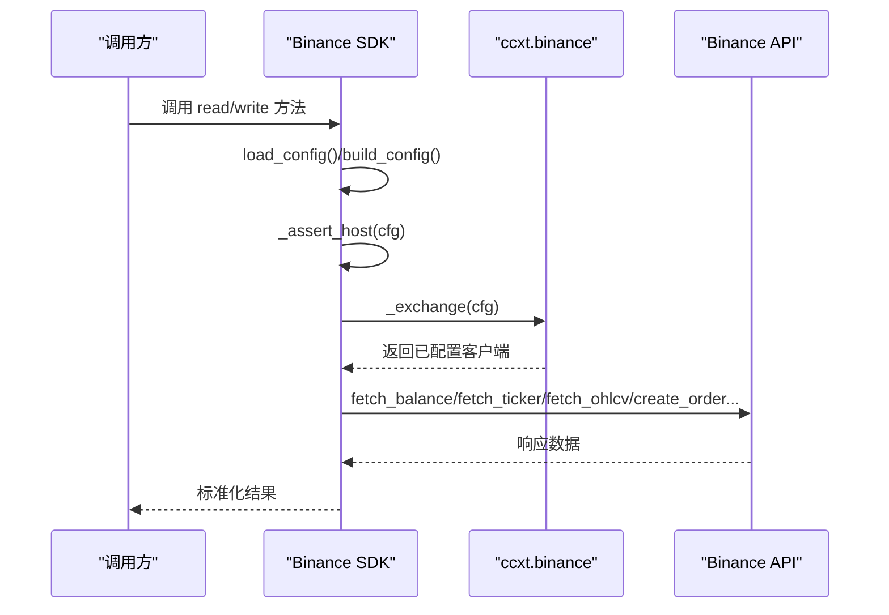
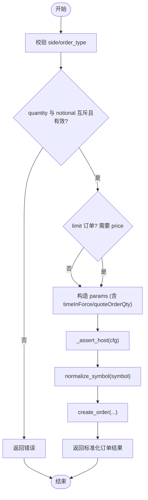
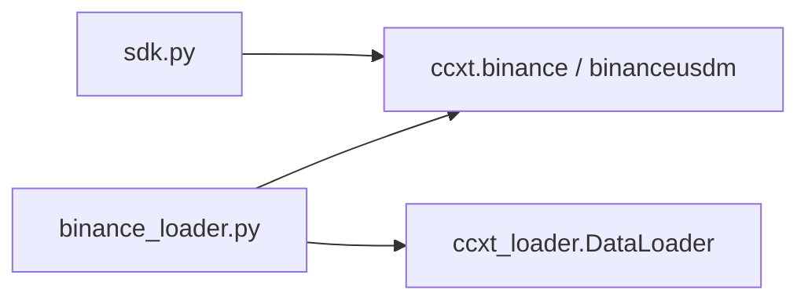

# Binance 连接器

<cite>
**本文引用的文件**
- [agent/src/trading/connectors/binance/sdk.py](file://agent/src/trading/connectors/binance/sdk.py)
- [agent/backtest/loaders/binance_loader.py](file://agent/backtest/loaders/binance_loader.py)
- [agent/tests/test_binance_fallback.py](file://agent/tests/test_binance_fallback.py)
- [agent/tests/test_binance_period_map.py](file://agent/tests/test_binance_period_map.py)
</cite>

## 目录
1. [简介](#简介)
2. [项目结构](#项目结构)
3. [核心组件](#核心组件)
4. [架构总览](#架构总览)
5. [详细组件分析](#详细组件分析)
6. [依赖关系分析](#依赖关系分析)
7. [性能与限流](#性能与限流)
8. [故障排查指南](#故障排查指南)
9. [结论](#结论)
10. [附录：使用示例与最佳实践](#附录使用示例与最佳实践)

## 简介
本文件面向“Binance 加密货币交易连接器”的实现与使用，覆盖以下要点：
- API 认证与环境隔离（测试网/实盘）
- 订单类型支持与下单/撤单流程
- 市场数据获取（报价、历史 K 线）
- 账户余额与持仓展示（现货无“仓位”，以余额表示）
- 配置参数、速率限制、错误处理与重试策略
- 与 ccxt 的统一抽象对接
- 常见网络问题与 API 限流处理
- 加密货币市场的特殊处理与价格波动注意事项

该连接器基于 ccxt 统一交易所客户端封装，提供只读为主的能力（账户快照、持仓、订单、行情、历史 K），并在上层通过纸盘/实盘环境分离与授权门控保障安全。

## 项目结构
围绕 Binance 的关键代码主要分布在两个位置：
- 交易层连接器：位于 trading/connectors/binance/sdk.py，负责认证、环境选择、读写接口封装（当前实现以只读为主，写操作受更高层门控）。
- 回测数据加载器：位于 backtest/loaders/binance_loader.py，提供公共市场数据的 OHLCV 拉取，支持 spot 与 USD-M 永续合约。

图表来源
- [agent/src/trading/connectors/binance/sdk.py:628-640](file://agent/src/trading/connectors/binance/sdk.py#L628-L640)
- [agent/backtest/loaders/binance_loader.py:31-44](file://agent/backtest/loaders/binance_loader.py#L31-L44)

章节来源
- [agent/src/trading/connectors/binance/sdk.py:1-22](file://agent/src/trading/connectors/binance/sdk.py#L1-L22)
- [agent/backtest/loaders/binance_loader.py:1-9](file://agent/backtest/loaders/binance_loader.py#L1-L9)

## 核心组件
- 配置对象与环境隔离
  - BinanceConfig：包含 api_key、api_secret、profile（paper/live-readonly/live）、testnet_host、timeout、readonly 等字段；提供 from_mapping、with_overrides、environment、is_testnet、host 等属性与方法。
  - 构建与持久化：build_config、load_config、save_config、config_path。
- 连接与安全
  - _exchange：创建 ccxt.binance 实例，启用 enableRateLimit、设置超时、根据 is_testnet 切换沙箱模式。
  - _assert_host：严格校验解析后的 host 与 profile 一致，防止 testnet key 访问 live host。
- 只读能力
  - get_account_snapshot：获取非零余额。
  - get_positions：将余额映射为“仓位”形状（spot 无仓位概念）。
  - get_open_orders：获取未成交订单，必要时降级为带 note 的 ok。
  - get_quote：最新报价（bid/ask/last/high/low/volume/time）。
  - get_historical_bars：历史 K 线（OHLCV），支持多周期映射。
- 写能力（受上层门控）
  - place_order：市价/限价下单，支持按数量或名义金额下单，时间条件映射到 GTC/IOC/FOK。
  - cancel_order：按 order_id + symbol 撤销订单。
- 工具函数
  - normalize_symbol：统一符号格式（如 BTC-USDT -> BTC/USDT）。
  - _TIMEFRAME_MAP：项目周期标记到 ccxt timeframe 的映射。
  - 防御性取值：_obj_get、_as_iter、_nonzero_balances、_order_to_dict、_trade_to_dict、_ohlcv_to_dict。

章节来源
- [agent/src/trading/connectors/binance/sdk.py:82-152](file://agent/src/trading/connectors/binance/sdk.py#L82-L152)
- [agent/src/trading/connectors/binance/sdk.py:157-205](file://agent/src/trading/connectors/binance/sdk.py#L157-L205)
- [agent/src/trading/connectors/binance/sdk.py:217-405](file://agent/src/trading/connectors/binance/sdk.py#L217-L405)
- [agent/src/trading/connectors/binance/sdk.py:423-600](file://agent/src/trading/connectors/binance/sdk.py#L423-L600)
- [agent/src/trading/connectors/binance/sdk.py:608-782](file://agent/src/trading/connectors/binance/sdk.py#L608-L782)

## 架构总览
下图展示了从调用方到 Binance 的完整路径，包括配置加载、环境校验、ccxt 客户端创建与 API 调用。

图表来源
- [agent/src/trading/connectors/binance/sdk.py:157-205](file://agent/src/trading/connectors/binance/sdk.py#L157-L205)
- [agent/src/trading/connectors/binance/sdk.py:628-640](file://agent/src/trading/connectors/binance/sdk.py#L628-L640)
- [agent/src/trading/connectors/binance/sdk.py:643-663](file://agent/src/trading/connectors/binance/sdk.py#L643-L663)

## 详细组件分析

### 配置与环境隔离
- 配置文件位置与权限：用户级 binance.json，保存时尝试设置为仅所有者可写。
- 优先级：保存的配置 <- 配置文件中的 profile config <- CLI/工具覆盖。
- 环境判定：
  - paper：指向 testnet_host（默认 https://testnet.binance.vision）。
  - live-readonly/live：指向 https://api.binance.com。
- 主机白名单校验：任何读写前都会执行 _assert_host，确保 profile 与 host 匹配，避免误连。

章节来源
- [agent/src/trading/connectors/binance/sdk.py:180-205](file://agent/src/trading/connectors/binance/sdk.py#L180-L205)
- [agent/src/trading/connectors/binance/sdk.py:138-152](file://agent/src/trading/connectors/binance/sdk.py#L138-L152)
- [agent/src/trading/connectors/binance/sdk.py:643-663](file://agent/src/trading/connectors/binance/sdk.py#L643-L663)

### 认证与客户端创建
- 依赖检查：ccxt_available 检测可选依赖是否安装。
- 客户端创建：_exchange 中启用 enableRateLimit、设置 timeout（毫秒），并根据 is_testnet 设置沙箱模式。
- 密钥与敏感信息：check_status 输出公开配置时会脱敏。

章节来源
- [agent/src/trading/connectors/binance/sdk.py:208-215](file://agent/src/trading/connectors/binance/sdk.py#L208-L215)
- [agent/src/trading/connectors/binance/sdk.py:628-640](file://agent/src/trading/connectors/binance/sdk.py#L628-L640)
- [agent/src/trading/connectors/binance/sdk.py:674-682](file://agent/src/trading/connectors/binance/sdk.py#L674-L682)

### 市场数据获取
- 报价：get_quote 返回 bid/ask/last/high/low/volume/time，内部使用 normalize_symbol 统一符号。
- 历史 K 线：get_historical_bars 支持 1m/5m/15m/30m/1h/4h/1d/1w/1M 等周期映射，limit 控制条数。
- 回测专用加载器：binance_loader.py 提供 public-only 的 OHLCV 读取，支持 spot 与 USD-M swap（binanceusdm），并开启 rate limit 与代理配置。

章节来源
- [agent/src/trading/connectors/binance/sdk.py:355-405](file://agent/src/trading/connectors/binance/sdk.py#L355-L405)
- [agent/backtest/loaders/binance_loader.py:23-44](file://agent/backtest/loaders/binance_loader.py#L23-L44)
- [agent/tests/test_binance_period_map.py:17-42](file://agent/tests/test_binance_period_map.py#L17-L42)

### 账户余额与持仓
- 余额快照：get_account_snapshot 返回非零资产及其 free/used/total。
- 持仓视图：get_positions 将余额映射为 {symbol, quantity, free, used} 的行，适配通用“仓位”模型（spot 无真实仓位）。

章节来源
- [agent/src/trading/connectors/binance/sdk.py:267-314](file://agent/src/trading/connectors/binance/sdk.py#L267-L314)
- [agent/src/trading/connectors/binance/sdk.py:713-739](file://agent/src/trading/connectors/binance/sdk.py#L713-L739)

### 订单类型与交易执行
- 支持的订单类型：market、limit。
- 时间条件：day->GTC、gtc->GTC、ioc->IOC、fok->FOK。
- 下单方式：
  - 按基础资产数量：quantity > 0。
  - 按计价资产名义金额：notional > 0（仅 market 订单）。
- 下单流程：参数校验 -> 主机校验 -> 符号规范化 -> 构造 params -> create_order -> 标准化返回。
- 撤单：需要 order_id 与 symbol，失败时 fail-closed。

图表来源
- [agent/src/trading/connectors/binance/sdk.py:423-547](file://agent/src/trading/connectors/binance/sdk.py#L423-L547)

章节来源
- [agent/src/trading/connectors/binance/sdk.py:412-547](file://agent/src/trading/connectors/binance/sdk.py#L412-L547)
- [agent/src/trading/connectors/binance/sdk.py:550-600](file://agent/src/trading/connectors/binance/sdk.py#L550-L600)

### 未成交订单与成交明细
- get_open_orders：不传 symbol 获取全部未成交订单；某些场景需指定 symbol，否则降级为 note。
- include_executions：可选拉取最近个人成交（fetch_my_trades），同样可能因需 symbol 而降级。

章节来源
- [agent/src/trading/connectors/binance/sdk.py:317-352](file://agent/src/trading/connectors/binance/sdk.py#L317-L352)

### 回测与自动回退链
- 当 OKX 不可用时，系统会回退到 Binance 作为 crypto 数据源。
- 回测加载器 binance_loader.py 注册为独立 source="binance"，也可在自动回退链中被选用。

章节来源
- [agent/tests/test_binance_fallback.py:11-41](file://agent/tests/test_binance_fallback.py#L11-L41)
- [agent/backtest/loaders/binance_loader.py:1-9](file://agent/backtest/loaders/binance_loader.py#L1-L9)

## 依赖关系分析
- 外部依赖：ccxt（可选），用于统一交易所客户端。
- 模块内依赖：
  - sdk.py 依赖 ccxt 提供的 binance/binanceusdm 类。
  - binance_loader.py 继承 ccxt_loader 的 DataLoader，复用公共逻辑（超时、代理、rate limit）。

图表来源
- [agent/src/trading/connectors/binance/sdk.py:628-640](file://agent/src/trading/connectors/binance/sdk.py#L628-L640)
- [agent/backtest/loaders/binance_loader.py:15-44](file://agent/backtest/loaders/binance_loader.py#L15-L44)

章节来源
- [agent/src/trading/connectors/binance/sdk.py:608-640](file://agent/src/trading/connectors/binance/sdk.py#L608-L640)
- [agent/backtest/loaders/binance_loader.py:15-44](file://agent/backtest/loaders/binance_loader.py#L15-L44)

## 性能与限流
- 速率限制：所有 ccxt 客户端均启用 enableRateLimit，由 ccxt 内部进行节流与排队。
- 超时：connector 与 loader 均设置 timeout（毫秒），避免请求挂起。
- 历史 K 线：通过 limit 控制单次拉取量，避免过大负载。
- 建议：
  - 批量拉取时分片与错峰。
  - 结合业务侧预算与重试退避策略（参考 base.py 中的默认退避与最大重试次数）。

章节来源
- [agent/src/trading/connectors/binance/sdk.py:628-640](file://agent/src/trading/connectors/binance/sdk.py#L628-L640)
- [agent/backtest/loaders/binance_loader.py:40-44](file://agent/backtest/loaders/binance_loader.py#L40-L44)

## 故障排查指南
- 配置缺失或无效：
  - check_status 会报告缺少 api_key/api_secret、ccxt 未安装、host 不匹配等问题。
  - 保存配置后，确认文件权限与内容正确。
- 主机不匹配：
  - _assert_host 会在 profile 与 host 不一致时报错，防止 testnet key 访问 live。
- 网络与限流：
  - 若出现网络错误或限流，优先检查 enableRateLimit 与 timeout 设置；必要时降低频率或增加退避。
- 订单失败：
  - 下单前参数校验失败会直接返回错误；执行异常会被捕获并以 error 形式返回，不会提交订单。
- 历史 K 线周期：
  - 使用 _TIMEFRAME_MAP 支持的周期；若传入不支持的周期，会回退到默认值。

章节来源
- [agent/src/trading/connectors/binance/sdk.py:217-264](file://agent/src/trading/connectors/binance/sdk.py#L217-L264)
- [agent/src/trading/connectors/binance/sdk.py:643-663](file://agent/src/trading/connectors/binance/sdk.py#L643-L663)
- [agent/src/trading/connectors/binance/sdk.py:423-547](file://agent/src/trading/connectors/binance/sdk.py#L423-L547)
- [agent/src/trading/connectors/binance/sdk.py:377-405](file://agent/src/trading/connectors/binance/sdk.py#L377-L405)

## 结论
该 Binance 连接器通过 ccxt 统一抽象，提供了安全的纸盘/实盘环境隔离、稳健的只读能力与受限的写能力。其设计强调：
- 配置驱动与环境校验，避免误用密钥与目标主机。
- 统一的符号与周期映射，简化上层调用。
- 内置速率限制与超时控制，提升稳定性。
- 对现货“无仓位”的特殊处理，保持与通用仓位模型兼容。

对于杠杆/合约与资金费率：
- 回测数据加载器支持 USD-M 永续合约（binanceusdm），可用于历史数据研究。
- 资金费率策略属于衍生品范畴，可在策略层结合历史与实时数据实现；当前连接器侧重现货与公共数据。

## 附录：使用示例与最佳实践

- 初始化连接
  - 加载/构建配置：使用 build_config/load_config/save_config 管理 binance.json。
  - 健康检查：调用 check_status 验证依赖、配置与连通性。
  - 参考路径：[agent/src/trading/connectors/binance/sdk.py:157-205](file://agent/src/trading/connectors/binance/sdk.py#L157-L205)、[agent/src/trading/connectors/binance/sdk.py:217-264](file://agent/src/trading/connectors/binance/sdk.py#L217-L264)

- 查询账户余额
  - 使用 get_account_snapshot 获取非零余额列表。
  - 参考路径：[agent/src/trading/connectors/binance/sdk.py:267-285](file://agent/src/trading/connectors/binance/sdk.py#L267-L285)

- 查询持仓（现货视角）
  - 使用 get_positions 将余额映射为仓位行。
  - 参考路径：[agent/src/trading/connectors/binance/sdk.py:288-314](file://agent/src/trading/connectors/binance/sdk.py#L288-L314)

- 下单
  - 市价单：提供 quantity 或 notional（仅 market）。
  - 限价单：提供 quantity 与 limit_price，time_in_force 映射到 GTC/IOC/FOK。
  - 参考路径：[agent/src/trading/connectors/binance/sdk.py:423-547](file://agent/src/trading/connectors/binance/sdk.py#L423-L547)

- 查询订单状态
  - 未成交订单：get_open_orders（可按需 include_executions）。
  - 参考路径：[agent/src/trading/connectors/binance/sdk.py:317-352](file://agent/src/trading/connectors/binance/sdk.py#L317-L352)

- 撤销订单
  - 需要提供 order_id 与 symbol。
  - 参考路径：[agent/src/trading/connectors/binance/sdk.py:550-600](file://agent/src/trading/connectors/binance/sdk.py#L550-L600)

- 市场数据
  - 报价：get_quote。
  - 历史 K 线：get_historical_bars，注意周期映射。
  - 参考路径：[agent/src/trading/connectors/binance/sdk.py:355-405](file://agent/src/trading/connectors/binance/sdk.py#L355-L405)

- 回测数据源
  - 使用 source="binance" 或自动回退链获取 OHLCV。
  - 参考路径：[agent/backtest/loaders/binance_loader.py:23-44](file://agent/backtest/loaders/binance_loader.py#L23-L44)、[agent/tests/test_binance_fallback.py:11-41](file://agent/tests/test_binance_fallback.py#L11-L41)

- 加密货币市场特殊处理与价格波动
  - 符号规范化：统一 BASE/QUOTE 格式，避免不同输入导致的不一致。
  - 周期映射：将项目常用周期（如 1H/4H）映射到 ccxt 支持的 timeframe。
  - 波动性：在高波动时段谨慎下单，合理设置止损与仓位规模；必要时降低频率与批次大小。