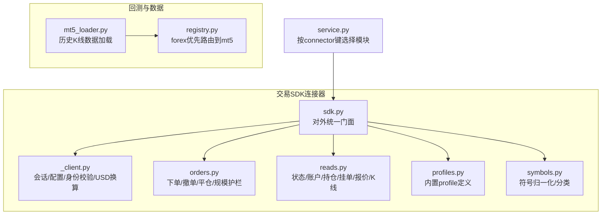
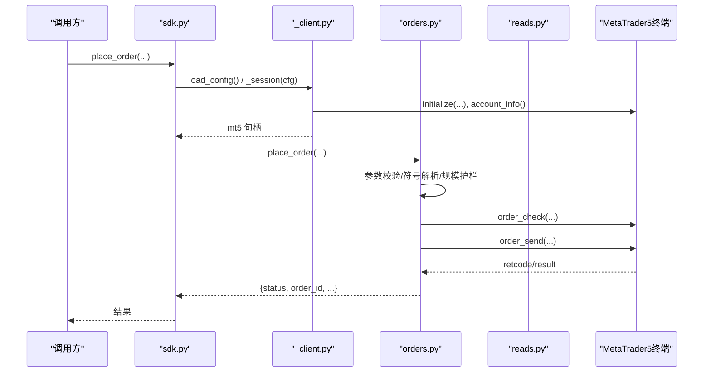
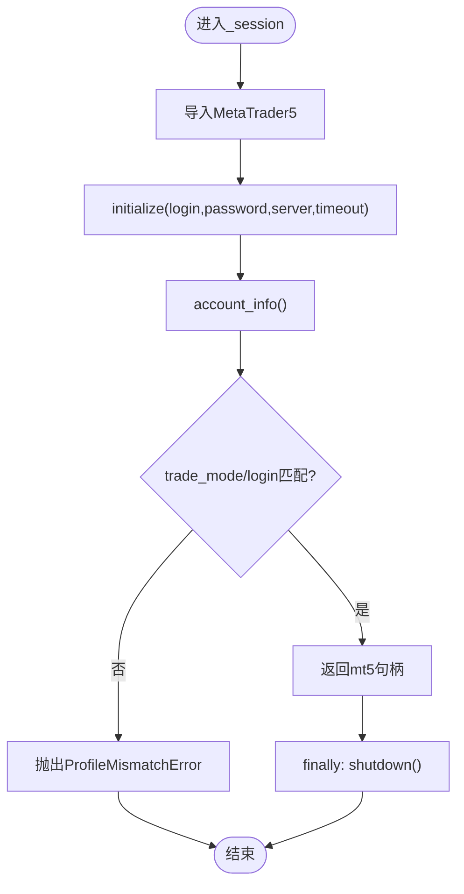
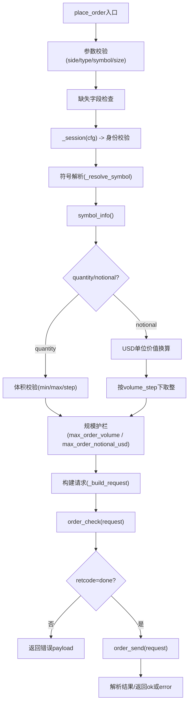
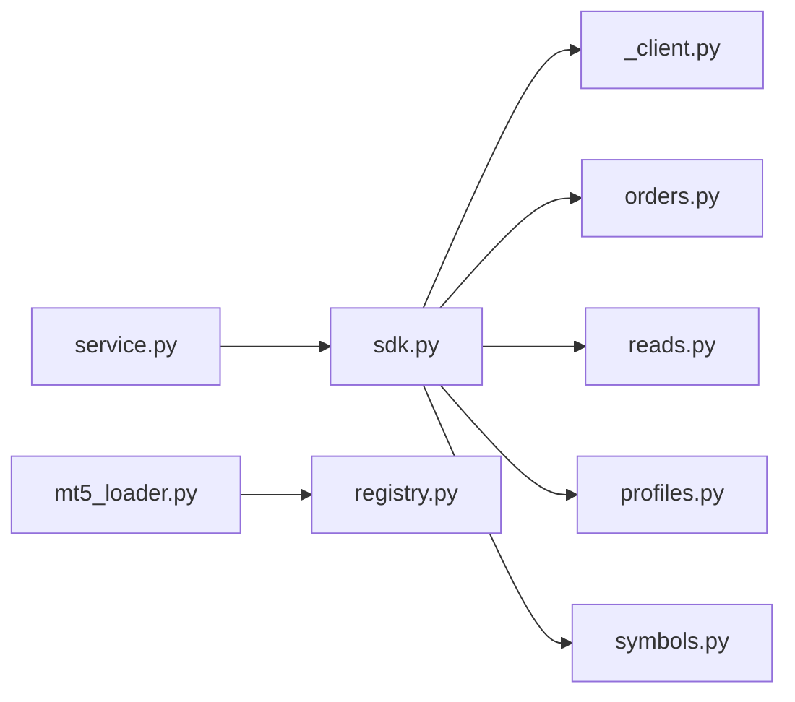

# MT5 连接器

<cite>
**本文引用的文件**
- [agent/backtest/loaders/mt5_loader.py](file://agent/backtest/loaders/mt5_loader.py)
- [agent/src/trading/connectors/mt5/__init__.py](file://agent/src/trading/connectors/mt5/__init__.py)
- [agent/src/trading/connectors/mt5/_client.py](file://agent/src/trading/connectors/mt5/_client.py)
- [agent/src/trading/connectors/mt5/orders.py](file://agent/src/trading/connectors/mt5/orders.py)
- [agent/src/trading/connectors/mt5/reads.py](file://agent/src/trading/connectors/mt5/reads.py)
- [agent/src/trading/connectors/mt5/symbols.py](file://agent/src/trading/connectors/mt5/symbols.py)
- [agent/src/trading/connectors/mt5/profiles.py](file://agent/src/trading/connectors/mt5/profiles.py)
- [agent/src/trading/service.py](file://agent/src/trading/service.py)
- [agent/backtest/loaders/registry.py](file://agent/backtest/loaders/registry.py)
- [README_zh.md](file://README_zh.md)
- [agent/tests/test_mt5_connector.py](file://agent/tests/test_mt5_connector.py)
</cite>

## 目录
1. [简介](#简介)
2. [项目结构](#项目结构)
3. [核心组件](#核心组件)
4. [架构总览](#架构总览)
5. [详细组件分析](#详细组件分析)
6. [依赖关系分析](#依赖关系分析)
7. [性能与可靠性](#性能与可靠性)
8. [故障排查指南](#故障排查指南)
9. [结论](#结论)
10. [附录：安装、配置与使用示例](#附录安装配置与使用示例)

## 简介
本文件面向 MT5（MetaTrader 5）连接器的实现与使用，覆盖本地终端连接、MQL5 生态集成点、外汇与期货/CFD 市场支持、账户身份校验、订单执行与风控护栏、历史数据获取、技术指标与回测集成等。连接器通过官方 Windows-only 的 MetaTrader5 Python 包与本地运行的 MT5 终端通信，提供“纸交易/实盘”双环境隔离、严格的账户身份校验、以及基于美元名义金额的下单规模护栏。

## 项目结构
MT5 连接器由“数据加载器”和“交易 SDK 连接器”两部分组成：
- 数据加载器：为回测与通用市场数据接口提供 OHLCV 历史数据，直接从本地 MT5 终端拉取。
- 交易 SDK 连接器：统一暴露 broker_sdk 风格的读/写接口（状态检查、账户快照、持仓、挂单、报价、历史 K 线、下单、平仓、撤单），并内置安全门控与 USD 计价换算。

图表来源
- [agent/backtest/loaders/mt5_loader.py:170-251](file://agent/backtest/loaders/mt5_loader.py#L170-L251)
- [agent/backtest/loaders/registry.py:149-155](file://agent/backtest/loaders/registry.py#L149-L155)
- [agent/src/trading/connectors/mt5/sdk.py:1-66](file://agent/src/trading/connectors/mt5/sdk.py#L1-L66)
- [agent/src/trading/connectors/mt5/_client.py:237-301](file://agent/src/trading/connectors/mt5/_client.py#L237-L301)
- [agent/src/trading/connectors/mt5/orders.py:59-158](file://agent/src/trading/connectors/mt5/orders.py#L59-L158)
- [agent/src/trading/connectors/mt5/reads.py:64-264](file://agent/src/trading/connectors/mt5/reads.py#L64-L264)
- [agent/src/trading/connectors/mt5/profiles.py:16-78](file://agent/src/trading/connectors/mt5/profiles.py#L16-L78)
- [agent/src/trading/connectors/mt5/symbols.py:29-77](file://agent/src/trading/connectors/mt5/symbols.py#L29-L77)
- [agent/src/trading/service.py:17-29](file://agent/src/trading/service.py#L17-L29)

章节来源
- [agent/backtest/loaders/mt5_loader.py:1-251](file://agent/backtest/loaders/mt5_loader.py#L1-L251)
- [agent/src/trading/connectors/mt5/sdk.py:1-66](file://agent/src/trading/connectors/mt5/sdk.py#L1-L66)
- [agent/src/trading/connectors/mt5/_client.py:1-380](file://agent/src/trading/connectors/mt5/_client.py#L1-L380)
- [agent/src/trading/connectors/mt5/orders.py:1-408](file://agent/src/trading/connectors/mt5/orders.py#L1-L408)
- [agent/src/trading/connectors/mt5/reads.py:1-301](file://agent/src/trading/connectors/mt5/reads.py#L1-L301)
- [agent/src/trading/connectors/mt5/symbols.py:1-77](file://agent/src/trading/connectors/mt5/symbols.py#L1-L77)
- [agent/src/trading/connectors/mt5/profiles.py:1-79](file://agent/src/trading/connectors/mt5/profiles.py#L1-L79)
- [agent/src/trading/service.py:17-29](file://agent/src/trading/service.py#L17-L29)
- [agent/backtest/loaders/registry.py:149-155](file://agent/backtest/loaders/registry.py#L149-L155)

## 核心组件
- 配置与会话管理：集中处理 mt5.json、进程级初始化、账户身份校验（trade_mode + login pin）、会话锁与自动关闭。
- 读取接口：状态检查、账户快照、持仓、挂单、报价、历史 K 线。
- 交易接口：下单（市价/限价）、撤单、按 ticket 平仓；内置 lot 与 USD 名义金额护栏。
- 符号与分类：符号归一化、后缀发现、外汇/CFD 分类，用于合规与限额。
- 回测数据加载：从本地终端拉取 OHLCV，兼容多种时间周期与符号别名。

章节来源
- [agent/src/trading/connectors/mt5/_client.py:54-127](file://agent/src/trading/connectors/mt5/_client.py#L54-L127)
- [agent/src/trading/connectors/mt5/reads.py:64-264](file://agent/src/trading/connectors/mt5/reads.py#L64-L264)
- [agent/src/trading/connectors/mt5/orders.py:42-158](file://agent/src/trading/connectors/mt5/orders.py#L42-L158)
- [agent/src/trading/connectors/mt5/symbols.py:29-77](file://agent/src/trading/connectors/mt5/symbols.py#L29-L77)
- [agent/backtest/loaders/mt5_loader.py:170-251](file://agent/backtest/loaders/mt5_loader.py#L170-L251)

## 架构总览
MT5 连接器采用“门面 + 子模块”的分层设计：
- sdk.py 作为门面，统一导出 broker_sdk 风格接口。
- _client.py 负责配置、会话生命周期、身份校验、USD 合约价值换算。
- orders.py 与 reads.py 分别封装写与读操作，均通过 _session 保证线程安全与身份一致。
- symbols.py 提供无 SDK 依赖的符号归一化与分类，供风控与指令门控使用。
- profiles.py 定义内置 profile（paper/live-readonly/paper-trade/live-trade）。
- 回测侧 mt5_loader.py 将 MT5 终端作为 forex/metals 历史数据源，并在 forex 数据链中优先尝试。

图表来源
- [agent/src/trading/connectors/mt5/sdk.py:11-39](file://agent/src/trading/connectors/mt5/sdk.py#L11-L39)
- [agent/src/trading/connectors/mt5/_client.py:237-301](file://agent/src/trading/connectors/mt5/_client.py#L237-L301)
- [agent/src/trading/connectors/mt5/orders.py:59-158](file://agent/src/trading/connectors/mt5/orders.py#L59-L158)

## 详细组件分析

### 配置与会话（_client.py）
- 配置文件：~/.vibe-trading/mt5.json，包含 login/password/server/terminal_path/profile/symbol_suffix/deviation_points/max_order_volume/max_order_notional_usd/timeout/readonly。
- 会话上下文：每个读写操作进入 _session，进行 initialize、account_info、身份校验（trade_mode 与 login pin），最后 shutdown。
- 身份守卫：paper 必须 DEMO，live 必须 REAL；contest 账户一律拒绝；login 不匹配直接拒绝。
- USD 合约价值换算：根据 base/profit 货币与当前 tick 中间价，计算 lots × contract_size 对应的 USD 名义值，用于风控与限额。

图表来源
- [agent/src/trading/connectors/mt5/_client.py:237-301](file://agent/src/trading/connectors/mt5/_client.py#L237-L301)

章节来源
- [agent/src/trading/connectors/mt5/_client.py:54-127](file://agent/src/trading/connectors/mt5/_client.py#L54-L127)
- [agent/src/trading/connectors/mt5/_client.py:237-380](file://agent/src/trading/connectors/mt5/_client.py#L237-L380)

### 读取接口（reads.py）
- check_status：检查 SDK 是否可用、配置是否完整、终端/账户身份是否匹配。
- get_account_snapshot：余额、净值、保证金、杠杆、交易模式等。
- get_positions：持仓列表，附带 market_value（USD 名义值，不可定价时为 None）。
- get_open_orders：挂单列表，可选近 7 天成交记录。
- get_quote：最新 tick（bid/ask/last/spread），对 last=0 的情况做过滤。
- get_historical_bars：最近 N 根 K 线，支持 1m/5m/15m/30m/1h/4h/1d/1w/1M。

章节来源
- [agent/src/trading/connectors/mt5/reads.py:64-264](file://agent/src/trading/connectors/mt5/reads.py#L64-L264)

### 交易接口（orders.py）
- place_order：支持市价与限价单；quantity（手）或 notional（USD）二选一；内置最小/最大手数、volume_step 下取整、max_order_volume 与 max_order_notional_usd 双重护栏。
- cancel_order：取消挂单或按 ticket 平仓（风险降低方向）。
- close_position：按 ticket 部分或全部平仓，限制不超过持仓量。
- 填充模式协商：根据 symbol filling_mode 选择 IOC/FOK/RETURN。
- 对冲账户注意：反向下单会开对冲仓，需按 ticket 平仓以减仓。

图表来源
- [agent/src/trading/connectors/mt5/orders.py:59-158](file://agent/src/trading/connectors/mt5/orders.py#L59-L158)
- [agent/src/trading/connectors/mt5/orders.py:228-334](file://agent/src/trading/connectors/mt5/orders.py#L228-L334)
- [agent/src/trading/connectors/mt5/_client.py:303-380](file://agent/src/trading/connectors/mt5/_client.py#L303-L380)

章节来源
- [agent/src/trading/connectors/mt5/orders.py:1-408](file://agent/src/trading/connectors/mt5/orders.py#L1-L408)

### 符号与分类（symbols.py）
- normalize_base：去除分隔符与 .FX 后缀，统一为大写。
- split_suffix：识别 Exness 风格后缀（如 m/z/c/raw），最长 4 字符。
- is_forex_pair：判断是否为外汇对（不含贵金属）。
- classify_mt5_symbol：外汇对归类为 FOREX/FOREX；其余（贵金属、指数/能源/加密 CFD、股票 CFD 等）归类为 CFD，需要显式允许。

章节来源
- [agent/src/trading/connectors/mt5/symbols.py:1-77](file://agent/src/trading/connectors/mt5/symbols.py#L1-L77)

### 回测数据加载（mt5_loader.py）
- DataLoader：注册为“mt5”，仅支持 forex 市场；is_available 要求 SDK 可导入且终端已 attach。
- 符号解析：优先精确匹配，其次基础名，再 symbols_get 前缀匹配（最短名称优先，Exness 风格确定性地选 EURUSDm）。
- 时间范围：UTC 时区转换，避免 naive datetime 导致的偏移问题。
- 数据映射：将结构化数组转为 DataFrame，tick_volume 作为 volume 代理，过滤空行并校验 OHLC。

章节来源
- [agent/backtest/loaders/mt5_loader.py:61-167](file://agent/backtest/loaders/mt5_loader.py#L61-L167)
- [agent/backtest/loaders/mt5_loader.py:170-251](file://agent/backtest/loaders/mt5_loader.py#L170-L251)

### 数据链路与优先级（registry.py）
- forex 数据源链：mt5 → akshare → yfinance → local。当本地 MT5 终端可用时优先使用，否则降级到其他数据源。

章节来源
- [agent/backtest/loaders/registry.py:149-155](file://agent/backtest/loaders/registry.py#L149-L155)

### 服务路由（service.py）
- 通过 connector 键选择对应 SDK 模块，mt5 对应 src.trading.connectors.mt5.sdk。

章节来源
- [agent/src/trading/service.py:17-29](file://agent/src/trading/service.py#L17-L29)

## 依赖关系分析
- 平台与依赖：Windows-only，需安装 MetaTrader5 Python 包（可选 extra）。
- 进程全局：MetaTrader5 API 为进程级状态，所有操作通过 _session 串行化，避免并发冲突。
- 外部系统：本地 MT5 终端（已登录至指定服务器），券商端符号命名（含后缀）。
- 内部耦合：
  - sdk.py 聚合 _client/orders/reads/profiles/symbols。
  - orders/reads 强依赖 _client 的会话与工具函数。
  - 回测 loader 与交易连接器共享 mt5.json 配置路径，但 loader 不导入连接器以避免循环依赖。

图表来源
- [agent/src/trading/service.py:17-29](file://agent/src/trading/service.py#L17-L29)
- [agent/src/trading/connectors/mt5/sdk.py:11-39](file://agent/src/trading/connectors/mt5/sdk.py#L11-L39)
- [agent/backtest/loaders/mt5_loader.py:170-251](file://agent/backtest/loaders/mt5_loader.py#L170-L251)
- [agent/backtest/loaders/registry.py:149-155](file://agent/backtest/loaders/registry.py#L149-L155)

章节来源
- [agent/src/trading/connectors/mt5/_client.py:225-273](file://agent/src/trading/connectors/mt5/_client.py#L225-L273)
- [agent/backtest/loaders/mt5_loader.py:1-20](file://agent/backtest/loaders/mt5_loader.py#L1-L20)

## 性能与可靠性
- 性能
  - 终端 attach 可能耗时，模块内缓存初始化状态以减少重复开销。
  - 历史数据拉取受限于终端“图表最大K线数”设置。
  - 符号解析与时间框架映射在模块内缓存/映射，减少重复计算。
- 可靠性
  - 所有异常被捕获并返回 fail-closed 的错误 payload，避免中断上层流程。
  - 每笔订单先 order_check 再 order_send，提前拦截无效请求。
  - 规模护栏（lot 上限、USD 名义上限）在 demo 与 live 均生效。
  - 身份守卫每次会话重新验证 trade_mode 与 login，防止误配。

[本节为通用指导，不直接分析具体文件]

## 故障排查指南
- 无法导入 MetaTrader5：确认已安装可选依赖并在 Windows 环境运行。
- 终端未运行或未登录：检查 initialize 返回值与 last_error；确保 server/login/password 正确。
- 账户类型不匹配：paper 必须 DEMO，live 必须 REAL；contest 账户一律拒绝。
- 符号不存在：确认 broker 提供的符号名称与后缀（如 EURUSDm），必要时调整 symbol_suffix。
- 下单失败：检查 order_check 返回码与 comment；核对 filling_mode、deviation、价格与流动性。
- 历史数据为空：检查终端“最大K线数”设置与时间范围；确认 UTC 时间戳与区间边界。

章节来源
- [agent/src/trading/connectors/mt5/_client.py:173-191](file://agent/src/trading/connectors/mt5/_client.py#L173-L191)
- [agent/src/trading/connectors/mt5/_client.py:237-301](file://agent/src/trading/connectors/mt5/_client.py#L237-L301)
- [agent/src/trading/connectors/mt5/orders.py:139-158](file://agent/src/trading/connectors/mt5/orders.py#L139-L158)
- [agent/backtest/loaders/mt5_loader.py:239-251](file://agent/backtest/loaders/mt5_loader.py#L239-L251)

## 结论
MT5 连接器以严格的安全与一致性为核心：进程级会话管理、账户身份双向校验、USD 名义金额护栏、以及对 MT5 对冲账户行为的适配。它既可作为回测的历史数据源（优先使用本地终端的真实符号与交易时段），也可作为实盘交易的桥接层，配合 mandate 与 kill switch 实现稳健的风控闭环。对于外汇与 CFD 市场，连接器提供了符号分类、点差与报价读取、以及基于 tick 的价格与名义金额计算能力。

[本节为总结性内容，不直接分析具体文件]

## 附录：安装、配置与使用示例

- 安装要求
  - 操作系统：Windows
  - 依赖：安装可选额外包以启用 MT5 支持
  - 终端：本地运行已登录的 MT5 终端

- 配置文件位置与字段
  - 路径：~/.vibe-trading/mt5.json
  - 关键字段：login、password、server、terminal_path、profile、symbol_suffix、deviation_points、max_order_volume、max_order_notional_usd、timeout、readonly

- 常用命令（CLI）
  - 选择 profile：vibe-trading connector use mt5-paper-sdk
  - 检查连接：vibe-trading connector check
  - 查看账户：vibe-trading connector account
  - 获取报价：vibe-trading connector quote EURUSD
  - 获取历史：vibe-trading connector history EURUSD

- 典型工作流
  - 连接 MT5 终端：通过 _client._session 完成 initialize 与身份校验。
  - 获取历史数据：使用 reads.get_historical_bars 或 backtest 的 mt5_loader。
  - 执行订单：使用 orders.place_order，传入 quantity 或 notional，并遵守护栏。
  - 技术分析：通过 reads.get_quote 获取 bid/ask/spread，结合历史 K 线进行指标计算。
  - EA/自定义指标/回测：MT5 终端本身支持 EA 与自定义指标；本项目通过本地终端获取真实符号与交易时段的历史数据，使回测更贴近实际。

章节来源
- [README_zh.md:1171-1201](file://README_zh.md#L1171-L1201)
- [agent/src/trading/connectors/mt5/profiles.py:16-78](file://agent/src/trading/connectors/mt5/profiles.py#L16-L78)
- [agent/src/trading/connectors/mt5/_client.py:54-127](file://agent/src/trading/connectors/mt5/_client.py#L54-L127)
- [agent/src/trading/connectors/mt5/reads.py:211-264](file://agent/src/trading/connectors/mt5/reads.py#L211-L264)
- [agent/src/trading/connectors/mt5/orders.py:59-158](file://agent/src/trading/connectors/mt5/orders.py#L59-L158)
- [agent/backtest/loaders/mt5_loader.py:170-251](file://agent/backtest/loaders/mt5_loader.py#L170-L251)