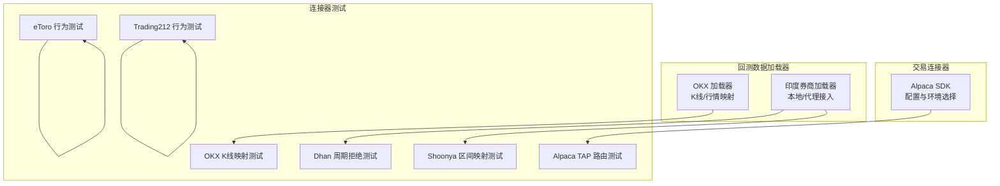
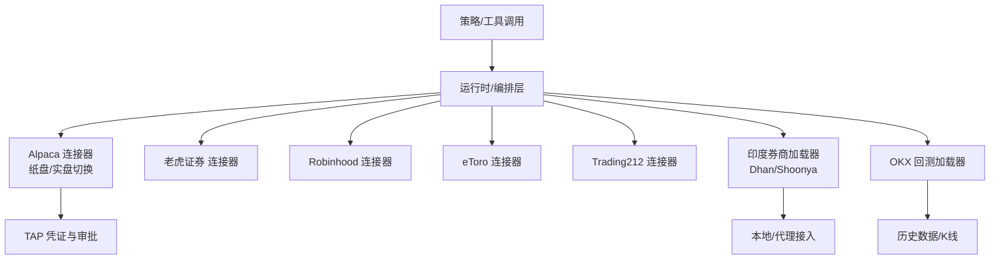
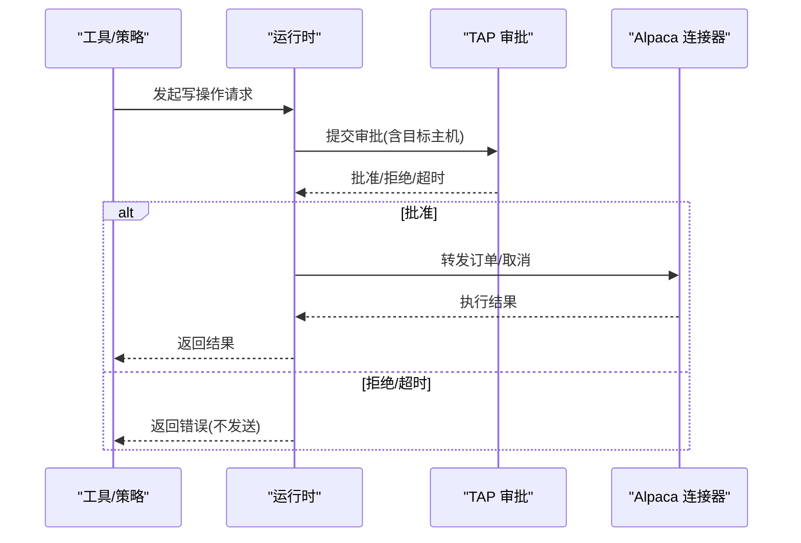
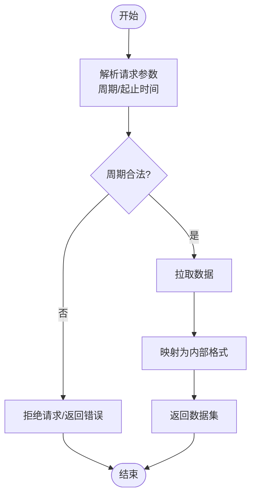
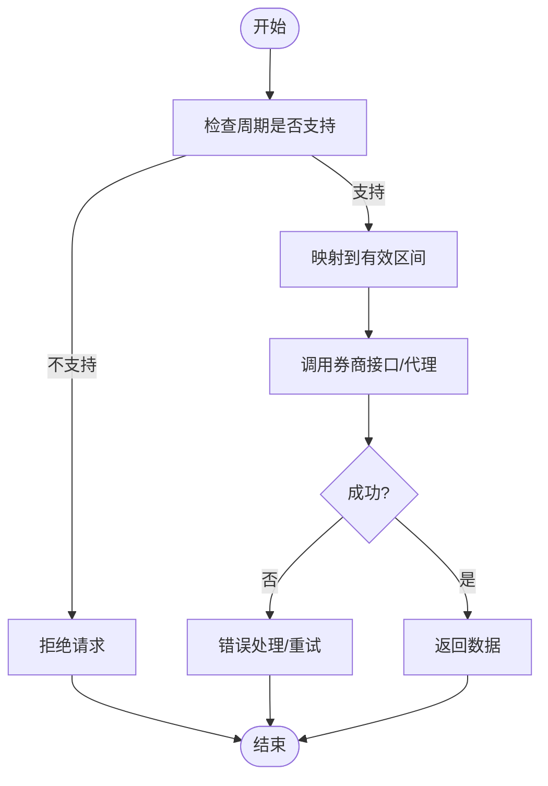
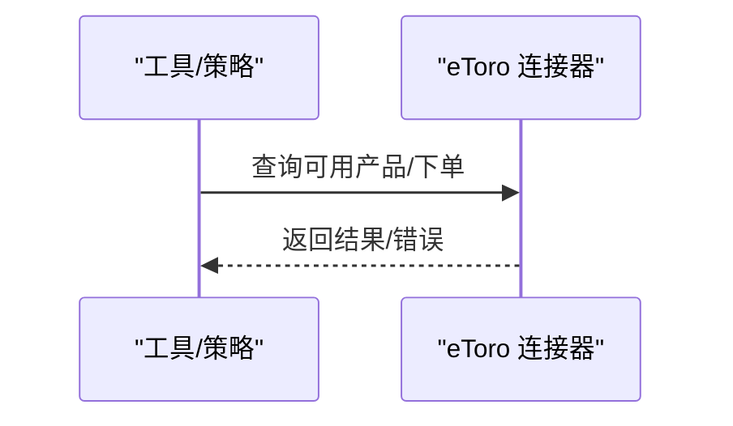
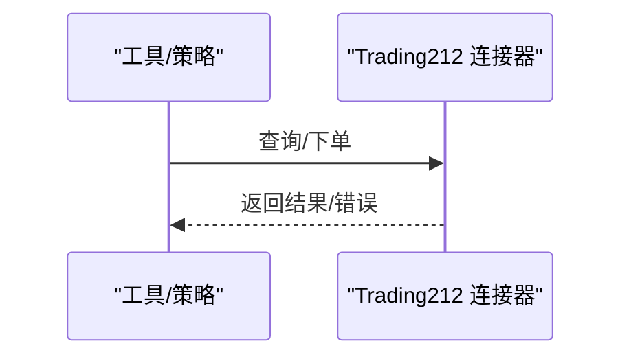
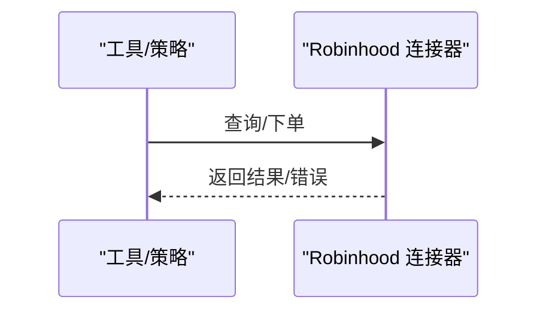
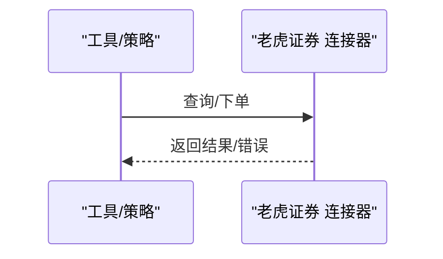
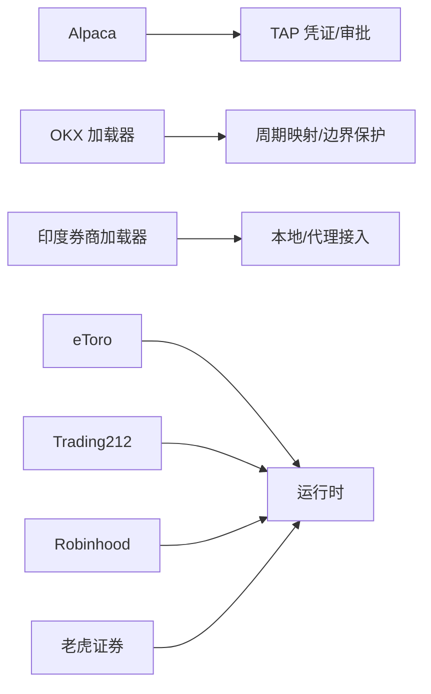

# 其他连接器

<cite>
**本文引用的文件**
- [alpaca/sdk.py](file://agent/src/trading/connectors/alpaca/sdk.py)
- [README.md](file://README.md)
- [okx.py](file://agent/backtest/loaders/okx.py)
- [india_broker_loader.py](file://agent/backtest/loaders/india_broker_loader.py)
- [test_etoro_connector.py](file://agent/tests/test_etoro_connector.py)
- [test_trading212_connector.py](file://agent/tests/test_trading212_connector.py)
- [test_dhan_period_reject.py](file://agent/tests/test_dhan_period_reject.py)
- [test_shoonya_interval_map.py](file://agent/tests/test_shoonya_interval_map.py)
- [test_alpaca_tap_routing.py](file://agent/tests/test_alpaca_tap_routing.py)
- [test_okx_bar_map.py](file://agent/tests/test_okx_bar_map.py)
</cite>

## 目录
1. [简介](#简介)
2. [项目结构](#项目结构)
3. [核心组件](#核心组件)
4. [架构总览](#架构总览)
5. [详细组件分析](#详细组件分析)
6. [依赖关系分析](#依赖关系分析)
7. [性能注意事项](#性能注意事项)
8. [故障排查指南](#故障排查指南)
9. [结论](#结论)
10. [附录](#附录)

## 简介
本章节面向“其他内置连接器”，聚焦 Alpaca、老虎证券（Tiger）、OKX、eToro、Robinhood、Dhan、Shoonya、Trading212 等连接器的实现特点与使用方法。文档从市场定位、特色功能、配置差异入手，结合代码库中的实际测试与加载器实现，给出初始化配置要点、认证方式、API 限制与错误处理策略，并重点说明区域性市场的适配方案：印度市场（Dhan、Shoonya）、欧洲市场（Trading212）与美国市场（Alpaca、Robinhood）。

## 项目结构
围绕这些连接器的关键代码分布在以下位置：
- 交易连接器与配置：Alpaca 的 SDK 封装位于 trading/connectors/alpaca/sdk.py，包含环境选择、数据源与只读模式等配置项。
- 回测数据加载器：OKX 的回测数据加载器位于 backtest/loaders/okx.py；印度券商数据加载器位于 backtest/loaders/india_broker_loader.py。
- 连接器行为验证：针对 eToro、Trading212、Dhan、Shoonya、Alpaca、OKX 的测试用例覆盖区间映射、周期拒绝、路由与行为约束等。

图表来源
- [alpaca/sdk.py:65-83](file://agent/src/trading/connectors/alpaca/sdk.py#L65-L83)
- [okx.py](file://agent/backtest/loaders/okx.py)
- [india_broker_loader.py](file://agent/backtest/loaders/india_broker_loader.py)
- [test_etoro_connector.py](file://agent/tests/test_etoro_connector.py)
- [test_trading212_connector.py](file://agent/tests/test_trading212_connector.py)
- [test_dhan_period_reject.py](file://agent/tests/test_dhan_period_reject.py)
- [test_shoonya_interval_map.py](file://agent/tests/test_shoonya_interval_map.py)
- [test_alpaca_tap_routing.py](file://agent/tests/test_alpaca_tap_routing.py)
- [test_okx_bar_map.py](file://agent/tests/test_okx_bar_map.py)

章节来源
- [alpaca/sdk.py:65-83](file://agent/src/trading/connectors/alpaca/sdk.py#L65-L83)
- [okx.py](file://agent/backtest/loaders/okx.py)
- [india_broker_loader.py](file://agent/backtest/loaders/india_broker_loader.py)
- [test_etoro_connector.py](file://agent/tests/test_etoro_connector.py)
- [test_trading212_connector.py](file://agent/tests/test_trading212_connector.py)
- [test_dhan_period_reject.py](file://agent/tests/test_dhan_period_reject.py)
- [test_shoonya_interval_map.py](file://agent/tests/test_shoonya_interval_map.py)
- [test_alpaca_tap_routing.py](file://agent/tests/test_alpaca_tap_routing.py)
- [test_okx_bar_map.py](file://agent/tests/test_okx_bar_map.py)

## 核心组件
- Alpaca 连接器
  - 市场定位：美国股票与期权经纪商，支持纸盘与实盘切换，提供独立的市场数据主机。
  - 特色功能：通过 TAP 凭证进行密钥管理，支持 paper/live 环境隔离；数据与交易使用不同主机但共享凭据集合；默认只读层避免误下单。
  - 配置差异：profile 控制环境（paper/live-readonly/live），feed 控制数据源（iex/sip），timeout 控制网络超时。
- OKX 回测加载器
  - 市场定位：加密货币交易所，用于回测阶段拉取历史 K 线与行情。
  - 特色功能：对时间粒度与周期映射进行严格校验与边界保护，确保回测稳定性。
- 印度券商加载器（Dhan/Shoonya）
  - 市场定位：印度股票市场，适配本地券商接口或代理。
  - 特色功能：周期拒绝与区间映射逻辑，保证在印度市场特有的交易时段与合约规则下稳定运行。
- eToro 连接器
  - 市场定位：全球零售交易平台，支持多资产类别。
  - 特色功能：通过测试用例验证其订单与账户行为的合规性。
- Trading212 连接器
  - 市场定位：欧洲零售交易平台，强调区域合规与产品范围。
  - 特色功能：通过测试用例验证其行为与限制。
- Robinhood 连接器
  - 市场定位：美国零售券商，常用于美股交易。
  - 特色功能：在系统内以工具或连接器形式集成，受统一安全与审批流程约束。
- 老虎证券（Tiger）连接器
  - 市场定位：跨境券商，覆盖美股、港股等。
  - 特色功能：通过测试用例验证其在小时级周期等场景下的行为一致性。

章节来源
- [alpaca/sdk.py:65-83](file://agent/src/trading/connectors/alpaca/sdk.py#L65-L83)
- [okx.py](file://agent/backtest/loaders/okx.py)
- [india_broker_loader.py](file://agent/backtest/loaders/india_broker_loader.py)
- [test_etoro_connector.py](file://agent/tests/test_etoro_connector.py)
- [test_trading212_connector.py](file://agent/tests/test_trading212_connector.py)
- [test_dhan_period_reject.py](file://agent/tests/test_dhan_period_reject.py)
- [test_shoonya_interval_map.py](file://agent/tests/test_shoonya_interval_map.py)
- [test_alpaca_tap_routing.py](file://agent/tests/test_alpaca_tap_routing.py)
- [test_okx_bar_map.py](file://agent/tests/test_okx_bar_map.py)

## 架构总览
下图展示了各连接器在系统中的角色与交互：Alpaca 通过 TAP 凭证进行鉴权与审批转发；OKX 作为回测数据源参与策略研究；印度券商加载器负责本地/代理接入；eToro、Trading212、Robinhood、老虎证券分别对接各自平台能力，并通过统一的工具与运行时进行编排。

图表来源
- [alpaca/sdk.py:65-83](file://agent/src/trading/connectors/alpaca/sdk.py#L65-L83)
- [okx.py](file://agent/backtest/loaders/okx.py)
- [india_broker_loader.py](file://agent/backtest/loaders/india_broker_loader.py)
- [test_alpaca_tap_routing.py](file://agent/tests/test_alpaca_tap_routing.py)

## 详细组件分析

### Alpaca 连接器
- 市场定位与特色
  - 美国市场主流零售券商，支持纸盘与实盘环境分离，提供独立的数据主机。
  - 通过 TAP 凭证集中管理 key_id 与 secret_key，并对 allowed_hosts 做严格绑定，防止跨环境泄露。
  - 默认只读层，避免意外下单；写操作需经 TAP 审批通道放行。
- 初始化配置要点
  - 环境变量与配置文件：通过 TAP 代理与 Agent Key 建立连接；可选指定 TAP_ALPACA_CREDENTIAL 以区分纸盘/实盘凭据。
  - 配置项：profile（paper/live-readonly/live）、feed（iex/sip）、timeout（秒）。
- 认证方式
  - 基于 TAP 的多密文凭证，允许 hosts 白名单限制；纸盘与实盘建议使用不同凭据名。
- API 限制与错误处理
  - 数据与交易主机分离，需在凭据中同时允许 data.alpaca.markets 与对应交易主机。
  - 未安装依赖或配置缺失会抛出特定异常类型，便于上层捕获与降级。
- 典型调用序列（概念化）

图表来源
- [alpaca/sdk.py:65-83](file://agent/src/trading/connectors/alpaca/sdk.py#L65-L83)
- [README.md:1430-1452](file://README.md#L1430-L1452)
- [test_alpaca_tap_routing.py](file://agent/tests/test_alpaca_tap_routing.py)

章节来源
- [alpaca/sdk.py:65-83](file://agent/src/trading/connectors/alpaca/sdk.py#L65-L83)
- [README.md:1430-1452](file://README.md#L1430-L1452)
- [test_alpaca_tap_routing.py](file://agent/tests/test_alpaca_tap_routing.py)

### OKX 回测加载器
- 市场定位与特色
  - 加密货币回测数据源，提供 K 线与行情数据。
  - 对时间粒度与周期映射进行严格校验，避免非法区间导致回测失败。
- 初始化配置要点
  - 通过加载器注册表与参数传入目标周期、起止时间与数据源选项。
- API 限制与错误处理
  - 对不支持的周期或越界请求进行拒绝与边界保护，保障回测稳定性。
- 典型流程图（概念化）

图表来源
- [okx.py](file://agent/backtest/loaders/okx.py)
- [test_okx_bar_map.py](file://agent/tests/test_okx_bar_map.py)

章节来源
- [okx.py](file://agent/backtest/loaders/okx.py)
- [test_okx_bar_map.py](file://agent/tests/test_okx_bar_map.py)

### 印度市场连接器（Dhan、Shoonya）
- 市场定位与特色
  - 印度股票市场具有独特的交易时段、合约规则与结算机制。
  - 通过印度券商加载器统一接入，支持本地或代理访问，屏蔽底层差异。
- 初始化配置要点
  - 根据所选券商设置接入地址、认证信息与代理参数。
- API 限制与错误处理
  - 对不支持的周期进行拒绝，避免无效请求；对区间映射进行规范化处理。
- 典型流程图（概念化）

图表来源
- [india_broker_loader.py](file://agent/backtest/loaders/india_broker_loader.py)
- [test_dhan_period_reject.py](file://agent/tests/test_dhan_period_reject.py)
- [test_shoonya_interval_map.py](file://agent/tests/test_shoonya_interval_map.py)

章节来源
- [india_broker_loader.py](file://agent/backtest/loaders/india_broker_loader.py)
- [test_dhan_period_reject.py](file://agent/tests/test_dhan_period_reject.py)
- [test_shoonya_interval_map.py](file://agent/tests/test_shoonya_interval_map.py)

### eToro 连接器
- 市场定位与特色
  - 全球零售交易平台，支持多资产类别与社交交易生态。
  - 通过测试用例验证订单与账户行为的一致性。
- 初始化配置要点
  - 依据平台要求配置认证信息、沙箱/生产环境与速率限制。
- API 限制与错误处理
  - 遵循平台限频与产品可用性规则，对不可用产品进行过滤与提示。
- 典型调用序列（概念化）

图表来源
- [test_etoro_connector.py](file://agent/tests/test_etoro_connector.py)

章节来源
- [test_etoro_connector.py](file://agent/tests/test_etoro_connector.py)

### Trading212 连接器
- 市场定位与特色
  - 欧洲零售交易平台，强调区域合规与产品范围。
  - 通过测试用例验证其行为与限制。
- 初始化配置要点
  - 配置地区、产品范围与认证信息。
- API 限制与错误处理
  - 对非欧洲市场产品进行拒绝，遵循平台合规策略。
- 典型调用序列（概念化）

图表来源
- [test_trading212_connector.py](file://agent/tests/test_trading212_connector.py)

章节来源
- [test_trading212_connector.py](file://agent/tests/test_trading212_connector.py)

### Robinhood 连接器
- 市场定位与特色
  - 美国零售券商，常用于美股交易。
  - 在系统内以工具或连接器形式集成，受统一安全与审批流程约束。
- 初始化配置要点
  - 配置认证信息、沙箱/生产环境与速率限制。
- API 限制与错误处理
  - 遵循平台限频与产品可用性规则，对不可用产品进行过滤与提示。
- 典型调用序列（概念化）

图表来源
- [test_default_deny_unknown_robinhood_tool.py](file://agent/tests/test_default_deny_unknown_robinhood_tool.py)

章节来源
- [test_default_deny_unknown_robinhood_tool.py](file://agent/tests/test_default_deny_unknown_robinhood_tool.py)

### 老虎证券（Tiger）连接器
- 市场定位与特色
  - 跨境券商，覆盖美股、港股等。
  - 通过测试用例验证其在小时级周期等场景下的行为一致性。
- 初始化配置要点
  - 配置认证信息、市场与周期映射。
- API 限制与错误处理
  - 对不支持的周期进行拒绝与转换，确保回测/实盘一致性。
- 典型调用序列（概念化）

图表来源
- [test_tiger_period_hour_case.py](file://agent/tests/test_tiger_period_hour_case.py)

章节来源
- [test_tiger_period_hour_case.py](file://agent/tests/test_tiger_period_hour_case.py)

## 依赖关系分析
- Alpaca 依赖 TAP 凭证与审批通道，数据与交易主机分离，需同时允许相关域名。
- OKX 作为回测数据源，依赖加载器的周期映射与边界保护。
- 印度券商加载器依赖本地/代理接入，对周期与区间进行规范化。
- eToro、Trading212、Robinhood、老虎证券均通过统一运行时接入，遵循平台限制与合规策略。

图表来源
- [alpaca/sdk.py:65-83](file://agent/src/trading/connectors/alpaca/sdk.py#L65-L83)
- [okx.py](file://agent/backtest/loaders/okx.py)
- [india_broker_loader.py](file://agent/backtest/loaders/india_broker_loader.py)
- [test_etoro_connector.py](file://agent/tests/test_etoro_connector.py)
- [test_trading212_connector.py](file://agent/tests/test_trading212_connector.py)
- [test_tiger_period_hour_case.py](file://agent/tests/test_tiger_period_hour_case.py)

章节来源
- [alpaca/sdk.py:65-83](file://agent/src/trading/connectors/alpaca/sdk.py#L65-L83)
- [okx.py](file://agent/backtest/loaders/okx.py)
- [india_broker_loader.py](file://agent/backtest/loaders/india_broker_loader.py)
- [test_etoro_connector.py](file://agent/tests/test_etoro_connector.py)
- [test_trading212_connector.py](file://agent/tests/test_trading212_connector.py)
- [test_tiger_period_hour_case.py](file://agent/tests/test_tiger_period_hour_case.py)

## 性能注意事项
- 合理设置超时与重试策略，避免长时间阻塞。
- 对高频数据源（如 OKX）进行批量拉取与缓存，减少重复请求。
- 对印度市场与欧洲市场的特殊时段与产品范围进行预检，降低无效请求。
- 使用只读模式进行研究与回测，仅在必要时启用写操作并经过审批。

## 故障排查指南
- Alpaca
  - 现象：无法连接或权限不足
  - 排查：确认 TAP 凭据名称与 allowed_hosts 是否正确；检查纸盘/实盘环境是否匹配。
  - 参考：[README.md:1430-1452](file://README.md#L1430-L1452)、[alpaca/sdk.py:65-83](file://agent/src/trading/connectors/alpaca/sdk.py#L65-L83)
- OKX
  - 现象：回测失败或数据为空
  - 排查：检查周期映射是否合法；查看边界保护与拒绝逻辑。
  - 参考：[test_okx_bar_map.py](file://agent/tests/test_okx_bar_map.py)
- 印度市场（Dhan/Shoonya）
  - 现象：周期不被支持或区间映射异常
  - 排查：确认周期拒绝与映射逻辑；检查代理配置与网络连通性。
  - 参考：[test_dhan_period_reject.py](file://agent/tests/test_dhan_period_reject.py)、[test_shoonya_interval_map.py](file://agent/tests/test_shoonya_interval_map.py)
- eToro/Trading212/Robinhood/老虎证券
  - 现象：产品不可用或行为不一致
  - 排查：核对平台产品范围与区域限制；检查周期与时间粒度映射。
  - 参考：[test_etoro_connector.py](file://agent/tests/test_etoro_connector.py)、[test_trading212_connector.py](file://agent/tests/test_trading212_connector.py)、[test_tiger_period_hour_case.py](file://agent/tests/test_tiger_period_hour_case.py)

章节来源
- [README.md:1430-1452](file://README.md#L1430-L1452)
- [alpaca/sdk.py:65-83](file://agent/src/trading/connectors/alpaca/sdk.py#L65-L83)
- [test_okx_bar_map.py](file://agent/tests/test_okx_bar_map.py)
- [test_dhan_period_reject.py](file://agent/tests/test_dhan_period_reject.py)
- [test_shoonya_interval_map.py](file://agent/tests/test_shoonya_interval_map.py)
- [test_etoro_connector.py](file://agent/tests/test_etoro_connector.py)
- [test_trading212_connector.py](file://agent/tests/test_trading212_connector.py)
- [test_tiger_period_hour_case.py](file://agent/tests/test_tiger_period_hour_case.py)

## 结论
本仓库为多种内置连接器提供了统一的接入与编排能力。Alpaca 通过 TAP 凭证与审批通道实现安全的纸盘/实盘切换；OKX 作为回测数据源具备严格的周期映射与边界保护；印度市场连接器针对本地特性进行了周期拒绝与区间映射；eToro、Trading212、Robinhood、老虎证券则遵循各自平台的区域与产品限制。建议在研究与回测阶段优先使用只读模式，并在实盘中启用审批与限流策略，以确保系统的安全性与稳定性。

## 附录
- 配置清单（示例路径）
  - Alpaca：TAP_PROXY_URL、TAP_AGENT_KEY、TAP_ALPACA_CREDENTIAL、TAP_APPROVAL_TIMEOUT
  - OKX：加载器参数（周期、起止时间、数据源选项）
  - 印度券商：接入地址、认证信息、代理参数
  - eToro/Trading212/Robinhood/老虎证券：认证信息、市场与周期映射、速率限制

章节来源
- [README.md:1430-1452](file://README.md#L1430-L1452)
- [alpaca/sdk.py:65-83](file://agent/src/trading/connectors/alpaca/sdk.py#L65-L83)
- [okx.py](file://agent/backtest/loaders/okx.py)
- [india_broker_loader.py](file://agent/backtest/loaders/india_broker_loader.py)
- [test_etoro_connector.py](file://agent/tests/test_etoro_connector.py)
- [test_trading212_connector.py](file://agent/tests/test_trading212_connector.py)
- [test_dhan_period_reject.py](file://agent/tests/test_dhan_period_reject.py)
- [test_shoonya_interval_map.py](file://agent/tests/test_shoonya_interval_map.py)
- [test_alpaca_tap_routing.py](file://agent/tests/test_alpaca_tap_routing.py)
- [test_okx_bar_map.py](file://agent/tests/test_okx_bar_map.py)