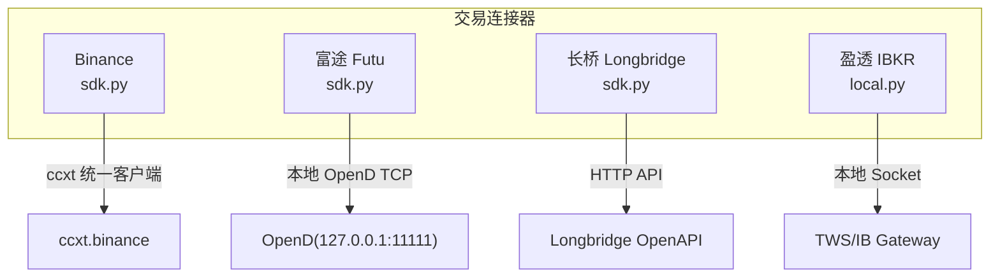
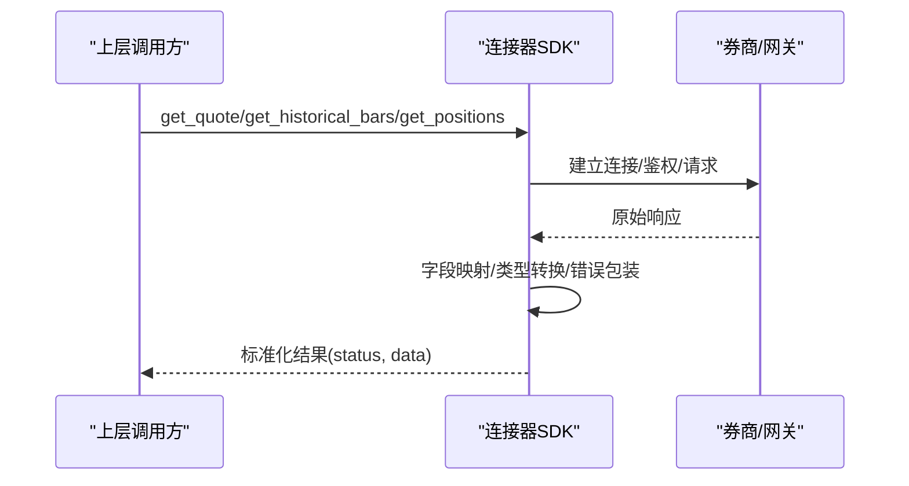
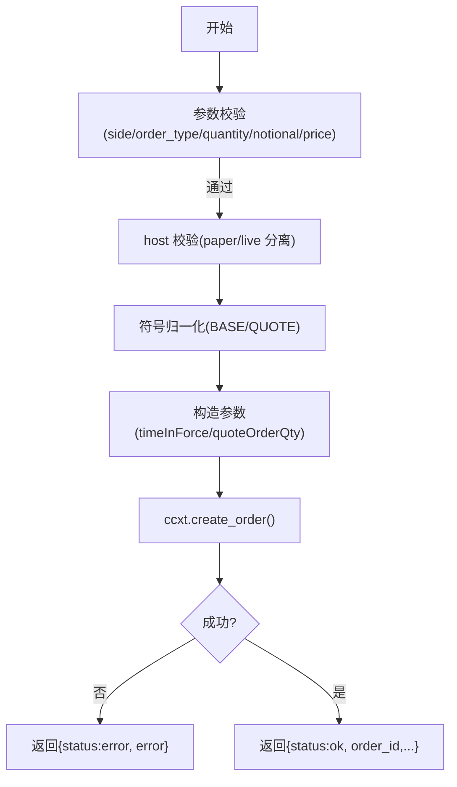
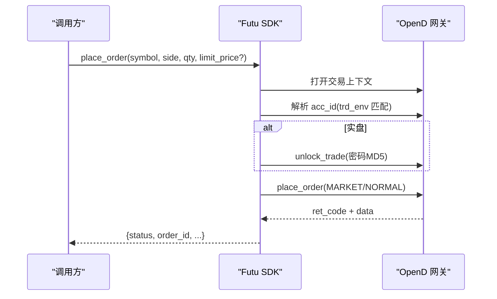
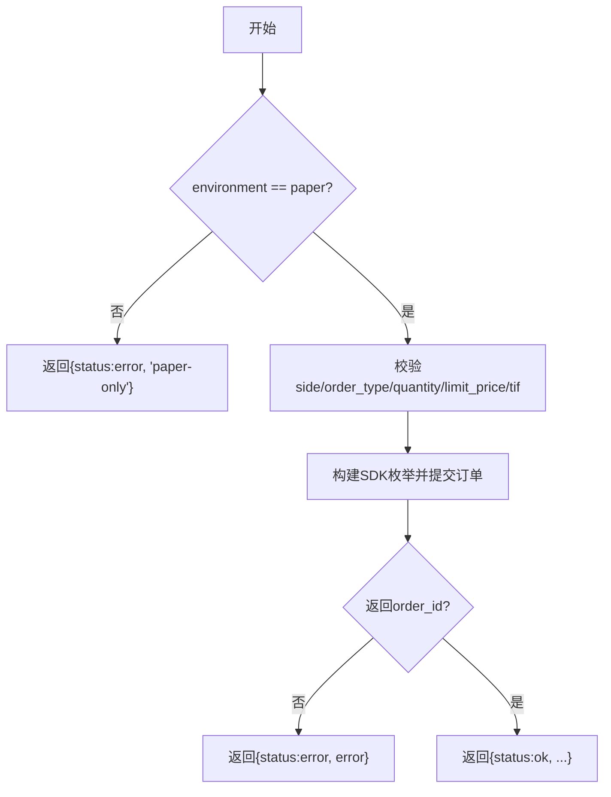
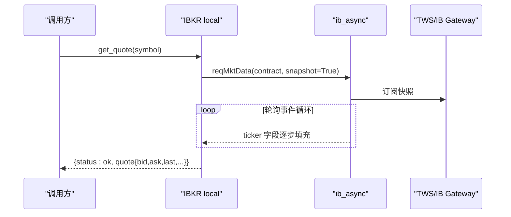
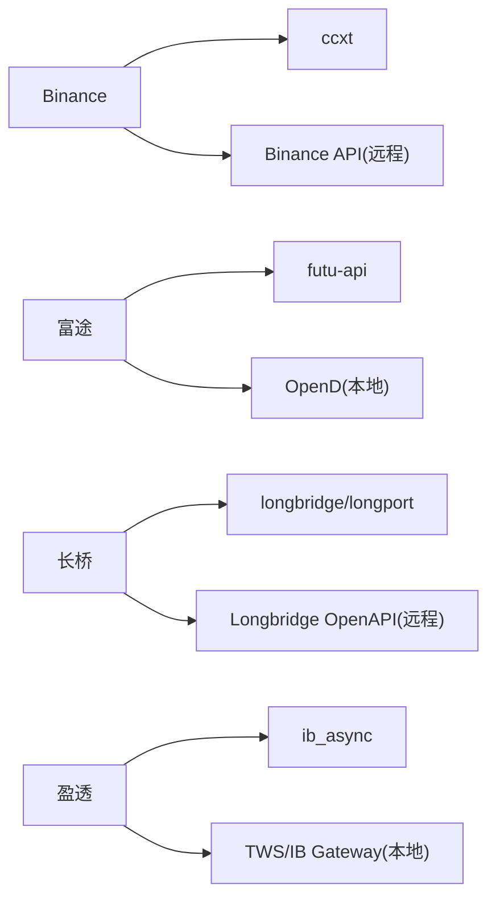

# 内置连接器

<cite>
**本文引用的文件**
- [agent/src/trading/connectors/binance/sdk.py](file://agent/src/trading/connectors/binance/sdk.py)
- [agent/src/trading/connectors/futu/sdk.py](file://agent/src/trading/connectors/futu/sdk.py)
- [agent/src/trading/connectors/longbridge/sdk.py](file://agent/src/trading/connectors/longbridge/sdk.py)
- [agent/src/trading/connectors/ibkr/local.py](file://agent/src/trading/connectors/ibkr/local.py)
</cite>

## 目录
1. [简介](#简介)
2. [项目结构](#项目结构)
3. [核心组件](#核心组件)
4. [架构总览](#架构总览)
5. [详细组件分析](#详细组件分析)
6. [依赖关系分析](#依赖关系分析)
7. [性能与重试](#性能与重试)
8. [故障排查指南](#故障排查指南)
9. [结论](#结论)
10. [附录：配置与使用示例](#附录配置与使用示例)

## 简介
本章节面向 Vibe-Trading 的内置券商/数据连接器，聚焦 Binance（加密货币现货）、富途（Futu，本地 OpenD）、长桥（Longbridge，OpenAPI）和盈透（IBKR，本地 TWS/IB Gateway）四大连接器的实现细节。文档将说明各连接器的认证方式、API 限制、功能差异、参数配置、错误处理、性能优化策略与重试机制，并给出常见连接问题与调试技巧，以及不同市场的特殊处理方案。

## 项目结构
Vibe-Trading 的交易连接器位于 agent/src/trading/connectors 下，每个券商一个子目录，内部通常包含：
- sdk.py：封装对券商 SDK 或统一客户端的调用，暴露统一的读/写接口
- profiles.py / classification.py：用于配置与分类
- 其他辅助模块（如 credentials、client、trading 等）

**图示来源**
- [agent/src/trading/connectors/binance/sdk.py:628-640](file://agent/src/trading/connectors/binance/sdk.py#L628-L640)
- [agent/src/trading/connectors/futu/sdk.py:682-703](file://agent/src/trading/connectors/futu/sdk.py#L682-L703)
- [agent/src/trading/connectors/longbridge/sdk.py:640-677](file://agent/src/trading/connectors/longbridge/sdk.py#L640-L677)
- [agent/src/trading/connectors/ibkr/local.py:452-483](file://agent/src/trading/connectors/ibkr/local.py#L452-L483)

**章节来源**
- [agent/src/trading/connectors/binance/sdk.py:1-782](file://agent/src/trading/connectors/binance/sdk.py#L1-L782)
- [agent/src/trading/connectors/futu/sdk.py:1-927](file://agent/src/trading/connectors/futu/sdk.py#L1-L927)
- [agent/src/trading/connectors/longbridge/sdk.py:1-893](file://agent/src/trading/connectors/longbridge/sdk.py#L1-L893)
- [agent/src/trading/connectors/ibkr/local.py:1-686](file://agent/src/trading/connectors/ibkr/local.py#L1-L686)

## 核心组件
- 统一接口：所有连接器均提供账户快照、持仓、委托查询、行情快照、历史K线等读取能力；部分连接器在纸/live 环境下支持下单/撤单。
- 环境隔离：通过 host、trd_env、账号前缀等方式区分纸模拟与实盘，确保“纸/实”不可混淆。
- 配置管理：配置文件存放于用户运行时目录，支持 profile、region、host/port、超时等参数。
- 健康检查：check_status/check_local_status 提供可序列化的健康报告，便于上层编排与告警。

**章节来源**
- [agent/src/trading/connectors/binance/sdk.py:217-264](file://agent/src/trading/connectors/binance/sdk.py#L217-L264)
- [agent/src/trading/connectors/futu/sdk.py:223-272](file://agent/src/trading/connectors/futu/sdk.py#L223-L272)
- [agent/src/trading/connectors/longbridge/sdk.py:220-269](file://agent/src/trading/connectors/longbridge/sdk.py#L220-L269)
- [agent/src/trading/connectors/ibkr/local.py:165-218](file://agent/src/trading/connectors/ibkr/local.py#L165-L218)

## 架构总览
下图展示四个连接器的通用调用路径：上层工具/服务调用统一接口，连接器负责鉴权、限流、字段映射与错误包装，最终返回标准化结果。

**图示来源**
- [agent/src/trading/connectors/binance/sdk.py:355-405](file://agent/src/trading/connectors/binance/sdk.py#L355-L405)
- [agent/src/trading/connectors/futu/sdk.py:336-393](file://agent/src/trading/connectors/futu/sdk.py#L336-L393)
- [agent/src/trading/connectors/longbridge/sdk.py:392-428](file://agent/src/trading/connectors/longbridge/sdk.py#L392-L428)
- [agent/src/trading/connectors/ibkr/local.py:352-425](file://agent/src/trading/connectors/ibkr/local.py#L352-L425)

## 详细组件分析

### Binance（加密货币现货）
- 认证与环境
  - 基于 ccxt 统一客户端，使用 api_key/api_secret。
  - 通过 set_sandbox_mode 切换 testnet/broker 主站；paper 走 testnet 主机，live 走 api.binance.com。
  - 每次读写前执行 host 校验，防止 key/host 错配。
- 功能与限制
  - 现货无“仓位”概念，get_positions 由非零余额推导。
  - 支持 market/limit 下单，limit 订单需 quantity+limit_price；market 支持 notional（quoteOrderQty）。
  - timeInForce 映射：day→GTC，ioc/ioc/fok 直接映射。
- 关键流程（下单）

**图示来源**
- [agent/src/trading/connectors/binance/sdk.py:423-547](file://agent/src/trading/connectors/binance/sdk.py#L423-L547)

- 配置要点
  - 配置文件 binance.json，支持 profile、testnet_host、timeout。
  - check_status 会输出 sdk、host、paper_guard、account 摘要。
- 错误处理
  - 依赖缺失抛出 BinanceDependencyError。
  - 配置错误抛出 BinanceConfigError。
  - 网络/鉴权/速率限制错误被捕获并以 {status:"error"} 返回。
- 性能与重试
  - 启用 enableRateLimit 自动限流；timeout 控制网络超时。
  - 未实现应用层重试，建议在上层对幂等读操作做指数退避重试。

**章节来源**
- [agent/src/trading/connectors/binance/sdk.py:35-152](file://agent/src/trading/connectors/binance/sdk.py#L35-L152)
- [agent/src/trading/connectors/binance/sdk.py:208-264](file://agent/src/trading/connectors/binance/sdk.py#L208-L264)
- [agent/src/trading/connectors/binance/sdk.py:628-663](file://agent/src/trading/connectors/binance/sdk.py#L628-L663)
- [agent/src/trading/connectors/binance/sdk.py:423-547](file://agent/src/trading/connectors/binance/sdk.py#L423-L547)

### 富途（Futu，本地 OpenD）
- 认证与环境
  - 通过本地 OpenD 网关（默认 127.0.0.1:11111），SDK 为 futu-api。
  - 账户环境通过 trd_env 区分：SIMULATE（纸）/REAL（实）。
  - 实盘下单需 unlock_trade，密码 MD5 从环境变量读取。
- 功能与限制
  - 仅支持数量下单，不支持 notional。
  - 时间参数映射到 KLType（含 4H=K_240M 的特殊映射）。
- 关键流程（下单）

**图示来源**
- [agent/src/trading/connectors/futu/sdk.py:407-539](file://agent/src/trading/connectors/futu/sdk.py#L407-L539)
- [agent/src/trading/connectors/futu/sdk.py:617-643](file://agent/src/trading/connectors/futu/sdk.py#L617-L643)
- [agent/src/trading/connectors/futu/sdk.py:682-703](file://agent/src/trading/connectors/futu/sdk.py#L682-L703)

- 配置要点
  - 配置文件 futu.json，支持 host/port、security_firm、filter_trdmarket、acc_id、timeout。
  - check_status 会探测端口、SDK 是否安装、账户 trd_env 与 acc_id。
- 错误处理
  - 依赖缺失抛出 FutuDependencyError。
  - 配置/端口不可达抛出 FutuConfigError。
  - 账户环境不匹配抛出 FutuProfileMismatchError。
  - 下单失败一律以 {status:"error", error} 返回。
- 性能与重试
  - 连接前进行 TCP 端口探测，快速失败。
  - 未实现应用层重试；建议在调用方对读操作做重试。

**章节来源**
- [agent/src/trading/connectors/futu/sdk.py:39-158](file://agent/src/trading/connectors/futu/sdk.py#L39-L158)
- [agent/src/trading/connectors/futu/sdk.py:223-272](file://agent/src/trading/connectors/futu/sdk.py#L223-L272)
- [agent/src/trading/connectors/futu/sdk.py:664-679](file://agent/src/trading/connectors/futu/sdk.py#L664-L679)
- [agent/src/trading/connectors/futu/sdk.py:712-753](file://agent/src/trading/connectors/futu/sdk.py#L712-L753)

### 长桥（Longbridge，OpenAPI）
- 认证与环境
  - 静态密钥 App Key + App Secret + Access Token。
  - 无法从 API 响应中区分 paper/live（仅凭 Access Token 决定），因此采用“声明式”保护：paper_guard="config_declared"。
  - region 支持 global/cn，影响显示/诊断用的主机名。
- 功能与限制
  - 只读接口完整；下单/撤单仅限纸模拟（environment != paper 直接拒绝）。
  - 不支持 notional 下单，必须提供 shares 数量。
  - 时间参数映射到 Period（含 4H 映射到 Min_60 的特殊处理）。
- 关键流程（下单）

**图示来源**
- [agent/src/trading/connectors/longbridge/sdk.py:449-576](file://agent/src/trading/connectors/longbridge/sdk.py#L449-L576)

- 配置要点
  - 配置文件 longbridge.json，支持 app_key/app_secret/access_token、profile、region、timeout。
  - check_status 会输出 credential_source、connection_state、error_code、last_checked_at。
- 错误处理
  - 依赖缺失抛出 LongbridgeDependencyError。
  - 配置不完整/冲突抛出 LongbridgeConfigError。
  - 连接/鉴权错误归类为 network_unreachable/authentication_failed/broker_error。
- 性能与重试
  - 未实现应用层重试；建议在调用方对读操作做重试。

**章节来源**
- [agent/src/trading/connectors/longbridge/sdk.py:34-140](file://agent/src/trading/connectors/longbridge/sdk.py#L34-L140)
- [agent/src/trading/connectors/longbridge/sdk.py:220-318](file://agent/src/trading/connectors/longbridge/sdk.py#L220-L318)
- [agent/src/trading/connectors/longbridge/sdk.py:627-677](file://agent/src/trading/connectors/longbridge/sdk.py#L627-L677)
- [agent/src/trading/connectors/longbridge/sdk.py:680-707](file://agent/src/trading/connectors/longbridge/sdk.py#L680-L707)

### 盈透（IBKR，本地 TWS/IB Gateway）
- 认证与环境
  - 仅连接本地 TWS/IB Gateway，不接触云端凭证。
  - 通过账号前缀（DU 开头为纸）判断纸/实，paper 模式若检测到实盘账号则报错。
- 功能与限制
  - 只读接口：账户、持仓、委托、行情、历史K线。
  - 行情快照需等待 ticker 填充有效 bid/ask/last（跳过 None 与 NaN）。
- 关键流程（行情快照）

**图示来源**
- [agent/src/trading/connectors/ibkr/local.py:312-385](file://agent/src/trading/connectors/ibkr/local.py#L312-L385)

- 配置要点
  - 配置文件 ibkr-local.json，支持 host/port、client_id、profile、account、timeout。
  - check_local_status 扫描默认端口并探测目标端口。
- 错误处理
  - 依赖缺失抛出 IBKRDependencyError。
  - 连接失败抛出 IBKRConnectionError。
  - 纸/实环境不匹配抛出 IBKRProfileMismatchError。
- 性能与重试
  - 线程内连接池 _TwsPool：每线程独立 socket，唯一 clientId，避免并发冲突。
  - 行情快照使用 _wait_for_tick 轮询直到有真实价格，避免空数据。
  - 未实现应用层重试；建议在调用方对读操作做重试。

**章节来源**
- [agent/src/trading/connectors/ibkr/local.py:21-33](file://agent/src/trading/connectors/ibkr/local.py#L21-L33)
- [agent/src/trading/connectors/ibkr/local.py:165-218](file://agent/src/trading/connectors/ibkr/local.py#L165-L218)
- [agent/src/trading/connectors/ibkr/local.py:429-503](file://agent/src/trading/connectors/ibkr/local.py#L429-L503)
- [agent/src/trading/connectors/ibkr/local.py:530-541](file://agent/src/trading/connectors/ibkr/local.py#L530-L541)

## 依赖关系分析
- 外部依赖
  - Binance：ccxt（可选）
  - 富途：futu-api（可选）
  - 长桥：longbridge/longport（可选）
  - 盈透：ib_async（可选）
- 运行时依赖
  - 富途/盈透需要本地网关进程运行（OpenD/TWS/IB Gateway）。
  - 长桥依赖网络可达性与正确的 Access Token。
  - Binance 依赖交易所 API 可达性与正确的主机/Key。

**图示来源**
- [agent/src/trading/connectors/binance/sdk.py:608-640](file://agent/src/trading/connectors/binance/sdk.py#L608-L640)
- [agent/src/trading/connectors/futu/sdk.py:656-703](file://agent/src/trading/connectors/futu/sdk.py#L656-L703)
- [agent/src/trading/connectors/longbridge/sdk.py:627-677](file://agent/src/trading/connectors/longbridge/sdk.py#L627-L677)
- [agent/src/trading/connectors/ibkr/local.py:506-511](file://agent/src/trading/connectors/ibkr/local.py#L506-L511)

**章节来源**
- [agent/src/trading/connectors/binance/sdk.py:608-640](file://agent/src/trading/connectors/binance/sdk.py#L608-L640)
- [agent/src/trading/connectors/futu/sdk.py:656-703](file://agent/src/trading/connectors/futu/sdk.py#L656-L703)
- [agent/src/trading/connectors/longbridge/sdk.py:627-677](file://agent/src/trading/connectors/longbridge/sdk.py#L627-L677)
- [agent/src/trading/connectors/ibkr/local.py:506-511](file://agent/src/trading/connectors/ibkr/local.py#L506-L511)

## 性能与重试
- 限流与超时
  - Binance：启用 enableRateLimit，timeout 毫秒级。
  - 富途/盈透：本地网关通信，超时由配置控制。
  - 长桥：HTTP 请求，超时由配置控制。
- 连接复用
  - 盈透：线程内连接池，减少重复建连开销。
- 重试策略
  - 连接器层未内置应用层重试；建议在调用方对幂等读操作实施指数退避重试，对写操作谨慎重试（幂等性需确认）。
- 数据准备
  - 盈透行情快照等待真实 tick，避免无效轮询。
  - 富途/长桥的历史K线通过 period 映射减少歧义。

[本节为通用指导，不直接分析具体文件]

## 故障排查指南
- 依赖缺失
  - 检查 pip 是否安装对应包：ccxt、futu-api、longbridge、ib_async。
  - 使用 check_status 查看 sdk.installed 字段。
- 本地网关未启动
  - 富途：确认 OpenD 已启动且端口开放（默认 11111）。
  - 盈透：确认 TWS/IB Gateway 已登录并开启 API 客户端。
- 配置错误
  - Binance：api_key/api_secret 缺失或 host 与 profile 不匹配。
  - 富途：acc_id 与 trd_env 不匹配。
  - 长桥：credentials 缺失或冲突；region 选择错误。
  - 盈透：paper 模式连接到实盘账号。
- 鉴权/网络
  - 长桥：authentication_failed/network_unreachable/broker_error。
  - Binance：网络/速率限制错误会被捕获并返回错误信息。
- 调试技巧
  - 使用 check_status 获取健康报告与 last_checked_at。
  - 打印 connector 的 config 快照（敏感字段已脱敏）。
  - 对于富途/盈透，先验证本地端口连通性。

**章节来源**
- [agent/src/trading/connectors/binance/sdk.py:217-264](file://agent/src/trading/connectors/binance/sdk.py#L217-L264)
- [agent/src/trading/connectors/futu/sdk.py:223-272](file://agent/src/trading/connectors/futu/sdk.py#L223-L272)
- [agent/src/trading/connectors/longbridge/sdk.py:220-318](file://agent/src/trading/connectors/longbridge/sdk.py#L220-L318)
- [agent/src/trading/connectors/ibkr/local.py:165-218](file://agent/src/trading/connectors/ibkr/local.py#L165-L218)

## 结论
四个连接器在统一抽象下提供了跨市场的一致体验：Binance 侧重加密货币现货与 ccxt 统一接口；富途通过本地 OpenD 实现稳健的本地接入；长桥强调声明式环境安全与区域适配；盈透通过本地 TWS/IB Gateway 提供专业级只读能力。各连接器在错误处理、配置管理与健康检查方面保持一致，便于上层编排与监控。生产环境中建议结合调用方重试与熔断策略，以获得更健壮的稳定性。

[本节为总结，不直接分析具体文件]

## 附录：配置与使用示例
以下为各连接器的典型配置键与用途说明（不含代码片段）：
- Binance
  - 配置文件：binance.json
  - 关键键：api_key、api_secret、profile（paper/live-readonly/live）、testnet_host、timeout
  - 使用：调用 get_account_snapshot/get_positions/get_open_orders/get_quote/get_historical_bars
- 富途
  - 配置文件：futu.json
  - 关键键：host、port、security_firm、filter_trdmarket、acc_id、profile、timeout
  - 使用：同上；实盘下单需设置 FUTU_TRADE_PWD_MD5 环境变量
- 长桥
  - 配置文件：longbridge.json
  - 关键键：app_key、app_secret、access_token、profile、region、timeout
  - 使用：同上；下单仅在 paper 环境允许
- 盈透
  - 配置文件：ibkr-local.json
  - 关键键：host、port、client_id、profile、account、timeout
  - 使用：同上；确保本地 TWS/IB Gateway 已登录并启用 API

**章节来源**
- [agent/src/trading/connectors/binance/sdk.py:82-152](file://agent/src/trading/connectors/binance/sdk.py#L82-L152)
- [agent/src/trading/connectors/futu/sdk.py:71-158](file://agent/src/trading/connectors/futu/sdk.py#L71-L158)
- [agent/src/trading/connectors/longbridge/sdk.py:58-140](file://agent/src/trading/connectors/longbridge/sdk.py#L58-L140)
- [agent/src/trading/connectors/ibkr/local.py:48-118](file://agent/src/trading/connectors/ibkr/local.py#L48-L118)