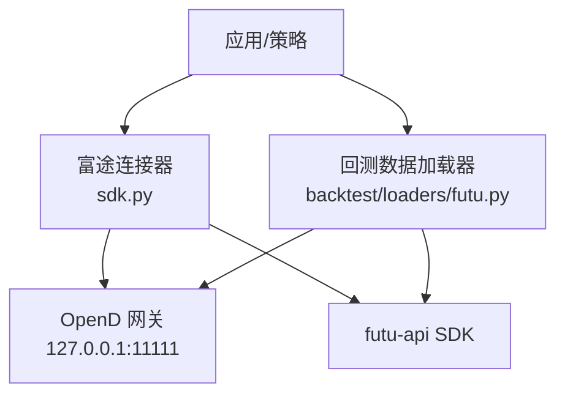
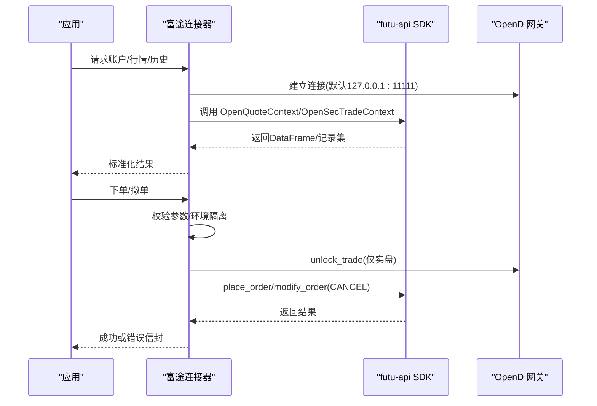
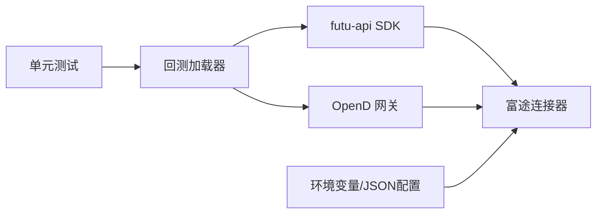

# 富途连接器

<cite>
**本文引用的文件**
- [agent/src/trading/connectors/futu/sdk.py](file://agent/src/trading/connectors/futu/sdk.py)
- [agent/src/trading/connectors/futu/profiles.py](file://agent/src/trading/connectors/futu/profiles.py)
- [agent/src/trading/connectors/futu/__init__.py](file://agent/src/trading/connectors/futu/__init__.py)
- [agent/backtest/loaders/futu.py](file://agent/backtest/loaders/futu.py)
- [agent/tests/test_futu_loader.py](file://agent/tests/test_futu_loader.py)
- [agent/src/config/env_schema.py](file://agent/src/config/env_schema.py)
</cite>

## 目录
1. [简介](#简介)
2. [项目结构](#项目结构)
3. [核心组件](#核心组件)
4. [架构总览](#架构总览)
5. [详细组件分析](#详细组件分析)
6. [依赖关系分析](#依赖关系分析)
7. [性能与频率限制](#性能与频率限制)
8. [故障排查指南](#故障排查指南)
9. [结论](#结论)
10. [附录：市场规则差异与适配方案](#附录：市场规则差异与适配方案)

## 简介
本文件系统性梳理富途（Futu/moomoo）连接器的实现，覆盖本地 OpenD 网关通信、账户/行情/历史数据读取、下单与撤单流程、纸模拟与实盘隔离、环境配置与认证、以及回测数据加载器。文档基于仓库中的实际代码进行说明，并提供架构图、时序图与流程图帮助理解。

## 项目结构
富途相关代码主要分布在以下位置：
- 交易连接器层：通过官方 futu-api SDK 与本地 OpenD 通信，提供只读能力与受控的下单/撤单能力
- 回测数据加载器：面向港股与A股的OHLCV历史数据拉取与标准化
- 配置文件与环境变量：定义 OpenD 地址、端口及交易密码等敏感信息

图表来源
- [agent/src/trading/connectors/futu/sdk.py:1-25](file://agent/src/trading/connectors/futu/sdk.py#L1-L25)
- [agent/backtest/loaders/futu.py:106-116](file://agent/backtest/loaders/futu.py#L106-L116)

章节来源
- [agent/src/trading/connectors/futu/sdk.py:1-25](file://agent/src/trading/connectors/futu/sdk.py#L1-L25)
- [agent/backtest/loaders/futu.py:106-116](file://agent/backtest/loaders/futu.py#L106-L116)

## 核心组件
- FutuConfig：封装连接参数（主机、端口、profile、市场过滤、账户ID、超时、是否只读），支持从映射构建与覆盖
- 连接器接口：账户快照、持仓、未成交订单、实时报价、历史K线；下单与撤单（失败关闭模式）
- 账户环境隔离：通过 trd_env（SIMULATE/REAL）严格区分纸模拟与实盘，防止误用
- 数据加载器：将富途返回的数据标准化为统一的 OHLCV 格式，支持分页与缓存

章节来源
- [agent/src/trading/connectors/futu/sdk.py:71-158](file://agent/src/trading/connectors/futu/sdk.py#L71-L158)
- [agent/backtest/loaders/futu.py:82-116](file://agent/backtest/loaders/futu.py#L82-L116)

## 架构总览
富途连接器采用“本地网关 + SDK”的架构：OpenD 运行在用户机器上持有登录态，SDK 通过本地 TCP 与之通信。连接器不直接持有富途凭据，所有写操作（下单/撤单）均经过严格的校验与安全门控。

图表来源
- [agent/src/trading/connectors/futu/sdk.py:682-703](file://agent/src/trading/connectors/futu/sdk.py#L682-L703)
- [agent/src/trading/connectors/futu/sdk.py:407-539](file://agent/src/trading/connectors/futu/sdk.py#L407-L539)
- [agent/src/trading/connectors/futu/sdk.py:542-614](file://agent/src/trading/connectors/futu/sdk.py#L542-L614)

## 详细组件分析

### 连接器配置与认证
- 配置来源：用户级 JSON 文件（~/.vibe-trading/futu.json）与 profile 配置合并，CLI 覆盖生效
- 环境变量：
  - FUTU_HOST/FUTU_PORT：OpenD 地址与端口
  - FUTU_TRADE_PWD_MD5：实盘下单所需的交易密码MD5（用于 unlock_trade）
- 安全设计：
  - 连接器层默认只读，写操作由上层策略与权限门控触发
  - 实盘下单前必须解锁交易上下文，缺少密码则失败关闭
  - 账户环境隔离：trd_env 严格匹配 profile，避免将实盘账户当纸模拟驱动

章节来源
- [agent/src/trading/connectors/futu/sdk.py:163-183](file://agent/src/trading/connectors/futu/sdk.py#L163-L183)
- [agent/src/trading/connectors/futu/sdk.py:617-643](file://agent/src/trading/connectors/futu/sdk.py#L617-L643)
- [agent/src/config/env_schema.py:164-165](file://agent/src/config/env_schema.py#L164-L165)
- [agent/src/config/env_schema.py:294-294](file://agent/src/config/env_schema.py#L294-L294)

### 账户与持仓查询
- 账户快照：按 trd_env 与 acc_id 查询资产信息
- 持仓列表：获取当前持仓明细
- 未成交订单：可选包含最近成交（deals）
- 统一处理：对 SDK 返回的 (ret_code, data) 元组进行解包，错误时降级为空数据集

章节来源
- [agent/src/trading/connectors/futu/sdk.py:275-333](file://agent/src/trading/connectors/futu/sdk.py#L275-L333)

### 实时行情与历史K线
- 实时报价：通过 OpenQuoteContext.get_market_snapshot 获取单标的快照
- 历史K线：通过 request_history_kline 获取多周期K线，支持分页与标准化
- 周期映射：1m/5m/15m/30m/1h/4h/1d/1w/1M 映射到富途 KLType

章节来源
- [agent/src/trading/connectors/futu/sdk.py:336-393](file://agent/src/trading/connectors/futu/sdk.py#L336-L393)
- [agent/backtest/loaders/futu.py:22-36](file://agent/backtest/loaders/futu.py#L22-L36)

### 下单与撤单（失败关闭模式）
- 下单：
  - 支持市价单与限价单，要求明确数量（不支持名义金额下单）
  - 实盘下单需 unlock_trade，使用 FUTU_TRADE_PWD_MD5
  - 所有错误路径返回统一错误信封，不抛出异常
- 撤单：
  - 通过 modify_order(CANCEL) 撤销指定 order_id
  - 同样遵循失败关闭模式

章节来源
- [agent/src/trading/connectors/futu/sdk.py:407-539](file://agent/src/trading/connectors/futu/sdk.py#L407-L539)
- [agent/src/trading/connectors/futu/sdk.py:542-614](file://agent/src/trading/connectors/futu/sdk.py#L542-L614)

### 纸模拟与实盘隔离
- 通过 trd_env（SIMULATE/REAL）与 profile 严格绑定
- 若配置的 acc_id 与 profile 环境不一致，将拒绝并报错
- 纸模拟账户永不解锁交易上下文，无需交易密码

章节来源
- [agent/src/trading/connectors/futu/sdk.py:15-20](file://agent/src/trading/connectors/futu/sdk.py#L15-L20)
- [agent/src/trading/connectors/futu/sdk.py:712-753](file://agent/src/trading/connectors/futu/sdk.py#L712-L753)

### 回测数据加载器（港股/A股）
- 支持港股（HK）与A股（SZ/SH）标的符号转换
- 支持多种周期（分钟、小时、日、周、月）
- 数据标准化为 open/high/low/close/volume，索引为 trade_date
- 支持分页拉取与缓存，提升回测效率

章节来源
- [agent/backtest/loaders/futu.py:39-56](file://agent/backtest/loaders/futu.py#L39-L56)
- [agent/backtest/loaders/futu.py:82-104](file://agent/backtest/loaders/futu.py#L82-L104)
- [agent/backtest/loaders/futu.py:140-253](file://agent/backtest/loaders/futu.py#L140-L253)

### 内置Profile与能力
- 四个内置 Profile：
  - futu-paper-sdk：纸模拟只读
  - futu-live-sdk-readonly：实盘只读
  - futu-paper-trade：纸模拟可下单
  - futu-live-trade：实盘可下单（需 mandate 与交易密码解锁）
- 能力标记：READ_CAPABILITIES 与 orders.place（部分需要 mandates）

章节来源
- [agent/src/trading/connectors/futu/profiles.py:14-80](file://agent/src/trading/connectors/futu/profiles.py#L14-L80)

## 依赖关系分析
- 外部依赖：futu-api SDK（可选依赖，未安装时降级为不可用）
- 本地依赖：OpenD 网关（默认 127.0.0.1:11111）
- 配置依赖：环境变量与用户级 JSON 配置
- 测试：通过 mock futu 模块验证行为

图表来源
- [agent/src/trading/connectors/futu/sdk.py:656-670](file://agent/src/trading/connectors/futu/sdk.py#L656-L670)
- [agent/backtest/loaders/futu.py:125-138](file://agent/backtest/loaders/futu.py#L125-L138)
- [agent/tests/test_futu_loader.py:16-44](file://agent/tests/test_futu_loader.py#L16-L44)

章节来源
- [agent/src/trading/connectors/futu/sdk.py:656-670](file://agent/src/trading/connectors/futu/sdk.py#L656-L670)
- [agent/backtest/loaders/futu.py:125-138](file://agent/backtest/loaders/futu.py#L125-L138)
- [agent/tests/test_futu_loader.py:16-44](file://agent/tests/test_futu_loader.py#L16-L44)

## 性能与频率限制
- 历史K线分页：每次最多拉取固定条数，通过 page_key 迭代至结束
- 缓存机制：回测加载器对已拉取的 symbol+interval+时间范围进行缓存，减少重复请求
- 连接复用：每个函数调用内打开并关闭上下文，确保资源释放
- 频率限制：代码中未显式实现富途API速率控制；建议在上层策略中自行限流以避免被服务端限制

章节来源
- [agent/backtest/loaders/futu.py:207-253](file://agent/backtest/loaders/futu.py#L207-L253)
- [agent/src/trading/connectors/futu/sdk.py:369-393](file://agent/src/trading/connectors/futu/sdk.py#L369-L393)

## 故障排查指南
- OpenD 未启动或端口不可达：检查 host/port，确认 OpenD 已运行且登录
- futu-api 未安装：安装依赖后重试
- 实盘下单失败：确认已设置 FUTU_TRADE_PWD_MD5 且 unlock_trade 成功
- 账户环境不匹配：检查 profile 与 acc_id 的 trd_env 是否一致
- 历史数据为空：检查日期范围、标的符号与周期映射是否正确

章节来源
- [agent/src/trading/connectors/futu/sdk.py:223-272](file://agent/src/trading/connectors/futu/sdk.py#L223-L272)
- [agent/src/trading/connectors/futu/sdk.py:673-679](file://agent/src/trading/connectors/futu/sdk.py#L673-L679)
- [agent/backtest/loaders/futu.py:168-172](file://agent/backtest/loaders/futu.py#L168-L172)

## 结论
富途连接器以本地 OpenD 网关为核心，结合官方 SDK 提供稳健的只读与受控写能力。通过 trd_env 严格隔离纸模拟与实盘，配合失败关闭的错误模型与密码解锁机制，保障交易安全。回测加载器对港股与A股数据进行标准化与缓存，提升回测效率。建议在策略层增加频率控制与重试逻辑，以应对富途API的限制与网络波动。

## 附录：市场规则差异与适配方案
- 港股（HK）：
  - 标的符号格式：HK.00700（五位数补齐）
  - 周期映射：1m/5m/15m/30m/1h/4h/1d/1w/1M
- A股（SZ/SH）：
  - 标的符号格式：SZ.000001 / SH.600519（六位数补齐）
  - 周期映射同上
- 美股（US）：
  - 连接器支持 US 标的符号传入（如 US.AAPL），但默认 filter_trdmarket 为 HK；如需美股，请调整配置中的 market 过滤
- 交易规则差异：
  - 不同市场对最小交易单位、涨跌停、T+0/T+1 等规则不同；连接器层不做业务规则判断，应在策略层根据市场特性进行约束
- 适配建议：
  - 在策略层根据 symbol 前缀或后缀识别市场，并应用相应规则
  - 对于A股与港股，注意交易时间与节假日差异
  - 对于美股，注意盘前盘后交易时段与流动性风险

章节来源
- [agent/backtest/loaders/futu.py:39-56](file://agent/backtest/loaders/futu.py#L39-L56)
- [agent/src/trading/connectors/futu/sdk.py:78-93](file://agent/src/trading/connectors/futu/sdk.py#L78-L93)