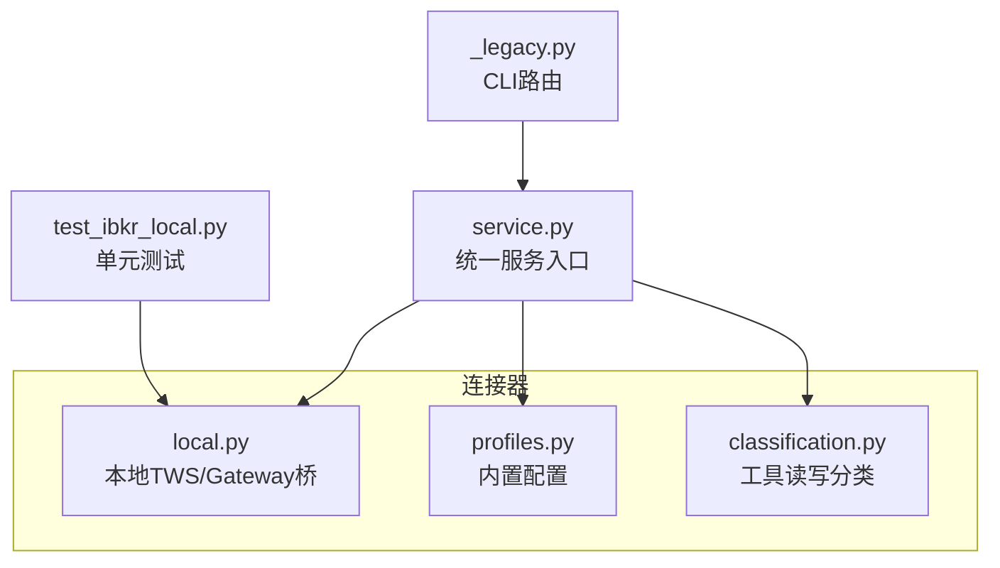
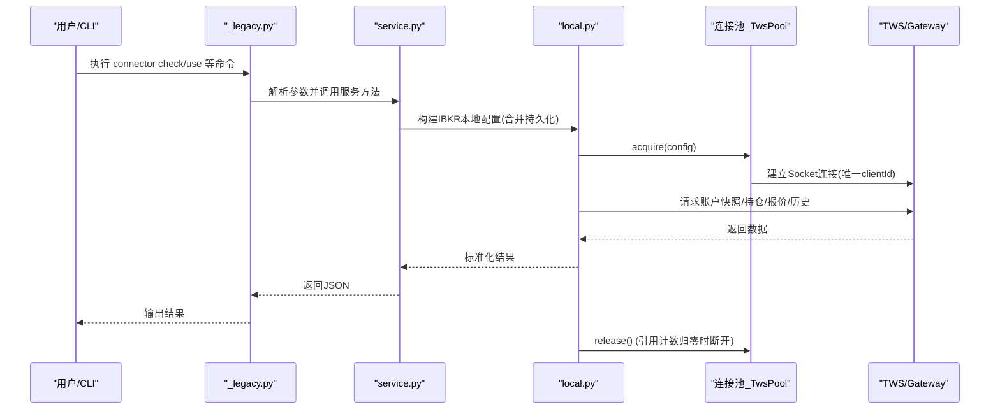
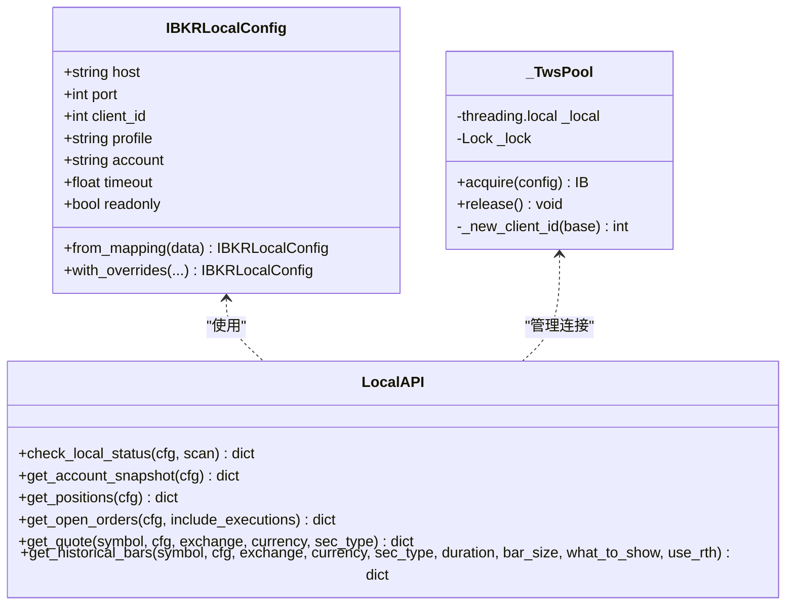
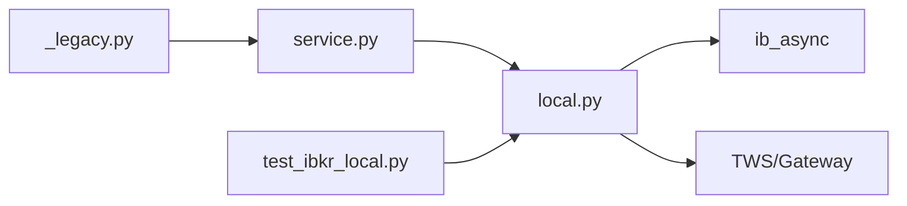

# 盈透连接器

<cite>
**本文引用的文件**
- [agent/src/trading/connectors/ibkr/local.py](file://agent/src/trading/connectors/ibkr/local.py)
- [agent/src/trading/connectors/ibkr/profiles.py](file://agent/src/trading/connectors/ibkr/profiles.py)
- [agent/src/trading/connectors/ibkr/classification.py](file://agent/src/trading/connectors/ibkr/classification.py)
- [agent/src/trading/service.py](file://agent/src/trading/service.py)
- [agent/cli/_legacy.py](file://agent/cli/_legacy.py)
- [agent/tests/test_ibkr_local.py](file://agent/tests/test_ibkr_local.py)
</cite>

## 目录
1. [简介](#简介)
2. [项目结构](#项目结构)
3. [核心组件](#核心组件)
4. [架构总览](#架构总览)
5. [详细组件分析](#详细组件分析)
6. [依赖关系分析](#依赖关系分析)
7. [性能与可靠性](#性能与可靠性)
8. [故障排查指南](#故障排查指南)
9. [结论](#结论)
10. [附录：配置与使用示例](#附录：配置与使用示例)

## 简介
本文件面向盈透证券（Interactive Brokers，简称 IBKR）连接器的实现与使用，聚焦以下目标：
- 本地模式：通过 TWS 或 IB Gateway 的 Socket API 进行只读访问，不向 Vibe-Trading 传入任何 IBKR 凭据。
- 认证方式：本地模式无需 IBKR 账号密码；远程 MCP 模式需完成官方 OAuth 授权。
- TWS/Gateway 配置要求：启用 Socket API、正确端口、登录账户、客户端 ID 等。
- API 版本管理：通过 ib_async 适配层兼容不同版本的 IBKR API 调用差异。
- 复杂订单与风险管理：说明当前连接器能力边界（只读），并给出在系统内如何扩展至写操作的思路。
- 算法交易、组合策略与多资产类别：基于 IBKR 合约模型与历史数据接口，展示可支持的资产类型与数据获取方式。
- 连接状态监控与自动重连：提供健康检查、端口扫描、连接池与线程安全机制。

## 项目结构
与盈透连接器相关的代码主要分布在以下位置：
- 连接器实现：local.py（本地 TWS/Gateway 桥接）、profiles.py（内置配置文件）、classification.py（工具读写分类）。
- 服务编排：service.py（统一入口，负责选择本地或远程路径、构建配置、调用具体实现）。
- CLI 集成：_legacy.py（命令行路由与参数传递）。
- 测试用例：test_ibkr_local.py（覆盖配置、快照、持仓、报价、历史、连接池行为等）。

图表来源
- [agent/src/trading/connectors/ibkr/local.py:1-686](file://agent/src/trading/connectors/ibkr/local.py#L1-L686)
- [agent/src/trading/connectors/ibkr/profiles.py:1-45](file://agent/src/trading/connectors/ibkr/profiles.py#L1-L45)
- [agent/src/trading/connectors/ibkr/classification.py:1-27](file://agent/src/trading/connectors/ibkr/classification.py#L1-L27)
- [agent/src/trading/service.py:880-1046](file://agent/src/trading/service.py#L880-L1046)
- [agent/cli/_legacy.py:3918-4021](file://agent/cli/_legacy.py#L3918-L4021)
- [agent/tests/test_ibkr_local.py:1-348](file://agent/tests/test_ibkr_local.py#L1-L348)

章节来源
- [agent/src/trading/connectors/ibkr/local.py:1-686](file://agent/src/trading/connectors/ibkr/local.py#L1-L686)
- [agent/src/trading/connectors/ibkr/profiles.py:1-45](file://agent/src/trading/connectors/ibkr/profiles.py#L1-L45)
- [agent/src/trading/connectors/ibkr/classification.py:1-27](file://agent/src/trading/connectors/ibkr/classification.py#L1-L27)
- [agent/src/trading/service.py:880-1046](file://agent/src/trading/service.py#L880-L1046)
- [agent/cli/_legacy.py:3918-4021](file://agent/cli/_legacy.py#L3918-L4021)
- [agent/tests/test_ibkr_local.py:1-348](file://agent/tests/test_ibkr_local.py#L1-L348)

## 核心组件
- 本地连接器（local.py）
  - 仅通过用户本地的 TWS 或 IB Gateway 会话读取数据，不处理 IBKR 凭据，也不暴露下单方法。
  - 支持纸模拟与实盘只读两种 profile，默认端口分别为 7497（纸模拟）与 7496（实盘只读）。
  - 提供账户快照、持仓、挂单、报价、历史K线等只读能力。
  - 内部维护线程安全的连接池，避免 client_id 冲突，按引用计数管理连接生命周期。
- 内置配置（profiles.py）
  - 定义三个内置 profile：纸模拟本地、实盘本地只读、官方 MCP 远程只读。
  - 明确 readonly=True，强调本地模式不可下单。
- 工具分类（classification.py）
  - 对 IBKR 官方 MCP 的工具名进行稀疏映射，将已知写操作标记为 WRITE，未知名称保持 UNKNOWN 以失败关闭。
- 服务编排（service.py）
  - 根据 profile 与 overrides 构建 IBKR 本地配置，合并持久化配置。
  - 对远程 MCP 做鉴权检查与工具名映射。
- CLI（_legacy.py）
  - 将 connector configure/check/use 等命令路由到后端处理器，支持 account、host、port、client_id 等覆盖参数。

章节来源
- [agent/src/trading/connectors/ibkr/local.py:48-153](file://agent/src/trading/connectors/ibkr/local.py#L48-L153)
- [agent/src/trading/connectors/ibkr/profiles.py:7-44](file://agent/src/trading/connectors/ibkr/profiles.py#L7-L44)
- [agent/src/trading/connectors/ibkr/classification.py:14-26](file://agent/src/trading/connectors/ibkr/classification.py#L14-L26)
- [agent/src/trading/service.py:883-898](file://agent/src/trading/service.py#L883-L898)
- [agent/cli/_legacy.py:3918-4021](file://agent/cli/_legacy.py#L3918-L4021)

## 架构总览
下图展示了从 CLI 到本地 TWS/Gateway 的数据流与控制流，以及连接池的生命周期管理。

图表来源
- [agent/cli/_legacy.py:3918-4021](file://agent/cli/_legacy.py#L3918-L4021)
- [agent/src/trading/service.py:883-898](file://agent/src/trading/service.py#L883-L898)
- [agent/src/trading/connectors/ibkr/local.py:429-503](file://agent/src/trading/connectors/ibkr/local.py#L429-L503)
- [agent/src/trading/connectors/ibkr/local.py:241-425](file://agent/src/trading/connectors/ibkr/local.py#L241-L425)

## 详细组件分析

### 本地连接器（local.py）
- 配置对象 IBKRLocalConfig
  - 字段包括 host、port、client_id、profile（paper/live-readonly）、account、timeout、readonly。
  - from_mapping 支持 JSON 映射加载，with_overrides 支持运行时覆盖。
  - 默认端口：paper=7497，live-readonly=7496。
- 连接与健康检查
  - check_local_status 报告 SDK 是否安装、默认端口扫描、目标端口连通性、账户快照。
  - scan_default_ports 扫描标准端口集合。
  - tcp_port_open 检测 TCP 端口是否开放。
- 数据读取
  - get_account_snapshot：获取账户列表与摘要值。
  - get_positions：获取持仓，支持按 account 过滤。
  - get_open_orders：获取挂单与最近成交（可选）。
  - get_quote：获取最新报价快照，等待真实 tick 到达。
  - get_historical_bars：获取历史 K 线，支持 duration、bar_size、what_to_show、use_rth。
- 连接池 _TwsPool
  - 线程局部存储 + 引用计数，确保同一线程复用连接，释放到 0 才断开。
  - 自动分配唯一 clientId，避免冲突。
  - 兼容不同 ib_async 版本 connect 签名。
- 合约与数据转换
  - _make_contract/_qualify_contract：构造与资格校验合约。
  - _wait_for_tick/_tick_has_data：轮询事件循环直到收到有效价格字段。
  - 多种字典转换函数用于标准化输出。

图表来源
- [agent/src/trading/connectors/ibkr/local.py:48-153](file://agent/src/trading/connectors/ibkr/local.py#L48-L153)
- [agent/src/trading/connectors/ibkr/local.py:429-503](file://agent/src/trading/connectors/ibkr/local.py#L429-L503)
- [agent/src/trading/connectors/ibkr/local.py:165-425](file://agent/src/trading/connectors/ibkr/local.py#L165-L425)

章节来源
- [agent/src/trading/connectors/ibkr/local.py:48-153](file://agent/src/trading/connectors/ibkr/local.py#L48-L153)
- [agent/src/trading/connectors/ibkr/local.py:165-425](file://agent/src/trading/connectors/ibkr/local.py#L165-L425)
- [agent/src/trading/connectors/ibkr/local.py:429-503](file://agent/src/trading/connectors/ibkr/local.py#L429-L503)

### 内置配置与远程 MCP（profiles.py）
- 内置 profile
  - ibkr-paper-local：纸模拟本地只读，transport=local_tws。
  - ibkr-live-local-readonly：实盘本地只读，transport=local_tws。
  - ibkr-live-official-mcp-readonly：官方 MCP 远程只读，transport=remote_mcp，需要 OAuth。
- 能力声明
  - readonly=True，强调本地模式不可下单。
  - 远程 MCP 能力受限于 IBKR 官方发布的稳定工具名。

章节来源
- [agent/src/trading/connectors/ibkr/profiles.py:7-44](file://agent/src/trading/connectors/ibkr/profiles.py#L7-L44)

### 工具分类（classification.py）
- 针对 IBKR 官方 MCP 的写操作工具名进行稀疏映射，如 place_order、submit_order、cancel_order、modify_order、replace_order 等。
- 未知工具名保持 UNKNOWN，遵循失败关闭原则。

章节来源
- [agent/src/trading/connectors/ibkr/classification.py:14-26](file://agent/src/trading/connectors/ibkr/classification.py#L14-L26)

### 服务编排（service.py）
- _ibkr_config：根据 profile 与 overrides 构建 IBKR 本地配置，优先合并持久化配置（当 profile 一致时）。
- _remote_status/_call_remote：对远程 MCP 做鉴权检查与工具调用封装。
- 通用错误与不支持能力返回格式。

章节来源
- [agent/src/trading/service.py:883-898](file://agent/src/trading/service.py#L883-L898)
- [agent/src/trading/service.py:901-1046](file://agent/src/trading/service.py#L901-L1046)

### CLI 集成（_legacy.py）
- connector configure/check/use 等命令路由到后端处理器。
- 支持 --account、--host、--port、--client-id 等覆盖参数。
- 对本地 TWS/Gateway profile 的特殊处理与提示。

章节来源
- [agent/cli/_legacy.py:3918-4021](file://agent/cli/_legacy.py#L3918-L4021)

## 依赖关系分析
- 外部依赖
  - ib_async：可选依赖，未安装时会抛出依赖缺失错误。
  - TWS/IB Gateway：必须运行并启用 Socket API，监听对应端口。
- 内部依赖
  - service.py 依赖 local.py 的只读接口。
  - CLI 依赖 service.py 的统一入口。
  - tests 依赖 local.py 的公开接口与 mock 环境。

图表来源
- [agent/cli/_legacy.py:3918-4021](file://agent/cli/_legacy.py#L3918-L4021)
- [agent/src/trading/service.py:883-898](file://agent/src/trading/service.py#L883-L898)
- [agent/src/trading/connectors/ibkr/local.py:156-163](file://agent/src/trading/connectors/ibkr/local.py#L156-L163)
- [agent/tests/test_ibkr_local.py:1-348](file://agent/tests/test_ibkr_local.py#L1-L348)

章节来源
- [agent/src/trading/connectors/ibkr/local.py:156-163](file://agent/src/trading/connectors/ibkr/local.py#L156-L163)
- [agent/src/trading/service.py:883-898](file://agent/src/trading/service.py#L883-L898)
- [agent/cli/_legacy.py:3918-4021](file://agent/cli/_legacy.py#L3918-L4021)
- [agent/tests/test_ibkr_local.py:1-348](file://agent/tests/test_ibkr_local.py#L1-L348)

## 性能与可靠性
- 连接池与线程安全
  - 每个工作线程拥有独立 socket，避免跨线程共享导致的并发问题。
  - 引用计数保证多次调用复用连接，仅在最后一次 release 时断开。
- 报价延迟处理
  - 使用 _wait_for_tick 轮询事件循环，直到 bid/ask/last 非空且非 NaN，避免过早返回无效数据。
- 健康检查与端口扫描
  - check_local_status 提供快速诊断，包含 SDK 安装状态、默认端口扫描、目标端口连通性与账户快照。
- 兼容性
  - 兼容不同 ib_async 版本的 connect 签名，捕获 TypeError 回退旧版调用。

章节来源
- [agent/src/trading/connectors/ibkr/local.py:312-350](file://agent/src/trading/connectors/ibkr/local.py#L312-L350)
- [agent/src/trading/connectors/ibkr/local.py:429-503](file://agent/src/trading/connectors/ibkr/local.py#L429-L503)
- [agent/src/trading/connectors/ibkr/local.py:165-218](file://agent/src/trading/connectors/ibkr/local.py#L165-L218)

## 故障排查指南
- 常见错误与定位
  - 依赖缺失：提示安装 ib_async>=2.0。
  - 端口未开放：提示打开 TWS/Gateway 并启用 Socket API。
  - 账户不匹配：配置为 paper 但检测到 live 账户，抛出 profile 不匹配异常。
  - 远程 MCP 未授权：提示运行授权命令。
- 诊断步骤
  - 使用 check_local_status 查看 SDK、端口、目标连通性与账户快照。
  - 确认 TWS/Gateway 已登录并启用 API。
  - 检查配置文件与 CLI 覆盖参数是否正确。
  - 对于远程 MCP，确认 OAuth 令牌存在且工具启用。

章节来源
- [agent/src/trading/connectors/ibkr/local.py:156-218](file://agent/src/trading/connectors/ibkr/local.py#L156-L218)
- [agent/src/trading/connectors/ibkr/local.py:530-541](file://agent/src/trading/connectors/ibkr/local.py#L530-L541)
- [agent/src/trading/service.py:901-996](file://agent/src/trading/service.py#L901-L996)
- [agent/tests/test_ibkr_local.py:155-163](file://agent/tests/test_ibkr_local.py#L155-L163)

## 结论
- 本地模式通过 TWS/Gateway 提供安全、只读的 IBKR 数据接入，无需在 Vibe-Trading 中保存 IBKR 凭据。
- 连接池与事件循环轮询保障了并发与数据有效性。
- 内置 profile 覆盖了纸模拟、实盘只读与官方 MCP 远程只读三种场景。
- 写操作（下单、改单、撤单）在当前本地连接器中未暴露；如需扩展，可在 service.py 中增加写操作路由并在 local.py 中实现相应调用。
- 算法交易、组合策略与多资产类别可通过合约构造与历史数据接口支持，但需在更高层策略引擎中编排。

## 附录：配置与使用示例
- 本地模式配置要点
  - 主机与端口：默认 127.0.0.1，paper=7497，live-readonly=7496。
  - 客户端 ID：默认 77，连接池会生成唯一 ID。
  - 账户过滤：可指定 account 字段限制查询范围。
  - 超时与只读：timeout 默认 8.0，readonly 默认 True。
- 常用只读操作
  - 账户快照：获取账户列表与摘要值。
  - 持仓：获取当前持仓及平均成本。
  - 挂单：获取未成交订单与最近成交。
  - 报价：获取最新 bid/ask/last/volume/time。
  - 历史 K 线：支持 duration、bar_size、what_to_show、use_rth。
- 远程 MCP 模式
  - 需要完成官方 OAuth 授权。
  - 工具名由 IBKR 官方发布后稳定，当前仅支持只读发现。
- CLI 示例路径
  - connector configure/check/use 等命令的参数与路由见 CLI 文件。
- 测试参考
  - 单元测试覆盖配置、快照、持仓、报价、历史、连接池行为等。

章节来源
- [agent/src/trading/connectors/ibkr/local.py:48-153](file://agent/src/trading/connectors/ibkr/local.py#L48-L153)
- [agent/src/trading/connectors/ibkr/local.py:241-425](file://agent/src/trading/connectors/ibkr/local.py#L241-L425)
- [agent/cli/_legacy.py:3918-4021](file://agent/cli/_legacy.py#L3918-L4021)
- [agent/tests/test_ibkr_local.py:110-170](file://agent/tests/test_ibkr_local.py#L110-L170)
- [agent/tests/test_ibkr_local.py:237-316](file://agent/tests/test_ibkr_local.py#L237-L316)
- [agent/tests/test_ibkr_local.py:317-348](file://agent/tests/test_ibkr_local.py#L317-L348)