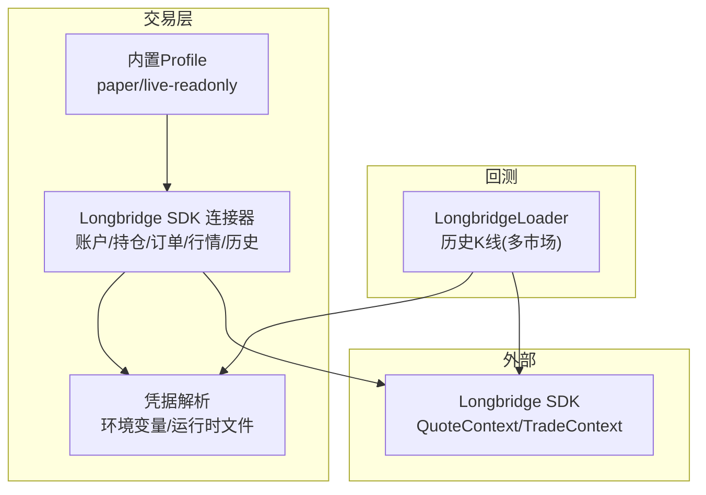
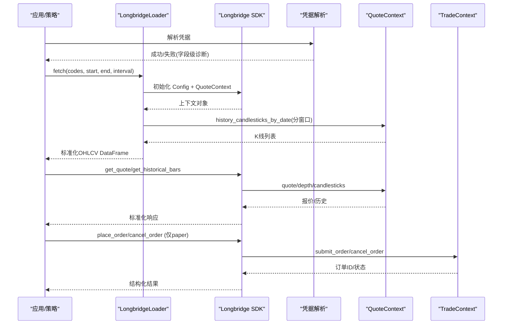
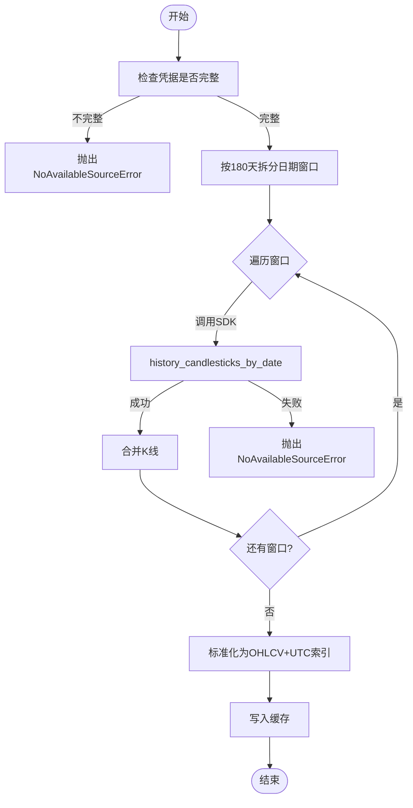
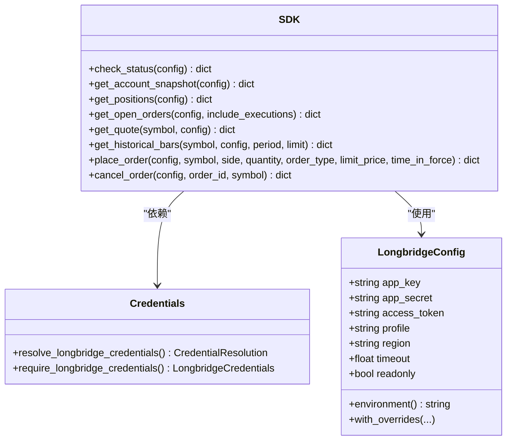
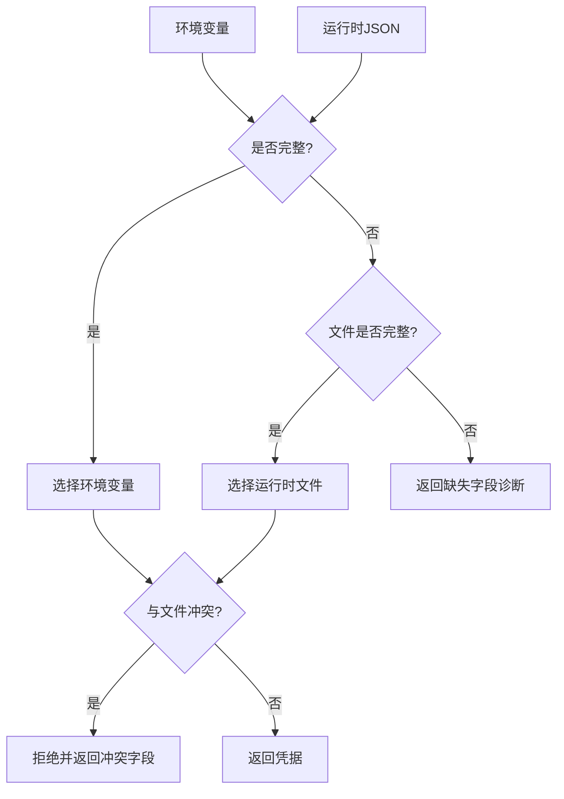
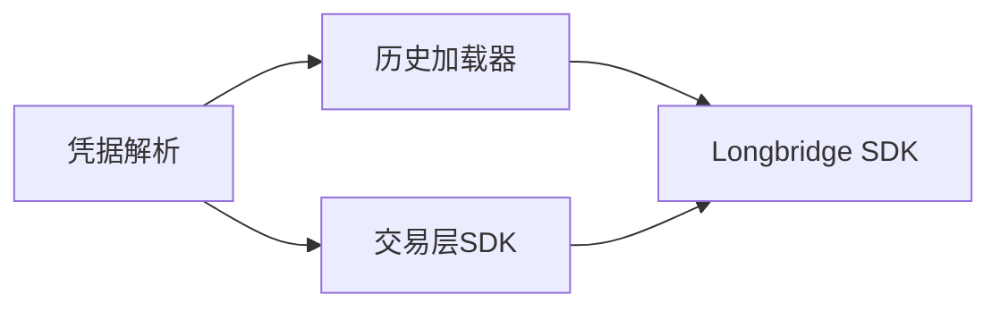

# 长桥连接器

<cite>
**本文引用的文件**
- [agent/backtest/loaders/longbridge.py](file://agent/backtest/loaders/longbridge.py)
- [agent/src/trading/connectors/longbridge/sdk.py](file://agent/src/trading/connectors/longbridge/sdk.py)
- [agent/src/trading/connectors/longbridge/credentials.py](file://agent/src/trading/connectors/longbridge/credentials.py)
- [agent/src/trading/connectors/longbridge/profiles.py](file://agent/src/trading/connectors/longbridge/profiles.py)
- [agent/tests/test_longbridge_credentials.py](file://agent/tests/test_longbridge_credentials.py)
- [agent/tests/test_longbridge_loader.py](file://agent/tests/test_longbridge_loader.py)
- [agent/tests/test_longbridge_runtime.py](file://agent/tests/test_longbridge_runtime.py)
</cite>

## 目录
1. [简介](#简介)
2. [项目结构](#项目结构)
3. [核心组件](#核心组件)
4. [架构总览](#架构总览)
5. [详细组件分析](#详细组件分析)
6. [依赖关系分析](#依赖关系分析)
7. [性能与并发](#性能与并发)
8. [故障排查指南](#故障排查指南)
9. [结论](#结论)
10. [附录：配置与使用示例路径](#附录：配置与使用示例路径)

## 简介
本文件面向“长桥连接器”的实现与使用，覆盖多市场支持（A 股、港股、美股）、认证流程、SDK 集成方式、配置选项、RESTful API 与实时数据机制、连接池与并发优化，以及交易与投资组合管理。文档基于仓库中的实际代码进行说明，并提供可追溯的源码引用与图示。

## 项目结构
长桥连接器由以下关键部分组成：
- 回测历史数据加载器：封装 LongPort OpenAPI 的历史 K 线拉取，支持 A 股、港股、美股，按窗口拆分避免截断。
- 交易层 SDK 连接器：提供账户、持仓、订单、行情、历史等只读能力；订单仅支持模拟盘。
- 凭据解析：统一从环境变量或运行时文件原子化解析并校验，防止混用与泄露。
- 内置 Profile：声明纸盘与实盘只读能力，明确传输类型与权限边界。
- 测试：覆盖凭据解析、加载器行为、运行时状态与接口契约。

**图表来源**
- [agent/backtest/loaders/longbridge.py:1-22](file://agent/backtest/loaders/longbridge.py#L1-L22)
- [agent/src/trading/connectors/longbridge/sdk.py:1-16](file://agent/src/trading/connectors/longbridge/sdk.py#L1-L16)
- [agent/src/trading/connectors/longbridge/credentials.py:1-16](file://agent/src/trading/connectors/longbridge/credentials.py#L1-L16)
- [agent/src/trading/connectors/longbridge/profiles.py:1-56](file://agent/src/trading/connectors/longbridge/profiles.py#L1-L56)

**章节来源**
- [agent/backtest/loaders/longbridge.py:1-22](file://agent/backtest/loaders/longbridge.py#L1-L22)
- [agent/src/trading/connectors/longbridge/sdk.py:1-16](file://agent/src/trading/connectors/longbridge/sdk.py#L1-L16)
- [agent/src/trading/connectors/longbridge/credentials.py:1-16](file://agent/src/trading/connectors/longbridge/credentials.py#L1-L16)
- [agent/src/trading/connectors/longbridge/profiles.py:1-56](file://agent/src/trading/connectors/longbridge/profiles.py#L1-L56)

## 核心组件
- 历史数据加载器（LongbridgeLoader）
  - 支持 us_equity、hk_equity，符号自动补全为 .US/.HK/.SH/.SZ。
  - 将区间切分为 180 天窗口，避免单次调用被限制导致静默截断。
  - 标准化 OHLCV 时间戳为无时区 UTC，缓存结果减少重复请求。
- 交易层 SDK 连接器
  - 通过 TradeContext/QuoteContext 暴露账户余额、持仓、今日订单、深度报价、历史 K 线。
  - 订单仅支持模拟盘（环境强制为 paper），失败模式以结构化错误返回。
  - 提供 check_status 健康检查，输出安全脱敏的诊断信息。
- 凭据解析
  - 优先从环境变量读取 LONGBRIDGE_APP_KEY/SECRET/TOKEN，否则回退到运行时 JSON 文件。
  - 若两者都存在且不一致，直接拒绝，避免混用风险。
- 内置 Profile
  - 提供纸盘只读、纸盘下单、实盘只读三种 Profile，明确 capabilities 与 readonly 标志。

**章节来源**
- [agent/backtest/loaders/longbridge.py:200-412](file://agent/backtest/loaders/longbridge.py#L200-L412)
- [agent/src/trading/connectors/longbridge/sdk.py:321-428](file://agent/src/trading/connectors/longbridge/sdk.py#L321-L428)
- [agent/src/trading/connectors/longbridge/credentials.py:49-131](file://agent/src/trading/connectors/longbridge/credentials.py#L49-L131)
- [agent/src/trading/connectors/longbridge/profiles.py:12-55](file://agent/src/trading/connectors/longbridge/profiles.py#L12-L55)

## 架构总览
下图展示了从应用侧到 Longbridge SDK 的数据流与控制流，包括认证、历史数据拉取、实时报价与订单处理。

**图表来源**
- [agent/backtest/loaders/longbridge.py:255-412](file://agent/backtest/loaders/longbridge.py#L255-L412)
- [agent/src/trading/connectors/longbridge/sdk.py:392-428](file://agent/src/trading/connectors/longbridge/sdk.py#L392-L428)
- [agent/src/trading/connectors/longbridge/sdk.py:449-619](file://agent/src/trading/connectors/longbridge/sdk.py#L449-L619)
- [agent/src/trading/connectors/longbridge/credentials.py:49-131](file://agent/src/trading/connectors/longbridge/credentials.py#L49-L131)

## 详细组件分析

### 历史数据加载器（LongbridgeLoader）
- 多市场支持
  - 支持 us_equity、hk_equity；符号规范化将裸代码默认视为美股，兼容 A 股后缀。
- 区间拆分与防截断
  - 每次调用上限约 1000 根 K 线；按 180 天窗口顺序拆分，最大窗口数限制，超限直接报错。
- 标准化与缓存
  - 时间戳统一为无时区 UTC；结果写入 loader 缓存，命中则无需网络。
- 错误处理
  - 凭据缺失/冲突/部分缺失在初始化阶段即失败，不触发 SDK 初始化，避免泄露敏感信息。

**图表来源**
- [agent/backtest/loaders/longbridge.py:135-197](file://agent/backtest/loaders/longbridge.py#L135-L197)
- [agent/backtest/loaders/longbridge.py:255-412](file://agent/backtest/loaders/longbridge.py#L255-L412)

**章节来源**
- [agent/backtest/loaders/longbridge.py:89-109](file://agent/backtest/loaders/longbridge.py#L89-L109)
- [agent/backtest/loaders/longbridge.py:135-197](file://agent/backtest/loaders/longbridge.py#L135-L197)
- [agent/backtest/loaders/longbridge.py:200-412](file://agent/backtest/loaders/longbridge.py#L200-L412)
- [agent/tests/test_longbridge_loader.py:17-34](file://agent/tests/test_longbridge_loader.py#L17-L34)
- [agent/tests/test_longbridge_loader.py:194-253](file://agent/tests/test_longbridge_loader.py#L194-L253)

### 交易层 SDK 连接器
- 账户与持仓
  - get_account_snapshot、get_positions 返回标准化结构，包含 profile、paper_guard 等元信息。
- 订单
  - get_open_orders 过滤非终态订单，可选包含当日成交。
  - place_order/cancel_order 仅允许 paper 环境；参数严格校验，失败以结构化错误返回。
- 行情与历史
  - get_quote 获取顶部买卖价（来自 depth）。
  - get_historical_bars 返回标准化 bars。
- 健康检查
  - check_status 输出安全脱敏的连接状态、SDK 安装情况、账户币种等。

**图表来源**
- [agent/src/trading/connectors/longbridge/sdk.py:58-138](file://agent/src/trading/connectors/longbridge/sdk.py#L58-L138)
- [agent/src/trading/connectors/longbridge/sdk.py:220-428](file://agent/src/trading/connectors/longbridge/sdk.py#L220-L428)
- [agent/src/trading/connectors/longbridge/sdk.py:449-619](file://agent/src/trading/connectors/longbridge/sdk.py#L449-L619)
- [agent/src/trading/connectors/longbridge/credentials.py:21-131](file://agent/src/trading/connectors/longbridge/credentials.py#L21-L131)

**章节来源**
- [agent/src/trading/connectors/longbridge/sdk.py:321-428](file://agent/src/trading/connectors/longbridge/sdk.py#L321-L428)
- [agent/src/trading/connectors/longbridge/sdk.py:449-619](file://agent/src/trading/connectors/longbridge/sdk.py#L449-L619)
- [agent/src/trading/connectors/longbridge/sdk.py:220-318](file://agent/src/trading/connectors/longbridge/sdk.py#L220-L318)

### 凭据解析与 Profile
- 原子化解析
  - 环境变量与运行时文件二选一；若两者均存在且值不同，标记冲突并拒绝。
  - 诊断信息仅包含字段名，不包含密钥值。
- Profile 声明
  - longbridge-paper-sdk：纸盘只读。
  - longbridge-paper-trade：纸盘下单（orders.place）。
  - longbridge-live-sdk-readonly：实盘只读。

**图表来源**
- [agent/src/trading/connectors/longbridge/credentials.py:49-131](file://agent/src/trading/connectors/longbridge/credentials.py#L49-L131)
- [agent/tests/test_longbridge_credentials.py:41-119](file://agent/tests/test_longbridge_credentials.py#L41-L119)

**章节来源**
- [agent/src/trading/connectors/longbridge/credentials.py:49-131](file://agent/src/trading/connectors/longbridge/credentials.py#L49-L131)
- [agent/src/trading/connectors/longbridge/profiles.py:12-55](file://agent/src/trading/connectors/longbridge/profiles.py#L12-L55)
- [agent/tests/test_longbridge_credentials.py:41-119](file://agent/tests/test_longbridge_credentials.py#L41-L119)

### 概念性概览
- 多市场支持
  - 美股：AAPL.US
  - 港股：700.HK
  - A 股：000001.SZ、600519.SH
  - 符号规范化确保跨市场一致解析。
- 现代化 API 设计
  - 统一的输入校验、结构化错误返回、安全脱敏的诊断信息。
  - 明确的 Profile 与 capabilities 声明，便于上层路由与权限控制。

[本节为概念性内容，不直接分析具体文件]

## 依赖关系分析
- 模块耦合
  - 加载器依赖凭据解析与 SDK；交易层 SDK 同样依赖凭据解析与 SDK。
  - Profile 仅声明能力与配置，不引入额外依赖。
- 外部依赖
  - Longbridge SDK（包名 longbridge 或兼容 longport），按需导入。
- 循环依赖
  - 未发现循环依赖；加载器与 SDK 解耦，通过凭据解析共享配置。

**图表来源**
- [agent/backtest/loaders/longbridge.py:200-412](file://agent/backtest/loaders/longbridge.py#L200-L412)
- [agent/src/trading/connectors/longbridge/sdk.py:627-677](file://agent/src/trading/connectors/longbridge/sdk.py#L627-L677)
- [agent/src/trading/connectors/longbridge/credentials.py:49-131](file://agent/src/trading/connectors/longbridge/credentials.py#L49-L131)

**章节来源**
- [agent/backtest/loaders/longbridge.py:200-412](file://agent/backtest/loaders/longbridge.py#L200-L412)
- [agent/src/trading/connectors/longbridge/sdk.py:627-677](file://agent/src/trading/connectors/longbridge/sdk.py#L627-L677)
- [agent/src/trading/connectors/longbridge/credentials.py:49-131](file://agent/src/trading/connectors/longbridge/credentials.py#L49-L131)

## 性能与并发
- 历史数据拉取
  - 按 180 天窗口拆分，避免单次请求过大；窗口数量上限保护。
  - 结果缓存减少重复网络开销。
- 连接与上下文
  - QuoteContext/TradeContext 由 SDK 管理连接池；加载器注释表明无需显式关闭。
- 并发建议
  - 批量拉取多个标的时，尽量复用同一上下文以减少握手成本。
  - 对高频行情订阅，建议使用 SDK 提供的实时推送通道（如适用），并结合本地队列缓冲。
- 超时与重试
  - 可通过配置 timeout 控制网络超时；建议在调用层实现指数退避重试。

[本节提供通用指导，不直接分析具体文件]

## 故障排查指南
- 凭据问题
  - credentials_missing：缺少必要字段（app_key/app_secret/access_token）。
  - credentials_partial：仅部分字段存在。
  - credentials_conflict：环境变量与运行时文件同时存在且值不一致。
- 连接与健康检查
  - authentication_failed：认证失败。
  - network_unreachable：网络不可达。
  - broker_error：券商请求失败。
- 常见现象与定位
  - 历史数据为空：检查日期范围与窗口拆分逻辑；确认标的与市场匹配。
  - 订单失败：确认 profile 为 paper；检查 quantity/limit_price/time_in_force 合法性。
  - 状态异常：调用 check_status 查看 error_code 与 connection_state。

**章节来源**
- [agent/src/trading/connectors/longbridge/sdk.py:220-318](file://agent/src/trading/connectors/longbridge/sdk.py#L220-L318)
- [agent/src/trading/connectors/longbridge/credentials.py:40-131](file://agent/src/trading/connectors/longbridge/credentials.py#L40-L131)
- [agent/tests/test_longbridge_credentials.py:145-173](file://agent/tests/test_longbridge_credentials.py#L145-L173)

## 结论
长桥连接器通过原子化凭据解析、严格的 Profile 与能力声明、稳健的错误处理与标准化数据模型，提供了稳定可靠的多市场接入能力。历史数据加载器采用窗口拆分与缓存策略，保障大规模回测的性能与正确性；交易层 SDK 连接器聚焦只读能力与纸盘下单，满足研究与模拟需求。结合健康检查与安全脱敏的诊断信息，便于运维监控与问题定位。

[本节为总结性内容，不直接分析具体文件]

## 附录：配置与使用示例路径
- 初始化连接
  - 构建配置与检查状态：[sdk.py:143-269](file://agent/src/trading/connectors/longbridge/sdk.py#L143-L269)
  - 凭据解析与环境变量：[credentials.py:49-131](file://agent/src/trading/connectors/longbridge/credentials.py#L49-L131)
- 订阅实时行情
  - 快照报价与深度：[sdk.py:392-407](file://agent/src/trading/connectors/longbridge/sdk.py#L392-L407)
  - 历史 K 线：[sdk.py:409-428](file://agent/src/trading/connectors/longbridge/sdk.py#L409-L428)
- 执行交易（仅纸盘）
  - 下单与撤单：[sdk.py:449-619](file://agent/src/trading/connectors/longbridge/sdk.py#L449-L619)
- 管理投资组合
  - 账户余额与持仓：[sdk.py:321-342](file://agent/src/trading/connectors/longbridge/sdk.py#L321-L342)
  - 开放订单与成交：[sdk.py:369-389](file://agent/src/trading/connectors/longbridge/sdk.py#L369-L389)
- 长桥特有功能
  - 智能投顾：当前连接器未暴露专用接口，可在上层策略中组合账户/持仓/订单数据进行投顾逻辑。
  - 期权交易：当前连接器未暴露期权相关接口。
  - 跨境投资：通过多市场符号规范（.US/.HK/.SH/.SZ）实现跨市场接入。
- 连接池管理与并发优化
  - 上下文由 SDK 管理；批量拉取建议复用上下文；必要时在调用层实现重试与限流。

[本节为参考路径汇总，不直接分析具体文件]