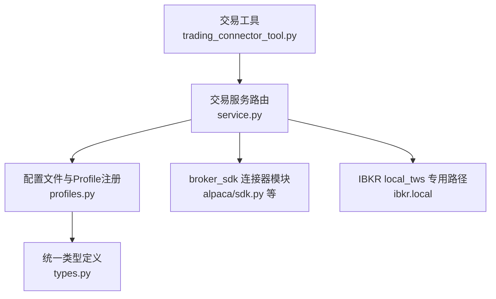
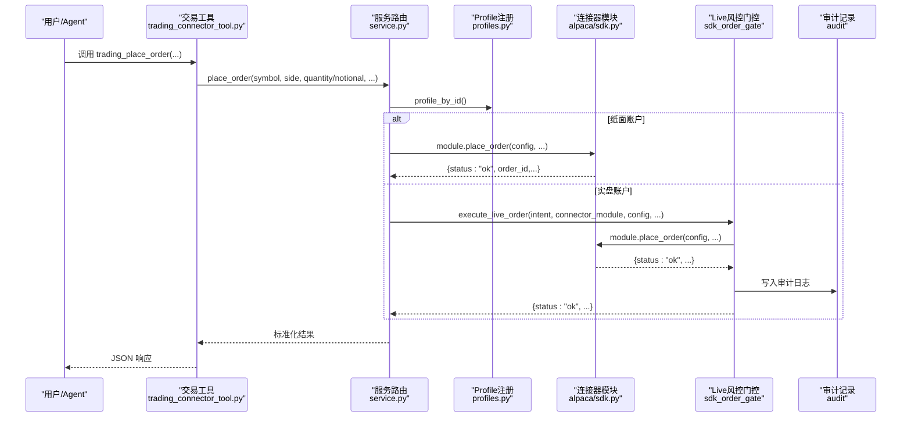
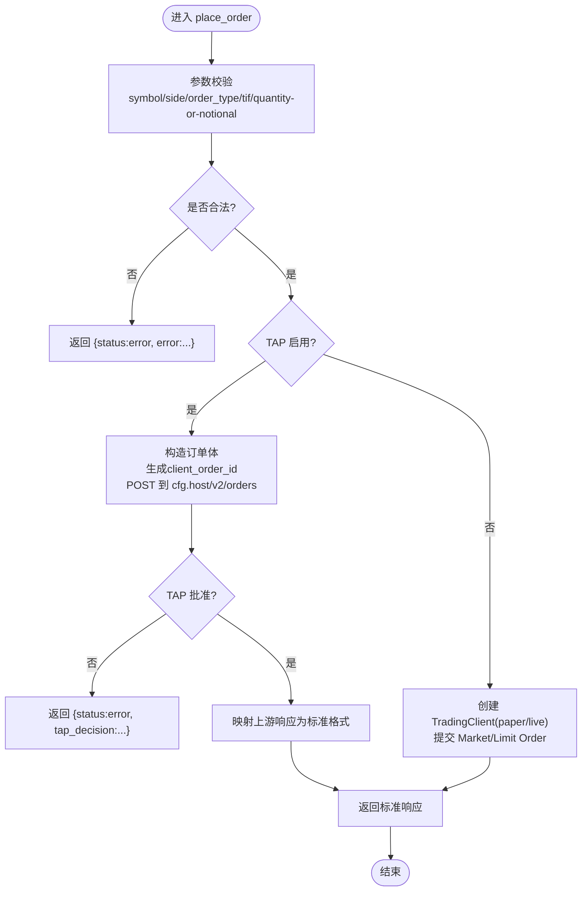
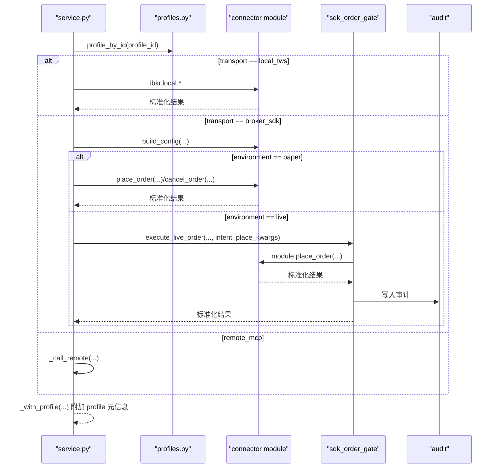
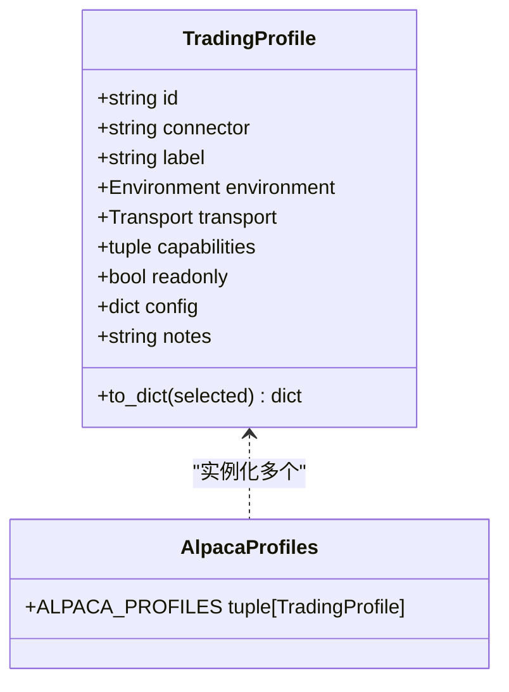
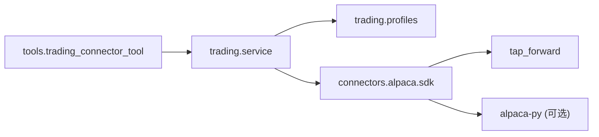

# 自定义连接器开发

<cite>
**本文引用的文件**
- [agent/src/tools/trading_connector_tool.py](file://agent/src/tools/trading_connector_tool.py)
- [agent/src/trading/service.py](file://agent/src/trading/service.py)
- [agent/src/trading/profiles.py](file://agent/src/trading/profiles.py)
- [agent/src/trading/types.py](file://agent/src/trading/types.py)
- [agent/src/trading/connectors/alpaca/sdk.py](file://agent/src/trading/connectors/alpaca/sdk.py)
- [agent/src/trading/connectors/alpaca/profiles.py](file://agent/src/trading/connectors/alpaca/profiles.py)
</cite>

## 目录
1. [简介](#简介)
2. [项目结构](#项目结构)
3. [核心组件](#核心组件)
4. [架构总览](#架构总览)
5. [详细组件分析](#详细组件分析)
6. [依赖关系分析](#依赖关系分析)
7. [性能考虑](#性能考虑)
8. [故障排查指南](#故障排查指南)
9. [结论](#结论)
10. [附录](#附录)

## 简介
本文件面向希望在 Vibe-Trading 中从零开始开发“券商连接器”的工程师，系统阐述连接器的框架、接口规范、数据转换、认证流程、错误处理模式、测试策略、性能优化与部署方式，并重点说明如何保持可维护性与可扩展性。文档以实际代码为依据，通过类图、时序图和流程图展示关键路径，帮助读者快速上手并安全地扩展新的券商接入能力。

## 项目结构
Vibe-Trading 的交易层采用“工具层 → 服务路由层 → 连接器模块”的分层设计：
- 工具层：暴露给 CLI/MCP/Agent 的统一交易工具（如查询账户、下单、取消订单等）。
- 服务路由层：根据配置文件的 profile 选择具体 transport（local_tws / broker_sdk / remote_mcp），并调用对应实现。
- 连接器模块：每个券商一个独立模块，提供统一的读/写接口（build_config、check_status、get_account_snapshot、get_positions、get_open_orders、get_quote、get_historical_bars、place_order、cancel_order 等）。

图表来源
- [agent/src/tools/trading_connector_tool.py:139-174](file://agent/src/tools/trading_connector_tool.py#L139-L174)
- [agent/src/trading/service.py:17-65](file://agent/src/trading/service.py#L17-L65)
- [agent/src/trading/profiles.py:27-41](file://agent/src/trading/profiles.py#L27-L41)
- [agent/src/trading/types.py:8-17](file://agent/src/trading/types.py#L8-L17)

章节来源
- [agent/src/tools/trading_connector_tool.py:139-174](file://agent/src/tools/trading_connector_tool.py#L139-L174)
- [agent/src/trading/service.py:17-65](file://agent/src/trading/service.py#L17-L65)
- [agent/src/trading/profiles.py:27-41](file://agent/src/trading/profiles.py#L27-L41)
- [agent/src/trading/types.py:8-17](file://agent/src/trading/types.py#L8-L17)

## 核心组件
- 交易工具（Tools）：封装参数校验、连接选择、异常包装为 JSON 响应，屏蔽底层差异。
- 服务路由（Service）：按 profile.transport 分发到 local_tws、broker_sdk 或远程 MCP；对 live 环境执行强制风控（mandate、kill switch、审计）。
- Profile 注册表：集中声明各券商可用 profile（id、connector、environment、transport、capabilities、readonly、config、notes），并提供 selected 默认值管理。
- 连接器模块（SDK）：每个券商一个模块，实现统一接口；支持可选 TAP 代理进行凭据隔离与人工审批。

章节来源
- [agent/src/tools/trading_connector_tool.py:208-504](file://agent/src/tools/trading_connector_tool.py#L208-L504)
- [agent/src/trading/service.py:42-117](file://agent/src/trading/service.py#L42-L117)
- [agent/src/trading/profiles.py:44-100](file://agent/src/trading/profiles.py#L44-L100)
- [agent/src/trading/connectors/alpaca/sdk.py:261-426](file://agent/src/trading/connectors/alpaca/sdk.py#L261-L426)

## 架构总览
下图展示了从工具调用到具体券商实现的完整链路，包括 live 环境的风控门控与审计。

图表来源
- [agent/src/tools/trading_connector_tool.py:431-504](file://agent/src/tools/trading_connector_tool.py#L431-L504)
- [agent/src/trading/service.py:279-342](file://agent/src/trading/service.py#L279-L342)
- [agent/src/trading/profiles.py:54-70](file://agent/src/trading/profiles.py#L54-L70)
- [agent/src/trading/connectors/alpaca/sdk.py:429-577](file://agent/src/trading/connectors/alpaca/sdk.py#L429-L577)

## 详细组件分析

### 连接器基类与统一接口
- 统一读接口：check_status、get_account_snapshot、get_positions、get_open_orders、get_quote、get_historical_bars。
- 统一写接口：place_order、cancel_order（以及特定券商的 close_position/edit_position_stops/copy_* 等）。
- 配置构建：build_config(profile.config, overrides) 负责合并持久化配置与运行时覆盖。
- 环境区分：profile.environment 决定 paper/live；transport 决定 local_tws/broker_sdk/remote_mcp。

章节来源
- [agent/src/trading/service.py:17-29](file://agent/src/trading/service.py#L17-L29)
- [agent/src/trading/connectors/alpaca/sdk.py:143-151](file://agent/src/trading/connectors/alpaca/sdk.py#L143-L151)
- [agent/src/trading/types.py:8-17](file://agent/src/trading/types.py#L8-L17)

### Alpaca 连接器示例（read/write + TAP 凭据隔离）
- 配置模型：AlpacaConfig 提供 from_mapping/with_overrides，支持 feed、timeout、readonly 等字段。
- 健康检查：check_status 会尝试读取账户快照，报告 sdk 安装状态、TAP 启用状态、host 等。
- 市场数据：quote/bars 支持直接 SDK 或 TAP 代理两种路径，并对短键名做别名映射。
- 下单与撤单：place_order/cancel_order 在 TAP 启用时走人工审批通道，否则直连 alpaca-py。
- 幂等性：TAP 路径使用基于订单内容的 client_order_id 去重，避免重复下单。

图表来源
- [agent/src/trading/connectors/alpaca/sdk.py:429-577](file://agent/src/trading/connectors/alpaca/sdk.py#L429-L577)
- [agent/src/trading/connectors/alpaca/sdk.py:580-665](file://agent/src/trading/connectors/alpaca/sdk.py#L580-L665)

章节来源
- [agent/src/trading/connectors/alpaca/sdk.py:65-151](file://agent/src/trading/connectors/alpaca/sdk.py#L65-L151)
- [agent/src/trading/connectors/alpaca/sdk.py:261-426](file://agent/src/trading/connectors/alpaca/sdk.py#L261-L426)
- [agent/src/trading/connectors/alpaca/sdk.py:429-748](file://agent/src/trading/connectors/alpaca/sdk.py#L429-L748)

### 服务路由与 Live 风控门控
- 读操作：按 transport 分派到 ibkr.local 或 broker_sdk 模块；不支持的能力返回 _unsupported。
- 写操作：仅支持 broker_sdk；paper 环境直接调用；live 环境通过 mandate + kill switch + 预交易检查 + 审计。
- 分类器：_order_classification 将 symbol 解析为 InstrumentType 与 AssetClass，用于风控策略匹配。
- eToro 特殊逻辑：close_position/cancel_close_order/edit_position_stops 等具备额外的前置校验与结构性限制。

图表来源
- [agent/src/trading/service.py:42-117](file://agent/src/trading/service.py#L42-L117)
- [agent/src/trading/service.py:279-342](file://agent/src/trading/service.py#L279-L342)
- [agent/src/trading/service.py:345-370](file://agent/src/trading/service.py#L345-L370)
- [agent/src/trading/profiles.py:54-70](file://agent/src/trading/profiles.py#L54-L70)

章节来源
- [agent/src/trading/service.py:42-117](file://agent/src/trading/service.py#L42-L117)
- [agent/src/trading/service.py:279-342](file://agent/src/trading/service.py#L279-L342)
- [agent/src/trading/service.py:345-370](file://agent/src/trading/service.py#L345-L370)
- [agent/src/trading/profiles.py:54-70](file://agent/src/trading/profiles.py#L54-L70)

### 配置文件结构与 Profile 管理
- 全局配置文件：~/.vibe-trading/trading-connections.json，保存 selected_profile。
- 券商专属配置：例如 Alpaca 的 ~/.vibe-trading/alpaca.json，由 connector 模块加载与保存。
- Profile 注册：每个 connector 的 profiles.py 声明一组 TradingProfile（id、connector、label、environment、transport、capabilities、readonly、config、notes）。
- 默认值与选择：未选择时回退到 DEFAULT_PROFILE_ID；save_selected_profile_id 会设置文件权限。

图表来源
- [agent/src/trading/types.py:20-52](file://agent/src/trading/types.py#L20-L52)
- [agent/src/trading/connectors/alpaca/profiles.py:15-71](file://agent/src/trading/connectors/alpaca/profiles.py#L15-L71)

章节来源
- [agent/src/trading/profiles.py:24-41](file://agent/src/trading/profiles.py#L24-L41)
- [agent/src/trading/profiles.py:44-100](file://agent/src/trading/profiles.py#L44-L100)
- [agent/src/trading/connectors/alpaca/profiles.py:15-71](file://agent/src/trading/connectors/alpaca/profiles.py#L15-L71)
- [agent/src/trading/types.py:20-52](file://agent/src/trading/types.py#L20-L52)

### 认证流程与凭据隔离（TAP）
- 直连模式：connector 模块直接使用券商 SDK（如 alpaca-py），凭据来自本地配置文件。
- TAP 代理模式：通过环境变量启用，所有请求（含写操作）经 TAP 转发，凭据在服务端注入，支持人工审批与目标主机白名单。
- 读操作：GET 自动批准；写操作：需人工审批，失败关闭（fail-closed）。
- 幂等性：TAP 路径使用确定性 client_order_id 避免重复下单。

章节来源
- [agent/src/trading/connectors/alpaca/sdk.py:183-227](file://agent/src/trading/connectors/alpaca/sdk.py#L183-L227)
- [agent/src/trading/connectors/alpaca/sdk.py:580-665](file://agent/src/trading/connectors/alpaca/sdk.py#L580-L665)

### 错误处理模式
- 工具层：所有异常捕获后返回 {status:"error", error:...}，确保上层稳定消费。
- 连接器层：输入校验失败直接返回错误信封；网络/上游错误统一包装为错误响应。
- Live 写操作：通过风控门控与审计记录，结构性风险（如放宽止损）直接 fail-closed。

章节来源
- [agent/src/tools/trading_connector_tool.py:470-504](file://agent/src/tools/trading_connector_tool.py#L470-L504)
- [agent/src/trading/connectors/alpaca/sdk.py:429-577](file://agent/src/trading/connectors/alpaca/sdk.py#L429-L577)
- [agent/src/trading/service.py:377-413](file://agent/src/trading/service.py#L377-L413)

### 数据转换与标准化
- 市场数据短键名映射：如 bp→bid_price、t→timestamp 等，保证下游 mapper 一致性。
- period/timeframe 映射：将通用 period（1m/5m/1h/1d/1w/1M）转换为券商 SDK 所需的时间粒度。
- 统一响应：所有接口返回包含 status、profile、is_paper、host 等元信息的标准化结构。

章节来源
- [agent/src/trading/connectors/alpaca/sdk.py:186-191](file://agent/src/trading/connectors/alpaca/sdk.py#L186-L191)
- [agent/src/trading/connectors/alpaca/sdk.py:242-249](file://agent/src/trading/connectors/alpaca/sdk.py#L242-L249)
- [agent/src/trading/connectors/alpaca/sdk.py:367-426](file://agent/src/trading/connectors/alpaca/sdk.py#L367-L426)

## 依赖关系分析
- 工具层依赖 service 提供的统一函数（check_connection/get_account/get_positions/get_open_orders/get_quote/get_history/place_order/cancel_order 等）。
- service 依赖 profiles 解析 profile，并按 transport 动态导入对应 connector 模块。
- 连接器模块依赖各自 SDK（如 alpaca-py）与可选 TAP 转发。

图表来源
- [agent/src/tools/trading_connector_tool.py:13-37](file://agent/src/tools/trading_connector_tool.py#L13-L37)
- [agent/src/trading/service.py:17-29](file://agent/src/trading/service.py#L17-L29)
- [agent/src/trading/connectors/alpaca/sdk.py:252-258](file://agent/src/trading/connectors/alpaca/sdk.py#L252-L258)

章节来源
- [agent/src/tools/trading_connector_tool.py:13-37](file://agent/src/tools/trading_connector_tool.py#L13-L37)
- [agent/src/trading/service.py:17-29](file://agent/src/trading/service.py#L17-L29)
- [agent/src/trading/connectors/alpaca/sdk.py:252-258](file://agent/src/trading/connectors/alpaca/sdk.py#L252-L258)

## 性能考虑
- 按需导入：broker_sdk 模块仅在需要时 import，减少启动开销。
- 批量与分页：历史 K 线通过 limit 控制返回条数；必要时结合 period 调整粒度。
- 缓存与复用：SDK 客户端建议复用（如 TradingClient/DataClient），避免频繁建立连接。
- TAP 路径：读操作自动批准，写操作需人工审批，注意审批延迟对整体时延的影响。
- 超时与重试：合理设置 timeout，并在连接器层实现指数退避重试（针对瞬时网络错误）。

[本节为通用指导，不直接分析具体文件]

## 故障排查指南
- 无法识别 profile：检查 selected_profile 是否存在于 BUILTIN_PROFILES。
- 缺少依赖：如 alpaca-py 未安装，check_status 会明确提示。
- TAP 拒绝：查看 tap_decision 与 error 字段，确认审批流与 allowed_hosts。
- Live 写被拒：核对 mandate 与 kill switch 状态，确认 instrument_type/asset_class 分类是否符合策略。
- eToro 特殊限制：部分 live 操作因 API 限制被结构性禁止（如 cancel_close_order/edit_position_stops）。

章节来源
- [agent/src/trading/profiles.py:54-70](file://agent/src/trading/profiles.py#L54-L70)
- [agent/src/trading/connectors/alpaca/sdk.py:261-296](file://agent/src/trading/connectors/alpaca/sdk.py#L261-L296)
- [agent/src/trading/connectors/alpaca/sdk.py:580-665](file://agent/src/trading/connectors/alpaca/sdk.py#L580-L665)
- [agent/src/trading/service.py:554-584](file://agent/src/trading/service.py#L554-L584)

## 结论
Vibe-Trading 的连接器体系通过“工具层—服务路由—连接器模块”的清晰分层，实现了跨券商的统一接入、强一致的数据标准化、严格的安全风控与审计。新增券商只需遵循统一接口、完善配置与 Profile 声明，即可无缝集成。推荐优先采用 broker_sdk 传输，并结合 TAP 实现凭据隔离与人工审批，确保生产环境的稳健运行。

[本节为总结性内容，不直接分析具体文件]

## 附录

### 从零开发一个新券商连接器的步骤清单
- 新建 connector 目录与模块（如 src/trading/connectors/newbroker/sdk.py），实现统一接口：
  - build_config(profile.config, overrides)
  - check_status(config)
  - get_account_snapshot(config)
  - get_positions(config)
  - get_open_orders(config, include_executions=False)
  - get_quote(symbol, config)
  - get_historical_bars(symbol, config, period, limit)
  - place_order(config, symbol, side, quantity/notional, order_type, limit_price, time_in_force)
  - cancel_order(config, order_id, symbol=None)
- 在 newbroker/profiles.py 中声明 TradingProfile（id、connector、label、environment、transport、capabilities、readonly、config、notes）。
- 在 profiles.py 的 BUILTIN_PROFILES 中注册新 connector 的 profiles。
- 如需支持 live 下单，确保 service.py 的 _SDK_CONNECTOR_MODULES 已包含该 connector 映射。
- 可选：实现 TAP 代理路径，提供凭据隔离与人工审批。
- 编写单元测试：覆盖参数校验、错误路径、TAP 分支、period/timeframe 映射、响应标准化。
- 性能与安全：设置合理超时、复用客户端、最小权限凭据、结构化错误与审计。

[本节为实践指引，不直接分析具体文件]