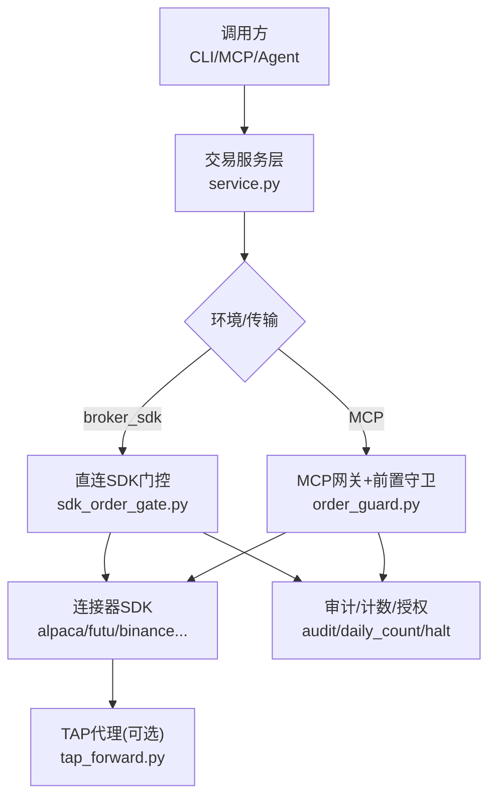
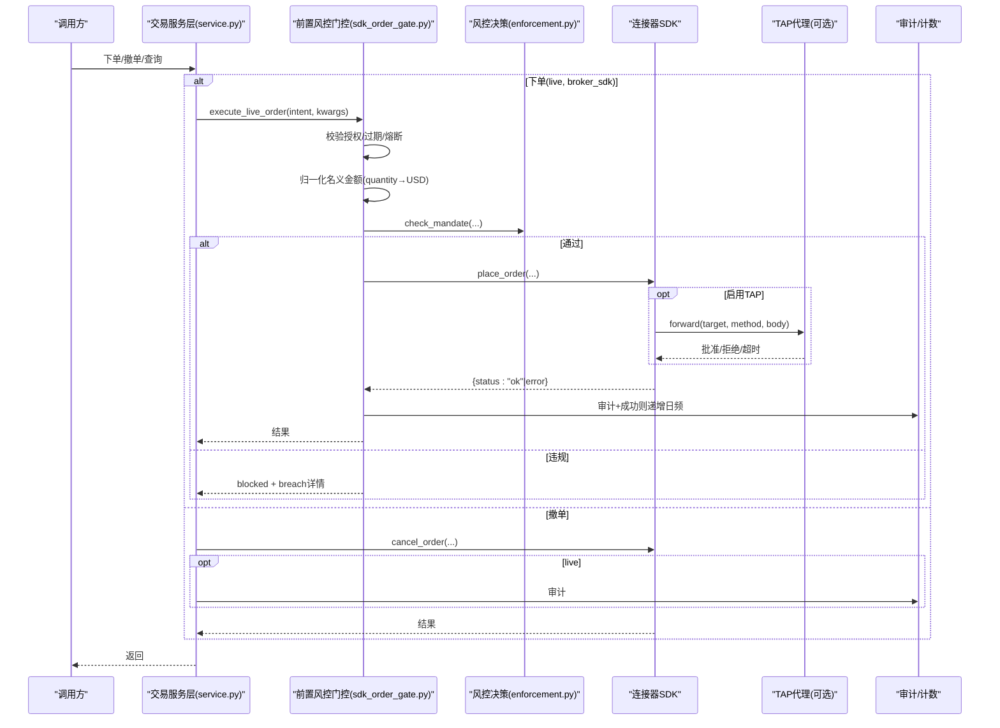
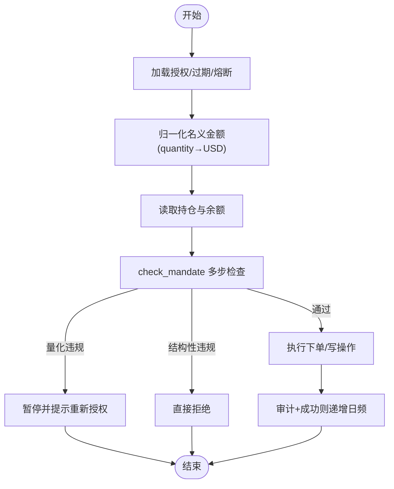
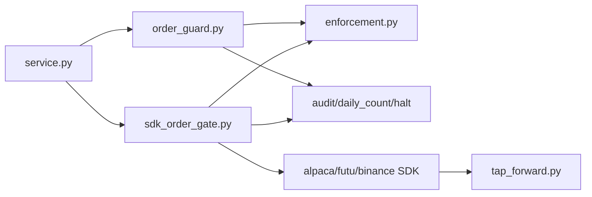

# 订单管理

<cite>
**本文引用的文件**
- [agent/src/trading/service.py](file://agent/src/trading/service.py)
- [agent/src/live/order_guard.py](file://agent/src/live/order_guard.py)
- [agent/src/live/enforcement.py](file://agent/src/live/enforcement.py)
- [agent/src/live/sdk_order_gate.py](file://agent/src/live/sdk_order_gate.py)
- [agent/src/trading/tap_forward.py](file://agent/src/trading/tap_forward.py)
- [agent/src/trading/connectors/alpaca/sdk.py](file://agent/src/trading/connectors/alpaca/sdk.py)
- [agent/src/trading/connectors/futu/sdk.py](file://agent/src/trading/connectors/futu/sdk.py)
- [agent/src/trading/connectors/binance/sdk.py](file://agent/src/trading/connectors/binance/sdk.py)
- [agent/tests/test_runtime_flatten.py](file://agent/tests/test_runtime_flatten.py)
- [agent/tests/test_runtime_reconcile.py](file://agent/tests/test_runtime_reconcile.py)
</cite>

## 目录
1. [简介](#简介)
2. [项目结构](#项目结构)
3. [核心组件](#核心组件)
4. [架构总览](#架构总览)
5. [详细组件分析](#详细组件分析)
6. [依赖关系分析](#依赖关系分析)
7. [性能与并发](#性能与并发)
8. [故障排查指南](#故障排查指南)
9. [结论](#结论)
10. [附录](#附录)

## 简介
本文件面向 Vibe-Trading 的订单管理系统，系统性说明订单生命周期、状态跟踪、路由策略、验证规则、风险控制、执行确认机制，以及与交易连接器的交互模式与错误恢复。文档同时覆盖订单冲突、重复提交、超时处理、一致性与并发控制等关键工程问题，并通过实际代码路径给出创建、修改、取消、查询的完整流程示例。

## 项目结构
订单相关能力由“服务层 + 前置风控门控 + 连接器 SDK + 审计/计数/授权”构成：
- 服务层：统一入口（下单、取消、查询），按 profile 路由到不同连接器或远程 MCP。
- 前置风控门控：对直连 SDK 的写操作进行强制合规检查（指令归一化、额度/杠杆/暴露度/日频限制、资金上限、市场容量/流动性门槛）。
- 连接器 SDK：各券商/交易所的具体实现（Alpaca、Futu、Binance 等），提供下单、撤单、行情、持仓、账户快照等接口。
- 审计/计数/授权：每笔动作写入审计账本；每日成交计数在成功时递增；可选 TAP 代理进行人类审批与凭据隔离。

图示来源
- [agent/src/trading/service.py:279-342](file://agent/src/trading/service.py#L279-L342)
- [agent/src/live/sdk_order_gate.py:59-157](file://agent/src/live/sdk_order_gate.py#L59-L157)
- [agent/src/live/order_guard.py:130-214](file://agent/src/live/order_guard.py#L130-L214)
- [agent/src/trading/tap_forward.py:105-188](file://agent/src/trading/tap_forward.py#L105-L188)

章节来源
- [agent/src/trading/service.py:279-342](file://agent/src/trading/service.py#L279-L342)
- [agent/src/live/sdk_order_gate.py:59-157](file://agent/src/live/sdk_order_gate.py#L59-L157)
- [agent/src/live/order_guard.py:130-214](file://agent/src/live/order_guard.py#L130-L214)
- [agent/src/trading/tap_forward.py:105-188](file://agent/src/trading/tap_forward.py#L105-L188)

## 核心组件
- 交易服务层（service.py）
  - 统一封装 place_order/cancel_order/get_open_orders 等读写能力，按 profile 的 transport/environment 决定走 broker_sdk 直连还是 remote_mcp。
  - 对 live 下单进入 sdk_order_gate 前置风控；对 cancel 直接调用连接器 SDK，并在 live 环境下记录审计。
- 前置风控门控（order_guard.py / sdk_order_gate.py）
  - 加载并校验授权书（mandate）、过期时间、熔断标志；将 quantity 订单归一化为 USD 名义金额（结合连接器报价或数据源）；读取持仓与余额；执行 check_mandate 多步风控；仅当通过才放行。
  - 所有失败路径 fail-closed，不触发任何远端写操作。
- 风控决策（enforcement.py）
  - 定义 OrderIntent/BreachEvent，按固定顺序检查：排除名单→允许品种→资产类别→单笔名义金额→总暴露度→杠杆→日频→资金上限→市场容量/流动性门槛。
- 连接器 SDK（alpaca/futu/binance 等）
  - 实现具体下单/撤单/报价/持仓/账户快照； Alpaca 使用 TAP 代理进行凭据隔离与人类审批； Futu/Binance 直接调用各自 SDK。
- 审计/计数/授权（audit/daily_count/halt/tap_forward）
  - 每笔动作写入审计事件；仅在成功时递增日频计数；可配置 TAP 代理进行审批流与凭据隔离。

章节来源
- [agent/src/trading/service.py:279-370](file://agent/src/trading/service.py#L279-L370)
- [agent/src/live/order_guard.py:130-214](file://agent/src/live/order_guard.py#L130-L214)
- [agent/src/live/sdk_order_gate.py:59-157](file://agent/src/live/sdk_order_gate.py#L59-L157)
- [agent/src/live/enforcement.py:455-617](file://agent/src/live/enforcement.py#L455-L617)
- [agent/src/trading/connectors/alpaca/sdk.py:615-648](file://agent/src/trading/connectors/alpaca/sdk.py#L615-L648)
- [agent/src/trading/connectors/futu/sdk.py:492-539](file://agent/src/trading/connectors/futu/sdk.py#L492-L539)
- [agent/src/trading/connectors/binance/sdk.py:570-600](file://agent/src/trading/connectors/binance/sdk.py#L570-L600)
- [agent/src/trading/tap_forward.py:105-188](file://agent/src/trading/tap_forward.py#L105-L188)

## 架构总览
订单从发起至落地的端到端流程如下：

图示来源
- [agent/src/trading/service.py:279-370](file://agent/src/trading/service.py#L279-L370)
- [agent/src/live/sdk_order_gate.py:59-157](file://agent/src/live/sdk_order_gate.py#L59-L157)
- [agent/src/live/enforcement.py:455-617](file://agent/src/live/enforcement.py#L455-L617)
- [agent/src/trading/connectors/alpaca/sdk.py:615-648](file://agent/src/trading/connectors/alpaca/sdk.py#L615-L648)
- [agent/src/trading/tap_forward.py:105-188](file://agent/src/trading/tap_forward.py#L105-L188)

## 详细组件分析

### 订单生命周期与状态跟踪
- 创建（place_order）
  - service.py 根据 profile 选择直连 SDK 或 MCP；live 下进入 sdk_order_gate 前置风控，通过后调用连接器 SDK 下单。
  - 连接器侧可能经 TAP 代理（如 Alpaca）进行人类审批与凭据隔离。
- 修改/撤销（cancel_order）
  - service.py 直接调用连接器 SDK 的 cancel；live 环境下记录审计。
- 查询（get_open_orders/get_positions/get_account）
  - service.py 按 transport 分发到对应连接器或远程工具，用于风控与对账。
- 状态跟踪
  - 通过 get_open_orders 获取挂单；对账阶段（reconcile）对比本地记录与券商状态，识别孤儿单、未知成交等异常并触发暂停。

章节来源
- [agent/src/trading/service.py:94-117](file://agent/src/trading/service.py#L94-L117)
- [agent/src/trading/service.py:279-370](file://agent/src/trading/service.py#L279-L370)
- [agent/tests/test_runtime_reconcile.py:145-184](file://agent/tests/test_runtime_reconcile.py#L145-L184)

### 订单路由策略
- 基于 profile 的 transport 与环境：
  - local_tws：IBKR 本地客户端。
  - broker_sdk：直连 SDK（tiger/alpaca/okx/binance/futu/dhan/shoonya/trading212/mt5/etoro）。
  - remote_mcp：通过 MCP 网关转发。
- 对于 eToro 等特殊连接器，部分写操作受结构性原因限制（如关闭挂单、调整止损），会返回结构化拒绝信息。

章节来源
- [agent/src/trading/service.py:17-29](file://agent/src/trading/service.py#L17-L29)
- [agent/src/trading/service.py:377-413](file://agent/src/trading/service.py#L377-L413)
- [agent/src/trading/service.py:554-584](file://agent/src/trading/service.py#L554-L584)

### 订单验证规则与风险控制
- 指令归一化：quantity 订单通过连接器报价或数据源转换为 USD 名义金额，取显式名义金额与隐含金额的较大值，防止绕过限额。
- 风控检查顺序（fail-closed）：
  - 排除名单 → 允许品种 → 资产类别 → 单笔名义金额 → 总暴露度 → 杠杆 → 日频 → 资金上限 → 市场容量/流动性门槛。
- 量化违规触发 PAUSE_FOR_REAUTH；结构性违规直接 DENY。

图示来源
- [agent/src/live/order_guard.py:130-214](file://agent/src/live/order_guard.py#L130-L214)
- [agent/src/live/sdk_order_gate.py:59-157](file://agent/src/live/sdk_order_gate.py#L59-L157)
- [agent/src/live/enforcement.py:455-617](file://agent/src/live/enforcement.py#L455-L617)

章节来源
- [agent/src/live/order_guard.py:216-289](file://agent/src/live/order_guard.py#L216-L289)
- [agent/src/live/enforcement.py:210-286](file://agent/src/live/enforcement.py#L210-L286)
- [agent/src/live/enforcement.py:455-617](file://agent/src/live/enforcement.py#L455-L617)

### 执行确认机制与审计
- 前置门控在执行前完成全部校验；只有通过后才调用连接器 SDK。
- 审计事件包含请求/响应摘要、门禁决策、会话 ID、授权引用等；仅在成功时递增日频计数。
- 对失败的远端调用，审计标记为 rejected/error，且不消耗日频计数。

章节来源
- [agent/src/live/order_guard.py:321-389](file://agent/src/live/order_guard.py#L321-L389)
- [agent/src/live/sdk_order_gate.py:317-379](file://agent/src/live/sdk_order_gate.py#L317-L379)

### 与交易连接器的交互模式
- Alpaca：通过 TAP 代理进行人类审批与凭据隔离；下单/撤单均走 forward；支持幂等 client_order_id 去重。
- Futu：通过 OpenD 交易上下文下单/撤单；失败路径统一返回 error envelope。
- Binance：通过 ccxt 抽象层下单/撤单；参数校验严格，失败返回结构化错误。

章节来源
- [agent/src/trading/connectors/alpaca/sdk.py:615-648](file://agent/src/trading/connectors/alpaca/sdk.py#L615-L648)
- [agent/src/trading/connectors/alpaca/sdk.py:723-748](file://agent/src/trading/connectors/alpaca/sdk.py#L723-L748)
- [agent/src/trading/connectors/futu/sdk.py:492-539](file://agent/src/trading/connectors/futu/sdk.py#L492-L539)
- [agent/src/trading/connectors/futu/sdk.py:542-599](file://agent/src/trading/connectors/futu/sdk.py#L542-L599)
- [agent/src/trading/connectors/binance/sdk.py:570-600](file://agent/src/trading/connectors/binance/sdk.py#L570-L600)

### 订单冲突、重复提交与超时处理
- 重复提交：Alpaca 使用确定性 client_order_id 做幂等去重，避免重复下单。
- 超时处理：TAP 代理在人类审批超时时返回 timeout；调用方可据此重试或降级，但需依赖幂等键避免重复。
- 冲突处理：对账模块检测本地记录与券商不一致（如已确认订单消失），触发暂停并阻止持久化，直到人工干预。

章节来源
- [agent/src/trading/connectors/alpaca/sdk.py:615-648](file://agent/src/trading/connectors/alpaca/sdk.py#L615-L648)
- [agent/src/trading/tap_forward.py:152-188](file://agent/src/trading/tap_forward.py#L152-L188)
- [agent/tests/test_runtime_reconcile.py:145-184](file://agent/tests/test_runtime_reconcile.py#L145-L184)

### 一致性保证与并发控制
- 日频计数原子性：通过 daily_order_lock 保护读-改-写，确保并发下单不会超额。
- 审计与计数解耦：审计失败不影响决策；计数仅在成功时递增，避免误扣。
- 对账与熔断：发现不一致立即暂停，防止错误累积。

章节来源
- [agent/src/live/order_guard.py:184-214](file://agent/src/live/order_guard.py#L184-L214)
- [agent/src/live/sdk_order_gate.py:120-157](file://agent/src/live/sdk_order_gate.py#L120-L157)
- [agent/tests/test_runtime_flatten.py:116-181](file://agent/tests/test_runtime_flatten.py#L116-L181)

## 依赖关系分析
- service.py 依赖 connector SDK 与 live 门控；connector SDK 依赖各自第三方库或 TAP 代理。
- order_guard.py 与 sdk_order_gate.py 共同复用 enforcement.py 的风控逻辑与 audit/daily_count/halt 基础设施。
- 测试用例验证了取消/平仓顺序、错误不重试、审计记录完整性等契约。

图示来源
- [agent/src/trading/service.py:279-370](file://agent/src/trading/service.py#L279-L370)
- [agent/src/live/order_guard.py:130-214](file://agent/src/live/order_guard.py#L130-L214)
- [agent/src/live/sdk_order_gate.py:59-157](file://agent/src/live/sdk_order_gate.py#L59-L157)
- [agent/src/live/enforcement.py:455-617](file://agent/src/live/enforcement.py#L455-L617)
- [agent/src/trading/tap_forward.py:105-188](file://agent/src/trading/tap_forward.py#L105-L188)

章节来源
- [agent/src/trading/service.py:279-370](file://agent/src/trading/service.py#L279-L370)
- [agent/src/live/order_guard.py:130-214](file://agent/src/live/order_guard.py#L130-L214)
- [agent/src/live/sdk_order_gate.py:59-157](file://agent/src/live/sdk_order_gate.py#L59-L157)
- [agent/src/live/enforcement.py:455-617](file://agent/src/live/enforcement.py#L455-L617)
- [agent/src/trading/tap_forward.py:105-188](file://agent/src/trading/tap_forward.py#L105-L188)

## 性能与并发
- 报价获取优先使用连接器报价，其次回退到数据源；失败即拒绝，避免阻塞链路。
- 风控检查顺序固定且短路，减少不必要计算。
- 日频计数加锁保护临界区，避免高并发下的超额风险。
- TAP 审批采用异步轮询，避免长时间阻塞主线程；超时可控。

[本节为通用指导，无需特定文件来源]

## 故障排查指南
- 下单被拒
  - 检查授权是否有效/过期；查看熔断标志；核对指令归一化后的名义金额是否超限；关注 breack 详情（品种/资产类别/暴露度/杠杆/日频/资金上限）。
- 撤单失败
  - 确认 order_id/symbol 正确；连接器返回 error envelope；live 环境会记录审计。
- 对账不一致
  - 出现孤儿单或未知成交将触发暂停；检查本地记录与券商状态差异，必要时人工介入。
- TAP 超时
  - 检查审批超时配置；确认目标主机与凭据头；重试需依赖幂等键避免重复下单。

章节来源
- [agent/src/live/order_guard.py:471-573](file://agent/src/live/order_guard.py#L471-L573)
- [agent/src/live/sdk_order_gate.py:441-517](file://agent/src/live/sdk_order_gate.py#L441-L517)
- [agent/tests/test_runtime_reconcile.py:145-184](file://agent/tests/test_runtime_reconcile.py#L145-L184)
- [agent/src/trading/tap_forward.py:152-188](file://agent/src/trading/tap_forward.py#L152-L188)

## 结论
Vibe-Trading 的订单管理以“强前置风控 + 审计可追溯 + 连接器抽象 + 可选人类审批”为核心设计，确保在复杂多连接器环境下仍能保持一致性、安全性与可运维性。通过严格的 fail-closed 策略、原子化的日频计数与对账熔断机制，系统能够在高风险场景中主动防御，并提供清晰的排障线索与恢复路径。

[本节为总结，无需特定文件来源]

## 附录
- 典型流程参考路径
  - 下单：service.place_order → sdk_order_gate.execute_live_order → enforcement.check_mandate → connector.place_order（可能经 TAP）
  - 撤单：service.cancel_order → connector.cancel_order（live 审计）
  - 查询：service.get_open_orders/get_positions/get_account → 连接器或 MCP
  - 对账/清仓：test_runtime_flatten 中的 flatten_and_cancel 流程（先取消挂单，再平掉持仓）

章节来源
- [agent/src/trading/service.py:279-370](file://agent/src/trading/service.py#L279-L370)
- [agent/src/live/sdk_order_gate.py:59-157](file://agent/src/live/sdk_order_gate.py#L59-L157)
- [agent/src/live/enforcement.py:455-617](file://agent/src/live/enforcement.py#L455-L617)
- [agent/tests/test_runtime_flatten.py:79-113](file://agent/tests/test_runtime_flatten.py#L79-L113)