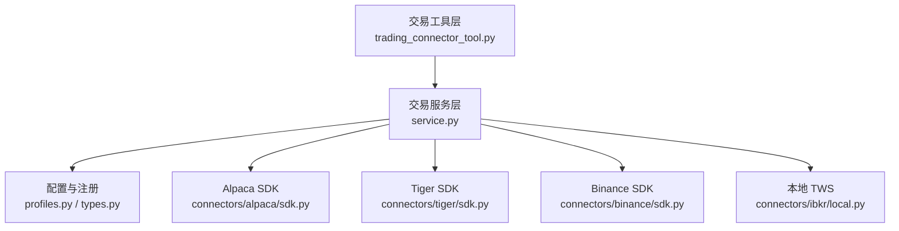
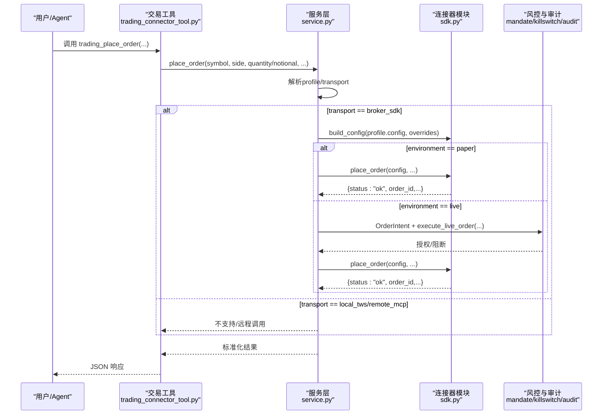
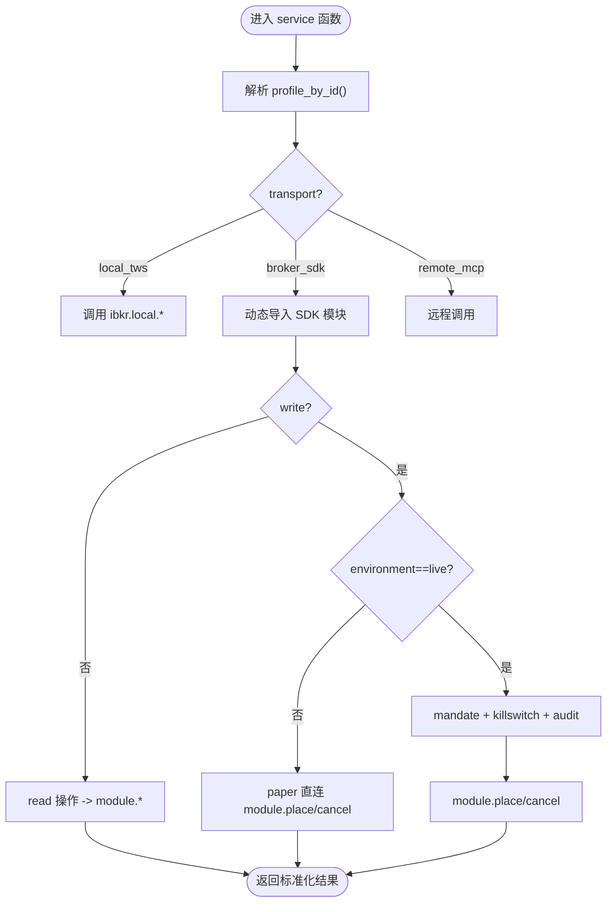
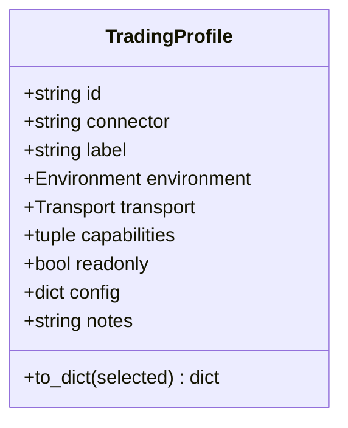
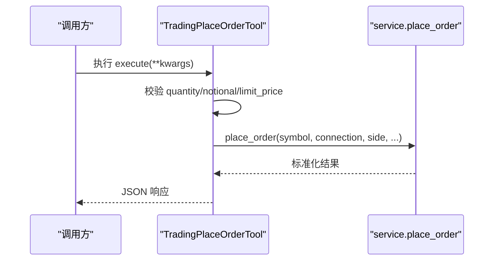
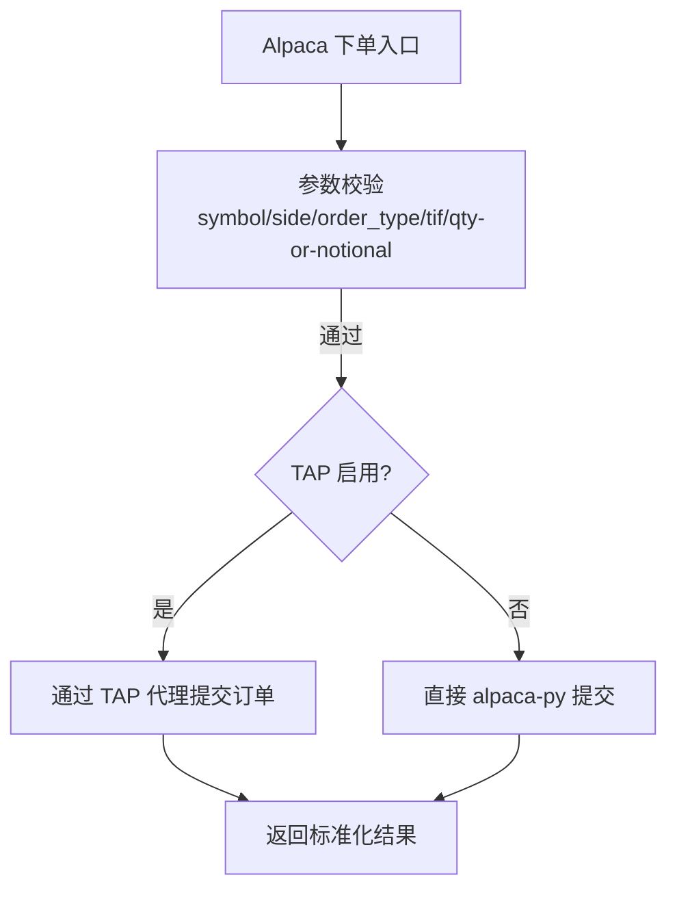
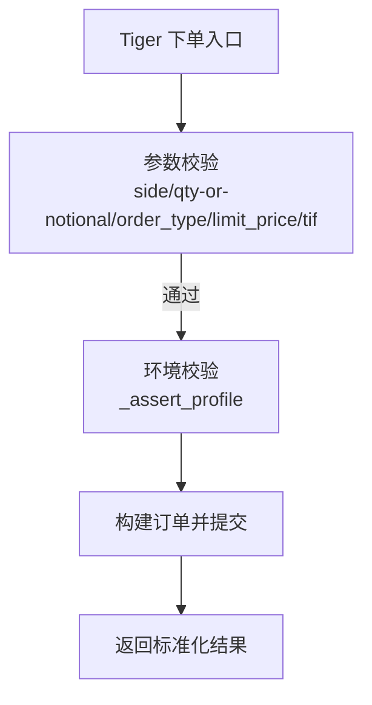
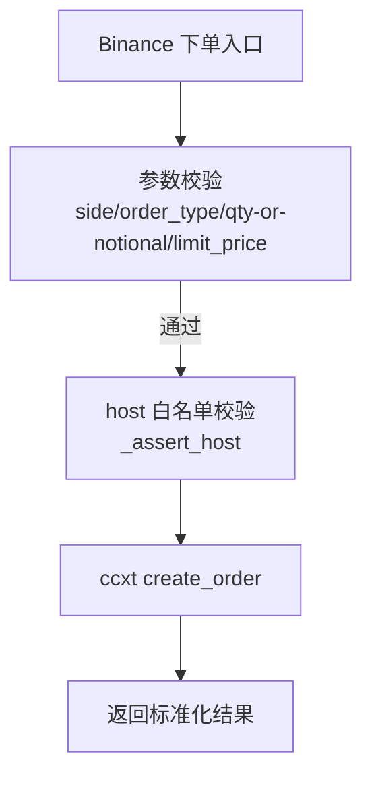
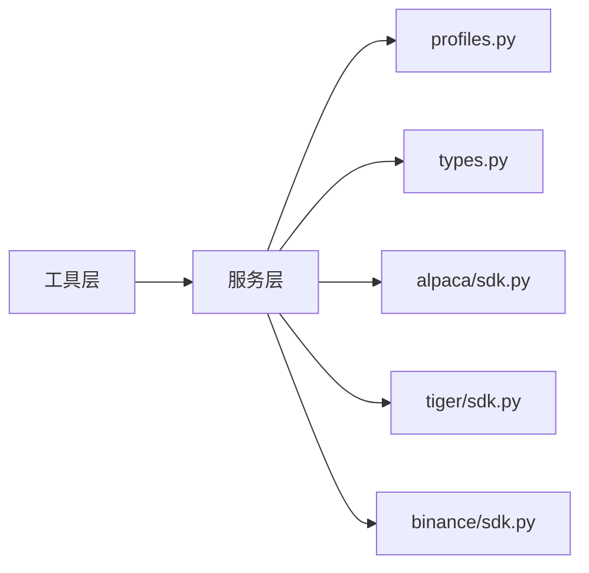

# 连接器架构

<cite>
**本文引用的文件**
- [service.py](file://agent/src/trading/service.py)
- [profiles.py](file://agent/src/trading/profiles.py)
- [types.py](file://agent/src/trading/types.py)
- [trading_connector_tool.py](file://agent/src/tools/trading_connector_tool.py)
- [alpaca/sdk.py](file://agent/src/trading/connectors/alpaca/sdk.py)
- [tiger/sdk.py](file://agent/src/trading/connectors/tiger/sdk.py)
- [binance/sdk.py](file://agent/src/trading/connectors/binance/sdk.py)
</cite>

## 目录
1. [简介](#简介)
2. [项目结构](#项目结构)
3. [核心组件](#核心组件)
4. [架构总览](#架构总览)
5. [详细组件分析](#详细组件分析)
6. [依赖关系分析](#依赖关系分析)
7. [性能考虑](#性能考虑)
8. [故障排查指南](#故障排查指南)
9. [结论](#结论)
10. [附录](#附录)

## 简介
本文件系统性阐述 Vibe-Trading 的“连接器架构”，聚焦以下目标：
- 连接器抽象层设计与统一接口规范
- 连接池与生命周期管理（以配置加载、环境隔离、健康检查为核心）
- 注册机制、配置验证与错误处理策略
- 如何定义新的连接器类型（含具体示例路径）
- 核心方法、参数与返回值约定
- 与交易系统其他组件的集成方式（工具层、服务层、风控与审计）
- 多券商支持与扩展机制
- 常见连接问题及解决方案

## 项目结构
Vibe-Trading 将“连接器”按券商/平台拆分到独立模块，并通过统一的“服务层”对外暴露一致的交易能力。顶层结构如下：
- 工具层：面向 CLI/MCP/Agent 的工具类，负责参数校验、选择默认连接、调用服务层
- 服务层：根据 profile 的 transport 路由到 local_tws、broker_sdk 或 remote_mcp；对 broker_sdk 通过映射表动态导入对应 SDK 模块
- 连接器实现：每个券商一个 sdk.py，提供 build_config、check_status、get_account_snapshot、get_positions、get_open_orders、get_quote、get_historical_bars、place_order、cancel_order 等统一接口
- 配置与注册：profiles.py 汇总各券商内置 profiles；types.py 定义 TradingProfile 数据模型

**图表来源**
- [service.py:17-29](file://agent/src/trading/service.py#L17-L29)
- [profiles.py:27-41](file://agent/src/trading/profiles.py#L27-L41)
- [trading_connector_tool.py:139-174](file://agent/src/tools/trading_connector_tool.py#L139-L174)

**章节来源**
- [service.py:17-29](file://agent/src/trading/service.py#L17-L29)
- [profiles.py:27-41](file://agent/src/trading/profiles.py#L27-L41)
- [types.py:20-52](file://agent/src/trading/types.py#L20-L52)
- [trading_connector_tool.py:139-174](file://agent/src/tools/trading_connector_tool.py#L139-L174)

## 核心组件
- 统一接口规范（broker_sdk）：所有 SDK 连接器需实现 build_config、check_status、get_account_snapshot、get_positions、get_open_orders、get_quote、get_historical_bars、place_order、cancel_order。服务层通过 _SDK_CONNECTOR_MODULES 映射表动态导入并调用。
- 配置与注册：profiles.py 聚合各券商内置 profiles；TradingProfile 描述 id、connector、environment、transport、capabilities、readonly、config 等元信息。
- 工具层：trading_connector_tool.py 提供 trading_* 工具，封装参数校验、选择默认连接、调用 service.py 的统一函数。
- 安全与合规：live 下单走 mandate + kill switch + fail-closed 预检 + 审计；paper 直接沙箱；部分写操作在 live 下结构性禁用（fail-closed）。

**章节来源**
- [service.py:17-29](file://agent/src/trading/service.py#L17-L29)
- [profiles.py:20-41](file://agent/src/trading/profiles.py#L20-L41)
- [types.py:20-52](file://agent/src/trading/types.py#L20-L52)
- [trading_connector_tool.py:208-260](file://agent/src/tools/trading_connector_tool.py#L208-L260)

## 架构总览
下图展示从工具到服务再到具体连接器的调用链，以及 live 下单时的风控与审计路径。

**图表来源**
- [service.py:279-342](file://agent/src/trading/service.py#L279-L342)
- [service.py:377-413](file://agent/src/trading/service.py#L377-L413)
- [trading_connector_tool.py:431-504](file://agent/src/tools/trading_connector_tool.py#L431-L504)

## 详细组件分析

### 服务层（service.py）：统一路由与能力分发
- 路由逻辑：根据 profile.transport 决定调用 local_tws、broker_sdk 或 remote_mcp；broker_sdk 通过 _SDK_CONNECTOR_MODULES 映射表动态导入模块。
- 读操作：account/positions/orders/quote/history 均先解析 profile，再转发至对应模块。
- 写操作：仅支持 broker_sdk；paper 直连沙箱；live 强制经过 mandate + kill switch + 预检 + 审计。
- 分类器：_order_classification 根据 connector 与 symbol 推断 InstrumentType 与 AssetClass，用于风控门控。

**图表来源**
- [service.py:42-117](file://agent/src/trading/service.py#L42-L117)
- [service.py:279-342](file://agent/src/trading/service.py#L279-L342)
- [service.py:377-413](file://agent/src/trading/service.py#L377-L413)

**章节来源**
- [service.py:17-29](file://agent/src/trading/service.py#L17-L29)
- [service.py:42-117](file://agent/src/trading/service.py#L42-L117)
- [service.py:279-342](file://agent/src/trading/service.py#L279-L342)
- [service.py:377-413](file://agent/src/trading/service.py#L377-L413)

### 配置与注册（profiles.py / types.py）
- profiles.py：集中声明各券商内置 profiles，并提供 list_profiles、profile_by_id、load/save_selected_profile_id。
- types.py：TradingProfile 数据模型包含 id、connector、label、environment、transport、capabilities、readonly、config、notes；to_dict 用于序列化。

**图表来源**
- [types.py:20-52](file://agent/src/trading/types.py#L20-L52)

**章节来源**
- [profiles.py:27-41](file://agent/src/trading/profiles.py#L27-L41)
- [profiles.py:44-100](file://agent/src/trading/profiles.py#L44-L100)
- [types.py:20-52](file://agent/src/trading/types.py#L20-L52)

### 工具层（trading_connector_tool.py）：参数校验与调用封装
- 统一参数：TRADING_COMMON_PARAMETERS 提供 connection/host/port/client_id/account 等通用参数。
- 数值校验：_finite_float/_int_or_none/_num_or_none 确保数量/价格合法，失败即返回错误信封，避免误下单。
- 工具类：trading_check/trading_account/trading_positions/trading_orders/trading_quote/trading_history/trading_place_order/trading_cancel_order 等，内部调用 service.py 的对应函数。

**图表来源**
- [trading_connector_tool.py:139-174](file://agent/src/tools/trading_connector_tool.py#L139-L174)
- [trading_connector_tool.py:431-504](file://agent/src/tools/trading_connector_tool.py#L431-L504)

**章节来源**
- [trading_connector_tool.py:139-174](file://agent/src/tools/trading_connector_tool.py#L139-L174)
- [trading_connector_tool.py:208-260](file://agent/src/tools/trading_connector_tool.py#L208-L260)
- [trading_connector_tool.py:431-504](file://agent/src/tools/trading_connector_tool.py#L431-L504)

### 连接器实现：Alpaca（alpaca/sdk.py）
- 配置：AlpacaConfig 支持 api_key/secret_key/profile/feed/timeout/readonly；build_config 合并 saved file、profile defaults、CLI overrides。
- 环境隔离：paper/live 通过不同 host 与 key 区分；check_status 报告 sdk 安装状态、host 分离、账户信息。
- 读写接口：get_account_snapshot/get_positions/get_open_orders/get_quote/get_historical_bars/place_order/cancel_order；可选 TAP 代理进行凭据隔离与人工审批。
- 错误处理：输入校验失败返回 {status:"error", error:...}；网络/认证异常捕获后同样返回错误信封。

**图表来源**
- [alpaca/sdk.py:143-151](file://agent/src/trading/connectors/alpaca/sdk.py#L143-L151)
- [alpaca/sdk.py:261-296](file://agent/src/trading/connectors/alpaca/sdk.py#L261-L296)
- [alpaca/sdk.py:429-577](file://agent/src/trading/connectors/alpaca/sdk.py#L429-L577)
- [alpaca/sdk.py:580-665](file://agent/src/trading/connectors/alpaca/sdk.py#L580-L665)

**章节来源**
- [alpaca/sdk.py:65-151](file://agent/src/trading/connectors/alpaca/sdk.py#L65-L151)
- [alpaca/sdk.py:261-296](file://agent/src/trading/connectors/alpaca/sdk.py#L261-L296)
- [alpaca/sdk.py:429-577](file://agent/src/trading/connectors/alpaca/sdk.py#L429-L577)
- [alpaca/sdk.py:580-665](file://agent/src/trading/connectors/alpaca/sdk.py#L580-L665)

### 连接器实现：Tiger（tiger/sdk.py）
- 配置：TigerConfig 支持 tiger_id/private_key_path/account/profile/timeout/readonly；build_config 合并 saved file、profile defaults、CLI overrides。
- 环境隔离：通过账号号格式判断 paper/live；check_status 报告 sdk 安装状态、账户身份、资产货币。
- 读写接口：get_account_snapshot/get_positions/get_open_orders/get_quote/get_historical_bars/place_order/cancel_order；paper 账户强制 DAY TIF。
- 错误处理：输入校验失败返回错误信封；SDK 版本差异通过 _safe_call 兼容。

**图表来源**
- [tiger/sdk.py:126-146](file://agent/src/trading/connectors/tiger/sdk.py#L126-L146)
- [tiger/sdk.py:186-230](file://agent/src/trading/connectors/tiger/sdk.py#L186-L230)
- [tiger/sdk.py:333-489](file://agent/src/trading/connectors/tiger/sdk.py#L333-L489)
- [tiger/sdk.py:591-607](file://agent/src/trading/connectors/tiger/sdk.py#L591-L607)

**章节来源**
- [tiger/sdk.py:61-146](file://agent/src/trading/connectors/tiger/sdk.py#L61-L146)
- [tiger/sdk.py:186-230](file://agent/src/trading/connectors/tiger/sdk.py#L186-L230)
- [tiger/sdk.py:333-489](file://agent/src/trading/connectors/tiger/sdk.py#L333-L489)
- [tiger/sdk.py:591-607](file://agent/src/trading/connectors/tiger/sdk.py#L591-L607)

### 连接器实现：Binance（binance/sdk.py）
- 配置：BinanceConfig 支持 api_key/api_secret/profile/testnet_host/timeout/readonly；build_config 合并 saved file、profile defaults、CLI overrides。
- 环境隔离：testnet vs live 通过 set_sandbox_mode 与 host 白名单校验；check_status 报告 sdk 安装状态、host 分离、余额数量。
- 读写接口：get_account_snapshot/get_positions(get non-zero balances)/get_open_orders/get_quote/get_historical_bars/place_order/cancel_order；notional 仅市场单支持。
- 错误处理：输入校验失败返回错误信封；ccxt 异常捕获后返回错误信封。

**图表来源**
- [binance/sdk.py:157-177](file://agent/src/trading/connectors/binance/sdk.py#L157-L177)
- [binance/sdk.py:217-264](file://agent/src/trading/connectors/binance/sdk.py#L217-L264)
- [binance/sdk.py:423-547](file://agent/src/trading/connectors/binance/sdk.py#L423-L547)
- [binance/sdk.py:643-662](file://agent/src/trading/connectors/binance/sdk.py#L643-L662)

**章节来源**
- [binance/sdk.py:82-177](file://agent/src/trading/connectors/binance/sdk.py#L82-L177)
- [binance/sdk.py:217-264](file://agent/src/trading/connectors/binance/sdk.py#L217-L264)
- [binance/sdk.py:423-547](file://agent/src/trading/connectors/binance/sdk.py#L423-L547)
- [binance/sdk.py:643-662](file://agent/src/trading/connectors/binance/sdk.py#L643-L662)

## 依赖关系分析
- 服务层依赖 profiles.py 获取 profile；依赖 types.py 的数据模型；依赖各 connector 的 sdk.py。
- 工具层依赖 service.py 的函数；依赖 profiles.py 的选择与保存。
- 连接器之间相互独立，通过统一接口被服务层调度。

**图表来源**
- [service.py:17-29](file://agent/src/trading/service.py#L17-L29)
- [profiles.py:27-41](file://agent/src/trading/profiles.py#L27-L41)
- [types.py:20-52](file://agent/src/trading/types.py#L20-L52)

**章节来源**
- [service.py:17-29](file://agent/src/trading/service.py#L17-L29)
- [profiles.py:27-41](file://agent/src/trading/profiles.py#L27-L41)
- [types.py:20-52](file://agent/src/trading/types.py#L20-L52)

## 性能考虑
- 按需导入：broker_sdk 通过 importlib 动态导入模块，减少启动开销。
- 只读优先：多数工具标记 is_readonly=True，降低写操作频率。
- 批量读取：历史 K 线使用 limit 控制返回条数，避免大响应。
- 超时与重试：各连接器配置 timeout；Binance 开启 enableRateLimit。
- 缓存建议：可在上层对 get_quote/get_historical_bars 做短期缓存以减少 API 调用。

[本节为通用指导，不直接分析具体文件]

## 故障排查指南
- 未找到 profile：确认 selected_profile 是否存在且可解析；查看 profiles.py 中内置列表。
- 缺少依赖：check_status 会报告缺失的 SDK（如 alpaca-py、tigeropen、ccxt），按提示安装。
- 配置不完整：check_status 会列出缺失字段（如 api_key、private_key_path、account）。
- 环境不匹配：Tiger 会校验账号号格式；Binance 会校验 host 白名单；Alpaca 会校验 host 分离。
- 下单失败：检查 quantity/notional 互斥、limit 订单必须提供 limit_price、TIF 值是否受支持。
- 取消订单：Binance 取消需要 symbol；Alpaca/Tiger 按 order_id 取消。

**章节来源**
- [profiles.py:54-83](file://agent/src/trading/profiles.py#L54-L83)
- [alpaca/sdk.py:261-296](file://agent/src/trading/connectors/alpaca/sdk.py#L261-L296)
- [tiger/sdk.py:186-230](file://agent/src/trading/connectors/tiger/sdk.py#L186-L230)
- [binance/sdk.py:217-264](file://agent/src/trading/connectors/binance/sdk.py#L217-L264)
- [binance/sdk.py:550-600](file://agent/src/trading/connectors/binance/sdk.py#L550-L600)

## 结论
Vibe-Trading 的连接器架构通过“工具层—服务层—连接器模块”的分层设计，实现了：
- 统一接口与能力分发，屏蔽底层券商差异
- 严格的配置与注册机制，保证 profile 可发现、可切换
- 强大的安全与合规保障：paper/live 环境隔离、mandate/killswitch 前置、审计记录
- 可扩展的多券商支持：新增连接器只需实现标准接口并注册到 profiles 与服务层映射表

## 附录

### 如何定义新的连接器类型（步骤与要点）
- 创建模块：在 agent/src/trading/connectors/<your_broker>/sdk.py 中实现：
  - build_config(profile_config, overrides) -> Config
  - check_status(config) -> {status, config, sdk, ...}
  - get_account_snapshot(config) -> {status, account, ...}
  - get_positions(config) -> {status, positions, ...}
  - get_open_orders(config, include_executions) -> {status, open_orders, executions?}
  - get_quote(symbol, config) -> {status, quote, ...}
  - get_historical_bars(symbol, config, period, limit) -> {status, bars, ...}
  - place_order(config, symbol, side, quantity/notional, order_type, limit_price, time_in_force) -> {status, order_id, ...}
  - cancel_order(config, order_id, symbol?) -> {status, order_id, ...}
- 注册 profiles：在 agent/src/trading/connectors/<your_broker>/profiles.py 中定义内置 profiles，并在 agent/src/trading/profiles.py 的 BUILTIN_PROFILES 中加入。
- 服务层映射：在 service.py 的 _SDK_CONNECTOR_MODULES 中添加 "<your_broker>: 'src.trading.connectors.<your_broker>.sdk'"。
- 工具层：如需专用工具，参考 trading_connector_tool.py 中的工具类模式添加。

**章节来源**
- [service.py:17-29](file://agent/src/trading/service.py#L17-L29)
- [profiles.py:27-41](file://agent/src/trading/profiles.py#L27-L41)
- [trading_connector_tool.py:208-260](file://agent/src/tools/trading_connector_tool.py#L208-L260)

### 核心方法与参数/返回值约定
- 读操作
  - get_account_snapshot(config) -> {status, profile/is_paper, account...}
  - get_positions(config) -> {status, positions[]}
  - get_open_orders(config, include_executions) -> {status, open_orders[], executions[]?}
  - get_quote(symbol, config) -> {status, symbol, quote{bid, ask, last, time}}
  - get_historical_bars(symbol, config, period, limit) -> {status, symbol, period, bars[]}
- 写操作
  - place_order(config, symbol, side, quantity/notional, order_type, limit_price, time_in_force) -> {status, order_id, symbol, side, profile, is_paper, order_type, time_in_force, quantity/notional, limit_price, order_status, filled_qty}
  - cancel_order(config, order_id, symbol?) -> {status, order_id, symbol?, side?, profile, is_paper, cancelled?}

**章节来源**
- [alpaca/sdk.py:299-426](file://agent/src/trading/connectors/alpaca/sdk.py#L299-L426)
- [alpaca/sdk.py:429-577](file://agent/src/trading/connectors/alpaca/sdk.py#L429-L577)
- [alpaca/sdk.py:668-747](file://agent/src/trading/connectors/alpaca/sdk.py#L668-L747)
- [tiger/sdk.py:233-319](file://agent/src/trading/connectors/tiger/sdk.py#L233-L319)
- [tiger/sdk.py:333-489](file://agent/src/trading/connectors/tiger/sdk.py#L333-L489)
- [tiger/sdk.py:492-541](file://agent/src/trading/connectors/tiger/sdk.py#L492-L541)
- [binance/sdk.py:267-405](file://agent/src/trading/connectors/binance/sdk.py#L267-L405)
- [binance/sdk.py:423-547](file://agent/src/trading/connectors/binance/sdk.py#L423-L547)
- [binance/sdk.py:550-600](file://agent/src/trading/connectors/binance/sdk.py#L550-L600)

### 与交易系统其他组件的集成
- 工具层：trading_connector_tool.py 提供 trading_* 工具，供 CLI/MCP/Agent 调用。
- 服务层：service.py 统一路由，对接风控与审计（live 下单）。
- 风控与审计：mandate、kill switch、pre-trade checks、audit ledger 在 live 环境下生效；部分写操作结构性禁用（fail-closed）。

**章节来源**
- [trading_connector_tool.py:208-260](file://agent/src/tools/trading_connector_tool.py#L208-L260)
- [service.py:279-342](file://agent/src/trading/service.py#L279-L342)
- [service.py:377-413](file://agent/src/trading/service.py#L377-L413)