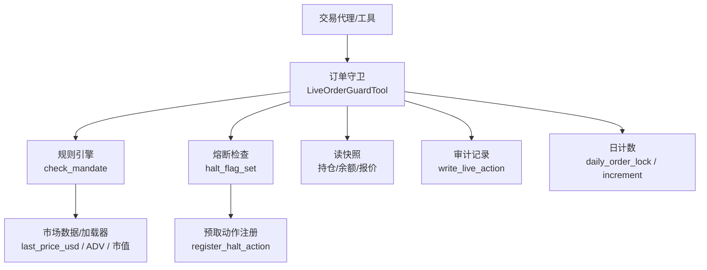
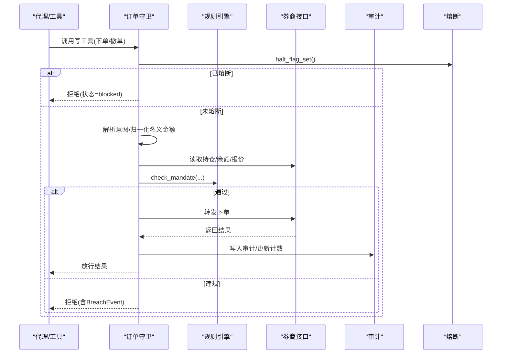
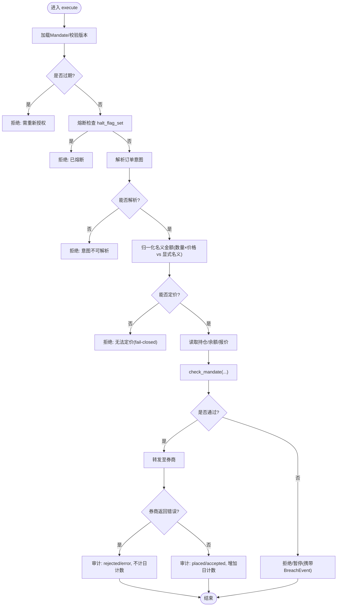
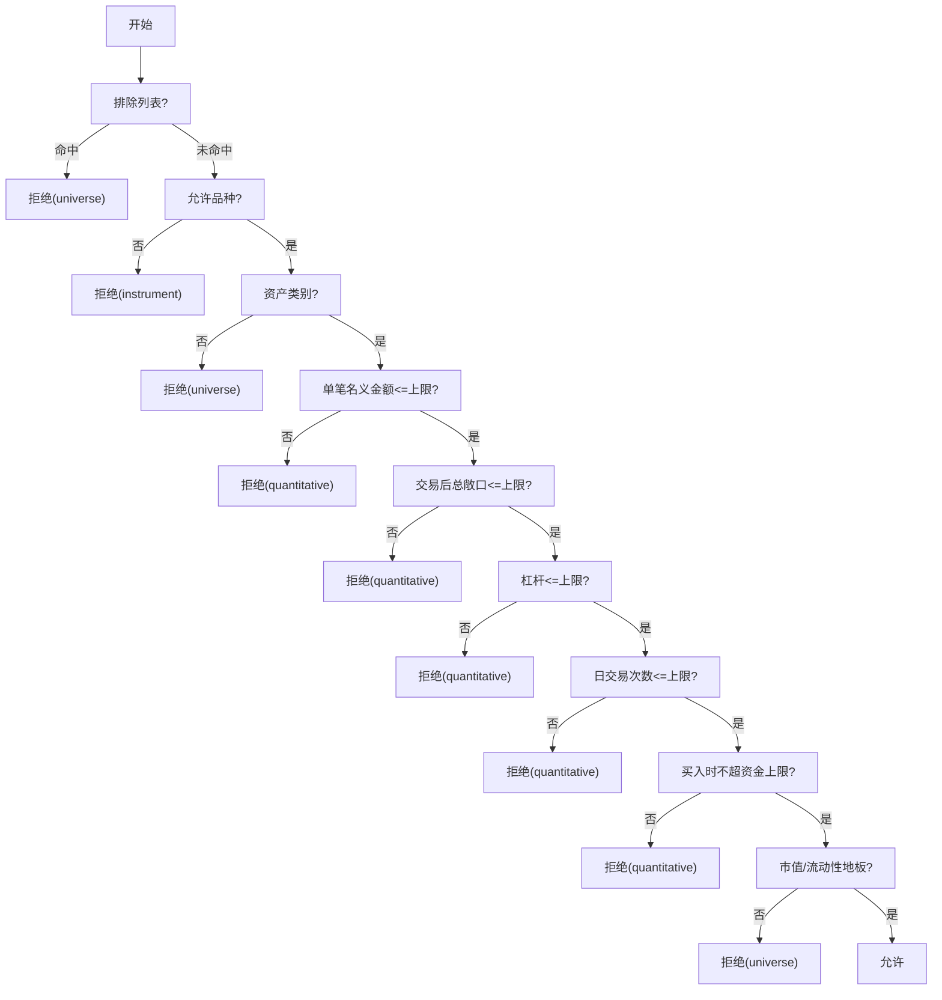
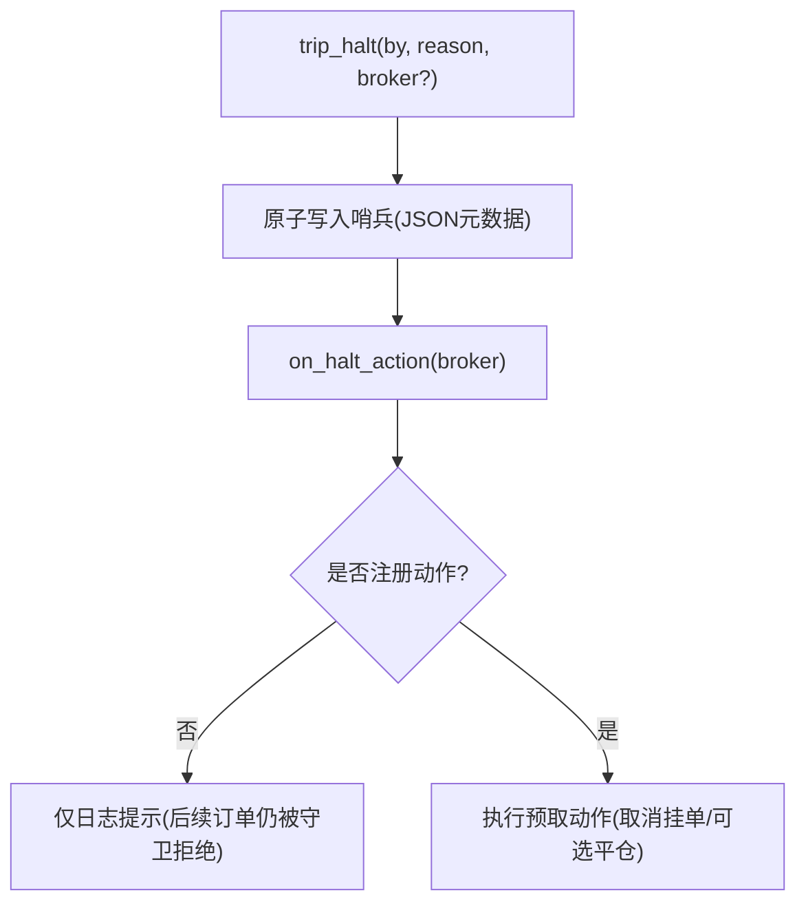
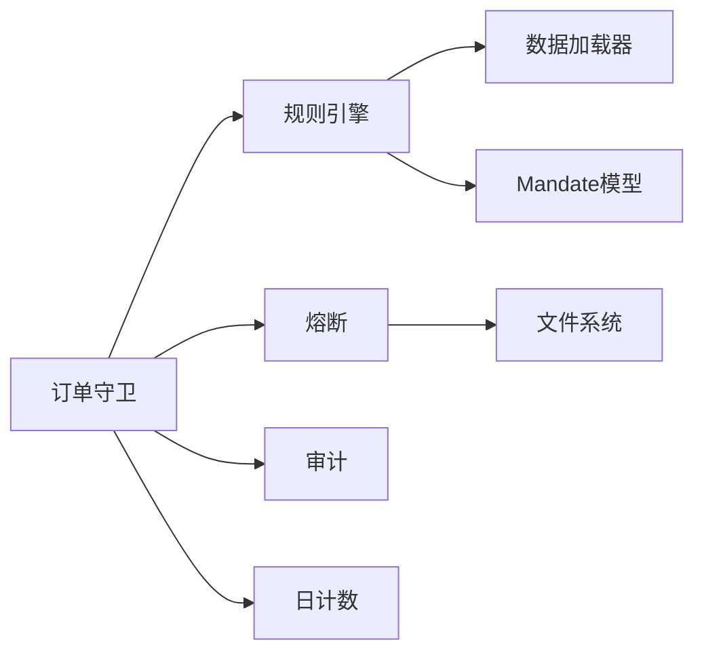

# 风险控制

<cite>
**本文引用的文件**
- [order_guard.py](file://agent/src/live/order_guard.py)
- [halt.py](file://agent/src/live/halt.py)
- [enforcement.py](file://agent/src/live/enforcement.py)
- [daily_count.py](file://agent/src/live/daily_count.py)
- [audit.py](file://agent/src/live/audit.py)
- [model.py](file://agent/src/live/mandate/model.py)
- [risk.py](file://agent/src/quantlib/risk.py)
</cite>

## 目录
1. [简介](#简介)
2. [项目结构](#项目结构)
3. [核心组件](#核心组件)
4. [架构总览](#架构总览)
5. [详细组件分析](#详细组件分析)
6. [依赖关系分析](#依赖关系分析)
7. [性能与实时性](#性能与实时性)
8. [故障排查指南](#故障排查指南)
9. [结论](#结论)
10. [附录：配置与监控清单](#附录：配置与监控清单)

## 简介
本文件面向 Vibe-Trading 风险控制系统，系统性说明订单守卫机制、风控规则引擎与熔断保护策略。内容覆盖：
- 多层风控架构（指令级、组合级、账户级、全局熔断）
- 风险指标计算（VaR/CVaR、回撤、极端分布拟合等）
- 阈值监控与自动干预（拒绝、暂停重授权、紧急止损/平仓）
- 与订单系统的集成方式与实时处理能力
- 误报处理、规则冲突与性能优化建议
- 风控参数配置项、监控指标与告警机制

## 项目结构
Vibe-Trading 的风险控制由“前置守卫 + 规则引擎 + 熔断开关 + 审计与计数”构成，关键路径位于 live 模块与 quantlib 风险度量库：
- 订单守卫：拦截并校验所有写操作（下单/撤单），在调用券商前执行风控检查
- 规则引擎：将订单意图与当前持仓/余额对照硬上限与宇宙约束，输出允许/拒绝/暂停
- 熔断保护：基于文件系统的全局/分券商即时停机，支持预取动作（取消挂单、可选平仓）
- 审计与计数：不可变审计账本、每日订单计数、SSE 事件推送
- 风险度量：历史 VaR/CVaR、参数化 VaR、最大回撤、蒙特卡洛模拟、极值理论尾部拟合

图表来源
- [order_guard.py:97-215](file://agent/src/live/order_guard.py#L97-L215)
- [enforcement.py:455-617](file://agent/src/live/enforcement.py#L455-L617)
- [halt.py:135-163](file://agent/src/live/halt.py#L135-L163)
- [audit.py:248-352](file://agent/src/live/audit.py#L248-L352)
- [daily_count.py:72-135](file://agent/src/live/daily_count.py#L72-L135)

章节来源
- [order_guard.py:1-831](file://agent/src/live/order_guard.py#L1-L831)
- [enforcement.py:1-798](file://agent/src/live/enforcement.py#L1-L798)
- [halt.py:1-281](file://agent/src/live/halt.py#L1-L281)
- [audit.py:1-352](file://agent/src/live/audit.py#L1-L352)
- [daily_count.py:1-135](file://agent/src/live/daily_count.py#L1-L135)
- [model.py:1-149](file://agent/src/live/mandate/model.py#L1-L149)
- [risk.py:1-512](file://agent/src/quantlib/risk.py#L1-L512)

## 核心组件
- 订单守卫（LiveOrderGuardTool）：对每个写工具调用进行前置拦截，顺序执行：加载授权委托 → 过期检查 → 熔断检查 → 解析订单意图 → 获取报价归一化为名义金额 → 读取持仓/余额 → 规则引擎判定 → 放行或拒绝 → 审计与计数
- 规则引擎（check_mandate）：按固定顺序校验排除列表、允许品种、资产类别、单笔名义金额、总敞口、杠杆、日交易次数、资金上限、流动性/市值地板；任何无法解析或缺失数据均拒绝（fail-closed）
- 熔断保护（halt）：通过文件系统哨兵实现即时停机，支持全局与分券商粒度；可注册预取动作以取消挂单/可选平仓
- 审计与计数：不可变审计账本（含链式防篡改副本）、SSE 事件、每日订单计数（原子写入、跨进程锁）
- 风险度量（quantlib.risk）：提供 VaR/CVaR、最大回撤、蒙特卡洛模拟、极值理论尾部拟合，用于策略研究与风控阈值设定

章节来源
- [order_guard.py:97-215](file://agent/src/live/order_guard.py#L97-L215)
- [enforcement.py:455-617](file://agent/src/live/enforcement.py#L455-L617)
- [halt.py:72-163](file://agent/src/live/halt.py#L72-L163)
- [audit.py:172-352](file://agent/src/live/audit.py#L172-L352)
- [daily_count.py:72-135](file://agent/src/live/daily_count.py#L72-L135)
- [risk.py:142-247](file://agent/src/quantlib/risk.py#L142-L247)

## 架构总览
订单从代理侧发起，进入订单守卫后，先做轻量级前置检查（授权、过期、熔断），再读取市场与账户快照，交由规则引擎进行结构化与量化双重校验。通过后才会转发到券商；无论结果如何，都会写入审计并更新计数。熔断可在任意时刻通过文件哨兵触发，运行时观察到后可执行预取动作。

图表来源
- [order_guard.py:130-215](file://agent/src/live/order_guard.py#L130-L215)
- [enforcement.py:455-617](file://agent/src/live/enforcement.py#L455-L617)
- [audit.py:248-352](file://agent/src/live/audit.py#L248-L352)
- [halt.py:135-163](file://agent/src/live/halt.py#L135-L163)

## 详细组件分析

### 订单守卫（LiveOrderGuardTool）
- 职责：在每个写工具调用入口执行 fail-closed 的强制检查序列，确保无有效授权、已过期、熔断、意图不可解析、报价不可得等情况一律拒绝
- 关键流程：
  - 加载 Mandate 并校验版本与有效期
  - 熔断检查：若存在全局或分券商 HALT 文件则拒绝
  - 解析订单意图，并将 quantity 与价格结合归一化为单一 notional_usd，避免绕过名义金额限制
  - 读取持仓与余额快照（走不受守卫保护的读路径）
  - 调用规则引擎 check_mandate，根据 breach.kind 决定 DENY 或 PAUSE_FOR_REAUTH
  - 放行时仅当券商返回非错误信封才计入日计数，并写入审计
- 报价获取：优先使用券商映射的报价读工具，失败则回退到数据加载器获取最近收盘价
- 审计嵌入：在返回给代理的结果中嵌入脱敏后的审计记录键，供 SSE 事件系统消费

图表来源
- [order_guard.py:130-215](file://agent/src/live/order_guard.py#L130-L215)
- [order_guard.py:218-317](file://agent/src/live/order_guard.py#L218-L317)
- [order_guard.py:321-389](file://agent/src/live/order_guard.py#L321-L389)

章节来源
- [order_guard.py:97-215](file://agent/src/live/order_guard.py#L97-L215)
- [order_guard.py:218-317](file://agent/src/live/order_guard.py#L218-L317)
- [order_guard.py:321-389](file://agent/src/live/order_guard.py#L321-L389)

### 风控规则引擎（check_mandate）
- 输入：Mandate、OrderIntent、当前持仓、余额、当日已下单数
- 检查顺序（任一失败即拒绝/暂停）：
  1) 排除列表（最高优先级）
  2) 允许品种白名单
  3) 资产类别（宇宙）约束
  4) 单笔名义金额上限
  5) 交易后总敞口上限（考虑符号方向，卖出先减多头）
  6) 杠杆上限（总敞口/账户资金）
  7) 日交易次数上限
  8) 资金上限（买入时不得超出镜像资金上限）
  9) 市值/流动性地板（如配置）
- 失败类型：
  - 结构性违规（universe/instrument）：直接拒绝
  - 量化违规（quantitative）：暂停并要求重新授权（携带 BreachEvent）
- 失败关闭：任何无法解析的数据或缺失市场数据均拒绝

图表来源
- [enforcement.py:455-617](file://agent/src/live/enforcement.py#L455-L617)

章节来源
- [enforcement.py:455-617](file://agent/src/live/enforcement.py#L455-L617)

### 熔断保护（halt）
- 机制：基于文件系统哨兵的全局/分券商即时停机，独立于 LLM/代理状态
- 文件约定：
  - 全局：<runtime_root>/live/HALT
  - 分券商：<runtime_root>/live/<broker>/HALT
- 语义：只要文件存在即视为已熔断；JSON 负载仅用于审计溯源
- 能力：
  - trip_halt/clear_halt：原子写入/删除哨兵
  - halt_flag_set：纯文件检查，fail-closed
  - on_halt_action：观察熔断后执行预取动作（取消挂单、可选按 Mandate 配置平仓）

图表来源
- [halt.py:72-108](file://agent/src/live/halt.py#L72-L108)
- [halt.py:135-163](file://agent/src/live/halt.py#L135-L163)
- [halt.py:218-281](file://agent/src/live/halt.py#L218-L281)

章节来源
- [halt.py:72-163](file://agent/src/live/halt.py#L72-L163)
- [halt.py:218-281](file://agent/src/live/halt.py#L218-L281)

### 审计与日计数
- 审计：
  - 不可变追加式账本（audit.jsonl），默认同时写入链式防篡改副本（audit_chain.jsonl）
  - 每条记录包含会话、行为种类、结果、网关决策、请求/响应（脱敏）等
  - 支持 SSE 事件回调，便于前端/CLI 实时展示
- 日计数：
  - 按 UTC 日历日统计每券商订单数，原子写入，跨进程互斥锁
  - 仅在成功且非错误的券商响应后才递增计数

章节来源
- [audit.py:172-352](file://agent/src/live/audit.py#L172-L352)
- [daily_count.py:72-135](file://agent/src/live/daily_count.py#L72-L135)

### 风险指标计算（quantlib.risk）
- 历史 VaR/CVaR：基于排序样本的分位数与尾部均值，保证 CVaR ≥ VaR
- 参数化 VaR：正态假设下的 VaR，适合快速估算但可能低估厚尾风险
- 最大回撤分析：定位峰值-谷值、恢复点及持续时间
- 蒙特卡洛模拟：几何布朗运动路径生成与终端分布统计
- 极值理论（GPD）：对损失尾部拟合广义帕累托分布，判断尾部肥瘦

这些指标可用于：
- 设定动态阈值（如基于 VaR 的动态名义金额/敞口限制）
- 评估策略尾部风险，指导熔断与降级策略
- 作为顾问层（advisory）的参考信号（只读，不阻断）

章节来源
- [risk.py:142-247](file://agent/src/quantlib/risk.py#L142-L247)
- [risk.py:250-327](file://agent/src/quantlib/risk.py#L250-L327)
- [risk.py:329-427](file://agent/src/quantlib/risk.py#L329-L427)
- [risk.py:430-512](file://agent/src/quantlib/risk.py#L430-L512)

## 依赖关系分析
- 订单守卫依赖：
  - 熔断检查：halt_flag_set
  - 规则引擎：check_mandate
  - 数据源：券商读工具与数据加载器（报价、持仓、余额）
  - 审计与计数：write_live_action、daily_order_lock/read/increment
- 规则引擎依赖：
  - 数据加载器：last_price_usd、avg_daily_dollar_volume、market_cap_usd
  - 模型定义：InstrumentType、AssetClass、Mandate、HardCaps、UniverseConstraint
- 熔断依赖：
  - 文件系统路径：live_root、broker_dir
  - 预取动作注册：register_halt_action/on_halt_action

图表来源
- [order_guard.py:97-215](file://agent/src/live/order_guard.py#L97-L215)
- [enforcement.py:455-617](file://agent/src/live/enforcement.py#L455-L617)
- [halt.py:135-163](file://agent/src/live/halt.py#L135-L163)
- [audit.py:248-352](file://agent/src/live/audit.py#L248-L352)
- [daily_count.py:72-135](file://agent/src/live/daily_count.py#L72-L135)
- [model.py:46-149](file://agent/src/live/mandate/model.py#L46-L149)

章节来源
- [order_guard.py:97-215](file://agent/src/live/order_guard.py#L97-L215)
- [enforcement.py:455-617](file://agent/src/live/enforcement.py#L455-L617)
- [halt.py:135-163](file://agent/src/live/halt.py#L135-L163)
- [audit.py:248-352](file://agent/src/live/audit.py#L248-L352)
- [daily_count.py:72-135](file://agent/src/live/daily_count.py#L72-L135)
- [model.py:46-149](file://agent/src/live/mandate/model.py#L46-L149)

## 性能与实时性
- 实时性保障：
  - 熔断为纯文件检查，零 CPU 开销，毫秒级生效
  - 订单守卫在读快照与报价时采用“首选券商读工具，失败回退数据加载器”的策略，减少网络延迟影响
  - 日计数使用原子写入与平台级互斥锁，避免并发竞态
- 性能优化建议：
  - 报价缓存：对高频标的可引入短期缓存以降低数据加载器压力
  - 批量读取：合并多标的报价请求（若券商支持）
  - 规则短路：将高命中率的结构检查（排除列表、品种白名单）置于最前
  - 异步审计：将链式账本写入与 SSE 事件发送解耦为主流程外任务，降低主路径延迟
  - 数据源降级：在市场数据不可用时严格 fail-closed，避免昂贵重试

[本节为通用性能讨论，不直接分析具体文件]

## 故障排查指南
- 常见拒绝原因与定位：
  - 无有效授权或已过期：检查 Mandate 版本与 expires_at
  - 熔断触发：检查 <runtime_root>/live/HALT 或 <broker>/HALT 是否存在
  - 意图不可解析：检查工具入参是否符合预期
  - 无法定价：确认券商报价工具或数据加载器可用
  - 规则违规：查看 BreachEvent 中的 limit、attempted_value、overage
- 审计与追踪：
  - 查看 audit.jsonl 与 audit_chain.jsonl 获取完整链路
  - 关注 SSE 事件 live.action 的实时流
- 日计数异常：
  - 检查 trade_counter.json 的日期与计数字段
  - 确认跨进程锁是否可用（POSIX fcntl 或 Windows msvcrt）
- 熔断恢复：
  - 使用 clear_halt 删除对应哨兵文件
  - 如需自动平仓，确保已注册预取动作

章节来源
- [order_guard.py:471-573](file://agent/src/live/order_guard.py#L471-L573)
- [audit.py:248-352](file://agent/src/live/audit.py#L248-L352)
- [daily_count.py:106-135](file://agent/src/live/daily_count.py#L106-L135)
- [halt.py:111-163](file://agent/src/live/halt.py#L111-L163)

## 结论
Vibe-Trading 的风险控制体系以“订单守卫 + 规则引擎 + 熔断保护 + 审计计数”为核心，形成多层防御：
- 指令级：排除列表、品种/资产类别、单笔名义金额
- 组合级：总敞口、杠杆、市值/流动性地板
- 账户级：资金上限、日交易次数
- 全局级：文件系统熔断，支持预取动作
该设计遵循 fail-closed 原则，确保在任何数据缺失或异常情况下优先拒绝，保障资金安全。配合审计与 SSE 事件，可实现全链路可追溯与实时监控。

[本节为总结性内容，不直接分析具体文件]

## 附录：配置与监控清单

### 风控参数（来自 Mandate 模型）
- 硬上限（HardCaps）
  - account_funding_usd：账户资金上限（券商侧绝对天花板，本地镜像用于数学计算）
  - max_order_notional_usd：单笔名义金额上限
  - max_total_exposure_usd：交易后总敞口上限
  - max_leverage：杠杆倍数上限
  - allowed_instruments：允许的品种类型（空表示全部拒绝）
  - max_trades_per_day：UTC 日交易次数上限
- 宇宙约束（UniverseConstraint）
  - asset_classes：允许的资产类别
  - min_market_cap_usd：市值下限
  - min_avg_daily_volume_usd：日均成交金额下限
  - exclude_symbols：排除代码表（优先级最高）
- 同意元信息（ConsentMeta）
  - created_at、consent_token_sha256、broker、account_ref、expires_at

章节来源
- [model.py:46-149](file://agent/src/live/mandate/model.py#L46-L149)

### 监控指标与告警
- 实时指标
  - 熔断状态：halt_flag_set 返回值
  - 日计数：read_daily_count
  - 审计事件：live.action 事件流
- 建议告警
  - 熔断触发：立即通知运维/交易员
  - 频繁拒绝：统计拒绝原因分布，识别规则冲突或数据问题
  - 数据源不可用：报价/ADV/市值不可用导致拒绝率上升
  - 审计链异常：chain ledger 写入失败或链断裂

章节来源
- [halt.py:135-163](file://agent/src/live/halt.py#L135-L163)
- [daily_count.py:106-135](file://agent/src/live/daily_count.py#L106-L135)
- [audit.py:248-352](file://agent/src/live/audit.py#L248-L352)

### 与订单系统集成与实时处理
- 集成点
  - 写工具入口：LiveOrderGuardTool.execute 对所有写操作进行前置拦截
  - 读工具路径：直接通过 MCPServerAdapter.call_tool，不受守卫影响
  - 券商返回：仅当非错误信封才计入日计数，错误情况审计但不消耗计数
- 实时处理
  - 熔断：文件哨兵即时生效
  - 审计：同步写入账本，可选链式副本；SSE 事件实时推送
  - 报价：优先券商读工具，失败回退数据加载器

章节来源
- [order_guard.py:130-215](file://agent/src/live/order_guard.py#L130-L215)
- [order_guard.py:321-389](file://agent/src/live/order_guard.py#L321-L389)
- [audit.py:248-352](file://agent/src/live/audit.py#L248-L352)