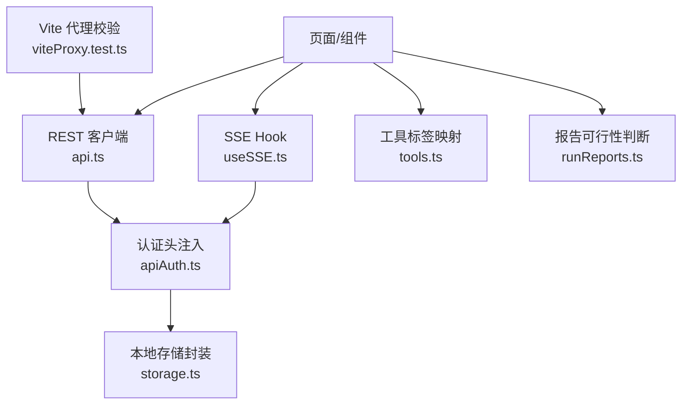
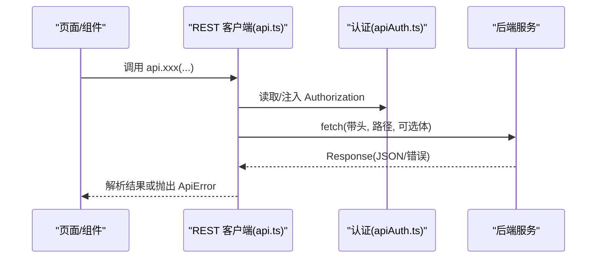
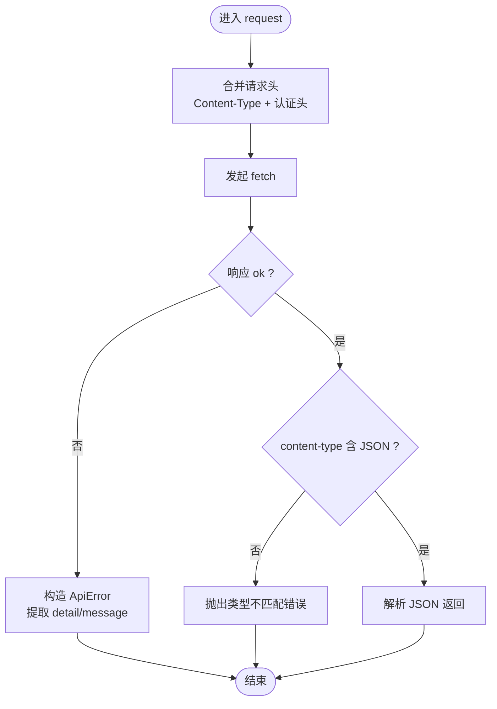
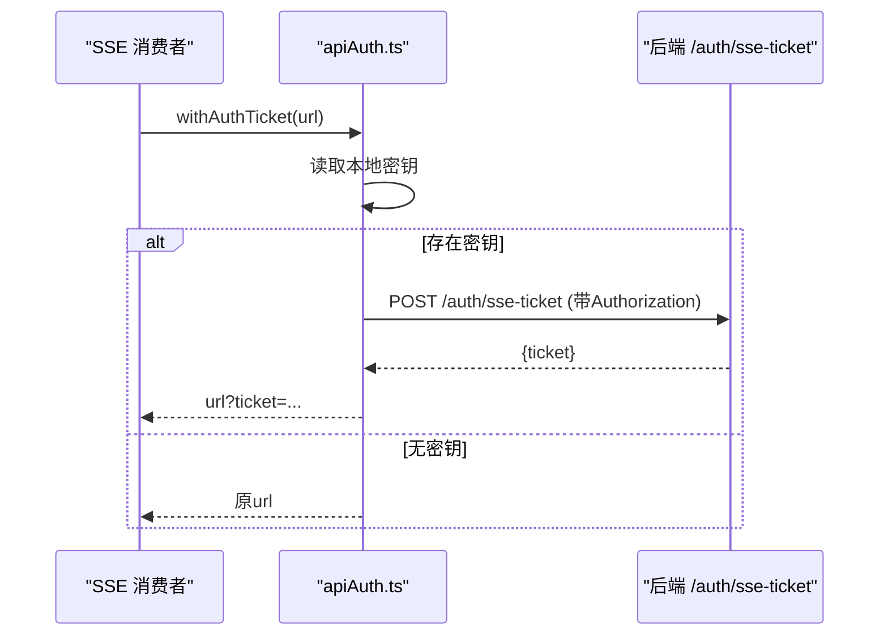
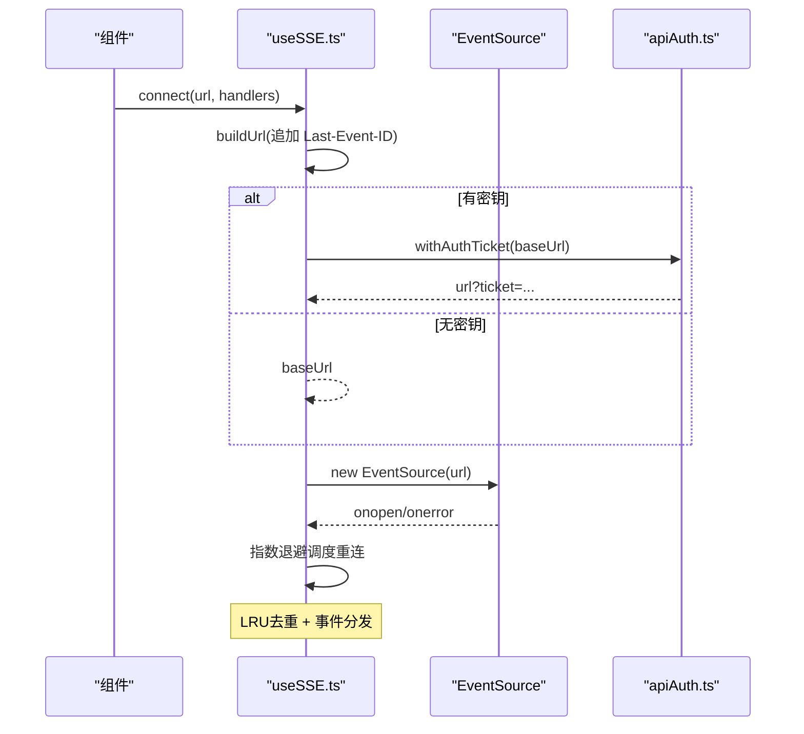
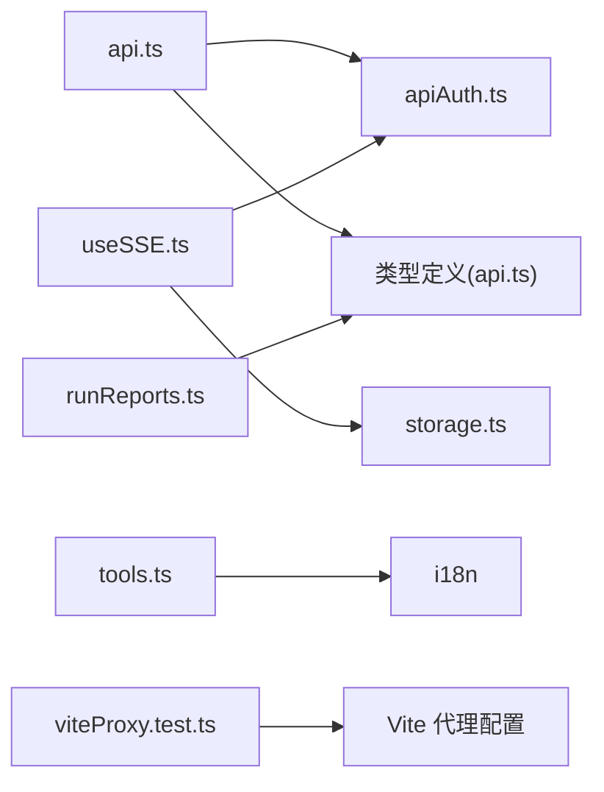

# API集成

<cite>
**本文引用的文件**
- [frontend/src/lib/api.ts](file://frontend/src/lib/api.ts)
- [frontend/src/lib/apiAuth.ts](file://frontend/src/lib/apiAuth.ts)
- [frontend/src/hooks/useSSE.ts](file://frontend/src/hooks/useSSE.ts)
- [frontend/src/lib/tools.ts](file://frontend/src/lib/tools.ts)
- [frontend/src/lib/runReports.ts](file://frontend/src/lib/runReports.ts)
- [frontend/src/lib/storage.ts](file://frontend/src/lib/storage.ts)
- [frontend/src/__tests__/viteProxy.test.ts](file://frontend/src/__tests__/viteProxy.test.ts)
</cite>

## 目录
1. [简介](#简介)
2. [项目结构](#项目结构)
3. [核心组件](#核心组件)
4. [架构总览](#架构总览)
5. [详细组件分析](#详细组件分析)
6. [依赖关系分析](#依赖关系分析)
7. [性能考虑](#性能考虑)
8. [故障排查指南](#故障排查指南)
9. [结论](#结论)
10. [附录](#附录)

## 简介
本文件面向 Vibe-Trading 前端应用的API集成层，系统化说明REST API调用封装、认证机制与错误处理策略；记录工具调用接口、报告生成相关能力、实时数据流（WebSocket/SSE）的集成方式；并给出请求拦截器、响应处理器、重试机制、API版本管理、缓存策略与性能优化方案。同时提供最佳实践与调试指南，重点覆盖连接管理、流式数据处理与错误恢复。

## 项目结构
前端API集成主要位于以下模块：
- REST 客户端与类型定义：api.ts
- 认证与SSE票据：apiAuth.ts
- SSE Hook（自动重连、去重、断点续传）：useSSE.ts
- 工具名称本地化映射：tools.ts
- 报告可行性判断：runReports.ts
- 安全存储封装：storage.ts
- 开发代理配置验证测试：viteProxy.test.ts

图表来源
- [frontend/src/lib/api.ts:72-100](file://frontend/src/lib/api.ts#L72-L100)
- [frontend/src/lib/apiAuth.ts:18-53](file://frontend/src/lib/apiAuth.ts#L18-L53)
- [frontend/src/hooks/useSSE.ts:27-215](file://frontend/src/hooks/useSSE.ts#L27-L215)
- [frontend/src/lib/storage.ts:7-29](file://frontend/src/lib/storage.ts#L7-L29)
- [frontend/src/__tests__/viteProxy.test.ts:5-21](file://frontend/src/__tests__/viteProxy.test.ts#L5-L21)

章节来源
- [frontend/src/lib/api.ts:1-296](file://frontend/src/lib/api.ts#L1-L296)
- [frontend/src/lib/apiAuth.ts:1-54](file://frontend/src/lib/apiAuth.ts#L1-L54)
- [frontend/src/hooks/useSSE.ts:1-216](file://frontend/src/hooks/useSSE.ts#L1-L216)
- [frontend/src/lib/tools.ts:1-47](file://frontend/src/lib/tools.ts#L1-L47)
- [frontend/src/lib/runReports.ts:1-27](file://frontend/src/lib/runReports.ts#L1-L27)
- [frontend/src/lib/storage.ts:1-30](file://frontend/src/lib/storage.ts#L1-L30)
- [frontend/src/__tests__/viteProxy.test.ts:1-22](file://frontend/src/__tests__/viteProxy.test.ts#L1-L22)

## 核心组件
- REST 客户端与统一错误模型
  - 统一的 request 函数负责合并请求头、发起 fetch、非 JSON 内容类型检测、错误对象构造与抛出。
  - ApiError 携带 HTTP 状态码，便于上层区分认证失败与其他错误。
- 认证与票据
  - 通过 authHeaders 将 Bearer Token 注入到每个请求头。
  - 对于 EventSource（SSE），由于浏览器限制无法设置 Authorization，采用 withAuthTicket 换取一次性 ticket 附加到 URL 查询参数。
- SSE Hook
  - 封装 EventSource 生命周期，支持指数退避重连、LRU 事件ID去重、Last-Event-ID 断点续传、状态回调。
- 工具与报告
  - tools.ts 提供工具名称到用户可见文案的映射与本地化。
  - runReports.ts 用于判断一次运行是否具备生成报告的充分数据。

章节来源
- [frontend/src/lib/api.ts:6-100](file://frontend/src/lib/api.ts#L6-L100)
- [frontend/src/lib/apiAuth.ts:18-53](file://frontend/src/lib/apiAuth.ts#L18-L53)
- [frontend/src/hooks/useSSE.ts:27-215](file://frontend/src/hooks/useSSE.ts#L27-L215)
- [frontend/src/lib/tools.ts:1-47](file://frontend/src/lib/tools.ts#L1-L47)
- [frontend/src/lib/runReports.ts:1-27](file://frontend/src/lib/runReports.ts#L1-L27)

## 架构总览
前端通过 api.ts 暴露的命名空间方法访问后端REST接口；所有请求均携带认证头；SSE流通过 useSSE.ts 管理连接与重连；认证票据通过 apiAuth.ts 在需要时动态获取。

图表来源
- [frontend/src/lib/api.ts:72-100](file://frontend/src/lib/api.ts#L72-L100)
- [frontend/src/lib/apiAuth.ts:18-21](file://frontend/src/lib/apiAuth.ts#L18-L21)

章节来源
- [frontend/src/lib/api.ts:72-100](file://frontend/src/lib/api.ts#L72-L100)
- [frontend/src/lib/apiAuth.ts:18-21](file://frontend/src/lib/apiAuth.ts#L18-L21)

## 详细组件分析

### REST 客户端与错误处理
- 请求封装
  - 合并默认 Content-Type 与认证头；支持传入自定义头。
  - 对非 JSON 响应进行严格检查，避免误解析。
- 错误处理
  - 非 ok 响应统一转换为 ApiError，包含 status 与消息。
  - 401/403 会替换为国际化后的“需要认证”提示，便于统一处理。
- 上传与查询参数
  - 提供 uploadFile 以 FormData 上传文件。
  - 使用 appendQueryParam 辅助拼接查询参数，避免重复问号问题。

图表来源
- [frontend/src/lib/api.ts:60-100](file://frontend/src/lib/api.ts#L60-L100)

章节来源
- [frontend/src/lib/api.ts:6-100](file://frontend/src/lib/api.ts#L6-L100)

### 认证机制与SSE票据
- 静态请求
  - 通过 authHeaders 从本地存储读取密钥并注入 Authorization: Bearer <key>。
  - 存储读写通过 storage.ts 的安全封装，避免受限环境抛错导致白屏。
- SSE 票据
  - 由于 EventSource 不支持自定义头，withAuthTicket 先 POST /auth/sse-ticket 换取一次性 ticket，再追加到 URL 查询参数。
  - 无密钥时（本地开发绕过模式）直接返回原URL，零往返。

图表来源
- [frontend/src/lib/apiAuth.ts:23-53](file://frontend/src/lib/apiAuth.ts#L23-L53)
- [frontend/src/lib/storage.ts:7-29](file://frontend/src/lib/storage.ts#L7-L29)

章节来源
- [frontend/src/lib/apiAuth.ts:1-54](file://frontend/src/lib/apiAuth.ts#L1-L54)
- [frontend/src/lib/storage.ts:1-30](file://frontend/src/lib/storage.ts#L1-L30)

### SSE Hook：连接管理、重连与断点续传
- 连接建立
  - 若未存储密钥，直接创建 EventSource；否则先获取 ticket。
  - 维护 lastEventId，重连时附加 Last-Event-ID 实现断点续传。
- 重连策略
  - 指数退避：initialRetryMs * backoffFactor^(attempt-1)，上限 maxRetryMs。
  - LRU 去重：基于 Set + 顺序队列，容量可配，避免重复处理。
- 事件订阅
  - 仅订阅后端实际发出的事件类型，减少无关开销。
- 生命周期
  - connect/disconnect/onStatusChange/getStatus 统一管理。

图表来源
- [frontend/src/hooks/useSSE.ts:63-174](file://frontend/src/hooks/useSSE.ts#L63-L174)
- [frontend/src/lib/apiAuth.ts:36-53](file://frontend/src/lib/apiAuth.ts#L36-L53)

章节来源
- [frontend/src/hooks/useSSE.ts:1-216](file://frontend/src/hooks/useSSE.ts#L1-L216)

### 工具调用接口与本地化
- 工具名到人类可读文案的映射集中管理，支持 i18n 回退。
- 适用于会话中工具调用的展示与日志渲染。

章节来源
- [frontend/src/lib/tools.ts:1-47](file://frontend/src/lib/tools.ts#L1-L47)

### 报告生成相关能力
- isReportWorthyRun 根据运行数据（指标、卡片、权益曲线、交易记录、价格序列、验证结果、附件等）判断是否值得生成报告。
- 该逻辑帮助前端决定是否触发报告导出或展示入口。

章节来源
- [frontend/src/lib/runReports.ts:1-27](file://frontend/src/lib/runReports.ts#L1-L27)

### API 版本管理与路由约定
- 当前代码未显式引入版本前缀；BASE 为空字符串，所有路径相对根路径。
- 建议：如需多版本共存，可在 BASE 或请求构建处增加版本段，并在服务端做路由兼容。

章节来源
- [frontend/src/lib/api.ts:4-5](file://frontend/src/lib/api.ts#L4-L5)

### 缓存策略
- 当前实现未内置通用缓存层；建议在业务层按需缓存只读数据（如设置项、列表），并结合失效策略。
- 注意：SSE 票据为一次性，不应缓存；lastEventId 由 Hook 内部维护。

章节来源
- [frontend/src/lib/api.ts:72-100](file://frontend/src/lib/api.ts#L72-L100)
- [frontend/src/hooks/useSSE.ts:102-106](file://frontend/src/hooks/useSSE.ts#L102-L106)

### 性能优化要点
- 最小化网络往返：SSE 票据仅在必要时获取；重连时使用 Last-Event-ID 减少历史数据重放。
- 事件去重：LRU 集合控制内存占用与重复处理。
- 合理超时与重试：结合后端 SSE 超时配置与指数退避，避免雪崩。
- 类型安全：TS 接口约束减少运行时错误与序列化成本。

章节来源
- [frontend/src/hooks/useSSE.ts:44-56](file://frontend/src/hooks/useSSE.ts#L44-L56)
- [frontend/src/hooks/useSSE.ts:158-174](file://frontend/src/hooks/useSSE.ts#L158-L174)

## 依赖关系分析

图表来源
- [frontend/src/lib/api.ts:1-3](file://frontend/src/lib/api.ts#L1-L3)
- [frontend/src/lib/apiAuth.ts:1-2](file://frontend/src/lib/apiAuth.ts#L1-L2)
- [frontend/src/hooks/useSSE.ts:5-7](file://frontend/src/hooks/useSSE.ts#L5-L7)
- [frontend/src/lib/tools.ts:1-2](file://frontend/src/lib/tools.ts#L1-L2)
- [frontend/src/lib/runReports.ts:1-2](file://frontend/src/lib/runReports.ts#L1-L2)
- [frontend/src/__tests__/viteProxy.test.ts:5-21](file://frontend/src/__tests__/viteProxy.test.ts#L5-L21)

章节来源
- [frontend/src/lib/api.ts:1-3](file://frontend/src/lib/api.ts#L1-L3)
- [frontend/src/lib/apiAuth.ts:1-2](file://frontend/src/lib/apiAuth.ts#L1-L2)
- [frontend/src/hooks/useSSE.ts:5-7](file://frontend/src/hooks/useSSE.ts#L5-L7)
- [frontend/src/lib/tools.ts:1-2](file://frontend/src/lib/tools.ts#L1-L2)
- [frontend/src/lib/runReports.ts:1-2](file://frontend/src/lib/runReports.ts#L1-L2)
- [frontend/src/__tests__/viteProxy.test.ts:5-21](file://frontend/src/__tests__/viteProxy.test.ts#L5-L21)

## 性能考虑
- 网络层面
  - 统一请求封装减少重复代码与错误分支。
  - SSE 重连指数退避降低瞬时压力。
- 内存层面
  - LRU 去重集合限制最大条目数，防止内存增长。
- 渲染层面
  - 仅订阅必要事件类型，减少无用回调。
- 扩展建议
  - 对高频只读接口增加短期缓存与失效策略。
  - 对大体积响应启用分片或分页。

[本节为通用指导，不直接分析具体文件]

## 故障排查指南
- 认证失败
  - 现象：收到 401/403，ApiError 被抛出。
  - 处理：检查本地存储中的密钥是否有效；确认 withAuthTicket 流程是否成功；必要时重新登录刷新密钥。
- SSE 连接失败
  - 现象：onerror 触发，进入重连。
  - 处理：查看是否成功获取 ticket；确认 Last-Event-ID 是否正确传递；检查网络与代理。
- 非 JSON 响应
  - 现象：抛出类型不匹配错误。
  - 处理：确认后端返回 content-type；必要时调整客户端期望或后端输出。
- 存储不可用
  - 现象：localStorage 受限导致读写失败。
  - 处理：确保通过 storage.ts 的安全封装访问；降级为内存态行为。

章节来源
- [frontend/src/lib/api.ts:60-100](file://frontend/src/lib/api.ts#L60-L100)
- [frontend/src/lib/apiAuth.ts:36-53](file://frontend/src/lib/apiAuth.ts#L36-L53)
- [frontend/src/hooks/useSSE.ts:122-174](file://frontend/src/hooks/useSSE.ts#L122-L174)
- [frontend/src/lib/storage.ts:7-29](file://frontend/src/lib/storage.ts#L7-L29)

## 结论
本集成层通过统一的 REST 客户端、严格的错误模型、安全的认证注入与票据交换、以及健壮的 SSE Hook，为前端提供了稳定可靠的API交互能力。配合工具本地化与报告可行性判断，满足日常分析与报告需求。建议在后续迭代中补充通用缓存层与更细粒度的性能监控，进一步提升稳定性与可观测性。

## 附录

### 常用API分类速查
- 会话与会话消息：sessions、messages、cancel、autoTitleSession
- 运行与回溯：runs、getRun、getRunCode、getRunPine
- 定时任务：scheduled-runs CRUD
- 群组智能体：swarm/presets、swarm/runs、swarm/events
- 设置：settings/llm、settings/data-sources
- 通道：channels/status、start、stop、pairing/command
- Alpha Zoo：alpha/list、alpha/{id}、bench、compare、stream
- 连接器运行时：mandate/commit、live/halt、live/resume、live/status、authorize、runner/start|stop

章节来源
- [frontend/src/lib/api.ts:123-296](file://frontend/src/lib/api.ts#L123-L296)

### 调试与最佳实践
- 开发代理
  - 通过测试用例确认关键路由（/channels、/settings/*、/auth）已正确代理至后端。
- 请求调试
  - 利用浏览器开发者工具的 Network 面板观察请求头与响应体；关注 content-type 与错误消息。
- SSE 调试
  - 使用 EventSource 调试工具或控制台打印事件类型与负载；关注 lastEventId 与重连延迟。
- 认证调试
  - 确认本地存储中是否存在有效密钥；必要时清除并重试票据交换。
- 错误处理
  - 捕获 ApiError 并根据 status 分支处理；对 401/403 引导用户重新认证。
- 性能优化
  - 合理使用缓存与分页；避免频繁重建 EventSource；控制去重集合大小。

章节来源
- [frontend/src/__tests__/viteProxy.test.ts:5-21](file://frontend/src/__tests__/viteProxy.test.ts#L5-L21)
- [frontend/src/lib/api.ts:60-100](file://frontend/src/lib/api.ts#L60-L100)
- [frontend/src/hooks/useSSE.ts:158-174](file://frontend/src/hooks/useSSE.ts#L158-L174)