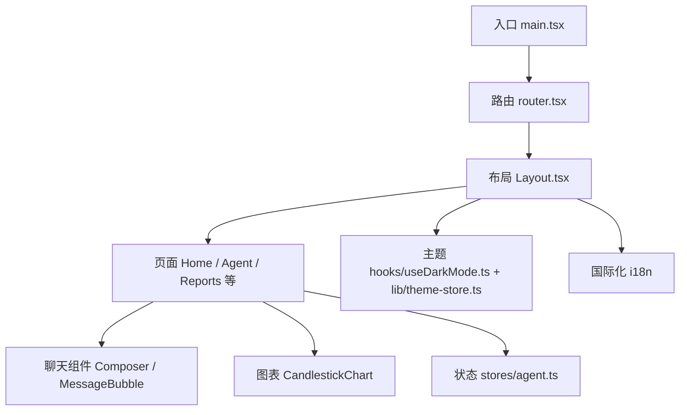
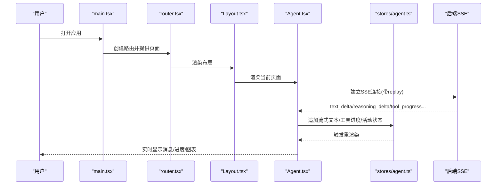
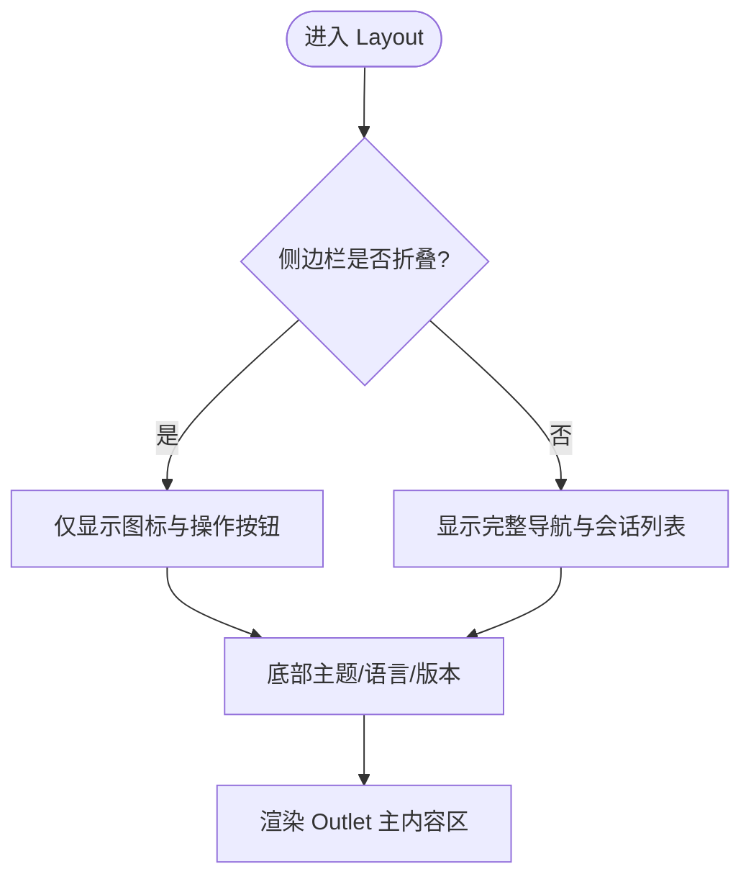
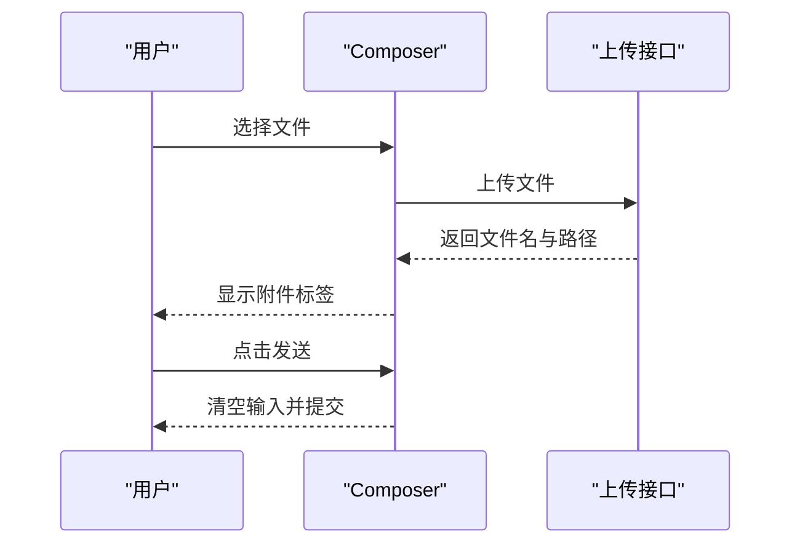
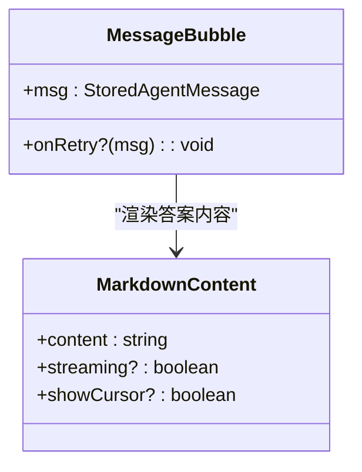
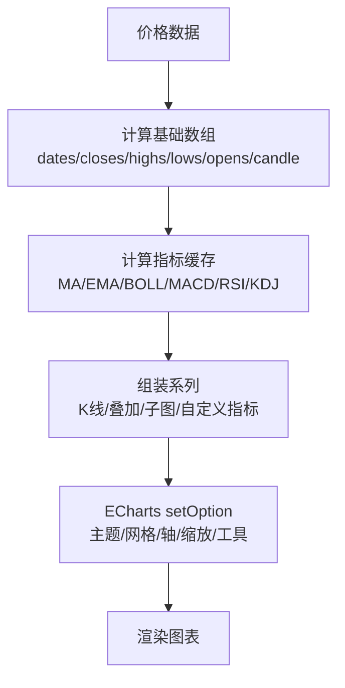
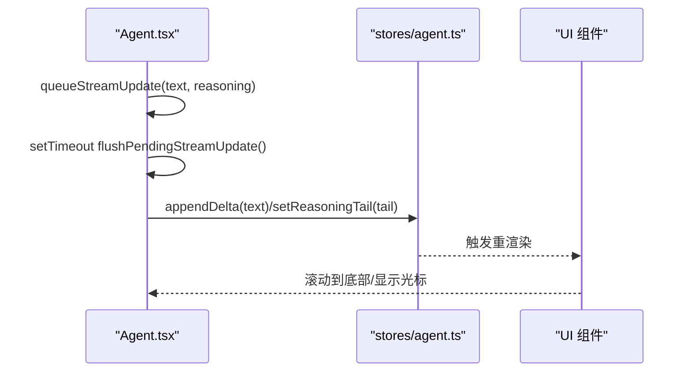
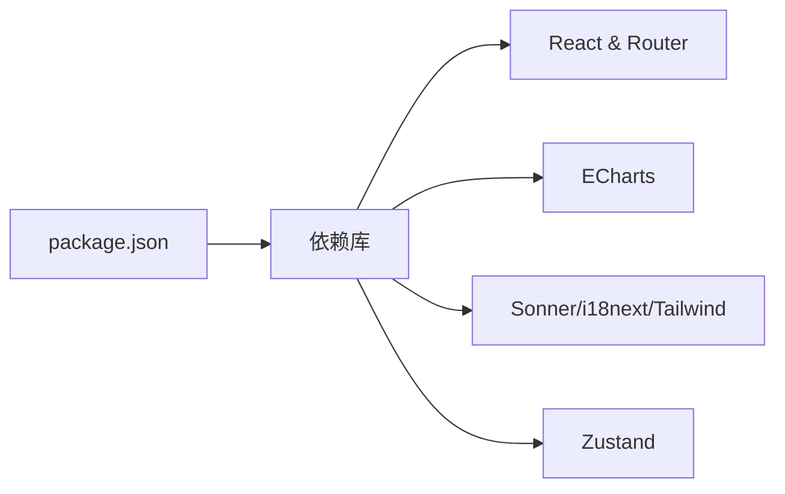

# 前端应用

<cite>
**本文引用的文件**
- [frontend/package.json](file://frontend/package.json)
- [frontend/src/main.tsx](file://frontend/src/main.tsx)
- [frontend/src/router.tsx](file://frontend/src/router.tsx)
- [frontend/src/components/layout/Layout.tsx](file://frontend/src/components/layout/Layout.tsx)
- [frontend/src/pages/Home.tsx](file://frontend/src/pages/Home.tsx)
- [frontend/src/pages/Agent.tsx](file://frontend/src/pages/Agent.tsx)
- [frontend/src/components/chat/MessageBubble.tsx](file://frontend/src/components/chat/MessageBubble.tsx)
- [frontend/src/components/chat/Composer.tsx](file://frontend/src/components/chat/Composer.tsx)
- [frontend/src/components/charts/CandlestickChart.tsx](file://frontend/src/components/charts/CandlestickChart.tsx)
- [frontend/src/stores/agent.ts](file://frontend/src/stores/agent.ts)
- [frontend/src/hooks/useDarkMode.ts](file://frontend/src/hooks/useDarkMode.ts)
- [frontend/src/lib/theme-store.ts](file://frontend/src/lib/theme-store.ts)
- [frontend/tailwind.config.ts](file://frontend/tailwind.config.ts)
</cite>

## 目录
1. [简介](#简介)
2. [项目结构](#项目结构)
3. [核心组件](#核心组件)
4. [架构总览](#架构总览)
5. [详细组件分析](#详细组件分析)
6. [依赖关系分析](#依赖关系分析)
7. [性能考量](#性能考量)
8. [故障排查指南](#故障排查指南)
9. [结论](#结论)
10. [附录](#附录)

## 简介
本文件为 Vibe-Trading 前端应用的 UI 组件文档，聚焦 React 组件的视觉外观、交互行为与状态管理。内容涵盖：
- 组件属性、事件与插槽（通过 props、回调与子树）的使用方式
- 响应式设计与无障碍（a11y）实践
- 主题与样式定制（Tailwind + CSS 变量 + ECharts 主题）
- 跨浏览器兼容性与性能优化策略
- 组件组合模式与页面功能集成（路由、布局、聊天、图表）
- 状态管理（Zustand store）与 SSE 流式更新

## 项目结构
前端采用 Vite + React + TypeScript 构建，使用 TailwindCSS 进行样式组织，ECharts 用于金融图表，i18next 提供多语言支持，Zustand 管理全局状态，React Router 负责路由与懒加载。

**图示来源**
- [frontend/src/main.tsx:1-36](file://frontend/src/main.tsx#L1-L36)
- [frontend/src/router.tsx:1-69](file://frontend/src/router.tsx#L1-L69)
- [frontend/src/components/layout/Layout.tsx:17-315](file://frontend/src/components/layout/Layout.tsx#L17-L315)

**章节来源**
- [frontend/package.json:1-58](file://frontend/package.json#L1-L58)
- [frontend/src/main.tsx:1-36](file://frontend/src/main.tsx#L1-L36)
- [frontend/src/router.tsx:1-69](file://frontend/src/router.tsx#L1-L69)

## 核心组件
- 布局 Layout：侧边栏导航、会话列表、暗色模式切换、语言选择器、连接状态横幅、主内容区 Outlet。
- 聊天 Composer：输入框、附件上传、目标/群聊模式快捷入口、导出、发送/停止控制。
- 消息气泡 MessageBubble：用户/助手消息渲染、Markdown+数学公式、复制、重试提示、运行完成卡片。
- K线图 CandlestickChart：K线、成交量、MACD/RSI/KDJ 子图、叠加指标、时间范围、交易标记、主题联动。
- 首页 Home：营销页，展示特性与步骤引导。

**章节来源**
- [frontend/src/components/layout/Layout.tsx:17-315](file://frontend/src/components/layout/Layout.tsx#L17-L315)
- [frontend/src/components/chat/Composer.tsx:71-413](file://frontend/src/components/chat/Composer.tsx#L71-L413)
- [frontend/src/components/chat/MessageBubble.tsx:1-289](file://frontend/src/components/chat/MessageBubble.tsx#L1-L289)
- [frontend/src/components/charts/CandlestickChart.tsx:1-329](file://frontend/src/components/charts/CandlestickChart.tsx#L1-L329)
- [frontend/src/pages/Home.tsx:1-69](file://frontend/src/pages/Home.tsx#L1-L69)

## 架构总览
- 入口渲染：在 StrictMode 下挂载根节点，注入错误边界、路由与通知中心；启动时预取轻量图表模块以提升首屏体验。
- 路由与懒加载：所有页面通过 lazy() 包裹并统一 Suspense 占位，提升可维护性与性能。
- 布局与导航：Layout 提供全局导航、会话管理、主题与语言切换，并通过 Outlet 承载页面内容。
- 数据流：Agent 页面通过 SSE 接收流式文本、工具调用进度、思考过程与结果，写入 Zustand store，驱动 UI 更新。
- 主题与国际化：useDarkMode 同步 html.dark 类并发布主题变更；i18n 提供多语言文案与 RTL 支持。

**图示来源**
- [frontend/src/main.tsx:11-35](file://frontend/src/main.tsx#L11-L35)
- [frontend/src/router.tsx:40-69](file://frontend/src/router.tsx#L40-L69)
- [frontend/src/components/layout/Layout.tsx:17-315](file://frontend/src/components/layout/Layout.tsx#L17-L315)
- [frontend/src/pages/Agent.tsx:642-784](file://frontend/src/pages/Agent.tsx#L642-L784)
- [frontend/src/stores/agent.ts:119-336](file://frontend/src/stores/agent.ts#L119-L336)

## 详细组件分析

### 布局 Layout
- 视觉与交互
  - 可折叠侧边栏，保留品牌标识、主导航、会话列表、设置与版本信息。
  - 顶部连接状态横幅，展示 SSE 连接与重试次数。
  - 底部语言选择器，固定定位避免被父级 overflow 遮挡。
- 关键能力
  - 会话列表：新增、重命名、删除、活跃态高亮、流式会话旋转指示。
  - 暗色模式：一键切换，持久化到本地存储。
  - 无障碍：跳过链接、aria-label、键盘可达性。
- 常用用法
  - 作为路由外层容器，包裹所有页面。
  - 通过 useAgentStore 订阅 sseStatus/sseRetryAttempt 以显示连接状态。

**图示来源**
- [frontend/src/components/layout/Layout.tsx:97-315](file://frontend/src/components/layout/Layout.tsx#L97-L315)

**章节来源**
- [frontend/src/components/layout/Layout.tsx:17-458](file://frontend/src/components/layout/Layout.tsx#L17-L458)

### 聊天 Composer
- 视觉与交互
  - 输入框自适应高度，支持 Enter 发送、Shift+Enter 换行。
  - 附件上传菜单，限制类型与大小，失败/成功反馈。
  - 目标研究/群聊模式标签，可取消。
  - 运行时状态条与控制面板嵌入。
- 属性与事件
  - streaming: 是否处于生成中（禁用输入与发送）。
  - activityVerb: 当前活动动词，影响占位文案。
  - hasCompletedTurn: 是否已完成一轮对话，影响占位文案。
  - showExport/canExport: 控制导出按钮显隐与可用。
  - goalComposerActive/swarmPreset: 控制目标/群聊模式。
  - onSubmit/onCancel/onExport/onStartGoal/onCancelGoal/onStartSwarm/onCancelSwarm: 各类回调。
- 无障碍与兼容性
  - aria-haspopup/expanded/controls 配合菜单。
  - 输入法防抖处理，避免误提交。
  - 剪贴板 API 降级兼容（execCommand）。

**图示来源**
- [frontend/src/components/chat/Composer.tsx:134-165](file://frontend/src/components/chat/Composer.tsx#L134-L165)
- [frontend/src/components/chat/Composer.tsx:328-413](file://frontend/src/components/chat/Composer.tsx#L328-L413)

**章节来源**
- [frontend/src/components/chat/Composer.tsx:71-413](file://frontend/src/components/chat/Composer.tsx#L71-L413)

### 消息气泡 MessageBubble
- 视觉与交互
  - 用户消息右对齐，助手消息左对齐并附带头像。
  - Markdown 渲染，支持表格、代码高亮、数学公式（KaTeX），流式模式下关闭高亮减少开销。
  - 复制按钮，成功/失败反馈；错误消息提供重试建议与重试按钮。
  - 运行完成卡片（run_complete）由 RunCompleteCard 渲染。
- 属性
  - msg: 消息对象（包含 type/content/meta/elapsed_ms 等）。
  - onRetry: 可选的重试回调。
- 无障碍
  - 复制按钮具备 aria-label 与屏幕阅读器状态提示。

**图示来源**
- [frontend/src/components/chat/MessageBubble.tsx:76-104](file://frontend/src/components/chat/MessageBubble.tsx#L76-L104)
- [frontend/src/components/chat/MessageBubble.tsx:187-289](file://frontend/src/components/chat/MessageBubble.tsx#L187-L289)

**章节来源**
- [frontend/src/components/chat/MessageBubble.tsx:1-289](file://frontend/src/components/chat/MessageBubble.tsx#L1-L289)

### K线图 CandlestickChart
- 视觉与交互
  - 主图：K线 + 叠加指标（MA/EMA/BOLL）+ 交易标记。
  - 子图：成交量/ MACD/ RSI/ KDJ 切换。
  - 时间范围：1M/3M/6M/1Y/ALL。
  - 工具栏：缩放、重置、保存图片。
  - 主题：跟随系统/手动切换，图表颜色动态适配。
- 性能
  - 使用 useMemo 缓存基础数据与指标计算。
  - ResizeObserver + requestAnimationFrame 节流 resize。
  - setOption 增量更新，不销毁实例。
- 无障碍
  - tooltip 提供可读数值；工具栏按钮具备标题与可访问性。

**图示来源**
- [frontend/src/components/charts/CandlestickChart.tsx:53-76](file://frontend/src/components/charts/CandlestickChart.tsx#L53-L76)
- [frontend/src/components/charts/CandlestickChart.tsx:87-110](file://frontend/src/components/charts/CandlestickChart.tsx#L87-L110)
- [frontend/src/components/charts/CandlestickChart.tsx:209-268](file://frontend/src/components/charts/CandlestickChart.tsx#L209-L268)

**章节来源**
- [frontend/src/components/charts/CandlestickChart.tsx:1-329](file://frontend/src/components/charts/CandlestickChart.tsx#L1-L329)

### 首页 Home
- 视觉与交互
  - 居中欢迎区，快速跳转到 Agent 页面。
  - 四步流程卡片与特性卡片网格。
- 用途
  - 营销与引导，非工作区页面。

**章节来源**
- [frontend/src/pages/Home.tsx:1-69](file://frontend/src/pages/Home.tsx#L1-L69)

### 状态管理与页面功能（Agent 页面）
- 状态管理
  - 使用 Zustand store 集中管理消息、会话、工具调用、活动状态、SSE 状态、Swarm 运行状态等。
  - 提供方法：addMessage、appendDelta、loadHistory、startActivity、setActivityState、upsertSwarmStatus、cacheSession、switchSession 等。
- 页面功能
  - 智能滚动：仅在靠近底部时自动滚动，避免打断阅读。
  - 流式合并：text_delta 与 reasoning_delta 按时间窗口合并后批量写入 store，降低重渲染频率。
  - 工具进度合并：tool_progress 按 callId/tool 去重，requestAnimationFrame 一次性刷新。
  - 后台完成检测：当页面不可见时，标题标记完成；恢复可见后恢复标题。
  - 历史回放：加载历史消息时，将工具轨迹转换为时间线消息，并插入回答或运行完成卡片。

**图示来源**
- [frontend/src/pages/Agent.tsx:309-336](file://frontend/src/pages/Agent.tsx#L309-L336)
- [frontend/src/stores/agent.ts:133-148](file://frontend/src/stores/agent.ts#L133-L148)

**章节来源**
- [frontend/src/pages/Agent.tsx:208-800](file://frontend/src/pages/Agent.tsx#L208-L800)
- [frontend/src/stores/agent.ts:1-336](file://frontend/src/stores/agent.ts#L1-L336)

## 依赖关系分析
- 构建与脚本：Vite 开发/构建/预览，TypeScript 编译，Vitest 测试。
- 运行时依赖：React、react-router、echarts、highlight.js、katex、i18next、sonner、tailwind-merge、zustand。
- 样式与主题：Tailwind 扩展颜色、字体、圆角；CSS 变量驱动主题；ECharts 主题通过 theme-store 同步。

**图示来源**
- [frontend/package.json:17-39](file://frontend/package.json#L17-L39)

**章节来源**
- [frontend/package.json:1-58](file://frontend/package.json#L1-L58)

## 性能考量
- 路由懒加载：页面按需加载，减少初始包体积。
- 流式更新合并：
  - text_delta/reasoning_delta 定时合并（约 80ms）后写入 store。
  - tool_progress 按调用 ID 合并并在 rAF 中一次性更新。
- 图表性能：
  - 指标计算 memoize，避免重复计算。
  - ResizeObserver + rAF 节流 resize。
  - setOption 增量更新，避免销毁重建。
- 首屏优化：空闲时预取 MiniEquityChart 模块。
- 内存与清理：
  - 监听 scroll/resize 事件及时移除。
  - 定时器与动画帧在卸载时清理。

[本节为通用指导，无需特定文件引用]

## 故障排查指南
- 连接问题
  - 观察 Layout 顶部连接横幅与 Agent 页面的 toast 提示，检查 sseStatus 与重试次数。
  - 断线重连：SSE 断开会触发 warning，恢复后 success 提示。
- 复制失败
  - MessageBubble 的复制按钮在剪贴板 API 不可用时回退 execCommand，失败时显示错误提示。
- 上传失败
  - Composer 对文件大小与类型进行校验，失败时 toast 提示；上传成功后显示附件标签。
- 图表无数据
  - CandlestickChart 在无数据时显示“无价格数据”提示。

**章节来源**
- [frontend/src/components/layout/Layout.tsx:306-315](file://frontend/src/components/layout/Layout.tsx#L306-L315)
- [frontend/src/pages/Agent.tsx:450-471](file://frontend/src/pages/Agent.tsx#L450-L471)
- [frontend/src/components/chat/MessageBubble.tsx:106-161](file://frontend/src/components/chat/MessageBubble.tsx#L106-L161)
- [frontend/src/components/chat/Composer.tsx:134-165](file://frontend/src/components/chat/Composer.tsx#L134-L165)
- [frontend/src/components/charts/CandlestickChart.tsx:270-272](file://frontend/src/components/charts/CandlestickChart.tsx#L270-L272)

## 结论
该前端应用以清晰的组件分层与职责划分实现了高效的交易研究与可视化界面。通过路由懒加载、流式数据合并、图表性能优化与完善的主题/国际化支持，提供了良好的用户体验与可维护性。建议在后续迭代中继续强化：
- 更细粒度的组件拆分与单元测试覆盖
- 更丰富的图表交互（如拖拽选区、指标参数配置）
- 更完善的错误边界与监控上报

[本节为总结性内容，无需特定文件引用]

## 附录

### 主题与样式定制
- 主题开关：useDarkMode 维护 html.dark 类与 colorScheme，并通过 theme-store 发布变更供图表等消费。
- Tailwind 主题：通过 CSS 变量定义颜色、圆角与字体族，便于全局定制。
- ECharts 主题：根据 isDarkTheme 动态获取配色，保证图表与界面一致。

**章节来源**
- [frontend/src/hooks/useDarkMode.ts:1-80](file://frontend/src/hooks/useDarkMode.ts#L1-L80)
- [frontend/src/lib/theme-store.ts:1-28](file://frontend/src/lib/theme-store.ts#L1-L28)
- [frontend/tailwind.config.ts:1-34](file://frontend/tailwind.config.ts#L1-L34)

### 响应式设计与无障碍
- 响应式：移动端隐藏部分文字、调整间距与布局；图表容器自适应宽度与高度。
- 无障碍：
  - 语义化标签与 aria-* 属性（如 aria-expanded、aria-controls、aria-current）。
  - 键盘可达性（Enter/Escape/Tab 顺序）。
  - 屏幕阅读器友好（sr-only、role/status）。

**章节来源**
- [frontend/src/components/layout/Layout.tsx:97-153](file://frontend/src/components/layout/Layout.tsx#L97-L153)
- [frontend/src/components/chat/Composer.tsx:234-319](file://frontend/src/components/chat/Composer.tsx#L234-L319)
- [frontend/src/components/chat/MessageBubble.tsx:147-161](file://frontend/src/components/chat/MessageBubble.tsx#L147-L161)

### 跨浏览器兼容性与性能优化
- 剪贴板 API 降级：优先使用 navigator.clipboard，回退到 execCommand。
- 空闲回调：使用 requestIdleCallback 预取资源，不支持时回退 setTimeout。
- 事件节流：ResizeObserver + rAF 节流图表 resize。
- 流式合并：减少高频 setState 带来的重渲染压力。

**章节来源**
- [frontend/src/components/chat/MessageBubble.tsx:106-132](file://frontend/src/components/chat/MessageBubble.tsx#L106-L132)
- [frontend/src/main.tsx:11-26](file://frontend/src/main.tsx#L11-L26)
- [frontend/src/components/charts/CandlestickChart.tsx:95-110](file://frontend/src/components/charts/CandlestickChart.tsx#L95-L110)
- [frontend/src/pages/Agent.tsx:309-336](file://frontend/src/pages/Agent.tsx#L309-L336)